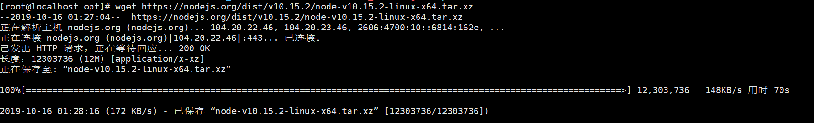
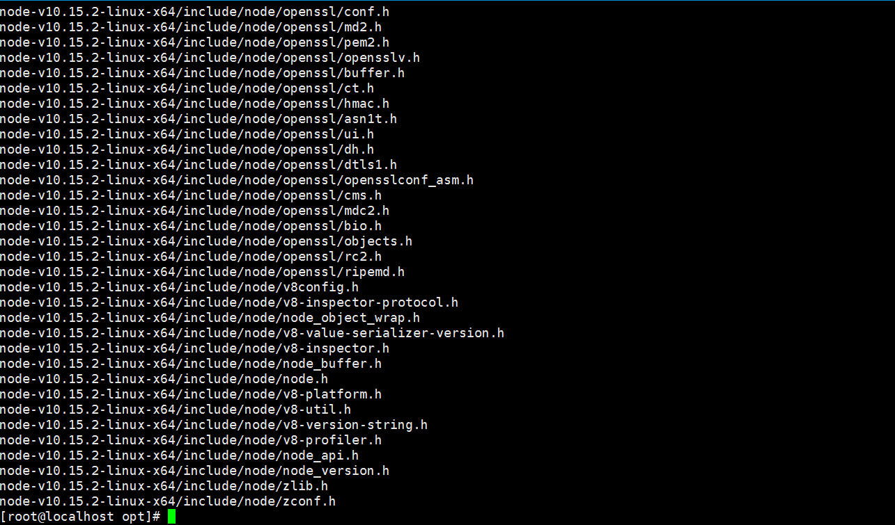
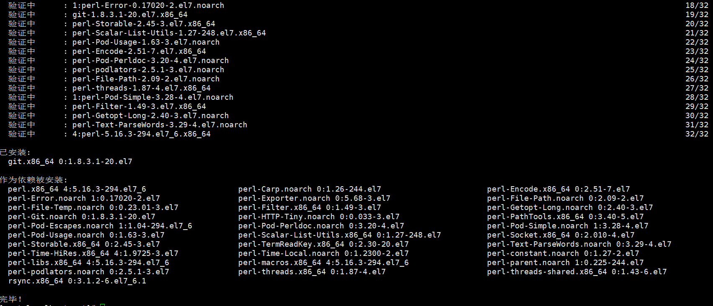
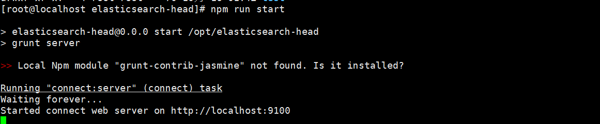
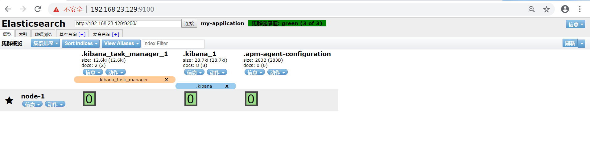

# 1 ElasticSearch 安装

## 1.1 ElasticSearch安装

**1、上传ElasticSearch安装包**

```shell
alt+p # 打开sftp窗口
# 上传es安装包
put e:/software/elasticsearch-7.4.0-linux-x86_64.tar.gz
```


**2、执行解压操作 ，如下图**

```shell
 # 将elasticsearch-7.4.0-linux-x86_64.tar.gz解压到opt文件夹下. -C 大写
 tar -zxvf elasticsearch-7.4.0-linux-x86_64.tar.gz  -C /opt
```

**3、创建普通用户**

因为安全问题，Elasticsearch 不允许root用户直接运行，所以要创建新用户，在root用户中创建新用户,执行如下命令：

```shell
useradd itheima  # 新增itheima用户
passwd  itheima  # 为itheima用户设置密码
```

**5、为新用户授权，如下图**

```shell
chown -R itheima:itheima /opt/elasticsearch-7.4.0 #文件夹所有者
```


将 /opt/elasticsearch-7.4.0文件夹授权给itheima用户，由上图可见，我们的文件夹权限赋给了itheima

**6、修改elasticsearch.yml文件**

```shell
vim /opt/elasticsearch-7.4.0/config/elasticsearch.yml 
```

```shell
# ======================== Elasticsearch Configuration =========================
cluster.name: my-application
node.name: node-1
network.host: 0.0.0.0
http.port: 9200
cluster.initial_master_nodes: ["node-1"]
```

cluster.name：配置elasticsearch的集群名称，默认是elasticsearch。建议修改成一个有意义的名称

node.name：节点名，elasticsearch会默认随机指定一个名字，建议指定一个有意义的名称，方便管理

network.host：设置为0.0.0.0允许外网访问

http.port：Elasticsearch的http访问端口

cluster.initial_master_nodes：初始化新的集群时需要此配置来选举master

**7、修改配置文件**

新创建的itheima用户最大可创建文件数太小，最大虚拟内存太小，切换到root用户，编辑下列配置文件， 添加类似如下内容

```shell
# 切换到root用户
su root 

#1. ===最大可创建文件数太小=======
vim /etc/security/limits.conf 
# 在文件末尾中增加下面内容
itheima soft nofile 65536
itheima hard nofile 65536
# =====
vim /etc/security/limits.d/20-nproc.conf
# 在文件末尾中增加下面内容
itheima soft nofile 65536
itheima hard nofile 65536
*  hard    nproc     4096
# 注：* 代表Linux所有用户名称	

#2. ===最大虚拟内存太小=======
vim /etc/sysctl.conf
# 在文件中增加下面内容
vm.max_map_count=655360
# 重新加载，输入下面命令：
sysctl -p
```

**8、启动elasticsearch**

```shell
su itheima  # 切换到itheima用户启动
cd /opt/elasticsearch-7.4.0/bin
./elasticsearch #启动
```


通过上图我们可以看到elasticsearch已经成功启动


## **1.2 访问elasticsearch**

**1、在访问elasticsearch前，请确保防火墙是关闭的，执行命令：**

```shell
#暂时关闭防火墙
systemctl  stop  firewalld

# 或者

#永久设置防火墙状态
systemctl enable firewalld.service  #打开防火墙永久性生效，重启后不会复原 
systemctl disable firewalld.service #关闭防火墙，永久性生效，重启后不会复原 
```

浏览器输入http://192.168.149.135:9200/，如下图


此时elasticsearch已成功启动：

```
重点几个关注下即可:
number" : "7.4.0"   表示elasticsearch版本
lucene_version" : "8.2.0"  表示lucene版本
name ： 默认启动的时候指定了 ES 实例名称
cluster_name ： 默认名为 elasticsearch
```


# 2 Elasticsearch辅助插件安装

## 2.1 Postman安装

**1、什么是Postman**

Postman是一个http模拟请求的工具。

官网介绍：“Modern software is built on APIs，Postman helps you develop APIs faster”

看得出来，它是一个专门测试 API 的工具，Postman 提供功能强大的 Web API 和 HTTP 请求的调试，它能够发送任何类型的HTTP 请求 (GET, POST, PUT, DELETE…)，并且能附带任何数量的参数和 Headers。不仅如此，它还提供测试数据和环境配置数据的导入导出。

进入官网www.getpostman.com，下载

## 2.2 Kibana安装


**1、什么是Kibana**

Kibana是一个针对Elasticsearch的开源分析及可视化平台，用来搜索、查看交互存储在Elasticsearch索引中的数据。使用Kibana，可以通过各种图表进行高级数据分析及展示。

Kibana让海量数据更容易理解。它操作简单，基于浏览器的用户界面可以快速创建仪表板（dashboard）实时显示Elasticsearch查询动态。

**2、上传kibana**

CRT中克隆一个窗口，上传Kibana

```shell
put ‪E:\software\kibana-7.4.0-linux-x86_64.tar.gz
```

**2、解压kibana**

```shell
tar -xzf kibana-7.4.0-linux-x86_64.tar.gz -C /opt
```

解压到当前目录（/opt）下

**3、修改kibana配置**

```shell
vim /opt/kibana-7.4.0-linux-x86_64/config/kibana.yml
```

```shell
server.port: 5601
server.host: "0.0.0.0"
server.name: "kibana-itcast"
elasticsearch.hosts: ["http://127.0.0.1:9200"]
elasticsearch.requestTimeout: 99999
```

server.port：http访问端口

server.host：ip地址，0.0.0.0表示可远程访问

server.name：kibana服务名

elasticsearch.hosts：elasticsearch地址

elasticsearch.requestTimeout：请求elasticsearch超时时间，默认为30000，此处可根据情况设置

**4、启动kibana**

由于kibana不建议使用root用户启动，如果用root启动，需要加--allow-root参数

```shell
# 切换到kibana的bin目录
cd /opt/kibana-7.4.0-linux-x86_64/bin
# 启动
./kibana --allow-root
```


启动成功。

**5、访问kibana**

1.浏览器输入http://192.168.149.135:5601/，如下图：

```
http://192.168.149.135:5601/
```


看到这个界面，说明Kibanan已成功安装。

`Discover`：可视化查询分析器
 `Visualize`：统计分析图表
 `Dashboard`：自定义主面板（添加图表）
 `Timelion`：Timelion是一个kibana时间序列展示组件（暂时不用）
 `Dev Tools`：Console控制台（同CURL/POSTER，操作ES代码工具，代码提示，很方便）
 `Management`：管理索引库(index)、已保存的搜索和可视化结果(save objects)、设置 kibana 服务器属性。

## 2.3 head安装

> Tips:
> 课后扩展内容

**head简介**

ead插件是ES的一个可视化管理插件，用来监视ES的状态，并通过head客户端和ES服务进行交互，比如创建映射、创建索引等。

在登陆和访问head插件地址和ElasticSearch前需要事先在服务器上安装和配置好ElasticSearch以及head插件。安装完后，默认head插件的web端口为9100，ElasticSearch服务的端口为9200，使用浏览器访问head地址，如[http://IP地址:9100/](http://10.82.25.183:9100/)，推荐使用Chrome浏览器，head插件对Chrome浏览器兼容更佳。进入head页面后将ElasticSearch连接输入框中填写正确的ElasticSearch服务地址，就可以监控ElasticSearch运行信息

### 2.3.1 Node安装

1) 什么是Node

简单的说 Node.js 就是运行在服务端的 JavaScript。Node.js 是一个基于 [Chrome V8](https://developers.google.com/v8/) 引擎的 JavaScript 运行环境。Node.js 使用了一个事件驱动、非阻塞式 I/O 的模型，使其轻量又高效。Node.js 的包管理器 [npm](https://www.npmjs.com/)，是全球最大的开源库生态系统。

2) 下载Node

上一节我们已经安装好了Elasticsearch，接下来我们来安装head插件，由于elasticsearch-head插件是由nodejs语言编写，所以安装elasticsearch-head前需要先安装nodejs。
首先，执行以下命令安装nodejs和grunt

打开虚拟机，执行wget命令下载Node，如下图：

```shell
wget https://nodejs.org/dist/v10.15.2/node-v10.15.2-linux-x64.tar.xz
```



3）解压Node包

```shell
tar xvf node-v10.15.2-linux-x64.tar.xz
```



4）设置软连接

解压文件的 bin 目录底下包含了 node、npm 等命令，我们可以使用 ln 命令来设置软连接：

```shell
 ln -s bin/npm /usr/local/bin/

 ln -s bin/node /usr/local/bin/
```

在/etc/profile中配置好path环境变量

```shell
vi ~/.bash_profile

export NODE_HOME=/opt/nodejs/node-v10.15.2-linux-x64

export PATH=$PATH:$NODE_HOME/bin
```

保存退出，使文件生效

```shell
source ~/.bash_profile
```

 查看node安装版本，执行  node -v  验证安装如下图：


### **2.3.2 grunt安装**

安装grunt（运行在Node.js上面的任务管理器（task runner）），为了获得Grunt的更多产品特性，需要全局安装Grunt's 命令行接口（CLI），使用npm进行安装，如下：

```shell
npm install -g grunt-cli
```


查看grunt版本


输出grunt版本信息，表示安装成功。

### **2.3.3 head安装**

1)  执行命令安装git

```shell
git yum install git -y
```



2) 切换到/opt目录下,执行下面的克隆命令

```shell
git clone git://github.com/mobz/elasticsearch-head.git
```


3) 进入到elasticsearch-head目录

```shell
cd elasticsearch-head
```

4) 运行

在运行之前我们需要修改下elasticsearch.yml，因为ES默认不开启跨域访问，需要添加以下配置：

```shell
#开启cors跨域访问支持，默认为false 
http.cors.enabled: true
#跨域访问允许的域名地址，(允许所有域名)以上使用正则
http.cors.allow-origin: "*"
```

然后开始执行运行命令：

```shell
npm run start
```



5) 访问head

浏览器输入ip:port:9100，如下图



看到这个界面说明我们的head插件成功安装并且成功连接Elasticsearch。


