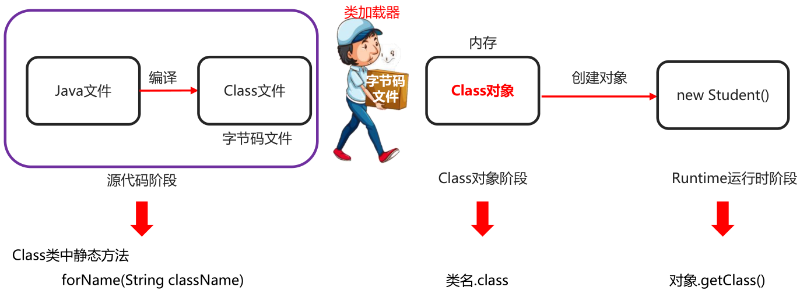

# 1. 类加载器

## 1.1 类加载器概述

作用：负责将.class文件（存储的物理文件）加载在到内存中


## 1. 2 类加载的过程

### 1）类加载时机

+ 创建类的实例（对象）
+ 调用类的类方法
+ 访问类或者接口的类变量，或者为该类变量赋值
+ 使用反射方式来强制创建某个类或接口对应的java.lang.Class对象
+ 初始化某个类的子类
+ 直接使用java.exe命令来运行某个主类

==用到类的时候就会加载==

### 2）类加载过程

#### 1. 加载

+ 通过包名 + 类名，获取这个类，准备用流进行传输
+ 在这个类加载到内存中
+ 加载完毕创建一个class对象


#### 2. 验证

确保Class文件字节流中包含的信息符合当前虚拟机的要求，并且不会危害虚拟机自身安全

(文件中的信息是否符合虚拟机规范有没有安全隐患)


#### 3. 准备

负责为类的类变量（被static修饰的变量）分配内存，并设置默认初始化值

(初始化静态变量)


#### 4. 解析

将类的二进制数据流中的符号引用替换为直接引用

(本类中如果用到了其他类，此时就需要找到对应的类)


#### 5. 初始化

根据程序员通过程序制定的主观计划去初始化类变量和其他资源

(静态变量赋值以及初始化其他资源)


### 3）小结

+ 当一个类被使用的时候，才会加载到内存
+ 类加载的过程: 加载、验证、准备、解析、初始化

## 1.3 类加载的分类


+ **Bootstrap class loader：**虚拟机的内置类加载器，使用C、C++语言编写，通过Java代码获取不到（null） 
+ **Platform class loader：**平台类加载器,负责加载JDK中一些特殊的模块
+ **System class loader：**系统类加载器,负责加载用户类路径上所指定的类库

+ 代码演示

  ```java
  public class ClassLoaderDemo1 {
      public static void main(String[] args) {
          //获取系统类加载器
          ClassLoader systemClassLoader = ClassLoader.getSystemClassLoader();

          //获取系统类加载器的父加载器 --- 平台类加载器
          ClassLoader classLoader1 = systemClassLoader.getParent();

          //获取平台类加载器的父加载器 --- 启动类加载器
          ClassLoader classLoader2 = classLoader1.getParent();

          System.out.println("系统类加载器" + systemClassLoader);
          System.out.println("平台类加载器" + classLoader1);
          System.out.println("启动类加载器" + classLoader2);

      }
  }
  ```

## 1.4 双亲委派模型

如果一个类加载器收到了类加载请求，它并不会自己先去加载，而是把这个请求委托给父类的加载器去执行，如果父类加载器还存在其父类加载器，则进一步向上委托，依次递归，请求最终将到达顶层的启动类加载器，如果父类加载器可以完成类加载任务，就成功返回，倘若父类加载器无法完成此加载任务，子加载器才会尝试自己去加载，这就是双亲委派模式。


==双亲委派的作用：==

1. 防止重复加载同一个`.class`。
2. 保证核心`.class`不能被篡改。通过委托方式，不会去篡改核心`.class`，即使篡改也不会去加载，即使加载也不会是同一个`.class`对象了。不同的加载器加载同一个`.class`也不是同一个`Class`对象。这样保证了`Class`执行安全。

## 1.5 ClassLoader的API

### 1）方法介绍

| 方法名                                      | 说明        |
| ---------------------------------------- | --------- |
| public static ClassLoader getSystemClassLoader() | 获取系统类加载器  |
| public InputStream getResourceAsStream(String name) | 加载某一个资源文件 |

### 2）示例代码

通过<u>系统类加载器</u>来加载文件流

```java
public class ClassLoaderDemo2 {
    public static void main(String[] args) throws IOException {
        //static ClassLoader getSystemClassLoader() 获取系统类加载器
        //InputStream getResourceAsStream(String name)  加载某一个资源文件

        //获取系统类加载器
        ClassLoader systemClassLoader = ClassLoader.getSystemClassLoader();

        //利用加载器去加载一个指定的文件
        //参数：文件的路径（放在src的根目录下，默认去那里加载）
        //返回值：字节流。
        InputStream is = systemClassLoader.getResourceAsStream("prop.properties");

        Properties prop = new Properties();
        prop.load(is);

        System.out.println(prop);

        is.close();
    }
}
```

# 2. 反射

### 2.1 反射的概述

#### 1）什么是反射

反射之中包含了一个「反」字，所以想要解释反射就必须先从「正」开始解释。

一般情况下，我们使用某个类时必定知道它是什么类，是用来做什么的。于是我们直接对这个类进行实例化，之后使用这个类对象进行操作。

```
Apple apple = new Apple(); //直接初始化，「正射」
apple.setPrice(4);
```

上面这样子进行类对象的初始化，我们可以理解为「正」。

而反射则是一开始并不知道我要初始化的类对象是什么，自然也无法使用 new 关键字来创建对象了。

这时候，我们使用 JDK 提供的反射 API 进行反射调用：

```java
Class clz = Class.forName("com.chenshuyi.reflect.Apple");
Method method = clz.getMethod("setPrice", int.class);
Constructor constructor = clz.getConstructor();
Object object = constructor.newInstance();
method.invoke(object, 4);
```

上面两段代码的执行结果，其实是完全一样的。但是其思路完全不一样，第一段代码在未运行时就已经确定了要运行的类（Apple），而第二段代码则是在运行时通过字符串值才得知要运行的类（com.itheima.reflect.Apple）。

==反射就是在运行时才知道要操作的类是什么，并且可以在运行时获取类的完整构造，并调用对应的方法。==

#### 2）反射的作用

* 程序运行时，对于任意一个类，都能够==动态获取==这个类的所有属性和方法。
* 程序运行时，对于任意一个对象，都能够==动态调用==对象的任意属性和方法。

### 2.2 获取Class类对象

#### 1）三种方式



获取Class类对象的三种方式：
+ 类名.class属性

+ 对象名.getClass()方法

+ Class.forName(全类名)方法


#### 2）示例代码

* 一个简单的Student类

```java
public class Student {
    private String name;
    private int age;

    public Student() {
    }

    public Student(String name, int age) {
        this.name = name;
        this.age = age;
    }

    public String getName() {
        return name;
    }

    public void setName(String name) {
        this.name = name;
    }

    public int getAge() {
        return age;
    }

    public void setAge(int age) {
        this.age = age;
    }

    public void study(){
        System.out.println("学生在学习");
    }

    @Override
    public String toString() {
        return "Student{" +
                "name='" + name + '\'' +
                ", age=" + age +
                '}';
    }
}
```

* 获取Person类的Class对象

```java
public class ReflectDemo1 {
    public static void main(String[] args) throws ClassNotFoundException {
        //1.Class类中的静态方法forName("全类名")
        Class clazz = Class.forName("com.itheima.myreflect2.Student");	//全类名:包名 + 类名
        System.out.println(clazz);

        //2.通过class属性来获取
        Class clazz2 = Student.class;
        System.out.println(clazz2);

        //3.利用对象的getClass方法来获取class对象
        Student s = new Student();
        Class clazz3 = s.getClass();	//getClass方法是定义在Object类中.
        System.out.println(clazz3);

        System.out.println(clazz == clazz2);
        System.out.println(clazz2 == clazz3);
    }
}
```

### 2.3 反射操作构造方法

#### 1）获取构造方法

##### 1. API介绍

| 方法名                                                       | 说明                           |
| ------------------------------------------------------------ | ------------------------------ |
| Constructor<?>[]  getConstructors()                          | 返回所有公共构造方法对象的数组 |
| Constructor<?>[]  getDeclaredConstructors()                  | 返回所有构造方法对象的数组     |
| Constructor<T>  getConstructor(Class<?>... parameterTypes)   | 返回单个公共构造方法对象       |
| Constructor<T>  getDeclaredConstructor(Class<?>... parameterTypes) | 返回单个构造方法对象           |

##### 2. 示例代码

* 一个简单的Student类

```java
public class Student {
    private String name;
    private int age;

    //3. 私有的有参构造方法
    private Student(String name) {
        System.out.println("name的值为:" + name);
        System.out.println("private...Student...有参构造方法");
    }

    //2. 公共的无参构造方法
    public Student() {
        System.out.println("public...Student...无参构造方法");
    }

    //1. 公共的有参构造方法
    public Student(String name, int age) {
        System.out.println("name的值为:" + name + "age的值为:" + age);
        System.out.println("public...Student...有参构造方法");
    }
}
```

* 获取构造方法

```java
public class ReflectDemo1 {
    public static void main(String[] args) throws ClassNotFoundException, NoSuchMethodException {
        //method1();
        //method2();
        //method3();
        //method4();
    }

    //4. 返回单个构造方法对象
    private static void method4() throws ClassNotFoundException, NoSuchMethodException {
        Class clazz = Class.forName("com.itheima.myreflect3.Student");
        Constructor constructor = clazz.getDeclaredConstructor(String.class);
        System.out.println(constructor);
    }

    //3. 返回单个公共构造方法对象
    private static void method3() throws ClassNotFoundException, NoSuchMethodException {
        Class clazz = Class.forName("com.itheima.myreflect3.Student");
        //小括号中,一定要跟构造方法的形参保持一致.
        Constructor constructor1 = clazz.getConstructor();
        System.out.println(constructor1);

        Constructor constructor2 = clazz.getConstructor(String.class, int.class);
        System.out.println(constructor2);

        //因为Student类中,没有只有一个int的构造,所以这里会报错.
        Constructor constructor3 = clazz.getConstructor(int.class);
        System.out.println(constructor3);
    }

    //2. 返回所有构造方法对象的数组
    private static void method2() throws ClassNotFoundException {
        Class clazz = Class.forName("com.itheima.myreflect3.Student");
        Constructor[] constructors = clazz.getDeclaredConstructors();
        for (Constructor constructor : constructors) {
            System.out.println(constructor);
        }
    }

    //1. 返回所有公共构造方法对象的数组
    private static void method1() throws ClassNotFoundException {
        Class clazz = Class.forName("com.itheima.myreflect3.Student");
        Constructor[] constructors = clazz.getConstructors();
        for (Constructor constructor : constructors) {
            System.out.println(constructor);
        }
    }
}
```

#### 2）反射造对象

##### 1. API介绍

| 方法名                            | 说明                        |
| --------------------------------- | --------------------------- |
| T  newInstance(Object...initargs) | 根据指定的构造方法创建对象  |
| setAccessible(boolean flag)       | 设置为true,表示取消访问检查 |

##### 2. 示例代码

```java
// Student类同上一个示例,这里就不在重复提供了
public class ReflectDemo2 {
    public static void main(String[] args) throws Exception {
        //T newInstance(Object... initargs)：根据指定的构造方法创建对象
        //method1();
        //method2();
        //method3();
        //method4();

    }

    // 4. 通过私有构造方法创建对象
    private static void method4() throws Exception {
        
        //1.获取class对象
        Class clazz = Class.forName("com.itheima.myreflect3.Student");

        //2.获取一个私有化的构造方法.
        Constructor constructor = clazz.getDeclaredConstructor(String.class);

        //被private修饰的成员,不能直接使用的
        //如果用反射强行获取并使用,需要临时取消访问检查
        constructor.setAccessible(true);

        //3.直接创建对象
        Student student = (Student) constructor.newInstance("zhangsan");

        System.out.println(student);
    }

    // 3. 通过无参构造创建对象的简写方式
    private static void method3() throws Exception {
        
        //1.获取class对象
        Class clazz = Class.forName("com.itheima.myreflect3.Student");

        //2.在Class类中,有一个newInstance方法,可以利用空参直接创建一个对象
        Student student = (Student) clazz.newInstance();//这个方法现在已经过时了,了解一下

        System.out.println(student);
    }

    // 2. 通过无参构造创建对象
    private static void method2() throws Exception {
        //1.获取class对象
        Class clazz = Class.forName("com.itheima.myreflect3.Student");

        //2.获取构造方法对象
        Constructor constructor = clazz.getConstructor();

        //3.利用空参来创建Student的对象
        Student student = (Student) constructor.newInstance();

        System.out.println(student);
    }

    // 1. 通过有参构造创建对象
    private static void method1() throws Exception {
        //1.获取class对象
        Class clazz = Class.forName("com.itheima.myreflect3.Student");

        //2.获取构造方法对象
        Constructor constructor = clazz.getConstructor(String.class, int.class);

        //3.利用newInstance创建Student的对象
        Student student = (Student) constructor.newInstance("zhangsan", 23);

        System.out.println(student);
    }
}
```

#### 3）小结

+ ==获取class对象==
  * Class.forName(“全类名”)
  * 类名.class
  * 对象名.getClass()

+ ==获取里面的构造方法对象==
* getConstructor (Class<?>... parameterTypes)
  * getDeclaredConstructor (Class<?>... parameterTypes)
  
+ ==如果是public的，直接创建对象==
* newInstance(Object... initargs)
  
+ ==如果是非public的，暴力反射==
* setAccessible(boolean) 

### 2.4 反射操作成员变量

#### 1）获取成员变量

##### 1. 方法分类

| 方法名                                 | 说明              |
| ----------------------------------- | --------------- |
| Field[] getFields()                 | 返回所有公共成员变量对象的数组 |
| Field[] getDeclaredFields()         | 返回所有成员变量对象的数组   |
| Field getField(String name)         | 返回单个公共成员变量对象    |
| Field getDeclaredField(String name) | 返回单个成员变量对象      |

##### 2. 示例代码

* 一个简单的Student类

```java
public class Student {

    public String name;

    public int age;

    public String gender;

    private int money = 300;

    @Override
    public String toString() {
        return "Student{" +
                "name='" + name + '\'' +
                ", age=" + age +
                ", gender='" + gender + '\'' +
                ", money=" + money +
                '}';
    }
}
```

* 反射获取成员变量

```java
public class ReflectDemo1 {
    public static void main(String[] args) throws ClassNotFoundException, NoSuchFieldException {
       // method1();
        //method2();
        //method3();
        //method4();
    }

    //4. 返回单个私有成员变量对象
    private static void method4() throws ClassNotFoundException, NoSuchFieldException {
        //1.获取class对象
        Class clazz = Class.forName("com.itheima.myreflect4.Student");
  
        //2.获取money成员变量
        Field field = clazz.getDeclaredField("money");
  
        //3.打印一下
        System.out.println(field);
    }
  
    //3. 返回单个公共成员变量对象
    private static void method3() throws ClassNotFoundException, NoSuchFieldException {
        //想要获取的成员变量必须是真实存在的
        //且必须是public修饰的.
        //1.获取class对象
        Class clazz = Class.forName("com.itheima.myreflect4.Student");
  
        //2.获取name这个成员变量
        //Field field = clazz.getField("name");
        //Field field = clazz.getField("name1");
        Field field = clazz.getField("money");
  
        //3.打印一下
        System.out.println(field);
    }
  
    //2. 返回所有成员变量对象的数组
    private static void method2() throws ClassNotFoundException {
        //1.获取class对象
        Class clazz = Class.forName("com.itheima.myreflect4.Student");
  
        //2.获取所有的Field对象
        Field[] fields = clazz.getDeclaredFields();
  
        //3.遍历
        for (Field field : fields) {
            System.out.println(field);
        }
    }
  
    //1. 返回所有公共成员变量对象的数组
    private static void method1() throws ClassNotFoundException {  
        //1.获取class对象
        Class clazz = Class.forName("com.itheima.myreflect4.Student");
  
        //2.获取Field对象.
        Field[] fields = clazz.getFields();
  
        //3.遍历
        for (Field field : fields) {
            System.out.println(field);
        }
    }
}
```

#### 2）给成员变量赋值

##### 1. 方法介绍

| 方法名                                | 说明   |
| ---------------------------------- | ---- |
| void set(Object obj, Object value) | 赋值   |
| Object get(Object obj)             | 获取值  |

##### 2. 示例代码

```java
// Student类同上一个示例,这里就不在重复提供了
public class ReflectDemo2 {
    public static void main(String[] args) throws Exception {
        //method1();
        //method2();
    }

    //2. 获取成员变量的值
    private static void method2() throws ClassNotFoundException, NoSuchFieldException, InstantiationException, IllegalAccessException {
        //1.获取class对象
        Class clazz = Class.forName("com.itheima.myreflect4.Student");

        //2.获取成员变量Field的对象
        Field field = clazz.getDeclaredField("money");

        //3.取消一下访问检查
        field.setAccessible(true);

        //4.调用get方法来获取值
        //4.1创建一个对象
        Student student = (Student) clazz.newInstance();
        //4.2获取指定对象的money的值
        Object o = field.get(student);

        //5.打印一下
        System.out.println(o);
    }

    //1 .给成员变量赋值
    private static void method1() throws ClassNotFoundException, NoSuchFieldException, InstantiationException, IllegalAccessException {
        //1.获取class对象
        Class clazz = Class.forName("com.itheima.myreflect4.Student");

        //2.获取name这个Field对象
        Field field = clazz.getField("name");

        //3.利用set方法进行赋值.
        //3.1先创建一个Student对象
        Student student = (Student) clazz.newInstance();
        //3.2有了对象才可以给指定对象进行赋值
        field.set(student,"zhangsan");

        System.out.println(student);
    }
}
```

### 2.5 反射操作成员方法

#### 1）获取成员方法

##### 1. 方法分类

| 方法名                                      | 说明                    |
| ---------------------------------------- | --------------------- |
| Method[] getMethods()                    | 返回所有公共成员方法对象的数组，包括继承的 |
| Method[] getDeclaredMethods()            | 返回所有成员方法对象的数组，不包括继承的  |
| Method getMethod(String name, Class<?>... parameterTypes) | 返回单个公共成员方法对象          |
| Method getDeclaredMethod(String name, Class<?>... parameterTypes) | 返回单个成员方法对象            |

##### 2. 示例代码

* 一个简单的Student类

```java
public class Student {

    //私有的，无参无返回值
    private void show() {
        System.out.println("私有的show方法，无参无返回值");
    }

    //公共的，无参无返回值
    public void function1() {
        System.out.println("function1方法，无参无返回值");
    }

    //公共的，有参无返回值
    public void function2(String name) {
        System.out.println("function2方法，有参无返回值,参数为" + name);
    }

    //公共的，无参有返回值
    public String function3() {
        System.out.println("function3方法，无参有返回值");
        return "aaa";
    }

    //公共的，有参有返回值
    public String function4(String name) {
        System.out.println("function4方法，有参有返回值,参数为" + name);
        return "aaa";
    }
}
```

* 反射获得成员方法对象

```java
public class ReflectDemo1 {
    public static void main(String[] args) throws ClassNotFoundException, NoSuchMethodException {
        //method1();
        //method2();
        //method3();
        //method4();
        //method5();
    }

    //5. 返回单个成员方法对象
    private static void method5() throws ClassNotFoundException, NoSuchMethodException {

        //1.获取class对象
        Class clazz = Class.forName("com.itheima.myreflect5.Student");
        //2.获取一个成员方法show
        Method method = clazz.getDeclaredMethod("show");
        //3.打印一下
        System.out.println(method);
    }
  
    //4. 获取一个有形参的方法
    private static void method4() throws ClassNotFoundException, NoSuchMethodException {
        //1.获取class对象
        Class clazz = Class.forName("com.itheima.myreflect5.Student");
        //2.获取一个有形参的方法function2
        Method method = clazz.getMethod("function2", String.class);
        //3.打印一下
        System.out.println(method);
    }
  
    //3. 返回单个公共成员方法对象
    private static void method3() throws ClassNotFoundException, NoSuchMethodException {                      
        //1.获取class对象
        Class clazz = Class.forName("com.itheima.myreflect5.Student");
        //2.获取成员方法function1
        Method method1 = clazz.getMethod("function1");
        //3.打印一下
        System.out.println(method1);
    }
  
    //2. 返回所有成员方法对象的数组，不包括继承的
    private static void method2() throws ClassNotFoundException { 
        //1.获取class对象
        Class clazz = Class.forName("com.itheima.myreflect5.Student");
  
        //2.获取Method对象
        Method[] methods = clazz.getDeclaredMethods();
        //3.遍历一下数组
        for (Method method : methods) {
            System.out.println(method);
        }
    }
  
    //1. 获取所有公共成员方法对象的数组，包括继承的
    private static void method1() throws ClassNotFoundException {
        //1.获取class对象
        Class clazz = Class.forName("com.itheima.myreflect5.Student");
        //2.获取成员方法对象
        Method[] methods = clazz.getMethods();
        //3.遍历
        for (Method method : methods) {
            System.out.println(method);
        }
    }
}
```

#### 2.5.2 反射执行方法

##### 1. 方法介绍

| 方法名                                      | 说明   |
| ---------------------------------------- | ---- |
| Object invoke(Object obj, Object... args) | 运行方法 |

* 参数一： 用obj对象调用该方法

* 参数二：调用方法的传递的参数(如果没有就不写)

* 返回值: 方法的返回值(如果没有就不写)

##### 2. 示例代码

```java
public class ReflectDemo2 {
    public static void main(String[] args) throws Exception {
        //1.获取class对象
        Class clazz = Class.forName("com.itheima.myreflect5.Student");
        //2.获取里面的Method对象  function4
        Method method = clazz.getMethod("function4", String.class);
        //3.运行function4方法就可以了
        //3.1创建一个Student对象,当做方法的调用者
        Student student = (Student) clazz.newInstance();
        //3.2运行方法
        Object result = method.invoke(student, "zhangsan");
        //4.打印一下返回值
        System.out.println(result);
    }
}
```