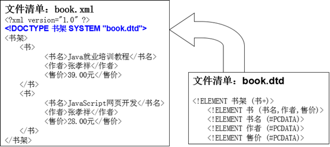

# 1. xml

## 1.1 概述

### 1）技术的发布者

+ 万维网联盟(W3C)

  万维网联盟(W3C)创建于1994年，又称W3C理事会。1994年10月在麻省理工学院计算机科学实验室成立。
  建立者： Tim Berners-Lee (蒂姆·伯纳斯·李)。
  是Web技术领域最具权威和影响力的国际中立性技术标准机构。
  到目前为止，W3C已发布了200多项影响深远的Web技术标准及实施指南，

  + 如广为业界采用的超文本标记语言HTML（标准通用标记语言下的一个应用）、

  + 可扩展标记语言XML（标准通用标记语言下的一个子集）

  + 以及帮助残障人士有效获得Web信息的无障碍指南（WCAG）等

    

### 2）xml概述

XML的全称为(EXtensible Markup Language)，是一种可扩展的标记语言。

* 标记语言：通过标签来描述数据的一门语言(标签有时我们也将其称之为元素)
* 可扩展：标签的名字是可以自定义的,XML文件是由很多标签组成的,而标签名是可以自定义的

### 3）作用

+ 用于进行存储数据和传输数据
+ 作为软件的配置文件

+ 作为配置文件的优势

  + 可读性好
  + 可维护性高

## 1.2 标签的规则

1. 标签由一对尖括号和合法标识符组成

```xml
<student>
```

2. 标签必须成对出现，前边的是开始标签，后边的是结束标签

```xml
<student> </student>
```

3. 特殊的标签可以不成对，但是必须有结束标记

```xml
<address/>
```

4. 标签中可以定义属性，属性和标签名空格隔开,属性值必须用引号引起来

```xml
<student id="1"> </student>
```

5. 标签需要正确的嵌套

```xml
<!--这是正确的--> 
<student id="1"> 
    <name>张三</name> 
</student>
<!--这是错误的--> 
<student id="1">
    <name>张三</student>
    </name>
```

## 1.3 语法规则

### 1）规则

1. XML文件的后缀名为xml

2. 文档声明必须是第一行第一列

```
<?xml version="1.0" encoding="UTF-8" standalone="yes”?>
```

* version：该属性是必须存在的
* encoding：该属性不是必须的，指打开当前xml文件的时候应该是使用什么字符编码表(一般取值都是UTF-8)

* standalone: 该属性不是必须的，描述XML文件是否依赖其他的xml文件，取值为yes/no

3. 必须存在一个根标签，有且只能有一个

4. XML文件中可以定义注释信息

5. XML文件中可以存在以下特殊字符

```java
&lt; < 小于
&gt; > 大于
&amp; & 和号
&apos; ' 单引号
&quot; " 引号
```

6. XML文件中可以存在CDATA区（CDATA 指的是不应由 XML 解析器进行解析的文本数据）

> 在 XML 元素中，"<" 和 "&" 是非法的。
>
> "<" 会产生错误，因为解析器会把该字符解释为新元素的开始。
>
> "&" 也会产生错误，因为解析器会把该字符解释为字符实体的开始。
>
> 某些文本，如果包含大量 "<" 或 "&" 字符。为了避免错误，可以将脚本代码定义为 CDATA。

```
<![CDATA[ …内容… ]]>
```

### 2）代码

```xml
<?xml version="1.0" encoding="UTF-8" ?>
<!--注释的内容-->
<!--本xml文件用来描述多个学生信息-->
<students>
    <!--第一个学生信息-->
    <student id="1">
        <name>张三</name>
        <age>23</age>
        <info>学生&lt; &gt;&gt;&gt;&gt;&gt;&gt;&gt;&gt;&gt;&gt;&gt;的信息</info>
        <message> <![CDATA[内容 <<<<<< >>>>>> ]]]></message>
    </student>

    <!--第二个学生信息-->
    <student id="2">
        <name>李四</name>
        <age>24</age>
    </student>

</students>
```

## 1.4 xml解析

### 1）概述

xml解析就是从xml中获取到数据

### 2）解析思想

|          | DOM解析                                                      | SAX解析                                                      |
| :------: | ------------------------------------------------------------ | ------------------------------------------------------------ |
| ==原理== | 一次性加载xml文档形成DOM树，不适合大容量的文件读取           | 加载一点，读取一点，处理一点，适合大容量文件的读取。         |
| ==读写== | DOM解析可以任意进行增删改查                                  | SAX解析只能读取                                              |
| ==顺序== | DOM解析任意读取任何位置的数据，甚至往回读                    | SAX解析只能从上往下，按顺序读取，不能往回读                  |
| ==API==  | DOM解析面向对象的编程方法（Node, Element, Attribute）          java开发者编码比较简单 | SAX解析基于事件的编程方法。                            java开发编码相对复杂。 |


### 3）解析工具

+ JAXP：SUN公司提供的一套XML的解析的API
+ JDOM：开源组织提供了一套XML的解析的API-jdom
+ DOM4J：开源组织提供了一套XML的解析的API-dom4j

### 4）Dom4J代码实现

#### 1. 需求

+ 解析提供好的xml文件
+ 将解析到的数据封装到学生对象中
+ 并将学生对象存储到ArrayList集合中
+ 遍历集合

#### 2. 代码实现

##### 2.1 XML文件

```java
<?xml version="1.0" encoding="UTF-8" ?>
<!--注释的内容-->
<!--本xml文件用来描述多个学生信息-->
<students>

    <!--第一个学生信息-->
    <student id="1">
        <name>张三</name>
        <age>23</age>
    </student>

    <!--第二个学生信息-->
    <student id="2">
        <name>李四</name>
        <age>24</age>
    </student>

</students>
```

##### 2.2 实体类

```java
public class Student {
    private String id;
    private String name;
    private int age;

    public Student() {
    }

    public Student(String id, String name, int age) {
        this.id = id;
        this.name = name;
        this.age = age;
    }

    public String getId() {
        return id;
    }

    public void setId(String id) {
        this.id = id;
    }

    public String getName() {
        return name;
    }

    public void setName(String name) {
        this.name = name;
    }

    public int getAge() {
        return age;
    }

    public void setAge(int age) {
        this.age = age;
    }

    @Override
    public String toString() {
        return "Student{" +
                "id='" + id + '\'' +
                ", name='" + name + '\'' +
                ", age=" + age +
                '}';
    }
}
```

##### 2.3 解析类

```java

/**
 * 利用dom4j解析xml文件
 */
public class XmlParse {
    public static void main(String[] args) throws DocumentException {
        //1.获取一个解析器对象
        SAXReader saxReader = new SAXReader();
        //2.利用解析器把xml文件加载到内存中,并返回一个文档对象
        Document document = saxReader.read(new File("myxml\\xml\\student.xml"));
        //3.获取到根标签
        Element rootElement = document.getRootElement();
        //4.通过根标签来获取student标签
        //elements():可以获取调用者所有的子标签.会把这些子标签放到一个集合中返回.
        //elements("标签名"):可以获取调用者所有的指定的子标签,会把这些子标签放到一个集合中并返回
        //List list = rootElement.elements();
        List<Element> studentElements = rootElement.elements("student");
        //System.out.println(list.size());

        //用来装学生对象
        ArrayList<Student> list = new ArrayList<>();

        //5.遍历集合,得到每一个student标签
        for (Element element : studentElements) {
            //element依次表示每一个student标签
  
            //获取id这个属性
            Attribute attribute = element.attribute("id");
            //获取id的属性值
            String id = attribute.getValue();

            //获取name标签
            //element("标签名"):获取调用者指定的子标签
            Element nameElement = element.element("name");
            //获取这个标签的标签体内容
            String name = nameElement.getText();

            //获取age标签
            Element ageElement = element.element("age");
            //获取age标签的标签体内容
            String age = ageElement.getText();

            Student s = new Student(id,name,Integer.parseInt(age));
            list.add(s);
        }
        //遍历操作
        for (Student student : list) {
            System.out.println(student);
        }
    }
}
```

## 1.5 xml约束

### 1）概述

+ 什么是约束

  用来限定xml文件中可使用的标签以及属性

+ 约束的分类

  + dtd
  + schema

### 2）dtd

#### 1. 编写dtd约束

+ 步骤

  1. 创建一个文件，这个文件的后缀名为.dtd

  2. 看xml文件中使用了哪些元素

     <!ELEMENT> 可以定义元素

  3. 判断元素是简单元素还是复杂元素

     简单元素：没有子元素。
     复杂元素：有子元素的元素；

+ 代码实现

  ```java
  <!ELEMENT persons (person)>
  <!ELEMENT person (name,age)>
  <!ELEMENT name (#PCDATA)>
  <!ELEMENT age (#PCDATA)>
  ```

#### 2. 引入dtd约束

##### 2.1 引入方式

+ 引入本地dtd

  ```xml
  <!DOCTYPE 根元素名称 SYSTEM ‘DTD文件的路径'>
  ```

+ 在xml文件内部引入

  ```xml
  <!DOCTYPE 根元素名称 [ dtd文件内容 ]>
  ```

+ 引入网络dtd

  ```xml
  <!DOCTYPE 根元素的名称 PUBLIC "DTD文件名称" "DTD文档的URL">
  ```

##### 2.2 代码实现

+ 引入本地DTD约束

  ```xml
  <!-- dtd内容
  这是persondtd.dtd文件中的内容,已经提前写好
  <!ELEMENT persons (person)>
  <!ELEMENT person (name,age)>
  <!ELEMENT name (#PCDATA)>
  <!ELEMENT age (#PCDATA)>
  -->
  <?xml version="1.0" encoding="UTF-8" ?>
  <!DOCTYPE persons SYSTEM 'persondtd.dtd'>
  <persons>
      <person>
          <name>张三</name>
          <age>23</age>
      </person>
  
  </persons>
  ```

+ 在xml文件内部引入

  ```xml
  <?xml version="1.0" encoding="UTF-8" ?>
  <!DOCTYPE persons [
          <!ELEMENT persons (person)>
          <!ELEMENT person (name,age)>
          <!ELEMENT name (#PCDATA)>
          <!ELEMENT age (#PCDATA)>
          ]>
  
  <persons>
      <person>
          <name>张三</name>
          <age>23</age>
      </person>
  
  </persons>
  ```

+ 引入网络dtd

  ```xml
  <?xml version="1.0" encoding="UTF-8" ?>
  <!DOCTYPE persons PUBLIC "dtd文件的名称" "dtd文档的URL">
  
  <persons>
      <person>
          <name>张三</name>
          <age>23</age>
      </person>
  </persons>
  ```

#### 3. 语法说明

##### 1. 定义元素

定义一个元素的格式为：<!ELEMENT 元素名 元素类型>

* 简单元素
  * EMPTY: 表示标签体为空
  * ANY: 表示标签体可以为空也可以不为空
  * PCDATA: 表示该元素的内容部分为字符串

* 复杂元素
  * 后面接着写子元素名称。
  * 多个子元素可以使用","或者"|"隔开。
  * ","表示定义子元素的顺序。
  *  "|"表示子元素只能出现任意一个。
  * "?"零次或一次。
  * "+"一次或多次。
  *  "*"零次或多次。
  * 如果不写则表示出现一次。



##### 2. 定义属性

* 格式

  定义一个属性的格式为：

  ```xml
  <!ATTLIST 元素名称 属性名称 属性的类型 属性的约束>
  ```

* 属性的类型
    	CDATA类型：普通的字符串

* 属性的约束

  \#REQUIRED： 必须的

  \#IMPLIED： 属性不是必需的
  \#FIXED value：属性值是固定的

##### 3. 代码实现

```dtd
<!ELEMENT persons (person+)>
<!ELEMENT person (name,age)>
<!ELEMENT name (#PCDATA)>
<!ELEMENT age (#PCDATA)>
<!ATTLIST person id CDATA #REQUIRED>

<?xml version="1.0" encoding="UTF-8" ?>
<!DOCTYPE persons SYSTEM 'persondtd.dtd'>
```


```xml
<persons>
    <person id="001">
        <name>张三</name>
        <age>23</age>
    </person>

    <person id = "002">
        <name>张三</name>
        <age>23</age>
    </person>

</persons>
```

### 3）schema

#### 1. 与dtd的区别

1. schema约束文件也是一个xml文件，符合xml的语法，这个文件的后缀名.xsd
2. 一个xml中可以引用多个schema约束文件，多个schema使用名称空间区分（名称空间类似于java包名）
3. dtd里面元素类型的取值比较单一常见的是PCDATA类型，但是在schema里面可以支持很多个数据类型
4. schema功能更加强大，语法更加的复杂

#### 2. 编写schema

+ 步骤

  1. 创建一个文件，这个文件的后缀名为.xsd。
  2. 定义文档声明
  3. schema文件的根标签为： <schema>
  4. 在<schema>中定义属性：xmlns=http://www.w3.org/2001/XMLSchema。
  5. 在<schema>中定义属性 ：targetNamespace =唯一的url地址，指定当前这个schema文件的名称空间。
  6. 在<schema>中定义属性 ：elementFormDefault="qualified“，表示当前schema文件是一个质量良好的文件。
  7. 通过element定义元素。
  8. 判断当前元素是简单元素还是复杂元素。
  
  
  

#### 3. 实例代码

```java
<?xml version="1.0" encoding="UTF-8" ?>
<schema
    xmlns="http://www.w3.org/2001/XMLSchema"
    targetNamespace="http://www.itheima.cn/javase"
    elementFormDefault="qualified">

    <!--定义persons复杂元素-->
    <element name="persons">
        <complexType>
            <sequence>
                <!--定义person复杂元素-->
                <element name = "person">
                    <complexType>
                        <sequence>
                            <!--定义name和age简单元素-->
                            <element name = "name" type = "string"></element>
                            <element name = "age" type = "string"></element>
                        </sequence>
                    </complexType>
                </element>
            </sequence>
        </complexType>
    </element>
</schema>
```

#### 4. 引入schema约束

##### 1. 步骤

1. 在根标签上定义属性xmlns="http://www.w3.org/2001/XMLSchema-instance"
2. 通过xmlns引入约束文件的名称空间
3. 给某一个xmlns属性添加一个标识，用于区分不同的名称空间
   * 格式为：xmlns:标识=“名称空间地址” ，标识可以是任意的，但是一般取值都是xsi
4. 通过xsi:schemaLocation指定名称空间所对应的约束文件路径
   * 格式为：xsi:schemaLocation = "名称空间url 文件路径“

##### 2. 代码实现

```java
<?xml version="1.0" encoding="UTF-8" ?>
<persons
    xmlns:xsi="http://www.w3.org/2001/XMLSchema-instance"
    xmlns="http://www.itheima.cn/javase"
    xsi:schemaLocation="http://www.itheima.cn/javase person.xsd">
    <person>
        <name>张三</name>
        <age>23</age>
    </person>
</persons>
```

#### 5. 定义属性

* schema约束文件

```xml
<?xml version="1.0" encoding="UTF-8" ?>
<schema
    xmlns="http://www.w3.org/2001/XMLSchema"
    targetNamespace="http://www.itheima.cn/javase"
    elementFormDefault="qualified">
    <!--定义persons复杂元素-->
    <element name="persons">
        <complexType>
            <sequence>
                <!--定义person复杂元素-->
                <element name = "person">
                    <complexType>
                        <sequence>
                            <!--定义name和age简单元素-->
                            <element name = "name" type = "string"></element>
                            <element name = "age" type = "string"></element>
                        </sequence>
                        <!--定义属性，required( 必须的)/optional( 可选的)-->
                        <attribute name="id" type="string" use="required"></attribute>
                    </complexType>
                    
                </element>
            </sequence>
        </complexType>
    </element>
    
</schema>
```
* 引用schema

```xml
<?xml version="1.0" encoding="UTF-8" ?>
<persons
    xmlns:xsi="http://www.w3.org/2001/XMLSchema-instance"
    xmlns="http://www.itheima.cn/javase"
    xsi:schemaLocation="http://www.itheima.cn/javase person.xsd">
    <person id="001">
        <name>张三</name>
        <age>23</age>
    </person>
</persons>
```

  # 2. 枚举

  ## 2.1 概述

如果一个类的对象是==有限==且==固定==的。如季节类，它只有春夏秋冬4个对象这种实例有限且固定的类，在 Java 中被称为枚举类。

  ## 2.2 定义格式

  + 格式

    ```java
    // 注意: 定义枚举类要用关键字enum
    public enum s {   
    	枚举项1,枚举项2,枚举项3;
    }
    ```

  + 示例代码

    ```java
    // 定义一个枚举类，用来表示春，夏，秋，冬这四个固定值
    public enum Season {
        SPRING,SUMMER,AUTUMN,WINTER;
    }
    ```

  ## 2.3 枚举的特点

### 1）特点

+ 所有枚举类都是Enum的子类

+ 我们可以通过"枚举类名.枚举项名称"去访问指定的枚举项

+ 每一个枚举项其实就是该枚举的一个对象

+ 枚举也是一个类，也可以去定义成员变量

+ 枚举类的第一行上必须是枚举项，最后一个枚举项后的分号是可以省略的，但是如果枚举类有其他的东西，这个分号就不能省略。建议不要省略

+ 枚举类可以有构造器，但必须是private的，它默认的也是private的。枚举项的用法比较特殊：枚举("");

+ 枚举类也可以有抽象方法，但是枚举项必须重写该方法

### 2）示例代码

* 定义枚举类

```java
public enum Season {

    SPRING("春"){

        //如果枚举类中有抽象方法
        //那么在枚举项中必须要全部重写
        @Override
        public void show() {
            System.out.println(this.name);
        }

    },

    SUMMER("夏"){
        @Override
        public void show() {
            System.out.println(this.name);
        }
    },

    AUTUMN("秋"){
        @Override
        public void show() {
            System.out.println(this.name);
        }
    },

    WINTER("冬"){
        @Override
        public void show() {
            System.out.println(this.name);
        }
    };

    public String name;

    //空参构造
    //private Season(){}
  
    //有参构造
    private Season(String name){
        this.name = name;
    }
  
    //抽象方法
    public abstract void show();
}
```

* 使用枚举类

```java
public class EnumDemo {
    public static void main(String[] args) {
        
        System.out.println(Season.SPRING);
        System.out.println(Season.SUMMER);
        System.out.println(Season.AUTUMN);
        System.out.println(Season.WINTER);
        
        Season spring = Season.SPRING;
    }
}
```

  ## 2.4 枚举的方法

### 1）方法介绍

| 方法名                                            | 说明                                 |
| ------------------------------------------------- | ------------------------------------ |
| String name()                                     | 获取枚举项的名称                     |
| int ordinal()                                     | 返回枚举项在枚举类中的索引值         |
| int compareTo(E  o)                               | 比较两个枚举项，返回的是索引值的差值 |
| String toString()                                 | 返回枚举常量的名称                   |
| static <T> T  valueOf(Class<T> type,String  name) | 获取指定枚举类中的指定名称的枚举值   |
| values()                                          | 获得所有的枚举项                     |

### 2）示例代码

* 定义枚举类

```java
public enum Season {
    SPRING,SUMMER,AUTUMN,WINTER;
}
```

* 使用枚举类

```java
public class EnumDemo {
    public static void main(String[] args) {
		//String name() 获取枚举项的名称
        String name = Season.SPRING.name();
        System.out.println(name);
        System.out.println("-----------------------------");

		//int ordinal() 返回枚举项在枚举类中的索引值
        int index1 = Season.SPRING.ordinal();
        int index2 = Season.SUMMER.ordinal();
        int index3 = Season.AUTUMN.ordinal();
        int index4 = Season.WINTER.ordinal();
        System.out.println(index1);
        System.out.println(index2);
        System.out.println(index3);
        System.out.println(index4);
        System.out.println("-----------------------------");

		//int compareTo(E o) 比较两个枚举项，返回的是索引值的差值
        int result = Season.SPRING.compareTo(Season.WINTER);
        System.out.println(result);//-3
        System.out.println("-----------------------------");

		//String toString()   返回枚举常量的名称
        String s = Season.SPRING.toString();
        System.out.println(s);
        System.out.println("-----------------------------");

		//static <T> T valueOf(Class<T> type,String name)
		//获取指定枚举类中的指定名称的枚举值
        Season spring = Enum.valueOf(Season.class, "SPRING");
        System.out.println(spring);
        System.out.println(Season.SPRING == spring);
        System.out.println("-----------------------------");

		//values()       获得所有的枚举项
        Season[] values = Season.values();
        for (Season value : values) {
            System.out.println(value);
        }
    }
}
```

  # 3. 注解

  ## 3.1 概述

### 1）定义

注解提供了一种为程序元素==设置元数据==的方法。

简单来说注解的作用就是将我们的需要的数据储存起来，在以后的某一个时刻（可能是编译时，也可能是运行时）去调用它。

### 2）功能

* 作为特定的标记，用于告诉编译器一些信息。
* 编译时动态处理，如动态生成代码。
* 运行时动态处理，作为额外信息的载体，如得到注解信息。

### 3）为什么要学习注解

- 能够读懂别人使用注解实现的开源库
- 让编程变得更加简洁

### 4）注解的分类

- **标准注解：** Java 自带的几个 Annotation
  - @Override：标记重写方法
  - @Deprecated：标记方法过时
  - @SuppressWarnings：压制警告
- **元注解：**用来定义注解的注解
  - @Retention
  - @Target
  - @Inherited
  - @Documented
- **自定义注解**

### 5）注解与注释

+ 注释: 给程序员看的
+ 注解: 给编译器看的


## 3.2 自定义注解

### 1）格式

```java
public @interface 注解名称 {
	public 属性类型 属性名() default 默认值 ;
}
```

### 2）属性类型

+ 基本数据类型
+ String
+ Class
+ 注解
+ 枚举
+ 以上类型的一维数组

### 3）代码演示

* 定义一个简单的注解

```java
public @interface Anno2 {
    
}
```

* 枚举数据类型

```java
public enum Season {
    SPRING,SUMMER,AUTUMN,WINTER;
}
```

* 定义一个复杂的注解

```java
public @interface Anno1 {

    //定义一个基本类型的属性
    int a () default 23;

    //定义一个String类型的属性
    public String name() default "itheima";

    //定义一个Class类型的属性
    public Class clazz() default Anno2.class;

    //定义一个注解类型的属性
    public Anno2 anno() default @Anno2;

    //定义一个枚举类型的属性
    public Season season() default Season.SPRING;

    //以上类型的一维数组
    //int数组
    public int[] arr() default {1,2,3,4,5};

    //枚举数组
    public Season[] seasons() default {Season.SPRING,Season.SUMMER};

    //value。后期我们在使用注解的时候，如果我们只需要给注解的value属性赋值。
    //那么value就可以省略
    public String value();

}
```

* 使用注解
  * 在使用注解的时候如果注解里面的属性没有指定默认值，那么我们就需要手动给出注解属性的设置值。
  * 如果只有一个属性需要赋值，并且属性的名称是value，则value可以省略，直接定义值即可。

```java
//@Anno1(name = "itheima")
@Anno1("abc")
public class AnnoDemo {
    
}
```

## 3.3 自定义注解案例

### 1）需求

自定义一个注解@Test用于指定类的方法上，如果某一个类的方法上使用了@Test注解，就执行该方法。

### 2）实现步骤

1. 自定义一个注解@Test,并在类中的某几个方法上加上注解
2. 在测试类中,获取注解所在的类的Class对象
3. 获取类中所有的方法对象
4. 遍历每一个方法对象,判断是否有对应的注解

### 3）代码实现

* 定义注解

```java
//表示Test这个注解的存活时间
@Retention(value = RetentionPolicy.RUNTIME)
public @interface Test {
}
```

* 使用注解

```java
public class UseTest {

    //没有使用Test注解
    public void show(){
        System.out.println("UseTest....show....");
    }

    //使用Test注解
    @Test
    public void method(){
        System.out.println("UseTest....method....");
    }

    //没有使用Test注解
    @Test
    public void function(){
        System.out.println("UseTest....function....");
    }
}

```

* 功能测试

```java

public class AnnoDemo {
    public static void main(String[] args) throws ClassNotFoundException, IllegalAccessException, InstantiationException, InvocationTargetException {
        //1.通过反射获取UseTest类的字节码文件对象
        Class clazz = Class.forName("com.itheima.myanno3.UseTest");

        //创建对象
        UseTest useTest = (UseTest) clazz.newInstance();

        //2.通过反射获取这个类里面所有的方法对象
        Method[] methods = clazz.getDeclaredMethods();

        //3.遍历数组，得到每一个方法对象
        for (Method method : methods) {
            //method依次表示每一个方法对象。
            //isAnnotationPresent(Class<? extends Annotation> annotationClass)
            //判断当前方法上是否有指定的注解。
            //参数：注解的字节码文件对象
            //返回值：布尔结果。  true 存在  false 不存在
            if(method.isAnnotationPresent(Test.class)){
                method.invoke(useTest);
            }
        }
    }
}
```

  ## 3.4 元注解

### 1）概述

元注解就是描述注解的注解

### 2）元注解介绍

| 元注解名    | 说明                                    |
| ----------- | --------------------------------------- |
| @Target     | 指定了注解能在哪里使用                  |
| @Retention  | 可以理解为保留时间(生命周期)            |
| @Inherited  | 表示修饰的自定义注解可以被子类继承      |
| @Documented | 表示该自定义注解，会出现在API文档里面。 |

### 3）示例代码

* 定义注解

```java
@Target({ElementType.FIELD,ElementType.TYPE,ElementType.METHOD})  //指定注解使用的位置（成员变量，类，方法）
@Retention(RetentionPolicy.RUNTIME) //指定该注解的存活时间
//@Inherited //指定该注解可以被继承
public @interface Anno {
}
```

* 在类上使用注解

```java
@Anno
public class Person {
}
```

* 创建Person的子类

```java
public class Student extends Person {
    public void show(){
        System.out.println("student.......show..........");
    }
}
```

* 功能测试

```java
public class StudentDemo {
    public static void main(String[] args) throws ClassNotFoundException {
        //获取到Student类的字节码文件对象
        Class clazz = Class.forName("com.itheima.myanno4.Student");

        //获取注解。
        boolean result = clazz.isAnnotationPresent(Anno.class);
        System.out.println(result);
    }
}
```

