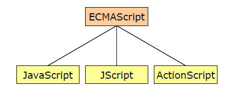

# 1. JavaScript快速入门

## 1.1 JavaScript介绍

- JavaScript 是一种客户端脚本语言。运行在客户端浏览器中，每一个浏览器都具备解析 JavaScript 的引擎。

- 脚本语言：不需要编译，就可以被浏览器直接解析执行了。

- 核心功能就是增强用户和 HTML 页面的交互过程，让页面有一些动态效果。以此来增强用户的体验！

  
  
  
  
  
  
  ```tex
  1995 年，NetScape (网景)公司，开发的一门客户端脚本语言：LiveScript。后来，请来 SUN 公司的专家来 进行修改，后命名为：JavaScript。
  1996 年，微软抄袭 JavaScript 开发出 JScript 脚本语言。 
  1997 年，ECMA (欧洲计算机制造商协会)，制定出客户端脚本语言的标准：ECMAScript，统一了所有客户 端脚本语言的编码方式。
  ```
  
  

## 1.2 快速入门

- **实现步骤**

1. 创建一个 HTML。
2. 在标签下面编写一个<script>标签。
3. 在<script>标签中编写代码。
4. 通过浏览器查看

- **具体实现**

```html
<!DOCTYPE html>
<html lang="en">
<head>
    <meta charset="UTF-8">
    <title>JS快速入门</title>
</head>
<body>
    <button id="btn">点我呀</button>
</body>
</html>
```

###  1）内部方式

```html
<script>
    document.getElementById("btn").onclick=function () {
        alert("点我干嘛？");
    }
</script>
```

### 2）外部方式

- **创建js文件**

  ```js
  document.getElementById("btn").onclick=function () {
      alert("点我干嘛？");
  }
  ```

- **在html中引用外部js文件**

  ```js
  <script src="js/my.js"></script>
  ```

## 1.3 开发环境搭建

- **Node.js:JavaScript 运行环境**

- **VSCode：编写前端技术的开发工具**

  根据《安装工具.pdf》文档安装Node.js和VSCode。相关资料都在“资料”文件夹中。

## 1.4 快速入门总结

- JavaScript 是一种客户端脚本语言

  

- 组成部分

  

  ```tex
  ECMAScript、DOM、BOM
  ```

- 和 HTML 结合方式

  ```tex
  内部方式：<script></script>
  外部方式：<script src=文件路径></script>
  ```

# 2. JavaScript基本语法

## 2.1 注释

- 单行注释

  ```js
  // 注释的内容
  ```

- 多行注释

  ```js
  /*
  注释的内容
  */
  ```

## 2.2 输入输出语句

- 输入框 prompt(“提示内容”);
- 弹出警告框 alert(“提示内容”); 
-  控制台输出 console.log(“显示内容”); 
-  页面内容输出 document.write(“显示内容”);

## 2.3 变量和常量

​	JavaScript 属于弱类型的语言，定义变量时不区分具体的数据类型。

- 定义局部变量 let 变量名 = 值; 

  ```js
  //1.定义局部变量
  let name = "张三";
  let age = 23;
  document.write(name + "," + age +"<br>");
  ```

- 定义全局变量 变量名 = 值; 

  ```js
  //2.定义全局变量
  {
      let l1 = "aa";
      l2 = "bb";
  }
  //document.write(l1);
  document.write(l2 + "<br>");
  ```

- 定义常量 const 常量名 = 值;

  ```js
  //3.定义常量
  const PI = 3.1415926;
  //PI = 3.15;
  document.write(PI);
  ```

## 2.4 原始数据类型和typeof方法

### 2.4.1 原始数据类型


### 2.4.2 typeof

**typeof 用于判断变量的数据类型**

```js
let age = 18; 
document.write(typeof(age)); // number
```

## 2.5 运算符

- **算数运算符**

  

- **赋值运算符**

  

- **比较运算符**

  

- 逻辑运算符

  

- **三元运算符**

  - 三元运算符格式

    (比较表达式) ? 表达式1 : 表达式2; 

  - 执行流程

    如果比较表达式为true，则取表达式1

    如果比较表达式为false，则取表达式2

## 2.6 流程控制和循环语句

- **if 语句**

  ```js
  //if语句
  let month = 3;
  if(month >= 3 && month <= 5) {
      document.write("春季");
  }else if(month >= 6 && month <= 8) {
      document.write("夏季");
  }else if(month >= 9 && month <= 11) {
      document.write("秋季");
  }else if(month == 12 || month == 1 || month == 2) {
      document.write("冬季");
  }else {
      document.write("月份有误");
  }
  
  document.write("<br>");
  ```

- **switch 语句**

  ```js
  //switch语句
  switch(month){
      case 3:
      case 4:
      case 5:
          document.write("春季");
          break;
      case 6:
      case 7:
      case 8:
          document.write("夏季");
          break;
      case 9:
      case 10:
      case 11:
          document.write("秋季");
          break;
      case 12:
      case 1:
      case 2:
          document.write("冬季");
          break;
      default:
          document.write("月份有误");
          break;
  }
  
  document.write("<br>");**for 循环**
  ```

- **for循环**

  ```js
  //for循环
  for(let i = 1; i <= 5; i++) {
      document.write(i + "<br>");
  }
  ```

- **while 循环**

  ```js
  //while循环
  let n = 6;
  while(n <= 10) {
      document.write(n + "<br>");
      n++;
  }
  ```

## 2.7 数组

- 数组的使用和 java 中的数组基本一致，但是在 JavaScript 中的数组更加灵活，数据类型和长度都没有限制。

- 定义格式
  - let 数组名 = [元素1,元素2,…];
- 索引范围
  - 从 0 开始，最大到数组长度-1
- 数组长度 
  - 数组名.length
- 数组高级运算符… 
  - 数组复制
  - 合并数组
  - 字符串转数组

## 2.8 函数

- 函数类似于 java 中的方法，可以将一些代码进行抽取，达到复用的效果

- 定义格式

  ```tex
  function 方法名(参数列表) {
  		 方法体; 
  		 return 返回值; 
  	}
  ```

- 可变参数

  ```tex
  function 方法名(…参数名) {
  		方法体; 
          return 返回值; 
   }
  ```

- 匿名函数

  ```tex
  function(参数列表) {
  		方法体; 
  }
  ```

## 2.9 小结

- 注释：单行// 多行/**/
- 输入输出语句：prompt()、alert()、console.log()、document.write()
- 变量和常量：let、const 
- 数据类型：boolean、null、undefined、number、string、bigint
- typeof 关键字：用于判断变量的数据类型 
- 运算符：算数、赋值、逻辑、比较、三元运算符 
-  流程控制和循环语句：if、switch、for、while
- 数组：数据类型和长度没有限制，let 数组名 = [长度/元素]
-  函数：类似方法，抽取代码，提高复用性

# 3. JavaScript DOM

## 3.1 DOM介绍

- DOM(Document Object Model)：文档对象模型。
- 将 HTML 文档的各个组成部分，封装为对象。借助这些对象，可以对 HTML 文档进行增删改查的动态操作。


## 3.2 Element元素的获取操作

- 具体方法


- 代码实现

```html
<!DOCTYPE html>
<html lang="en">
<head>
    <meta charset="UTF-8">
    <meta name="viewport" content="width=device-width, initial-scale=1.0">
    <title>元素的获取</title>
</head>
<body>
    <div id="div1">div1</div>
    <div id="div2">div2</div>
    <div class="cls">div3</div>
    <div class="cls">div4</div>
    <input type="text" name="username"/>
</body>
<script>
    //1. getElementById()   根据id属性值获取元素对象
    let div1 = document.getElementById("div1");
    //alert(div1);

    //2. getElementsByTagName()   根据元素名称获取元素对象们，返回数组
    let divs = document.getElementsByTagName("div");
    //alert(divs.length);

    //3. getElementsByClassName()  根据class属性值获取元素对象们，返回数组
    let cls = document.getElementsByClassName("cls");
    //alert(cls.length);

    //4. getElementsByName()   根据name属性值获取元素对象们，返回数组
    let username = document.getElementsByName("username");
    //alert(username.length);

    //5. 子元素对象.parentElement属性   获取当前元素的父元素
    let body = div1.parentElement;
    alert(body);
</script>
</html>
```

## 3.3 Element元素的增删改操作

- **具体方法**

  

- **代码实现**

  ```html
  <!DOCTYPE html>
  <html lang="en">
  <head>
      <meta charset="UTF-8">
      <meta name="viewport" content="width=device-width, initial-scale=1.0">
      <title>元素的增删改</title>
  </head>
  <body>
      <select id="s">
          <option>---请选择---</option>
          <option>北京</option>
          <option>上海</option>
          <option>广州</option>
      </select>
  </body>
  <script>
      //1. createElement()   创建新的元素
      let option = document.createElement("option");
      //为option添加文本内容
      option.innerText = "深圳";
  
      //2. appendChild()     将子元素添加到父元素中
      let select = document.getElementById("s");
      select.appendChild(option);
  
      //3. removeChild()     通过父元素删除子元素
      //select.removeChild(option);
  
      //4. replaceChild()    用新元素替换老元素
      let option2 = document.createElement("option");
      option2.innerText = "杭州";
      select.replaceChild(option2,option);
  
  </script>
  </html>
  ```

## 3.4 Attribute属性的操作

- **具体方法**

  

- **代码实现**

  ```html
  <!DOCTYPE html>
  <html lang="en">
  <head>
      <meta charset="UTF-8">
      <meta name="viewport" content="width=device-width, initial-scale=1.0">
      <title>属性的操作</title>
      <style>
          .aColor{
              color: blue;
          }
      </style>
  </head>
  <body>
      <a>点我呀</a>
  </body>
  <script>
      //1. setAttribute()    添加属性
      let a = document.getElementsByTagName("a")[0];
      a.setAttribute("href","https://www.baidu.com");
  
      //2. getAttribute()    获取属性
      let value = a.getAttribute("href");
      //alert(value);
  
      //3. removeAttribute()  删除属性
      //a.removeAttribute("href");
  
      //4. style属性   添加样式
      //a.style.color = "red";
  
      //5. className属性   添加指定样式
      a.className = "aColor";
  
  </script>
  </html>
  ```

## 3.5 Text文本的操作

- **具体方法**

  

- **代码实现**

  ```html
  <!DOCTYPE html>
  <html lang="en">
  <head>
      <meta charset="UTF-8">
      <meta name="viewport" content="width=device-width, initial-scale=1.0">
      <title>文本的操作</title>
  </head>
  <body>
      <div id="div"></div>
  </body>
  <script>
      //1. innerText   添加文本内容，不解析标签
      let div = document.getElementById("div");
      div.innerText = "我是div";
      //div.innerText = "<b>我是div</b>";
  
      //2. innerHTML   添加文本内容，解析标签
      div.innerHTML = "<b>我是div</b>";
  
  </script>
  </html>
  ```

## 3.6 DOM小结

- DOM(Document Object Model)：文档对象模型 

  - Document：文档对象
- Element：元素对象
  - Attribute：属性对象
- Text：文本对象
- 元素的操作
  - getElementById()
  - getElementsByTagName()
  - getElementsByName()
  - getElementsByClassName()
  - 子元素对象.parentElement属性
  - createElement()
  - appendChild()
  - removeChild()
  - replaceChild()
- 属性的操作
  - setAtrribute()
  - getAtrribute()
  - removeAtrribute()
  - style属性
- 文本的操作
  - innerText
  - innerHTML

# 4. JavaScript 事件

## 4.1 事件介绍

事件指的就是当某些组件执行了某些操作后，会触发某些代码的执行。

- **常用的事件**


- **了解的事件**


## 4.2 事件操作

绑定事件

- **方式一**

  通过标签中的事件属性进行绑定。

  ```html
  <button id="btn" onclick="执行的功能"></button>
  ```

- **方式二**

  通过 DOM 元素属性绑定。

  ```js
  document.getElementById("btn").onclick = 执行的功能
  ```

## 4.3 事件小结

- 事件指的就是当某些组件执行了某些操作后，会触发某些代码的执行。
- 常用的事件 onload onsubmit onclick ondblclick onblur onfocus onchange
- 绑定事件方式
  - 方式一：通过标签中的事件属性进行绑定。
  - 方式二：通过 DOM 元素属性绑定。

# 5. JavaScript综合案例

## 5.1 案例效果介绍

- 在“姓名、年龄、性别”三个文本框中填写信息后，添加到“学生信息表”列表（表格）中。


## 5.2 添加功能的分析

1. 为添加按钮绑定单击事件。
2. 创建 tr 元素。
3. 创建 4 个 td 元素。
4. 将 td 添加到 tr 中。
5.  获取文本框输入的信息。
6. 创建 3 个文本元素。
7. 将文本元素添加到对应的 td 中。
8. 创建 a 元素。
9. 将 a 元素添加到对应的 td 中。
10. 将 tr 添加到 table 中。

## 5.3 添加功能的实现

```html
<!DOCTYPE html>
<html lang="en">
<head>
    <meta charset="UTF-8">
    <title>动态表格</title>

    <style>
        table{
            border: 1px solid;
            margin: auto;
            width: 500px;
        }

        td,th{
            text-align: center;
            border: 1px solid;
        }
        div{
            text-align: center;
            margin: 50px;
        }
    </style>

</head>
<body>

<div>
    <input type="text" id="name" placeholder="请输入姓名" autocomplete="off">
    <input type="text" id="age"  placeholder="请输入年龄" autocomplete="off">
    <input type="text" id="gender"  placeholder="请输入性别" autocomplete="off">
    <input type="button" value="添加" id="add">
</div>

    <table id="tb">
        <caption>学生信息表</caption>
        <tr>
            <th>姓名</th>
            <th>年龄</th>
            <th>性别</th>
            <th>操作</th>
        </tr>

        <tr>
            <td>张三</td>
            <td>23</td>
            <td>男</td>
            <td><a href="JavaScript:void(0);" onclick="drop(this)">删除</a></td>
        </tr>

        <tr>
            <td>李四</td>
            <td>24</td>
            <td>男</td>
            <td><a href="JavaScript:void(0);" onclick="drop(this)">删除</a></td>
        </tr>

    </table>

</body>
<script>
    //一、添加功能
    //1.为添加按钮绑定单击事件
    document.getElementById("add").onclick = function(){
        //2.创建行元素
        let tr = document.createElement("tr");
        //3.创建4个单元格元素
        let nameTd = document.createElement("td");
        let ageTd = document.createElement("td");
        let genderTd = document.createElement("td");
        let deleteTd = document.createElement("td");
        //4.将td添加到tr中
        tr.appendChild(nameTd);
        tr.appendChild(ageTd);
        tr.appendChild(genderTd);
        tr.appendChild(deleteTd);
        //5.获取输入框的文本信息
        let name = document.getElementById("name").value;
        let age = document.getElementById("age").value;
        let gender = document.getElementById("gender").value;
        //6.根据获取到的信息创建3个文本元素
        let nameText = document.createTextNode(name);
        let ageText = document.createTextNode(age);
        let genderText = document.createTextNode(gender);
        //7.将3个文本元素添加到td中
        nameTd.appendChild(nameText);
        ageTd.appendChild(ageText);
        genderTd.appendChild(genderText);
        //8.创建超链接元素和显示的文本以及添加href属性
        let a = document.createElement("a");
        let aText = document.createTextNode("删除");
        a.setAttribute("href","JavaScript:void(0);");
        a.setAttribute("onclick","drop(this)");
        a.appendChild(aText);
        //9.将超链接元素添加到td中
        deleteTd.appendChild(a);
        //10.获取table元素，将tr添加到table中
        let table = document.getElementById("tb");
        table.appendChild(tr);
    }
</script>
</html>
```

## 5.4 删除功能的分析

- **删除功能介绍**


- **删除功能分析**

1. 为每个删除超链接添加单击事件属性。
2. 定义删除的方法。
3. 获取 table 元素。
4. 获取 tr 元素。
5. 通过 table 删除 tr。

## 5.5 删除功能的实现

```js
//二、删除的功能
//1.为每个删除超链接标签添加单击事件的属性
//2.定义删除的方法
function drop(obj){
//3.获取table元素
let table = obj.parentElement.parentElement.parentElement;
//4.获取tr元素
let tr = obj.parentElement.parentElement;
//5.通过table删除tr
table.removeChild(tr);
}
```

