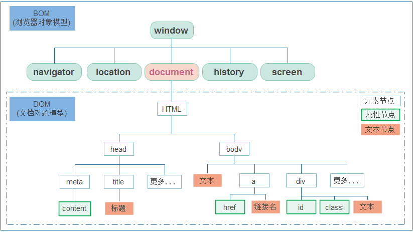

# 1. JavaScript面向对象

## 1.1 面向对象介绍

​		在 Java 中我们学习过面向对象，核心思想是万物皆对象。在 JavaScript 中同样也有面向对象。思想类似。

​		

## 1.2 类的定义和使用

- **结构说明**


- **代码实现**

  ```html
  <!DOCTYPE html>
  <html lang="en">
  <head>
      <meta charset="UTF-8">
      <meta name="viewport" content="width=device-width, initial-scale=1.0">
      <title>类的定义和使用</title>
  </head>
  <body>
      
  </body>
  <script>
      //定义Person类
      class Person{
          //构造方法
          constructor(name,age){
              this.name = name;
              this.age = age;
          }
  
          //show方法
          show(){
              document.write(this.name + "," + this.age + "<br>");
          }
  
          //eat方法
          eat(){
              document.write("吃饭...");
          }
      }
  
      //使用Person类
      let p = new Person("张三",23);
      p.show();
      p.eat();
  </script>
  </html>
  ```

  ## 1.3、字面量类的定义和使用

- **结构说明**


- **代码实现**

  ```html
  <!DOCTYPE html>
  <html lang="en">
  <head>
      <meta charset="UTF-8">
      <meta name="viewport" content="width=device-width, initial-scale=1.0">
      <title>字面量定义类和使用</title>
  </head>
  <body>
      
  </body>
  <script>
      //定义person
      let person = {
          name : "张三",
          age : 23,
          hobby : ["听课","学习"],
  
          eat : function() {
              document.write("吃饭...");
          }
      };
  
      //使用person
      document.write(person.name + "," + person.age + "," + person.hobby[0] + "," + person.hobby[1] + "<br>");
      person.eat();
  </script>
  </html>
  ```

## 1.3 继承

- 继承：让类与类产生子父类的关系，子类可以使用父类有权限的成员。

- 继承关键字：extends

- 顶级父类：Object

  ```html
  <!DOCTYPE html>
  <html lang="en">
  <head>
      <meta charset="UTF-8">
      <meta name="viewport" content="width=device-width, initial-scale=1.0">
      <title>继承</title>
  </head>
  <body>
      
  </body>
  <script>
      //定义Person类
      class Person{
          //构造方法
          constructor(name,age){
              this.name = name;
              this.age = age;
          }
  
          //eat方法
          eat(){
              document.write("吃饭...");
          }
      }
  
      //定义Worker类继承Person
      class Worker extends Person{
          constructor(name,age,salary){
              super(name,age);
              this.salary = salary;
          }
  
          show(){
              document.write(this.name + "," + this.age + "," + this.salary + "<br>");
          }
      }
  
      //使用Worker
      let w = new Worker("张三",23,10000);
      w.show();
      w.eat();
  </script>
  </html>
  ```

## 1.4 小结

- **面向对象**

  把相关的数据和方法组织为一个整体来看待，从更高的层次来进行系统建模，更贴近事物的自然运行模式。

- **类的定义**

  class 类{} 字面量定义

- **类的使用**

  let 对象名 = new 类名(); 对象名.变量名 对象名.方法名() 

- **继承**

  让类和类产生子父类关系，提高代码的复用性和维护性。

  子类 extends 父类 

  Object 顶级父类

# 2. JavaScript内置对象

## 2.1 Number

- **方法介绍**


- **代码实现**

```html
<!DOCTYPE html>
<html lang="en">
<head>
    <meta charset="UTF-8">
    <meta name="viewport" content="width=device-width, initial-scale=1.0">
    <title>Number</title>
</head>
<body>
    
</body>
<script>
    //1. parseFloat()  将传入的字符串浮点数转为浮点数
    document.write(Number.parseFloat("3.14") + "<br>");

    //2. parseInt()    将传入的字符串整数转为整数
    document.write(Number.parseInt("100") + "<br>");
    document.write(Number.parseInt("200abc") + "<br>"); // 从数字开始转换，直到不是数字为止

</script>
</html>
```

## 2.2 Math

- **方法介绍**


- **代码实现**

```html
<!DOCTYPE html>
<html lang="en">
<head>
    <meta charset="UTF-8">
    <meta name="viewport" content="width=device-width, initial-scale=1.0">
    <title>Math</title>
</head>
<body>
    
</body>
<script>
    //1. ceil(x) 向上取整
    document.write(Math.ceil(4.4) + "<br>");    // 5
    
    //2. floor(x) 向下取整
    document.write(Math.floor(4.4) + "<br>");   // 4
    
    //3. round(x) 把数四舍五入为最接近的整数
    document.write(Math.round(4.1) + "<br>");   // 4
    document.write(Math.round(4.6) + "<br>");   // 5
    
    //4. random() 随机数,返回的是0.0-1.0之间范围(含头不含尾)
    document.write(Math.random() + "<br>"); // 随机数
    
    //5. pow(x,y) 幂运算 x的y次方
    document.write(Math.pow(2,3) + "<br>"); // 8
</script>
</html>
```

## 2.3 Date

- **方法说明**

  - **构造方法**

  

  - **成员方法**

  

- **代码实现**

```html
<!DOCTYPE html>
<html lang="en">
<head>
    <meta charset="UTF-8">
    <meta name="viewport" content="width=device-width, initial-scale=1.0">
    <title>Date</title>
</head>
<body>
    
</body>
<script>
    //构造方法
    //1. Date()  根据当前时间创建对象
    let d1 = new Date();
    document.write(d1 + "<br>");

    //2. Date(value) 根据指定毫秒值创建对象
    let d2 = new Date(10000);
    document.write(d2 + "<br>");

    //3. Date(year,month,[day,hours,minutes,seconds,milliseconds]) 根据指定字段创建对象(月份是0~11)
    let d3 = new Date(2222,2,2,20,20,20);
    document.write(d3 + "<br>");

    //成员方法
    //1. getFullYear() 获取年份
    document.write(d3.getFullYear() + "<br>");

    //2. getMonth() 获取月份
    document.write(d3.getMonth() + "<br>");

    //3. getDate() 获取天数
    document.write(d3.getDate() + "<br>");

    //4. toLocaleString() 返回本地日期格式的字符串
    document.write(d3.toLocaleString());
</script>
</html>
```

## 2.4 String

- **方法说明**

  - **构造方法**

  

  - **成员方法**

  

- **代码实现**

```html
<!DOCTYPE html>
<html lang="en">
<head>
    <meta charset="UTF-8">
    <meta name="viewport" content="width=device-width, initial-scale=1.0">
    <title>String</title>
</head>
<body>
    
</body>
<script>
    //1. 构造方法创建字符串对象
    let s1 = new String("hello");
    document.write(s1 + "<br>");

    //2. 直接赋值
    let s2 = "hello";
    document.write(s2 + "<br>");

    //属性
    //1. length   获取字符串的长度
    document.write(s2.length + "<br>");

    //成员方法
    //1. charAt(index)     获取指定索引处的字符
    document.write(s2.charAt(1) + "<br>");

    //2. indexOf(value)    获取指定字符串出现的索引位置
    document.write(s2.indexOf("l") + "<br>");

    //3. substring(start,end)   根据指定索引范围截取字符串(含头不含尾)
    document.write(s2.substring(2,4) + "<br>");

    //4. split(value)   根据指定规则切割字符串，返回数组
    let s3 = "张三,23,男";
    let arr = s3.split(",");
    for(let i = 0; i < arr.length; i++) {
        document.write(arr[i] + "<br>");
    }

    //5. replace(old,new)   使用新字符串替换老字符串
    let s4 = "你会不会跳伞啊？让我落地成盒。你妹的。";
    let s5 = s4.replace("你妹的","***");
    document.write(s5 + "<br>");
</script>
</html>
```

## 2.5 RegExp

正则表达式：是一种对字符串进行匹配的规则。


- **方法说明**

  - 构造方法&成员方法

  

  - 规则

  

- **代码实现**

```html
<!DOCTYPE html>
<html lang="en">
<head>
    <meta charset="UTF-8">
    <meta name="viewport" content="width=device-width, initial-scale=1.0">
    <title>RegExp</title>
</head>
<body>
    
</body>
<script>
    //1.验证手机号
    //规则：第一位1，第二位358，第三到十一位必须是数字。总长度11
    let reg1 = /^[1][358][0-9]{9}$/;
    document.write(reg1.test("18688888888") + "<br>");

    //2.验证用户名
    //规则：字母、数字、下划线组成。总长度4~16
    let reg2 = /^[a-zA-Z_0-9]{4,16}$/;
    document.write(reg2.test("zhang_san123"));
</script>
</html>
```

## 2.6 Array

- **成员方法**


- **代码实现**

```html
<!DOCTYPE html>
<html lang="en">
<head>
    <meta charset="UTF-8">
    <meta name="viewport" content="width=device-width, initial-scale=1.0">
    <title>Array</title>
</head>
<body>
    
</body>
<script>

    let arr = [1,2,3,4,5];

    //1. push(元素)    添加元素到数组的末尾
    arr.push(6);
    document.write(arr + "<br>");

    //2. pop()         删除数组末尾的元素
    arr.pop();
    document.write(arr + "<br>");

    //3. shift()       删除数组最前面的元素
    arr.shift();
    document.write(arr + "<br>");

    //4. includes(元素)  判断数组中是否包含指定的元素
    document.write(arr.includes(2) + "<br>");

    //5. reverse()      反转数组元素
    arr.reverse();
    document.write(arr + "<br>");

    //6. sort()         对数组元素排序
    arr.sort();
    document.write(arr + "<br>");

</script>
</html>
```

## 2.7 Set

JavaScript 中的 Set 集合，元素唯一，存取顺序一致。

- **方法说明**


- **代码实现**

```html
<!DOCTYPE html>
<html lang="en">
<head>
    <meta charset="UTF-8">
    <meta name="viewport" content="width=device-width, initial-scale=1.0">
    <title>Set</title>
</head>
<body>
    
</body>
<script>
    // Set()   创建集合对象
    let s = new Set();

    // add(元素)   添加元素
    s.add("a");
    s.add("b");
    s.add("c");
    s.add("c");

    // size属性    获取集合的长度
    document.write(s.size + "<br>");    // 3

    // keys()      获取迭代器对象
    let st = s.keys();
    for(let i = 0; i < s.size; i++){
        document.write(st.next().value + "<br>");
    }

    // delete(元素) 删除指定元素
    document.write(s.delete("c") + "<br>");
    let st2 = s.keys();
    for(let i = 0; i < s.size; i++){
        document.write(st2.next().value + "<br>");
    }
</script>
</html>
```

## 2.8 Map

JavaScript 中的 Map 集合，key 唯一，存取顺序一致。

- **方法说明**


- **代码实现**

```html
<!DOCTYPE html>
<html lang="en">
<head>
    <meta charset="UTF-8">
    <meta name="viewport" content="width=device-width, initial-scale=1.0">
    <title>Map</title>
</head>
<body>
    
</body>
<script>
    // Map()   创建Map集合对象
    let map = new Map();

    // set(key,value)  添加元素
    map.set("张三",23);
    map.set("李四",24);
    map.set("李四",25);

    // size属性     获取集合的长度
    document.write(map.size + "<br>");

    // get(key)     根据key获取value
    document.write(map.get("李四") + "<br>");

    // entries()    获取迭代器对象
    let et = map.entries();
    for(let i = 0; i < map.size; i++){
        document.write(et.next().value + "<br>");
    }

    // delete(key)  根据key删除键值对
    document.write(map.delete("李四") + "<br>");
    let et2 = map.entries();
    for(let i = 0; i < map.size; i++){
        document.write(et2.next().value + "<br>");
    }
</script>
</html>
```

## 2.9 Json

- JSON(JavaScript Object Notation)：是一种轻量级的数据交换格式。
  - 它是基于 ECMAScript 规范的一个子集，采用完全独立于编程语言的文本格式来存储和表示数据。
  - 简洁和清晰的层次结构使得 JSON 成为理想的数据交换语言。易于人阅读和编写，同时也易于计算机解析和 生成，并有效的提升网络传输效率。

  

- **方法说明**


- **代码实现**

```html
<!DOCTYPE html>
<html lang="en">
<head>
    <meta charset="UTF-8">
    <meta name="viewport" content="width=device-width, initial-scale=1.0">
    <title>JSON</title>
</head>
<body>
    
</body>
<script>
    //定义天气对象
    let weather = {
        city : "北京",
        date : "2088-08-08",
        wendu : "10° ~ 23°",
        shidu : "22%"
    };

    //1.将天气对象转换为JSON格式的字符串
    let str = JSON.stringify(weather);
    document.write(str + "<br>");

    //2.将JSON格式字符串解析成JS对象
    let weather2 = JSON.parse(str);
    document.write("城市：" + weather2.city + "<br>");
    document.write("日期：" + weather2.date + "<br>");
    document.write("温度：" + weather2.wendu + "<br>");
    document.write("湿度：" + weather2.shidu + "<br>");
</script>
</html>
```

## 2.10 表单校验

- **案例说明**


- **代码实现**

```html
<!DOCTYPE html>
<html lang="en">
<head>
    <meta charset="UTF-8">
    <meta name="viewport" content="width=device-width, initial-scale=1.0">
    <title>表单校验</title>
    <link rel="stylesheet" href="css/style.css"></link>
</head>
<body>
    <div class="login-form-wrap">
        <h1>黑马程序员</h1>
        <form class="login-form" action="#" id="regist" method="get" autocomplete="off">
            <label>
                <input type="text" id="username" name="username" placeholder="Username..." value="">
            </label>
            <label>
                <input type="password" id="password" name="password" placeholder="Password..." value="">
            </label>
            <input type="submit" value="注册">
        </form>
    </div>
</body>
<script>
    //1.为表单绑定提交事件
    document.getElementById("regist").onsubmit = function() {
        //2.获取填写的用户名和密码
        let username = document.getElementById("username").value;
        let password = document.getElementById("password").value;

        //3.判断用户名是否符合规则  4~16位纯字母
        let reg1 = /^[a-zA-Z]{4,16}$/;
        if(!reg1.test(username)) {
            alert("用户名不符合规则，请输入4到16位的纯字母！");
            return false;
        }

        //4.判断密码是否符合规则  6位纯数字
        let reg2 = /^[\d]{6}$/;
        if(!reg2.test(password)) {
            alert("密码不符合规则，请输入6位纯数字的密码！");
            return false;
        }

        //5.如果所有条件都不满足，则提交表单
        return true;
    }
    
</script>
</html>
```

## 2.11 小结

- 内置对象是 JavaScript 提供的带有属性和方法的特殊数据类型。
- 数字日期 Number Math Date 
- 字符串 String RegExp 
- 数组集合 Array Set Map 
- 结构化数据 JSON

# 3. JavaScript BOM

- BOM(Browser Object Model)：浏览器对象模型。
- 将浏览器的各个组成部分封装成不同的对象，方便我们进行操作。




## 3.1 Windows窗口对象

- **定时器**
  - 唯一标识 setTimeout(功能，毫秒值)：设置一次性定时器。
  - clearTimeout(标识)：取消一次性定时器。
  - 唯一标识 setInterval(功能，毫秒值)：设置循环定时器。
  - clearInterval(标识)：取消循环定时器。
- **加载事件**
  - window.onload：在页面加载完毕后触发此事件的功能。
- **代码实现**

```html
<!DOCTYPE html>
<html lang="en">
<head>
    <meta charset="UTF-8">
    <meta name="viewport" content="width=device-width, initial-scale=1.0">
    <title>window窗口对象</title>
    <script>
        //一、定时器
        function fun(){
            alert("该起床了！");
        }
    
        //设置一次性定时器
        //let d1 = setTimeout("fun()",3000);
        //取消一次性定时器
        //clearTimeout(d1);
    
        //设置循环定时器
        //let d2 = setInterval("fun()",3000);
        //取消循环定时器
        //clearInterval(d2);
    
        //加载事件
        window.onload = function(){
            let div = document.getElementById("div");
            alert(div);
        }
    </script>
</head>
<body>
    <div id="div">dddd</div>
</body>
<!-- <script>
    //一、定时器
    function fun(){
        alert("该起床了！");
    }

    //设置一次性定时器
    //let d1 = setTimeout("fun()",3000);
    //取消一次性定时器
    //clearTimeout(d1);

    //设置循环定时器
    //let d2 = setInterval("fun()",3000);
    //取消循环定时器
    //clearInterval(d2);

    //加载事件
    let div = document.getElementById("div");
    alert(div);
</script> -->
</html>
```

## 3.2 Location地址栏对象

- **href 属性**

  就是浏览器的地址栏。我们可以通过为该属性设置新的 URL，使浏览器读取并显示新的 URL 的内容。

  

- **代码实现**

```html
<!DOCTYPE html>
<html lang="en">
<head>
    <meta charset="UTF-8">
    <meta name="viewport" content="width=device-width, initial-scale=1.0">
    <title>location地址栏对象</title>
    <style>
        p{
            text-align: center;
        }
        span{
            color: red;
        }
    </style>
</head>
<body>
    <p>
        注册成功！<span id="time">5</span>秒之后自动跳转到首页...
    </p>
</body>
<script>
    //1.定义方法。改变秒数，跳转页面
    let num = 5;
    function showTime() {
        num--;

        if(num <= 0) {
            //跳转首页
            location.href = "index.html";
        }

        let span = document.getElementById("time");
        span.innerHTML = num;
    }

    //2.设置循环定时器，每1秒钟执行showTime方法
    setInterval("showTime()",1000);
</script>
</html>
```

## 3.3 案例-动态广告

- **案例分析和实现**

```html
<!-- 广告图片 -->

```

- **在 css 样式中，display 属性可以控制元素是否显示**

```css
style="display: none;"
```

- **设置定时器，3 秒后显示广告图片**

```js
//1.设置定时器，3秒后显示广告图片
setTimeout(function(){
    let img = document.getElementById("ad_big");
    img.style.display = "block";
},3000);
```

- **设置定时器，3 秒后隐藏广告图片**

```js
//2.设置定时器，3秒后隐藏广告图片
setTimeout(function(){
let img = document.getElementById("ad_big");
img.style.display = "none";
},6000);
```

## 3.4 小结

- **BOM(Browser Object Model)：**浏览器对象模型。
- **将浏览器的各个组成部分封装成不同的对象，方便我们进行操作。**
  - Window：窗口对象 
  - Location：地址栏对象 
  - Navigator：浏览器对象 
  - History：当前窗口历史记录对象 
  - Screen：显示器屏幕对象 
- **Window 窗口对象**
  - setTimeout()、clearTimeout()：一次性定时器
  - setInterval()、clearInterval()：循环定时器
  - onload 事件：页面加载完毕触发执行功能
- **Location 地址栏对象 href 属性：跳转到指定的 URL 地址**

# 4. JavaScript封装

**封装思想**

- **封装：**将复杂的操作进行封装隐藏，对外提供更加简单的操作。

- **获取元素的方法**

  - document.getElementById(id值)：根据 id 值获取元素 
  - document.getElementsByName(name值)：根据 name 属性值获取元素们 
  - document.getElementsByTagName(标签名)：根据标签名获取元素们

- **代码实现**

  ```html
  <!DOCTYPE html>
  <html lang="en">
  <head>
      <meta charset="UTF-8">
      <meta name="viewport" content="width=device-width, initial-scale=1.0">
      <title>封装</title>
  </head>
  <body>
      <div id="div1">div1</div>
      <div name="div2">div2</div>
  </body>
  <script src="my.js"></script>
  <script>
      let div1 = getById("div1");
      alert(div1);
  
      // let div1 = document.getElementById("div1");
      // alert(div1);
  
      // let divs = document.getElementsByName("div2");
      // alert(divs.length);
  
      // let divs2 = document.getElementsByTagName("div");
      // alert(divs2.length);
  </script>
  </html>
  ```

  **js封装**

  ```js
  function getById(id){
      return document.getElementById(id);
  }
  
  function getByName(name) {
      return document.getElementsByName(name);
  }
  
  function getByTag(tag) {
      return document.getElementsByTagName(tag);
  }
  ```

------

我们之前的操作都是基于原生 JavaScript 的，比较繁琐。 JQuery 是一个前端框架技术，针对 JavaScript 进行了一系列的封装，使得操作变得非常简单！ 期待吧……