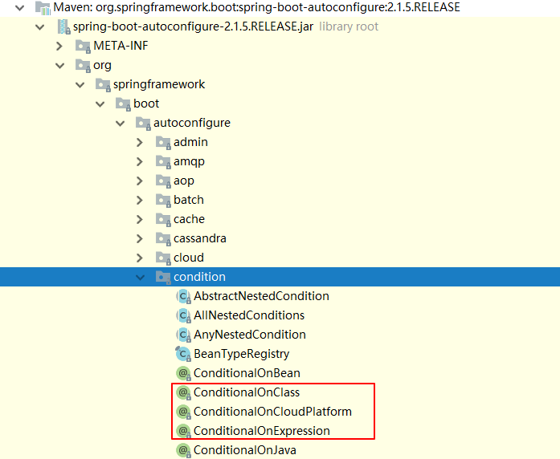
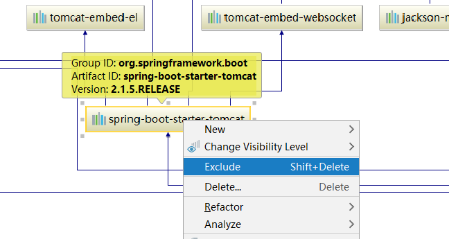
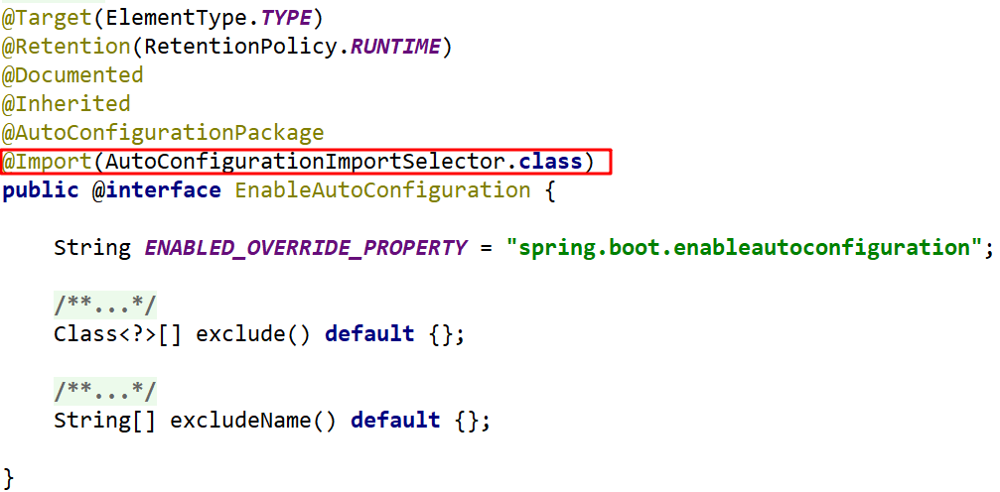
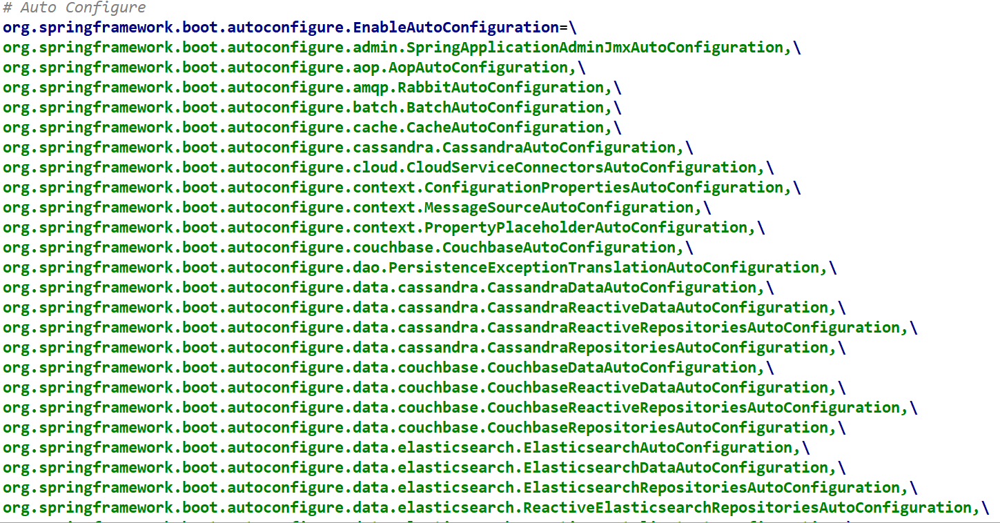
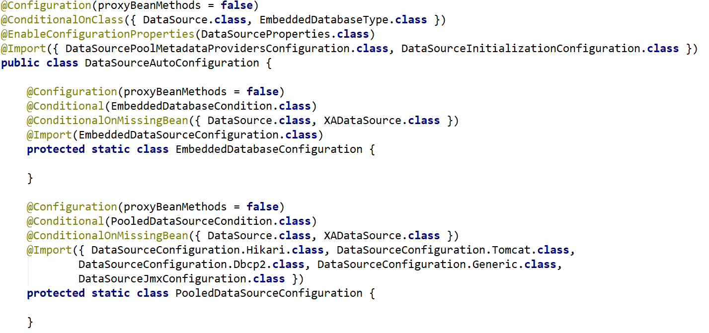
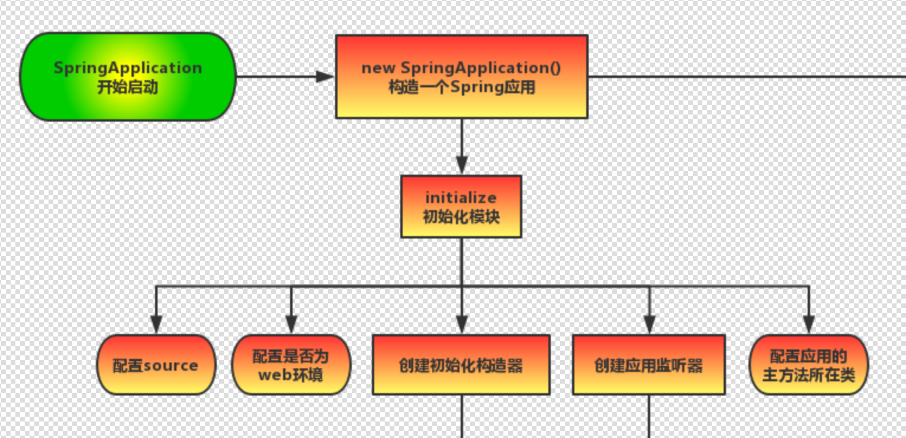
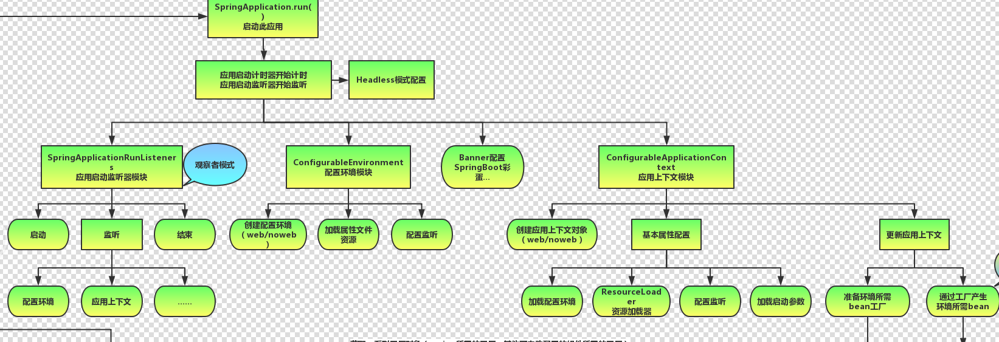

# SpringBoot高级 

## 1. SpringBoot自动配置原理

 Condition是Spring4.0后引入的条件化配置接口，通过实现Condition接口可以完成有条件的加载相应的Bean

### 1）Condition-1

@Conditional要配和Condition的实现类（ClassCondition）进行使用

> 需求：判断是否存在某个字节码文件，来决定让Spring是否初始化某个Bean。
>
> 举例：判断是否存在Jedis字节码文件，存在的话spring让spring初始化User类；

① 编写条件类ClassCondition

```java

public class ClassCondition implements Condition {
    /**
     *
     * @param context 上下文对象。用于获取环境，IOC容器，ClassLoader对象
     * @param metadata 注解元对象。 可以用于获取注解定义的属性值
     * @return
     */
    @Override
    public boolean matches(ConditionContext context, AnnotatedTypeMetadata metadata) {
      
        //1.需求： 导入Jedis坐标后创建Bean
        //思路：判断redis.clients.jedis.Jedis.class文件是否存在
        boolean flag = true;
        try {
            Class<?> cls = Class.forName("redis.clients.jedis.Jedis");
        } catch (ClassNotFoundException e) {
            flag = false;
        }
        return flag;
      
    }
}
```

② 编写Bean的配置类UserConfig

```java
@Configuration
public class UserConfig {

    @Bean
    @Conditional(ClassCondition.class)
    public User user(){
        return new User();
    }

}
```

③ 测试

```java
@SpringBootApplication
public class SpringbootConditionApplication {

    public static void main(String[] args) {
        //启动SpringBoot的应用，返回Spring的IOC容器
        ConfigurableApplicationContext context = SpringApplication.run(SpringbootConditionApplication.class, args);

        Object user = context.getBean("user");
        System.out.println(user);

    }

}
```

### 2）Condition-2

> 需求：上个需求中，condition中的类名固定写死了，不方便后期扩展。
>
> ​			本例演示将类的判断定义为动态的。判断哪个字节码文件存在可以动态指定。

① 自定义条件注解类```ConditionOnClass```该注解包含了```ClassCondition```的功能

```java
import org.springframework.context.annotation.Conditional;

import java.lang.annotation.*;


@Target({ElementType.TYPE, ElementType.METHOD})
@Retention(RetentionPolicy.RUNTIME)
@Documented
@Conditional(ClassCondition.class)
public @interface ConditionOnClass {
    String[] value();
}
```

② 使用ConditionOnClass注解，传入属性条件

==**注意：**此处@ConditionOnClass为自定义注解==

```java
@Configuration
public class UserConfig {

    @Bean
    //@Conditional(ClassCondition.class)
    @ConditionOnClass("com.alibaba.fastjson.JSON")
    public User user(){
        return new User();
    }

    @Bean
    @ConditionalOnProperty(name = "itcast",havingValue = "itheima")
    public User user2(){
        return new User();
    }

}
```

③ Condition类内部动态判断注解属性对应的字节码是否存在

```java
public class UserCondition implements Condition {

    @Override
    public boolean matches(ConditionContext context, AnnotatedTypeMetadata metadata) {

        boolean flag = true;

        //获得注解的属性集合
        MultiValueMap<String, Object> map = metadata.getAllAnnotationAttributes(ConditionOnClass.class.getName());
        //遍历注解属性——动态获取传入的属性值
        for (List<Object> values : map.values()) {
            for (Object value : values) {
                String[] strs = (String[])value;
                for (String str : strs) {
                    try {
                        //判断字节码是否存在
                        Class.forName(str); // com.alibaba.fastjson.JSON
                    } catch (ClassNotFoundException e) {
                        flag = false;
                        e.printStackTrace();
                    }
                }
            }
        }
        return flag;
    }
}
```

④ 测试User对象的创建

```java
@SpringBootApplication
public class SpringbootConditionApplication {

    public static void main(String[] args) {
        //启动SpringBoot的应用，返回Spring的IOC容器
        ConfigurableApplicationContext context = SpringApplication.run(SpringbootConditionApplication.class, args);

        Object user = context.getBean("user");
        System.out.println(user);

    }

}
```

查看条件注解源码




**SpringBoot 提供的常用条件注解：**

* ConditionalOnProperty：判断配置文件中是否有对应属性和值才初始化Bean

* ConditionalOnClass：判断环境中是否有对应字节码文件才初始化Bean

* ConditionalOnMissingBean：判断环境中没有对应Bean才初始化Bean

### 3）切换内置web服务器

① 查看```spring-boot-starter-web```继承关系图


② 排除Tomcat



 

③ pom文件中添加其他服务器jar包

```xml
 <dependency>
    <groupId>org.springframework.boot</groupId>
    <artifactId>spring-boot-starter-web</artifactId>
    <!--排除tomcat依赖-->
    <exclusions>
        <exclusion>
            <artifactId>spring-boot-starter-tomcat</artifactId>
            <groupId>org.springframework.boot</groupId>
        </exclusion>
    </exclusions>
</dependency>
<!--引入jetty的依赖-->
<dependency>
    <artifactId>spring-boot-starter-jetty</artifactId>
    <groupId>org.springframework.boot</groupId>
</dependency>
```

### 4）@Enable注解原理

SpringBoot加载jar包中的class的三种方式：

> 1. 使用ComponentScan扫描jar包中的package
> 2. 使用Import导入Config类
> 3. 使用自定义注解，封装@Import注解

① SpringBoot本工程

```java
@SpringBootApplication
@ComponentScan(value = {"cn.itheima"})      //第一种方式：使用ComponentScan扫描jar包中的package
@Import(PersonConfig.class)                 //第二种方式：使用Import导入Config类
@EnablePerson                               //第三种方式：使用自定义注解，封装@Import注解
public class DemoApplication {

	public static void main(String[] args) {
 			ConfigurableApplicationContext context = 		
                					SpringApplication.run(DemoApplication.class, args);
        	//获取jar包中的Bean
 			Object person = context.getBean(User.class);
 			System.out.println(person);
    }
}
```

② 引入外部工程jar包

```
<dependency>
      <groupId>com.itheima</groupId>
      <artifactId>springboot-enable-other</artifactId>
      <version>0.0.1-SNAPSHOT</version>
</dependency>
```

③ springboot-enable-other工程

**UserConfig**

```java
@Configuration
public class UserConfig {

  @Bean
  public User user() {
        return new User();
  }
}
```

**EnableUser注解类**

```java
import org.springframework.context.annotation.Import;

import java.lang.annotation.*;

@Target(ElementType.TYPE)
@Retention(RetentionPolicy.RUNTIME)
@Documented
@Import(UserConfig.class)
public @interface EnableUser {
    
}
```
==**重点：```@Enable```注解底层原理是使用```@Import```注解实现Bean的动态加载**==

### 5）@Import注解

```@import```的四种用法：

**① 导入Bean**

​	```@Import(User.class)```

**② 导入配置类**

​	```@Import(UserConfig.class)```

**③ 导入 ImportSelector 实现类。一般用于加载配置文件中的类**

​	```@Import(MyImportSelector.class)```

```java
public class MyImportSelector implements ImportSelector {
    @Override
    public String[] selectImports(AnnotationMetadata importingClassMetadata) {
        return new String[]{"com.itheima.domain.User", "com.itheima.domain.Role"};
    }
}
```

**④ 导入 ImportBeanDefinitionRegistrar 实现类。**

​	```@Import({MyImportBeanDefinitionRegistrar.class})```

```java
public class MyImportBeanDefinitionRegistrar implements ImportBeanDefinitionRegistrar {
    @Override
    public void registerBeanDefinitions(AnnotationMetadata importingClassMetadata, 
                                        BeanDefinitionRegistry registry) {
        AbstractBeanDefinition beanDefinition = 
            BeanDefinitionBuilder.rootBeanDefinition(User.class).getBeanDefinition();
        //参数一:bean的名称
        //参数二:bean的定义
        registry.registerBeanDefinition("user", beanDefinition);
    }
}
```

### 6）@EnableAutoConfiguration

@EnableAutoConfiguration中使用的是第三种方式@Import(AutoConfigurationImportSelector.class)来加载配置类。 

1. **@EnableAutoConfiguration 注解内部使用 @Import(AutoConfigurationImportSelector.class)来加载配置类。** 



2. **配置文件位置：META-INF/spring.factories，该配置文件中定义了大量的配置类，当 SpringBoot 应用启动时，会自动加载这些配置类，初始化Bean。**


​	spring.factories配置文件摘要



3. **并不是所有的Bean都会被初始化，在配置类中使用Condition来加载满足条件的Bean**



### 7）总结


## 2. SpringBoot自定义starter实现

> 需求：自定义redis-spring-boot-starter起步依赖

**① 创建redis-spring-boot-starter工程**

 pom文件中引入redis-spring-boot-autoconfigure

```xml
 <!--引入configure-->
<dependency>
    <groupId>com.itheima</groupId>
    <artifactId>redis-spring-boot-autoconfigure</artifactId>
    <version>0.0.1-SNAPSHOT</version>
</dependency>
```

**② 创建redis-spring-boot-autoconfigure配置工程**

创建RedisProperties配置文件参数绑定类 

```java
@ConfigurationProperties(prefix = "redis")
public class RedisProperties {

    private String host = "localhost";
    private int port = 6379;


    public String getHost() {
        return host;
    }

    public void setHost(String host) {
        this.host = host;
    }

    public int getPort() {
        return port;
    }

    public void setPort(int port) {
        this.port = port;
    }
}
```

 **③ 在autoconfigure工程中创建RedisAutoConfiguration自动配置类**

```java
@Configuration
@EnableConfigurationProperties(RedisProperties.class)	//启用redis的属性配置类
@ConditionOnClass(Jedis.class)							//Jedis字节码存在时才启用
public class RedisAutoConfiguration {

    /**
     * 提供Jedis的bean
     */
    @Bean	
    @ConditionalOnMissingBean(name="jedis")				//如果用户已经定义Jedis则不启用
    public Jedis jedis(RedisProperties redisProperties) {
        return new Jedis(redisProperties.getHost(), redisProperties.getPort());
    }
}
```

**④  在autoconfigure工程的resource目录下创建META-INF文件夹并创建spring.factories**

注意：”\ “是换行使用的

```properties
org.springframework.boot.autoconfigure.EnableAutoConfiguration=\
  com.itheima.redis.config.RedisAutoConfiguration
```

**⑤ 在springboot工程中引入自定义的redis的starter**

```xml
<!--自定义的redis的starter-->
<dependency>
    <groupId>com.itheima</groupId>
    <artifactId>redis-spring-boot-starter</artifactId>
    <version>0.0.1-SNAPSHOT</version>
</dependency>
```

**⑥ 测试**

```java
Jedis jedis = context.getBean(Jedis.class);
System.out.println(jedis);
```

**⑦ 修改redis配置**

在使用自定义starter的工程的application.properties中的配置参数

```properties
redis.port=6666
```

**⑧ 测试```@ConditionalOnMissingBean```注解，用户自己定了Redis后，则自动配置就不起用了。**

```java
@Configuration
@EnableConfigurationProperties(RedisProperties.class)
@ConditionalOnClass(Jedis.class)
public class RedisAutoConfiguration {

    /**
     * 提供Jedis的bean
     */
    @Bean
    @ConditionalOnMissingBean(name = "jedis")
    public Jedis jedis(RedisProperties redisProperties) {
        System.out.println("RedisAutoConfiguration....");
        return new Jedis(redisProperties.getHost(), redisProperties.getPort());
    }
}
```

## 3. SpringBoot事件监听

### 3.1 Java的事件监听机制

 Java中的事件监听机制定义了以下几个角色：

1. 事件：Event，继承 java.util.EventObject 类的对象
2. 事件源：Source ，任意对象Object;
3. 监听器：Listener，实现 java.util.EventListener 接口 的对象


### 3.2 Springboot监听器

**SpringBoot监听器的机制：**SpringBoot的事件机制其实是对Java事件监听机制的封装。

**SpringBoot监听器的作用：**SpringBoot 在项目启动时完成一些操作。

**SpringBoot监听器的种类：**

- ApplicationContextInitializer：在spring的IOC容器初始化前执行
- SpringApplicationRunListener：在项目启动时执行一些预操作
- CommandLineRunner：在项目启动时执行一些预操作
- ApplicationRunner：在项目启动时执行一些预操作
- ```ApplicationRunner```和```CommandLineRunner```基本一样，主要区别就在于```run```方法的参数上，ApplicationRunner将外部传递的参数值封装成了对象```ApplicationArguments```，而```CommandLineRunner```的```run```方法用可变参数进行封装。

自定义监听器的启动时机：ApplicationRunner和CommandLineRunner的实现类都是当项目启动后执行，使用@Component放入容器即可使用。

#### 1. MyApplicationRunner

```java
/**
 * 当项目启动后执行run方法。
 */
@Component
public class MyApplicationRunner implements ApplicationRunner {
    @Override
    public void run(ApplicationArguments args) throws Exception {
        System.out.println("ApplicationRunner...run");
        System.out.println(Arrays.asList(args.getSourceArgs()));
    }
} 
```

#### 2. MyCommandLineRunner

```java
@Component
public class MyCommandLineRunner implements CommandLineRunner {
    @Override
    public void run(String... args) throws Exception {
        System.out.println("CommandLineRunner...run");
        System.out.println(Arrays.asList(args));
    }
}
```

#### 3. ApplicationContextInitializer

​	启动的三种方式：

​	方式1：在resource文件夹下添加META-INF/spring.factories，并配置实现类

```properties
org.springframework.context.ApplicationContextInitializer=com.itheima.springbootlistener.listener.MyApplicationContextInitializer
```

```
@Component
public class MyApplicationContextInitializer implements ApplicationContextInitializer {
    @Override
    public void initialize(ConfigurableApplicationContext applicationContext) {
        System.out.println("ApplicationContextInitializer....initialize");
    }
}
```

​	方式2：在application.yaml配置实现类

```yaml
context:
  initializer:
    classes: com.itheima.event.MyApplicationContextInitializer
```

​	方式3：在启动类的main方法中通过```addInitializers```方法添加实现类

```java
SpringApplication springApplication = new SpringApplication(DemoApplication.class);
springApplication.addInitializers(new MyApplicationContextInitializer());
springApplication.run(args);
```

#### 4. SpringApplicationRunListener

**① 创建SpringApplicationRunListener的实现类**

```java
public class MySpringApplicationRunListener implements SpringApplicationRunListener {

    public MySpringApplicationRunListener(SpringApplication application, String[] args) {
    }

    @Override
    public void starting() {
        System.out.println("starting...项目启动中");
    }

    @Override
    public void environmentPrepared(ConfigurableEnvironment environment) {
        System.out.println("environmentPrepared...环境对象开始准备");
    }

    @Override
    public void contextPrepared(ConfigurableApplicationContext context) {
        System.out.println("contextPrepared...上下文对象开始准备");
    }

    @Override
    public void contextLoaded(ConfigurableApplicationContext context) {
        System.out.println("contextLoaded...上下文对象开始加载");
    }

    @Override
    public void started(ConfigurableApplicationContext context) {
        System.out.println("started...上下文对象加载完成");
    }

    @Override
    public void running(ConfigurableApplicationContext context) {
        System.out.println("running...项目启动完成，开始运行");
    }

    @Override
    public void failed(ConfigurableApplicationContext context, Throwable exception) {
        System.out.println("failed...项目启动失败");
    }
}
```

**② 配置SpringApplicationRunListener**

```java
org.springframework.boot.SpringApplicationRunListener=\
  com.itheima.event.MySpringApplicationRunListener
```

**③ 给SpringApplicationRunListener添加有参构造方法**

```java
public MySpringApplicationRunListener(SpringApplication application, String[] args) {
}
```

## 4. SpringBoot源码分析

### 4.1 初始化

1.  配置启动引导类（判断是否有启动主类）

2. 判断是否是Web环境

3. 获取初始化类、监听器类




### 4.2 SpringBoot流程分析-run

1. 启动计时器

2. 执行监听器

3. 准备环境

4.  打印banner：可以resource下粘贴自定义的banner

5. 创建context

   ```
   refreshContext(context);
   ```

   执行refreshContext方法后才真正创建Bean




## 5. SpringBoot监控

### 5.1 actuator基本使用

 ①导入依赖坐标

```xml
<dependency>
  <groupId>org.springframework.boot</groupId>
  <artifactId>spring-boot-starter-actuator</artifactId>
</dependency>
```

②访问http://localhost:8080/actuator

```json
{
    "_links":{
        "self":{
            "href":"http://localhost:8080/actuator",
            "templated":false
        },
        "health":{
            "href":"http://localhost:8080/actuator/health",
            "templated":false
        },
        "health-component-instance":{
            "href":"http://localhost:8080/actuator/health/{component}/{instance}",
            "templated":true
        },
        "health-component":{
            "href":"http://localhost:8080/actuator/health/{component}",
            "templated":true
        },
        "info":{
            "href":"http://localhost:8080/actuator/info",
            "templated":false
        }
    }
}
```

http://localhost:8080/actuator/info

在application.properties中配置

```properties
info.name=lucy
info.age=99
```

http://localhost:8080/actuator/health

开启健康检查详细信息

```properties
management.endpoint.health.show-details=always
```

```json
{
    "status":"UP",
    "details":{
        "diskSpace":{
            "status":"UP",
            "details":{
                "total":159579508736,
                "free":13558104064,
                "threshold":10485760
            }
        },
        "redis":{
            "status":"UP",
            "details":{
                "version":"2.4.5"
            }
        }
    }
}
```

### 5.2 开启所有endpoint

 开启所有endpoint

在application.properties中配置：

```properties
management.endpoints.web.exposure.include=*
```

开启所有endpoint的返回结果：

```properties
{
    "_links":{
        "self":{
            "href":"http://localhost:8080/actuator",
            "templated":false
        },
        "auditevents":{
            "href":"http://localhost:8080/actuator/auditevents",
            "templated":false
        },
        "beans":{
            "href":"http://localhost:8080/actuator/beans",
            "templated":false
        },
        "caches-cache":{
            "href":"http://localhost:8080/actuator/caches/{cache}",
            "templated":true
        },
        "caches":{
            "href":"http://localhost:8080/actuator/caches",
            "templated":false
        },
        "health-component-instance":{
            "href":"http://localhost:8080/actuator/health/{component}/{instance}",
            "templated":true
        },
        "health":{
            "href":"http://localhost:8080/actuator/health",
            "templated":false
        },
        "health-component":{
            "href":"http://localhost:8080/actuator/health/{component}",
            "templated":true
        },
        "conditions":{
            "href":"http://localhost:8080/actuator/conditions",
            "templated":false
        },
        "configprops":{
            "href":"http://localhost:8080/actuator/configprops",
            "templated":false
        },
        "env":{
            "href":"http://localhost:8080/actuator/env",
            "templated":false
        },
        "env-toMatch":{
            "href":"http://localhost:8080/actuator/env/{toMatch}",
            "templated":true
        },
        "info":{
            "href":"http://localhost:8080/actuator/info",
            "templated":false
        },
        "loggers":{
            "href":"http://localhost:8080/actuator/loggers",
            "templated":false
        },
        "loggers-name":{
            "href":"http://localhost:8080/actuator/loggers/{name}",
            "templated":true
        },
        "heapdump":{
            "href":"http://localhost:8080/actuator/heapdump",
            "templated":false
        },
        "threaddump":{
            "href":"http://localhost:8080/actuator/threaddump",
            "templated":false
        },
        "metrics-requiredMetricName":{
            "href":"http://localhost:8080/actuator/metrics/{requiredMetricName}",
            "templated":true
        },
        "metrics":{
            "href":"http://localhost:8080/actuator/metrics",
            "templated":false
        },
        "scheduledtasks":{
            "href":"http://localhost:8080/actuator/scheduledtasks",
            "templated":false
        },
        "httptrace":{
            "href":"http://localhost:8080/actuator/httptrace",
            "templated":false
        },
        "mappings":{
            "href":"http://localhost:8080/actuator/mappings",
            "templated":false
        }
    }
}
```

### 5.3 图形化界面使用

SpringBoot Admin 有两个角色，客户端(Client)和服务端(Server)。

以下为创建服务端和客户端工程步骤：

#### 1）admin-server

① 创建 admin-server 模块

② 导入依赖坐标 admin-starter-server


```xml
<dependency>
      <groupId>de.codecentric</groupId>
      <artifactId>spring-boot-admin-starter-server</artifactId>
</dependency>
```

③ 在引导类上启用监控功能@EnableAdminServer

```java
@EnableAdminServer
@SpringBootApplication
public class SpringbootAdminServerApplication {

    public static void main(String[] args) {
        SpringApplication.run(SpringbootAdminServerApplication.class, args);
    }

}

```

#### 2）admin-client

① 创建 admin-client 模块

② 导入依赖坐标 admin-starter-client

```xml
<dependency>
    <groupId>de.codecentric</groupId>
    <artifactId>spring-boot-admin-starter-client</artifactId>
</dependency>
```

③ 配置相关信息：server地址等

```properties
# 执行admin.server地址
spring.boot.admin.client.url=http://localhost:9000

management.endpoint.health.show-details=always
management.endpoints.web.exposure.include=*
```

④ 启动server和client服务，访问server

## 6. SpringBoot部署

 SpringBoot 项目开发完毕后，支持两种方式部署到服务器：

① jar包(官方推荐)

② war包

**更改pom文件中的打包方式为war**

修改启动类

```java
import org.springframework.boot.SpringApplication;
import org.springframework.boot.autoconfigure.SpringBootApplication;
import org.springframework.boot.builder.SpringApplicationBuilder;
import org.springframework.boot.web.servlet.support.SpringBootServletInitializer;

@SpringBootApplication
public class SpringbootDeployApplication extends SpringBootServletInitializer {

    public static void main(String[] args) {
        SpringApplication.run(SpringbootDeployApplication.class, args);
    }


    @Override
    protected SpringApplicationBuilder configure(SpringApplicationBuilder builder) {
        return builder.sources(SpringbootDeployApplication.class);
    }
}

```

指定打包的名称

```xml
<build>
   <finalName>springboot</finalName>
   <plugins>
       <plugin>
           <groupId>org.springframework.boot</groupId>
           <artifactId>spring-boot-maven-plugin</artifactId>
       </plugin>
   </plugins>
</build>
```

