# Arthas

`Arthas` 是Alibaba开源的Java诊断工具，深受开发者喜爱。在线排查问题，无需重启；动态跟踪Java代码；实时监控JVM状态。

`Arthas` 支持JDK 6+，支持Linux/Mac/Windows，采用命令行交互模式，同时提供丰富的 `Tab` 自动补全功能，进一步方便进行问题的定位和诊断。

## 1. 基本使用

### 1）安装

**在线安装（推荐）**

```
curl -O https://alibaba.github.io/arthas/arthas-boot.jar
```

* 如果下载速度比较慢，可以使用aliyun的镜像：

```
java -jar arthas-boot.jar --repo-mirror aliyun --use-http
```

**全量安装**

最新版本，[点击](http://repository.sonatype.org/service/local/artifact/maven/redirect?r=central-proxy&g=com.taobao.arthas&a=arthas-packaging&e=zip&c=bin&v=LATEST)下载

解压后，运行：

```
java -jar arthas-boot.jar
```

**查看帮助信息**：

```
java -jar arthas-boot.jar -h
```

### 2）启动

在命令行执行如下命令

```
$ $ java -jar arthas-boot.jar
* [1]: 12339 arthas-demo.jar
```

Demo进程是第1个，则输入1，再输入`回车/enter`。Arthas会attach到目标进程上，并输出日志：

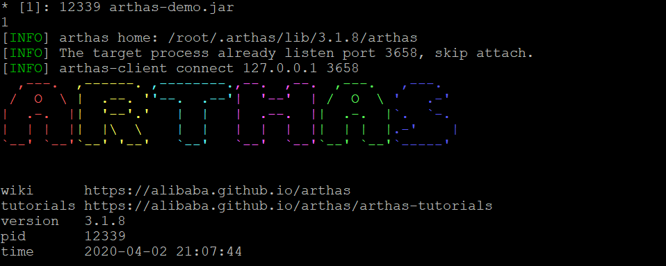

### 3）dashboard

输入[dashboard](https://alibaba.github.io/arthas/dashboard.html)，按`回车/enter`，会展示当前进程的信息，按`ctrl+c`可以中断执行。

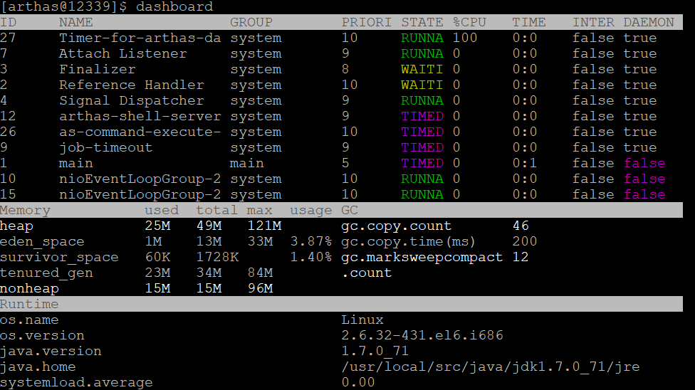

### 3）thread

通过thread命令来打印到某个线程的栈，比如打印```arthas-demo.jar```的main栈信息

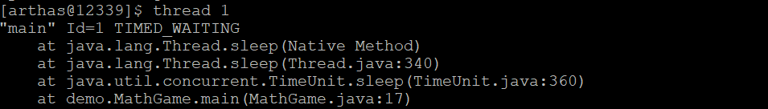

### 4）jad

通过jad来反编译Class类

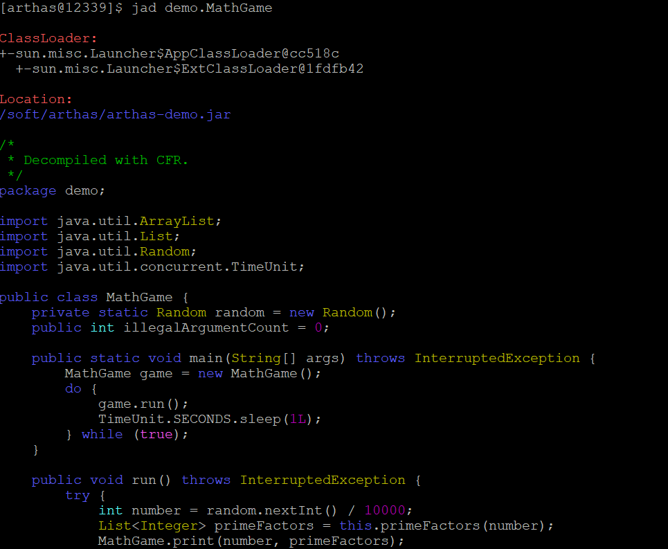

### 5）watch

通过[watch](https://alibaba.github.io/arthas/watch.html)命令来查看函数的返回值：

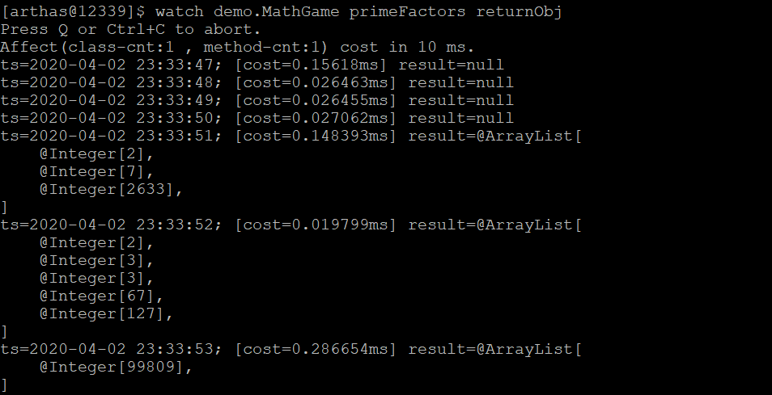

### 6）退出

如果只是退出当前的连接，可以用`quit`或者`exit`命令。Attach到目标进程上的arthas还会继续运行，端口会保持开放，下次连接时可以直接连接上。

如果想完全退出arthas，可以执行`stop`命令。

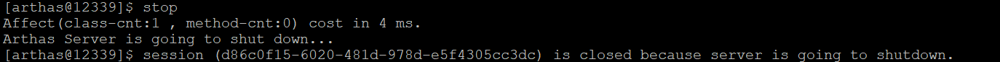

## 2. 进阶使用

### 1）基础命令

- help——查看命令帮助信息
- [cat](https://alibaba.github.io/arthas/cat.html)——打印文件内容，和linux里的cat命令类似
- [grep](https://alibaba.github.io/arthas/grep.html)——匹配查找，和linux里的grep命令类似
- [tee](https://alibaba.github.io/arthas/tee.html)——复制标准输入到标准输出和指定的文件，和linux里的tee命令类似
- [pwd](https://alibaba.github.io/arthas/pwd.html)——返回当前的工作目录，和linux命令类似
- cls——清空当前屏幕区域
- session——查看当前会话的信息
- [reset](https://alibaba.github.io/arthas/reset.html)——重置增强类，将被 Arthas 增强过的类全部还原，Arthas 服务端关闭时会重置所有增强过的类
- version——输出当前目标 Java 进程所加载的 Arthas 版本号
- history——打印命令历史
- quit——退出当前 Arthas 客户端，其他 Arthas 客户端不受影响
- stop——关闭 Arthas 服务端，所有 Arthas 客户端全部退出
- [keymap](https://alibaba.github.io/arthas/keymap.html)——Arthas快捷键列表及自定义快捷键

### 2）JVM相关

- [dashboard](https://alibaba.github.io/arthas/dashboard.html)——当前系统的实时数据面板

- [thread](https://alibaba.github.io/arthas/thread.html)——查看当前 JVM 的线程堆栈信息

  1. 查询指定时间段内的线程信息

     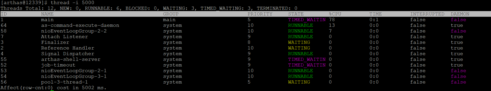

  2. 查询某个线程的堆栈信息

     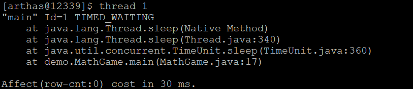

  3. 当前最忙的前N个线程并打印堆栈

     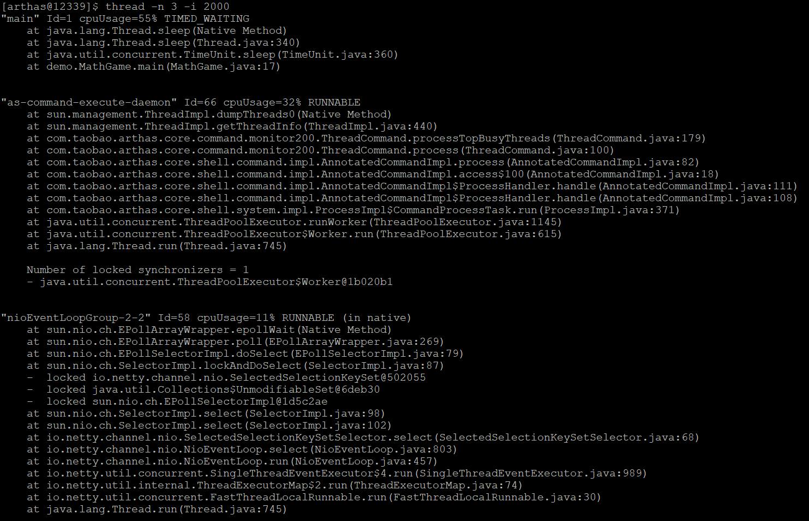

  4. 查找当前阻塞其他线程的线程


有时候我们发现应用卡住了， 通常是由于某个线程拿住了某个锁， 并且其他线程都在等待这把锁造成的。 为了排查这类问题， arthas提供了`thread -b`， 一键找出那个罪魁祸首。

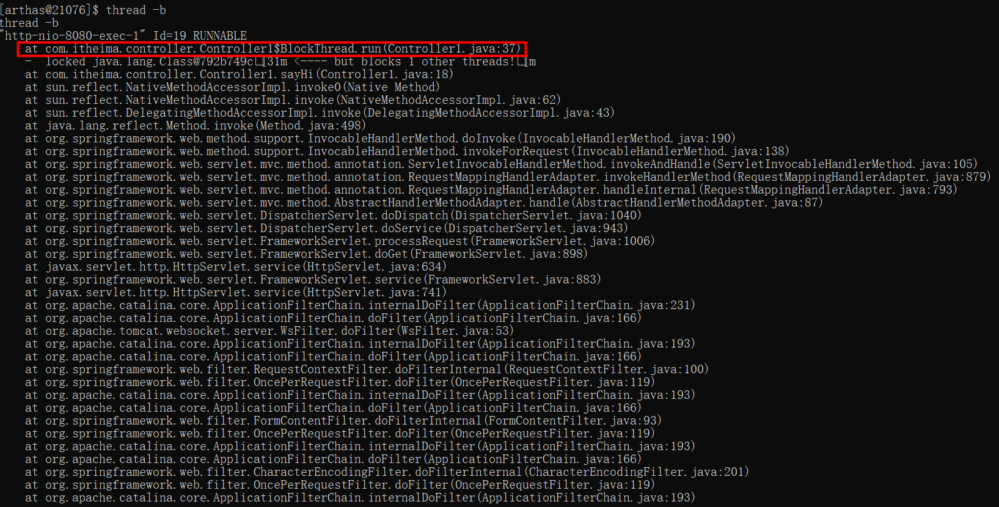

注意， 目前只支持找出synchronized关键字阻塞住的线程， 如果是`java.util.concurrent.Lock`， 目前还不支持。

- [jvm](https://alibaba.github.io/arthas/jvm.html)——查看当前 JVM 的信息

  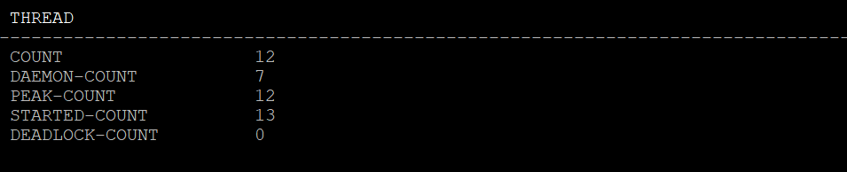

  **THREAD相关**

  - COUNT: JVM当前活跃的线程数
  - DAEMON-COUNT: JVM当前活跃的守护线程数
  - PEAK-COUNT: 从JVM启动开始曾经活着的最大线程数
  - STARTED-COUNT: 从JVM启动开始总共启动过的线程次数
  - DEADLOCK-COUNT: JVM当前死锁的线程数

- [sysprop](https://alibaba.github.io/arthas/sysprop.html)——查看和修改JVM的系统属性

  1. 查看所有属性

     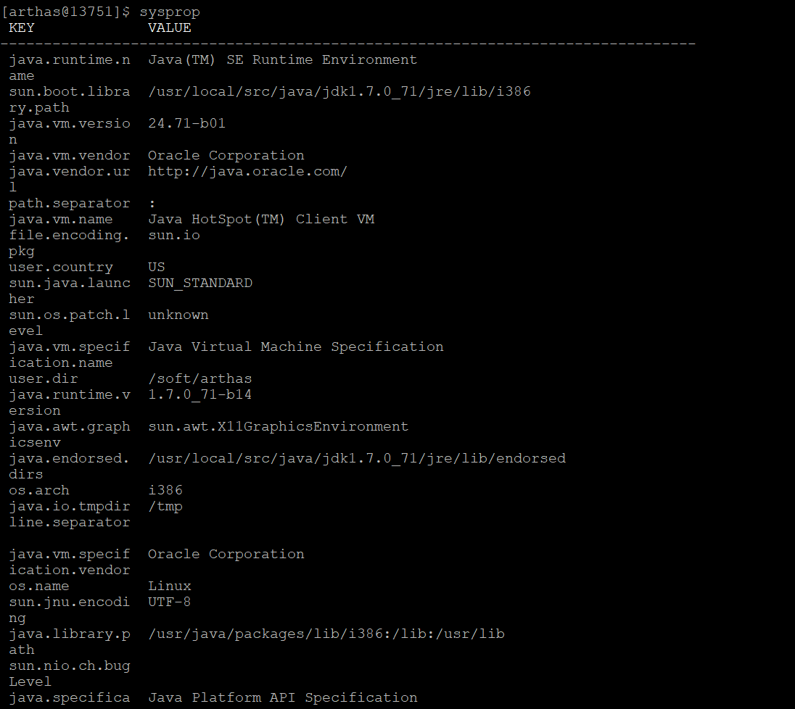

  2. 查看单个属性

     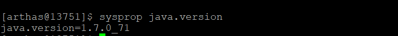

  3. 修改单个属性

     

- [sysenv](https://alibaba.github.io/arthas/sysenv.html)——查看JVM的环境变量

  1. 查看当前JVM的环境属性

     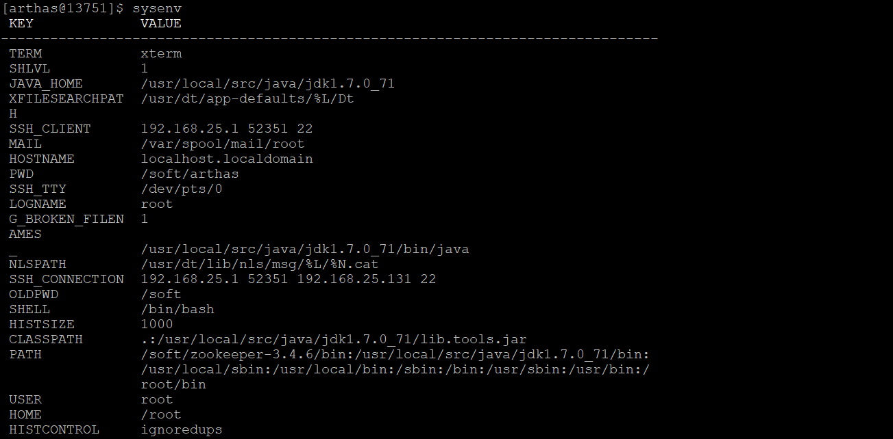

  2. 查看单个环境变量

     

- [vmoption](https://alibaba.github.io/arthas/vmoption.html)——查看和修改JVM里诊断相关的option

- [perfcounter](https://alibaba.github.io/arthas/perfcounter.html)——查看当前 JVM 的Perf Counter信息

- [logger](https://alibaba.github.io/arthas/logger.html)——查看和修改logger

- [getstatic](https://alibaba.github.io/arthas/getstatic.html)——查看类的静态属性

  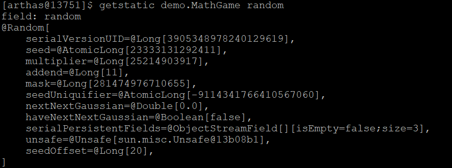

- [ognl](https://alibaba.github.io/arthas/ognl.html)——执行ognl表达式

  [参考文档](./arthas_ognl.md)

- [mbean](https://alibaba.github.io/arthas/mbean.html)——查看 Mbean 的信息

- [heapdump](https://alibaba.github.io/arthas/heapdump.html)——dump java heap, 类似jmap命令的heap dump功能

### 3）class/classloader相关

- [sc](https://alibaba.github.io/arthas/sc.html)——查看JVM已加载的类信息
- [sm](https://alibaba.github.io/arthas/sm.html)——查看已加载类的方法信息
- [jad](https://alibaba.github.io/arthas/jad.html)——反编译指定已加载类的源码
- [mc](https://alibaba.github.io/arthas/mc.html)——内存编绎器，内存编绎`.java`文件为`.class`文件
- [redefine](https://alibaba.github.io/arthas/redefine.html)——加载外部的`.class`文件，redefine到JVM里
- [dump](https://alibaba.github.io/arthas/dump.html)——dump 已加载类的 byte code 到特定目录
- [classloader](https://alibaba.github.io/arthas/classloader.html)——查看classloader的继承树，urls，类加载信息，使用classloader去getResource

### 4）monitor/watch/trace相关

请注意，这些命令，都通过字节码增强技术来实现的，会在指定类的方法中插入一些切面来实现数据统计和观测，因此在线上、预发使用时，请尽量明确需要观测的类、方法以及条件，诊断结束要执行 `stop` 或将增强过的类执行 `reset` 命令。

- [monitor](https://alibaba.github.io/arthas/monitor.html)——方法执行监控
- [watch](https://alibaba.github.io/arthas/watch.html)——方法执行数据观测
- [trace](https://alibaba.github.io/arthas/trace.html)——方法内部调用路径，并输出方法路径上的每个节点上耗时
- [stack](https://alibaba.github.io/arthas/stack.html)——输出当前方法被调用的调用路径
- [tt](https://alibaba.github.io/arthas/tt.html)——方法执行数据的时空隧道，记录下指定方法每次调用的入参和返回信息，并能对这些不同的时间下调用进行观测

## 3. Bistoury

## 4. IDEA插件

 