# Linux-v10.0-01天-课堂笔记

# 1 初识Linux

> 在前面的课程中，我们无论是开发、测试。部署、存储都在Windwos操作系统的环境中，从今天开始我们一起学习下Linux,Linux系统和Windows系统最大的区别就是==图形化界面操作==和==用途==上有所差异，除了这两点，两者有异曲同工之妙，在国内， Linux 系统更多的是应用于服务器上，而桌面操作系统更多使用的是 Windows，也就是说Linux与Windows一样，同样也是操作系统只是在使用以及应用上有所差异，其他都是一样的；
> 因为Linux也是操作系统；所以在正式进入Linux学习之前，我们先简单的学习操作系统的知识，然后在讲解Linux。

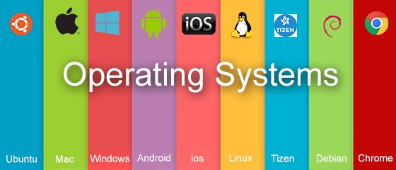

## 1.1 操作系统

操作系统(Operation System, OS)，是管理[计算机](https://baike.baidu.com/item/计算机)[硬件](https://baike.baidu.com/item/硬件)与[软件](https://baike.baidu.com/item/软件)资源的[计算机程序](https://baike.baidu.com/item/计算机程序)，同时也是计算机系统的内核与基石。操作系统需要处理如管理与配置[内存](https://baike.baidu.com/item/内存)、决定[系统资源](https://baike.baidu.com/item/系统资源/974435)供需的优先次序、控制[输入设备](https://baike.baidu.com/item/输入设备/10823368)与[输出设备](https://baike.baidu.com/item/输出设备/10823333)、操作网络与管理文件系统等基本事务。操作系统也提供一个让用户与系统交互的操作界面。

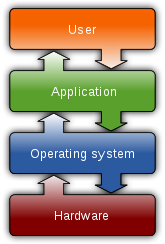

如上图所示，在操作系统的最上层是用户，中间层是操作系统（里面可能装了很多的应用程序），最下层是硬件的支撑，包含CPU/内存/硬盘等。这就是一个完成的操作系统结构图。

**主流操作系统按照应用领域的划分**

**1、桌面操作系统**

- Window 系列
  - 用户群体大
- macOS
  - 细节处理的更好, 没有windows软件丰富, 价格高
- Linux
  - 应用软件少

**2、服务器操作系统**

- Linux

  - 安全、稳定、免费
  - 占有率高

- Windows Server

  - 付费
  - 占有率低

  

**3、嵌入式操作系统**

​    Linux

**4、移动设备操作系统**

 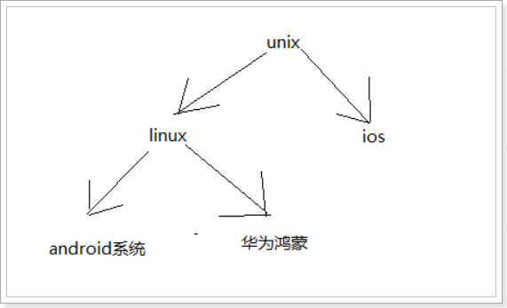

- IOS
- Android (基于Linux)
- 华为鸿蒙(基于linux)

## 1.2 Linux发展历程

```
引子
在上面，我们学习了操作系统的知识，也知道了主流操作系统按照应用领域划分了四个类型的操作系统，其中Linux操作系统在四个领域都有提名，因为它是至今开源序列最好的操作系统，下面，我们就一起看下Linux的发展历程，看看它是怎么诞生的...
```

1984年，Andrew S.Tanenbaum 开发了用于教学的Unix系统，命名为Minix，但是仅仅用于教学
1989年，Andrew S.Tanenbaum将Minix系统运行于x86的pc平台
1990年，芬兰赫尔辛基大学学生Linus Torvalds首次接触Minix系统
1991年，Linus Torvalds开始在Minix上编写各种驱动程序等操作系统内核组件
1991年年底，Linus Torvalds公开了Linux内核源码0.02版，仅仅是内核
1994年，Linux 1.0版本发行，Linux转向GPL版权协议
至此，Linux开始盛行开来...


Linux 内核最初是由李纳斯•托瓦兹（Linus Torvalds）在赫尔辛基大学读书时出于个人爱好而编写的，当时他觉得教学用的迷你版 Unix操作系统 Minix 太难用了，于是决定自己开发一个操作系统。

第 1 版本于 1991 发布，当时仅有 10 000 行代码。

李纳斯•托瓦兹没有保留 Linux 源代码的版权，公开了代码，并邀请他人一起完善 Linux。与 Windows 及其他有专利权的操作系统不同，Linux 开放源代码，任何人都可以免费使用它。

据估计，现在只有 2% 的 Linux 核心代码是由李纳斯•托瓦兹自己编写的，虽然他仍然拥有 Linux 内核（操作系统的核心部分），并且保留了选择新代码和需要合并的新方法的最终裁定权。现在大家所使用的 Linux，我更倾向于说是由李纳斯•托瓦兹和后来陆续加入的众多 Linux 好者共同开发完成的。

> Unix  
>
> Unix  操作系统由肯•汤普森（Ken Thompson）和丹尼斯•里奇（Dennis Ritchie）发明。它的部分技术来源可追溯到从 1965 年开始的 Multics 工程计划，该计划由贝尔实验室、美国麻省理工学院和通用电气公司联合发起，目标是开发一种交互式的、具有多道程序处理能力的分时操作系统，以取代当时广泛使用的批处理操作系统。
>
> Unix是一个强大的多用户、多任务操作系统。于1969年在AT&T的贝尔实验室开发。Unix  的商标权由国际开放标准组织（The Open Group）所拥有。Unix操作系统是商业版，需要收费，价格比Microsoft Windows正版要贵一些。

## 1.3 Linux简介

```
引子
Linux和我们常见的Windows一样，都是操作系统，
例如：新浪、百度、淘宝等互联网公司，他们使用的服务器全都是Linux系统；全球500强企业95%的服务器使用的都是Linux系统。
```

### **1.3.1 什么是 Linux**

Linux是一套免费使用和自由传播的[类Unix](https://baike.baidu.com/item/类Unix)[操作系统](https://baike.baidu.com/item/操作系统/192)，是一个基于[POSIX](https://baike.baidu.com/item/POSIX)和Unix的多用户、[多任务](https://baike.baidu.com/item/多任务/1011764)、支持[多线程](https://baike.baidu.com/item/多线程/1190404)和多[CPU](https://baike.baidu.com/item/CPU)的操作系统。它能运行主要的Unix工具软件、应用程序和网络协议。它支持[32位](https://baike.baidu.com/item/32位/5812218)和[64位](https://baike.baidu.com/item/64位)硬件。Linux继承了Unix以网络为核心的设计思想，是一个性能稳定的多用户网络操作系统。

Linux 的标志和吉祥物是一只名字叫做Tux(它克斯)的企鹅，Linux是基于Unix的。

Linux是一种自由和开放源码的操作系统，存在着许多不同的Linux版本，但它们都使用了Linux内核。Linux可安装在各种计算机硬件设备中，比如手机、平板电脑、路由器、台式计算机

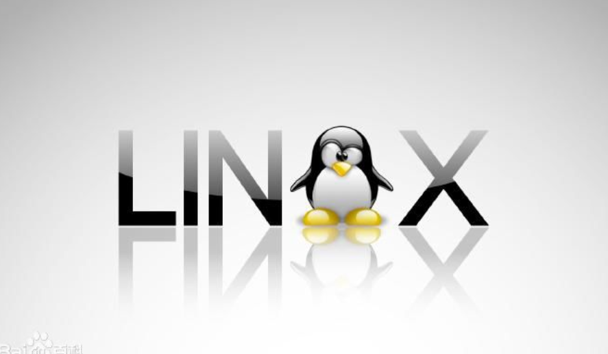

Linux不仅系统性能稳定，而且是开源软件。其核心防火墙组件性能高效、配置简单，保证了系统的安全。在很多企业网络中，为了追求速度和安全，Linux操作系统不仅仅是被网络运维人员当作服务器使用，Linux既可以当作[服务器](https://baike.baidu.com/item/服务器/100571)，又可以当作网络防火墙是Linux的 一大亮点。 

Linux与其他操作系统相比 ，具有[开放源码](https://baike.baidu.com/item/开放源码/7176422)、没有版权、技术社区用户多等特点 ，开放源码使得用户可以自由裁剪，灵活性高，功能强大，成本低。尤其系统中内嵌网络协议栈 ，经过适当的配置就可实现路由器的功能。这些特点使得Linux成为开发路由交换设备的理想开发平台。

### 1.3.2 Linux的特点

**基本思想**

Linux的基本思想有两点：

第一：一切都是文件

第二：每个软件都有确定的用途

其中第一条详细来讲就是系统中的所有都归结为一个文件，包括[命令](https://baike.baidu.com/item/命令)、[硬件](https://baike.baidu.com/item/硬件)和[软件](https://baike.baidu.com/item/软件/12053)设备、[操作系统](https://baike.baidu.com/item/操作系统/192)、[进程](https://baike.baidu.com/item/进程)等等对于操作系统[内核](https://baike.baidu.com/item/内核)而言，都被视为拥有各自特性或类型的文件。至于说Linux是基于Unix的，很大程度上也是因为这两者的基本思想十分相近

**完全免费**

Linux是一款免费的操作系统，用户可以通过网络或其他途径免费获得，并可以任意修改其[源代码](https://baike.baidu.com/item/源代码/3969)。这是其他的操作系统所做不到的。正是由于这一点，来自全世界的无数[程序员](https://baike.baidu.com/item/程序员/62748)参与了Linux的修改、编写工作，程序员可以根据自己的兴趣和灵感对其进行改变，这让Linux吸收了无数程序员的精华，不断壮大。

**完全兼容POSIX1.0标准**

这使得可以在Linux下通过相应的[模拟器](https://baike.baidu.com/item/模拟器)运行常见的[DOS](https://baike.baidu.com/item/DOS/32025)、[Windows](https://baike.baidu.com/item/Windows)的程序。这为用户从Windows转到Linux奠定了基础。许多用户在考虑使用Linux时，就想到以前在Windows下常见的程序是否能正常运行，这一点就消除了他们的疑虑。

**多用户、多任务**

Linux支持多用户，各个用户对于自己的文件设备有自己特殊的权利，保证了各用户之间互不影响。[多任务](https://baike.baidu.com/item/多任务)则是现在电脑最主要的一个特点，Linux可以使多个程序同时并独立地运行。

**良好的界面**

Linux同时具有字符界面和[图形界面](https://baike.baidu.com/item/图形界面/8146283)。在字符界面用户可以通过键盘输入相应的指令来进行操作。它同时也提供了类似Windows图形界面的X-Window系统，用户可以使用鼠标对其进行操作。在X-Window环境中就和在Windows中相似，可以说是一个Linux版的Windows。

**支持多种平台**

Linux可以运行在多种硬件平台上，如具有[x86](https://baike.baidu.com/item/x86/6150538)、680x0、SPARC、Alpha等处理器的平台。此外Linux还是一种嵌入式操作系统，可以运行在掌上电脑、机顶盒或游戏机上。2001年1月份发布的Linux 2.4版内核已经能够完全支持[Intel](https://baike.baidu.com/item/Intel/125450)64位芯片架构。同时Linux也支持多处理器技术。多个处理器同时工作，使系统性能大大提高。

**优点**

1)Linux由众多微内核组成，其源代码完全开源；

2)Linux继承了Unix的特性，具有非常强大的网络功能，其支持所有的因特网协议，包括TCP/[IPv4](https://baike.baidu.com/item/IPv4/422599)、 [TCP](https://baike.baidu.com/item/TCP/33012)/IPv6和链路层拓扑程序等，且可以利用Unix的网络特性开发出新的协议栈；

3)Linux系统工具链完整，简单操作就可以配置出合适的开发环境，可以简化开发过程，减少开发中仿真工具的障碍，使系统具有较强的移植性；

## 1.4 Linux和Unix区别

**1、开源情况**

Unix  是商业化的，而 Linux 是开源的，是免费、公开源代码的。

**2、硬件适用**

Unix  系统大多是与硬件配套的，也就是说，大多数Unix系统如AIX、HP-UX等是无法安装在 x86 服务器和个人计算机上的，而 Linux则可以运行在多种硬件平台上。

可以先学习Linux后再学习Unix，因为Linux可以方便的在虚拟机上运行，防止新手的误操作。

**3、本质不同**

Linux是开放源代码的自由软件，用户对前者有很高的自主权，在实际的的开发是处在一个完全开放的环境之中；

而Unix是对源代码实行知识产权保护的传统商业软件，用户的开发完全是处在一个黑箱之中，只有相关的开发人员才能够接触的产品的原型；

> Unix 诞生于 20 世纪 60 年代末，Windows 诞生于 20 世纪 80 年代中期，Linux 诞生于 20 世纪 90 年代初，可以说 Unix是操作系统中的"老大哥"，后来的 Windows 和 Linux 都参考了 Unix 
>

##  1.5 Linux和Windows区别

目前国内 Linux 更多的是应用于服务器上，而桌面操作系统更多使用的是 Windows。主要区别如下

| 比较     | Windows                                                      | Linux                                                        |
| :------- | :----------------------------------------------------------- | :----------------------------------------------------------- |
| 界面     | 界面统一，外壳程序固定所有 Windows 程序菜单几乎一致，快捷键也几乎相同 | 图形界面风格依发布版不同而不同，可能互不兼容。GNU/Linux 的终端机是从 Unix传承下来，基本命令和操作方法也几乎一致。 |
| 驱动程序 | 驱动程序丰富，版本更新频繁。默认安装程序里面一般包含有该版本发布时流行的硬件驱动程序，之后所出的新硬件驱动依赖于硬件厂商提供。对于一些老硬件，如果没有了原配的驱动有时很难支持。另外，有时硬件厂商未提供所需版本的 Windows 下的驱动，也会比较头痛。 | 由志愿者开发，由 Linux 核心开发小组发布，很多硬件厂商基于版权考虑并未提供驱动程序，尽管多数无需手动安装，但是涉及安装则相对复杂，使得新用户面对驱动程序问题（是否存在和安装方法）会一筹莫展。但是在开源开发模式下，许多老硬件尽管在Windows下很难支持的也容易找到驱动。HP、Intel、AMD 等硬件厂商逐步不同程度支持开源驱动，问题正在得到缓解。 |
| 使用     | 使用比较简单，容易入门。图形化界面对没有计算机背景知识的用户使用十分有利。 | 图形界面使用简单，容易入门。文字界面，需要学习才能掌握。     |
| 学习     | 系统构造复杂、变化频繁，且知识、技能淘汰快，深入学习困难。   | 系统构造简单、稳定，且知识、技能传承性好，深入学习相对容易。 |
| 软件     | 每一种特定功能可能都需要商业软件的支持，需要购买相应的授权。 | 大部分软件都可以自由获取，同样功能的软件选择较少。           |

Windows与Linux在其他方面的不同

**开放性**

所谓的开放性就是Linux 操作系统是开放源码系统，可以对其程序进行编辑修改。而微软的Windows 系统是受微软版权保护，就是只能微软内部进行开发及修改。

**文件格式不同**

Windows 操作系统内核是NT，而Linux 是 shell；

另外，windows 硬盘文件格式是fat32或NTFS，而Linux 需要的文件格式是ext2或ext3，该操作系统还多一个SWAP格式的交换分区

**免费与收费** 

在中国，对个人用户Windows 和Linux 都是免费的，对公用户Windows 需要收费，Linux 是免费的。

**技术支持** 

Windows 较普及。Linux 需要深度的Linux 版块支持。

**安全性** 

Linux 相对Windows 来说安全性更高。 

**开源** 

开源就是指对外部开放软件源代码。Linux 开源，而Windows并不开源。

**使用习惯** 

Windows 放弃了dos的字符模式，主攻图形界面，让桌面系统更易用。Linux 字符模式运行的更好，图形界面还只是附带品，可有可无。

**软件与支持** 

Windows 下可以运行绝大部分软件、玩99.999％的游戏、硬件厂商近乎100%的支持。Linux 下可直接运行的软件数量和win下比起来就是1和99的区别，而且目前选择Linux 的人基本不会考虑玩游戏，同时Linux 正期待更多硬件厂商的支持

## 1.6 Linux发行商和常见发行版

Linux发行版是由个人，自由组织，以及商业机构和志愿者组织编写。它们通常包括了其他的系统软件和应用软件，以及一个用来简化系统初始安装的安装工具，和让软件安装升级的集成管理器。大多数系统还包括了像提供GUI界面的XFree86之类的曾经运行于BSD的程序。
一个典型的Linux发行版包括：Linux内核，一些GNU程序库和工具，命令行shell，图形界面的桌面环境，如KDE或GNOME，并包含数千种从办公套件，编译器，文本编辑器到科学工具的应用软件

Linux发行版的某些版本是不需要安装，只需通过CD或者可启动的USB存储设备就能使用的版本，他们称为LiveCD。


 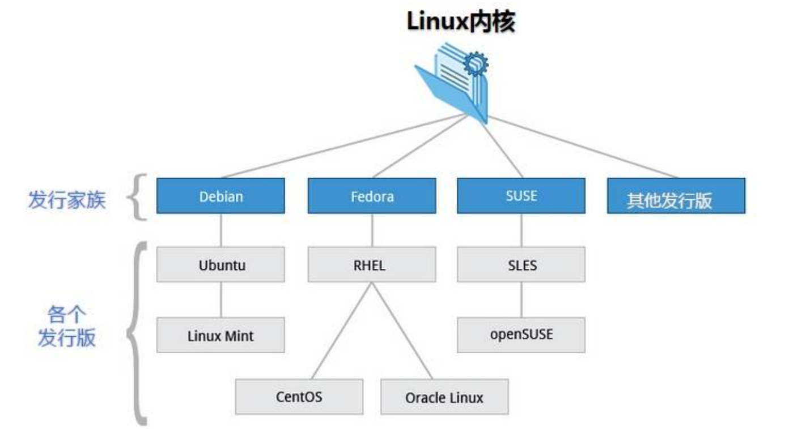


**Linux的版本号分为两部分：内核版本和发行版本**。

**1．Linux的内核版本**
内核版本指的是在Linus Torvalds领导下的开发小组开发出的系统内核的版本号，通常，内核版本号的第二位是偶数表示是稳定的版本，如2.6.25；是奇数表示有一些新的东西加入，是不稳定的测试版本，如2.5.6。Linux操作系统的核心就是它的内核，Linus Torvalds和他的小组在不断地开发和推出新内核。

任务：进程调度、内存管理、配置管理虚拟文件系统、提供网络接口以及支持进程间通信。像所有软件一样，Linux的内核也在不断升级。

**2．Linux的发行版本**
一个完整的操作系统不仅仅只有内核，还包括一系列为用户提供各种服务的外围程序。外围程序包括GNU程序库和工具，命令行shell，图形界面的X Window系统和相应的桌面环境，如KDE或GNOME，并包含数千种从办公套件，编译器，文本编辑器到科学工具的应用软件。所以，许多个人、组织和企业，开发了基于GNU/Linux的Linux发行版，他们将Linux系统的内核与外围应用软件和文档包装起来，并提供一些系统安装界面和系统设置与管理工具， 这样就构成了一个发行版本。
实际上，Linux的发行版本就是Linux内核再加上外围的实用程序组成的一个大软件包而已。相对于操作系统内核版本，发行版本的版本号是随发布者的不同而不同，与Linux系统内核的版本号是相对独立的，例如：RedHat EnterpriseLinux 5.2的操作系统内核是Linux-2.6.18。
Linux的发行版本大体可以分为两类：

一类是商业公司维护的发行版本

一类是社区组织维护的发行版本，前者以著名的RedHatLinux为代表，后者以Debian为代表

以下为Linux的主流版本：

目前市面上较知名的发行版有：Ubuntu、RedHat、CentOS、Debian、Fedora、SuSE、OpenSUSE、Arch Linux、SolusOS 等

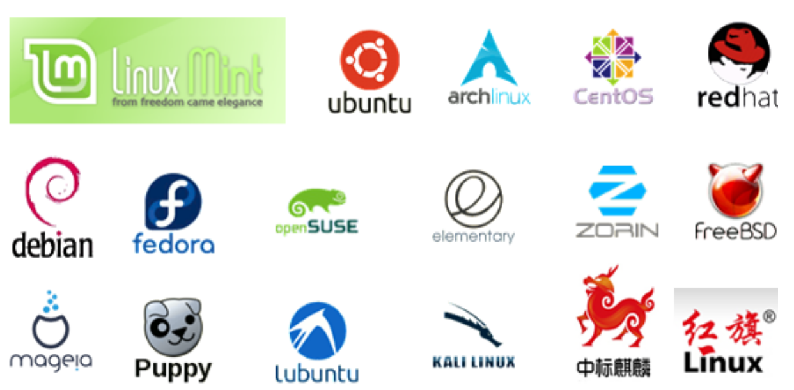


**以下是主要的发行版本**

```
需要注意的：
下面的内容主要是介绍了下Linux发行家族以及发行版本的一些详细信息，虽然我们当前的课程讲解的是CentOS,但是其他的一些发行商、主流的发行版本比如Ubuntu、Redhat也需要让学生多多了解下，毕竟这是Linux体系内产品线
注意
下面的文字虽然很多，但是只要让学生知道有这么回事即可
在下面会简单的总结..
```

**1、Debian 介绍**

Debian名字的由来----DebianGNU/Linux是由一个叫做伊恩·默多克（IanMurdock）在1993年发起的，他的名字以Ian开头，他太太的名字Debra开头三个字母是Deb。

Debian是社区类Linux的典范，是迄今为止最遵循GNU规范的Linux系统。Debian最早由 Ian Murdock于1993年创建，分为三个版本分支： stable(服务器版), testing(稳定版) 和unstable(测试版)。

**2、Ubuntu介绍**

Ubuntu严格来说不能算一个独立的发行版本，Ubuntu是基于Debian的unstable版本加强而来，可以这么说，Ubuntu就是一个拥有Debian所有的优点，以及自己所加强的优点的近乎完美的 Linux桌面系统。

共分三个版本:

- 基于Gnome的Ubuntu，
- 基于KDE的Kubuntu以。
- 基于Xfc的 Xubuntu。

特点是界面非常友好，容易上手，对硬件的支持非常全面，是最适合做桌面系统的Linux发行版本。稳定性，其实都差不多，难易度嘛，

Ubuntu 默认桌面环境采用 GNOME，一个 Unix和 Linux 主流桌面套件和开发平台。

Ubuntu的版本和发布号 
Ubuntu的版本号是由该次发布的年份和月份组成，并未反映其实际版本。我们的首次发布是在2004年10月，因此该版本为4.10。当前版本(DapperDrake)于2006年6月发布，因此版本号为6.06 LTS。

**3、Redhat**

可能这是最著名的Linux版本了，Red Hat Linux已经创造了自己的品牌，越来越多的人听说过它。Red Hat在1994年创业，当时聘用了全世界500多名员工，他们都致力于开放的源代码体系。
Red Hat Linux是公共环境中表现上佳的服务器。它拥有自己的公司，能向用户提供一套完整的服务，这使得它特别适合在公共网络中使用。这个版本的Linux也使用最新的内核，还拥有大多数人都需要使用的主体软件包。
Red Hat Linux的安装过程也十分简单明了。它的图形安装过程提供简易设置服务器的全部信息。磁盘分区过程可以自动完成，还可以选择GUI工具完成，即使对于 Linux新手来说这些都非常简单。选择软件包的过程也与其他版本类似；用户可以选择软件包种类或特殊的软件包。系统运行起来后，用户可以从Web站点和 Red Hat那里得到充分的技术支持。我发现Red Hat是一个符合大众需求的最优版本。在服务器和桌面系统中它都工作得很好。Red Hat的唯一缺陷是带有一些不标准的内核补丁，这使得它难于按用户的需求进行定制。 Red Hat通过论坛和邮件列表提供广泛的技术支持，它还有自己公司的电话技术支持，后者对要求更高技术支持水平的集团客户更有吸引力

**4、Fedora**

Fedora和Redhat这两个Linux的发行版放联系很密切。Redhat 自9.0以后，不再发布桌面版的，而是把这个项目与开源社区合作，于是就有了Fedora 这个 Linux 发行版。Fedora项目是由 Red Hat 赞助，由开源社区与 Red Hat 工程师合作开发的项目统称。Fedora 的目标，是推动自由和开源软件更快地进步。

特点：
１、 Fedora 是一个开放的、创新的、前瞻性的操作系统和平台，基于 Linux。它允许任何人自由地使用、修改和重发布，无论现在还是将来。可运行的体系结构包括x86(即i386),x86_64 和PowerPC！
２、Fedora 可以说是Redhat 桌面版本的延续，只不过是与开源社区合作。

３、Fedora 是一个独立的inux发行版本的操作系统。

**5**、**centos**

CentOS（Community ENTerprise Operating System）是来自于Red Hat Enterprise Linux依照开放源代码规定释出的源代码所编译而成。由于出自同样的源代码，因此有些要求高度稳定性的服务器以CentOS替代商业版的Red Hat Enterprise Linux使用（我会告诉你，以为企业想省钱，运维要靠这个东西来赚钱嘛，国内运维主流是CentOS剩下版本很少）。两者的不同，在于CentOS并不包含封闭源代码软件，CentOS 是一个基于Red Hat Linux 提供的可自由使用源代码的企业级Linux发行版本。每个版本的CentOS都会获得十年的支持（通过安全更新方式）。新版本的 CentOS 大约每两年发行一次，而每个版本的 CentOS 会定期（大概每六个月）更新一次，以便支持新的硬件。这样，建立一个安全、低维护、稳定、高预测性、高重复性的 Linux 环境

**6、Slackware介绍**

Slackware 由PatrickVolkerding(帕特里克.沃克登)创建于1992年。算起来应当是历史最悠久的Linux发行版。尽管如此，Slackware仍然深入人心（大部分都是比较有经验的 Linux老手）。Slackware稳定、安全，所以仍然有大批的忠实用户。由于Slackware尽量采用原版的软件包而不进行任何修改，所以制造新 bug的几率便低了很多。Slackware的版本更新周期较长（大约1年），但是新版本的软件仍然不间断的提供给用户下载。

**7、openSUSE介绍**

SUSE是德国最著名的Linux发行版，在全世界范围中也享有较高的声誉。SUSE自主开发的软件包管理系统也大受好评。SUSE于2003年年末被Novell收购。SUSE在收购之后的发布显得比较混乱，比如9.0版本是收费的，而10.0版本（也许由于各种压力）又免费发布。这使得一部分用户感到困惑，也转而使用其它发行版本。最近还跟微软扯到了一起。但是瑕不掩瑜，SUSE仍然是一个非常专业、优秀的发行版。

openSUSE 项目是由Novell公司资助的全球性社区计划，旨在推进 Linux 的广泛使用。这个计划提供免费的openSUSE 操作系统。这里是一个由普通用户和开发者共同构成的社区，我们拥有一个共同的目标—创造世界上最好用的 Linux 发行版。openSUSE 是 Novell 公司发行的企业级 Linux 产品的系统基础。

openSUSE 项目是由Novell 发起的开源社区计划。 旨在推进 Linux 的广泛使用。提供了自由简单的方法来获得世界上最好用的 Linux 发行版，SUSE Linux。openSUSE 项目为 Linux 开发者和爱好者提供了开始使用 Linux 所需要的一切。

**8、中国大陆的Linux发行版**

红旗Linux(RedflagLinux) ，冲浪Linux(Xteam Linux) ，蓝点Linux ， GNU/Linux，OpenDesktop等等 。

**9、 台湾地区的Linux发行版**

鸿奇Linux

**目前最著名的发行版本：Debian，ubuntu、OpenSuse(原Suse)、CentOS、fedora等。国内比较著名的红旗Linux版本**


> 对于上面的知识我们做下重点总结
>
> - **redhat**：目前，全球最大的**linux**发行厂商，功能全面、稳定。
>   - **Redhat** 被 **IBM** 收购!
> - **ubuntu**：目前，是linux桌面操作系统做的最好的。
> - **centos**：免费版的redhat，**centos** 基于 **redhat** 发行版基础之上，再重新编译发布的版本。
>   - 目前 **centos** 已经被 **Redhat** 公司收购，但是依然免费


## 1.7 Linux 应用领域

今天各种场合都有使用各种 Linux 发行版，从嵌入式设备到超级计算机，并且在服务器领域确定了地位。在企业级开发中，我们通常使用Linux作为我们的服务器。

比如：服务器系统Web应用服务器、数据库服务器、接口服务器、DNS、FTP等等； 

嵌入式系统路由器、防火墙、手机、PDA、IP 分享器、交换器、家电用品的微电脑控制器等等，高性能运算、计算密集型应用Linux有强大的运算能力。

**目前 Linux 不仅在家庭与企业中使用，并且在政府中也很受欢迎**。

- 巴西联邦政府由于支持 Linux 而世界闻名。
- 有新闻报道俄罗斯军队自己制造的 Linux 发布版的，做为 G.H.ost 项目已经取得成果。
- 印度的 Kerala 联邦计划在向全联邦的高中推广使用 Linux。
- 中华人民共和国为取得技术独立，在龙芯处理器中排他性地使用 Linux。
- 在西班牙的一些地区开发了自己的 Linux 发布版，并且在政府与教育领域广泛使用，如 Extremadura 地区的 gnuLinEx 和 Andalusia 地区的 Guadalinex。
- 葡萄牙同样使用自己的 Linux 发布版 Caixa Mágica，用于 Magalh?es 笔记本电脑和 e-escola 政府软件。
- 法国和德国同样开始逐步采用 Linux。

## **1.8 Linux之CentOS**

```
前面章节介绍了一些Linux的基本知识，前已经对Linux有了一个初步的认识，也知道了在Linux发行版中有各个家族的发行版本；比如比较知名的ubuntu、CentOS，在今天的Linux课程中我们将采用发行版CentOS作为我们Linux课程的讲解内容。
```

**CentOS**，是基于 Red Hat Linux 提供的可自由使用源代码的企业级 Linux 发行版本；是一个稳定，可预测，可管理和可复制的免费企业级计算平台

**主要特点:**

1.主流： 目前的Linux操作系统主要应用于生产环境，主流企业级Linux系统仍旧是RedHat或者CentOS
2.免费： RedHat 和CentOS差别不大，CentOS是一个基于Red Hat Linux 提供的可自由使用源代码的企业级Linux发行版本
3.更新方便：CentOS独有的yum命令支持在线升级，可以即时更新系统，不像RED HAT那样需要花钱购买支持服务！

**我们在当前课程中的环境：**

Windows7 , VMware Workstation15.02, CentOS Linux release 7.6.1810 

## 1.9 VM的克隆与快照

无论是快照还是克隆，都是对虚拟机的一个状态生成了一个镜像，不同的是这个镜像是作为虚拟机的一部分存在还是作为独立的部分存在。克隆的过程并不影响原始虚拟机，克隆的操作一但完成，克隆的虚拟机就可以脱离原始虚拟机独立存在，而且在克隆的虚拟机中和原始虚拟机中的操作是相对独立的，不相互影响。克隆过程中，VMware会生成和原始虚拟机不同的MAC地址和UUID，这就允许克隆的虚拟机和原始虚拟机在同一网络中出现，并且不会产生任何冲突。

### 1）定义不同

* 快照是对某一个特定文件系统在某一个特定时间内的一个具有只读属性的镜像。
* 克隆是原始虚拟机全部状态的一个拷贝，或者说一个镜像。

### 2）用途不同

* 快照是保存虚拟机某一时刻状态。
* 克隆是分发创建的虚拟机 。

### 3）是否独立

* 快照不能脱离原始虚拟机独立运行
* 克隆是部分脱离原始虚拟机，完整克隆是完全脱离原始虚拟机。

### 4）能否同时使用

* 快照不能原始虚拟机同时使用。克隆的虚拟机可以和原始虚拟机同时使用 。

## 1.10 总结

当前章节主要介绍了Linux发行的主要版本（我们使用的是CentOS Linux release 7.6.1810 ）、以及与Unix、Windows系统的区别；主要让学生了解Linux是基于Unix的以及与Windows一样，Linux也是操作系统即可。

# 2 系统与设置命令

```
在前面的两个章节中，我们主要介绍了Linux基本知识和虚拟机的安装，从当前章节开始，我们一起学习下Linux的基本命令，在当前章节，我们先简单的学习下一些系统的基本命令，慢慢的由浅入深，在后面的章节中我们将学习其他的命令比如文件操作、备份压缩等
```

## 2.1 学习命令的原因

```
命令我们可以理解成在Windows中我们常常为了查看ip输入的ipconfig，在Linux中也有很多的命令，比如操作目录、文件、网络、磁盘等等命令
```

- Linux刚面世时并没有图形界面, 所有的操作全靠命令完成, 如 **磁盘操作、文件存取、目录操作、进程管理、文件权限** 设定等
- 在职场中，大量的 **服务器维护工作** 都是在 远程 通过SSH客户端 来完成的， 并没有图形界面， 所有的维护工作都需要通过命令来完成

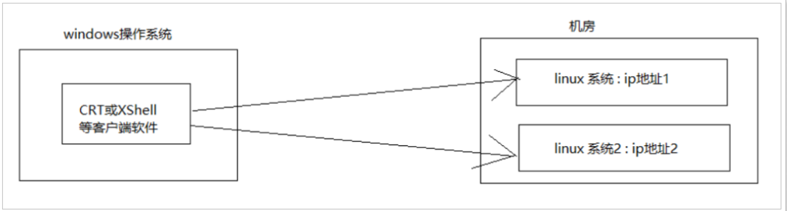

在职场中， 作为后端程序员或者运维， 必须要或多或少的掌握一些Linux常用的终端命令

- Linux发行版本的命令大概有200多个， 但是常用的命令只有几十个而已

```
总结
学习终端命令的技巧：
- 不需要死记硬背， 对于常用命令， 记住语法是关键，在用的时候去查下参数选项，有的很常用的命令，用的多自然就记住了
- 不要尝试一次学会所有的命令， 有些命令是非常不常用的，临时遇到，就去根据语法找参数选项
```

## 2.2 Linux 用户和用户组管理

### 2.2.1 Linux账号管理

```
从当前章节开始，我们正式进入CentOS的学习，我们先从简单的命令开始，比如操作账号、用户组、系统管理等。
在实际使用场景中，用户账号的管理主要涉及到用户账号的添加、修改和删除操作。
现在，我们就通过命令的方式添加用户账号（账号名字可以自定义，但是是要符合书写规范）
在操作前，确保我们的SecureCRT成功连接到了虚拟机.
下面的章节不在赘述SecureCRT，默认已经成功连接。
```

#### 1) 添加用户

```
我们在Windows创建账号主要是是控制面板--用户账户--创建一个新账户，这是在Windows创建账户的流程，而在Linux中，我们可以通过命令的方式进行创建账户
```

**使用者权限：管理员用户**

```shell
useradd 选项 用户名
```

**参数说明：**

- 选项:

  - -c comment 指定一段注释性描述。
  - -d 目录 指定用户主目录，如果此目录不存在，则同时使用-m选项，可以创建主目录。
  - -g 用户组 指定用户所属的用户组。
  - -G 用户组，用户组 指定用户所属的附加组。
  - -s Shell文件 指定用户的登录Shell。
  - -u 用户号 指定用户的用户号，如果同时有-o选项，则可以重复使用其他用户的标识号。

- 用户名:

  指定新账号的用户名(后续我们可以使用这个用户名进行系统登录)。

添加用户czbk（传智播客的首拼）执行

```shell
useradd  czbk
```

我们使用useradd命令创建了一个用户czbk

useradd 可用来建立用户帐号。帐号建好之后，再用 passwd 设定帐号的密码。

执行如下

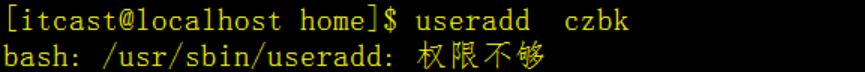

由上图我们发现，我们在使用useradd新增用户的时候，出现了权限不足，也就是说我们使用用户itcast没有创建用户的权限。

我们通过管理员账号root进行创建，首先我们从控制台中切换到root

```shell
su root
```

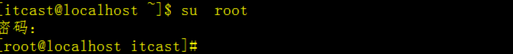

在 密码的地方输入我们的root密码【root】即可进入到root用户下。

我们在root下继续创建czbk用户

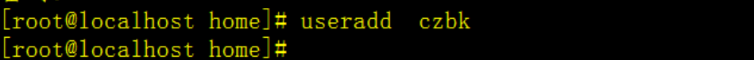

以下是useradd常用选项

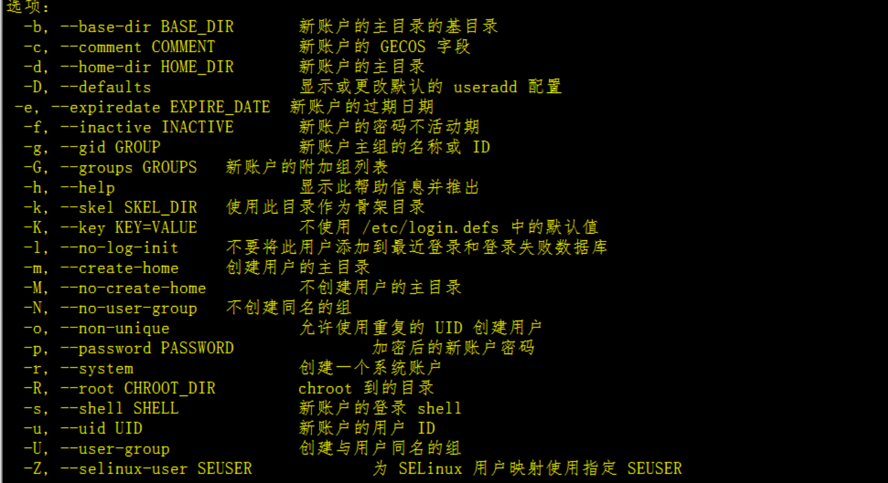


#### 2) 用户口令

```
引子：
相当于我们在Windows系统中给个用户更改密码，只是我们在CentOS中是更改密码是通过命令完成的。
```

用户管理的一项重要内容是用户口令的管理。用户账号刚创建时没有口令，但是被系统锁定，无法使用，必须为其指定口令后才可以使用

**使用者权限：管理员用户**

指定和修改用户口令的Shell命令是`passwd`。超级用户可以为自己和其他用户指定口令，普通用户只能用它修改自己的口令。命令的格式为：

```shell
passwd 选项 用户名
```

可使用的选项：

- -l 锁定口令，即禁用账号。
- -u 口令解锁。
- -d 使账号无口令。
- -f 强迫用户下次登录时修改口令。

设置当前用户的口令

```shell
passwd czbk
```

此处我们设置密码和itcast账号密码一致，为【Itheima888】

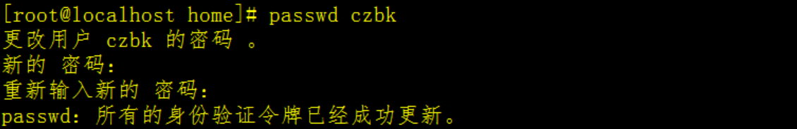

#### 3) 修改用户

```
相当于我们在Windows系统中修改一个用户，只是我们在CentOS中是修改用户是通过命令完成的。
```

usermod 命令通过修改系统帐户文件来修改用户账户信息

修改用户账号就是根据实际情况更改用户的有关属性，如用户号、主目录、用户组、登录Shell等。

**使用者权限：管理员用户**

修改已有用户的信息使用`usermod`命令，其格式如下：

```shell
usermod 选项 用户名
```

下面命令将用户czbk用户名修改成czbk2019

```shell
usermod -l czbk2019  czbk
```

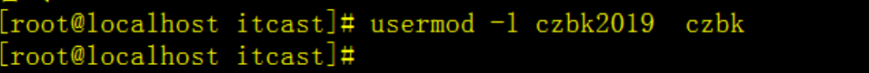

以下是usermod常用选项

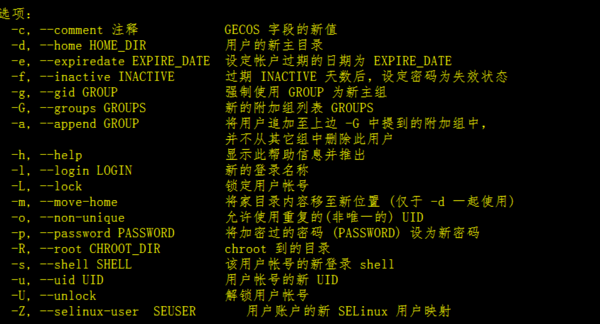

#### 4) 删除用户

```
相当于我们在Windows系统中删除一个用户，只是我们在CentOS中是删除用户是通过命令完成的。
```

假如我们其中一个用户的账号不再使用，可以从系统中删除。删除用户账号就是要将/etc/passwd等系统文件中的该用户记录删除，必要时还删除用户的主目录。

**使用者权限：管理员用户**

删除一个已有的用户账号使用`userdel`命令，其格式如下：

```shell
userdel 选项 用户名
```

-f：强制删除用户，即使用户当前已登录;

-r：删除用户的同时，删除与用户相关的所有文件

此命令删除用户czbk2019

```shell
userdel czbk2019
```

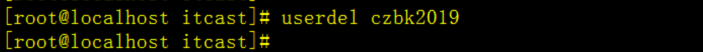

成功删除用户czbk2019

以下是userdel常用选项


### 2.2.2 Linux用户组

**引子：**

**为了方便用户管理, 提出了 组 的概念, 如下图所示**

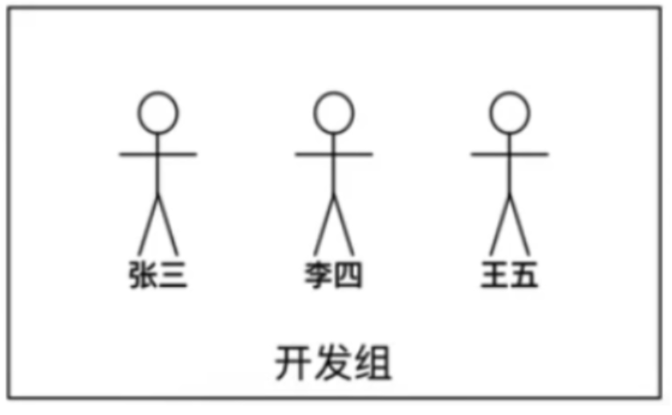

**新增一个账户，它默认属于自己（账户）的组**

**比如新建账户【张三】，那么它默认对应的组就是张三**

**一个用户可以有一个或者多个组**

**假如说（如上图），我们在企业级开发过程中，我们有多个组，其中一个开发组对应三个账户，张三、李四、王五、如果就像上面提到的，一个用户默认对应一个组，那么三个账户张三、李四、王五就有了三个不同的组，如果大家都操做一个文件，在进行权限分配的时候，就要对不同的三个组进行授权，显然这样是不合理的，因为太过繁琐。**

**所以，才有了组（新建组）的概念，我们把张三、李四、王五统一放到【开发组】，在对文件授权的时候，我们只对【开发组】进行授权由此，这样的话【张三、李四、王五】都有相等的权利操作了。**

#### 1) 增加用户组

新增一个用户组（组名可见名知意，符合规范即可），然后将用户添加到组中

**使用者权限：管理员用户** 

```shell
groupadd 选项 用户组
```

使用的选项有：

- -g GID 指定新用户组的组标识号（GID）。
- -o 一般与-g选项同时使用，表示新用户组的GID可以与系统已有用户组的GID相同

新增用户组czbk-it

```shell
groupadd czbk-it
```

上面的命令向系统中增加了一个新组czbk-it，新组的组标识号是在当前已有的最大组标识号的基础上加1

以下是groupadd常用选项

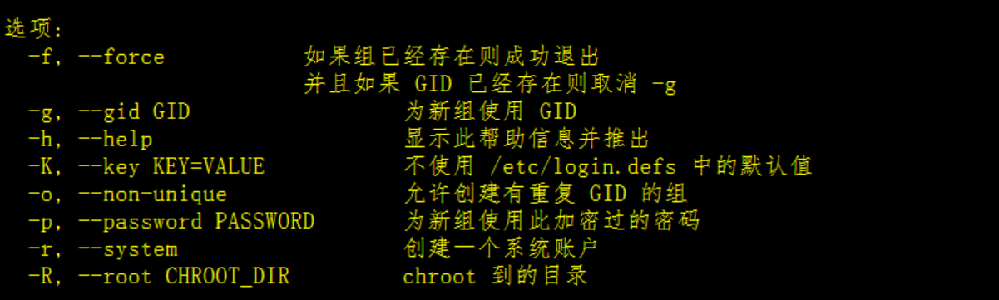

#### 2) 修改用户组

**使用者权限：管理员用户**

```shell
groupmod 选项 用户组
```

常用的选项有：

- -g GID 为用户组指定新的组标识号。
- -o 与-g选项同时使用，用户组的新GID可以与系统已有用户组的GID相同。
- -n新用户组 将用户组的名字改为新名字

```shell
groupmod  -n czbk-it-2019  czbk-it
```

上面的命令将组czbk-it的组名修改为czbk-it-2019。

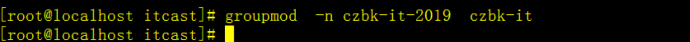

以下是groupmod常用选项

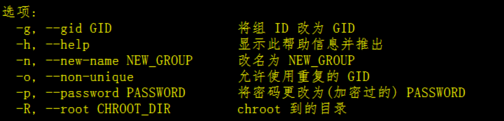

#### 3) 查询用户所属组

在查询用户所属的用户组前，我们先增加一个用户ituser-groups

```shell
useradd ituser-groups
```

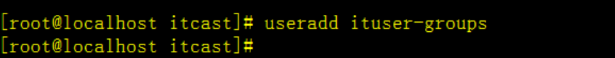

要查询一个用户属于哪个用户组，使用groups命令，其格式如下

```shell
groups 用户名
```

查询用户ituser-groups属于某个用户组，执行groups命令

```shell
groups ituser-groups
```


由此可见，ituser-groups用户属于用户组ituser-groups（用户组默认与用户名一样）

#### 4) 删除用户组

**使用者权限：管理员用户**

要删除一个已有的用户组，使用groupdel命令，其格式如下

```shell
groupdel 用户组
```

删除czbk-it-2019用户组

```shell
groupdel czbk-it-2019
```

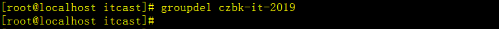

删除成功

以下是groupdel常用选项

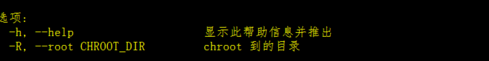

### 2.2.3 将用户添加到组

```
引子：
在上面我们学习如何新增用户，也学习了如何新增用户组，在当前的小节中，我们新建一个用户、新建一个用户组、然后把新建的用户添加到新的组中
在实际开发过程中，我们通常把多个用户按照业务需求归并到统一的一个组中，进行有序管理
```

1、创建一个新的组，并添加组ID（需要切换到root用户）

```shell
groupadd -g 8888 itbj2020group
```

执行效果如下

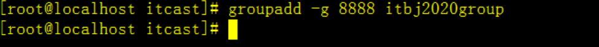

2、创建3个用户（需要切换到root用户）

```shell
 useradd  itbeijinguser1
 useradd  itbeijinguser2
 useradd  itbeijinguser3
```

3、将上面三个用户添加到组itbj2020group

我们通过gpasswd命令将三个用户添加到组

**什么是gpasswd：**

gpasswd 是 Linux 下工作组文件 /etc/group 和 /etc/gshadow 管理工具，用于将一个用户添加到组或者从组中删除。

语法

```shell
gpasswd [可选项] 组名
```

**将上面的三个用户使用gpasswd添加到组（需要切换到root用户）**

```shell
gpasswd -a itbeijinguser1 itbj2020group
gpasswd -a itbeijinguser2 itbj2020group
gpasswd -a itbeijinguser3 itbj2020group
```

**执行如下**

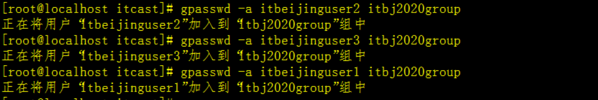

**查看用户组下所有用户（所有用户）**

> 注意
>
> 此处的grep命令我们将在文件管理章节详细讲解，这里先使用它查看下效果

```shell
grep 'itbj2020group' /etc/group
```

执行效果如下（或者直接打开/etc/group文件都可以）

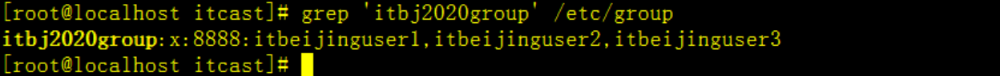

由上图可知：三个用户全部都加入到了itbj2020group组。

## 2.3 系统管理

```
系统管理，说的就是我们的CentOS系统，它不同于Windwos，CentOS是字符界面，我们需要通过命令进行操作，在当前章节，我们先从基本命令学起，比如创建用户、设置密码、修改用户以及用户组的相关操作。也为我们后面的章节打下基础
```

### 2.3.1 日期管理

```
当前日期如果通过date进行设置，在系统重启后不会保存date的设置，常用的只是通过date命令查看日期
```

date 可以用来显示或设定系统的日期与时间

使用者权限：所有用户

**语法如下：**

```shell
date [参数选项]
```

参数

-d<字符串>：显示字符串所指的日期与时间。字符串前后必须加上双引号； 
-s<字符串>：根据字符串来设置日期与时间。字符串前后必须加上双引号； 
-u：显示GMT； 
--help：在线帮助； 
--version：显示版本信息

1、设置时间

用 -s选项可以设置系统时间，如下：

```shell
date -s "2019-12-11 16:15:00"
```


2、显示时间

```shell
date
```

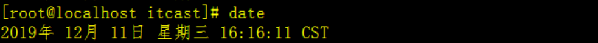

**（1）UTC** 

协调世界时，又称世界统一时间、世界标准时间、国际协调时间。由于英文（CUT）和法文（TUC）的缩写不同，作为妥协，简称UTC。。

**（2）GMT**

即[格林尼治](https://baike.baidu.com/item/格林尼治/3065623) 平太阳时间，是指格林尼治所在地的标准时间，也是表示地球自转速率的一种形式

**外文名:**Universal Time

**其他外文名**G.M.T.(Greenwich Mean Time)

**（3）CST**

北京时间 （中国国家标准时间）
**北京时间是中国采用国际时区东八时区的区时作为标准时间**。
北京时间并不是北京（东经116.4°）的地方时间，而是东经120°的地方时间，故东经120度地方时比北京的地方时早约14分半钟。因为北京处于国际时区划分中的东八区，同格林尼治时间（世界时）整整相差8小时（即北京时间=世界时+8小时），故命名为“北京时间”。东八区包括的范围从东经112.5°到东经127.5°，以东经120°为中心线，东西各延伸7.5°，总宽度为15°的区域。
**而中国幅员辽阔，东西相跨5个时区（即东五区、东六区、东七区、东八区、东九区5个时区）授时台必须建在地理中心地带，从而也就产生了长短波授。“北京时间”与“北京当地时间”是两个概念，  “北京时间”的发播不在北京，而在陕西蒲城（处于东七区）**

**（4）东八区**

东八区（[UTC](https://baike.baidu.com/item/UTC)/[GMT](https://baike.baidu.com/item/GMT/6026868)+08:00）是比[世界协调时间](https://baike.baidu.com/item/世界协调时间/8036498)（UTC）/[格林尼治时间](https://baike.baidu.com/item/格林尼治时间/410004)（GMT）快8小时的时区，理论上的位置是位于[东经](https://baike.baidu.com/item/东经/8661846)112.5度至127.5度之间，是东盟标准的其中一个候选时区。当格林尼治标准时间为0:00时，东八区的标准时间为08:00

```
总结：
上面提到了很多知识：即UTC/GMT/CST/东八区
总结一下就是，北京时间(中国国家标准时间CST)采用东八区区时，即：
协调世界时(UTC)+8  /   格林尼治时间(GMT)+8
也就是说+8后的时间才是北京时间
```

### 2.3.2 显示用户

logname命令用于显示用户名称。

执行logname指令，它会显示目前用户的名称

**语法为如下：**

```shell
logname [--help][--version]
```

**参数**：

- --help 　在线帮助。
- --vesion 　显示版本信息。

显示登录账号的信息

```shell
logname
```

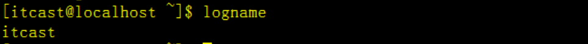

### 2.3.3 su切换账户

```
引子：
比如我们在新增用户、修改用户或者操作用户组的时候常常需要切换到管理员账户，这个时候，我们就可以使用su进行快速切换
```

su命令用于变更为其他使用者的身份，除 root 外，需要键入该使用者的密码。

使用权限：所有使用者。

**语法如下：**

```shell
su 
```

变更帐号为 root 并在执行 ls 指令后退出返回原使用者

```shell
 su -c ls root
```

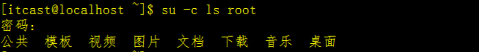

切换到root

```shell
su root
```

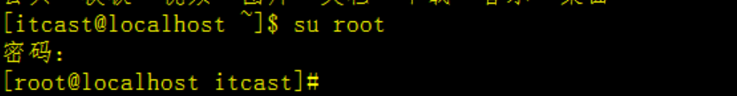

这样的话，我们就进入到了root用户下。

### 2.3.4 id命令

```
我们如果需要查看当前账号详细信息的时候，比如查看它的用户id、群组id以及所属组的时候，我们就可以使用id命令进行查看
```

 id命令用于显示用户的ID，以及所属群组的ID。

id会显示用户以及所属群组的实际与有效ID。若两个ID相同，则仅显示实际ID。若仅指定用户名称，则显示目前用户的ID。

使用者权限：所有用户

**语法**

```
id [-gGnru][--help][--version][用户名称]
```

**参数说明：**

- -g或--group 　显示用户所属群组的ID。
- -G或--groups 　显示用户所属附加群组的ID。
- -n或--name 　显示用户，所属群组或附加群组的名称。
- -r或--real 　显示实际ID。
- -u或--user 　显示用户ID。
- -help 　显示帮助。
- -version 　显示版本信息。

**显示当前用户信息**

```shell
id
```

执行效果如下

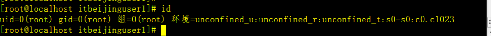

> 总结
>
> id命令参数虽然很多
>
> 但是常用的也就是id命令，不带参数的
>
> 主要看他的uid和组信息

### 2.3.5 sudo执行

```
比如我们使用普通用户操作用户或者操作用户组、以及修改网卡配置文件的时候，需要切换到root用户才操作，此时我们可以使用sudo命令提高普通用户的操作权限，以达到操作目的
```

sudo:控制用户对系统命令的使用权限,root允许的操作。

通过sudo可以提高普通用户的操作权限

使用者权限：普通用户

**语法如下：**

sudo -V
sudo -h
sudo -l
sudo -v
sudo -k
sudo -s
sudo -H
sudo [ -b ] [ -p prompt ] [ -u username/#uid] -s
sudo command

**参数说明**：

- -V 显示版本编号
- -h 会显示版本编号及指令的使用方式说明
- -l 显示出自己（执行 sudo 的使用者）的权限
- -v 因为 sudo 在第一次执行时或是在 N 分钟内没有执行（N 预设为五）会问密码，这个参数是重新做一次确认，如果超过 N 分钟，也会问密码
- -k 将会强迫使用者在下一次执行 sudo 时问密码（不论有没有超过 N 分钟）
- -b 将要执行的指令放在背景执行
- -p prompt 可以更改问密码的提示语，其中 %u 会代换为使用者的帐号名称， %h 会显示主机名称
- -u username/#uid 不加此参数，代表要以 root 的身份执行指令，而加了此参数，可以以 username 的身份执行指令（#uid 为该 username 的使用者号码）
- -s 执行环境变数中的 SHELL 所指定的 shell ，或是 /etc/passwd 里所指定的 shell
- -H 将环境变数中的 HOME 指定为要变更身份的使用者HOME目录（如不加 -u 参数就是系统管理者 root ）
- command 要以系统管理者身份（或以 -u 更改为其他人）执行的指令

sudo命令使用

```shell
sudo ls
```

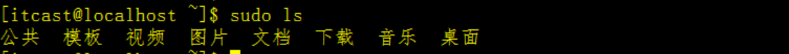

指定root用户执行指令

```shell
sudo -u root ls -l
```

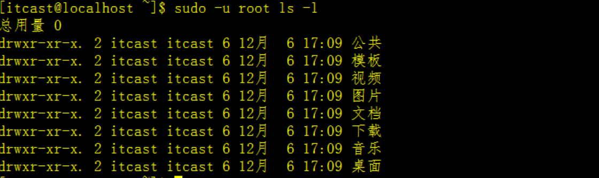

**修改网卡配置文件**

比如，在下面的例子中，我们使用普通用户修改网卡的配置文件，在进行保存的时候，提示我们【无法打开并写入文件】，那么此时，我们可以通过sudo命令来提升自己的写入权限

执行：

```shell
 vi /etc/sysconfig/network-scripts/ifcfg-ens33 
```

执行效果如下（保存）

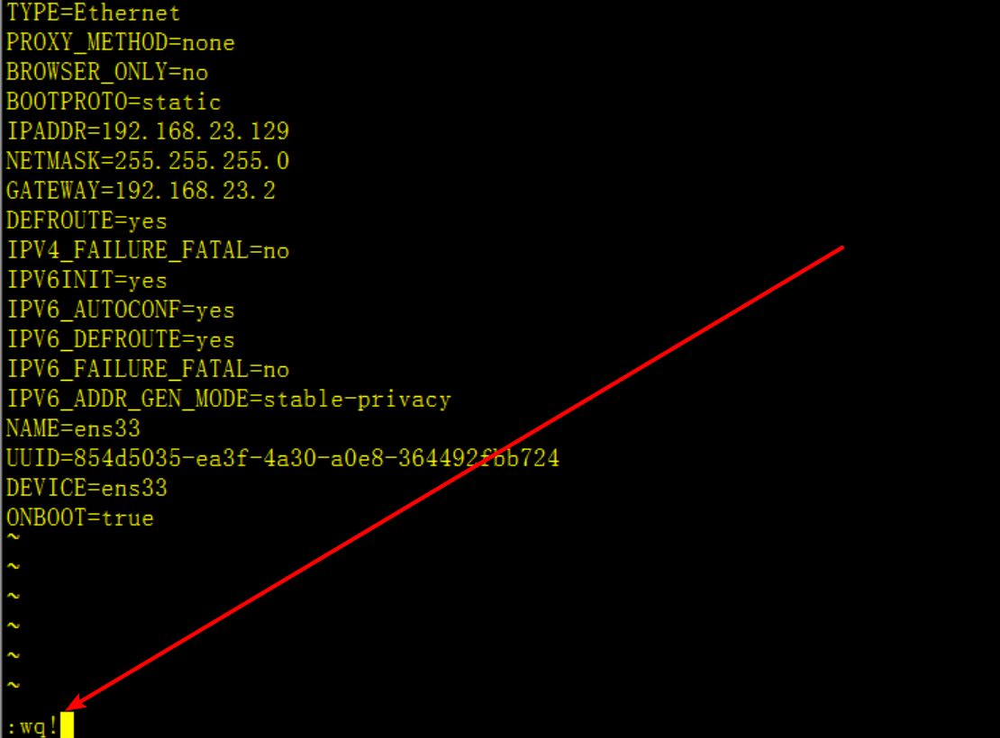

然后点击回车

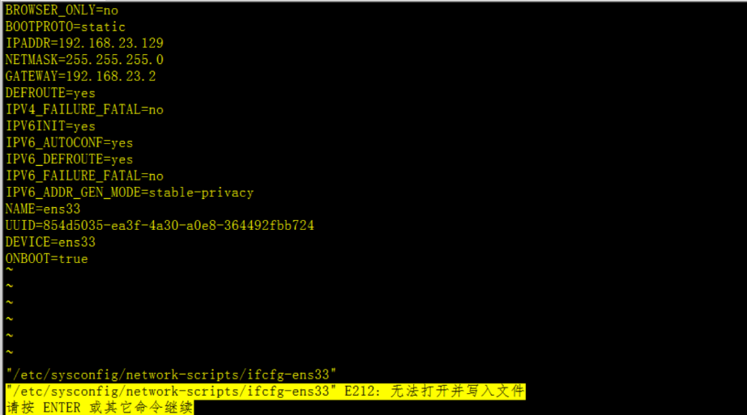

那么我们在修改上面的 命令，使用sudo进行修改

```shell
sudo   vi /etc/sysconfig/network-scripts/ifcfg-ens33 
```

执行效果如下（键入itcast密码）

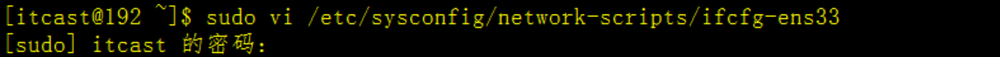

执行保存


我们发现此时就不在报错了

### 2.3.6 top命令

```
在企业级开发中，开发人员（运维人员也会经常使用）常常为了查看服务器上运行的程序占用的CPU情况以及占用内存情况，目的就是检测我们的程序是否在正常范围内运行
```

top命令用于实时显示 process 的动态。

使用权限：所有使用者。

**显示进程信息**

```shell
top
```

执行效果如下

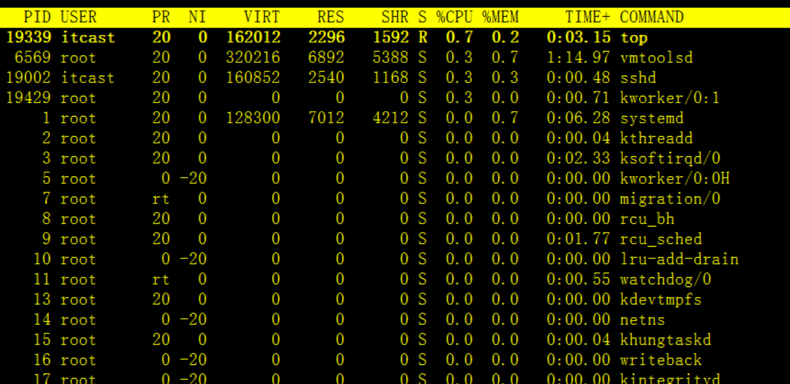

**各进程（任务）的状态监控属性解释说明：**
PID — 进程id
USER — 进程所有者
PR — 进程优先级
NI — nice值。负值表示高优先级，正值表示低优先级
VIRT — 进程使用的虚拟内存总量，单位kb。VIRT=SWAP+RES
RES — 进程使用的、未被换出的物理内存大小，单位kb。RES=CODE+DATA
SHR — 共享内存大小，单位kb
S — 进程状态。D=不可中断的睡眠状态 R=运行 S=睡眠 T=跟踪/停止 Z=僵尸进程
%CPU — 上次更新到现在的CPU时间占用百分比
%MEM — 进程使用的物理内存百分比
TIME+ — 进程使用的CPU时间总计，单位1/100秒
COMMAND — 进程名称（命令名/命令行）

**显示完整命令，与top命令不同的就是command属性像是进行了命令补全**

```shell
top -c
```

执行效果如下

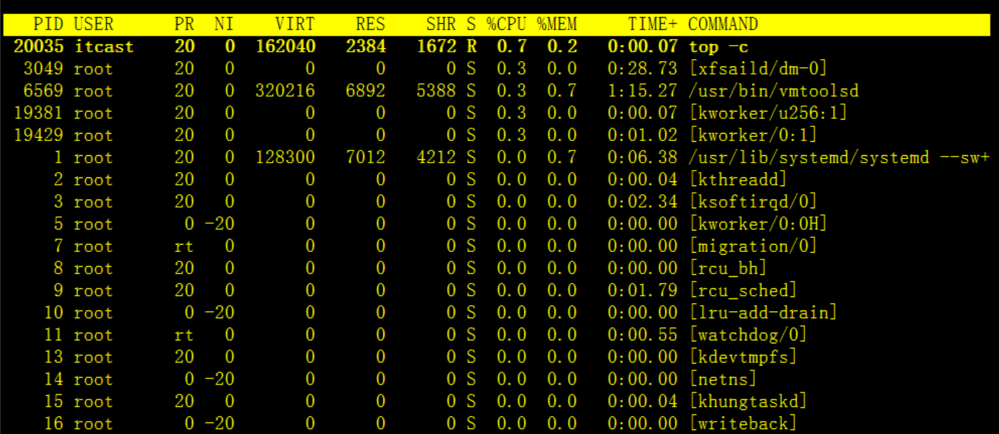

**显示指定的进程信息，以下显示进程号为6972的进程信息，CPU、内存占用率等**

```shell
 top -p 6972
```

执行效果如下

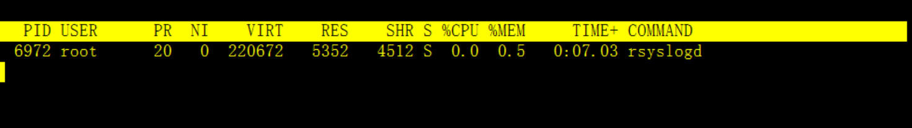


> top命令的用法很多
>
> 但是常用的就是top（不带参数），有的时候，在进程比较多的时候，我们常常记住进程的pid，然后通过top -p pid进行查看
>
> 也就是说，top+ top -p是经常被用到的

###  2.3.7 ps命令

```
ps命令类似于我们在Windows中通过任务管理器查看进程信息
```

Linux ps命令用于显示当前进程 (process) 的状态信息

使用者权限：所有用户

**语法如下：**

```shell
ps 
```

显示进程信息

```shell
ps -A 
```

显示指定用户信息

```powershell
 ps -u itcast
```

显示所有进程信息 

```shell
ps -ef 
```

### 2.3.8 kill命令

```
引子：
前面，我们刚刚学习完了Windows上开发，比如，我们经常遇到的要给问题就是，我们需要经常的启动或者重启tomcat，有的时候会报端口冲突，这个时候，我们可能就去Windows的任务管理器中去结束这个进程
那么在Linux中我们可以通过kill命令来实现Windwos上手工结束进程的操作
```

Linux kill命令用于删除执行中的程序或工作(可强制中断)

使用者权限：所有用户

**语法如下：**

```shell
kill [-s <信息名称或编号>][程序]　或　kill [-l <信息编号>]
```

 **参数说明**：

- -l <信息编号> 　若不加<信息编号>选项，则-l参数会列出全部的信息名称。
- -s <信息名称或编号> 　指定要送出的信息。
- [程序] 　[程序]可以是程序的PID或是PGID，也可以是工作编号。

杀死一个进程

```shell
 kill 15642
```

强制杀死进程

```shell
kill -KILL 15642
```

彻底杀死进程

```shell
kill -9 15642
```

杀死指定用户所有进程

1.方法一 过滤出itcast用户进程 

```shell
kill -9 $(ps -ef | grep itcast) 
```

2.方法二，直接杀死

```shell
kill -u itcast
```

> 注意
>
> 上面列举了很多kill进程的命令
>
> 但是我们我们常用的就是kill -9命令，我们常常找到进程的pid
>
> 然后通过kill -9进行杀死进程

### 2.3.9 关机命令

shutdown命令可以用来进行关闭系统，并且在关机以前传送讯息给所有使用者正在执行的程序，shutdown 也可以用来重开机

使用者权限：管理员用户

**语法如下：**

```shell
shutdown [-t seconds] [-rkhncfF] time [message]
```

**参数说明**：

- -t seconds : 设定在几秒钟之后进行关机程序。
- -k : 并不会真的关机，只是将警告讯息传送给所有使用者。
- -r : 关机后重新开机。
- -h : 关机后停机。
- -n : 不采用正常程序来关机，用强迫的方式杀掉所有执行中的程序后自行关机。
- -c : 取消目前已经进行中的关机动作。
- -f : 关机时，不做 fcsk 动作(检查 Linux 档系统)。
- -F : 关机时，强迫进行 fsck 动作。
- time : 设定关机的时间。
- message : 传送给所有使用者的警告讯息。

立即关机

```shell
shutdown -h now
或者
shudown
```

指定1分钟后关机，1分钟关机并显示警告信息

```shell
shutdown +1 “System will shutdown after 1 minutes” 
```

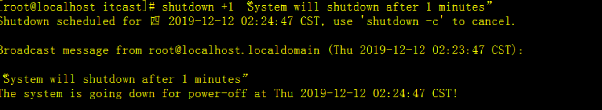

指定1分钟后重启，并发出警告信息

```shell
shutdown –r +1 “1分钟后关机重启”
```

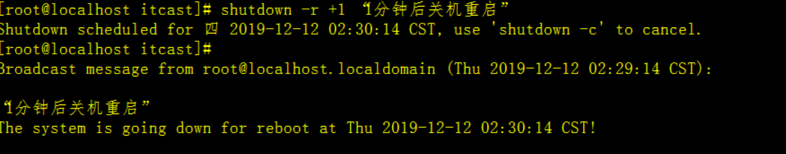

### 2.3.10 重启命令

reboot命令用于用来重新启动计算机

使用者权限：管理员、普通（需要验证）用户

**语法如下：**

```shell
reboot [-n] [-w] [-d] [-f] [-i]
```

**参数**：

- -n : 在重开机前不做将记忆体资料写回硬盘的动作
- -w : 并不会真的重开机，只是把记录写到 /var/log/wtmp 档案里
- -d : 不把记录写到 /var/log/wtmp 档案里（-n 这个参数包含了 -d）
- -f : 强迫重开机，不呼叫 shutdown 这个指令
- -i : 在重开机之前先把所有网络相关的装置先停止

开始重新启动

```shell
reboot
```

重启效果如下

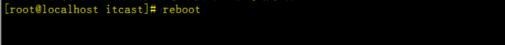

此时我们的虚拟机正在重启**（别忘记使用root用户执行）**

### 2.3.11 who命令

```
在企业级开发过程中，我们使用who命令的时候常常需要快速重启服务器，在重启之前需要检测下有没有终端在连接（处理程序），如果有，可能就不会重启（会私下询问何时弄完，弄完后在重启），如果没有其他人连接，将执行快速重启
```

who命令用于显示系统中有哪些使用者正在上面，显示的资料包含了使用者 ID、使用的终端机、从哪边连上来的、上线时间、呆滞时间、CPU 使用量、动作等等

使用者权限：所有使用者都可使用。

**语法如下：**

```shell
who - [husfV] [user]
```

**参数说明**：

- -H 或 --heading：显示各栏位的标题信息列；
- -i 或 -u 或 --idle：显示闲置时间，若该用户在前一分钟之内有进行任何动作，将标示成"."号，如果该用户已超过24小时没有任何动作，则标示出"old"字符串；
- -m：此参数的效果和指定"am i"字符串相同；
- -q 或--count：只显示登入系统的帐号名称和总人数；
- -s：此参数将忽略不予处理，仅负责解决who指令其他版本的兼容性问题；
- -w 或-T或--mesg或--message或--writable：显示用户的信息状态栏；
- --help：在线帮助；
- --version：显示版本信息

显示当前登录系统的用户

```shell
who
```


显示明细(标题)信息

```shell
who -H
```

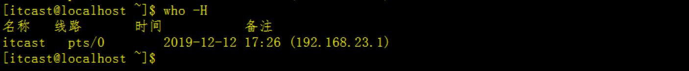

由上图可知，截止到现在只有itcast在线。

### 2.3.12 timedatectl命令

```
引子：
timedatectl是用于控制系统时间和日期。可以用来查询和更改系统时钟于设定，同时可以设定和修改时区信息。

在实际开发过程中，系统时间的显示会和实际出现不同步；我们一般为了校正服务器时间、时区的时候会使用timedatectl命令
```

使用者权限：所有使用者都可使用，设置时间需要管理员，下面会标注。

几个常见的概念，进行总结如下：

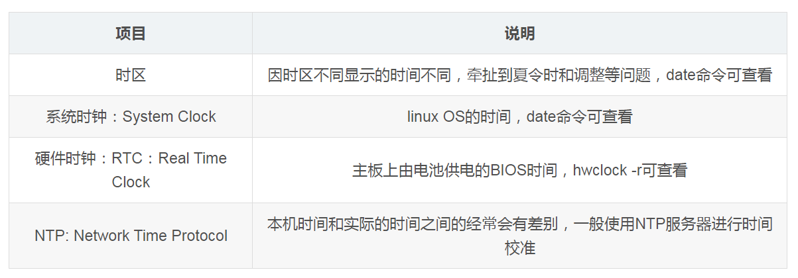

**显示系统的当前时间和日期，使用命令行中的timedatectl命令**

```SHELL
timedatectl status
```

执行效果如下


在上面的示例中，分别显示时区、CST时间和UTC时间，其中,RTC time就是硬件时钟的时间，硬件时间默认为UTC。

**查看当前时区**

```shell
timedatectl | grep Time
或者
timedatectl 
```

执行效果如下


上图显示中国时区

**查看所有可用的时区**

```
timedatectl list-timezones
```

执行效果如下（下面数据没有截全）

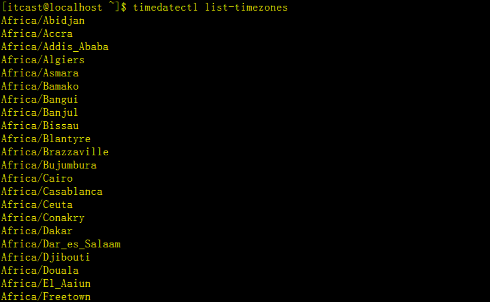

**设置本地时区**

```shell
timedatectl set-timezone "Asia/Shanghai"
```

执行效果如下


**禁用时间同步（使用管理员账户）**

```shell
timedatectl set-ntp false
在执行
timedatectl set-time "2019-03-11 20:45:00"
```

执行效果如下

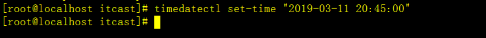

> 注意: 如果ntp时间同步为true时无法修改时间设定，下面马上介绍

**打开ntp**

```shell
timedatectl set-ntp true
在执行
timedatectl set-time "2019-03-11 20:45:00"
```

执行效果如下（ntp时间同步为true时无法修改时间设定）

报错信息 如下


**启用时间同步**

NTP即Network Time Protocol（网络时间协议），是一个互联网协议，用于同步计算机之间的系统时钟。timedatectl实用程序可以自动同步你的Linux系统时钟到使用NTP的远程服务器。

要开始自动时间同步到远程NTP服务器，在终端键入以下命令。

```shell
timedatectl set-ntp true
```

比如，在上面我们使用timedatectl set-time "2019-03-11 20:45:00"，如下图


此时我们执行timedatectl set-ntp true，发现时间正常同步过来了如下图

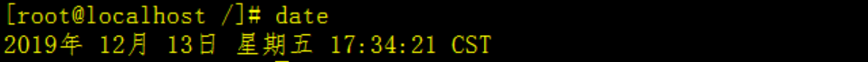

要禁用NTP时间同步，在终端键入以下命令

```shell
timedatectl set-ntp false
```

执行上面的 命令即可关闭ntp

> 总结
>
> 在实际使用过程中
>
> 我们经常使用timedatectl进行时区、CST、UTC的设置


### 2.3.13 clear命令

 clear命令用于清除屏幕

使用者权限：所有使用者都可使用。

**语法**

```shell
clear
```

执行clear前

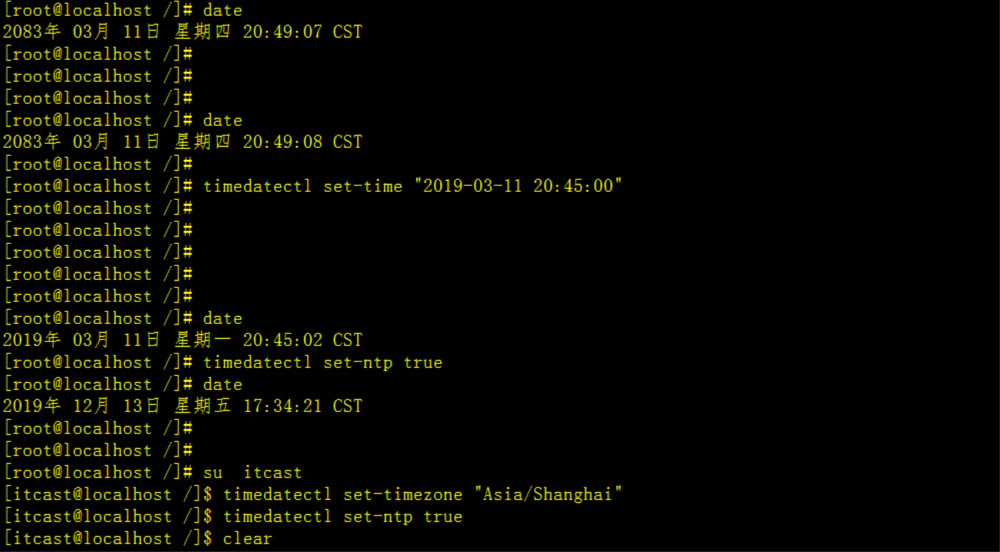

执行clear后

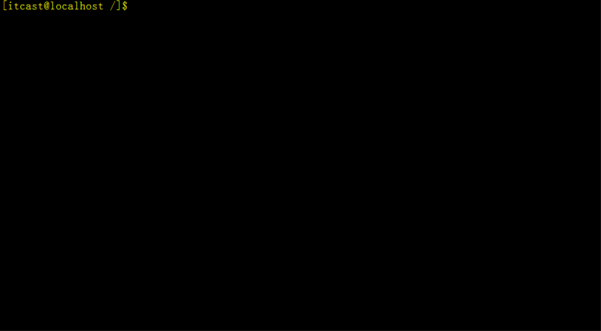

通过执行clear命令，就可以把缓冲区的命令全部清理干净了

### **2.3.14 exit命令**

exit命令用于退出目前的shell。

执行exit可使shell以指定的状态值退出。若不设置状态值参数，则shell以预设值退出。状态值0代表执行成功，其他值代表执行失败。exit也可用在script，离开正在执行的script，回到shell。

```
退出码（exit status，或exit code）的约定：

0表示成功（Zero - Success）

非0表示失败（Non-Zero  - Failure）

2表示用法不当（Incorrect Usage）

127表示命令没有找到（Command Not Found）

126表示不是可执行的（Not an executable）

>=128 信号产生
```

**语法如下**

```shell
exit [状态值]
```

退出终端

```shell
# exit
```

> exit会被经常在shell中使用
>
> 我们在明天的课程【综合案例】中会使用到exit

## 2.4 总结

用户账号管理和用户组是我们在实际使用过程中常用的命令，学习完创建账号、创建组后，需要通过gpasswd命令将用户添加到组，这也是我们学习的最终目的

系统管理的常用命令都是在开发过程中经常使用到的

# 3 Linux目录管理

```
注意：
在下面的讲解中，每个命令都有很多的参数说明（选项），我们只讲其中的几个，关键是让学生掌握命令的语法；学生学习完语法后，就可以自己按照参数书写各种命令，这也是我们最终的目的。常用命令，我们在企业级开发过程中，经常书写的命令。会非常被容易记住，不常用的命令，只要我们学习完了语法之后，在去查找参数手册，会非常容易的解决我们的问题，所以，每个命令不是建立在死记硬背的基础上的，要理解语法+查找参数=解决问题
```

## 3.1 Linux 文件与目录管理

```
在Linux系统中，所有的的目录结构为树状结构，最顶级的目录为根目录 /。
在实际开发过程中，文件的操作是非常频繁也是非常重要的
下面的章节我们将学习下Linux系统所有的系统目录和文件通过命令是如何进行管理的 
```

### 3.1.1 目录常用命令

- ls:         列出目录
- cd：     切换目录
- pwd：  显示目前的目录
- mkdir：创建一个新的目录
- rmdir：删除一个空的目录
- cp:         复制文件或目录
- rm:        移除文件或目录
- mv:        移动文件与目录或修改文件与目录的名称

**自动补全**

- 在敲出 文件/ 目录 / 命令 的前几个字母之后, 按下 `tab`键
- 如果还存在其他 文件 / 目录 / 命令, 再按一下tab键, 系统会提示可能存在的命令

#### 1) ls (列出目录)

```
ls命令相当于我们在Windows系统中打开磁盘、或者打开文件夹看到的目录以及文件的明细，如下图
```

【查看磁盘下的目录与文件】

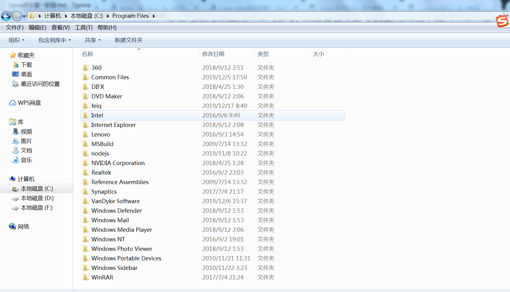

【查看文件夹下的目录与文件】

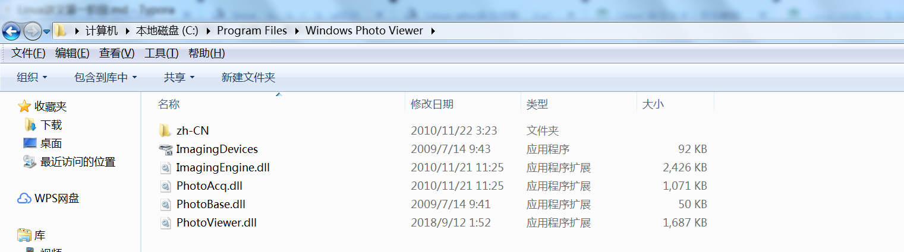


注意：在Linux系统当中， ls 命令算是比较常用的命令

使用者权限：所有使用者都可使用。

**语法如下：**

```
ls [选项]  目录名称
```

**选项与参数：**

- -a ：全部的文件，连同隐藏档( 开头为 . 的文件) 一起列出来(常用)
- -d ：仅列出目录本身，而不是列出目录内的文件数据(常用)
- -l ：长数据串列出，包含文件的属性与权限等等数据；(常用)

**将根目录下的所有文件列出来(含属性与隐藏档)**

```
 ls -al ~
```

执行效果如下

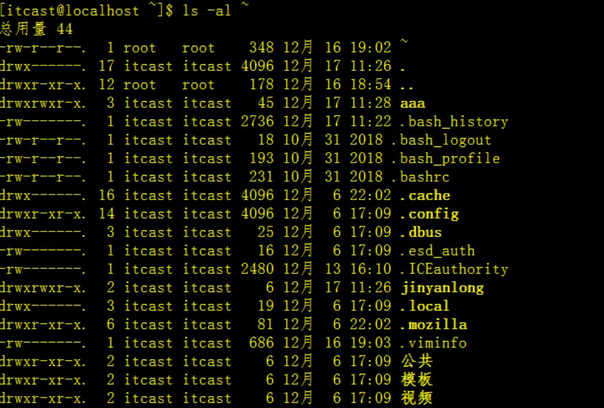

```
 ls -l
```

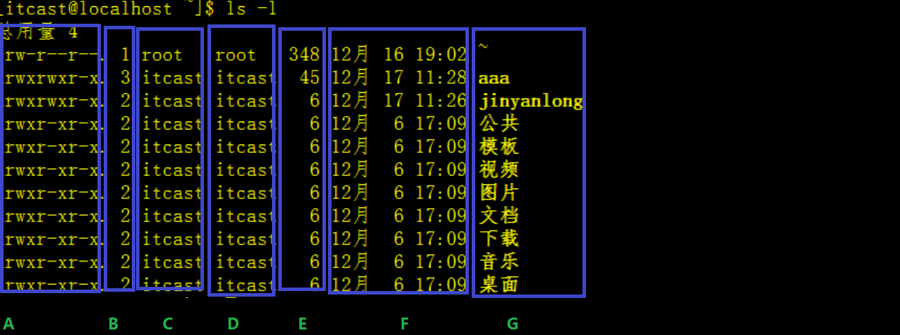

`ls -l` 可以查看文件夹下文件的详细信息, 从左到右 依次是:

- **权限（A区域）**, 第一个字符如果是 `d` 表示目录
- **硬链接数（B区域）**, 通俗的讲就是有多少种方式, 可以访问当前目录和文件
- **属主（C区域）**, 文件是所有者、或是叫做属主
- **属组（D区域）**, 文件属于哪个组
- **大小（E区域）：文件大小**
- **时间（F区域）：最后一次访问时间**
- **名称（G区域）:文件的名称**

```
ls
```

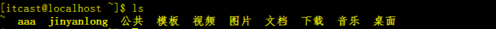

```
总结
以上三种是经常被使用到的命令
它们之间的区别是
ls  显示不隐藏的文件与文件夹
ls -l 显示不隐藏的文件与文件夹的详细信息
ls -al   显示所有文件与文件夹的详细信息
```

#### 2) pwd显示当前目录

```
执行pwd命令相当于我们在Windows系统路径导航栏中查看到的当前浏览位置信息
```

如下图

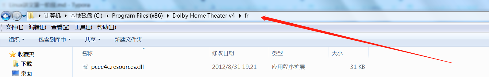


pwd 是 **Print Working Directory** 的缩写，也就是显示目前所在当前目录的命令。

使用者权限：所有使用者都可使用。

**查看当前所在目录**

```
pwd -P
```

执行效果如下


#### 3) cd (切换目录)

```
Linux的cd切换目录，相当于我们在Windows中通过鼠标或者快捷键点开不同的目录
```

注意：在Linux系统当中， cd 命令算是比较常用的命令

cd是Change Directory的缩写，这是用来变换工作目录的命令

使用者权限：所有使用者都可使用。

**语法如下：**

```
 cd [相对路径或绝对路径]
```

在正式学习cd命令前面，我们通过下面一个座位图的形式讲解下相对路径和绝对路径是怎么表现的。

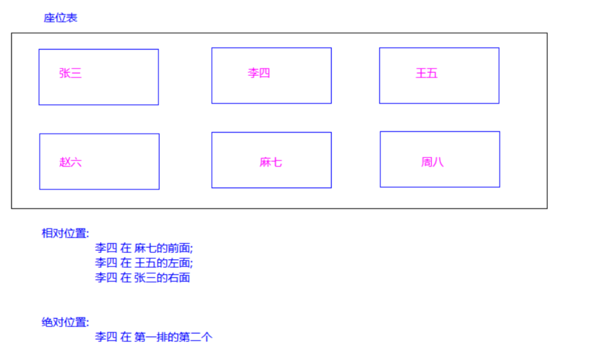


- **绝对路径：**
  路径的写法，由根目录 / 写起，例如： /usr/share/doc 这个目录。
- **相对路径：**
  路径的写法，不是由 / 写起，例如由 /usr/share/doc 要到 /usr/share/man 底下时，可以写成： cd ../man 这就是相对路径的写法啦！

**1、使用相对路径定位目标**

- 特征:  **相对路径** 输入路径时, 最前面不是以 "/" 开始的, 表示相对 **当前目录** 所在的位置
- 缺点:  参照工作目录 发生变化 相对路径也要发生变化

```
需求1: 当前工作目录是 /usr, 使用相对路径 切换到 /usr/tmp 目录下 

需求2: 当前工作目录是 /root, 使用相对路径 切换到 /usr/tmp 目录下 
```

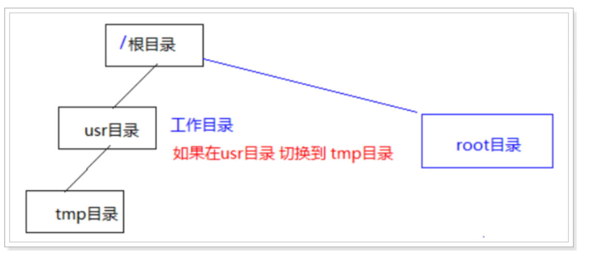

执行效果如下

```
注意：
cd ~ 表示回到根目录
```

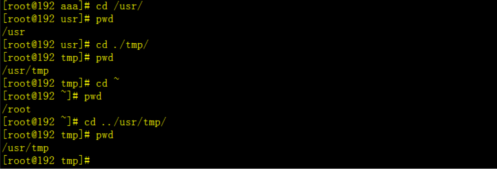

**2、使用绝对路径定位目标**

- 特征: **绝对路径** 在输入路径时, 最前面是以 `/`  开始的, 表示 从 **根目录** 开始的具体目录位置
- 优点: 定位准确, 不会因为 工作目录变化 而变化

```
需求1: 当前工作目录是 /usr, 使用绝对路径 切换到 /usr/tmp 目录下 

需求2: 当前工作目录是 /root, 使用绝对路径 切换到 /usr/tmp 目录下 
```

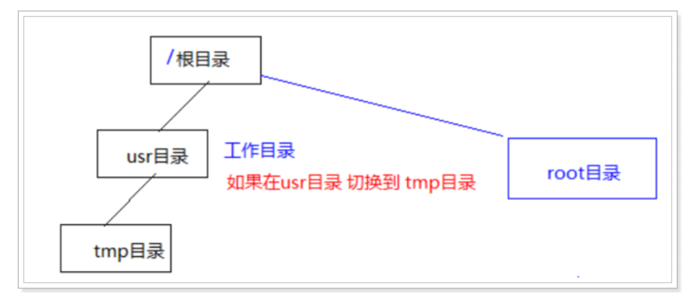

执行效果如下

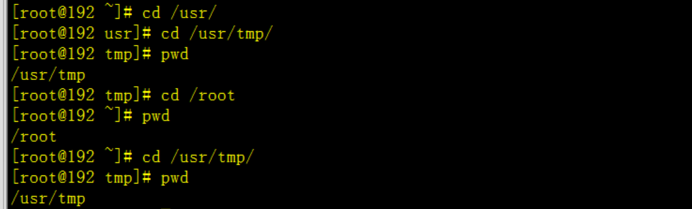

> 总结
>
> - **相对路径** 在输入路径时, 最前面不是以 `/` 开始的 , 表示相对 **当前目录** 所在的目录位置
> - **绝对路径** 在输入路径时, 最前面是以 `/`  开始的, 表示 从 **根目录** 开始的具体目录位置


#### 4) mkdir(创建目录)

```
引子：
Linux的mkdir命令相当于我们在Windows中通过鼠标或者快捷键新建文件夹
```

mkdir命令用于建立名称为 dirName 之子目录

使用权限：于目前目录有适当权限的所有使用者

**语法**

```
mkdir [-p] dirName
```

**参数说明：**

- -p 确保目录名称存在，不存在的就建一个

建立一个名为jinyanlong 的子目录

```shell
mkdir jinyanlong
```

执行效果如下

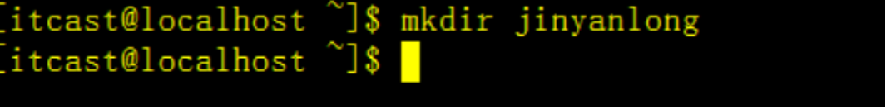

查看新建的 文件

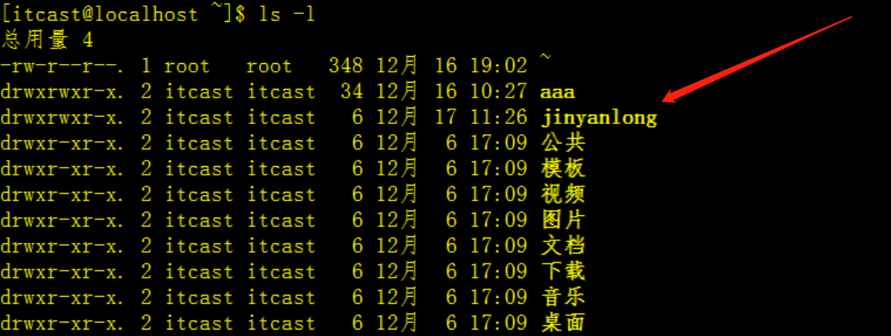

在工作目录下的 aaa目录中，建立一个名为 bbb的子目录。 若 aaa目录原本不存在，则建立一个。（注：本例若不加 -p，且原本 aaa目录不存在，则产生错误。）

```shell
mkdir -p aaa/bbb
```

执行效果如下

> 这里为了显示更直观，我们使用了tree命令
>
> 后面在讲解到yum的时候，会详细讲解
>
> 此处先使用

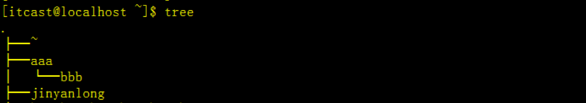

由上图我们发现，aaa目录被强制创建，里面包含了bbb文件。

#### **5) rmdir(删空目录)**

```
Linux的rmdir命令相当于我们在Windows中通过鼠标或者快捷键删除文件夹。
稍微有点不同的就是在Linux中删除子目录的时候，如果主目录下没有了目录以及文件，会连同主目录同时删除了（需要写Linux带有P的参数）
```

rmdir命令删除空的目录

使用权限：于目前目录有适当权限的所有使用者。

**语法**

```shell
rmdir [-p] dirName
```

**参数**：

- -p 是当子目录被删除后使它也成为空目录的话，则顺便一并删除。

**将工作目录下，名为 jinyanlong 的子目录删除 :**

```shell
rmdir jinyanlong
```

**在工作目录下的 aaa目录中，删除名为 bbb的子目录。若 bbb删除后，aaa目录成为空目录，则 aaa同时也会被删除**

```shell
rmdir  -p aaa/bbb
```

> 总结：
>
> rmdir  -p aaa/bbb也就是说
>
> 在删除bbb目录完成后，发现aaa目录也是空目录了，在删除完bbb后aaa也同时被删除了。

#### 6) cp(文件复制)

```
Linux的cp命令相当于我们在Windows中通过鼠标或者快捷键复制文件或者目录
```

cp命令主要用于复制文件或目录。

使用权限：于目前目录有适当权限的所有使用者

**语法**

```shell
cp [options] source dest
```

或

```shell
cp [options] source... directory
```

**参数说明：**

- -a：此选项通常在复制目录时使用，它保留链接、文件属性，并复制目录下的所有内容。其作用等于dpR参数组合。
- -d：复制时保留链接。这里所说的链接相当于Windows系统中的快捷方式。
- -f：覆盖已经存在的目标文件而不给出提示。
- -i：与-f选项相反，在覆盖目标文件之前给出提示，要求用户确认是否覆盖，回答"y"时目标文件将被覆盖。
- -p：除复制文件的内容外，还把修改时间和访问权限也复制到新文件中。
- -r/R：若给出的源文件是一个目录文件，此时将复制该目录下所有的子目录和文件。
- -l：不复制文件，只是生成链接文件。

我们将当前目录"aaa/"下的所有目录以及文件复制到新目录"ccc"下，输入如下命令：

**1、数据准备**

创建aaa目录并且aaa下包含bbb目录

```shell
mkdir -p aaa/bbb
mkdir -p ccc
```

执行效果如下

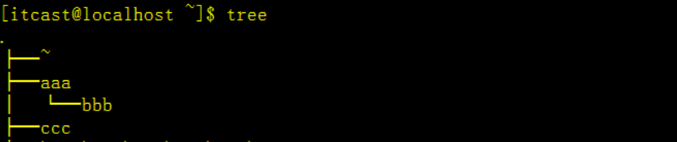

aaa目录下有bbb

ccc下面没有目录和文件

**2、执行复制**

```shell
cp –r aaa/*  ccc  
```

执行效果如下

我们将aaa下面的所有文件、目录复制到了目录c下面

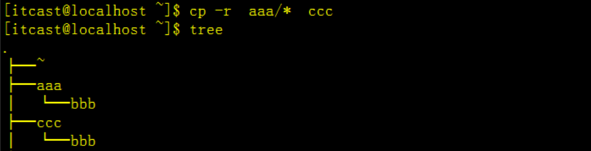

> 总结：
>
> 用户使用该指令复制目录时，必须使用参数"-r"或者"-R"。
>
> 如果不加参数"-r"或者"-R",只复制文件，而略过目录

#### 7) rm(删除目录)

```
Linux的rm命令相当于我们在Windows中通过鼠标或者快捷键删除文件或者目录
```

rm命令用于删除一个文件或者目录。

使用权限：于目前目录有适当权限的所有使用者

**语法**

```shell
rm [options] name...
```

**参数：**

- -i 删除前逐一询问确认。
- -f 即使原档案属性设为唯读，亦直接删除，无需逐一确认。
- -r 将目录及以下之档案亦逐一删除。

如果我们要删除文件可以直接使用rm命令，若删除目录则必须配合选项"-r"，例如：

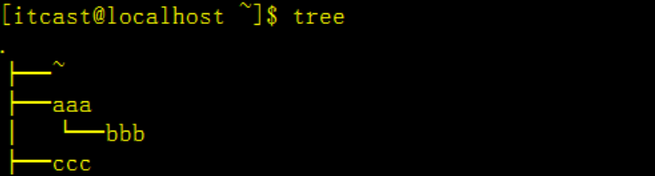

```shell
rm -r  ccc
```

执行删除，如下图

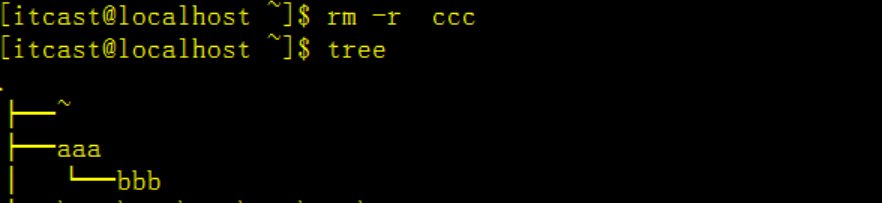

> 注意
>
> 文件一旦通过rm命令删除，则无法恢复，所以必须格外小心地使用该命令
>
> 如果删除文件（比如.sh 、.txt）
>
> 直接使用rm  name.txt

#### 8) mv(移动文件)

```
Linux的mv命令相当于我们在Windows中通过鼠标或者快捷键剪切（+重命名）+粘贴文件或者目录
```

mv 命令用来为文件或目录改名、或将文件或目录移入其它位置

**语法**

```shell
mv [options] source dest
mv [options] source... directory
```

**参数说明：**

- -i: 若指定目录已有同名文件，则先询问是否覆盖旧文件;
- -f: 在 mv 操作要覆盖某已有的目标文件时不给任何指示;


将文件 aaa 更名为 bbb :

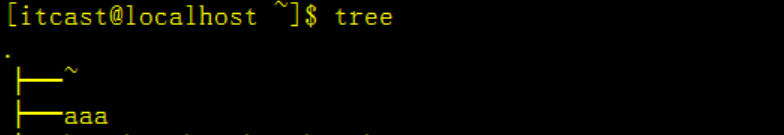

```shell
1、创建aaa目录、
mkdir  aaa
2、开始重命名
mv aaa bbb
```

执行后

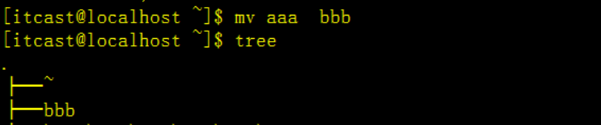

将ccc目录放入ddd目录中。

注意，如果ddd目录不存在，则该命令将ccc改名为ddd。

```shell
创建ccc
mkdir ccc
```

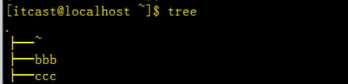

```shell
开始移动
mv ccc/ ddd 
```

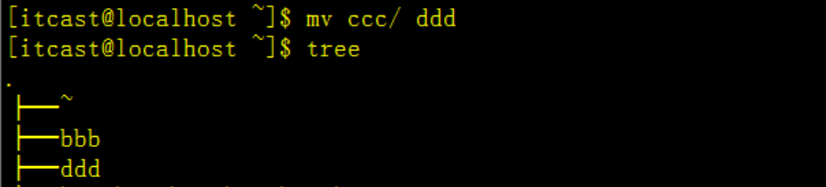

由上图我们发现，由于ddd目录不存在，所以在mv的时候将ccc目录改名为了ddd。

## 3.2 Linux 文件基本属性

```
在Wndows系统中，我们可以选中一个文件，右键属性，可以查看到这个文件的文件类型（基本信息），以及文件的权限信息，在Linux中，它是通过不同字符的排序顺序来表示文件的类型以及权限所属信息的。
```

Linux系统是一种典型的多用户系统，不同的用户处于不同的地位，拥有不同的权限。为了保护系统的安全性，Linux系统对不同的用户访问同一文件（包括目录文件）的权限做了不同的规定。

下面我们就一起学习下Linux系统不同权限的文件和目录在怎么表示的

在Linux中我们可以使用ll或者ls –l命令来显示一个文件的属性以及文件所属的用户和组，如：

```shell
ls -l
```

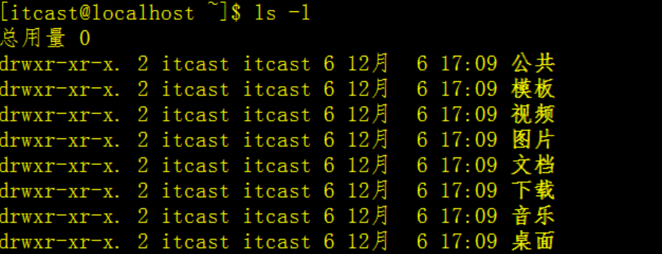

实例中，bin文件的第一个属性用"d"表示。"d"在Linux中代表该文件是一个目录文件。

在Linux中第一个字符代表这个文件是目录、文件或链接文件等等。

- 当为[ **d** ]则是目录
- 当为[ **-** ]则是文件；
- 若是[ **l** ]则表示为链接文档(link file)；
- 若是[ **b** ]则表示为装置文件里面的可供储存的接口设备(可随机存取装置)；
- 若是[ **c** ]则表示为装置文件里面的串行端口设备，例如键盘、鼠标(一次性读取装置)。

接下来的字符中，以三个为一组，且均为『rwx』 的三个参数的组合。其中，[ r ]代表可读(read)、[ w ]代表可写(write)、[ x ]代表可执行(execute)。 要注意的是，这三个权限的位置不会改变，如果没有权限，就会出现减号[ - ]而已。

每个文件的属性由左边第一部分的10个字符来确定（如下图）。


从左至右用0-9这些数字来表示。

第0位确定文件类型，第1-3位确定属主（该文件的所有者）拥有该文件的权限。

第4-6位确定属组（所有者的同组用户）拥有该文件的权限，第7-9位确定其他用户拥有该文件的权限。


其中，第1、4、7位表示读权限，如果用"r"字符表示，则有读权限，如果用"-"字符表示，则没有读权限；

第2、5、8位表示写权限，如果用"w"字符表示，则有写权限，如果用"-"字符表示没有写权限；第3、6、9位表示可执行权限，如果用"x"字符表示，则有执行权限，如果用"-"字符表示，则没有执行权限。

## 3.3 Linux文件属主和属组

```
引子：
对于一个文件来说，它都有一个特定的所有者，也就是对该文件具有所有权的用户。
也就是所谓的属主，它属于哪个用户的意思。
除了属主，还有属组，也就是说，这个文件是属于哪个组的（用户所属的组）。
文件的【属主】有一套【读写执行权限rwx】
文件的【属组】有一套【读写执行权限rwx】
还有它权限，下面我们在介绍
```

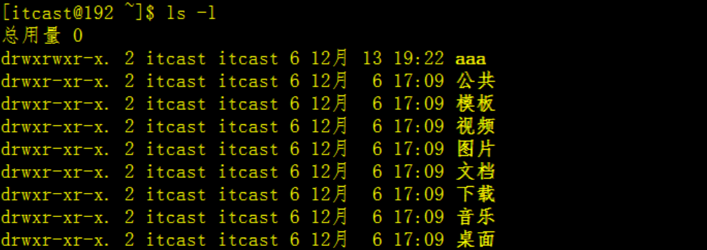

在以上实例中，aaa文件是一个目录文件，属主和属组都为 itcast，属主有可读、可写、可执行的权限（rwx）；与属主同组的其他用户有可读可写和可执行的权限（rwx）；其他用户也有可读和可执行的权限（r-x）。

### **3.3.1 chgrp更改属组**

```
实际开发中我们经常会创建新建目录和文件，一般情况下，通过命令进行新建，
在创建完成后，使用不同的用户访问，可能就会出现报错，无法访问等等问题。
然后经过一番这查找,发现该有的文件都在，大小写也没问题，路径也没问题
其实并不是这些问题。而是权限问题导致我们无法访问！是因为一个文件默认隶属于一个属组，而使用其他用户访问这个文件肯定无法访问(因为访问用户所属的组和文件所在的不是同一个组)
那么怎么可以正常访问呢？其实就是通过更改用户组（用户组、文件组）来解决这些问题
```

chgrp命令用于变更文件或目录的所属群组。

文件或目录权限的的拥有者由所属群组来管理。您可以使用chgrp指令去变更文件与目录的所属群组，设置方式采用群组名称或群组识别码皆可

为了方便初学者记忆，可以将 chgrp 理解为是 "change group" 的缩写

**语法如下**

```
chgrp [-cfhRv][--help][--version][所属群组][文件或目录...] 或 chgrp [-cfhRv][--help][--reference=<参考文件或目录>][--version][文件或目录...]
```

**改变文件的群组属性**

我们通过root用户进入（如下图），上接上面的例子

我们的aaa文件的属主和属组都属于itcast（如下图）

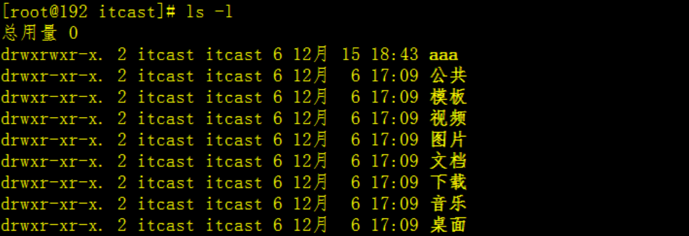

我们现在通过chgrp命令将文件aaa的属组更改成root（其他也可以）

```shell
chgrp -v root aaa
```

执行效果如下


我们通过下面的命令查询文件aaa的属组是否发生了变化，执行

```
ls -l
```

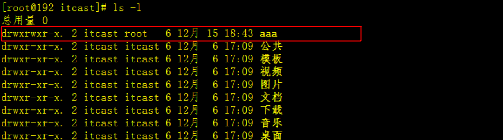

由上图我们发现，文件aaa的属组由itcast变成了root

这样的话，文件的属组就发生了变化。


### 3.3.2 chown更改属主和属组

```
我们为了让一些用户有权限查看某一文档，比如是一个时间表，而编写时间表的人要具有读写执行的权限(属主)
我们想让一些用户知道这个时间表的内容，而不让他们修改，所以我们可以把这些用户都划到一个组（属组），然后来修改这个文件的权限，让用户组可读，这样用户组下面的每个用户都是可读的
```

Linux是多任务操作系统，所有的档案皆有拥有者。利用 chown 可以将档案的拥有者加以改变。一般来说，这个指令只有是由系统管理者(root)所使用，一般使用者没有权限可以改变别人的档案拥有者，也没有权限可以自己的档案拥有者改设为别人。只有系统管理者(root)才有这样的权限

使用权限 : 管理员账户

**语法如下**

```
chown [–R] 属主名 文件名
chown [-R] 属主名：属组名 文件名
```

我们通过root用户进入（如下图），上接上面的例子

我们的aaa文件的属主属于itcast、属组属于root

我们现在通过chgrp命令将文件aaa的属主更改成root，执行

```
 chown  root aaa
```

效果如下


我们通过下面的命令查询文件aaa的属主是否发生了变化，执行

```
ls -l
```

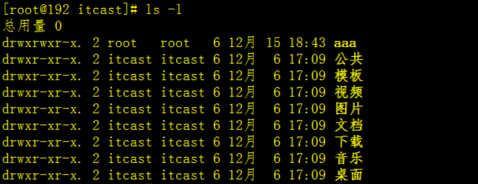

由上图我们发现，文件aaa的属主和属组都变成了root。

**我们将aaa文件的拥有者与群组改回为itcast：**

注意：chown命令可以更改属主和属组

```
chown itcast:itcast aaa
```

我们通过下面的命令查询文件aaa的属主是否发生了变化，执行

```
ls -l
```


由上图可知，aaa文件的属主和属组都被更改回来了。

### 3.3.3 chmod权限命令

Linux文件属性有两种设置方法，一种是数字，一种是符号

Linux的文件调用权限分为三级 : 文件属主、属组、其他。利用 chmod 可以控制文件如何被他人所调用。

**使用权限 : 所有使用者**

**语法**

```
chmod [-cfvR] [--help] [--version] mode file...
```

**参数说明**


mode : 权限设定字串，格式如下

```
[ugoa...][[+-=][rwxX]...][,...]
```

**解释：**

u 表示该档案的拥有者，g 表示与该档案的拥有者属于同一个群体(group)者，o 表示其他以外的人，a 表示这三者皆是。

+表示增加权限、- 表示取消权限、= 表示唯一设定权限。
r 表示可读取，w 表示可写入，x 表示可执行，X 表示只有当该档案是个子目录或者该档案已经被设定过为可执行。

#### **1) 数字权限**

Linux文件的基本权限就有九个，分别是owner/group/others三种身份各有自己的read/write/execute权限。

先复习一下刚刚上面提到的数据：文件的权限字符为：『-rwxrwxrwx』， 这九个权限是三个三个一组（owner/group/others就是所说的三个一组 ）的，我们也可以使用数字来代表各个权限，各权限的分数对照表如下

各权限的数字对照表：[r]:4;[w]:2;[x]:1;[-]:**0**

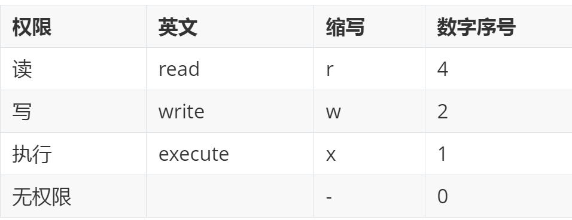

每种身份(owner/group/others)各自的三个权限(r/w/x)分数是需要累加的，例如当权限为： [-rwxrwx---] 分数则是：

- owner = rwx = 4+2+1 = 7
- group = rwx = 4+2+1 = 7
- others= --- = 0+0+0 = 0

所以等一下我们设定权限的变更时，该文件的权限数字就是770啦,变更权限的指令chmod的语法是这样的

```
chmod [-R] xyz 文件或目录
```

选项与参数：

- xyz : 就是刚刚提到的数字类型的权限属性，为 rwx 属性数值的相加。
- -R : 进行递归(recursive)的持续变更，亦即连同次目录下的所有文件都会变更

上面的 可以表示如下

```shell
chmod  -R 770     档案或目录
```

> 上面说了这么多，我们举例说明一下：

我们进入itcast用户创建文件czbk.txt

```shell
touch as.txt
```

然后切换到root

比如，我们如果要将as.txt这个文件所有的权限都设定启用

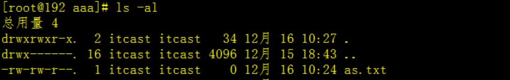

那么命令如下：

```shell
chmod -R 777 as.txt
```

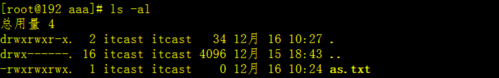

由此可见，as.txt的属主权限、属组权限、其他权限都发生了改变

由之前的【-rw-rw-r--】变成【-rwxrwxrwx】

> 根据前面的换算我们已经知道如何将一个文件的属主、属组、其他权限换算成数字了，换算成数字后，我们只需要通过chmod命令即可更改文件的权限

#### **2) 符号权限**

还有一个改变权限的方法，就是 符号权限，我们先回顾下之前提到的9个权限

- (1)user     属主权限
- (2)group  属组权限
- (3)others  其他权限

那么我们就可以使用 **u, g, o** 来代表三种身份的权限！

此外， **a** 则代表 **all**，即全部的身份。读写的权限可以写成 **r, w, x**，也就是可以使用下表的方式来看

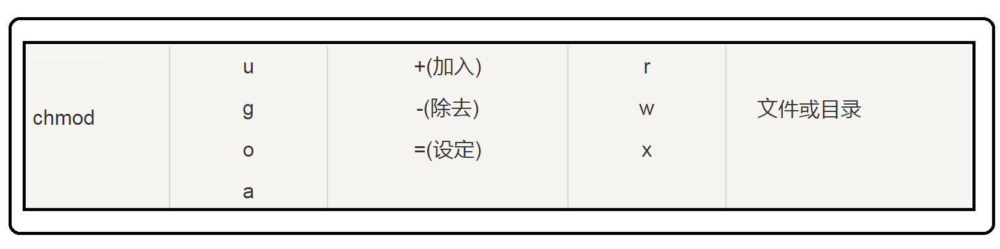

如果我们需要将文件权限设置为 **-rwxr-xr--** ，可以使用 **chmod u=rwx,g=rx,o=r 文件名** 来设定:

上接上面的例子，如下图

我们将as.txt的权限设置为**-rwxr-xr--**

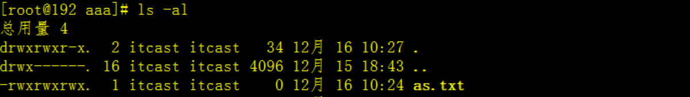

执行

```shell
chmod u=rwx,g=rx,o=r  as.txt
```

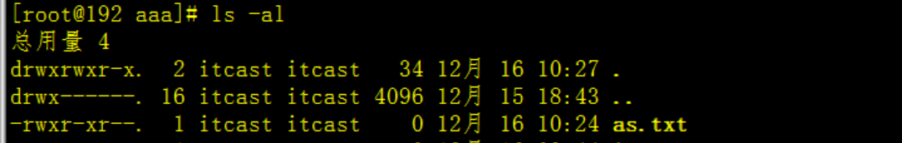

 由上图我们发现，as.txt的权限变成了-rwxr-xr--

假如我们要将权限去掉而不改变其他已存在的权限呢？举个例子，比如我要拿掉全部人的可读权限，则

```SHELL
 chmod  a-r as.txt
```

执行如下

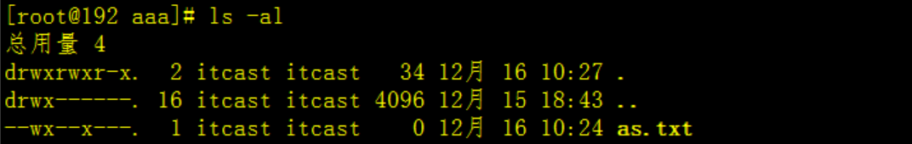

由此可见，as.txt的其他权限都没有了，变成了【---】

## 3.4 综合案例

```
在前面的章节中我们讲解了用户、用户组、文件属主、属组以及权限，知识点比较零散，下面，我们就通过一个简单小案例把这些知识点串联起来
```

**需求：**

比如一个公司的开发团队有三个用户：java、erlang、golang有一个文件目录tmp/work供他们开发，如何实现让这三个用户都对其具有写权限

**1、首先，我们创建三个账户**（切换到root）

```shell
adduser java
adduser erlang
adduser golang
```

执行效果如下

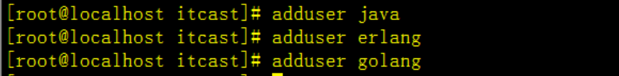

**2、增加用户组**

```shell
groupadd -g 8888 dev-group
```

执行效果如下


**3、创建公共文件并设置权限**

给文件/tmp/project2019/设置属组为dev-group

```shell
 mkdir /tmp/project2019
 
 chown -R :dev-group /tmp/project2019/
 或者
 chgrp -R dev-group  /tmp/project2019/
```

执行效果如下


**4、将用户添加到组**

```shell
gpasswd -a java    dev-group
gpasswd -a erlang  dev-group
gpasswd -a golang  dev-group
```

执行效果如下

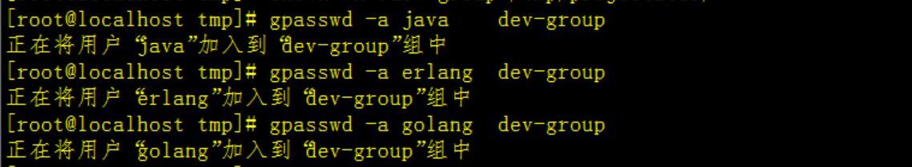

查询dev-group组下所有用户

```shell
 grep 'dev-group' /etc/group
```

执行效果如下

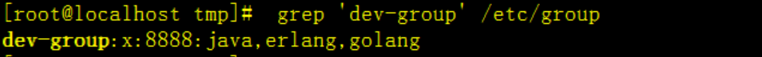

**5、切换到java用户**

切换到java用户看看是否有写入权限

```shell
su java
```

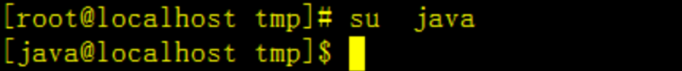

新建文件

在我们上面创建的目录tmp/project2019/下面创建文件

```shell
mkdir java-files-new
```

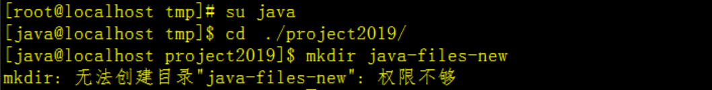

由此发现，我们在tmp/project2019/下面创建文件发生了权限不足，我们去查看下tmp/project2019/的文件属性，如下图

我们在/tmp目录下执行

```
ls -l
```

执行效果如下

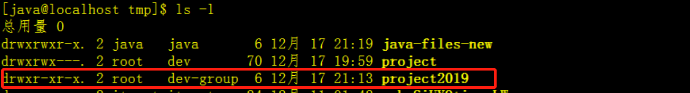

 我们发现目录project2019的文件属性为【drwxr-xr-x】

根据前面学的知识，我们拆分如下

【d】:文件类型

【rwx】：属主

【r-x】：属组

【r-x】：其他

现在答案就出来了，也就是说我们的属组权限是【r-x】，只有读和执行权限，没有写入权限，那么下面我们就给project2019目录增加写入权限。

**6、增加写入权限**

给project2019目录增加写入权限，执行下面的命令（前面已经学习过了）

记得切换到root下执行

```shell
chmod  -R 770  project2019
```

执行效果如下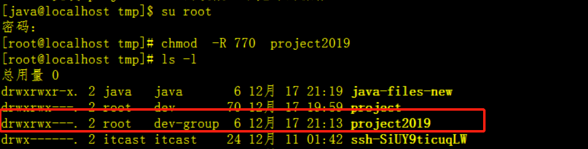

此时我们发现project2019目录的属组权限变成了【rwx】即可读、可写、可执行

**7、切换用户，继续写入**

```shell
su  java
mkdir java-files-new
ls -l
```

执行效果如下

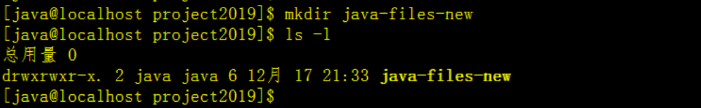

由此发现，这个时候我们有了写入权限，java-files-new文件被成功写入

那么，其他两个用户golang、erlang也是和java一个组的，他们能不能正常写入呢，我们试试（从root切换过去）

```shell
su
su erlang
mkdir erlang-files-new
==============================
su
su golang
mkdir golang-files-new

ls -l
```

执行效果（erlang新建文件）

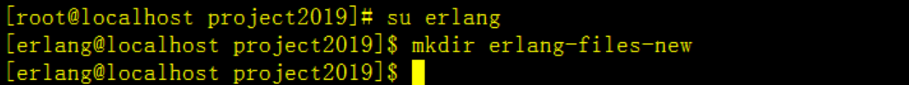

执行效果（golanglang新建文件）

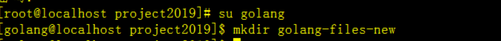

查看所有文件

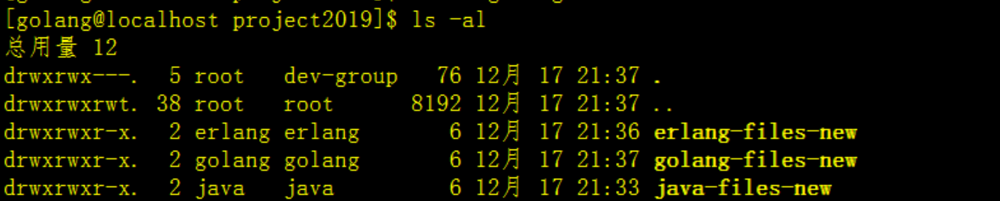

由此可见，我们组的三个用户都成功创建了文件（拥有了写入权限）

**8、验证结论**

为了验证上面的结论，我们新增一个用户itbeijing

看看能否正常新建文件

```shell
useradd   itbeijing
su itbeijing
mkdir  itbeijing-files-new
```

执行效果如下

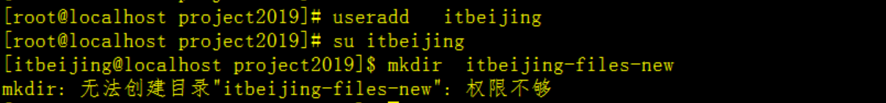

由上图我们发现，我们刚刚新创建的用户在创建文件的时候发现了权限不足。

由此说明用户itbeijing用户的属组和文件的属组不一样，所以没有权限。

## 3.5 总结

在企业级开发过程中，实际操作目录是最经常出现的，对于目录常用命令我们要熟练掌握并能熟练编写
因为Linux是多用户系统，所以权限也是非常核心和重要的，我们要熟练编写权限（属主、属组、其他权限）的常用命令。