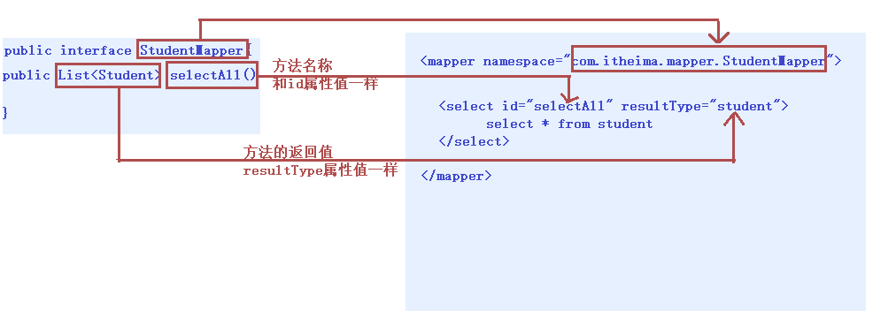
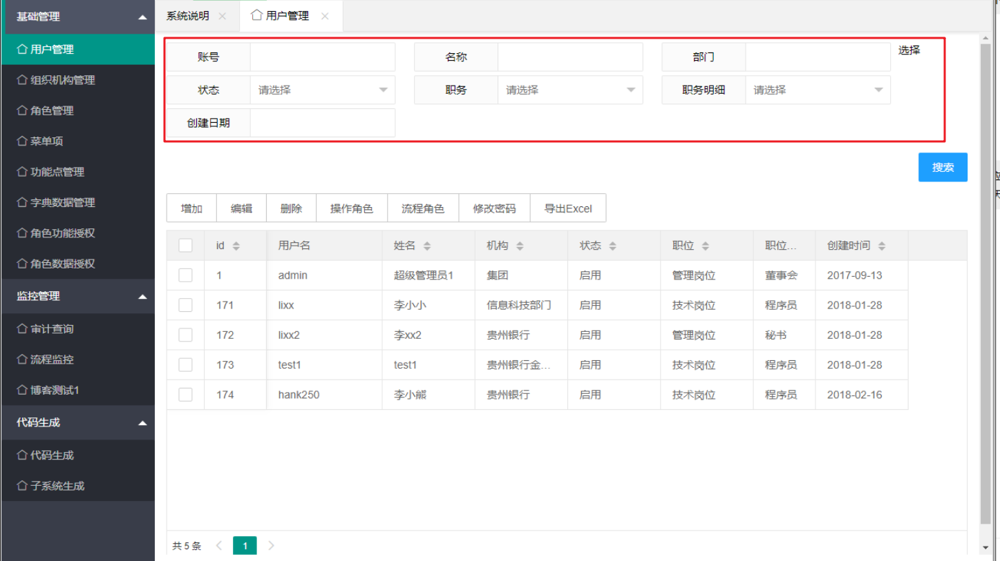
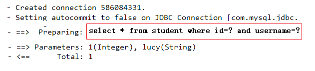
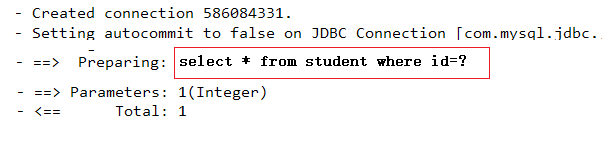
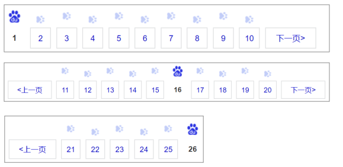

# 1. 接口代理方式实现Dao

## 1.1 介绍

采用 Mybatis 的代理开发方式实现 DAO 层的开发，这种方式是我们后面进入企业的主流。Mapper 接口开发方法只需要程序员编写Mapper 接口（相当于Dao 接口），由Mybatis 框架根据接口定义创建接口的动态代理对象，代理对象的方法体同上边Dao接口实现类方法。

Mapper 接口开发需要遵循以下规范：

**1) Mapper.xml文件中的namespace与mapper接口的全限定名相同**

**2) Mapper接口方法名和Mapper.xml中定义的每个statement的id相同**

**3) Mapper接口方法的输入参数类型和mapper.xml中定义的每个sql的parameterType的类型相同**

**4) Mapper接口方法的输出参数类型和mapper.xml中定义的每个sql的resultType的类型相同**

## 1.2 使用规则



## 1.3 测试

```java
 public Student selectById(Integer id) {
        Student stu = null;
        SqlSession sqlSession = null;
        InputStream is = null;
        try{
            //1.加载核心配置文件
            is = Resources.getResourceAsStream("MyBatisConfig.xml");

            //2.获取SqlSession工厂对象
            SqlSessionFactory sqlSessionFactory = new SqlSessionFactoryBuilder().build(is);

            //3.通过工厂对象获取SqlSession对象
            sqlSession = sqlSessionFactory.openSession(true);

            //4.获取StudentMapper接口的实现类对象
            StudentMapper mapper = sqlSession.getMapper(StudentMapper.class); // StudentMapper mapper = new StudentMapperImpl();

            //5.通过实现类对象调用方法，接收结果
            stu = mapper.selectById(id);

        } catch (Exception e) {

        } finally {
            //6.释放资源
            if(sqlSession != null) {
                sqlSession.close();
            }
            if(is != null) {
                try {
                    is.close();
                } catch (IOException e) {
                    e.printStackTrace();
                }
            }
        }

        //7.返回结果
        return stu;
    }
```

## 1.4 源码分析

* 分析动态代理对象如何生成的？ 

  通过动态代理开发模式，我们只编写一个接口，不写实现类，我们通过 getMapper() 方法最终获取到 org.apache.ibatis.binding.MapperProxy 代理对象，然后执行功能，而这个代理对象正是 MyBatis 使用了 JDK 的动态代理技术，帮助我们生成了代理实现类对象。从而可以进行相关持久化操作。 

* 分析方法是如何执行的？

   动态代理实现类对象在执行方法的时候最终调用了 mapperMethod.execute() 方法，这个方法中通过 switch 语句根据操作类型来判断是新增、修改、删除、查询操作，最后一步回到了 MyBatis 最原生的 SqlSession 方式来执行增删改查。      

# 2. 动态sql语句

## 2.1 概述

Mybatis 的映射文件中，前面我们的 SQL 都是比较简单的，有些时候业务逻辑复杂时，我们的 SQL是动态变化的，此时在前面的学习中我们的 SQL 就不能满足要求了。



参考的官方文档，描述如下：


## 2.2 <**if>** 

我们根据实体类的不同取值，使用不同的 SQL语句来进行查询。比如在 id如果不为空时可以根据id查询，如果username 不同空时还要加入用户名作为条件。这种情况在我们的多条件组合查询中经常会碰到。

如下图：

```xml
<select id="findByCondition" parameterType="student" resultType="student">
    select * from student
    <where>
        <if test="id!=0">
            and id=#{id}
        </if>
        <if test="username!=null">
            and username=#{username}
        </if>
    </where>
</select>
```

当查询条件id和username都存在时，控制台打印的sql语句如下：

```java
     … … …
     //获得MyBatis框架生成的StudentMapper接口的实现类
    StudentMapper mapper = sqlSession.getMapper( StudentMapper.class);
    Student condition = new Student();
    condition.setId(1);
    condition.setUsername("lucy");
    Student student = mapper.findByCondition(condition);
    … … …
```




当查询条件只有id存在时，控制台打印的sql语句如下：

```java
 … … …
 //获得MyBatis框架生成的UserMapper接口的实现类
 StudentMapper mapper = sqlSession.getMapper( StudentMapper.class);
    Student condition = new Student();
    condition.setId(1);
    Student student = mapper.findByCondition(condition);
… … …

```



## 2.3 <**foreach>** 

循环执行sql的拼接操作，例如：SELECT * FROM student  WHERE id IN (1,2,5)。

 ```xml
<select id="findByIds" parameterType="list" resultType="student">
    select * from student
    <where>
        <foreach collection="array" open="id in(" close=")" item="id" separator=",">
            #{id}
        </foreach>
    </where>
</select>
 ```

测试代码片段如下：

```java
 … … …
 //获得MyBatis框架生成的UserMapper接口的实现类
StudentMapper mapper = sqlSession.getMapper(StudentMapper.class);
int[] ids = new int[]{2,5};
List<Student> sList = mapper.findByIds(ids);
System.out.println(sList);
… … …

```

总结语法:

~~~xml
<foreach>：循环遍历标签。适用于多个参数或者的关系。
    <foreach collection=“”open=“”close=“”item=“”separator=“”>
		获取参数
	</foreach>
~~~

属性
collection：参数容器类型， (list-集合， array-数组)。
open：开始的 SQL 语句。
close：结束的 SQL 语句。
item：参数变量名。
separator：分隔符。

## 2.4 SQL片段抽取

Sql 中可将重复的 sql 提取出来，使用时用 include 引用即可，最终达到 sql 重用的目的

```xml
<!--抽取sql片段简化编写-->
<sql id="selectStudent" select * from student</sql>
<select id="findById" parameterType="int" resultType="student">
    <include refid="selectStudent"></include> where id=#{id}
</select>
<select id="findByIds" parameterType="list" resultType="student">
    <include refid="selectStudent"></include>
    <where>
        <foreach collection="array" open="id in(" close=")" item="id" separator=",">
            #{id}
        </foreach>
    </where>
</select>
```

# 3. 分页插件

## 3.1 分页插件介绍



* 分页可以将很多条结果进行分页显示。 
*  如果当前在第一页，则没有上一页。如果当前在最后一页，则没有下一页。 
*  需要明确当前是第几页，这一页中显示多少条结果。    
* MyBatis分页插件总结
  * 在企业级开发中，分页也是一种常见的技术。而目前使用的 MyBatis 是不带分页功能的，如果想实现分页的 功能，需要我们手动编写 LIMIT 语句。但是不同的数据库实现分页的 SQL 语句也是不同的，所以手写分页 成本较高。这个时候就可以借助分页插件来帮助我们实现分页功能。 

  * PageHelper：第三方分页助手。将复杂的分页操作进行封装，从而让分页功能变得非常简单。    

## 3.2 分页插件的使用

MyBatis可以使用第三方的插件来对功能进行扩展，分页助手PageHelper是将分页的复杂操作进行封装，使用简单的方式即可获得分页的相关数据

开发步骤：

① 导入与PageHelper的jar包

② 在mybatis核心配置文件中配置PageHelper插件

~~~xml
<!-- 注意：分页助手的插件  配置在通用mapper之前 -->
<plugin interceptor="com.github.pagehelper.PageHelper">
    <!-- 指定方言 -->
    <property name="dialect" value="mysql"/>
</plugin>
~~~

③ 测试分页数据获取

~~~java
@Test
public void testPageHelper(){
    //设置分页参数
    PageHelper.startPage(1,2);

    List<User> select = userMapper2.select(null);
    for(User user : select){
        System.out.println(user);
    }
}
~~~

## 3.3 分页插件的参数获取

**获得分页相关的其他参数**：

```java
//其他分页的数据
PageInfo<User> pageInfo = new PageInfo<User>(select);
System.out.println("总条数："+pageInfo.getTotal());
System.out.println("总页数："+pageInfo.getPages());
System.out.println("当前页："+pageInfo.getPageNum());
System.out.println("每页显示长度："+pageInfo.getPageSize());
System.out.println("是否第一页："+pageInfo.isIsFirstPage());
System.out.println("是否最后一页："+pageInfo.isIsLastPage());
```

# 4. MyBatis的多表操作

## 4.1 多表模型介绍

我们之前学习的都是基于单表操作的，而实际开发中，随着业务难度的加深，肯定需要多表操作的。 


*  多表模型分类 一对一：在任意一方建立外键，关联对方的主键。
*  一对多：在多的一方建立外键，关联一的一方的主键。
*  多对多：借助中间表，中间表至少两个字段，分别关联两张表的主键。    

## 4.2 一对一

1. 一对一模型： 人和身份证，一个人只有一个身份证

2. 代码实现

   * 步骤一: sql语句准备

     ~~~sql
     CREATE TABLE person(
     	id INT PRIMARY KEY AUTO_INCREMENT,
     	NAME VARCHAR(20),
     	age INT
     );
     INSERT INTO person VALUES (NULL,'张三',23);
     INSERT INTO person VALUES (NULL,'李四',24);
     INSERT INTO person VALUES (NULL,'王五',25);
     
     CREATE TABLE card(
     	id INT PRIMARY KEY AUTO_INCREMENT,
     	number VARCHAR(30),
     	pid INT,
     	CONSTRAINT cp_fk FOREIGN KEY (pid) REFERENCES person(id)
     );
     INSERT INTO card VALUES (NULL,'12345',1);
     INSERT INTO card VALUES (NULL,'23456',2);
     INSERT INTO card VALUES (NULL,'34567',3);
     ~~~

   * 步骤二:配置文件

     ~~~xml
     <?xml version="1.0" encoding="UTF-8" ?>
     <!DOCTYPE mapper
             PUBLIC "-//mybatis.org//DTD Mapper 3.0//EN"
             "http://mybatis.org/dtd/mybatis-3-mapper.dtd">
     
     <mapper namespace="com.itheima.table01.OneToOneMapper">
         <!--配置字段和实体对象属性的映射关系-->
         <resultMap id="oneToOne" type="card">
             <id column="cid" property="id" />
             <result column="number" property="number" />
             <!--
                 association：配置被包含对象的映射关系
                 property：被包含对象的变量名
                 javaType：被包含对象的数据类型
             -->
             <association property="p" javaType="person">
                 <id column="pid" property="id" />
                 <result column="name" property="name" />
                 <result column="age" property="age" />
             </association>
         </resultMap>
     
         <select id="selectAll" resultMap="oneToOne">
             SELECT c.id cid,number,pid,NAME,age FROM card c,person p WHERE c.pid=p.id
         </select>
     </mapper>
     ~~~

   * 步骤三：测试类

     ~~~java
      @Test
         public void selectAll() throws Exception{
             //1.加载核心配置文件
             InputStream is = Resources.getResourceAsStream("MyBatisConfig.xml");
     
             //2.获取SqlSession工厂对象
             SqlSessionFactory sqlSessionFactory = new SqlSessionFactoryBuilder().build(is);
     
             //3.通过工厂对象获取SqlSession对象
             SqlSession sqlSession = sqlSessionFactory.openSession(true);
     
             //4.获取OneToOneMapper接口的实现类对象
             OneToOneMapper mapper = sqlSession.getMapper(OneToOneMapper.class);
     
             //5.调用实现类的方法，接收结果
             List<Card> list = mapper.selectAll();
     
             //6.处理结果
             for (Card c : list) {
                 System.out.println(c);
             }
     
             //7.释放资源
             sqlSession.close();
             is.close();
         }
     ~~~


## 4.3 一对多

1. 一对多模型： 一对多模型：班级和学生，一个班级可以有多个学生。    

2. 代码实现

   - 步骤一: sql语句准备

     ```sql
     CREATE TABLE classes(
     	id INT PRIMARY KEY AUTO_INCREMENT,
     	NAME VARCHAR(20)
     );
     INSERT INTO classes VALUES (NULL,'黑马一班');
     INSERT INTO classes VALUES (NULL,'黑马二班');
     
     
     CREATE TABLE student(
     	id INT PRIMARY KEY AUTO_INCREMENT,
     	NAME VARCHAR(30),
     	age INT,
     	cid INT,
     	CONSTRAINT cs_fk FOREIGN KEY (cid) REFERENCES classes(id)
     );
     INSERT INTO student VALUES (NULL,'张三',23,1);
     INSERT INTO student VALUES (NULL,'李四',24,1);
     INSERT INTO student VALUES (NULL,'王五',25,2);
     INSERT INTO student VALUES (NULL,'赵六',26,2);
     ```

   - 步骤二:配置文件

     ```xml
     <mapper namespace="com.itheima.table02.OneToManyMapper">
         <resultMap id="oneToMany" type="classes">
             <id column="cid" property="id"/>
             <result column="cname" property="name"/>
     
             <!--
                 collection：配置被包含的集合对象映射关系
                 property：被包含对象的变量名
                 ofType：被包含对象的实际数据类型
             -->
             <collection property="students" ofType="student">
                 <id column="sid" property="id"/>
                 <result column="sname" property="name"/>
                 <result column="sage" property="age"/>
             </collection>
         </resultMap>
         <select id="selectAll" resultMap="oneToMany">
             SELECT c.id cid,c.name cname,s.id sid,s.name sname,s.age sage FROM classes c,student s WHERE c.id=s.cid
         </select>
     </mapper>
     ```

   - 步骤三：测试类

     ```java
         @Test
         public void selectAll() throws Exception{
             //1.加载核心配置文件
             InputStream is = Resources.getResourceAsStream("MyBatisConfig.xml");
     
             //2.获取SqlSession工厂对象
             SqlSessionFactory sqlSessionFactory = new SqlSessionFactoryBuilder().build(is);
     
             //3.通过工厂对象获取SqlSession对象
             SqlSession sqlSession = sqlSessionFactory.openSession(true);
     
             //4.获取OneToManyMapper接口的实现类对象
             OneToManyMapper mapper = sqlSession.getMapper(OneToManyMapper.class);
     
             //5.调用实现类的方法，接收结果
             List<Classes> classes = mapper.selectAll();
     
             //6.处理结果
             for (Classes cls : classes) {
                 System.out.println(cls.getId() + "," + cls.getName());
                 List<Student> students = cls.getStudents();
                 for (Student student : students) {
                     System.out.println("\t" + student);
                 }
             }
     
             //7.释放资源
             sqlSession.close();
             is.close();
         }
     ```

   3.一对多配置文件总结：

   ~~~xml-dtd
   <resultMap>：配置字段和对象属性的映射关系标签。
       id 属性：唯一标识
       type 属性：实体对象类型
   <id>：配置主键映射关系标签。
   <result>：配置非主键映射关系标签。
       column 属性：表中字段名称
       property 属性： 实体对象变量名称
   <collection>：配置被包含集合对象的映射关系标签。
       property 属性：被包含集合对象的变量名
       ofType 属性：集合中保存的对象数据类型 
   ~~~


## 4.4 多对多

1. 多对多模型：学生和课程，一个学生可以选择多门课程、一个课程也可以被多个学生所选择。       

2. 代码实现

   - 步骤一: sql语句准备

     ```sql
     CREATE TABLE course(
     	id INT PRIMARY KEY AUTO_INCREMENT,
     	NAME VARCHAR(20)
     );
     INSERT INTO course VALUES (NULL,'语文');
     INSERT INTO course VALUES (NULL,'数学');
     
     
     CREATE TABLE stu_cr(
     	id INT PRIMARY KEY AUTO_INCREMENT,
     	sid INT,
     	cid INT,
     	CONSTRAINT sc_fk1 FOREIGN KEY (sid) REFERENCES student(id),
     	CONSTRAINT sc_fk2 FOREIGN KEY (cid) REFERENCES course(id)
     );
     INSERT INTO stu_cr VALUES (NULL,1,1);
     INSERT INTO stu_cr VALUES (NULL,1,2);
     INSERT INTO stu_cr VALUES (NULL,2,1);
     INSERT INTO stu_cr VALUES (NULL,2,2);
     ```

   - 步骤二: 配置文件

     ```xml
     <?xml version="1.0" encoding="UTF-8" ?>
     <!DOCTYPE mapper
             PUBLIC "-//mybatis.org//DTD Mapper 3.0//EN"
             "http://mybatis.org/dtd/mybatis-3-mapper.dtd">
     
     <mapper namespace="com.itheima.table03.ManyToManyMapper">
         <resultMap id="manyToMany" type="student">
             <id column="sid" property="id"/>
             <result column="sname" property="name"/>
             <result column="sage" property="age"/>
     
             <collection property="courses" ofType="course">
                 <id column="cid" property="id"/>
                 <result column="cname" property="name"/>
             </collection>
         </resultMap>
         <select id="selectAll" resultMap="manyToMany">
             SELECT sc.sid,s.name sname,s.age sage,sc.cid,c.name cname FROM student s,course c,stu_cr sc WHERE sc.sid=s.id AND sc.cid=c.id
         </select>
     </mapper>
     ```

   - 步骤三：测试类

     ```java
      @Test
         public void selectAll() throws Exception{
             //1.加载核心配置文件
             InputStream is = Resources.getResourceAsStream("MyBatisConfig.xml");
     
             //2.获取SqlSession工厂对象
             SqlSessionFactory sqlSessionFactory = new SqlSessionFactoryBuilder().build(is);
     
             //3.通过工厂对象获取SqlSession对象
             SqlSession sqlSession = sqlSessionFactory.openSession(true);
     
             //4.获取ManyToManyMapper接口的实现类对象
             ManyToManyMapper mapper = sqlSession.getMapper(ManyToManyMapper.class);
     
             //5.调用实现类的方法，接收结果
             List<Student> students = mapper.selectAll();
     
             //6.处理结果
             for (Student student : students) {
                 System.out.println(student.getId() + "," + student.getName() + "," + student.getAge());
                 List<Course> courses = student.getCourses();
                 for (Course cours : courses) {
                     System.out.println("\t" + cours);
                 }
             }
     
             //7.释放资源
             sqlSession.close();
             is.close();
         }
         
     ```

   3.多对多配置文件总结：

   ```xml-dtd
   <resultMap>：配置字段和对象属性的映射关系标签。
   	id 属性：唯一标识
   	type 属性：实体对象类型
    <id>：配置主键映射关系标签。
    <result>：配置非主键映射关系标签。
   	column 属性：表中字段名称
   	property 属性： 实体对象变量名称
   <collection>：配置被包含集合对象的映射关系标签。
   	property 属性：被包含集合对象的变量名
   	ofType 属性：集合中保存的对象数据类型 
   ```


#### 4.5 多表模型操作总结

~~~xml-dtd
 <resultMap>：配置字段和对象属性的映射关系标签。
    id 属性：唯一标识
    type 属性：实体对象类型
<id>：配置主键映射关系标签。
<result>：配置非主键映射关系标签。
	column 属性：表中字段名称
	property 属性： 实体对象变量名称
<association>：配置被包含对象的映射关系标签。
	property 属性：被包含对象的变量名
	javaType 属性：被包含对象的数据类型
<collection>：配置被包含集合对象的映射关系标签。
	property 属性：被包含集合对象的变量名
	ofType 属性：集合中保存的对象数据类型
~~~
