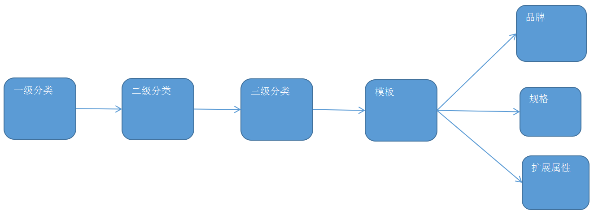
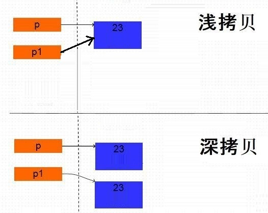

# 1. 录入商品分类和模板ID



页面加载后显示一级分类

选择一级分类,级联出二级分类

选择二级分类,级联出三级分类

选择三级分类,级联出模板ID

## 1.1 一级分类显示

* 页面

```html
<body ng-app="pinyougou" ng-controller="goodsController" ng-init="selectItemCat1List()">
	<select 
            ng-model="entity.goods.category1Id"  							<!--绑定变量-->
            ng-options="item.id as item.name for item in itemCat1List" >	<!--遍历数据-->
	</select>
</body>
```

* goodsController.js

```javascript
$scope.selectItemCat1List=function(){
	itemCatService.findByParentId(0).success(
		function(response){
			$scope.itemCat1List=response;		
		}
	);
}
```

* itemCatService.js

```javascript
this.findByParentId=function(parentId){
	return $http.get('../itemCat/findByParentId.do?parentId='+parentId);
}
```

* ItemCatController

```java
@RequestMapping("/findByParentId")
public List<TbItemCat> findByParentId(Long parentId){
	return itemCatService.findByParentId(parentId);
}
```

* ItemCatServiceImpl

```java
public List<TbItemCat> findByParentId(Long parentId) {
	TbItemCatExample example=new TbItemCatExample();
	Criteria criteria = example.createCriteria();
	criteria.andParentIdEqualTo(parentId);
	return itemCatMapper.selectByExample(example);
}
```

## 1.2 二级分类

* goodsController.js

```javascript
$scope.$watch('entity.goods.category1Id',function(newValue,oldValue){
	itemCatService.findByParentId(newValue).success(
			function(response){
				$scope.itemCat2List=response;			
			}
	);
});
```

* 页面

```html
<select ng-model="entity.goods.category2Id"  							<!--绑定变量-->  
        ng-options="item.id as item.name for item in itemCat2List">	    <!--遍历数据-->
</select>
```
## 1.3 三级分类

* goodsController.js

```javascript
$scope.$watch('entity.goods.category2Id',function(newValue,oldValue){
	itemCatService.findByParentId(newValue).success(
			function(response){
				$scope.itemCat3List=response;			
			}
	);
});
```
* 页面

```html
<select 
        ng-model="entity.goods.category3Id"   							<!--绑定变量--> 
        ng-options="item.id as item.name for item in itemCat3List">		<!--遍历数据-->
</select>
```

## 1.4 显示模板ID

选择三级分类,级联显示出模板ID

* 页面

```html
<!--三级分类-->
<select 
        ng-model="entity.goods.category3Id"   							<!--绑定变量--> 
        ng-options="item.id as item.name for item in itemCat3List">		<!--遍历数据-->
</select>
<!--模板ID-->
{{entity.goods.typeTemplateId}}
```

* goodsController.js

```javascript
$scope.$watch('entity.goods.category3Id',function(newValue,oldValue){
	itemCatService.findOne(newValue).success(
		function(response){
			$scope.entity.goods.typeTemplateId=response.typeId;
		}
	);		
});
```

* TypeTemplateController

```java
@RequestMapping("/findOne")
public TbTypeTemplate findOne(Long id){
	return typeTemplateService.findOne(id);		
}
```

* TypeTemplateServiceImpl

```java
public TbTypeTemplate findOne(Long id){
	return typeTemplateMapper.selectByPrimaryKey(id);
}
```

# 2. 录入商品品牌

监控模板ID变化后,根据模板ID查询其对应的品牌信息

* 页面

```html
<select 
        ng-model="entity.goods.brandId"  
        ng-options="brand.id as brand.text for brand in typeTemplate.brandIds">
</select>
```

* goodsController.js

```javascript
$scope.$watch('entity.goods.typeTemplateId',function(newValue,oldValue){
	typeTemplateService.findOne(newValue).success(
		function(response){
            //模板对象
			$scope.typeTemplate=response;
            //品牌列表
			$scope.typeTemplate.brandIds= JSON.parse($scope.typeTemplate.brandIds);
		}
	);
});
```

# 3. 录入扩展属性

监控模板ID变化后,根据模板ID查询其对应的扩展属性

* 页面

```html
<div ng-repeat="item in entity.goodsDesc.customAttributeItems">
    <div class="col-md-2 title">{{item.text}}</div>
    <input placeholder="{{item.text}}" ng-model="item.value">	 
</div>       							
```

* goodsController.js

```javascript
$scope.$watch('entity.goods.typeTemplateId',function(newValue,oldValue){
	typeTemplateService.findOne(newValue).success(
		function(response){
            //模板对象 	
			$scope.typeTemplate=response;	
            //品牌列表
			$scope.typeTemplate.brandIds= JSON.parse($scope.typeTemplate.brandIds);
			//扩展属性列表
			$scope.entity.goodsDesc.customAttributeItems=
                JSON.parse($scope.typeTemplate.customAttributeItems);
			}
		);
});
```

# 4. 录入商品规格

监控模板ID变化后,根据模板查询其对应的规格信息,需要封装每种规格的规格选项

## 4.1 显示规格

* 页面

```html
<div ng-repeat="pojo in specList">
    <div>{{pojo.text}}</div>
    <span ng-repeat="option in pojo.options">
         {{option.optionName}}
    </span>
</div>
```

* goodsController.js

```javascript
$scope.$watch('entity.goods.typeTemplateId',function(newValue,oldValue){
	//读取品牌和扩展属性
    typeTemplateService.findOne(newValue).success(
		function(response){
            //模板对象 		
			$scope.typeTemplate=response;
            //品牌列表
			$scope.typeTemplate.brandIds= JSON.parse($scope.typeTemplate.brandIds);
			//扩展属性
			$scope.entity.goodsDesc.customAttributeItems
                =JSON.parse($scope.typeTemplate.customAttributeItems);
		}
	);
	//读取规格
	typeTemplateService.findSpecList(newValue).success(
		function(response){
			$scope.specList=response;
		}
	);
});
```

* typeTemplateService.js

```javascript
this.findSpecList=function(id){
	return $http.get('../typeTemplate/findSpecList.do?id='+id);
}
```

* TypeTemplateController

```java
@RequestMapping("/findSpecList")
public List<Map> findSpecList(Long id){
	return typeTemplateService.findSpecList(id);
}
```

* TypeTemplateServiceImpl

```java
public List<Map> findSpecList(Long id) {
	//查询模板
	TbTypeTemplate typeTemplate = typeTemplateMapper.selectByPrimaryKey(id);
    //将json数组转换为List集合
	List<Map> list = JSON.parseArray(typeTemplate.getSpecIds(), Map.class);
    //遍历规格
	for(Map map:list){
		//查询规格选项列表
		TbSpecificationOptionExample example=new TbSpecificationOptionExample();
		TbSpecificationOptionExample.Criteria criteria = example.createCriteria();
		criteria.andSpecIdEqualTo( new Long( (Integer)map.get("id") ) );
		List<TbSpecificationOption> options = specificationOptionMapper.selectByExample(example);
		//封装规格属性
        map.put("options", options);
	}
	return list;
}
```

## 4.2 记录选择规格

### 4.2.1 选择规格的数据格式

```json
[
    {
        "attributeName": "网络制式",
        "attributeValue": [
            "移动4G"
        ]
    },
    {
        "attributeName": "屏幕尺寸",
        "attributeValue": [
            "5.5寸",
            "4.5寸"
        ]
    }
]
```

### 4.2.2 思路分析

```
1. 定义规格数组
2. 勾选规格的checkbox框时,传递当前规格名称和对应选项
3. 在规格数组中判断当前规格是否存在
   3.1 不存在:封装当前规格名称和选项,并添加到规格数组中
   3.2 存在
   	3.2.1 判断当前checkbox状态
   		 3.2.1.1 选中:将规格选项添加到当前规格的选项数组中
   		 3.2.1.2 取消选中:将规格选项从当前规格的选项数组中移除
   		 				 判断如果所有的规格选项均被移除,则删除当前规格对象
```

### 4.2.3 编码实现

* 页面

```html
<div ng-repeat="pojo in specList">
    <div>{{pojo.text}}</div>
    <span ng-repeat="option in pojo.options">
        <input type="checkbox" 
               ng-click="updateSpecAttribute($event,pojo.text,option.optionName)" >
         {{option.optionName}}
    </span>
</div>
```

* baseController.js

```javascript
//在list集合中根据某key的值查询对象
//eg:[{"attributeName":"网络制式","attributeValue":["移动3G","移动4G"]},{...}]
$scope.searchObjectByKey=function(list,key,keyValue){
    for(var i=0;i<list.length;i++){
        if(list[i][key]==keyValue){
            return list[i];
        }
    }
    return null;
}
```

* goodsController.js

```javascript
$scope.updateSpecAttribute=function($event,name,value){
    //查询entity是否存在点击的规格	
    //object={"attributeName":"网络制式","attributeValue":["移动3G","移动4G"]}
	var object= $scope.searchObjectByKey(
        			$scope.entity.goodsDesc.specificationItems,
        			'attributeName',
        			name
    			);
    
	if(object!=null){ //规格存在	
		if($event.target.checked ){		//勾选状态
			object.attributeValue.push(value);		
		}else{							//取消勾选状态
            //移除选项
			object.attributeValue.splice( object.attributeValue.indexOf(value) ,1);
			//如果选项都取消了，将此规格从entity中移除
			if(object.attributeValue.length==0){
				$scope.entity.goodsDesc.specificationItems.splice(
						$scope.entity.goodsDesc.specificationItems.indexOf(object),1);
			}
		}
	}else{			//规格不存在
		$scope.entity.goodsDesc.specificationItems.push(
            {"attributeName":name,"attributeValue":[value]}
        );
	}
}
```

# 5. 录入SKU信息

## 5.1 技术分析

通过克隆对象的方式,根据勾选的规格动态生成SKU对象

```
浅克隆:对象不克隆,创建变量,指向同一个对象.
深克隆:对象克隆,创建变量指向新的对象.
```



## 5.2 思路分析

构建SKU数据

```
1. 在entity中初始化sku集合
2. 获得所有勾选的规格集合
3. 遍历规格集合
	3.1 获得每个规格名称和选项数组
 	3.2 定义新的sku集合
 	3.3 遍历entity中sku集合
 		3.3.1 获得每个oldSku对象
 		3.3.3 遍历当前规格选项数组
 			3.3.3.1 克隆原sku对象，得到newSKU
 			3.3.3.1 规格和选项添加到newSku对象的spec中
 			3.3.3.1 将新的sku对象添加到sku集合中
 		3.3.4 将entity中的sku集合替换为新的sku集合
```

## 5.3 代码实现

### 5.3.1 构建SKU集合

```html
<div ng-repeat="pojo in specList">
    <div>{{pojo.text}}</div>
    <span ng-repeat="option in pojo.options">
        <input type="checkbox" 
               ng-click="updateSpecAttribute($event,pojo.text,option.optionName);createItemList()" >
         {{option.optionName}}
    </span>
</div>
```

* goodsController.js

```javascript
$scope.createItemList=function(){
	//声明原始SKU集合
	$scope.entity.itemList=[{spec:{},price:0,num:99999,status:'0',isDefault:'0'}];
	//获得勾选的规格列表
	var specList = $scope.entity.goodsDesc.specificationItems;
	//遍历规格列表
	for(var i=0;i<specList.length;i++){		//循环规格集合
		//规格名称
		var specName=specList[i].attributeName;
		//规格选项
		var specAttributeValue=specList[i].attributeValue;
		//新的SKU列表
        var newList=[];
		//遍历SKU列表	  [{spec:{},price:0,num:99999,status:'0',isDefault:'0'}]
		for(var j=0;j<$scope.entity.itemList.length;j++){	//循环SKU集合
            //原sku对象	{spec:{},price:0,num:99999,status:'0',isDefault:'0'}
            var oldSKU=$scope.entity.itemList[j];	
			//遍历规格属性
			for(var z=0;z<specAttributeValue.length;z++){	//循环规格中规格选项集合
                //克隆SKU对象	{spec:{网络：3G},price:0,num:99999,status:'0',isDefault:'0'}
                var newSKU=JSON.parse(JSON.stringify(oldSKU));
                //增加规格信息
                newSKU.spec[specName]=specAttributeValue[z];
                newList.push(newSKU);
			}
		}
        $scope.entity.itemList=newList;
	}
}
```

### 5.3.2 显示SKU集合

```html
<td ng-repeat="item in entity.goodsDesc.specificationItems">
    {{item.attributeName}}
</td>

<tr ng-repeat="pojo in entity.itemList">					                           
      <td ng-repeat="item in entity.goodsDesc.specificationItems">
      	{{pojo.spec[item.attributeName]}}
      </td>
		
      <td>
     		<input  ng-model="pojo.price" placeholder="价格">
      </td>
      <td>
      		<input  ng-model="pojo.num" placeholder="库存数量">
      </td>
      <td>
       		<input type="checkbox"  ng-model="pojo.status" ng-true-value="1" ng-false-value="0" >
      </td>
      <td>
          	<input type="checkbox" ng-model="pojo.isDefault" ng-true-value="1" ng-false-
                   value="0">
      </td>
</tr>
```

### 5.3.3 保存SKU

``` java
/**
 * 录入商品
 */
public void add(Goods goods) {
	
    //SPU
	goods.getGoods().setAuditStatus("0");//状态：未审核
	goodsMapper.insert(goods.getGoods());//插入商品基本信息
	
    //商品描述
	goods.getGoodsDesc().setGoodsId(goods.getGoods().getId());//将商品基本表的ID给商品扩展表
	goodsDescMapper.insert(goods.getGoodsDesc());//插入商品扩展表数据
	
    //SKU列表
    for(TbItem item:   goods.getItemList()){
		//构建标题  SPU名称+ 规格选项值
		String title=goods.getGoods().getGoodsName();//SPU名称
		Map<String,Object> map=  JSON.parseObject(item.getSpec());
		for(String key:map.keySet()) {
			title+=" "+map.get(key);
		}
		item.setTitle(title);
		setItemValues(item,goods);		
		itemMapper.insert(item);
	}
}

/**
 * 封装SKU数据
 * @param item
 * @param goods
 */
private void setItemValues(TbItem item,Goods goods){
	//商品分类 
	item.setCategoryid(goods.getGoods().getCategory3Id());//三级分类ID
	item.setCreateTime(new Date());//创建日期
	item.setUpdateTime(new Date());//更新日期 
	
	item.setGoodsId(goods.getGoods().getId());//商品ID
	item.setSellerId(goods.getGoods().getSellerId());//商家ID
	
	//分类名称			
	TbItemCat itemCat = itemCatMapper.selectByPrimaryKey(goods.getGoods().getCategory3Id());
	item.setCategory(itemCat.getName());
	//品牌名称
	TbBrand brand = brandMapper.selectByPrimaryKey(goods.getGoods().getBrandId());
	item.setBrand(brand.getName());
	//商家名称(店铺名称)			
	TbSeller seller = sellerMapper.selectByPrimaryKey(goods.getGoods().getSellerId());
	item.setSeller(seller.getNickName());
	
	//图片
	List<Map> imageList = JSON.parseArray( goods.getGoodsDesc().getItemImages(), Map.class) ;
	if(imageList.size()>0){
		item.setImage( (String)imageList.get(0).get("url"));
	}
	
}
```

# 6. 是否启用规格

启用规格:允许用户根据规格动态生成SKU对象

不启动规格:后台自动生成一个默认的SKU对象

* 页面

```html
<input type="checkbox" ng-model="entity.goods.isEnableSpec" ng-true-value="1" ng-false-value="0">

<div ng-if="entity.goods.isEnableSpec==1">
    规格...
    sku...
</div>
```

* 后台

```java
public void add(Goods goods) {
	
	goods.getGoods().setAuditStatus("0");//状态：未审核
	goodsMapper.insert(goods.getGoods());//插入商品基本信息
	
	goods.getGoodsDesc().setGoodsId(goods.getGoods().getId());//将商品基本表的ID给商品扩展表
	goodsDescMapper.insert(goods.getGoodsDesc());//插入商品扩展表数据
	
	if("1".equals(goods.getGoods().getIsEnableSpec())){
		for(TbItem item:   goods.getItemList()){
			//构建标题  SPU名称+ 规格选项值
			String title=goods.getGoods().getGoodsName();//SPU名称
			Map<String,Object> map=  JSON.parseObject(item.getSpec());
			for(String key:map.keySet()) {
				title+=" "+map.get(key);
			}
			item.setTitle(title);
			
			setItemValues(item,goods);
			
			itemMapper.insert(item);
		}
	}else{//没有启用规格			
		
		TbItem item=new TbItem();
		item.setTitle(goods.getGoods().getGoodsName());//标题
		item.setPrice(goods.getGoods().getPrice());//价格
		item.setNum(99999);//库存数量
		item.setStatus("1");//状态
		item.setIsDefault("1");//默认
		item.setSpec("{}");//规格
		
		setItemValues(item,goods);
		
		itemMapper.insert(item);
	}
}
```

