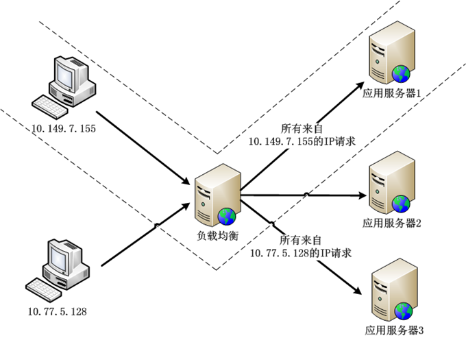
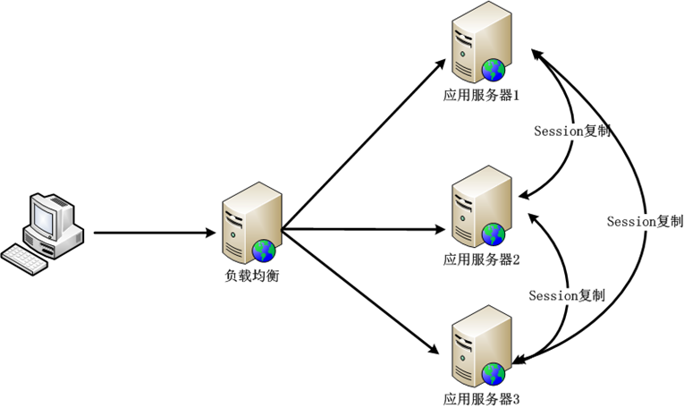
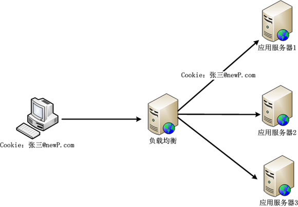
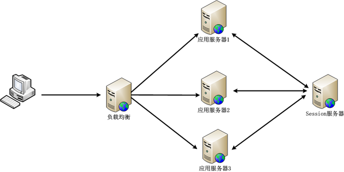
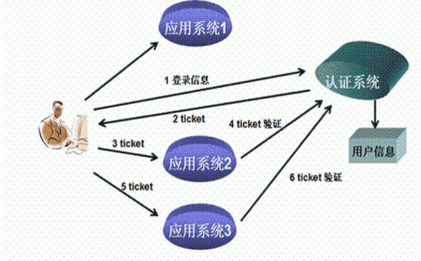
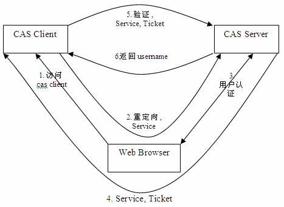

# 1. 了解单点登录SSO

## 1.1 问题

分布式系统中,登录状态(session)不能共享的问题

## 1.2 解决方案 

分布式系统下的session共享

### 1.2.1 粘滞session



### 1.2.2 session复制



### 1.2.3 客户端保存session数据



### 1.2.4 session的集中式管理



## 1.3 SSO原理

将登录的模块使用第三方的单点登录服务器（例如：CAS）完成，每个应用系统都与CAS进行对接。由CAS系统负责登录以及身份的校验。

**作用：**

1. 登录功能
2. 票据验证功能



## 1.4 CAS实现细节



1. 访问服务：SSO 客户端发送请求访问应用系统提供的服务资源。
2. 定向认证：SSO 客户端会重定向用户请求到 SSO 服务器。
3. 用户认证：用户身份认证。
4. 发放票据：SSO 服务器会产生一个随机的 Service Ticket
5. 验证票据：SSO 服务器验证票据 Service Ticket 的合法性，验证通过后，允许客户端访问
   服务。
6. 传输用户信息：SSO 服务器验证票据通过后，传输用户认证结果信息给客户端。

# 2. 搭建CAS服务器

## 2.1 部署cas

将cas的war包发布在Tomcat

## 2.2 配置cas

### 2.2.1 修改服务访问端口号

* tomcat/conf/server.xml

```xml
<Connector port="9100" protocol="HTTP/1.1"
           connectionTimeout="20000"
           redirectPort="8443" />
```

* cas/WEB-INF/cas.properties

```xml
server.name=http://localhost:9100
```

### 2.2.2 去除 https

*  cas/WEB-INF/deployerConfigContext.xml

```xml
<bean id="proxyAuthenticationHandler"      		class="org.jasig.cas.authentication.handler.support.HttpBasedServiceCredentialsAuthenticationHandler" p:httpClient-ref="httpClient" p:requireSecure="false"/>
```

*  cas/WEB-INF/spring-configuration/ticketGrantingTicketCookieGenerator.xml

```xml
<bean  id="ticketGrantingTicketCookieGenerator"
class="org.jasig.cas.web.support.CookieRetrievingCookieGenerator"
p:cookieSecure="true"
p:cookieMaxAge="-1"
p:cookieName="CASTGC"
p:cookiePath="/cas" />
```

*  cas/WEB-INF/spring-configuration/warnCookieGenerator.xml

```xml
<bean  id="warnCookieGenerator"
class="org.jasig.cas.web.support.CookieRetrievingCookieGenerator"
p:cookieSecure="true"
p:cookieMaxAge="-1"
p:cookieName="CASPRIVACY"
p:cookiePath="/cas" />
```

### 2.2.3 对接数据库

```xml
<bean id="authenticationManager" class="org.jasig.cas.authentication.PolicyBasedAuthenticationManager">
    <constructor-arg>
        <map>
            <entry key-ref="proxyAuthenticationHandler" value-ref="proxyPrincipalResolver" />
			<entry key-ref="dbAuthHandler" value-ref="primaryPrincipalResolver"/>
        </map>
    </constructor-arg>
    <property name="authenticationPolicy">
        <bean class="org.jasig.cas.authentication.AnyAuthenticationPolicy" />
    </property>
</bean>


<bean id="dbAuthHandler"
		class="org.jasig.cas.adaptors.jdbc.QueryDatabaseAuthenticationHandler"
		p:dataSource-ref="dataSource"
		p:sql="select password from tb_user where username = ?"
		p:passwordEncoder-ref="passwordEncoder"/>

<bean id="dataSource" class="com.mchange.v2.c3p0.ComboPooledDataSource"
		p:driverClass="com.mysql.jdbc.Driver"
		p:jdbcUrl="jdbc:mysql://127.0.0.1:3306/pinyougoudb?characterEncoding=utf8"
		p:user="root"
		p:password="root" />
		
<bean id="passwordEncoder"
		class="org.jasig.cas.authentication.handler.DefaultPasswordEncoder"
		c:encodingAlgorithm="MD5"
		p:characterEncoding="UTF-8" />
```

# 3. CAS入门案例

## 3.1 客户端依赖

```xml
<!-- cas -->  
<dependency>  
    <groupId>org.jasig.cas.client</groupId>  
    <artifactId>cas-client-core</artifactId>  
    <version>3.3.3</version>  
</dependency>  		

<dependency>
	<groupId>javax.servlet</groupId>
	<artifactId>servlet-api</artifactId>
	<version>2.5</version>  
	<scope>provided</scope>
</dependency>
```

## 3.2 客户端配置

配置包括4个方面

	1.登录
	2.获得登录名
	3.票据验证
	4.登出有关
```xml
<!-- ======================== 单点登录开始 ======================== -->
<!-- 用于单点退出，该过滤器用于实现单点登出功能，可选配置 -->  
<listener>  
    <listener-class>org.jasig.cas.client.session.SingleSignOutHttpSessionListener</listener-class>  
</listener>  
<!-- 该过滤器用于实现单点登出功能，可选配置。 -->  
<filter>  
    <filter-name>CAS Single Sign Out Filter</filter-name>  
    <filter-class>org.jasig.cas.client.session.SingleSignOutFilter</filter-class>  
</filter>  
<filter-mapping>  
    <filter-name>CAS Single Sign Out Filter</filter-name>  
    <url-pattern>/*</url-pattern>  
</filter-mapping>  
<!-- 该过滤器负责用户的认证工作，必须启用它 -->  
<filter>  
    <filter-name>CASFilter</filter-name>  
    <filter-class>org.jasig.cas.client.authentication.AuthenticationFilter</filter-class>  
    <init-param>  
        <param-name>casServerLoginUrl</param-name>  
        <param-value>http://localhost:9100/cas/login</param-value>  
        <!--这里的server是服务端的IP -->  
    </init-param>  
    <init-param>  
        <param-name>serverName</param-name>  
        <param-value>http://localhost:9001</param-value>
    </init-param>  
</filter>  
<filter-mapping>  
    <filter-name>CASFilter</filter-name>  
    <url-pattern>/*</url-pattern>  
</filter-mapping>  

<!-- 该过滤器负责对Ticket的校验工作，必须启用它 -->  
<filter>  
    <filter-name>CAS Validation Filter</filter-name>  
    <filter-class>  
        org.jasig.cas.client.validation.Cas20ProxyReceivingTicketValidationFilter</filter-class>  
    <init-param>  
        <param-name>casServerUrlPrefix</param-name>  
        <param-value>http://localhost:9100/cas</param-value>  
    </init-param>  
    <init-param>  
        <param-name>serverName</param-name>  
        <param-value>http://localhost:9001</param-value>
    </init-param>  
</filter>  
<filter-mapping>  
    <filter-name>CAS Validation Filter</filter-name>  
    <url-pattern>/*</url-pattern>  
</filter-mapping>  

<!-- 该过滤器负责实现HttpServletRequest请求的包裹， 比如允许开发者通过HttpServletRequest的getRemoteUser()方法获得SSO登录用户的登录名，可选配置。 -->  
<filter>  
    <filter-name>CAS HttpServletRequest Wrapper Filter</filter-name>  
    <filter-class>  
        org.jasig.cas.client.util.HttpServletRequestWrapperFilter</filter-class>  
</filter>  
<filter-mapping>  
    <filter-name>CAS HttpServletRequest Wrapper Filter</filter-name>  
    <url-pattern>/*</url-pattern>  
</filter-mapping>  

<!-- 该过滤器使得开发者可以通过org.jasig.cas.client.util.AssertionHolder来获取用户的登录名。 比如AssertionHolder.getAssertion().getPrincipal().getName()。 -->  
<filter>
    <filter-name>CAS Assertion Thread Local Filter</filter-name>  
    <filter-class>org.jasig.cas.client.util.AssertionThreadLocalFilter</filter-class>  
</filter>  
<filter-mapping>  
    <filter-name>CAS Assertion Thread Local Filter</filter-name>  
    <url-pattern>/*</url-pattern>  
</filter-mapping>

<!-- ======================== 单点登录结束 ======================== -->  
```

# 4. 更换CAS登录页面

## 4.1 更换登录页面

```jsp
<form:form class="sui-form" method="post" id="fm1" commandName="${commandName}" htmlEscape="true">
									
  <form:input id="username" tabindex="1" accesskey="${userNameAccessKey}" path="username" autocomplete="off" 	htmlEscape="true" placeholder="邮箱/用户名/手机号" class="span2 input-xfat" />
  
<form:password id="password" tabindex="2" path="password" accesskey="${passwordAccessKey}" 
               htmlEscape="true" autocomplete="off" placeholder="请输入密码" class="span2 input-xfat" />
  
	<input type="hidden" name="lt" value="${loginTicket}" />
	<input type="hidden" name="execution" value="${flowExecutionKey}" />
	<input type="hidden" name="_eventId" value="submit" />
	<input class="sui-btn btn-block btn-xlarge btn-danger" accesskey="l" value="登陆" type="submit" />
	<form:errors path="*" style="color:red" id="msg" cssClass="errors" element="div" 
                 htmlEscape="false" />
</form:form>
```

## 4.2 错误提示

* cas\WEB-INF\classes\ messages_zh_CN.properties

```properties
# 用户名不存在时的错误
authenticationFailure.AccountNotFoundException=\u7528\u6237\u4E0D\u5B58\u5728.
# 用户名不存在时的错误
authenticationFailure.FailedLoginException=\u5BC6\u7801\u9519\u8BEF.
```

## 4.3 设置中文简体为默认语言

* cas-servlet.xml

```xml
<bean id="localeResolver" class="org.springframework.web.servlet.i18n.CookieLocaleResolver" p:defaultLocale="zh_CN" />
```

# 5. CAS与SpringSecurity集成

## 5.1 集成思路

* Spring Security:负责权限控制
* cas:负责单点登录

## 5.2 配置

完成以下3个方面的事情

```
1.登录入口
2.认证和票据验证
3.登出有关
```

* web.xml

```xml
<filter>
    <filter-name>springSecurityFilterChain</filter-name>
    <filter-class>org.springframework.web.filter.DelegatingFilterProxy</filter-class>
</filter>
<filter-mapping>
    <filter-name>springSecurityFilterChain</filter-name>
    <url-pattern>/*</url-pattern>
</filter-mapping>
```

* spring配置文件

```xml
<!--登录的入口-->
<http use-expressions="false" entry-point-ref="casProcessingFilterEntryPoint">  
    <intercept-url pattern="/**" access="ROLE_USER"/>   
    <csrf disabled="true"/>         
    <custom-filter ref="casAuthenticationFilter"  position="CAS_FILTER" />      
    <custom-filter ref="requestSingleLogoutFilter" before="LOGOUT_FILTER"/>  
    <custom-filter ref="singleLogoutFilter" before="CAS_FILTER"/>  
</http>

<beans:bean id="casProcessingFilterEntryPoint"
            class="org.springframework.security.cas.web.CasAuthenticationEntryPoint">
    <beans:property name="loginUrl" value="http://localhost:9100/cas/login"/>  
    <beans:property name="serviceProperties" ref="serviceProperties"/>  
</beans:bean>      
<beans:bean id="serviceProperties" class="org.springframework.security.cas.ServiceProperties">  
    <!--service 配置自身工程的根地址+/login/cas   -->  
    <beans:property name="service" value="http://localhost:9003/login/cas"/>
</beans:bean>

<!--票据认证-->
    
<!-- 认证过滤器 开始 -->
<beans:bean id="casAuthenticationFilter" class="org.springframework.security.cas.web.CasAuthenticationFilter">  
    <beans:property name="authenticationManager" ref="authenticationManager"/>  
</beans:bean>  

	<!-- 认证管理器 -->
<authentication-manager alias="authenticationManager">
	<authentication-provider  ref="casAuthenticationProvider">
	</authentication-provider>
</authentication-manager>

	<!-- 认证提供者 -->
<beans:bean id="casAuthenticationProvider"     class="org.springframework.security.cas.authentication.CasAuthenticationProvider">  
        <beans:property name="authenticationUserDetailsService">  
            <beans:bean class="org.springframework.security.core.userdetails.UserDetailsByNameServiceWrapper">  
            <beans:constructor-arg ref="userDetailsService" />  
        </beans:bean>  
    </beans:property>  
    <beans:property name="serviceProperties" ref="serviceProperties"/>  
    <!-- ticketValidator 为票据验证器 -->
    <beans:property name="ticketValidator">
        <beans:bean class="org.jasig.cas.client.validation.Cas20ServiceTicketValidator">
            <beans:constructor-arg index="0" value="http://localhost:9100/cas"/>
        </beans:bean>
    </beans:property>  
    <beans:property name="key" value="an_id_for_this_auth_provider_only"/> 
</beans:bean>        
<!-- 认证类 -->
<beans:bean id="userDetailsService" class="cn.itcast.demo.service.UserDetailServiceImpl"/>
```

## 5.3 认证类

作用是给用户赋权

```java
//认证类
public class UserDetailServiceImpl implements UserDetailsService {

	@Override
	public UserDetails loadUserByUsername(String username) throws UsernameNotFoundException {
		System.out.println("经过认证类:"+username);
		
		List<GrantedAuthority> authorities=new ArrayList();
		authorities.add(new SimpleGrantedAuthority("ROLE_USER"));
		return new User(username,"",authorities);
	}

}
```

## 5.4 单点登出

```xml
<!-- 单点登出  开始  -->     
<beans:bean id="singleLogoutFilter" class="org.jasig.cas.client.session.SingleSignOutFilter"/>    
<!-- 经过此配置，当用户在地址栏输入本地工程 /logout/cas  -->      
<beans:bean id="requestSingleLogoutFilter" class="org.springframework.security.web.authentication.logout.LogoutFilter">  
	<beans:constructor-arg value="http://localhost:9100/cas/logout?service=http://localhost:9003/index2.html"/>  
    <beans:constructor-arg>  
        <beans:bean class="org.springframework.security.web.authentication.logout.SecurityContextLogoutHandler"/>  
        </beans:constructor-arg>  
        <beans:property name="filterProcessesUrl" value="/logout/cas"/>  
</beans:bean>  
<!-- 单点登出  结束 --> 
```

## 5.5 获得用户信息

```java
String name = SecurityContextHolder.getContext().getAuthentication().getName();
```

# 6. 品优购集成CAS

同上
