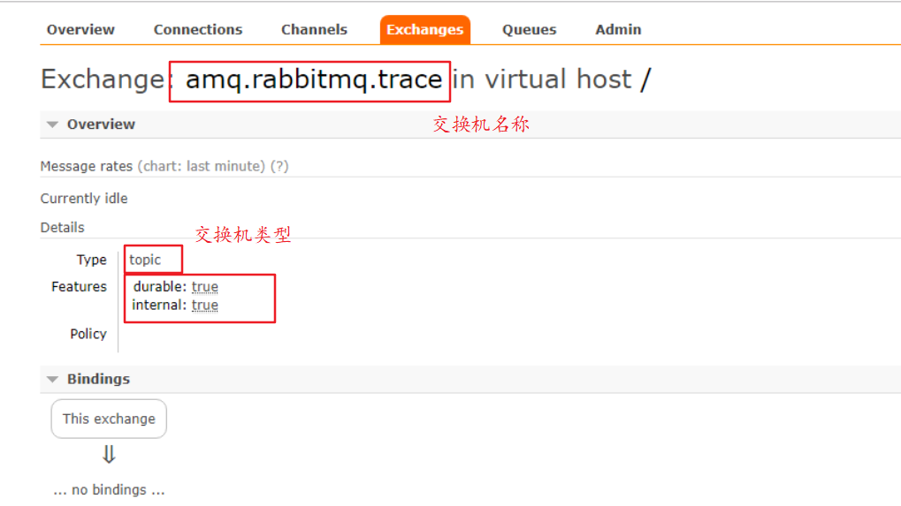

# 0. 学习目标

* 掌握RabbitMQ 高级特性
* 理解RabbitMQ 应用问题

* 能够搭建RabbitMQ 集群

# 1. RabbitMQ 高级特性

## 1.1 消息可靠性投递

在使用 RabbitMQ 的时候，作为消息发送方希望杜绝任何消息丢失或者投递失败场景。RabbitMQ 为我们提供了两种方式用来控制消息的投递可靠性模式。

* confirm 确认模式

* return  退回模式

rabbitmq 整个消息投递的路径为：

​	**producer ---> rabbitmq broker ---> exchange ---> queue ---> consumer**

* 消息从 producer 到 exchange 则会返回一个 confirmCallback 。

* 消息从 exchange 到 queue 投递失败则会返回一个 returnCallback 。

我们将利用这两个 callback 控制消息的可靠性投递

### 1.1.1 confirm确认模式代码实现

1. 创建maven工程，消息的生产者工程，项目模块名称：rabbitmq-producer-spring

2. 添加依赖

   ```xml
   <dependencies>
       <dependency>
           <groupId>org.springframework</groupId>
           <artifactId>spring-context</artifactId>
           <version>5.1.7.RELEASE</version>
       </dependency>
   
       <dependency>
           <groupId>org.springframework.amqp</groupId>
           <artifactId>spring-rabbit</artifactId>
           <version>2.1.8.RELEASE</version>
       </dependency>
       <dependency>
           <groupId>junit</groupId>
           <artifactId>junit</artifactId>
           <version>4.12</version>
       </dependency>
       <dependency>
           <groupId>org.springframework</groupId>
           <artifactId>spring-test</artifactId>
           <version>5.1.7.RELEASE</version>
       </dependency>
   </dependencies>
   
   <build>
       <plugins>
           <plugin>
               <groupId>org.apache.maven.plugins</groupId>
               <artifactId>maven-compiler-plugin</artifactId>
               <version>3.8.0</version>
               <configuration>
                   <source>1.8</source>
                   <target>1.8</target>
               </configuration>
           </plugin>
       </plugins>
   </build>
   ```

3. 在 resources 目录下创建 rabbitmq.properties 配置文件，添加链接RabbitMQ相关信息

   ```properties
   rabbitmq.host=172.16.98.133
   rabbitmq.port=5672
   rabbitmq.username=guest
   rabbitmq.password=guest
   rabbitmq.virtual-host=/
   ```

4. 在 resources 目录下创建 spring-rabbitmq-producer.xml 配置文件，添加以下配置

   ```xml
   <?xml version="1.0" encoding="UTF-8"?>
   <beans xmlns="http://www.springframework.org/schema/beans"
          xmlns:xsi="http://www.w3.org/2001/XMLSchema-instance"
          xmlns:context="http://www.springframework.org/schema/context"
          xmlns:rabbit="http://www.springframework.org/schema/rabbit"
          xsi:schemaLocation="http://www.springframework.org/schema/beans
                    http://www.springframework.org/schema/beans/spring-beans.xsd
                    http://www.springframework.org/schema/context
                    https://www.springframework.org/schema/context/spring-context.xsd
                    http://www.springframework.org/schema/rabbit
                    http://www.springframework.org/schema/rabbit/spring-rabbit.xsd">
       <!--加载配置文件-->
       <context:property-placeholder location="classpath:rabbitmq.properties"/>
   
       <!-- 定义rabbitmq connectionFactory  1. 设置  publisher-confirms="true" -->
       <rabbit:connection-factory id="connectionFactory" host="${rabbitmq.host}"
                                  port="${rabbitmq.port}"
                                  username="${rabbitmq.username}"
                                  password="${rabbitmq.password}"
                                  virtual-host="${rabbitmq.virtual-host}"
                                  
                                  publisher-confirms="true"
                                  />
       <!--定义管理交换机、队列-->
       <rabbit:admin connection-factory="connectionFactory"/>
   
       <!--定义rabbitTemplate对象操作可以在代码中方便发送消息-->
       <rabbit:template id="rabbitTemplate" connection-factory="connectionFactory"/>
   
       <!--2. 消息可靠性投递（生产端）-->
      <rabbit:queue id="test_queue_confirm" name="test_queue_confirm"></rabbit:queue>
       <rabbit:direct-exchange name="test_exchange_confirm">
           <rabbit:bindings>
               <rabbit:binding queue="test_queue_confirm" key="confirm">			               </rabbit:binding>
           </rabbit:bindings>
       </rabbit:direct-exchange>
       
   </beans>
   ```

5. 编写测试代码

   ``` java
   @RunWith(SpringJUnit4ClassRunner.class)
   @ContextConfiguration(locations = "classpath:spring-rabbitmq-producer.xml")
   public class ProducerTest {
   
       @Autowired
       private RabbitTemplate rabbitTemplate;
   
       /**
        * 确认模式：
        * 步骤：
        * 1. 确认模式开启：ConnectionFactory中开启publisher-confirms="true"
        * 2. 在rabbitTemplate定义ConfirmCallBack回调函数
        */
       @Test
       public void testConfirm() {
   
           //2. 定义回调 **
           rabbitTemplate.setConfirmCallback(new RabbitTemplate.ConfirmCallback() {
               /**
                *
                * @param correlationData 相关配置信息
                * @param ack   exchange交换机 是否成功收到了消息。true 成功，false代表失败
                * @param cause 失败原因
                */
               @Override
               public void confirm(CorrelationData correlationData, boolean ack, String cause) {
                   System.out.println("confirm方法被执行了....");
   
                   if (ack) {
                       //接收成功
                       System.out.println("接收成功消息" + cause);
                   } else {
                       //接收失败
                       System.out.println("接收失败消息" + cause);
                       //做一些处理，让消息再次发送。
                   }
               }
           });
   
           //3. 发送消息
           rabbitTemplate.convertAndSend("test_exchange_confirm111", "confirm", "message confirm....");
       }
   }
   ```

6. 测试结果

   

### 1.1.2 return退回模式代码实现

回退模式： 当消息发送给Exchange后，Exchange路由到Queue失败是 才会执行 ReturnCallBack，具体实现如下：

1. 在 spring-rabbitmq-producer.xml 配置文件，在 **rabbit:connection-factory**节点 添加配置：

   ```
   publisher-returns="true"
   ```

2. 编写测试方法

   ``` java
   /**
    * 步骤：
    * 1. 开启回退模式:publisher-returns="true"
    * 2. 设置ReturnCallBack
    * 3. 设置Exchange处理消息的模式：
    *  1. 如果消息没有路由到Queue，则丢弃消息（默认）
    *  2. 如果消息没有路由到Queue，返回给消息发送方ReturnCallBack
    */
   
   @Test
   public void testReturn() {
   
       //设置交换机处理失败消息的模式
       rabbitTemplate.setMandatory(true);
   
       //2.设置ReturnCallBack
       rabbitTemplate.setReturnCallback(new RabbitTemplate.ReturnCallback() {
           /**
            *
            * @param message   消息对象
            * @param replyCode 错误码
            * @param replyText 错误信息
            * @param exchange  交换机
            * @param routingKey 路由键
            */
           @Override
           public void returnedMessage(Message message, int replyCode, String replyText, String exchange, String routingKey) {
               System.out.println("return 执行了....");
   
               System.out.println(message);
               System.out.println(replyCode);
               System.out.println(replyText);
               System.out.println(exchange);
               System.out.println(routingKey);
   
               //处理
           }
       });
   
   
       //3. 发送消息   
       rabbitTemplate.convertAndSend("test_exchange_confirm", "confirm", "message confirm....");
   }
   ```

   设置 routingKey 为一个不符合规则的key，观察控制台打印结果。

### 1.1.3 小结

对于确认模式：

* 设置ConnectionFactory的publisher-confirms="true" 开启 确认模式。

* 使用rabbitTemplate.setConfirmCallback设置回调函数。当消息发送到exchange后回调confirm方法。在方法中判断ack，如果为true，则发送成功，如果为false，则发送失败，需要处理。

对于退回模式

* 设置ConnectionFactory的publisher-returns="true" 开启 退回模式。

* 使用rabbitTemplate.setReturnCallback设置退回函数，当消息从exchange路由到queue失败后，如果设置了rabbitTemplate.setMandatory(true)参数，则会将消息退回给producer。并执行回调函数returnedMessage。

> 在RabbitMQ中也提供了事务机制，但是性能较差，此处不做讲解。
>
> 使用channel列方法，完成事务控制：
>
> txSelect(), 用于将当前channel设置成transaction模式
>
> txCommit()，用于提交事务
>
> txRollback(),用于回滚事务

## 1.2 Consumer ACK

ack指 **Acknowledge**，确认。 表示消费端收到消息后的确认方式。

有三种确认方式：

• 自动确认：acknowledge="**none**"

• 手动确认：acknowledge="**manual**"

• 根据异常情况确认：acknowledge="**auto**"，（这种方式使用麻烦，不作讲解）

其中自动确认是指，当消息一旦被Consumer接收到，则自动确认收到，并将相应 message 从 RabbitMQ 的消息缓存中移除。但是在实际业务处理中，很可能消息接收到，业务处理出现异常，那么该消息就会丢失。

如果设置了手动确认方式，则需要在业务处理成功后，调用channel.basicAck()，手动签收，如果出现异常，则调用channel.basicNack()方法，让其自动重新发送消息。

### 1.2.1 代码实现

1. 创建maven工程，消息的消费者工程，项目模块名称：rabbitmq-consumer-spring

2. 添加依赖

   ```xml
   <dependencies>
       <dependency>
           <groupId>org.springframework</groupId>
           <artifactId>spring-context</artifactId>
           <version>5.1.7.RELEASE</version>
       </dependency>
       <dependency>
           <groupId>org.springframework.amqp</groupId>
           <artifactId>spring-rabbit</artifactId>
           <version>2.1.8.RELEASE</version>
       </dependency>
       <dependency>
           <groupId>junit</groupId>
           <artifactId>junit</artifactId>
           <version>4.12</version>
       </dependency>
       <dependency>
           <groupId>org.springframework</groupId>
           <artifactId>spring-test</artifactId>
           <version>5.1.7.RELEASE</version>
       </dependency>
   </dependencies>
   
   <build>
       <plugins>
           <plugin>
               <groupId>org.apache.maven.plugins</groupId>
               <artifactId>maven-compiler-plugin</artifactId>
               <version>3.8.0</version>
               <configuration>
                   <source>1.8</source>
                   <target>1.8</target>
               </configuration>
           </plugin>
       </plugins>
   </build>
   ```
   
3. 在 resources 目录下创建 rabbitmq.properties 配置文件，添加链接RabbitMQ相关信息

   ```properties
   rabbitmq.host=172.16.98.133
   rabbitmq.port=5672
   rabbitmq.username=guest
   rabbitmq.password=guest
   rabbitmq.virtual-host=/
   ```

4. 在 resources 目录下创建 spring-rabbitmq-consumer.xml 配置文件，添加以下配置

   ```xml
   <?xml version="1.0" encoding="UTF-8"?>
   <beans xmlns="http://www.springframework.org/schema/beans"
          xmlns:xsi="http://www.w3.org/2001/XMLSchema-instance"
          xmlns:context="http://www.springframework.org/schema/context"
          xmlns:rabbit="http://www.springframework.org/schema/rabbit"
          xsi:schemaLocation="http://www.springframework.org/schema/beans
                http://www.springframework.org/schema/beans/spring-beans.xsd
                http://www.springframework.org/schema/context
                https://www.springframework.org/schema/context/spring-context.xsd
                http://www.springframework.org/schema/rabbit
                http://www.springframework.org/schema/rabbit/spring-rabbit.xsd">
       <!--加载配置文件-->
       <context:property-placeholder location="classpath:rabbitmq.properties"/>
   
       <!-- 定义rabbitmq connectionFactory -->
       <rabbit:connection-factory id="connectionFactory" host="${rabbitmq.host}"
                                  port="${rabbitmq.port}"
                                  username="${rabbitmq.username}"
                                  password="${rabbitmq.password}"
                                  virtual-host="${rabbitmq.virtual-host}"/>
   
   
       <context:component-scan base-package="com.itheima.listener" />
   
       <!--定义监听器容器  添加  acknowledge="manual" 手动-->
       <rabbit:listener-container connection-factory="connectionFactory" acknowledge="manual" >
           <rabbit:listener ref="ackListener" queue-names="test_queue_confirm">	
           </rabbit:listener>
       </rabbit:listener-container>
   
   </beans>
   ```

5. 编写ackListener 监听类实现ChannelAwareMessageListener接口

   ```java
   package com.itheima.listener;
   
   import com.rabbitmq.client.Channel;
   import org.springframework.amqp.core.Message;
   import org.springframework.amqp.core.MessageListener;
   import org.springframework.amqp.rabbit.listener.api.ChannelAwareMessageListener;
   import org.springframework.stereotype.Component;
   
   import java.io.IOException;
   
   /**
    * Consumer ACK机制：
    *  1. 设置手动签收。acknowledge="manual"
    *  2. 让监听器类实现ChannelAwareMessageListener接口
    *  3. 如果消息成功处理，则调用channel的 basicAck()签收
    *  4. 如果消息处理失败，则调用channel的basicNack()拒绝签收，broker重新发送给consumer
    */
   @Component
   public class AckListener implements ChannelAwareMessageListener {
   
       @Override
       public void onMessage(Message message, Channel channel) throws Exception {
           long deliveryTag = message.getMessageProperties().getDeliveryTag();
   
           try {
               //1.接收转换消息
               System.out.println(new String(message.getBody()));
   
               //2. 处理业务逻辑
               System.out.println("处理业务逻辑...");
               int i = 3/0;//出现错误
               //3. 手动签收
               channel.basicAck(deliveryTag,true);
           } catch (Exception e) {
               //e.printStackTrace();
   
               //4.拒绝签收
               /*
               第三个参数：requeue：重回队列。如果设置为true，则消息重新回到queue，broker会重新发送该消息给消费端
                */
               channel.basicNack(deliveryTag,true,true);
               // 了解
               //channel.basicReject(deliveryTag,true);
           }
       }
   }
   ```

6. 编写测试类，启动容器监听MQ队列

   ```java
   @RunWith(SpringJUnit4ClassRunner.class)
   @ContextConfiguration(locations = "classpath:spring-rabbitmq-consumer.xml")
   public class ConsumerTest {
   
       @Test
       public void test(){
           while (true){
   
           }
       }
   }
   ```

### 1.2.2 小结

* 在rabbit:listener-container标签中设置acknowledge属性，设置ack方式 none：自动确认，manual：手动确认

* 如果在消费端没有出现异常，则调用channel.basicAck(deliveryTag,false);方法确认签收消息

* 如果出现异常，则在catch中调用 basicNack或 basicReject，拒绝消息，让MQ重新发送消息。

> 如何保证消息的高可靠性传输？
>
> 1.持久化
>
> • exchange要持久化
>
> • queue要持久化
>
> • message要持久化
>
> 2.生产方确认Confirm
>
> 3.消费方确认Ack
>
> 4.Broker高可用

## 1.3 消费端限流


如上图所示：如果在A系统中需要维护相关的业务功能，可能需要将A系统的服务停止，那么这个时候消息的生产者还是一直会向MQ中发送待处理的消息，消费者此时服务已经关闭，导致大量的消息都会在MQ中累积。如果当A系统成功启动后，默认情况下消息的消费者会一次性将MQ中累积的大量的消息全部拉取到自己的服务，导致服务在短时间内会处理大量的业务，可能会导致系统服务的崩溃。 所以消费端限流是非常有必要的。

可以通过MQ中的 listener-container 配置属性
perfetch = 1,表示消费端每次从mq拉去一条消息来消费，直到手动确认消费完毕后，才会继续拉去下一条消息。

### 1.3.1 代码实现

1. 编写 QosListener 监听类，保证当前的监听类消息处理机制是 ACK 为手动方式

   ```java
   @Component
   public class QosListener implements ChannelAwareMessageListener {
   
       @Override
       public void onMessage(Message message, Channel channel) throws Exception {
   
           Thread.sleep(1000);
           //1.获取消息
           System.out.println(new String(message.getBody()));
           //2. 处理业务逻辑
           //3. 签收
           channel.basicAck(message.getMessageProperties().getDeliveryTag(),true);
       }
   }
   ```

2. 在配置文件的 listener-container 配置属性中添加配置

   ```xml
   <rabbit:listener-container connection-factory="connectionFactory" acknowledge="manual" prefetch="1" >
   ```

   > 配置说明：
   >
   > perfetch = 1,表示消费端每次从mq拉去一条消息来消费，直到手动确认消费完毕后，才会继续拉去下一条消息。

### 1.3.2 小结

* 在<rabbit:listener-container> 中配置 prefetch属性设置消费端一次拉取多少消息

* 消费端的确认模式一定为手动确认。acknowledge="manual"

## 1.4 TTL

TTL 全称 Time To Live（存活时间/过期时间）。当消息到达存活时间后，还没有被消费，会被自动清除。

RabbitMQ可以对消息设置过期时间，也可以对整个队列（Queue）设置过期时间。


可以在RabbitMQ管理控制台设置过期时间，此处不做重点讲解。

### 1.4.1 代码实现

#### 1.4.1.1 设置队列的过期时间

1. 在消息的生产方中，在 spring-rabbitmq-producer.xml 配置文件中，添加如下配置：

   ``` xml
   <!--ttl-->
   <rabbit:queue name="test_queue_ttl" id="test_queue_ttl">
       <!--设置queue的参数-->
       <rabbit:queue-arguments>
           <!--x-message-ttl指队列的过期时间-->
           <entry key="x-message-ttl" value="100000" value-type="java.lang.Integer"/>
       </rabbit:queue-arguments>
   </rabbit:queue>
   
   <rabbit:topic-exchange name="test_exchange_ttl" >
       <rabbit:bindings>
           <rabbit:binding pattern="ttl.#" queue="test_queue_ttl"></rabbit:binding>
       </rabbit:bindings>
   </rabbit:topic-exchange>
   ```

2. 编写发送消息测试方法

   ```java
   @Test
   public void testTtl() {
   
       for (int i = 0; i < 10; i++) {
           // 发送消息
           rabbitTemplate.convertAndSend("test_exchange_ttl",
                                         "ttl.hehe", "message ttl....");
       }
   }
   ```

   测试结果：当消息发送成功后，过10s后在RabbitMQ的管理控制台会看到消息会自动删除。

#### 1.4.1.2 设置单个消息的过期时间

编写代码测试，并且设置队列的过期时间为100s， 单个消息的过期时间为5s

```java
@Test
public void testTtl() {

  // 消息后处理对象，设置一些消息的参数信息
    MessagePostProcessor messagePostProcessor = new MessagePostProcessor() {

        @Override
        public Message postProcessMessage(Message message) throws AmqpException {
            //1.设置message的信息
            message.getMessageProperties().setExpiration("5000");//消息的过期时间
            //2.返回该消息
            return message;
        }
    };

    //消息单独过期
    rabbitTemplate.convertAndSend("test_exchange_ttl", 
                                  "ttl.hehe", "message ttl....",messagePostProcessor);

    for (int i = 0; i < 10; i++) {
        if(i == 5){
            //消息单独过期
            rabbitTemplate.convertAndSend("test_exchange_ttl", "ttl.hehe", "message ttl....",messagePostProcessor);
        }else{
            //不过期的消息
            rabbitTemplate.convertAndSend("test_exchange_ttl", "ttl.hehe", "message ttl....");

        }

    }
}
```

> 如果设置了消息的过期时间，也设置了队列的过期时间，它以时间短的为准。
> * 队列过期后，会将队列所有消息全部移除。
> * 消息过期后，只有消息在队列顶端，才会判断其是否过期(移除掉)

### 1.4.2 小结

* 设置队列过期时间使用参数：x-message-ttl，单位：ms(毫秒)，会对整个队列消息统一过期。

* 设置消息过期时间使用参数：expiration。单位：ms(毫秒)，当该消息在队列头部时（消费时），会单独判断这一消息是否过期。

* 如果两者都进行了设置，以时间短的为准。

## 1.5 死信队列

死信队列，英文缩写：DLX 。Dead Letter Exchange（死信交换机），当消息成为Dead message后，可以被重新发送到另一个交换机，这个交换机就是DLX。


**消息成为死信的三种情况：**

1. 队列消息长度到达限制；

2. 消费者拒接消费消息，basicNack/basicReject,并且不把消息重新放入原目标队列,requeue=false；

3. 原队列存在消息过期设置，消息到达超时时间未被消费；

**队列绑定死信交换机：**

给队列设置参数： x-dead-letter-exchange 和 x-dead-letter-routing-key


### 1.5.1 代码实现

1. 在消息的生产方中，在 spring-rabbitmq-producer.xml 配置文件中，添加如下配置：

   * 声明正常的队列(test_queue_dlx)和交换机(test_exchange_dlx)

     ```xml
     <rabbit:queue name="test_queue_dlx" id="test_queue_dlx">
     </rabbit:queue>
     <rabbit:topic-exchange name="test_exchange_dlx">
         <rabbit:bindings>
             <rabbit:binding pattern="test.dlx.#" queue="test_queue_dlx"></rabbit:binding>
         </rabbit:bindings>
     </rabbit:topic-exchange>
     ```

   * 声明死信队列(queue_dlx)和死信交换机(exchange_dlx)

     ```xml
     <rabbit:queue name="queue_dlx" id="queue_dlx"></rabbit:queue>
     <rabbit:topic-exchange name="exchange_dlx">
         <rabbit:bindings>
             <rabbit:binding pattern="dlx.#" queue="queue_dlx"></rabbit:binding>
         </rabbit:bindings>
     </rabbit:topic-exchange>
     ```

   * 正常队列绑定死信交换机，并设置相关参数信息

     ```xml
     <rabbit:queue name="test_queue_dlx" id="test_queue_dlx">
         <!--3. 正常队列绑定死信交换机-->
         <rabbit:queue-arguments>
             <!--3.1 x-dead-letter-exchange：死信交换机名称-->
             <entry key="x-dead-letter-exchange" value="exchange_dlx" />
     
             <!--3.2 x-dead-letter-routing-key：发送给死信交换机的routingkey-->
             <entry key="x-dead-letter-routing-key" value="dlx.hehe" />
     
             <!--4.1 设置队列的过期时间 ttl-->
             <entry key="x-message-ttl" value="10000" value-type="java.lang.Integer" />
             <!--4.2 设置队列的长度限制 max-length -->
             <entry key="x-max-length" value="10" value-type="java.lang.Integer" />
         </rabbit:queue-arguments>
     </rabbit:queue>
     <rabbit:topic-exchange name="test_exchange_dlx">
         <rabbit:bindings>
             <rabbit:binding pattern="test.dlx.#" queue="test_queue_dlx"></rabbit:binding>
         </rabbit:bindings>
     </rabbit:topic-exchange>
     ```

2. 编写测试方法

   ```java
       /**
        * 发送测试死信消息：
        *  1. 过期时间
        *  2. 长度限制
        *  3. 消息拒收
        */
       @Test
       public void testDlx(){
           //1. 测试过期时间，死信消息
           rabbitTemplate.convertAndSend("test_exchange_dlx",
                                         "test.dlx.haha","我是一条消息，我会死吗？");
   
           //2. 测试长度限制后，消息死信
          for (int i = 0; i < 20; i++) {
               rabbitTemplate.convertAndSend("test_exchange_dlx",
                                             "test.dlx.haha","我是一条消息，我会死吗？");
           }
   
           //3. 测试消息拒收
           rabbitTemplate.convertAndSend("test_exchange_dlx",
                                         "test.dlx.haha","我是一条消息，我会死吗？");
   
       }
   ```

### 1.5.2 小结

1. 死信交换机和死信队列和普通的没有区别

2. 当消息成为死信后，如果该队列绑定了死信交换机，则消息会被死信交换机重新路由到死信队列

3. 消息成为死信的三种情况：
   * 队列消息长度到达限制；

   * 消费者拒接消费消息，并且不重回队列；

   * 原队列存在消息过期设置，消息到达超时时间未被消费；

## 1.6 延迟队列

延迟队列，即消息进入队列后不会立即被消费，只有到达指定时间后，才会被消费。

提出需求：

1. 下单后，30分钟未支付，取消订单，回滚库存。

2. 新用户注册成功7天后，发送短信问候。

实现方式：

1. 定时器

2. 延迟队列


注意：在RabbitMQ中并未提供延迟队列功能。

但是可以使用：**TTL+死信队列** 组合实现延迟队列的效果。


### 1.6.1 代码实现

1. 在消息的生产方中，在 spring-rabbitmq-producer.xml 配置文件中，添加如下配置：

   ```xml
   <!-- 1. 定义正常交换机（order_exchange）和队列(order_queue)-->
   <rabbit:queue id="order_queue" name="order_queue">
       <!-- 3. 绑定，设置正常队列过期时间为30分钟-->
       <rabbit:queue-arguments>
           <entry key="x-dead-letter-exchange" value="order_exchange_dlx" />
           <entry key="x-dead-letter-routing-key" value="dlx.order.cancel" />
           <entry key="x-message-ttl" value="10000" value-type="java.lang.Integer" />
       </rabbit:queue-arguments>
   </rabbit:queue>
   <rabbit:topic-exchange name="order_exchange">
       <rabbit:bindings>
           <rabbit:binding pattern="order.#" queue="order_queue"></rabbit:binding>
       </rabbit:bindings>
   </rabbit:topic-exchange>
   
   <!--  2. 定义死信交换机（order_exchange_dlx）和队列(order_queue_dlx)-->
   <rabbit:queue id="order_queue_dlx" name="order_queue_dlx"></rabbit:queue>
   <rabbit:topic-exchange name="order_exchange_dlx">
       <rabbit:bindings>
           <rabbit:binding pattern="dlx.order.#" queue="order_queue_dlx"></rabbit:binding>
       </rabbit:bindings>
   </rabbit:topic-exchange>
   ```

2. 编写测试方法

   ```java
   @Test
   public  void testDelay() throws InterruptedException {
       //1.发送订单消息。 将来是在订单系统中，下单成功后，发送消息
       rabbitTemplate.convertAndSend("order_exchange",
                                     "order.msg","订单信息：id=1,time=2019年");
   
       //2.打印倒计时10秒
       for (int i = 10; i > 0 ; i--) {
           System.out.println(i+"...");
           Thread.sleep(1000);
       }
   }
   ```

### 1.6.2 小结

1. 延迟队列 指消息进入队列后，可以被延迟一定时间，再进行消费。

2. RabbitMQ没有提供延迟队列功能，但是可以使用 ： **TTL + DLX** 来实现延迟队列效果。

## 1.7 日志与监控

### 1.7.1  RabbitMQ日志

RabbitMQ默认日志存放路径： /var/log/rabbitmq/rabbit@xxx.log

RabbitMQ 日志所在的目录：


RabbitMQ日志详细信息：

日志包含了RabbitMQ的版本号、Erlang的版本号、RabbitMQ服务节点名称、cookie的hash值、RabbitMQ配置文件地址、内存限制、磁盘限制、默认账户guest的创建以及权限配置等等。


### 1.7.2 web管控台监控

直接访问当前的IP:15672，输入用户名和密码（默认是 guest），就可以查看RabbitMQ的管理控制台。当然也可通过命令的形式来查看。如下：

* 查看队列：rabbitmqctl list_queues

  

  对应管理控制台的页面如下：

  

* 查看用户： rabbitmqctl  list_users 

  

* 查看连接：rabbitmqctl list_connections

  

> 其它相关命令（了解）：
>
> 查看exchanges：rabbitmqctl list_exchanges
>
> 查看消费者信息：rabbitmqctl list_consumers
>
> 查看环境变量：rabbitmqctl environment
>
> 查看未被确认的队列：rabbitmqctl list_queues  name messages_unacknowledged
>
> 查看单个队列的内存使用：rabbitmqctl list_queues name memory
>
> 查看准备就绪的队列：rabbitmqctl list_queues name messages_ready

## 1.8 消息追踪

在使用任何消息中间件的过程中，难免会出现某条消息异常丢失的情况。对于RabbitMQ而言，可能是因为生产者或消费者与RabbitMQ断开了连接，而它们与RabbitMQ又采用了不同的确认机制；也有可能是因为交换器与队列之间不同的转发策略；甚至是交换器并没有与任何队列进行绑定，生产者又不感知或者没有采取相应的措施；另外RabbitMQ本身的集群策略也可能导致消息的丢失。这个时候就需要有一个较好的机制跟踪记录消息的投递过程，以此协助开发和运维人员进行问题的定位。

在RabbitMQ中可以使用Firehose和rabbitmq_tracing插件功能来实现消息追踪。

### 1.8.1 消息追踪-Firehose

firehose的机制是将生产者投递给rabbitmq的消息，rabbitmq投递给消费者的消息按照指定的格式发送到默认的exchange上。这个默认的exchange的名称为 **amq.rabbitmq.trace**，它是一个**topic**类型的**exchange**。发送到这个exchange上的消息的routing key为 publish.exchangename 和 deliver.queuename。其中exchangename和queuename为实际exchange和queue的名称，分别对应生产者投递到exchange的消息，和消费者从queue上获取的消息。



**注意：打开 trace 会影响消息写入功能，适当打开后请关闭。**

rabbitmqctl trace_on：开启Firehose命令

**消息追踪验证：**

1. 创建一个队列 **test_trace**，并将当前的队列绑定到 **amq.rabbitmq.trace** 交换机上，设置RoutingKey为：**#**

   

2. 未开启消息追踪之前，我们发送一个消息

   

   当前消息发送成功后，在控制台我们可以看到当前消息的具体信息

3. 设置**开启消息追踪**，在发送一条消息

   

   完整的消息内容：

   

我们发现当前消息也正常存在，并且开启消息追踪后，会多出一条消息是 **amq.rabbitmq.trace** 交换机发给当前队列的消息，消息中的内容是比较完整的。

> 建议：在开发阶段我们可以开启消息追踪，在实际生产环境建议将其关闭
>
> rabbitmqctl trace_off：关闭Firehose命令

### 1.8.2 消息追踪-rabbitmq_tracing

rabbitmq_tracing和Firehose在实现上如出一辙，只不过rabbitmq_tracing的方式比Firehose多了一层GUI的包装，更容易使用和管理。

启用插件：rabbitmq-plugins enable rabbitmq_tracing


发送消息成功后，我们点击日志文件，要求输入RabbitMQ的登录用户名和密码。


> 建议：在开发阶段我们可以开启消息追踪插件，在实际生产环境不建议建议开启，除非是非常特殊的业务场景，大家根据实际情况选择开启即可。

# 2. RabbitMQ应用问题

## 2.1 消息可靠性保障

提出需求：如何能够保证消息的 100% 发送成功？

首先大家要明确任何一个系统都不能保证消息的 100% 投递成功，我们是可以保证消息以最高最可靠的发送给目标方。

在RabbitMQ中采用 **消息补充机制** 来保证消息的可靠性


步骤分析：

参与部分：消息生产者、消息消费者、数据库、三个队列（Q1、Q2、Q3）、交换机、回调检查服务、定时检查服务

1. 消息的生产者将业务数据存到数据库中
2. 发送消息给 队列Q1
3. 消息的生产者等待一定的时间后，在发送一个延迟消息给队列 Q3
4. 消息的消费方监听 Q1 队列消息，成功接收后
5. 消息的消费方会 发送 一条确认消息给 队列Q2
6. 回调检查服务监听 队列Q2 发送的确认消息
7. 回调检查服务接收到确认消息后，将消息写入到 消息的数据库表中
8.  回调检查服务同时也会监听 队列Q3延迟消息， 如果接收到消息会和数据库比对消息的唯一标识
9. 如果发现没有接收到确认消息，那么回调检查服务就会远程调用 消息生产者，重新发送消息
10. 重新执行 2-7 步骤，保证消息的可靠性传输
11. 如果发送消息和延迟消息都出现异常，定时检查服务会监控 消息库中的消息数据，如果发现不一致的消息然后远程调用消息的生产者重新发送消息。

## 2.2 消息幂等性处理

幂等性指一次和多次请求某一个资源，对于资源本身应该具有同样的结果。也就是说，其任意多次执行对资源本身所产生的影响均与一次执行的影响相同。

在MQ中指，消费多条相同的消息，得到与消费该消息一次相同的结果。

在本教程中使用 **乐观锁机制** 保证消息的幂等操作


# 3. RabbitMQ集群搭建

摘要：实际生产应用中都会采用消息队列的集群方案，如果选择RabbitMQ那么有必要了解下它的集群方案原理

一般来说，如果只是为了学习RabbitMQ或者验证业务工程的正确性那么在本地环境或者测试环境上使用其单实例部署就可以了，但是出于MQ中间件本身的可靠性、并发性、吞吐量和消息堆积能力等问题的考虑，在生产环境上一般都会考虑使用RabbitMQ的集群方案。

## 3.1 集群方案的原理

RabbitMQ这款消息队列中间件产品本身是基于Erlang编写，Erlang语言天生具备分布式特性（通过同步Erlang集群各节点的magic cookie来实现）。因此，RabbitMQ天然支持Clustering。这使得RabbitMQ本身不需要像ActiveMQ、Kafka那样通过ZooKeeper分别来实现HA方案和保存集群的元数据。集群是保证可靠性的一种方式，同时可以通过水平扩展以达到增加消息吞吐量能力的目的。


## 3.2 单机多实例部署

由于某些因素的限制，有时候你不得不在一台机器上去搭建一个rabbitmq集群，这个有点类似zookeeper的单机版。真实生成环境还是要配成多机集群的。有关怎么配置多机集群的可以参考其他的资料，这里主要论述如何在单机中配置多个rabbitmq实例。

主要参考官方文档：https://www.rabbitmq.com/clustering.html

首先确保RabbitMQ运行没有问题

```shell
[root@super ~]# rabbitmqctl status
Status of node rabbit@super ...
[{pid,10232},
 {running_applications,
     [{rabbitmq_management,"RabbitMQ Management Console","3.6.5"},
      {rabbitmq_web_dispatch,"RabbitMQ Web Dispatcher","3.6.5"},
      {webmachine,"webmachine","1.10.3"},
      {mochiweb,"MochiMedia Web Server","2.13.1"},
      {rabbitmq_management_agent,"RabbitMQ Management Agent","3.6.5"},
      {rabbit,"RabbitMQ","3.6.5"},
      {os_mon,"CPO  CXC 138 46","2.4"},
      {syntax_tools,"Syntax tools","1.7"},
      {inets,"INETS  CXC 138 49","6.2"},
      {amqp_client,"RabbitMQ AMQP Client","3.6.5"},
      {rabbit_common,[],"3.6.5"},
      {ssl,"Erlang/OTP SSL application","7.3"},
      {public_key,"Public key infrastructure","1.1.1"},
      {asn1,"The Erlang ASN1 compiler version 4.0.2","4.0.2"},
      {ranch,"Socket acceptor pool for TCP protocols.","1.2.1"},
      {mnesia,"MNESIA  CXC 138 12","4.13.3"},
      {compiler,"ERTS  CXC 138 10","6.0.3"},
      {crypto,"CRYPTO","3.6.3"},
      {xmerl,"XML parser","1.3.10"},
      {sasl,"SASL  CXC 138 11","2.7"},
      {stdlib,"ERTS  CXC 138 10","2.8"},
      {kernel,"ERTS  CXC 138 10","4.2"}]},
 {os,{unix,linux}},
 {erlang_version,
     "Erlang/OTP 18 [erts-7.3] [source] [64-bit] [async-threads:64] [hipe] [kernel-poll:true]\n"},
 {memory,
     [{total,56066752},
      {connection_readers,0},
      {connection_writers,0},
      {connection_channels,0},
      {connection_other,2680},
      {queue_procs,268248},
      {queue_slave_procs,0},
      {plugins,1131936},
      {other_proc,18144280},
      {mnesia,125304},
      {mgmt_db,921312},
      {msg_index,69440},
      {other_ets,1413664},
      {binary,755736},
      {code,27824046},
      {atom,1000601},
      {other_system,4409505}]},
 {alarms,[]},
 {listeners,[{clustering,25672,"::"},{amqp,5672,"::"}]},
 {vm_memory_high_watermark,0.4},
 {vm_memory_limit,411294105},
 {disk_free_limit,50000000},
 {disk_free,13270233088},
 {file_descriptors,
     [{total_limit,924},{total_used,6},{sockets_limit,829},{sockets_used,0}]},
 {processes,[{limit,1048576},{used,262}]},
 {run_queue,0},
 {uptime,43651},
 {kernel,{net_ticktime,60}}]
```

停止rabbitmq服务

```shell
[root@super sbin]# service rabbitmq-server stop
Stopping rabbitmq-server: rabbitmq-server.
```

启动第一个节点：

```shell
[root@super sbin]# RABBITMQ_NODE_PORT=5673 RABBITMQ_NODENAME=rabbit1 rabbitmq-server start

              RabbitMQ 3.6.5. Copyright (C) 2007-2016 Pivotal Software, Inc.
  ##  ##      Licensed under the MPL.  See http://www.rabbitmq.com/
  ##  ##
  ##########  Logs: /var/log/rabbitmq/rabbit1.log
  ######  ##        /var/log/rabbitmq/rabbit1-sasl.log
  ##########
              Starting broker...
 completed with 6 plugins.
```

启动第二个节点：

> web管理插件端口占用,所以还要指定其web插件占用的端口号。

```shell
[root@super ~]# RABBITMQ_NODE_PORT=5674 RABBITMQ_SERVER_START_ARGS="-rabbitmq_management listener [{port,15674}]" RABBITMQ_NODENAME=rabbit2 rabbitmq-server start

              RabbitMQ 3.6.5. Copyright (C) 2007-2016 Pivotal Software, Inc.
  ##  ##      Licensed under the MPL.  See http://www.rabbitmq.com/
  ##  ##
  ##########  Logs: /var/log/rabbitmq/rabbit2.log
  ######  ##        /var/log/rabbitmq/rabbit2-sasl.log
  ##########
              Starting broker...
 completed with 6 plugins.

```

结束命令：

```shell
rabbitmqctl -n rabbit1 stop
rabbitmqctl -n rabbit2 stop
```

rabbit1操作作为主节点：

```shell
[root@super ~]# rabbitmqctl -n rabbit1 stop_app  
Stopping node rabbit1@super ...
[root@super ~]# rabbitmqctl -n rabbit1 reset	 
Resetting node rabbit1@super ...
[root@super ~]# rabbitmqctl -n rabbit1 start_app
Starting node rabbit1@super ...
[root@super ~]# 
```

rabbit2操作为从节点：

```shell
[root@super ~]# rabbitmqctl -n rabbit2 stop_app
Stopping node rabbit2@super ...
[root@super ~]# rabbitmqctl -n rabbit2 reset
Resetting node rabbit2@super ...
[root@super ~]# rabbitmqctl -n rabbit2 join_cluster rabbit1@'super' ###''内是主机名换成自己的
Clustering node rabbit2@super with rabbit1@super ...
[root@super ~]# rabbitmqctl -n rabbit2 start_app
Starting node rabbit2@super ...

```

查看集群状态：

```
[root@super ~]# rabbitmqctl cluster_status -n rabbit1
Cluster status of node rabbit1@super ...
[{nodes,[{disc,[rabbit1@super,rabbit2@super]}]},
 {running_nodes,[rabbit2@super,rabbit1@super]},
 {cluster_name,<<"rabbit1@super">>},
 {partitions,[]},
 {alarms,[{rabbit2@super,[]},{rabbit1@super,[]}]}]
```

web监控：


## 3.3 集群管理

**rabbitmqctl join_cluster {cluster_node} [–ram]**
将节点加入指定集群中。在这个命令执行前需要停止RabbitMQ应用并重置节点。

**rabbitmqctl cluster_status**
显示集群的状态。

**rabbitmqctl change_cluster_node_type {disc|ram}**
修改集群节点的类型。在这个命令执行前需要停止RabbitMQ应用。

**rabbitmqctl forget_cluster_node [–offline]**
将节点从集群中删除，允许离线执行。

**rabbitmqctl update_cluster_nodes {clusternode}**

在集群中的节点应用启动前咨询clusternode节点的最新信息，并更新相应的集群信息。这个和join_cluster不同，它不加入集群。考虑这样一种情况，节点A和节点B都在集群中，当节点A离线了，节点C又和节点B组成了一个集群，然后节点B又离开了集群，当A醒来的时候，它会尝试联系节点B，但是这样会失败，因为节点B已经不在集群中了。

**rabbitmqctl cancel_sync_queue [-p vhost] {queue}**
取消队列queue同步镜像的操作。

**rabbitmqctl set_cluster_name {name}**
设置集群名称。集群名称在客户端连接时会通报给客户端。Federation和Shovel插件也会有用到集群名称的地方。集群名称默认是集群中第一个节点的名称，通过这个命令可以重新设置。

## 3.4 RabbitMQ镜像集群配置

> 上面已经完成RabbitMQ默认集群模式，但并不保证队列的高可用性，尽管交换机、绑定这些可以复制到集群里的任何一个节点，但是队列内容不会复制。虽然该模式解决一项目组节点压力，但队列节点宕机直接导致该队列无法应用，只能等待重启，所以要想在队列节点宕机或故障也能正常应用，就要复制队列内容到集群里的每个节点，必须要创建镜像队列。
>
> 镜像队列是基于普通的集群模式的，然后再添加一些策略，所以你还是得先配置普通集群，然后才能设置镜像队列，我们就以上面的集群接着做。

**设置的镜像队列可以通过开启的网页的管理端Admin->Policies，也可以通过命令。**

> rabbitmqctl set_policy my_ha "^" '{"ha-mode":"all"}'


> - Name:策略名称
> - Pattern：匹配的规则，如果是匹配所有的队列，是^.
> - Definition:使用ha-mode模式中的all，也就是同步所有匹配的队列。问号链接帮助文档。

## 3.5 负载均衡-HAProxy

HAProxy提供高可用性、负载均衡以及基于TCP和HTTP应用的代理，支持虚拟主机，它是免费、快速并且可靠的一种解决方案,包括Twitter，Reddit，StackOverflow，GitHub在内的多家知名互联网公司在使用。HAProxy实现了一种事件驱动、单一进程模型，此模型支持非常大的并发连接数。

### 3.5.1  安装HAProxy

```shell
//下载依赖包
yum install gcc vim wget
//上传haproxy源码包
//解压
tar -zxvf haproxy-1.6.5.tar.gz -C /usr/local
//进入目录、进行编译、安装
cd /usr/local/haproxy-1.6.5
make TARGET=linux31 PREFIX=/usr/local/haproxy
make install PREFIX=/usr/local/haproxy
mkdir /etc/haproxy
//赋权
groupadd -r -g 149 haproxy
useradd -g haproxy -r -s /sbin/nologin -u 149 haproxy
//创建haproxy配置文件
mkdir /etc/haproxy
vim /etc/haproxy/haproxy.cfg
```

### 3.5.2 配置HAProxy

配置文件路径：/etc/haproxy/haproxy.cfg

```shell
#logging options
global
	log 127.0.0.1 local0 info
	maxconn 5120
	chroot /usr/local/haproxy
	uid 99
	gid 99
	daemon
	quiet
	nbproc 20
	pidfile /var/run/haproxy.pid

defaults
	log global
	
	mode tcp

	option tcplog
	option dontlognull
	retries 3
	option redispatch
	maxconn 2000
	contimeout 5s
   
     clitimeout 60s

     srvtimeout 15s	
#front-end IP for consumers and producters

listen rabbitmq_cluster
	bind 0.0.0.0:5672
	
	mode tcp
	#balance url_param userid
	#balance url_param session_id check_post 64
	#balance hdr(User-Agent)
	#balance hdr(host)
	#balance hdr(Host) use_domain_only
	#balance rdp-cookie
	#balance leastconn
	#balance source //ip
	
	balance roundrobin
	
        server node1 127.0.0.1:5673 check inter 5000 rise 2 fall 2
        server node2 127.0.0.1:5674 check inter 5000 rise 2 fall 2

listen stats
	bind 172.16.98.133:8100
	mode http
	option httplog
	stats enable
	stats uri /rabbitmq-stats
	stats refresh 5s

```

启动HAproxy负载

```shell
/usr/local/haproxy/sbin/haproxy -f /etc/haproxy/haproxy.cfg
//查看haproxy进程状态
ps -ef | grep haproxy

访问如下地址对mq节点进行监控
http://172.16.98.133:8100/rabbitmq-stats

```

代码中访问mq集群地址，则变为访问haproxy地址:5672
