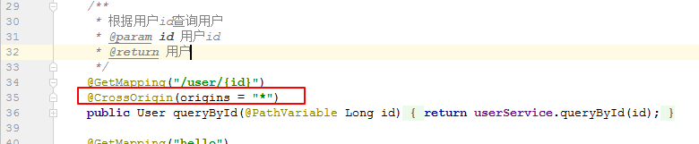

## 1. Vue概述

**目标**：MVVM模式应用特点，Vue概念

**小结**：

MVVM通过视图与模型的双向绑定，简化前端操作。Vue是一款前端渐进式框架，可以提高前端开发效率。

## 2. 搭建示例工程

**目标**：使用IDEA创建示例工程并在工程中通过npm安装下载vue.js

**分析**：

vue是一个前端框架，也是其实是一个js文件；下载vue.js文件并在页面中引入该js文件。

vue.js的下载方式：

- 可以引用在线的vue.js；
- 可以离线下载vue.js；
- npm包资源管理器，可以下载vue.js

**小结**：

使用了npm的方式安装vue模块：

```sh
#初始化
npm init -y

#下载vue模块
npm install vue --save
```


## 3. 演示双向绑定与事件处理

**目标**：创建01-demo.html页面并初始化Vue实例，通过console修改Vue数据实现双向绑定效果和创建按钮实现点击即自增

**分析**：

1. 创建页面，初始化vue；
2. {{}}获取显示数据；
3. v-model实现双向绑定；
4. v-on演示事件处理

**小结**：

```html
<!DOCTYPE html>
<html lang="en">
<head>
    <meta charset="UTF-8">
    <title>vuejs测试</title>
    <script src="node_modules/vue/dist/vue.js"></script>
</head>
<body>
<div id="app">
    <input type="text" v-model="num"><button v-on:click="num++">点我</button>
    <h2>{{name}} 非常酷！有{{num}}个学科。</h2>
</div>
<script type="text/javascript">
    var app = new Vue({
        el:"#app",
        data:{
            name:"黑马",
            num: 1
        }
    });
</script>
</body>
</html>
```


## 4. Vue实例生命周期及钩子函数

**目标**：了解Vue实例生命周期，生命周期的钩子函数及created函数常用场景

**分析**：

在创建vue实例的时候可以指定模板id、数据和方法；而如果要在实例化、模板渲染的过程中需要执行一些其它操作的话；那么可以使用钩子函数。

**小结**：

钩子函数会在vue实例的各个生命周期阶段自动调用；具体有：beforeCreate，created,beforeMount,mounted,updated,beforeUpdate，destroyed，beforeDestroy

created钩子函数常用场景：用于初始化数据

> 钩子函数不要使用箭头函数的方式编写。

## 5. 插值、v-text和v-html

**目标**：插值使用场景和要求；v-text和v-html的作用

**小结**：

**插值**可以使用在有需要显示vue实例数据的地方，可以在插值表达式中调用实例的数据属性和函数。

v-text和v-html的作用：可以将数据在模板中进行显示；**区别**：v-html会对内容中出现的html标签进行渲染，而v-text会将内容当做普遍文本输出到元素里面。

## 6. 指令-v-model使用

**目标**：使用v-model指令实现复选框的双向绑定

**小结**：

```html
<div id="app">
    <input type="checkbox" value="Java" v-model="language">Java<br>
    <input type="checkbox" value="Python" v-model="language">Python<br>
    <input type="checkbox" value="Swift" v-model="language">Swift<br>
    <h2>
        你选择了：{{language.join("，")}}
    </h2>
</div>
<script type="text/javascript">
    var app = new Vue({
        el:"#app",
        data:{
            language:[]
        }
    });
</script>

```

>多个 checkbox 对应一个model时，model的类型是一个数组，单个checkbox值是boolean类型
>radio对应的值是input的value值
>input 和 textarea 默认对应的model是字符串
>select 单选对应字符串，多选对应也是数组

## 7. 指令-v-on使用

**目标**：了解v-on指令的语法实现按钮点击后的递增和递减

**分析**：

在没有使用vue之前；页面标签可以通过设置onXXX响应事件；在vue中可以通过v-on指令响应事件。

**小结**：

v-on的使用：

```html
<div id="app">
    <button v-on:click="num++">增加</button>
    <button @click="decrement">减少</button>
    <h2>
        num = {{num}}
    </h2>
    <hr>
    事件冒泡测试：<br>
    <div style="background-color: lightblue; width:100px;height:100px" @click="print('div被点击了')">
        <button @click.stop="print('点击了button')">点我试试</button>
    </div>
    <br>阻止默认事件：<br>
    <a href="http://www.itcast.cn" @click.prevent="print('点击了超链接')" >传智播客</a>
</div>
<script type="text/javascript">
    var app = new Vue({
        el:"#app",
        data:{
            num:1
        },
        methods: {
            //递减
            decrement(){
                this.num--;
            },
            //打印
            print(str){
                console.log(str);
            }
        }
    });
</script>
```

**事件修饰符**：语法v-on:xxxx.修饰符，常用的修饰符有：

.stop ：阻止事件冒泡
.prevent ：阻止默认事件发生
.capture ：使用事件捕获模式
.self ：只有元素自身触发事件才执行。（冒泡或捕获的都不执行）
.once ：只执行一次

## 8. 指令v-for使用

**目标**：了解v-for指令语法实现对数组、对象的遍历

**分析**：

实现：可以在vue实例化的时候指定要遍历的数据，然后通过v-for指令在模板中遍历显示数据。一般情况下，要遍历的数据可以通过钩子函数created发送异步请求获取数据。

**小结**：

可以使用v-for遍历数组、对象：

```html
<div id="app">
    <ul>
        <li v-for="(user, index) in users" :key="index">
            {{index}}--{{user.name}}--{{user.age}}--{{user.gender}}
        </li>
    </ul>
    <hr>
    <ul>
        <li v-for="(value, key, index) in person">
            {{index}}--{{key}}--{{value}}
        </li>
    </ul>

</div>
<script type="text/javascript">
    var app = new Vue({
        el:"#app",
        data:{
            users:[
                {"name":"黑马","age":13,"gender":"男"},
                {"name":"传智播客","age":13,"gender":"女"},
                {"name":"酷丁鱼","age":4,"gender":"男"}
            ],
            person:{"name":"传智汇","age":13,"gender":"男","address":"中国"}
        }
    });
</script>

```

> 如果遍历的时候需要使用到索引号，可以在循环遍历的位置，添加一个参数；该索引号是从0开始的。

## 9. 指令-v-if和v-show使用

**目标**：说出v-if与v-show的区别；通过一个按钮的点击，实现遍历数组结果的显示存在与否并在遍历过程中使用v-if对数据进行判断处理；实现文本内容的隐藏

**分析**：

- v-if：通过一个按钮的点击，实现遍历数组结果的显示存在与否并在遍历过程中使用v-if对数据进行判断处理
- v-show：实现文本内容的隐藏

**小结**：

v-if在条件不满足的时候元素不会存在；v-show条件不满足的时候只是对元素进行隐藏。

## 10. 指令-v-bind使用

**目标**：了解v-bind语法和作用；实现点击不同按钮切换不同的属性值；使用class属性中的特殊用法实现一个按钮切换背景色

**分析**：

 其中src和height的值如果不想写死，而是想获取vue实例中的数据属性值的话；那可以通过使用v-bind实现：

```html

```

**小结**：

可以使用v-bind：

```html
<div id="app">
    <button @click="color='red'">红色</button>
    <button @click="color='blue'">蓝色</button>
    <div :class="color">
        点击按钮改变背景颜色
    </div>
    <hr>
    <br>
    <button @click="bool=!bool">点我改变下面色块的颜色</button>
    <div :class="{red:bool, blue:!bool}">
        点击按钮改变背景颜色
    </div>
</div>
<script type="text/javascript">
    var app = new Vue({
        el:"#app",
        data:{
            color:"red",
            bool:true
        }
    });
</script>

```

> v-bind的作用：可以对所有元素的属性设置vue实例的数据。

## 11. 计算属性的使用

**目标**：计算属性的应用场景，实现将一个日期时间值转换为yyyy-MM-dd格式字符串

**分析**：

一个日期的毫秒值要显示为格式化（yyyy-MM-dd）的日期字符串的话；可以使用computed计算属性里面的方法进行处理。

**小结**：

计算属性的应用：

```html
<div id="app">
    <h2>
        你的生日是：
        {{new Date(birthday).getFullYear()}}-{{new Date(birthday).getMonth()+1}}-{{new Date(birthday).getDay()}}
    </h2>
    <hr>
    <h2>
        你的生日是：
        {{birth}}
    </h2>
</div>
<script type="text/javascript">
    var app = new Vue({
        el:"#app",
        data:{
            birthday:1429032123201
        },
        computed:{
            birth(){
                const date = new Date(this.birthday);
                return date.getFullYear() + "-" + (date.getMonth()+1) + "-" + date.getDay();
            }
        }
    });
</script>

```

computed计算属性的应用场景：可以应用在插值或者指令表示式复杂的时候。可以将一些属性数据经过方法处理之后返回。

## 12. watch基本和深度监控

**目标**：watch的使用场景；并使用其监听简单属性值及其对象中属性值的变化

**分析**：

在vue实例中数据属性；因为在页面中修改而产生了变化；可以通过watch监控获取其改变前后的值。

如果是修改的对象数据属性，可以开启深度监控获取修改后最新的对象数据。如：person.name

**小结**：

可以如下使用watch进行数据属性的监控：

```html
<div id="app">
    <input type="text" v-model="message">
    <hr><br>
    <input type="text" v-model="person.name"><br>
    <input type="text" v-model="person.age"><button @click="person.age++">+</button>
    <h2>
        姓名为：{{person.name}}；年龄为：{{person.age}}
    </h2>
</div>
<script type="text/javascript">
    var app = new Vue({
        el:"#app",
        data:{
            message:"黑马",
            person:{"name":"heima", "age":13}
        },
        watch:{
            message(newValue, oldValue){
                console.log("新值：" + newValue + "；旧值：" + oldValue);
            },
            person: {
                //开启深度监控；监控对象中的属性值变化
                deep: true,
                //可以获取到最新的对象属性数据
                handler(obj){
                    console.log("name = " + obj.name + "; age=" + obj.age);
                }
            }
        }
    });
</script>

```

watch使用场景：可以监控视图中数据的变化而做出响应；如：下拉框列表中，当如果选择了对于的下拉框选项之后，要根据最新的值去加载一些其它数据的话。

## 13. 组件使用

**目标**：了解组件的使用场景；定义点击则计数的组件并使用全局注册和局部注册方式

**分析**：

可以将通用或者公用的页面模块抽取成vue组件，在vue实例中引用。

**小结**：

在页面中可以如下实验组件：

```html
<div id="app">
    <!--使用组件-->
    <counter></counter>
    <counter></counter>
    <counter></counter>
</div>
<script type="text/javascript">

    //定义组件
    const counter = {
        template:"<button @click='num++'>你点击了{{num}}次</button>",
        data(){
            return {num:0}
        }
    };

    //全局注册组件：在所有的vue实例中都可以使用组件
    //参数1：组件名称，参数2：具体的组件
    //Vue.component("counter", counter);

    var app = new Vue({
        el:"#app",
        components:{
            counter: counter
        }
    });
</script>

```

组件使用场景：在项目需要重用某个模块（头部、尾部、新闻。。。）的时候，可以将模块抽取成组件，其它页面中注册组件并引用。

- 全局注册：在任何vue实例中都可以引用，如：一般网站的头部导航菜单
- 局部注册：可以在有需要的页面引入组件，如：商城网站首页页面中各种活动模块

## 14. 父组件向子组件通信

**目标**：父组件与子组件通信的意义；实现父组件将简单字符串和对象更新到子组件

**小结**：

组件通信意义：父子组件之间数据的交换，能够及时更新组件内容。

- 父组件将简单字符串更新传递到子组件

```html
<div id="app">
    <!--使用组件-->
    <introduce :title="msg"></introduce>
</div>
<script type="text/javascript">

    //定义组件
    const introduce = {
        template:"<h2>{{title}}</h2>",
        //定义接收父组件的属性
        props:["title"]
    };

    //全局注册组件：在所有的vue实例中都可以使用组件
    //参数1：组件名称，参数2：具体的组件
    Vue.component("introduce", introduce);

    var app = new Vue({
        el:"#app",
        data:{
            msg:"父组件的msg属性数据内容"
        }
    });
</script>

```


- 父组件将数组更新传递到子组件

```html
<div id="app">
    <!--使用组件-->
    <my-list :items="lessons" ></my-list>
</div>
<script type="text/javascript">

    //定义组件
    const myList = {
        template:`
            <ul>
            <li v-for="item in items" :key="item.id">{{item.id}}--{{item.name}}</li>
</ul>
        `,
        //定义接收父组件的属性
        props:{
            items:{
                //数据类型，如果是数组则是Array，如果是对象则是Object
                type:Array,
                //默认值
                default:[]
            }
        }
    };

    var app = new Vue({
        el:"#app",
        data:{
            msg:"父组件的msg属性数据内容",
             :[
                {"id":1, "name":"Java"},
                {"id":2, "name":"Php"},
                {"id":3, "name":"前端"}
            ]
        },
        components:{
            myList
        }
    });
</script>

```


## 15. 子组件向父组件通信

**目标**：在子组件中点击对应按钮实现父组件中属性数据的改变

**小结**：

```html
<div id="app">
    <h2>num = {{num}}</h2>
    <!--使用组件-->
    <counter @plus="numPlus" @reduce="numReduce" :snum="num"></counter>
</div>
<script type="text/javascript">

    //定义组件
    const counter = {
        template:`
            <div>
            <button @click='incrNum'>+</button>
            <button @click='decrNum'>-</button>
            </div>
        `,
        props:["snum"],
        methods:{
            //递增
            incrNum(){
                //调用到父组件中的方法
                return this.$emit("plus");
            },
            decrNum(){
                //调用到父组件中的方法
                return this.$emit("reduce");
            }
        }
    };

    //全局注册组件：在所有的vue实例中都可以使用组件
    //参数1：组件名称，参数2：具体的组件
    //Vue.component("counter", counter);

    var app = new Vue({
        el:"#app",
        components:{
            counter: counter
        },
        data:{
            num:0
        },
        methods:{
            numPlus(){
                this.num++;
            },
            numReduce(){
                this.num--;
            }
        }
    });
</script>

```


## 16. axios概述

**目标**：axios的用途及了解常见方法

**小结**：

axios的作用：**发送异步请求获取数据**。常见的方法：**get、post**；在发送的时候可以指定参数（地址、请求方式和请求头部信息）；返回数据结构（**data**/status/statusText/headers/config）

## 17. axios方法及get、post方法使用

**目标**：使用axios方法获取数据并在页面中将数据遍历显示；切换改为get/post方法实现数据加载

**小结**：

可以使用axios获取对应服务器数据；如果不是同一个服务的数据则可能会出现跨域请求；需要在响应的服务器上配置跨域。

```html
<!DOCTYPE html>
<html lang="en">
<head>
    <meta charset="UTF-8">
    <title>vuejs测试</title>
    <script src="node_modules/vue/dist/vue.js"></script>
    <script src="js/axios.min.js"></script>
</head>
<body>
<div id="app">
    <ul>
        <li v-for="(user, index) in users" :key="index">
            {{index}}--{{user.name}}--{{user.age}}--{{user.gender}}
        </li>
    </ul>

</div>
<script type="text/javascript">
    var app = new Vue({
        el:"#app",
        data:{
            users:[]
        },
        created(){
            //初始化加载数据
            axios.post("data.json").then(res=>{
                console.log(res);
                //将数据赋值到vue实例中的数据属性users；
                //不能使用this，在axios回调函数中表示窗口，不是vue实例
                app.users = res.data;
            }).catch(err=>alert(err));

            axios.get("http://localhost/user/8").then(res=>{
                console.log(res.data);
            }).catch(err=>alert(err));
/*
            axios.get("data.json").then(res=>{
                console.log(res);
                //将数据赋值到vue实例中的数据属性users；
                //不能使用this，在axios回调函数中表示窗口，不是vue实例
                app.users = res.data;
            }).catch(err=>alert(err));
*/
/*
            axios({
                url:"data.json",
                method:"get"
            }).then(res=>{
                console.log(res);
                //将数据赋值到vue实例中的数据属性users；
                //不能使用this，在axios回调函数中表示窗口，不是vue实例
                app.users = res.data;
            }).catch(err=>alert(err));
*/
        }
    });
</script>
</body>
</html>
```


> 跨域：在前端js中如果发送异步请求的话，请求的地址与当前服务器的ip或者端口号不同都是跨域请求，可以使用如下方式在服务器端进行配置：



