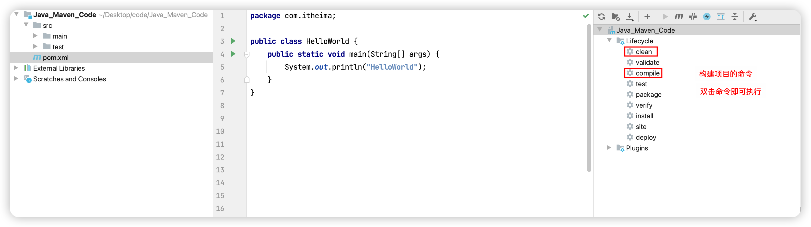

# 1、项目效果展示


# 2、搭建项目环境

## 1.1 Web开发流程


## 1.2 前端开发环境


### 1) HTML

* 定义: 超文本标记语言
* 作用: 搭建页面的框架
* 代码

```html
<p>这是一个用html写的段落</p>
```

### 2) CSS

* 定义: 层叠样式表
* 作用: 增加页面元素的样式
* 代码

```css
<style>
    p {
        color: red;
    }
</style>
```

### 3) JavaScript

* 定义: 前端的脚本语言
* 作用: 增加页面的动态交互, 响应用户事件等
* 代码

```javascript
<script type="text/javascript">
    // 点击按钮
    btn1 = document.getElementById("btn1");
    btn1.onclick = function () {
        alert("点你咋滴")
    }

    // 点击段落
    p1 = document.getElementById("p1")
    p1.onclick = function () {
        alert("hello")
    }

</script>
```

**完整代码**

```html
<!DOCTYPE html>
<html>

<head>
    <meta charset="UTF-8" />
    <title>hello web</title>
    <!-- 使用css给页面元素添加样式 -->
    <style>
        p {
            color: red;
        }
    </style>

</head>

<body>
    <p id="p1">这是一个用html写的段落</p>
    <button id="btn1">点我</button>
</body>
<!-- 使用JavaScript给页面元素添加交互效果 -->
<script type="text/javascript">
    // 点击按钮
    btn1 = document.getElementById("btn1");
    btn1.onclick = function () {
        alert("点你咋滴")
    }

    // 点击段落
    p1 = document.getElementById("p1")
    p1.onclick = function () {
        alert("hello")
    }

</script>

</html>
```

### 4) 搭建微信小程序开发环境

#### ① 安装微信开发者工具


#### ② 导入微信小程序代码并运行


## 1.3 后台开发环境

### 1) JDK

* **JDK:** Java 开发工具包


### 2) IDEA

#### ① 介绍IDEA

**IDEA:** Java代码编辑器, 功能非常强大, 是目前主流的Java代码编辑器


**使用教程见:【idea2021激活入门&常用设置】**

**IDEA层级结构介绍**

1. Project：项目
2. Module：模块
3. Package：包

**上述的所有层级，本质都是文件夹，作用是管理代码**

#### ② HelloWorld

```java
package com.itheima;

public class HelloWorld {
    public static void main(String[] args) {
        System.out.println("Hello World");
    }
}
```


### 3) maven

#### ① 介绍maven

* 定义: 是Apache旗下的一个开源项目，是一款用于管理和构建java项目的工具. 

  ​		 官网 https://maven.apache.org/

* 作用

  1. **依赖管理**

     * 管理的是什么? 是项目中依赖的jar包
     * 项目中为什么要依赖jar包? 是为了不重复造轮子

     > eg: 要做导出excel功能软件; 
     >
     > 第一步: 查询需要导出的数据: 自己做; 
     >
     > 第二步: 生成一份excel文件: 把别人做好的功能拿来用即可

     

     

     

  2. **统一项目结构**

     不用的代码编辑器, 项目的目录结构是不同的, maven统一了项目目录结构，方便了项目管理


3. 项目构建

   项目开发过程中，需要编译代码、测试代码、打包项目、发布到服务器等等一系列操作，maven可以通过简单的命令自动的完成这些操作，提高开发效率。

   

#### ② 安装maven

1. 解压即安装
2. 创建repository仓库（存放maven下载的jar包）
3. 在settings.xml中配置仓库地址

#### ③ IDEA中集成maven

1. 在IDEA启动界面找到【Customize】→ 【All settings】


2. 配置maven安装目录 + maven配置文件 + maven仓库


#### ④ 创建maven项目

1. 选择【maven】类型项目→【next】


2. 配置项目信息


3. maven项目结构介绍


#### ⑤ 构建项目

1. compile: 编译项目，编译后的class文件在Target目录下
2. clean：删除Target目录 




# 3. SpringBoot框架快速入门

## 3.1 框架是什么？

框架本质上就是一个半成品的软件，框架负责处理项目中不同模块间的重复操作，使用框架可以大大提高开发效率


本次实训课程重点学习2个重要框架

* SpringBoot：处理客户端请求-响应的框架，提高处理-响应Web请求的开发效率
* Mybatis：操作数据库的框架，提高数据库的操作效率

## 3.2 SpringBoot快速入门

### 1）需求


### 2）实现步骤

#### ① 创建一个maven项目


#### ②  配置pom.xml

1. 继承SpringBoot父工程

```xml
<parent>
    <groupId>org.springframework.boot</groupId>
    <artifactId>spring-boot-starter-parent</artifactId>
    <version>2.4.5</version>
</parent>
```

2. 添加web依赖

```xml
<dependencies>
    <dependency>
        <groupId>org.springframework.boot</groupId>
        <artifactId>spring-boot-starter-web</artifactId>
        <version>2.4.5</version>
    </dependency>
</dependencies>
```


#### ③ 创建Controller类

Controller就是一个普通的Java类，它的作用是接受客户端的，并给客户端做出响应


#### ④ 常见SpringBoot启动类


#### ⑤ 运行项目并测试


