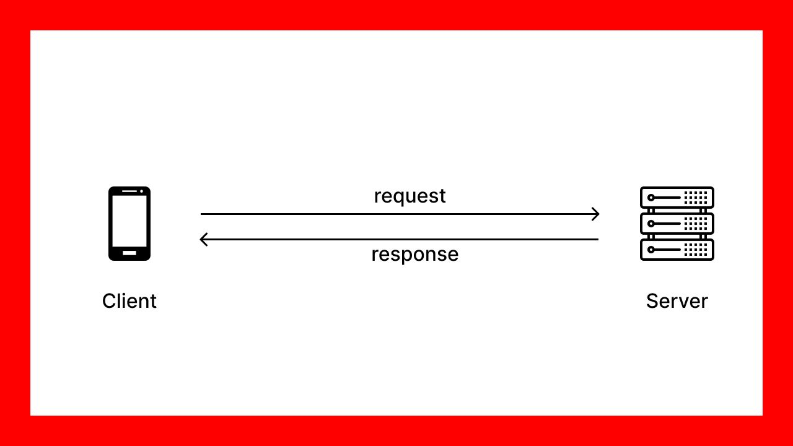

# 1、HTTP协议

## 1.1 HTTP协议

> 思考：客户端（小程序/浏览器）和服务器端（SpringBoot）是两个不同的软件，两者如何进行通信呢？
>
> ==**客户端和服务器端确定统一的通信协议，双方就能通信了，这个统一协议就是HTTP协议**==




**http协议组成**

* **Http Request：请求协议，包含3个部分：**
  * 请求行
  * 请求头
  * 请求体

* **Http Response：响应协议，同样包含3个部分：**
  * 响应行/状态行
  * 响应头
  * 响应体

## 1.2 Http Request


### 1）GET请求

GET请求没有请求体

```yaml
# Method URL Version   请求行
GET /httpLearn/getRequest?param=123 HTTP/1.1
# Request Header   请求头,k-v 键值对
Host: 127.0.0.1:8080
User-Agent: apifox/1.0.0 (https://www.apifox.cn)
```

### 2）POST请求

```yaml
# Method URL Version   请求行
POST /httpLearn/postRequest HTTP/1.1
# Request Header   请求头
Host: 127.0.0.1:8080
User-Agent: apifox/1.0.0 (https://www.apifox.cn)
Content-Length: 126
Content-Type: multipart/form-data; boundary=----WebKitFormBoundary7MA4YWxkTrZu0gW

# Request Message   请求体
----WebKitFormBoundary7MA4YWxkTrZu0gW
Content-Disposition: form-data; name="param"

post
----WebKitFormBoundary7MA4YWxkTrZu0gW
```

### 3）常见的请求头


### 4）常见的请求类型


## 1.3 Http Response


```yaml
# Version  Response Code   状态行
HTTP/1.1 200 OK
# Response Header   响应头
Content-Type:text/plain;charset=UTF-8
Content-Length:31
Date:Wed, 19 Jan 2022 11:37:00 GMT
Keep-Alive:timeout=60
Connection:keep-alive

# Response Message   响应体
post request is ok,param = post
```

### 1）常见的响应头


### 2）响应状态码

* 200：客户端请求成功
* 404：请求资源不存在
* 500：服务器端发生错误


# 2、请求响应流程


> Tomcat：web项目的容器


1. 浏览器请求会先到达Tomcat，Tomcat再把请求交给SpringBoot处理【Tomcat负责】
2. 请求被SpringBoot映射到Controller中的目标方法【Springboot负责】
3. 目标方法处理业务，return处理结果，处理结果会返回给Tomcat【程序员负责】
4. Tomcat将处理结果返回给浏览器【Tomcat负责】

# 3、客户端请求参数类型 

## 3.1 提交键值对类型数据


## 3.2 提交 JSON格式数据

### 1）Postman

Postman是Http客户端工具，可以像浏览器一样发送http请求，方便进行http请求测试


### 2）JSON格式数据

* JSON是一种轻量级的数据格式，可以友好的表示复杂的数据，常被用于各软件之间的数据通讯的格式

```
{}: 代表一个对象
[]: 代表一个数组
冒号：键和值的分隔符
逗号：多个相同内容的分隔符

键必须使用双引号引起来
值如果是数字，可以不用双引号，其它都用双引号引起来
```

* JSON对象

```json
{
  "name": "小明",
  "age":"14",
  "gender": "man",
  "height": 1.65,
  "grade": null,
  "school": "heima",
  "skills": ["JavaScript", "Java", "Python"]
}
```

* JSON数组

```json

[
  {
    "name": "小明",
    "age":"14",
    "gender": "man",
    "height": 1.65,
    "grade": null,
    "school": "heima",
    "skills": ["JavaScript", "Java", "Python"]
  },
  {
    "name": "小王",
    "age":"14",
    "gender": "woman",
    "height": 1.65,
    "grade": null,
    "school": "heima",
    "skills": ["JavaScript", "Java", "Python"]
  },
]
```

### 3）提交JSON格式数据

* 使用```@RequestBody```接受客户端的JSON数据


## 3.3 提交路径参数数据

* 使用```@PathVariable```接受路径上的参数数据


# 4、服务器端响应数据类型

## 4.1 响应字符串


## 4.2 响应Java对象

* ```SpringBoot```自动将```Java对象```转换为了```JSON格式```的数据
* ```Java对象```与```JSON格式```数据刚好有一一对应的关系


## 4.3 统一响应结果

* 服务器端对客户端的每个请求都要做出响应，并且要统一响应数据的格式，这样的好处是方便客户端解析数据
* 服务器端响应的数据格式包含
  * 响应码：code。1代表成功，0代表失败
  * 响应消息：msg。响应结果的字符串描述
  * 响应数据：data。响应具体的业务数据

```java
package com.itheima.dojo;

public class Result {
    private Integer code;
    private String msg;
    private Object data;

    public Result() {
    }

    public Result(Integer code, String msg, Object data) {
        this.code = code;
        this.msg = msg;
        this.data = data;
    }
    
    public Integer getCode() {
        return code;
    }

    public void setCode(Integer code) {
        this.code = code;
    }

    public String getMsg() {
        return msg;
    }

    public void setMsg(String msg) {
        this.msg = msg;
    }

    public Object getData() {
        return data;
    }

    public void setData(Object data) {
        this.data = data;
    }

    /**
     * 查询响应成功
     *
     * @return
     */
    public static Result success(Object data) {
        // 需要返回查询结果
        return new Result(1, "success", data);
    }

    /**
     * 增删改响应成功
     *
     * @return
     */
    public static Result success() {
        // 不需要返回查询结果
        return new Result(1, "success", null);
    }

    /**
     * 失败响应
     *
     * @return
     */
    public static Result error() {
        return new Result(0, "error", null);
    }

}

```


# 5、控制反转

## 5.1 IOC概念

> Java是面向对象的语言，我们当前使用```UserController```处理请求，但是我们貌似并没有创建```UserContrller```，这是怎么回事呢？
>
> ==一定要先把```UserContrller```创建出来后才能使用的，我们没有创建，那就是别人帮我们创建了==


## 5.2 IOC好处

* 没有IOC：各个对象紧耦合在一起，牵一发而动全身


* 有IOC：对象都交给IOC容器来管理，需要的时候向IOC容器要即可


* IOC的好处：实现了解耦。并且对象的创建是单例的，对象统一管理后，节省了内存空间


## 5.3 获取对象

```java
@SpringBootApplication
public class App {
    public static void main(String[] args) {
        ConfigurableApplicationContext context = SpringApplication.run(App.class);
        // 通过id获取java对象
        HelloController controller1 = (HelloController) context.getBean("helloController");
        System.out.println(controller1);

        // 通过类型获取java对象
        HelloController controller2 = context.getBean(HelloController.class);
        System.out.println(controller2);
    }
}
```

```java
打印结果：
com.itheima.controller.HelloController@5f7da3d3
com.itheima.controller.HelloController@5f7da3d3
```

# 6. SpringBoot配置文件

SpringBoot中很多配置都有默认值，比如Tomcat端口号是8080，如果想要修改默认的配置信息，就可以通过配置文件进行修改

## 6.1 创建配置文件


## 6.2 测试参数配置


