# 1、数据库

数据持久化存储的一种方式，通过SQL语言可以方便的操作数据库中的数据，目前主流的数据库是Mysql

## 1.1 安装Mysql数据库

* 见【MySQL安装文档】
* IDEA中连接Mysql数据库

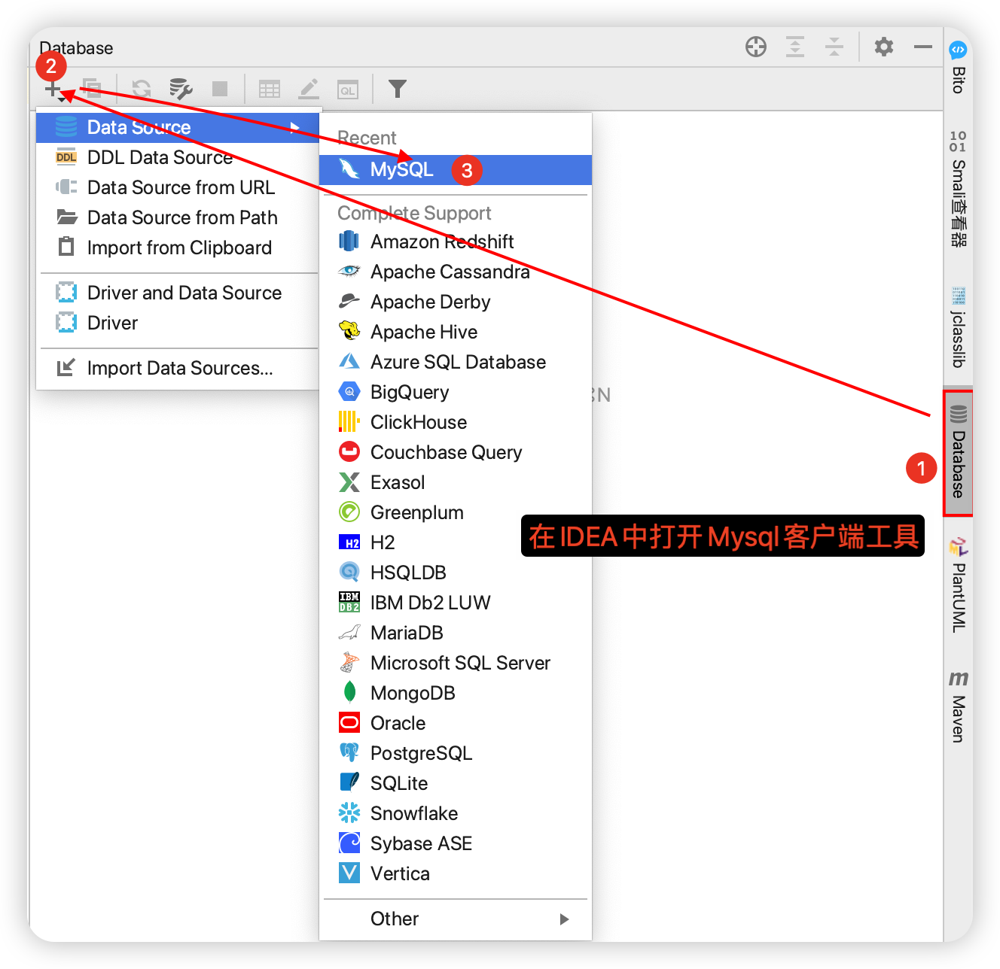

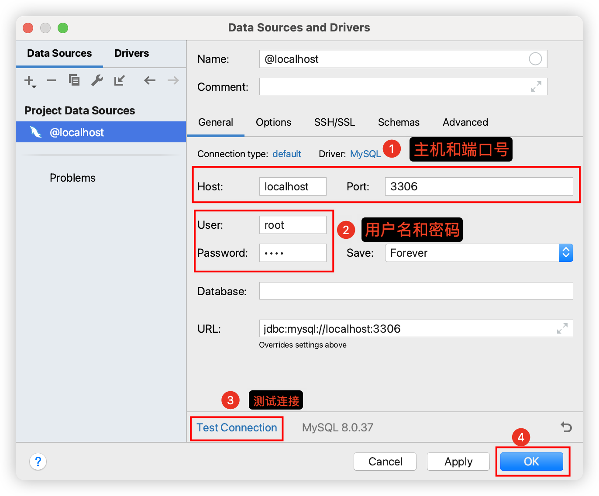

* 新建查询窗口编写SQL语句

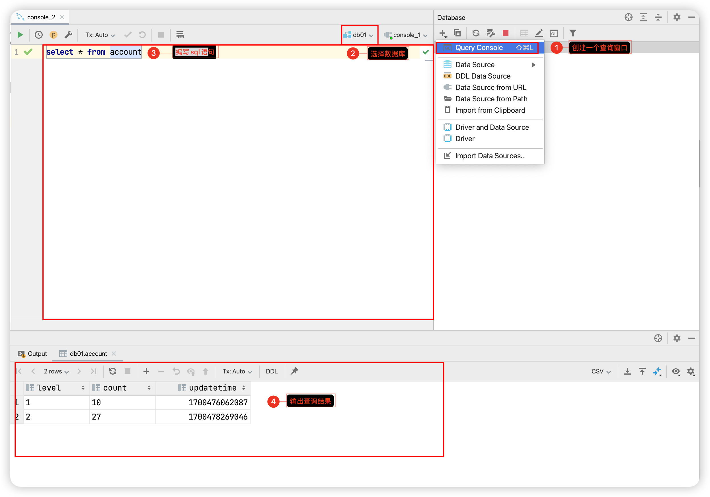

## 1.2 SQL分类

* DDL：操作库和表
* **DML：对表中数据进行写（增删改）操作**
* **DQL：对表中数据进行读（查询）操作**
* DCL：数据库权限相关操作

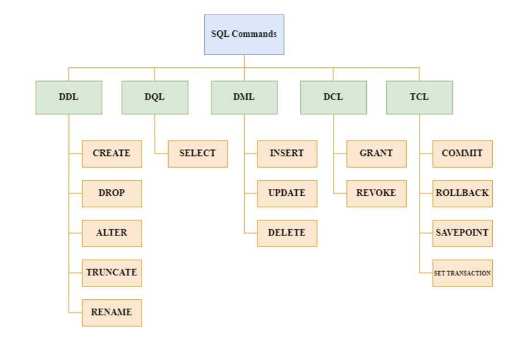

## 1.3  数据库的创建与使用

```sql
# 创建数据库 db2
create database db2;
# 使用数据库 db2
use db2;
```

## 1.4  表的创建

```sql
# 创建一张员工表,员工表的字段: id 姓名 年龄 工资 职位 入职日期
create table emp(
    id int primary key auto_increment,
    name varchar(32),
    age int,
    salary int,
    job varchar(10),
    entrydate date
);
```

## 1.5 数据的增删改

```sql
#数据添加: 一般添加的时候不给id添加数据, id数据库会自动添加
insert into emp(name,age,salary,job,entrydate) values ('张三',23,6000,'教学主管','2000-
01-01');
insert into emp(name,age,salary,job,entrydate) values ('张三1',22,6000,'教学主管','2000-01-01');
insert into emp(name,age,salary,job,entrydate) values ('张三2',28,6000,'教学主管','2000-01-01');
insert into emp(name,age,salary,job,entrydate) values ('张三3',21,6000,'教学主管','2000-03-01');
insert into emp(name,age,salary,job,entrydate) values ('张三4',23,6000,'教学主管','2000-01-01');
insert into emp(name,age,salary,job,entrydate) values ('张三5',25,6000,'教学主管','2000-05-01');
insert into emp(name,age,salary,job,entrydate) values ('张三6',30,6000,'教学主管','2000-01-01');

#修改数据: 张三6的入职日期修改为 2001-01-01
update emp set entrydate='2001-01-01' where name='张三6';

# 删除员工id为1的员工
delete from emp where id = 1;
```

## 1.6 数据的查询

```sql
#查询所有的员工信息
select * from emp;
#查询年龄大于25的员工信息
select * from emp where age > 25;
#查询入职日期在2000-01-01~2000-03-01
select * from emp where entrydate between '2000-01-01' and '2000-03-01';
# 查询所有员工的第一页数据 每页条数3, 起始索引=(当前页码-1)*每页条数
select * from emp limit 0,3;
```

# 2、Mybatis

## 2.1 什么是Mybatis

* Mybatis是一款优秀的**持久层框架，**用于简化JDBC开发

  ```
  JDBC开发流程：
    1. 注册驱动：通知Java程序我们要连接的是哪个品牌的数据库
    2. 获取数据库连接：Java进程和Mysql进程之间的通道开启了
    3. 获取数据库操作对象：这个对象是用来执行sql语句的
    4. 执行SQL语句：对数据库进行CRUD（增删改查）操作
    5. 处理查询结果集：如果第四步有select语句才有这一步
    6. 释放资源：关闭所有资源
  以上流程中，1、2、3、6在每次数据库操作中都是重复的，只有第4和5这两步是和业务有关。
  Mybatis负责重复的步骤，程序员只需要负责和业务有关的操作即可。
  ```

  

* Mybatis本是Apache的一个开源项目iBatis，2010年这个项目由Apache迁移到了Google Code，并且改名为Mybatis
* 官网：https://mybatis.net.cn/index.html

## 2.2 Mybatis快速入门

> 需求：使用Mybatis，查询数据库所有员工信息，并把结果输出到控制台

实现步骤：

1. 添加依赖：在pom.xml中引入框架相关依赖
2. 配置数据库信息：在application.properties中配置数据库信息
3. 创建Mapper接口：创建mapper包，在包下创建Mapper接口，在接口中添加查询方法
4. 创建Mapper配置文件：在resources目录下创建与Mapper同名的xml配置文件，并在xml中编写SQL语句
5. 执行SQL语句：在启动类中，通过IOC容器中获得Mapper接口的实现类对象，从而调用方法，执行sql语句，解析结果数据

### 1）添加依赖

```xml
<!--mysql的坐标-->
<dependency>
    <groupId>mysql</groupId>
    <artifactId>mysql-connector-java</artifactId>
    <version>8.0.22</version>
    <!--如果你的mysql是5.x版本，那么使用下面这个依赖坐标-->
    <!--<version>5.1.47</version>-->
</dependency>
<!--mybatis的坐标-->
<dependency>
    <groupId>org.mybatis.spring.boot</groupId>
    <artifactId>mybatis-spring-boot-starter</artifactId>
    <version>2.2.2</version>
</dependency>
```

### 2）配置数据库信息

```properties
# 配置数据库连接信息
# mysql5.x的驱动类
# spring.datasource.driver-class-name=com.mysql.jdbc.Driver
# mysql 8.x的驱动类
spring.datasource.driver-class-name=com.mysql.cj.jdbc.Driver
# 配置连接
spring.datasource.url=jdbc:mysql://localhost:3306/db2?serverTimezone=Asia/Shanghai
# 配置用户名
spring.datasource.username=root
# 用户名和密码要配置成你自己的
spring.datasource.password=root
```

### 3）创建Mapper接口

```java
import java.util.List;

//添加@Mapper注解,Mybatis会创建接口的实现类,并把实现类添加到IOC容器中
@Mapper 
public interface EmpMapper {
    public List<Emp> selectAll();
}
```

````java
public class User {
    private String username;
    private Integer age;
    private String gender;

    public User() {
    }

    public User(String username, Integer age, String gender) {
        this.username = username;
        this.age = age;
        this.gender = gender;
    }

    public String getUsername() {
        return username;
    }

    public void setUsername(String username) {
        this.username = username;
    }

    public Integer getAge() {
        return age;
    }

    public void setAge(Integer age) {
        this.age = age;
    }

    public String getGender() {
        return gender;
    }

    public void setGender(String gender) {
        this.gender = gender;
    }
}
````

### 4）创建Mapper配置文件

```xml
<?xml version="1.0" encoding="UTF-8" ?>
<!DOCTYPE mapper
        PUBLIC "-//mybatis.org//DTD Mapper 3.0//EN"
        "http://mybatis.org/dtd/mybatis-3-mapper.dtd">

<mapper namespace="com.itheima.mapper.EmpMapper">
    <select id="selectAll" resultType="com.itheima.dojo.Emp">
        select *
        from emp;
    </select>
</mapper>
```

```properties
# 配置mapper配置文件的位置
mybatis.mapper-locations=classpath:mapper/*.xml
```

### 5）执行SQL语句

```
@SpringBootApplication
public class App {
    public static void main(String[] args) {
        ConfigurableApplicationContext context = SpringApplication.run(App.class,args);
        
        // 获得Mapper的实现类对象
        EmpMapper empMapper = context.getBean(EmpMapper.class);
        List<Emp> emps = empMapper.selectAll();
        System.out.println(emps);
    }
}
```

## 2.3 CURD操作

### 1）添加

* EmpMapper

```java
public void add(Emp emp);
```

* EmpMapper.xml

```
<!--添加员工-->
<insert id="add">
    insert into emp(name, age, salary, job, entrydate)
    values (#{name}, #{age}, #{salary}, #{job}, #{entryDate})
</insert>
```

* 测试类

```
// 获得Mapper的实现类对象
EmpMapper empMapper = context.getBean(EmpMapper.class);

// 添加员工
Emp emp = new Emp();
emp.setName("六六");
emp.setAge(20);
emp.setSalary(6000);
emp.setJob("python开发");
emp.setEntryDate(new Date());
empMapper.add(emp);
```

### 2）更新

* EmpMapper

```java
public void add(Emp emp);
```

* EmpMapper.xml

```xml
<!--更新员工-->
<update id="update">
    update emp
    set name     = #{name},
        age      = #{age},
        salary   = #{salary},
        job=#{job},
        entrydate=#{entryDate}
    where id = #{id}
</update>
```

* 测试类

```java
Emp emp = empMapper.selectById(8);
emp.setSalary(8000);
empMapper.update(emp);
```

### 3）根据ID查询

* EmpMapper

```java
public Emp selectById(Integer id);
```

* EmpMapper.xml

```xml
<!--根据ID查询员工-->
<select id="selectById" resultType="com.itheima.dojo.Emp">
    select *
    from emp
    where id = #{id}
</select>
```

* 测试类

```java
Emp emp = empMapper.selectById(8);
System.out.println(emp);
```

### 4）删除

* EmpMapper

```java
public void deleteById(Integer id);
```

* EmpMapper.xml

````xml
<!--根据ID删除员工-->
<delete id="deleteById">
    delete
    from emp
    where id = #{id}
</delete>
````

* 测试类

```java
empMapper.deleteById(11);
```

# 3、软件生命周期

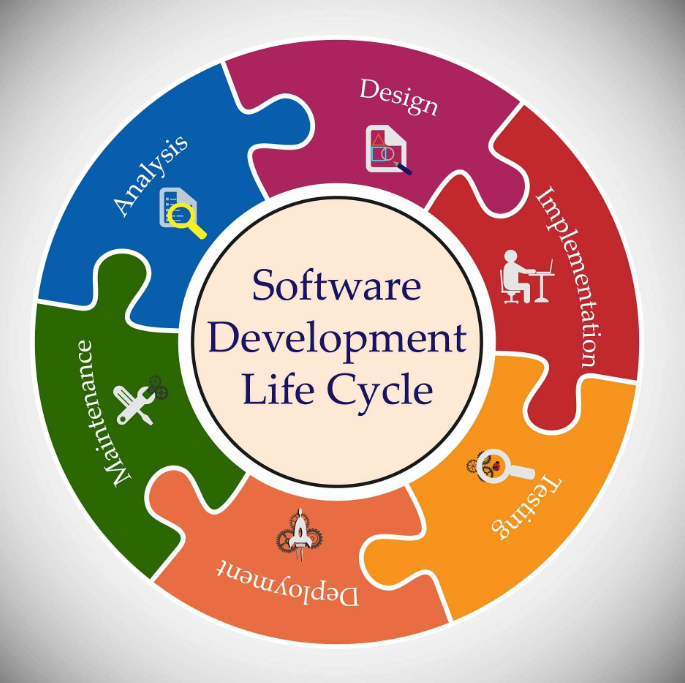

## 3.1 生命周期

### 1）需求分析

* 任务：把用户需求转化为系统需求
* 产物：需求文档、产品原型图

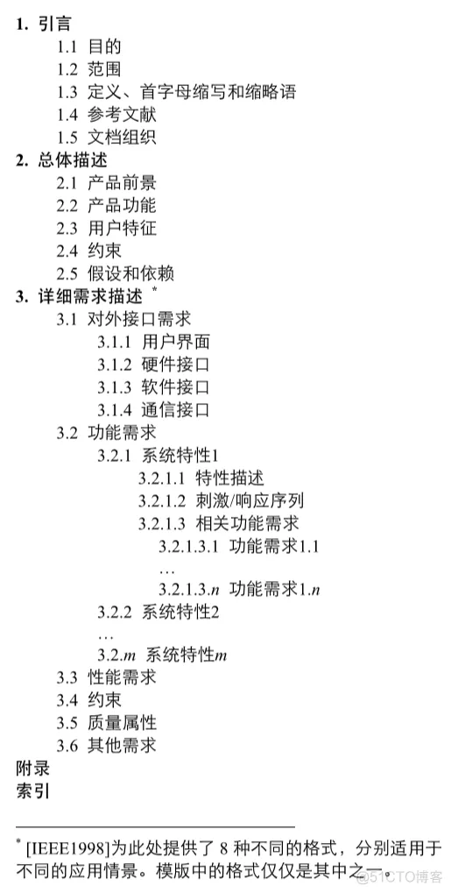

### 2）软件设计

* 任务：设计UI界面、软件技术架构、数据库设计、接口设计
* 产物：产品UI图、架构图、数据库设计图、接口文档


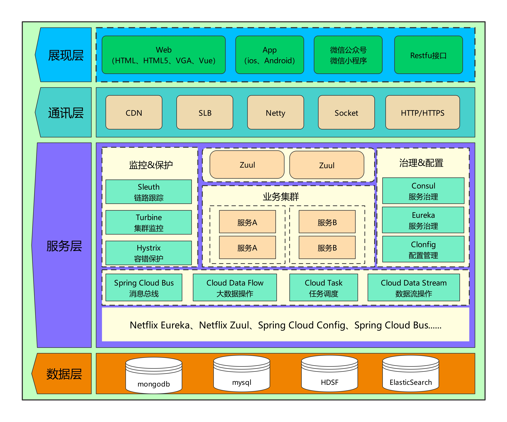

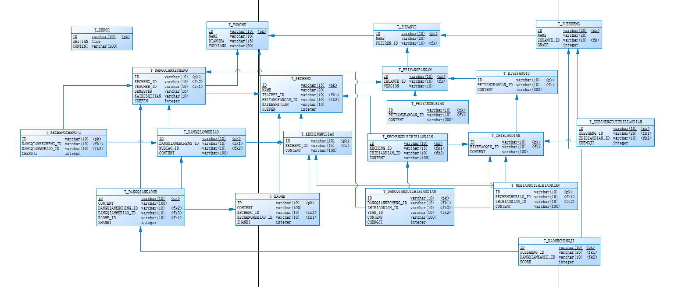

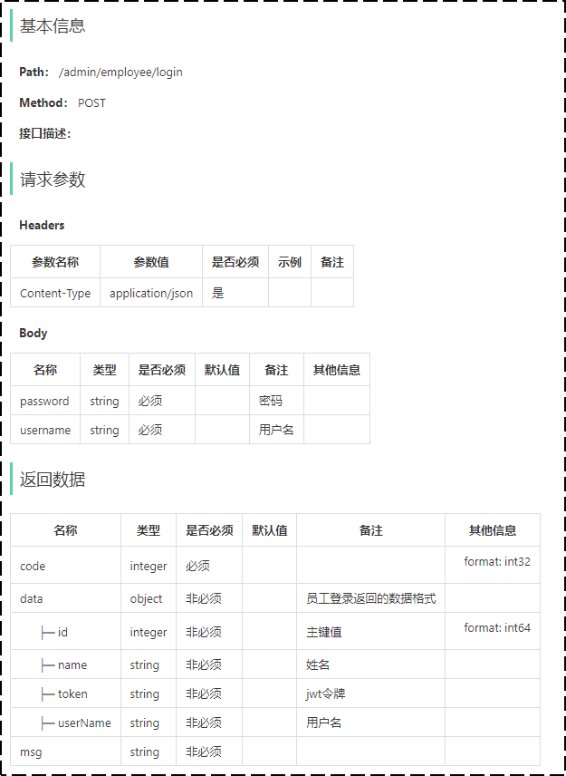

### 3）软件开发

* 任务：编写项目代码，并完成单元测试
* 产物：前后端项目代码


### 4）软件测试

* 任务：测试人员对部署在测试环境下的项目进行功能测试，并出具相应的测试报告
* 产物：前后端项目代码

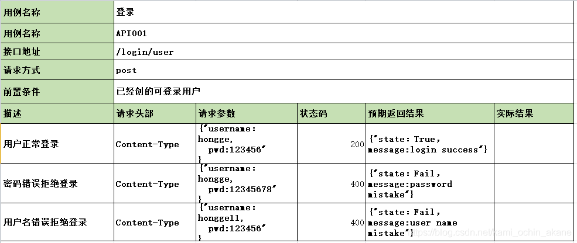

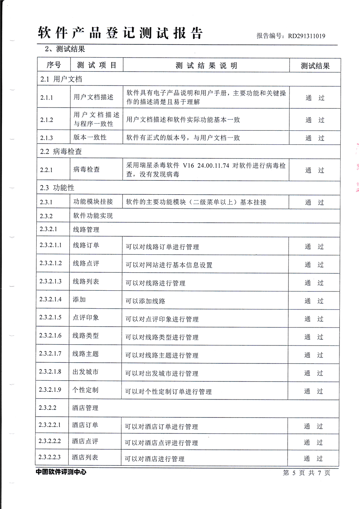

### 5）部署运维

* 任务：运维人员准备线上服务器，配置软件运行环境，部署软件在线上服务器上运行
* 产物：线上正常运行

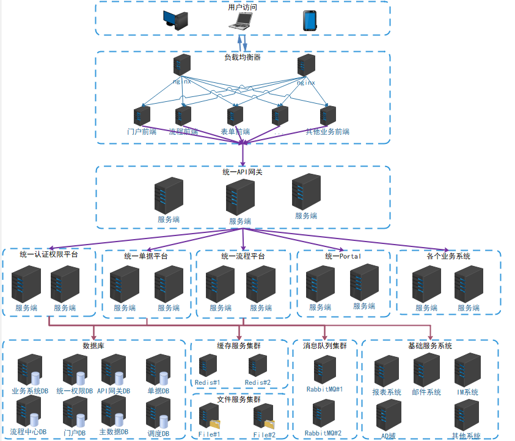

## 3.2 任务分工


| 岗位/角色  | 对应阶段 | 职责/分工                                  |
| :--------- | -------- | :----------------------------------------- |
| 项目经理   | 全阶段   | 对整个项目负责，任务分配、把控进度         |
| 产品经理   | 需求分析 | 进行需求调研，输出需求调研文档、产品原型等 |
| UI设计师   | 设计     | 根据产品原型输出界面效果图                 |
| 架构师     | 设计     | 项目整体架构设计、技术选型等               |
| 开发工程师 | 编码     | 功能代码实现                               |
| 测试工程师 | 测试     | 编写测试用例，输出测试报告                 |
| 运维工程师 | 上线运维 | 软件环境搭建、项目上线                     |

上述角色分工是在一个项目组中比较完整的角色分工, 但是在实际的项目中, 有一些项目组由于人员配置紧张, 可能并没有专门的架构师或测试人员, 这个时候可能需要有项目经理或者程序员兼任。

# 4、前后端开发流程

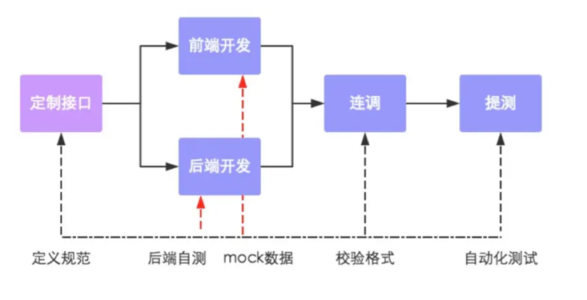

1. 定义接口，确定接口的路径、请求方式、传入参数、返回参数。
2. 前端开发人员和后端开发人员并行开发
3. 前后端人员进行连调测试
4. 提交给测试人员进行最终测试