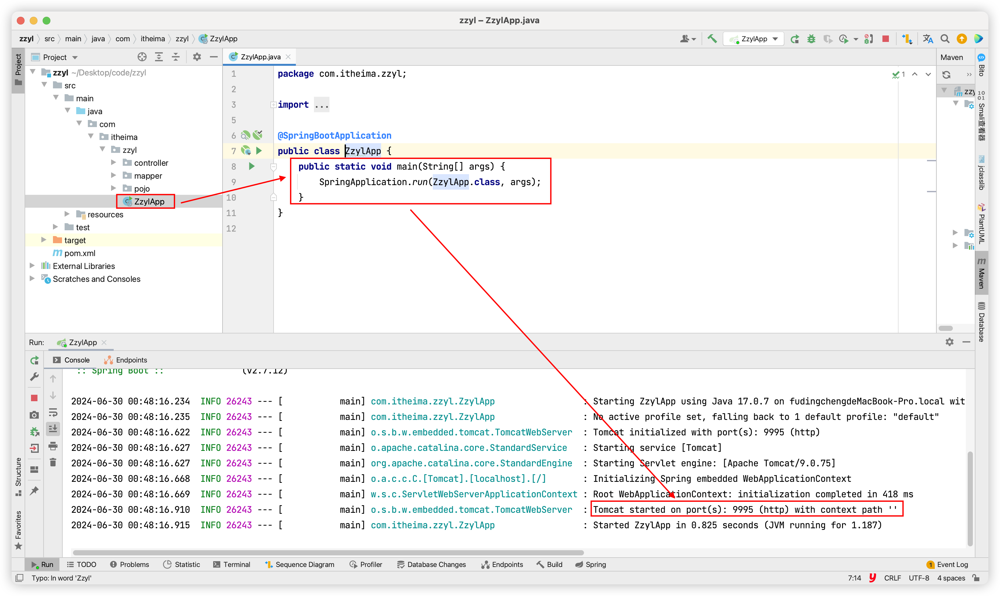

# 一、《中州养老》项目介绍

## 1.1 项目背景

中国老龄化程度加深，我国老龄事业和养老服务体系的发展得到了国家的高度重视，在国家政策的支持下，我国智慧养老产业主体持续增多，产业链不断整合，发展前景较好。我国正在形成一个多元化“互联网+养老”的智慧老年护理服务系统，智慧养老是我国的必然趋势。

## 1.2 业务流程

中州养老系统为养老院量身定制开发专业的养老管理软件产品；涵盖来访管理、入退管理、在住管理、服务管理、财务管理等功能模块，涉及从来访参观到退住办理的完整流程。


中州养老项目分为两端，一个是管理后台，另外一个是家属端

- 管理后台：<u>养老院员工使用</u>。入住、退住，给老人服务记录等等
- 家属端：<u>养老院的老人家属使用</u>。查看老人信息，缴费，下订单等等

## 1.3 实训说明

整个中州养老的前后端代码要全部实现，需要三个月以上的时间，由于本次实训时间所限，没有办法将整个中州养老的所有代码实现，所以咱们会从项目中挑选部分功能进行实现，把我们本次实训所学习的技术应用起来。

本次实训选取中州养老项目家属端的部分功能进行实现，其中前端微信小程序部分已经实现好了，我们只需要把提供好的代码运行起来，配合后端完成测试及效果展示即可。将来要实现的家属端的功能包含如下：

```
预约模块：
  * 预约列表分页查询
  * 新增预约
  * 取消预约
```

```
房型模块：
	* 查询所有房型
```

```
护理服务模块：
	* 护理服务列表分页查询
	* 护理服务详情查询
```

## 1.4 实训任务

### 1.4.1 边讲边练

参照接口文档，完成预约模块相关的三个接口

### 1.4.2 自己完成

参照接口文档，完成房型模块和护理服务模块的相关接口

# 二、项目环境搭建

## 2.1 数据库环境

执行资料中提供的sql，准备数据库和表以及一些基础数据。


```sql
CREATE DATABASE IF NOT EXISTS zzyl_user_client DEFAULT CHARACTER SET utf8mb4 COLLATE utf8mb4_unicode_ci;
USE zzyl_user_client;
SET NAMES utf8;
/*
 Navicat Premium Data Transfer

 Source Server         : 146
 Source Server Type    : MySQL
 Source Server Version : 80030
 Source Host           : 192.168.200.146:3306
 Source Schema         : zzyl-user-client

 Target Server Type    : MySQL
 Target Server Version : 80030
 File Encoding         : 65001

 Date: 03/02/2024 14:47:30
*/

SET NAMES utf8mb4;
SET FOREIGN_KEY_CHECKS = 0;

-- ----------------------------
-- Table structure for nursing_project
-- ----------------------------
DROP TABLE IF EXISTS `nursing_project`;
CREATE TABLE `nursing_project`  (
                                    `id` bigint NOT NULL AUTO_INCREMENT COMMENT '编号',
                                    `name` varchar(100) CHARACTER SET utf8mb4 COLLATE utf8mb4_0900_ai_ci NULL DEFAULT NULL COMMENT '名称',
                                    `order_no` int NULL DEFAULT NULL COMMENT '排序号',
                                    `unit` varchar(50) CHARACTER SET utf8mb4 COLLATE utf8mb4_0900_ai_ci NULL DEFAULT NULL COMMENT '单位',
                                    `price` decimal(10, 2) NULL DEFAULT NULL COMMENT '价格',
                                    `image` varchar(255) CHARACTER SET utf8mb4 COLLATE utf8mb4_0900_ai_ci NULL DEFAULT NULL COMMENT '图片',
                                    `nursing_requirement` varchar(255) CHARACTER SET utf8mb4 COLLATE utf8mb4_0900_ai_ci NULL DEFAULT NULL COMMENT '护理要求',
                                    `status` int NOT NULL DEFAULT 1 COMMENT '状态（0：禁用，1：启用）',
                                    `create_by` varchar(50) CHARACTER SET utf8mb4 COLLATE utf8mb4_0900_ai_ci NULL DEFAULT NULL COMMENT '创建人',
                                    `update_by` varchar(50) CHARACTER SET utf8mb4 COLLATE utf8mb4_0900_ai_ci NULL DEFAULT NULL COMMENT '更新人',
                                    `remark` varchar(255) CHARACTER SET utf8mb4 COLLATE utf8mb4_0900_ai_ci NULL DEFAULT NULL COMMENT '备注',
                                    `create_time` datetime(0) NOT NULL DEFAULT CURRENT_TIMESTAMP(0) COMMENT '创建时间',
                                    `update_time` datetime(0) NULL DEFAULT CURRENT_TIMESTAMP(0) ON UPDATE CURRENT_TIMESTAMP(0) COMMENT '更新时间',
                                    PRIMARY KEY (`id`) USING BTREE,
                                    UNIQUE INDEX `name`(`name`) USING BTREE
) ENGINE = InnoDB AUTO_INCREMENT = 92 CHARACTER SET = utf8mb4 COLLATE = utf8mb4_0900_ai_ci COMMENT = '护理项目表' ROW_FORMAT = DYNAMIC;

-- ----------------------------
-- Records of nursing_project
-- ----------------------------
INSERT INTO `nursing_project` VALUES (80, '翻身拍背', 1, '次', 30.00, 'https://yjy-slwl-oss.oss-cn-hangzhou.aliyuncs.com/0e53b016-4b6e-4b4c-b545-b81cdd185d3e.jpg', '帮助患者翻身，并进行背部按摩，以促进血液循环', 1, '1671403256519078239', NULL, NULL, '2023-12-28 17:08:36', '2023-12-28 17:08:36');
INSERT INTO `nursing_project` VALUES (81, '复健运动', 2, '次', 50.00, 'https://yjy-slwl-oss.oss-cn-hangzhou.aliyuncs.com/0843add9-8519-4189-88f9-2dc41b3793e5.jpg', '根据患者的需要，执行定制的康复运动计划，旨在改善身体机能和增强肌肉力量', 1, '1671403256519078239', NULL, NULL, '2023-12-28 17:10:17', '2023-12-28 17:10:17');
INSERT INTO `nursing_project` VALUES (82, '公共空间清', 3, '小时', 20.00, 'https://yjy-slwl-oss.oss-cn-hangzhou.aliyuncs.com/00f9799d-3220-4a75-8c77-fbd0504039cd.jpg', '对养老院公共区域进行定期清洁和消毒，包括走廊、客厅和就餐区等', 1, '1671403256519078239', NULL, NULL, '2023-12-28 17:11:02', '2023-12-28 17:11:02');
INSERT INTO `nursing_project` VALUES (83, '心理咨询', 6, '小时', 20.00, 'https://yjy-slwl-oss.oss-cn-hangzhou.aliyuncs.com/5b411f7b-628e-4ccb-a13f-ff1ac05e4a58.jpg', '提供专业的心理咨询服务，帮助患者处理情绪问题、调解矛盾和提供心理支持', 1, '1671403256519078239', '1671403256519078239', NULL, '2023-12-28 17:11:39', '2023-12-28 17:13:23');
INSERT INTO `nursing_project` VALUES (84, '洗脚', 4, '次', 0.01, 'https://yjy-slwl-oss.oss-cn-hangzhou.aliyuncs.com/f1a35fca-f5a4-4c93-9a5e-bbaed9080655.jpg', '为患者提供舒适的足部护理，包括泡脚、按摩和修剪脚指甲等', 1, '1671403256519078239', '1671403256519078138', NULL, '2023-12-28 17:12:21', '2023-12-28 18:09:00');
INSERT INTO `nursing_project` VALUES (85, '助餐', 11, '餐', 15.00, 'https://yjy-slwl-oss.oss-cn-hangzhou.aliyuncs.com/43be3304-c1e8-478f-8358-fd8cbcb9452a.jpg', '为患者提供用餐辅助，包括帮助患者就餐、切割食物和适应特殊膳食需求等', 1, '1671403256519078239', NULL, NULL, '2023-12-28 17:12:45', '2023-12-28 17:12:45');
INSERT INTO `nursing_project` VALUES (86, '洗脸', 5, '次', 15.00, 'https://yjy-slwl-oss.oss-cn-hangzhou.aliyuncs.com/6e068eb5-2916-4c7e-bf5d-c157122d78f4.jpg', '为患者提供温和而舒适的洗脸服务，以保持面部卫生和清洁', 1, '1671403256519078239', '1671403256519078239', NULL, '2023-12-28 17:12:52', '2023-12-28 17:13:18');
INSERT INTO `nursing_project` VALUES (87, '助浴', 1, '次', 40.00, 'https://yjy-slwl-oss.oss-cn-hangzhou.aliyuncs.com/c98f1d47-9d9c-4177-a27d-ce53bbe7382d.jpg', '协助患者进行浴室洗浴，包括保证个人隐私、洗澡和擦干身体等过程', 1, '1671403256519078239', NULL, NULL, '2023-12-28 17:13:43', '2023-12-28 17:13:43');
INSERT INTO `nursing_project` VALUES (88, '整理床铺', 10, '次', 15.00, 'https://yjy-slwl-oss.oss-cn-hangzhou.aliyuncs.com/f5808913-0c15-4e41-a27d-c01e2b198056.jpg', '打扫和整理患者的床铺，包括更换床单、清理枕套和平整被褥等工作', 1, '1671403256519078239', NULL, NULL, '2023-12-28 17:14:31', '2023-12-28 17:14:31');
INSERT INTO `nursing_project` VALUES (89, '洗头', 1, '次', 20.00, 'https://yjy-slwl-oss.oss-cn-hangzhou.aliyuncs.com/f65a2979-4d50-4c3d-8962-c76bef061a9c.jpg', '将患者带到洗发间进行洗发，并提供按摩和护理，保持头皮健康', 1, '1671403256519078239', NULL, NULL, '2023-12-28 17:14:32', '2023-12-28 17:14:32');
INSERT INTO `nursing_project` VALUES (90, '衣物清洁', 9, '件', 5.00, 'https://yjy-slwl-oss.oss-cn-hangzhou.aliyuncs.com/5ea53c25-b855-486f-98e3-f26febb9db68.jpg', '提供患者衣物的清洗、熨烫和折叠等服务，确保他们穿着整洁干净的衣物', 1, '1671403256519078239', NULL, NULL, '2023-12-28 17:15:06', '2023-12-28 17:15:06');
INSERT INTO `nursing_project` VALUES (91, '修剪指甲', 1, '次', 10.00, 'https://yjy-slwl-oss.oss-cn-hangzhou.aliyuncs.com/82a2053b-5e1d-4514-92e9-aa1383b0d601.jpg', '为患者修剪手指和脚趾的指甲，以保持个人卫生和舒适感', 1, '1671403256519078239', NULL, NULL, '2023-12-28 17:15:12', '2023-12-28 17:15:12');

-- ----------------------------
-- Table structure for reservation
-- ----------------------------
DROP TABLE IF EXISTS `reservation`;
CREATE TABLE `reservation`  (
                                `id` bigint NOT NULL AUTO_INCREMENT COMMENT '主键ID',
                                `name` varchar(50) CHARACTER SET utf8mb4 COLLATE utf8mb4_0900_ai_ci NOT NULL COMMENT '预约人姓名',
                                `mobile` varchar(20) CHARACTER SET utf8mb4 COLLATE utf8mb4_0900_ai_ci NOT NULL COMMENT '预约人手机号',
                                `time` datetime(0) NOT NULL COMMENT '预约时间',
                                `visitor` varchar(50) CHARACTER SET utf8mb4 COLLATE utf8mb4_0900_ai_ci NOT NULL COMMENT '探访人',
                                `type` int NOT NULL COMMENT '预约类型，0：参观预约，1：探访预约',
                                `status` int NOT NULL COMMENT '预约状态，0：待报道，1：已完成，2：取消，3：过期',
                                `create_time` datetime(0) NOT NULL COMMENT '创建时间',
                                `update_time` datetime(0) NULL DEFAULT NULL COMMENT '更新时间',
                                `create_by` bigint NULL DEFAULT NULL COMMENT '创建人id',
                                `update_by` bigint NULL DEFAULT NULL COMMENT '更新人id',
                                `remark` varchar(255) CHARACTER SET utf8mb4 COLLATE utf8mb4_0900_ai_ci NULL DEFAULT NULL COMMENT '备注',
                                PRIMARY KEY (`id`) USING BTREE,
                                UNIQUE INDEX `name_mobile_time_visitor`(`mobile`, `time`) USING BTREE
) ENGINE = InnoDB AUTO_INCREMENT = 294 CHARACTER SET = utf8mb4 COLLATE = utf8mb4_0900_ai_ci COMMENT = '预约信息表' ROW_FORMAT = DYNAMIC;

-- ----------------------------
-- Records of reservation
-- ----------------------------
INSERT INTO `reservation` VALUES (294, '132', '13212345678', '2024-02-03 15:00:00', '12334', 0, 2, '2024-02-03 14:36:00', NULL, 1, NULL, NULL);
INSERT INTO `reservation` VALUES (295, 'sdf', '13567890009', '2024-02-03 15:00:00', '1322', 0, 2, '2024-02-03 14:38:07', NULL, 1, NULL, NULL);

-- ----------------------------
-- Table structure for room_type
-- ----------------------------
DROP TABLE IF EXISTS `room_type`;
CREATE TABLE `room_type`  (
                              `id` bigint NOT NULL AUTO_INCREMENT COMMENT '主键ID',
                              `name` varchar(50) CHARACTER SET utf8mb4 COLLATE utf8mb4_0900_ai_ci NOT NULL COMMENT '房型名称',
                              `bed_count` int NOT NULL DEFAULT 0 COMMENT '床位数量',
                              `price` decimal(10, 2) NOT NULL COMMENT '床位费用',
                              `introduction` varchar(500) CHARACTER SET utf8mb4 COLLATE utf8mb4_0900_ai_ci NULL DEFAULT NULL COMMENT '介绍',
                              `photo` varchar(255) CHARACTER SET utf8mb4 COLLATE utf8mb4_0900_ai_ci NULL DEFAULT NULL COMMENT '照片',
                              `status` tinyint NOT NULL COMMENT '状态，0：禁用，1：启用',
                              `create_time` datetime(0) NOT NULL COMMENT '创建时间',
                              `update_time` datetime(0) NULL DEFAULT NULL COMMENT '更新时间',
                              `create_by` bigint NULL DEFAULT NULL COMMENT '创建人id',
                              `update_by` bigint NULL DEFAULT NULL COMMENT '更新人id',
                              `remark` varchar(255) CHARACTER SET utf8mb4 COLLATE utf8mb4_0900_ai_ci NULL DEFAULT NULL COMMENT '备注',
                              PRIMARY KEY (`id`) USING BTREE,
                              UNIQUE INDEX `name`(`name`) USING BTREE
) ENGINE = InnoDB AUTO_INCREMENT = 119 CHARACTER SET = utf8mb4 COLLATE = utf8mb4_0900_ai_ci COMMENT = '房型表' ROW_FORMAT = DYNAMIC;

-- ----------------------------
-- Records of room_type
-- ----------------------------
INSERT INTO `room_type` VALUES (112, '单人套房', 0, 4000.00, '宽敞舒适的套房，配备独立卫生间和基本生活设施，满足独自居住的需求，提供私密性和舒适度', 'https://yjy-slwl-oss.oss-cn-hangzhou.aliyuncs.com/96022947-eed2-4f61-9a47-cead16268a4a.png', 1, '2023-12-28 15:54:31', '2023-12-28 15:54:31', 1671403256519078239, NULL, NULL);
INSERT INTO `room_type` VALUES (113, '双人套房', 0, 6000.00, '适合夫妻或朋友两人居住的套房，设有独立卫生间和基本生活设施，提供共享空间和私密性', 'https://yjy-slwl-oss.oss-cn-hangzhou.aliyuncs.com/b2b3b270-c6f5-428a-a3d3-062a464a0cdf.png', 1, '2023-12-28 15:55:30', '2023-12-28 15:55:30', 1671403256519078239, NULL, NULL);
INSERT INTO `room_type` VALUES (114, '豪华单人间', 0, 3000.00, '豪华装修的单人房间，提供舒适的居住环境和高品质的服务，设计精美，配备独立卫生间和必需设施', 'https://yjy-slwl-oss.oss-cn-hangzhou.aliyuncs.com/7a99e431-88c6-415e-91ee-d4fca75a3aad.png', 1, '2023-12-28 15:56:25', '2023-12-28 15:56:25', 1671403256519078239, NULL, NULL);
INSERT INTO `room_type` VALUES (115, '豪华双人间', 0, 4500.00, '精心装修的双人房间，提供舒适和豪华的居住环境，配备独立卫生间和高品质的家具', 'https://yjy-slwl-oss.oss-cn-hangzhou.aliyuncs.com/f5246b64-a458-485c-90a4-83c9e1545b1f.png', 1, '2023-12-28 15:57:10', '2023-12-28 15:57:10', 1671403256519078239, NULL, NULL);
INSERT INTO `room_type` VALUES (116, '普通单人间', 0, 2000.00, '简洁实用的单人房间，提供基本的居住设施和舒适度，适合独自居住的老年人，提供相对经济实惠的居住选择', 'https://yjy-slwl-oss.oss-cn-hangzhou.aliyuncs.com/4e23e7cb-bbf2-4610-8023-cda4393eb228.png', 1, '2023-12-28 15:58:02', '2023-12-28 15:58:02', 1671403256519078239, NULL, NULL);
INSERT INTO `room_type` VALUES (117, '普通双人间', 0, 3500.00, '标准的双人房间，提供基本的舒适居住环境。配备共用卫生间和必要的家具', 'https://yjy-slwl-oss.oss-cn-hangzhou.aliyuncs.com/a9c06a37-14d7-44db-8baa-b76ec51f10e4.png', 1, '2023-12-28 16:03:11', '2023-12-28 16:07:39', 1671403256519078239, 1671403256519078239, NULL);
INSERT INTO `room_type` VALUES (118, '特护房', 0, 8000.00, '专为特殊护理需求设计的房间，配备个性化护理设施和服务，提供特别关注、监测和护理', 'https://yjy-slwl-oss.oss-cn-hangzhou.aliyuncs.com/8102c6cf-3010-4994-a808-d3b79a7451df.png', 1, '2023-12-28 16:08:12', '2023-12-28 16:08:12', 1671403256519078239, NULL, NULL);

SET FOREIGN_KEY_CHECKS = 1;
```

## 2.2 创建项目，导入依赖

```xml
<?xml version="1.0" encoding="UTF-8"?>
<project xmlns="http://maven.apache.org/POM/4.0.0"
         xmlns:xsi="http://www.w3.org/2001/XMLSchema-instance"
         xsi:schemaLocation="http://maven.apache.org/POM/4.0.0 http://maven.apache.org/xsd/maven-4.0.0.xsd">
    <modelVersion>4.0.0</modelVersion>

    <!--继承父工程-->
    <parent>
        <groupId>org.springframework.boot</groupId>
        <artifactId>spring-boot-starter-parent</artifactId>
        <version>2.7.12</version>
    </parent>

    <groupId>com.itheima</groupId>
    <artifactId>zzyl</artifactId>
    <version>1.0-SNAPSHOT</version>

    <properties>
        <maven.compiler.source>17</maven.compiler.source>
        <maven.compiler.target>17</maven.compiler.target>
    </properties>

    <dependencies>
        <!--web依赖-->
        <dependency>
            <groupId>org.springframework.boot</groupId>
            <artifactId>spring-boot-starter-web</artifactId>
        </dependency>

        <!--mysql依赖-->
        <dependency>
            <groupId>mysql</groupId>
            <artifactId>mysql-connector-java</artifactId>
            <version>8.0.22</version>
        </dependency>

        <!--mybatis依赖-->
        <dependency>
            <groupId>org.mybatis.spring.boot</groupId>
            <artifactId>mybatis-spring-boot-starter</artifactId>
            <version>2.3.1</version>
        </dependency>
    </dependencies>
</project>
```

## 2.3 准备包结构


## 2.4 导入Java类


## 2.5 导入配置文件


## 2.6 导入SpringBoot启动类


## 2.7 启动工程测试

 


> **资料中提供了准备好的工程，可以直接导入使用**

# 三、功能开发

开发流程：

1. 查看接口文档，明确入参和出参
2. 编写Controller代码
3. 编写Mapper接口和Mapper映射配置文件
4. PostMan测试
5. 微信小程序测试

## 3.1 预约列表分页查询

### 1）创建分页实体类

```java
package com.itheima.zzyl.pojo;

import java.util.List;

/**
 * 分页结果包装
 *
 * @author itheima
 */
public class PageResult<T> {
    private Long total ;//总条数
    private Integer pageSize ;//每页条数
    private Long pages ;//总页码
    private Integer page ;//页码当前页码
    private List<T> records;//当前页数据

    public PageResult() {
    }

    public PageResult(Long total, Integer pageSize, Long pages, Integer page, List<T> records) {
        this.total = total;
        this.pageSize = pageSize;
        this.pages = pages;
        this.page = page;
        this.records = records;
    }

    public Long getTotal() {
        return total;
    }

    public void setTotal(Long total) {
        this.total = total;
    }

    public Integer getPageSize() {
        return pageSize;
    }

    public void setPageSize(Integer pageSize) {
        this.pageSize = pageSize;
    }

    public Long getPages() {
        return pages;
    }

    public void setPages(Long pages) {
        this.pages = pages;
    }

    public Integer getPage() {
        return page;
    }

    public  void setPage(Integer page) {
        this.page = page;
    }

    public List<T> getRecords() {
        return records;
    }

    public void setRecords(List<T> records) {
        this.records = records;
    }

    @Override
    public String toString() {
        return "PageResult{" +
                "total=" + total +
                ", pageSize=" + pageSize +
                ", pages=" + pages +
                ", page=" + page +
                ", records=" + records +
                '}';
    }
}

```

### 2）ReservationController

```java
@Autowired
private ReservationMapper reservationMapper;

@GetMapping("/customer/reservation/page")
public Result<PageResult<Reservation>> findByPage(
    Integer userId, Integer status, Integer pageNum, Integer pageSize
    ) {
        //创建分页结果对象
        PageResult<Reservation> pr = new PageResult<>();

        //封装数据
        pr.setPage(pageNum);
        pr.setPageSize(pageSize);
        //计算起始索引
        Integer start = (pageNum - 1) * pageSize;
        Long total = reservationMapper.count(userId, status);
        List<Reservation> records = reservationMapper.findPage(userId, status, start, pageSize);
        pr.setTotal(total);
        pr.setRecords(records);
        pr.setPages(total % pageSize == 0 ? total / pageSize : total / pageSize + 1);

        //响应结果对象
        return Result.success(pr);
    }
```

**注意：**可以通过@Autowired注解，从IOC容器中获取指定类型的对象并赋值给成员变量

### 3）ReservationMapper

```java
@Mapper
public interface ReservationMapper {

    //查询总记录数
    Long count(Integer userId, Integer status);

    //查询当前页数据
    List<Reservation> findPage(Integer userId, Integer status, Integer start, Integer pageSize);
}
```

### 4）ReservationMapper.xml

```xml
<!--查询总记录数-->
<select id="count" resultType="java.lang.Long">
    select count(*) from reservation where create_by=#{userId}
    <if test="status!=null">and status=#{status}</if>
</select>

<!--查询当前页数据-->
<select id="findPage" resultType="com.itheima.zzyl.pojo.Reservation">
    select * from reservation where create_by=#{userId}  <if test="status!=null">and status=#{status}</if> limit
    #{start},#{pageSize}
</select>
```

### 5）使用postman和微信小程序测试

## 3.2 新增预约

###  1）ReservationController

```java
//新增预约
@PostMapping("/customer/reservation")
public Result addReservation(@RequestBody HashMap<String,Object> params){
    //补全数据
    //1.补全状态
    params.put("status",0);
    //2.补全创建时间
    params.put("createTime", LocalDateTime.now());
    //3.补全更新时间
    params.put("updateTime",LocalDateTime.now());

    //调用mapper完成添加
    reservationMapper.insert(params);
    return Result.success();
}
```

### 2）ReservationMapper

```java
@Mapper
public interface ReservationMapper {

    //查询总记录数
    Long count(Integer userId, Integer status);

    //查询当前页数据
    List<Reservation> findPage(Integer userId, Integer status, Integer start, Integer pageSize);

    //完成预约新增
    void insert(HashMap<String, Object> params);

}
```

### 3）ReservationMapper.xml

```xml
<!--新增预约-->
<insert id="insert">
    insert into reservation(name, mobile, visitor, time, type, status, create_time, update_time, create_by,
    update_by)
    values (#{name}, #{mobile}, #{visitor}, #{time}, #{type}, #{status}, #{createTime}, #{updateTime}, #{userId},
    #{userId})
</insert>
```

### 4）使用postman和微信小程序测试

## 3.3 取消预约

### 1）ReservationController

```java
//取消预约
@PutMapping("/customer/reservation/{id}/cancel")
public Result cancel(@PathVariable("id") Integer id,Integer userId){
    //封装参数
    HashMap<String,Object> params = new HashMap<>();
    params.put("id",id);
    params.put("userId",userId);
    params.put("updateTime",LocalDateTime.now());

    //调用mapper,完成预约状态修改
    reservationMapper.updateStatus(params);

    return Result.success();
}
```

### 2）ReservationMapper

```java
@Mapper
public interface ReservationMapper {

    //查询总记录数
    Long count(Integer userId, Integer status);

    //查询当前页数据
    List<Reservation> findPage(Integer userId, Integer status, Integer start, Integer pageSize);

    //完成预约新增
    void insert(HashMap<String, Object> params);

    //修改预约状态
    void updateStatus(HashMap<String,Object> params);
}
```

### 3）ReservationMapper.xml

```xml
<!--修改预约状态-->
<update id="updateStatus">
    update reservation set status=2,update_time=#{updateTime},update_by=#{userId} where id=#{id}
</update>
```

### 4）使用postman和微信小程序测试