## 课程说明

- 首页功能说明
- 实现今日佳人功能
- 统一接口服务地址
- 实现推荐用户的列表
- 接口增加缓存功能
- 整合前端联调测试

## 1. 首页

在用户登录成功后，就会进入首页，首页中有今日佳人、推荐好友、探花、搜附近等功能。

 

## 2. 今日佳人

今日佳人，会推荐缘分值最大的用户，进行展现出来。缘分值的计算是由用户的行为进行打分，如：点击、点赞、评论、学历、婚姻状态等信息组合而成的。

实现：我们先不考虑推荐的逻辑，假设现在已经有推荐的结果，我们只需要从结果中查询到缘分值最高的用户就可以了。至于推荐的逻辑以及实现，我们将后面的课程中讲解。

流程：

 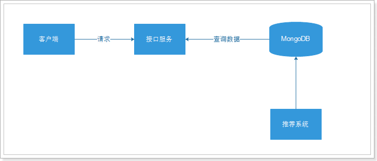

### 2.1. 部署MongoDB

~~~shell
#拉取镜像
docker pull mongo:4.0.3

#创建容器
docker create --name mongodb --restart=always -p 27017:27017 -v mongodb:/data/db mongo:4.0.3

#启动容器
docker start mongodb

#进入容器
docker exec -it mongodb /bin/bash

#使用MongoDB客户端进行操作
mongo
> show dbs #查询所有的数据库
admin 0.000GB
config 0.000GB
local 0.000GB
~~~

通过Robo进行查询：

 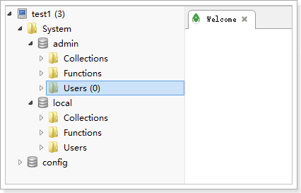

### 2.2 表结构设计

~~~shell
#表结构
{
  "userId":1001,  #推荐的用户id
  "toUserId":1002, #用户id
  "score":90,  #推荐得分
  "date":"2019/1/1" #日期
}
~~~

在MongoDB中只存储用户的id数据，其他的数据需要通过接口查询。

~~~java
//生成数据代码
@Test
public void testMongoDBData() {
    for (int i = 2; i < 100; i++) {
        int score = RandomUtils.nextInt(30, 99);
        System.out.println("db.recommend_user.insert({\"userId\":" + i + ",\"toUserId\":1,\"score\":"+score+",\"date\":\"2019/1/1\"})");
    }
}
~~~

~~~shell
#构造一些测试数据
use tanhua

db.recommend_user.insert({"userId":2,"toUserId":1,"score":77,"date":"2019/1/1"})
db.recommend_user.insert({"userId":3,"toUserId":1,"score":69,"date":"2019/1/1"})
db.recommend_user.insert({"userId":4,"toUserId":1,"score":70,"date":"2019/1/1"})
db.recommend_user.insert({"userId":5,"toUserId":1,"score":94,"date":"2019/1/1"})
db.recommend_user.insert({"userId":6,"toUserId":1,"score":44,"date":"2019/1/1"})
db.recommend_user.insert({"userId":7,"toUserId":1,"score":59,"date":"2019/1/1"})
db.recommend_user.insert({"userId":8,"toUserId":1,"score":46,"date":"2019/1/1"})
db.recommend_user.insert({"userId":9,"toUserId":1,"score":43,"date":"2019/1/1"})
db.recommend_user.insert({"userId":10,"toUserId":1,"score":82,"date":"2019/1/1"})
db.recommend_user.insert({"userId":11,"toUserId":1,"score":97,"date":"2019/1/1"})
db.recommend_user.insert({"userId":12,"toUserId":1,"score":52,"date":"2019/1/1"})
db.recommend_user.insert({"userId":13,"toUserId":1,"score":98,"date":"2019/1/1"})
db.recommend_user.insert({"userId":14,"toUserId":1,"score":58,"date":"2019/1/1"})
db.recommend_user.insert({"userId":15,"toUserId":1,"score":84,"date":"2019/1/1"})
db.recommend_user.insert({"userId":16,"toUserId":1,"score":93,"date":"2019/1/1"})
db.recommend_user.insert({"userId":17,"toUserId":1,"score":31,"date":"2019/1/1"})
db.recommend_user.insert({"userId":18,"toUserId":1,"score":96,"date":"2019/1/1"})
db.recommend_user.insert({"userId":19,"toUserId":1,"score":42,"date":"2019/1/1"})
db.recommend_user.insert({"userId":20,"toUserId":1,"score":77,"date":"2019/1/1"})
db.recommend_user.insert({"userId":21,"toUserId":1,"score":37,"date":"2019/1/1"})
db.recommend_user.insert({"userId":22,"toUserId":1,"score":82,"date":"2019/1/1"})
db.recommend_user.insert({"userId":23,"toUserId":1,"score":74,"date":"2019/1/1"})
db.recommend_user.insert({"userId":24,"toUserId":1,"score":74,"date":"2019/1/1"})
db.recommend_user.insert({"userId":25,"toUserId":1,"score":38,"date":"2019/1/1"})
db.recommend_user.insert({"userId":26,"toUserId":1,"score":84,"date":"2019/1/1"})
db.recommend_user.insert({"userId":27,"toUserId":1,"score":64,"date":"2019/1/1"})
db.recommend_user.insert({"userId":28,"toUserId":1,"score":69,"date":"2019/1/1"})
db.recommend_user.insert({"userId":29,"toUserId":1,"score":72,"date":"2019/1/1"})
db.recommend_user.insert({"userId":30,"toUserId":1,"score":68,"date":"2019/1/1"})
db.recommend_user.insert({"userId":31,"toUserId":1,"score":46,"date":"2019/1/1"})
db.recommend_user.insert({"userId":32,"toUserId":1,"score":93,"date":"2019/1/1"})
db.recommend_user.insert({"userId":33,"toUserId":1,"score":93,"date":"2019/1/1"})
db.recommend_user.insert({"userId":34,"toUserId":1,"score":33,"date":"2019/1/1"})
db.recommend_user.insert({"userId":35,"toUserId":1,"score":77,"date":"2019/1/1"})
db.recommend_user.insert({"userId":36,"toUserId":1,"score":35,"date":"2019/1/1"})
db.recommend_user.insert({"userId":37,"toUserId":1,"score":53,"date":"2019/1/1"})
db.recommend_user.insert({"userId":38,"toUserId":1,"score":62,"date":"2019/1/1"})
db.recommend_user.insert({"userId":39,"toUserId":1,"score":67,"date":"2019/1/1"})
db.recommend_user.insert({"userId":40,"toUserId":1,"score":93,"date":"2019/1/1"})
db.recommend_user.insert({"userId":41,"toUserId":1,"score":85,"date":"2019/1/1"})
db.recommend_user.insert({"userId":42,"toUserId":1,"score":46,"date":"2019/1/1"})
db.recommend_user.insert({"userId":43,"toUserId":1,"score":88,"date":"2019/1/1"})
db.recommend_user.insert({"userId":44,"toUserId":1,"score":51,"date":"2019/1/1"})
db.recommend_user.insert({"userId":45,"toUserId":1,"score":98,"date":"2019/1/1"})
db.recommend_user.insert({"userId":46,"toUserId":1,"score":57,"date":"2019/1/1"})
db.recommend_user.insert({"userId":47,"toUserId":1,"score":34,"date":"2019/1/1"})
db.recommend_user.insert({"userId":48,"toUserId":1,"score":44,"date":"2019/1/1"})
db.recommend_user.insert({"userId":49,"toUserId":1,"score":77,"date":"2019/1/1"})
db.recommend_user.insert({"userId":50,"toUserId":1,"score":88,"date":"2019/1/1"})
db.recommend_user.insert({"userId":51,"toUserId":1,"score":93,"date":"2019/1/1"})
db.recommend_user.insert({"userId":52,"toUserId":1,"score":56,"date":"2019/1/1"})
db.recommend_user.insert({"userId":53,"toUserId":1,"score":59,"date":"2019/1/1"})
db.recommend_user.insert({"userId":54,"toUserId":1,"score":93,"date":"2019/1/1"})
db.recommend_user.insert({"userId":55,"toUserId":1,"score":98,"date":"2019/1/1"})
db.recommend_user.insert({"userId":56,"toUserId":1,"score":71,"date":"2019/1/1"})
db.recommend_user.insert({"userId":57,"toUserId":1,"score":48,"date":"2019/1/1"})
db.recommend_user.insert({"userId":58,"toUserId":1,"score":54,"date":"2019/1/1"})
db.recommend_user.insert({"userId":59,"toUserId":1,"score":79,"date":"2019/1/1"})
db.recommend_user.insert({"userId":60,"toUserId":1,"score":89,"date":"2019/1/1"})
db.recommend_user.insert({"userId":61,"toUserId":1,"score":37,"date":"2019/1/1"})
db.recommend_user.insert({"userId":62,"toUserId":1,"score":70,"date":"2019/1/1"})
db.recommend_user.insert({"userId":63,"toUserId":1,"score":54,"date":"2019/1/1"})
db.recommend_user.insert({"userId":64,"toUserId":1,"score":53,"date":"2019/1/1"})
db.recommend_user.insert({"userId":65,"toUserId":1,"score":52,"date":"2019/1/1"})
db.recommend_user.insert({"userId":66,"toUserId":1,"score":34,"date":"2019/1/1"})
db.recommend_user.insert({"userId":67,"toUserId":1,"score":39,"date":"2019/1/1"})
db.recommend_user.insert({"userId":68,"toUserId":1,"score":59,"date":"2019/1/1"})
db.recommend_user.insert({"userId":69,"toUserId":1,"score":47,"date":"2019/1/1"})
db.recommend_user.insert({"userId":70,"toUserId":1,"score":39,"date":"2019/1/1"})
db.recommend_user.insert({"userId":71,"toUserId":1,"score":62,"date":"2019/1/1"})
db.recommend_user.insert({"userId":72,"toUserId":1,"score":58,"date":"2019/1/1"})
db.recommend_user.insert({"userId":73,"toUserId":1,"score":31,"date":"2019/1/1"})
db.recommend_user.insert({"userId":74,"toUserId":1,"score":63,"date":"2019/1/1"})
db.recommend_user.insert({"userId":75,"toUserId":1,"score":38,"date":"2019/1/1"})
db.recommend_user.insert({"userId":76,"toUserId":1,"score":78,"date":"2019/1/1"})
db.recommend_user.insert({"userId":77,"toUserId":1,"score":92,"date":"2019/1/1"})
db.recommend_user.insert({"userId":78,"toUserId":1,"score":70,"date":"2019/1/1"})
db.recommend_user.insert({"userId":79,"toUserId":1,"score":86,"date":"2019/1/1"})
db.recommend_user.insert({"userId":80,"toUserId":1,"score":92,"date":"2019/1/1"})
db.recommend_user.insert({"userId":81,"toUserId":1,"score":45,"date":"2019/1/1"})
db.recommend_user.insert({"userId":82,"toUserId":1,"score":42,"date":"2019/1/1"})
db.recommend_user.insert({"userId":83,"toUserId":1,"score":91,"date":"2019/1/1"})
db.recommend_user.insert({"userId":84,"toUserId":1,"score":54,"date":"2019/1/1"})
db.recommend_user.insert({"userId":85,"toUserId":1,"score":30,"date":"2019/1/1"})
db.recommend_user.insert({"userId":86,"toUserId":1,"score":75,"date":"2019/1/1"})
db.recommend_user.insert({"userId":87,"toUserId":1,"score":75,"date":"2019/1/1"})
db.recommend_user.insert({"userId":88,"toUserId":1,"score":80,"date":"2019/1/1"})
db.recommend_user.insert({"userId":89,"toUserId":1,"score":54,"date":"2019/1/1"})
db.recommend_user.insert({"userId":90,"toUserId":1,"score":32,"date":"2019/1/1"})
db.recommend_user.insert({"userId":91,"toUserId":1,"score":63,"date":"2019/1/1"})
db.recommend_user.insert({"userId":92,"toUserId":1,"score":75,"date":"2019/1/1"})
db.recommend_user.insert({"userId":93,"toUserId":1,"score":45,"date":"2019/1/1"})
db.recommend_user.insert({"userId":94,"toUserId":1,"score":73,"date":"2019/1/1"})
db.recommend_user.insert({"userId":95,"toUserId":1,"score":30,"date":"2019/1/1"})
db.recommend_user.insert({"userId":96,"toUserId":1,"score":97,"date":"2019/1/1"})
db.recommend_user.insert({"userId":97,"toUserId":1,"score":81,"date":"2019/1/1"})
db.recommend_user.insert({"userId":98,"toUserId":1,"score":64,"date":"2019/1/1"})
db.recommend_user.insert({"userId":99,"toUserId":1,"score":54,"date":"2019/1/1"})

#创建索引，toUserId：正序，score：倒序
db.recommend_user.createIndex({'toUserId':1,'score':-1})
~~~

 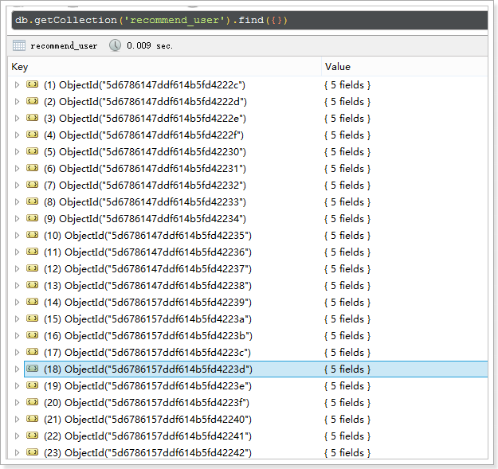

生成相应的用户信息数据：

~~~java
//生成数据的代码    
@Test
public void testMySQLData(){
    System.out.println("INSERT INTO `tb_user` (`id`, `mobile`, `password`, `created`, `updated`) VALUES ('1', '17602026868', 'e10adc3949ba59abbe56e057f20f883e', '2019-08-02 16:43:46', '2019-08-02 16:43:46');");
    System.out.println("INSERT INTO `tb_user` (`id`, `mobile`, `password`, `created`, `updated`) VALUES ('2', '15800807988', 'e10adc3949ba59abbe56e057f20f883e', '2019-08-02 16:50:32', '2019-08-02 16:50:32');");
    for (int i = 3; i < 100; i++) {
        String mobile = "13"+RandomStringUtils.randomNumeric(9);
        System.out.println("INSERT INTO `tb_user` (`id`, `mobile`, `password`, `created`, `updated`) VALUES ('"+i+"', '"+mobile+"', 'e10adc3949ba59abbe56e057f20f883e', '2019-08-02 16:43:46', '2019-08-02 16:43:46');");
    }
    System.out.println("INSERT INTO `tb_user_info` (`id`, `user_id`, `nick_name`, `logo`, `tags`, `sex`, `age`, `edu`, `city`, `birthday`, `cover_pic`, `industry`, `income`, `marriage`, `created`, `updated`) VALUES ('1', '1', 'heima', 'https://itcast-tanhua.oss-cn-shanghai.aliyuncs.com/images/logo/21.jpg', '单身,本科,年龄相仿', '1', '30', '本科', '北京市-北京城区-东城区', '2019-08-01', 'https://itcast-tanhua.oss-cn-shanghai.aliyuncs.com/images/logo/21.jpg', '计算机行业', '30', '已婚', '2019-08-02 16:44:23', '2019-08-02 16:44:23');");
    System.out.println("INSERT INTO `tb_user_info` (`id`, `user_id`, `nick_name`, `logo`, `tags`, `sex`, `age`, `edu`, `city`, `birthday`, `cover_pic`, `industry`, `income`, `marriage`, `created`, `updated`) VALUES ('2', '2', 'heima_2', 'https://itcast-tanhua.oss-cn-shanghai.aliyuncs.com/images/logo/22.jpg', '单身,本科,年龄相仿', '1', '30', '本科', '北京市-北京城区-东城区', '2019-08-01', 'https://itcast-tanhua.oss-cn-shanghai.aliyuncs.com/images/logo/22.jpg', '计算机行业', '30', '已婚', '2019-08-02 16:44:23', '2019-08-02 16:44:23');");

    for (int i = 3; i < 100; i++) {
        String logo = "https://itcast-tanhua.oss-cn-shanghai.aliyuncs.com/images/logo/"+RandomUtils.nextInt(1,20)+".jpg";
        System.out.println("INSERT INTO `tb_user_info` (`id`, `user_id`, `nick_name`, `logo`, `tags`, `sex`, `age`, `edu`, `city`, `birthday`, `cover_pic`, `industry`, `income`, `marriage`, `created`, `updated`) VALUES ('"+i+"', '"+i+"', 'heima_"+i+"', '"+logo+"', '单身,本科,年龄相仿', '1', '"+RandomUtils.nextInt(20,50)+"', '本科', '北京市-北京城区-东城区', '2019-08-01', '"+logo+"', '计算机行业', '40', '未婚', '2019-08-02 16:44:23', '2019-08-02 16:44:23');");
    }
}
~~~

> 生成的数据在资料目录中。


### 2.3 搭建工程

系统采用Dubbo构建，首先开发的是dubbo服务工程。

 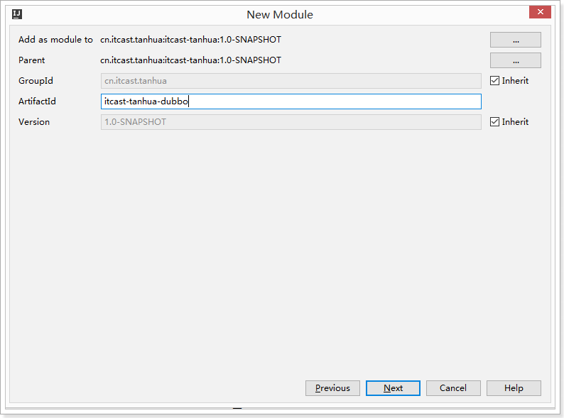

子工程（接口定义）：

 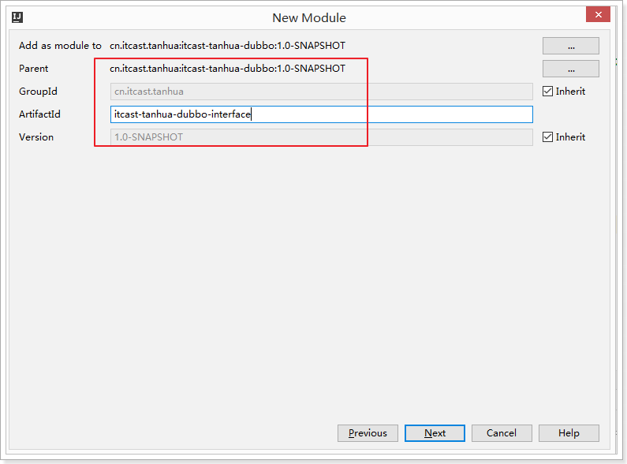

子工程（服务实现）：

 

pom.xml：

~~~xml
<?xml version="1.0" encoding="UTF-8"?>
<project xmlns="http://maven.apache.org/POM/4.0.0"
         xmlns:xsi="http://www.w3.org/2001/XMLSchema-instance"
         xsi:schemaLocation="http://maven.apache.org/POM/4.0.0 http://maven.apache.org/xsd/maven-4.0.0.xsd">
    <parent>
        <artifactId>itcast-tanhua</artifactId>
        <groupId>cn.itcast.tanhua</groupId>
        <version>1.0-SNAPSHOT</version>
    </parent>
    <modelVersion>4.0.0</modelVersion>

    <artifactId>itcast-tanhua-dubbo</artifactId>
    <packaging>pom</packaging>
    <modules>
        <module>itcast-tanhua-dubbo-interface</module>
        <module>itcast-tanhua-dubbo-service</module>
    </modules>

</project>
~~~

~~~xml
<?xml version="1.0" encoding="UTF-8"?>
<project xmlns="http://maven.apache.org/POM/4.0.0"
         xmlns:xsi="http://www.w3.org/2001/XMLSchema-instance"
         xsi:schemaLocation="http://maven.apache.org/POM/4.0.0 http://maven.apache.org/xsd/maven-4.0.0.xsd">
    <parent>
        <artifactId>itcast-tanhua-dubbo</artifactId>
        <groupId>cn.itcast.tanhua</groupId>
        <version>1.0-SNAPSHOT</version>
    </parent>
    <modelVersion>4.0.0</modelVersion>

    <artifactId>itcast-tanhua-dubbo-interface</artifactId>
    <dependencies>
        <dependency>
            <groupId>org.projectlombok</groupId>
            <artifactId>lombok</artifactId>
        </dependency>
        <dependency>
            <groupId>org.springframework.boot</groupId>
            <artifactId>spring-boot-starter-data-mongodb</artifactId>
        </dependency>
    </dependencies>

</project>
~~~

~~~xml
<?xml version="1.0" encoding="UTF-8"?>
<project xmlns="http://maven.apache.org/POM/4.0.0"
         xmlns:xsi="http://www.w3.org/2001/XMLSchema-instance"
         xsi:schemaLocation="http://maven.apache.org/POM/4.0.0 http://maven.apache.org/xsd/maven-4.0.0.xsd">
    <parent>
        <artifactId>itcast-tanhua-dubbo</artifactId>
        <groupId>cn.itcast.tanhua</groupId>
        <version>1.0-SNAPSHOT</version>
    </parent>
    <modelVersion>4.0.0</modelVersion>

    <artifactId>itcast-tanhua-dubbo-service</artifactId>

    <dependencies>
        <dependency>
            <groupId>cn.itcast.tanhua</groupId>
            <artifactId>itcast-tanhua-dubbo-interface</artifactId>
            <version>1.0-SNAPSHOT</version>
        </dependency>

        <dependency>
            <groupId>org.springframework.boot</groupId>
            <artifactId>spring-boot-starter</artifactId>
        </dependency>
        <dependency>
            <groupId>org.springframework.boot</groupId>
            <artifactId>spring-boot-starter-test</artifactId>
            <scope>test</scope>
        </dependency>

        <!--dubbo的springboot支持-->
        <dependency>
            <groupId>com.alibaba.boot</groupId>
            <artifactId>dubbo-spring-boot-starter</artifactId>
            <version>0.2.0</version>
        </dependency>
        <!--dubbo框架-->
        <dependency>
            <groupId>com.alibaba</groupId>
            <artifactId>dubbo</artifactId>
            <version>2.6.4</version>
        </dependency>
        <!--zk依赖-->
        <dependency>
            <groupId>org.apache.zookeeper</groupId>
            <artifactId>zookeeper</artifactId>
            <version>3.4.13</version>
        </dependency>
        <dependency>
            <groupId>com.github.sgroschupf</groupId>
            <artifactId>zkclient</artifactId>
            <version>0.1</version>
        </dependency>

        <!--MongoDB相关依赖-->
        <dependency>
            <groupId>org.springframework.boot</groupId>
            <artifactId>spring-boot-starter-data-mongodb</artifactId>
        </dependency>
        <dependency>
            <groupId>org.mongodb</groupId>
            <artifactId>mongodb-driver-sync</artifactId>
            <version>3.9.1</version>
        </dependency>

        <!--其他工具包依赖-->
        <dependency>
            <groupId>org.apache.commons</groupId>
            <artifactId>commons-lang3</artifactId>
        </dependency>
        <dependency>
            <groupId>joda-time</groupId>
            <artifactId>joda-time</artifactId>
            <version>2.9.9</version>
        </dependency>

        <dependency>
            <groupId>io.netty</groupId>
            <artifactId>netty-all</artifactId>
            <version>4.1.32.Final</version>
        </dependency>

    </dependencies>

</project>
~~~

~~~shell
########### ZK的部署安装 #################

#拉取zk镜像
docker pull zookeeper:3.5
#创建容器
docker create --name zk -p 2181:2181 zookeeper:3.5
#启动容器
docker start zk
~~~

### 2.3 编写dubbo服务

#### 2.3.1 编写接口

~~~java
package com.tanhua.dubbo.server.api;

import com.tanhua.dubbo.server.vo.PageInfo;
import com.tanhua.dubbo.server.pojo.RecommendUser;

public interface RecommendUserApi {

    /**
     * 查询一位得分最高的推荐用户
     *
     * @param userId
     * @return
     */
    RecommendUser queryWithMaxScore(Long userId);

    /**
     * 按照得分倒序
     *
     * @param userId
     * @param pageNum
     * @param pageSize
     * @return
     */
    PageInfo<RecommendUser> queryPageInfo(Long userId, Integer pageNum, Integer pageSize);
}

~~~

~~~java
package com.tanhua.dubbo.server.pojo;

import lombok.AllArgsConstructor;
import lombok.Data;
import lombok.NoArgsConstructor;
import org.bson.types.ObjectId;
import org.springframework.data.annotation.Id;
import org.springframework.data.mongodb.core.index.Indexed;
import org.springframework.data.mongodb.core.mapping.Document;

@Data
@NoArgsConstructor
@AllArgsConstructor
@Document(collection = "recommend_user")
public class RecommendUser implements java.io.Serializable{

    private static final long serialVersionUID = -4296017160071130962L;

    @Id
    private ObjectId id; //主键id
    @Indexed
    private Long userId; //推荐的用户id
    private Long toUserId; //用户id
    @Indexed
    private Double score; //推荐得分
    private String date; //日期
}
~~~

~~~java
package com.tanhua.dubbo.server.vo;

import lombok.AllArgsConstructor;
import lombok.Data;

import java.util.Collections;
import java.util.List;

@Data
@AllArgsConstructor
public class PageInfo<T> implements java.io.Serializable {

    private static final long serialVersionUID = -2105385689859184204L;

    /**
     * 总条数
     */
    private Integer total;

    /**
     * 当前页
     */
    private Integer pageNum;

    /**
     * 一页显示的大小
     */
    private Integer pageSize;

    /**
     * 数据列表
     */
    private List<T> records = Collections.emptyList();

}

~~~

#### 2.3.2 编写实现

application.properties:

~~~properties
# Spring boot application
spring.application.name = itcast-tanhua-dubbo-service

dubbo.scan.basePackages = com.tanhua.dubbo.server
dubbo.application.name = dubbo-provider-tanhua

dubbo.protocol.name = dubbo
dubbo.protocol.port = 20880

dubbo.registry.address = zookeeper://192.168.31.81:2181
dubbo.registry.client = zkclient

spring.data.mongodb.uri=mongodb://192.168.31.81:27017/tanhua
~~~


~~~java
package com.tanhua.dubbo.server.api;

import com.alibaba.dubbo.config.annotation.Service;
import com.tanhua.dubbo.server.pojo.RecommendUser;
import com.tanhua.dubbo.server.vo.PageInfo;
import org.springframework.beans.factory.annotation.Autowired;
import org.springframework.data.domain.PageRequest;
import org.springframework.data.domain.Sort;
import org.springframework.data.mongodb.core.MongoTemplate;
import org.springframework.data.mongodb.core.query.Criteria;
import org.springframework.data.mongodb.core.query.Query;

import java.util.List;

@Service(version = "1.0.0")
public class RecommendUserApiImpl implements RecommendUserApi {

    @Autowired
    private MongoTemplate mongoTemplate;

    @Override
    public RecommendUser queryWithMaxScore(Long userId) {
        Query query = Query.query(Criteria.where("toUserId").is(userId))
                .with(Sort.by(Sort.Order.desc("score"))).limit(1);
        return this.mongoTemplate.findOne(query, RecommendUser.class);
    }

    @Override
    public PageInfo<RecommendUser> queryPageInfo(Long userId, Integer pageNum, Integer pageSize) {
        PageRequest pageRequest = PageRequest.of(pageNum - 1, pageSize, Sort.by(Sort.Order.desc("score")));
        Query query = Query.query(Criteria.where("toUserId").is(userId)).with(pageRequest);
        List<RecommendUser> recommendUserList = this.mongoTemplate.find(query, RecommendUser.class);
        // 数据总数暂不提供，如前端需要再实现
        return new PageInfo<>(0, pageNum, pageSize, recommendUserList);
    }
}

~~~

~~~java
package com.tanhua.dubbo.server;

import org.springframework.boot.SpringApplication;
import org.springframework.boot.autoconfigure.SpringBootApplication;

@SpringBootApplication
public class DubboApplication {

    public static void main(String[] args) {
        SpringApplication.run(DubboApplication.class, args);
    }
}

~~~

#### 2.3.3 测试

~~~java
package com.tanhua.dubbo.server.api;

import com.tanhua.dubbo.server.pojo.RecommendUser;
import com.tanhua.dubbo.server.vo.PageInfo;
import org.junit.Test;
import org.junit.runner.RunWith;
import org.springframework.beans.factory.annotation.Autowired;
import org.springframework.boot.test.context.SpringBootTest;
import org.springframework.test.context.junit4.SpringJUnit4ClassRunner;

@SpringBootTest
@RunWith(SpringJUnit4ClassRunner.class)
public class TestRecommendUserApi {

    @Autowired
    private RecommendUserApi recommendUserApi;

    @Test
    public void testQueryWithMaxScore(){
        RecommendUser recommendUser = this.recommendUserApi.queryWithMaxScore(1L);
        System.out.println(recommendUser);
    }

    @Test
    public void testQueryPageInfo(){
        System.out.println(this.recommendUserApi.queryPageInfo(1L, 1, 3));
        System.out.println(this.recommendUserApi.queryPageInfo(1L, 2, 3));
        System.out.println(this.recommendUserApi.queryPageInfo(1L, 3, 3));
    }

}

~~~

### 2.4 搭建接口服务工程

#### 2.4.1 pom.xml

~~~xml
<?xml version="1.0" encoding="UTF-8"?>
<project xmlns="http://maven.apache.org/POM/4.0.0"
         xmlns:xsi="http://www.w3.org/2001/XMLSchema-instance"
         xsi:schemaLocation="http://maven.apache.org/POM/4.0.0 http://maven.apache.org/xsd/maven-4.0.0.xsd">
    <parent>
        <artifactId>itcast-tanhua</artifactId>
        <groupId>cn.itcast.tanhua</groupId>
        <version>1.0-SNAPSHOT</version>
    </parent>
    <modelVersion>4.0.0</modelVersion>

    <artifactId>itcast-tanhua-server</artifactId>
    <dependencies>
        <dependency>
            <groupId>cn.itcast.tanhua</groupId>
            <artifactId>itcast-tanhua-dubbo-interface</artifactId>
            <version>1.0-SNAPSHOT</version>
            <exclusions>
                <exclusion>
                    <groupId>org.springframework.boot</groupId>
                    <artifactId>spring-boot-starter-data-mongodb</artifactId>
                </exclusion>
            </exclusions>
        </dependency>
        <dependency>
            <groupId>org.springframework.boot</groupId>
            <artifactId>spring-boot-starter-web</artifactId>
        </dependency>
        <dependency>
            <groupId>org.springframework.boot</groupId>
            <artifactId>spring-boot-starter-test</artifactId>
            <scope>test</scope>
        </dependency>
        <dependency>
            <groupId>org.springframework.boot</groupId>
            <artifactId>spring-boot-starter-data-redis</artifactId>
        </dependency>
        <!--dubbo的springboot支持-->
        <dependency>
            <groupId>com.alibaba.boot</groupId>
            <artifactId>dubbo-spring-boot-starter</artifactId>
            <version>0.2.0</version>
        </dependency>
        <!--dubbo框架-->
        <dependency>
            <groupId>com.alibaba</groupId>
            <artifactId>dubbo</artifactId>
            <version>2.6.4</version>
        </dependency>
        <!--zk依赖-->
        <dependency>
            <groupId>org.apache.zookeeper</groupId>
            <artifactId>zookeeper</artifactId>
            <version>3.4.13</version>
        </dependency>
        <dependency>
            <groupId>com.github.sgroschupf</groupId>
            <artifactId>zkclient</artifactId>
            <version>0.1</version>
        </dependency>
        <!--其他工具包依赖-->
        <dependency>
            <groupId>org.apache.commons</groupId>
            <artifactId>commons-lang3</artifactId>
        </dependency>
        <dependency>
            <groupId>com.baomidou</groupId>
            <artifactId>mybatis-plus</artifactId>
        </dependency>
        <dependency>
            <groupId>com.baomidou</groupId>
            <artifactId>mybatis-plus-boot-starter</artifactId>
            <version>${mybatis.mybatis-plus}</version>
        </dependency>
        <dependency>
            <groupId>mysql</groupId>
            <artifactId>mysql-connector-java</artifactId>
        </dependency>
        <dependency>
            <groupId>commons-io</groupId>
            <artifactId>commons-io</artifactId>
            <version>2.6</version>
        </dependency>
        <dependency>
            <groupId>commons-codec</groupId>
            <artifactId>commons-codec</artifactId>
        </dependency>
    </dependencies>

</project>
~~~

#### 2.4.2 application.properties

~~~properties
spring.application.name = itcast-tanhua-server
server.port = 18081

spring.datasource.driver-class-name=com.mysql.jdbc.Driver
spring.datasource.url=jdbc:mysql://127.0.0.1:3306/tanhua?useUnicode=true&characterEncoding=utf8&autoReconnect=true&allowMultiQueries=true&useSSL=false
spring.datasource.username=root
spring.datasource.password=root


# 枚举包扫描
mybatis-plus.type-enums-package=com.tanhua.server.enums
# 表名前缀
mybatis-plus.global-config.db-config.table-prefix=tb_
# id策略为自增长
mybatis-plus.global-config.db-config.id-type=auto

dubbo.application.name = itcast-tanhua-server
dubbo.registry.address = zookeeper://192.168.31.81:2181
dubbo.registry.client = zkclient

tanhua.sso.url=http://127.0.0.1:18080
#默认今日佳人推荐用户
tanhua.sso.default.user=2
~~~

#### 2.4.3 ServerApplication

~~~java
package com.tanhua.server;

import org.mybatis.spring.annotation.MapperScan;
import org.springframework.boot.SpringApplication;
import org.springframework.boot.autoconfigure.SpringBootApplication;

@MapperScan("com.tanhua.server.mapper") //设置mapper接口的扫描包
@SpringBootApplication
public class ServerApplication {

    public static void main(String[] args) {
        SpringApplication.run(ServerApplication.class, args);
    }
}

~~~

#### 2.4.4 RestTemplateConfig

~~~java
package com.tanhua.server.config;

import org.springframework.context.annotation.Bean;
import org.springframework.context.annotation.Configuration;
import org.springframework.http.client.ClientHttpRequestFactory;
import org.springframework.http.client.SimpleClientHttpRequestFactory;
import org.springframework.http.converter.StringHttpMessageConverter;
import org.springframework.web.client.RestTemplate;

import java.nio.charset.Charset;

@Configuration
public class RestTemplateConfig {

    @Bean
    public RestTemplate restTemplate(ClientHttpRequestFactory factory) {
        RestTemplate restTemplate = new RestTemplate(factory);
        // 支持中文编码
        restTemplate.getMessageConverters().set(1, new StringHttpMessageConverter(Charset.forName("UTF-8")));
        return restTemplate;
    }

    @Bean
    public ClientHttpRequestFactory simpleClientHttpRequestFactory() {
        SimpleClientHttpRequestFactory factory = new SimpleClientHttpRequestFactory();
        factory.setReadTimeout(5000);//单位为ms
        factory.setConnectTimeout(5000);//单位为ms
        return factory;
    }
}
~~~

### 2.5 实现今日佳人服务

#### 2.5.1 mock服务

地址：https://mock.boxuegu.com/project/164/interface/api/64568

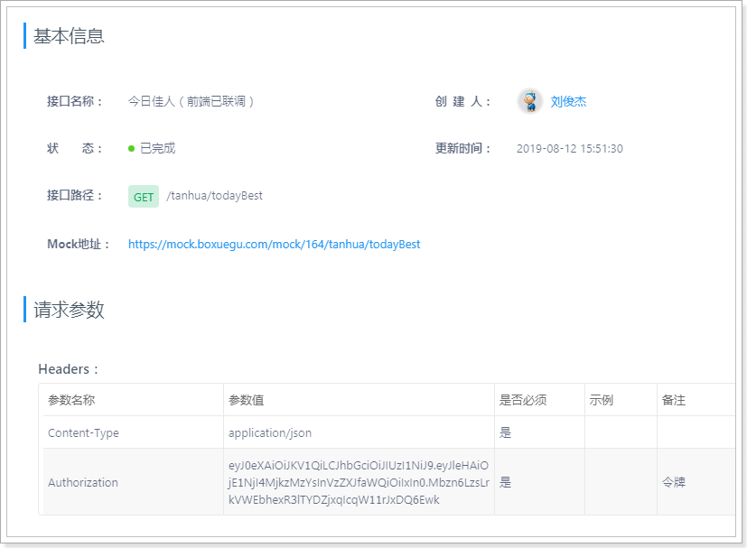


#### 2.5.2 基础代码

##### 2.5.2.1 SexEnum

~~~java
package com.tanhua.server.enums;

import com.baomidou.mybatisplus.core.enums.IEnum;

public enum SexEnum implements IEnum<Integer> {

    MAN(1,"男"),
    WOMAN(2,"女"),
    UNKNOWN(3,"未知");

    private int value;
    private String desc;

    SexEnum(int value, String desc) {
        this.value = value;
        this.desc = desc;
    }

    @Override
    public Integer getValue() {
        return this.value;
    }

    @Override
    public String toString() {
        return this.desc;
    }
}

~~~

##### 2.5.2.2 BasePojo

~~~java
package com.tanhua.server.pojo;

import com.baomidou.mybatisplus.annotation.FieldFill;
import com.baomidou.mybatisplus.annotation.TableField;

import java.util.Date;


public abstract class BasePojo {

    @TableField(fill = FieldFill.INSERT)
    private Date created;
    @TableField(fill = FieldFill.INSERT_UPDATE)
    private Date updated;
}

~~~

##### 2.5.2.3 User

~~~java
package com.tanhua.server.pojo;

import com.fasterxml.jackson.annotation.JsonIgnore;
import lombok.AllArgsConstructor;
import lombok.Data;
import lombok.NoArgsConstructor;

@Data
@NoArgsConstructor
@AllArgsConstructor
public class User extends BasePojo {

    private Long id;
    private String mobile; //手机号

    @JsonIgnore
    private String password; //密码，json序列化时忽略

}

~~~

##### 2.5.2.4、UserInfo

~~~java
package com.tanhua.server.pojo;

import com.tanhua.server.enums.SexEnum;
import lombok.AllArgsConstructor;
import lombok.Data;
import lombok.NoArgsConstructor;

@Data
@NoArgsConstructor
@AllArgsConstructor
public class UserInfo extends BasePojo {

    private Long id;
    private Long userId; //用户id
    private String nickName; //昵称
    private String logo; //用户头像
    private String tags; //用户标签：多个用逗号分隔
    private SexEnum sex; //性别
    private Integer age; //年龄
    private String edu; //学历
    private String city; //城市
    private String birthday; //生日
    private String coverPic; // 封面图片
    private String industry; //行业
    private String income; //收入
    private String marriage; //婚姻状态

}

~~~

#### 2.5.3 实现功能

实现描述：

- 需要根据前端定义的结构定义java对象
- 根据sso系统提供的接口查询当前登录用户的信息
- 根据dubbo系统提供的服务进行查询今日佳人数据

##### 2.5.3.1 TodayBest

~~~java
package com.tanhua.server.vo;

import lombok.AllArgsConstructor;
import lombok.Data;
import lombok.NoArgsConstructor;

/**
 * 今日佳人
 */
@Data
@NoArgsConstructor
@AllArgsConstructor
public class TodayBest {

    private Long id;
    private String avatar;
    private String nickname;
    private String gender; //性别 man woman
    private Integer age;
    private String[] tags;
    private Long fateValue; //缘分值

}
~~~

##### 2.5.3.2 TodayBestController

~~~java
package com.tanhua.server.controller;

import com.tanhua.server.service.TodayBestService;
import com.tanhua.server.vo.TodayBest;
import org.springframework.beans.factory.annotation.Autowired;
import org.springframework.web.bind.annotation.GetMapping;
import org.springframework.web.bind.annotation.RequestHeader;
import org.springframework.web.bind.annotation.RequestMapping;
import org.springframework.web.bind.annotation.RestController;

@RestController
@RequestMapping("todayBest")
public class TodayBestController {

    @Autowired
    private TodayBestService todayBestService;


    /**
     * 查询今日佳人
     *
     * @return
     */
    @GetMapping
    public TodayBest queryTodayBest(@RequestHeader("Authorization") String token){
        return this.todayBestService.queryTodayBest(token);
    }

}

~~~

##### 2.5.3.3 TodayBestService

~~~java
package com.tanhua.server.service;

import com.tanhua.server.pojo.User;
import com.tanhua.server.pojo.UserInfo;
import com.tanhua.server.vo.TodayBest;
import org.apache.commons.lang3.StringUtils;
import org.springframework.beans.factory.annotation.Autowired;
import org.springframework.beans.factory.annotation.Value;
import org.springframework.stereotype.Service;

@Service
public class TodayBestService {

    @Autowired
    private RecommendUserService recommendUserService;

    @Autowired
    private UserInfoService userInfoService;

    @Autowired
    private UserService userService;

    @Value("${tanhua.sso.default.user}")
    private Long defaultUser;

    public TodayBest queryTodayBest(String token) {
        //查询当前的登录信息
        User user = this.userService.queryUserByToken(token);
        if (null == user) {
            return null;
        }

        //查询今日佳人
        TodayBest todayBest = this.recommendUserService.queryTodayBest(user.getId());
        if (null == todayBest) {
            // 默认推荐用户
            todayBest = new TodayBest();
            todayBest.setId(defaultUser);
        }

        //补全信息
        UserInfo userInfo = this.userInfoService.queryById(user.getId());
        todayBest.setAge(userInfo.getAge());
        todayBest.setAvatar(userInfo.getLogo());
        todayBest.setGender(userInfo.getSex().toString());
        todayBest.setNickname(userInfo.getNickName());
        todayBest.setTags(StringUtils.split(userInfo.getTags(), ','));

        return todayBest;
    }
}

~~~

##### 2.5.3.4 UserService

~~~java
package com.tanhua.server.service;

import com.fasterxml.jackson.databind.ObjectMapper;
import com.tanhua.server.pojo.User;
import org.apache.commons.lang3.StringUtils;
import org.springframework.beans.factory.annotation.Autowired;
import org.springframework.beans.factory.annotation.Value;
import org.springframework.stereotype.Service;
import org.springframework.web.client.RestTemplate;

@Service
public class UserService {

    @Autowired
    private RestTemplate restTemplate;

    private static final ObjectMapper MAPPER = new ObjectMapper();

    @Value("${tanhua.sso.url}")
    private String url;

    public User queryUserByToken(String token) {
        String data = this.restTemplate.getForObject(url + "/user/{token}", String.class, token);
        if (StringUtils.isNotEmpty(data)) {
            try {
                return MAPPER.readValue(data, User.class);
            } catch (Exception e) {
                e.printStackTrace();
            }
        }
        return null;
    }
}

~~~

##### 2.5.3.5、RecommendUserService

~~~java
package com.tanhua.server.service;

import com.alibaba.dubbo.config.annotation.Reference;
import com.tanhua.dubbo.server.api.RecommendUserApi;
import com.tanhua.dubbo.server.pojo.RecommendUser;
import com.tanhua.server.vo.TodayBest;
import org.springframework.stereotype.Service;

@Service
public class RecommendUserService {

    @Reference(version = "1.0.0")
    private RecommendUserApi recommendUserApi;

    /**
     * 根据用户id查询今日佳人
     *
     * @param id
     * @return
     */
    public TodayBest queryTodayBest(Long id) {
        RecommendUser recommendUser = this.recommendUserApi.queryWithMaxScore(id);
        if(null != recommendUser){
            TodayBest todayBest = new TodayBest();
            todayBest.setId(recommendUser.getUserId()); //推荐结果的用户id

            double score = Math.floor(recommendUser.getScore());//取整,98.2 -> 98
            todayBest.setFateValue(Double.valueOf(score).longValue());
            return todayBest;
        }

        return null;
    }
}

~~~

##### 2.5.3.6 UserInfoService

~~~java
package com.tanhua.server.service;

import com.baomidou.mybatisplus.core.conditions.query.QueryWrapper;
import com.tanhua.server.mapper.UserInfoMapper;
import com.tanhua.server.pojo.UserInfo;
import org.springframework.beans.factory.annotation.Autowired;
import org.springframework.stereotype.Service;

@Service
public class UserInfoService {

    @Autowired
    private UserInfoMapper userInfoMapper;

    public UserInfo queryById(Long id) {
        QueryWrapper<UserInfo> queryWrapper = new QueryWrapper<>();
        queryWrapper.eq("user_id", id);
        return this.userInfoMapper.selectOne(queryWrapper);
    }
}

~~~

##### 2.5.3.7 UserInfoMapper

~~~java
package com.tanhua.server.mapper;

import com.baomidou.mybatisplus.core.mapper.BaseMapper;
import com.tanhua.common.pojo.UserInfo;

public interface UserInfoMapper extends BaseMapper<UserInfo> {
}

~~~

#### 2.5.4 测试

单元测试，测试dubbo服务：

~~~java
package com.tanhua.server;

import com.tanhua.server.service.RecommendUserService;
import com.tanhua.server.vo.TodayBest;
import org.junit.Test;
import org.junit.runner.RunWith;
import org.springframework.beans.factory.annotation.Autowired;
import org.springframework.boot.test.context.SpringBootTest;
import org.springframework.test.context.junit4.SpringJUnit4ClassRunner;

@SpringBootTest
@RunWith(SpringJUnit4ClassRunner.class)
public class TestRecommendUserApi {

    @Autowired
    private RecommendUserService recommendUserService;

    @Test
    public void testQueryTodayBest(){
        TodayBest todayBest = this.recommendUserService.queryTodayBest(1L);
        System.out.println(todayBest);
    }

}

~~~

整合功能测试，需要将sso、dubbo服务启动完成后进行测试。

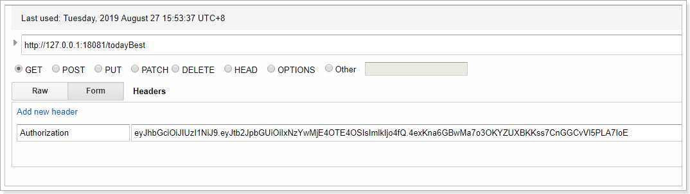

结果：

 

> **实现过程中，枚举的bug：**
>
> **由于之前设计的tb_user_info表中，sex字段类型为tinyint，导致枚举类型在读取数据时不能正确映射数据，需要将类型改为int。**

#### 2.5.5 解决MongoDB启动bug

在项目中，添加了mongo的依赖的话，springboot就会自动去连接本地的mongo，由于他连接不上会导致出错。

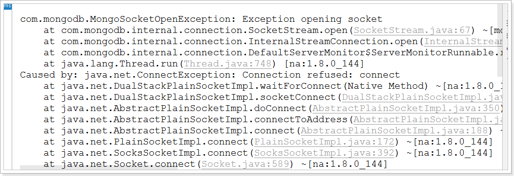

解决有2种方案：

- 排除掉mongo的依赖

- springboot中添加排除自动配置的注解

  ~~~java
  @MapperScan("com.tanhua.server.mapper") //设置mapper接口的扫描包
  @SpringBootApplication(exclude = {MongoAutoConfiguration.class, MongoDataAutoConfiguration.class}) //排除mongo的自动配置
  public class ServerApplication {
  
      public static void main(String[] args) {
          SpringApplication.run(ServerApplication.class, args);
      }
  }
  ~~~


#### 2.5.6 安装 Dubbo-admin

```shell
# 安装
docker run --detach \
--restart always \
--name dubbo-admin \
--publish 8088:8080 \
-e admin.registry.address=zookeeper://192.168.100.100:2181 \
-e admin.config-center=zookeeper://192.168.100.100:2181 \
-e admin.metadata-report.address=zookeeper://192.168.100.100:2181 \
apache/dubbo-admin:0.1.0

# 重启
docker restart dubbo-admin
# 关闭
docker stop dubbo-admin
# 卸载
docker rm dubbo-admin
```


### 2.6 统一接口服务入口

现在我们有sso和server需要对外提供接口服务，而在前端只能设置一个请求地址，所以我们需要将服务接口统一下，需要使用nginx进行统一入口。

#### 2.6.1 部署安装nginx

安装包在资料中：nginx-1.17.3.zip

安装在任意目录，通过命令：start nginx.exe 启动：

 

重启加载配置文件命令：nginx.exe -s reload

 

#### 2.6.2 修改配置

修改conf目录下的nginx.conf文件：

~~~shell
server {
    listen       80;
    server_name  localhost;

    #charset koi8-r;

    #access_log  logs/host.access.log  main;

    #location / {
    #    root   html;
    #    index  index.html index.htm;
    #}

    #error_page  404              /404.html;

    error_page   500 502 503 504  /50x.html;
    location = /50x.html {
        root   html;
    }

    location /user {
        proxy_pass   http://127.0.0.1:18080;
    }

    location / {
        proxy_pass   http://127.0.0.1:18081;
    }

}
~~~

#### 2.6.3 测试

 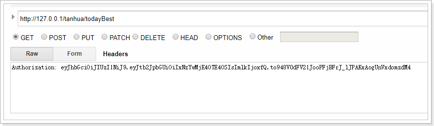

 

## 3. 推荐列表

 

### 3.1 mock接口

地址：https://mock.boxuegu.com/project/164/interface/api/64561

 

 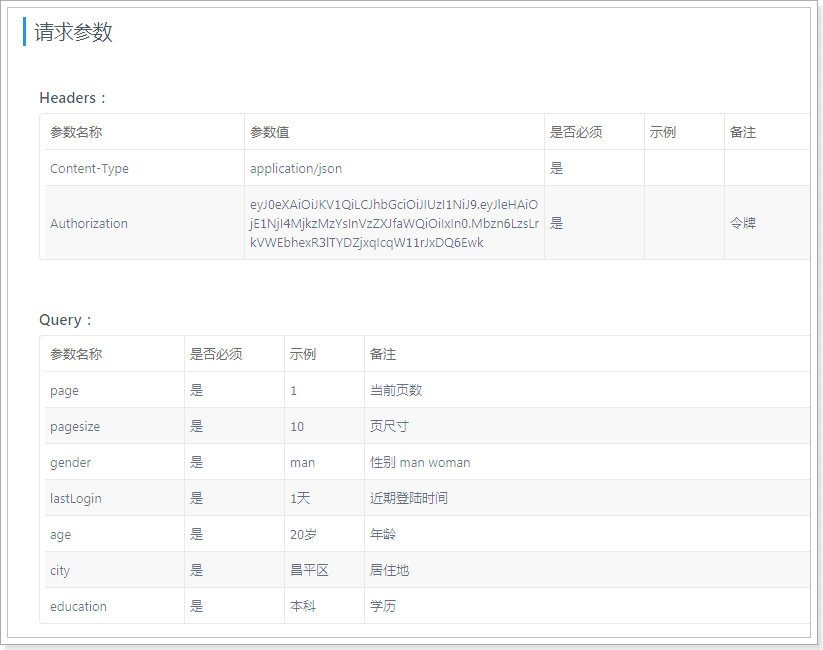

响应：

~~~json
{
    "counts": 4698,
    "pagesize": 20,
    "pages": 58,
    "page": 16,
    "items": [
        {
            "id": 1011,
            "avatar": "assets/images/avatar_2.png",
            "nickname": "黑马小妹",
            "gender": "woman",
            "age": 23,
            "tags": [
                "本科",
                "年龄相仿",
                "单身"
            ],
            "fateValue": 96
        },
        {
            "id": 2495,
            "avatar": "assets/images/avatar_1.png",
            "nickname": "米朵妹妹",
            "gender": "man",
            "age": 28,
            "tags": [
                "年龄相仿",
                "本科",
                "单身"
            ],
            "fateValue": 87
        },
        {
            "id": 5708,
            "avatar": "assets/images/avatar_4.png",
            "nickname": "黑马小妹",
            "gender": "man",
            "age": 24,
            "tags": [
                "单身",
                "本科",
                "年龄相仿"
            ],
            "fateValue": 94
        },
        {
            "id": 4768,
            "avatar": "assets/images/avatar_3.png",
            "nickname": "黑马小妹",
            "gender": "man",
            "age": 24,
            "tags": [
                "年龄相仿",
                "单身",
                "本科"
            ],
            "fateValue": 80
        }
    ]
}
~~~

### 3.2 查询参数对象

~~~java
package com.tanhua.server.vo;

import lombok.AllArgsConstructor;
import lombok.Data;
import lombok.NoArgsConstructor;

@Data
@NoArgsConstructor
@AllArgsConstructor
public class RecommendUserQueryParam {

    private Integer page = 1; //当前页数
    private Integer pagesize = 10; //页尺寸
    private String gender; //性别 man woman
    private String lastLogin; //近期登陆时间
    private Integer age; //年龄
    private String city; //居住地
    private String education; //学历
}

~~~

### 3.3 结果对象

~~~java
package com.tanhua.server.vo;

import lombok.AllArgsConstructor;
import lombok.Data;
import lombok.NoArgsConstructor;

import java.util.List;

@Data
@AllArgsConstructor
@NoArgsConstructor
public class PageResult {

    private Integer counts;//总记录数
    private Integer pagesize;//页大小
    private Integer pages;//总页数
    private Integer page;//当前页码
    private List<?> items; //列表

}
~~~

### 3.4 Controller

~~~java
    /**
     * 推荐列表
     *
     * @return
     */
    @GetMapping("recommendation")
    public PageResult queryRecommendUserList(RecommendUserQueryParam queryParam, @RequestHeader("Authorization") String token) {
        return this.todayBestService.queryRecommendUserList(queryParam, token);
    }
~~~

### 3.5 Service

~~~java
/**
    * 查询推荐用户列表
    *
    * @param queryParam
    * @param token
    * @return
    */
   public PageResult queryRecommendUserList(RecommendUserQueryParam queryParam, String token) {
       //查询当前的登录信息
       User user = this.userService.queryUserByToken(token);
       if (null == user) {
           return null;
       }
       PageResult pageResult = new PageResult();
       PageInfo<RecommendUser> pageInfo = this.recommendUserService.queryRecommendUserList(user.getId(), queryParam.getPage(), queryParam.getPagesize());
       pageResult.setCounts(0); //前端不参与计算，仅需要返回字段
       pageResult.setPage(queryParam.getPage());
       pageResult.setPagesize(queryParam.getPagesize());
       List<RecommendUser> records = pageInfo.getRecords();
       List<Long> userIds = new ArrayList<>();
       for (RecommendUser record : records) {
           userIds.add(record.getUserId());
       }
       QueryWrapper<UserInfo> queryWrapper = new QueryWrapper<>();
       queryWrapper.in("user_id", userIds);
       if (StringUtils.isNotEmpty(queryParam.getGender())) { //性别条件
           if (queryParam.getGender().equals("man")) {
               queryWrapper.eq("sex", 1);
           } else {
               queryWrapper.eq("sex", 2);
           }
       }
       if (StringUtils.isNotEmpty(queryParam.getCity())) { //居住城市
           queryWrapper.eq("city", queryParam.getCity());
       }
       if (queryParam.getAge() != null) { //年龄
           queryWrapper.lt("age", queryParam.getAge());
       }
       List<UserInfo> userInfos = this.userInfoService.queryList(queryWrapper);
       List<TodayBest> todayBests = new ArrayList<>();
       for (UserInfo userInfo : userInfos) {
           TodayBest todayBest = new TodayBest();
           todayBest.setAge(userInfo.getAge());
           todayBest.setAvatar(userInfo.getLogo());
           todayBest.setGender(userInfo.getSex().name().toLowerCase());
           todayBest.setNickname(userInfo.getNickName());
           todayBest.setTags(StringUtils.split(userInfo.getTags(), ','));
           //设置缘分值
           for (RecommendUser record : records) {
               if(userInfo.getUserId().longValue() == record.getUserId().longValue()){
                   double score = Math.floor(record.getScore());
                   todayBest.setFateValue(Double.valueOf(score).longValue());
                   break;
               }
           }
           todayBests.add(todayBest);
       }
       //排序集合，按照score倒序排序
       Collections.sort(todayBests, (o1, o2) -> new Long(o2.getFateValue() - o1.getFateValue()).intValue());
       pageResult.setItems(todayBests);
       return pageResult;
   }
~~~

~~~java
//RecommendUserService
public PageInfo<RecommendUser> queryRecommendUserList(Long id, Integer page, Integer pagesize) {
    return this.recommendUserApi.queryPageInfo(id, page, pagesize);
}
~~~

~~~java
//UserInfoService
/**
 * 查询用户信息列表
 *
 * @param queryWrapper
 * @return
 */
public List<UserInfo> queryUserInfoList(QueryWrapper queryWrapper) {
    return this.userInfoMapper.selectList(queryWrapper);
}
~~~

### 3.6 测试


 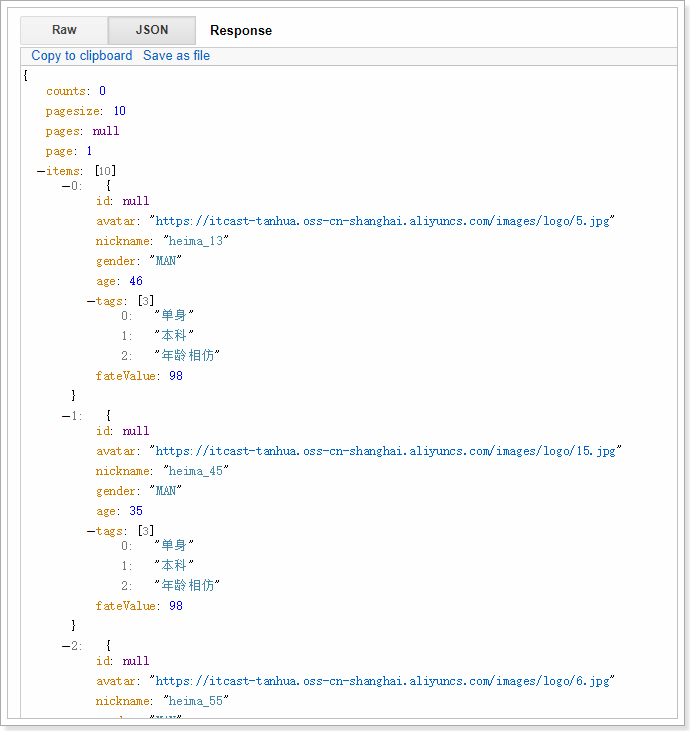

## 4. 缓存

实现缓存逻辑有2种方式：
1. 每个接口单独控制缓存逻辑
2. 统一控制缓存逻辑（推荐）

### 4.1 采用拦截器进行缓存命中

编写拦截器：RedisCacheInterceptor。

~~~java
package com.tanhua.server.interceptor;

import com.fasterxml.jackson.databind.ObjectMapper;
import org.apache.commons.codec.digest.DigestUtils;
import org.apache.commons.io.IOUtils;
import org.apache.commons.lang3.StringUtils;
import org.springframework.beans.factory.annotation.Autowired;
import org.springframework.beans.factory.annotation.Value;
import org.springframework.data.redis.core.RedisTemplate;
import org.springframework.stereotype.Component;
import org.springframework.web.servlet.HandlerInterceptor;

import javax.servlet.http.HttpServletRequest;
import javax.servlet.http.HttpServletResponse;
import java.util.Map;

@Component
public class RedisCacheInterceptor implements HandlerInterceptor {

    private static ObjectMapper mapper = new ObjectMapper();

    @Autowired
    private RedisTemplate<String, String> redisTemplate;

    @Value("${tanhua.cache.enable}")
    private Boolean enable;

    @Override
    public boolean preHandle(HttpServletRequest request, HttpServletResponse response, Object handler) throws Exception {

        if (!enable) {
            //未开启缓存
            return true;
        }

        String method = request.getMethod();
        if (!StringUtils.equalsAnyIgnoreCase(method, "GET")) {
            // 非GET的请求不进行缓存处理
            return true;
        }

        // 通过缓存做命中，查询redis，redisKey ?  组成：md5（请求的url + 请求参数）
        String redisKey = createRedisKey(request);
        String data = this.redisTemplate.opsForValue().get(redisKey);
        if (StringUtils.isEmpty(data)) {
            // 缓存未命中
            return true;
        }

        // 将data数据进行响应
        response.setCharacterEncoding("UTF-8");
        response.setContentType("application/json; charset=utf-8");
        response.getWriter().write(data);

        return false;
    }

    public static String createRedisKey(HttpServletRequest request) throws
            Exception {
        String paramStr = request.getRequestURI();
        Map<String, String[]> parameterMap = request.getParameterMap();
        if (parameterMap.isEmpty()) {
            //请求体的数据只能读取一次，需要进行包装Request进行解决
            paramStr += IOUtils.toString(request.getInputStream(), "UTF-8");
        } else {
            paramStr += mapper.writeValueAsString(request.getParameterMap());
        }

        String authorization = request.getHeader("Authorization");
        if (StringUtils.isNotEmpty((authorization))) {
            paramStr += "_" + authorization;
        }

        return "SERVER_DATA_" + DigestUtils.md5Hex(paramStr);
    }
}

~~~

application.properties：

~~~properties
#是否开启数据缓存
tanhua.cache.enable=false

# Redis相关配置
spring.redis.jedis.pool.max-wait = 5000ms
spring.redis.jedis.pool.max-Idle = 100
spring.redis.jedis.pool.min-Idle = 10
spring.redis.timeout = 10s
spring.redis.cluster.nodes = 172.16.55.155:6379,172.16.55.155:6380,172.16.55.155:6381
spring.redis.cluster.max-redirects=5
~~~

注册拦截器到Spring容器：

~~~java
package com.tanhua.server.config;

import com.tanhua.server.interceptor.RedisCacheInterceptor;
import org.springframework.beans.factory.annotation.Autowired;
import org.springframework.context.annotation.Configuration;
import org.springframework.web.servlet.config.annotation.InterceptorRegistry;
import org.springframework.web.servlet.config.annotation.WebMvcConfigurer;

@Configuration
public class WebConfig implements WebMvcConfigurer {

    @Autowired
    private RedisCacheInterceptor redisCacheInterceptor;

    @Override
    public void addInterceptors(InterceptorRegistry registry) {
        registry.addInterceptor(this.redisCacheInterceptor).addPathPatterns("/**");
    }
}
~~~

### 4.2 包装request对象

由于在拦截器中读取了输入流的数据，在request中的输入流只能读取一次，请求进去Controller时，输入流中已经没有数据了，导致获取不到数据。

编写HttpServletRequest的包装类：

~~~java
package com.tanhua.server.interceptor;

import org.apache.commons.io.IOUtils;

import javax.servlet.ReadListener;
import javax.servlet.ServletInputStream;
import javax.servlet.http.HttpServletRequest;
import javax.servlet.http.HttpServletRequestWrapper;
import java.io.BufferedReader;
import java.io.IOException;
import java.io.InputStreamReader;

/**
 * 包装HttpServletRequest
 */
public class MyServletRequestWrapper extends HttpServletRequestWrapper {

    private final byte[] body;

    /**
     * Construct a wrapper for the specified request.
     *
     * @param request The request to be wrapped
     */
    public MyServletRequestWrapper(HttpServletRequest request) throws IOException {
        super(request);
        body = IOUtils.toByteArray(super.getInputStream());
    }

    @Override
    public BufferedReader getReader() throws IOException {
        return new BufferedReader(new InputStreamReader(getInputStream()));
    }

    @Override
    public ServletInputStream getInputStream() throws IOException {
        return new RequestBodyCachingInputStream(body);
    }

    private class RequestBodyCachingInputStream extends ServletInputStream {
        private byte[] body;
        private int lastIndexRetrieved = -1;
        private ReadListener listener;

        public RequestBodyCachingInputStream(byte[] body) {
            this.body = body;
        }

        @Override
        public int read() throws IOException {
            if (isFinished()) {
                return -1;
            }
            int i = body[lastIndexRetrieved + 1];
            lastIndexRetrieved++;
            if (isFinished() && listener != null) {
                try {
                    listener.onAllDataRead();
                } catch (IOException e) {
                    listener.onError(e);
                    throw e;
                }
            }
            return i;
        }

        @Override
        public boolean isFinished() {
            return lastIndexRetrieved == body.length - 1;
        }

        @Override
        public boolean isReady() {
            // This implementation will never block
            // We also never need to call the readListener from this method, as this method will never return false
            return isFinished();
        }

        @Override
        public void setReadListener(ReadListener listener) {
            if (listener == null) {
                throw new IllegalArgumentException("listener cann not be null");
            }
            if (this.listener != null) {
                throw new IllegalArgumentException("listener has been set");
            }
            this.listener = listener;
            if (!isFinished()) {
                try {
                    listener.onAllDataRead();
                } catch (IOException e) {
                    listener.onError(e);
                }
            } else {
                try {
                    listener.onAllDataRead();
                } catch (IOException e) {
                    listener.onError(e);
                }
            }
        }

        @Override
        public int available() throws IOException {
            return body.length - lastIndexRetrieved - 1;
        }

        @Override
        public void close() throws IOException {
            lastIndexRetrieved = body.length - 1;
            body = null;
        }
    }
}
~~~

通过过滤器进行包装request对象：

~~~java
package com.tanhua.server.interceptor;

import org.springframework.stereotype.Component;
import org.springframework.web.filter.OncePerRequestFilter;

import javax.servlet.FilterChain;
import javax.servlet.ServletException;
import javax.servlet.http.HttpServletRequest;
import javax.servlet.http.HttpServletResponse;
import java.io.IOException;

/**
 * 替换Request对象
 */
@Component
public class RequestReplaceFilter extends OncePerRequestFilter {

    @Override
    protected void doFilterInternal(HttpServletRequest request, HttpServletResponse response, FilterChain filterChain) throws ServletException, IOException {
        if (!(request instanceof MyServletRequestWrapper)) {
            request = new MyServletRequestWrapper(request);
        }
        filterChain.doFilter(request, response);
    }
}
~~~

测试：

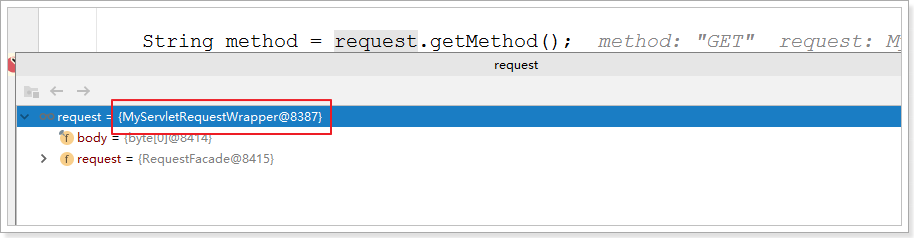

### 4.3 响应结果写入到缓存

前面已经完成了缓存命中的逻辑，那么在查询到数据后，如果将结果写入到缓存呢？

> 思考：通过拦截器可以实现吗？

通过ResponseBodyAdvice进行实现。

ResponseBodyAdvice是Spring提供的高级用法，会在结果被处理前进行拦截，拦截的逻辑自己实现，这样就可以
实现拿到结果数据进行写入缓存的操作了。

具体实现：

~~~java
package com.tanhua.server.interceptor;

import com.fasterxml.jackson.databind.ObjectMapper;
import org.springframework.beans.factory.annotation.Autowired;
import org.springframework.core.MethodParameter;
import org.springframework.data.redis.core.RedisTemplate;
import org.springframework.http.MediaType;
import org.springframework.http.server.ServerHttpRequest;
import org.springframework.http.server.ServerHttpResponse;
import org.springframework.http.server.ServletServerHttpRequest;
import org.springframework.web.bind.annotation.ControllerAdvice;
import org.springframework.web.bind.annotation.GetMapping;
import org.springframework.web.bind.annotation.PostMapping;
import org.springframework.web.servlet.mvc.method.annotation.ResponseBodyAdvice;

import java.time.Duration;

@ControllerAdvice
public class MyResponseBodyAdvice implements ResponseBodyAdvice {

    @Autowired
    private RedisTemplate<String, String> redisTemplate;

    private ObjectMapper mapper = new ObjectMapper();

    @Override
    public boolean supports(MethodParameter returnType, Class converterType) {
        // 考虑到post请求是写入数据操作，所以就不进行缓存了，只针对get进行处理
        return returnType.hasMethodAnnotation(GetMapping.class);
//        return returnType.hasMethodAnnotation(GetMapping.class) || returnType.hasMethodAnnotation(PostMapping.class);
    }

    @Override
    public Object beforeBodyWrite(Object body, MethodParameter returnType, MediaType selectedContentType, Class selectedConverterType, ServerHttpRequest request, ServerHttpResponse response) {
        if(null == body){
            return null;
        }
        try {
            String redisKey = RedisCacheInterceptor.createRedisKey(((ServletServerHttpRequest) request).getServletRequest());
            String redisValue;
            if (body instanceof String) {
                redisValue = (String) body;
            } else {
                redisValue = mapper.writeValueAsString(body);
            }
            //存储到redis中
            this.redisTemplate.opsForValue().set(redisKey, redisValue, Duration.ofHours(1));
        } catch (Exception e) {
            e.printStackTrace();
        }
        return body;
    }
}

~~~

测试：


到目前为止，缓存逻辑添加完成。

## 5. 整合测试

将资料中的app-debug-004.apk进行安装，并且修改服务地址进行测试。

 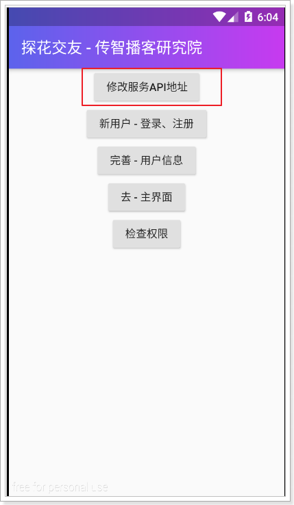

修改为本机的地址：

 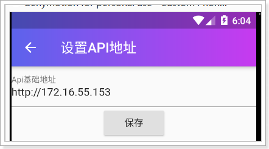

接下来，进行登录测试：

 

