## 课程说明

- 圈子推荐功能说明
- 圈子推荐功能流程
- 圈子推荐功能的实现
- 小视频推荐功能的实现

## 1. 圈子推荐

### 1.1 功能说明

在圈子功能中，针对于用户发布的动态信息，系统可以根据用户的发布、浏览、点赞等操作，对动态信息做计算，然后对每个用户进行不同的推荐。

### 1.2 流程说明

 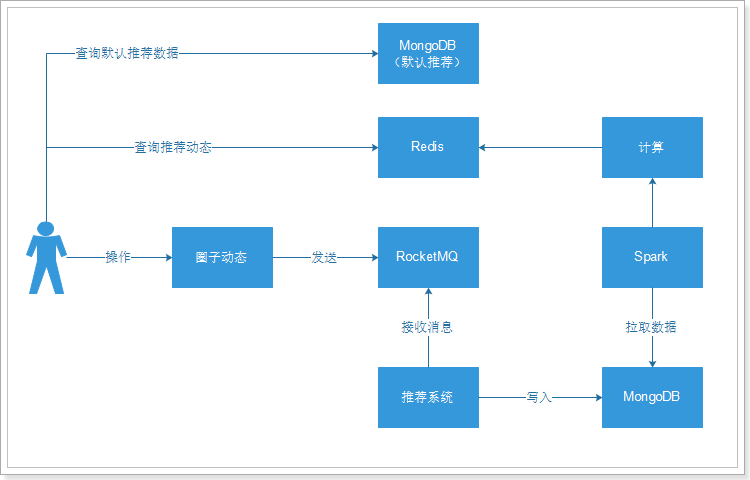

流程说明：

- 用户对圈子的动态操作，如：发布、浏览、点赞、喜欢等，就会给RocketMQ进行发送消息；
- 推荐系统接收消息，并且处理消息数据，处理之后将结果数据写入到MongoDB中；
- Spark系统拉取数据，然后进行推荐计算；
- 计算之后的结果数据写入到Redis中，为每个用户都进行个性化推荐；
- 如果有用户没有数据的，查询MongoDB中的默认数据；

### 1.3 动态增加自增id

由于我们使用的推荐模型中，动态id需要是Long类型的，而我们之前使用的ObjectId类型的，所以需要增加Long类型的id。

#### 1.3.1 修改Publish对象

~~~java
package com.tanhua.dubbo.server.pojo;

import lombok.AllArgsConstructor;
import lombok.Data;
import lombok.NoArgsConstructor;
import org.bson.types.ObjectId;
import org.springframework.data.mongodb.core.mapping.Document;

import java.util.Date;
import java.util.List;

/**
 * 发布表，动态内容
 */
@Data
@NoArgsConstructor
@AllArgsConstructor
@Document(collection = "quanzi_publish")
public class Publish implements java.io.Serializable {

    private static final long serialVersionUID = 8732308321082804771L;

    private ObjectId id; //主键id
    private Long pid; //Long类型的id，用于推荐引擎使用
    private Long userId;
    private String text; //文字
    private List<String> medias; //媒体数据，图片或小视频 url
    private Integer seeType; // 谁可以看，1-公开，2-私密，3-部分可见，4-不给谁看
    private List<Long> seeList; //部分可见的列表
    private List<Long> notSeeList; //不给谁看的列表
    private String longitude; //经度
    private String latitude; //纬度
    private String locationName; //位置名称
    private Long created; //发布时间

}

~~~

#### 1.3.2 修改发布逻辑

~~~java
@Override
    public String savePublish(Publish publish) {

        // 校验
        if (publish.getUserId() == null) {
            return null;
        }

        try {
            publish.setCreated(System.currentTimeMillis()); //设置创建时间
            publish.setId(ObjectId.get()); //设置id
            publish.setPid(this.idService.createId("publish", publish.getId().toHexString()));

            this.mongoTemplate.save(publish); //保存发布

            Album album = new Album(); // 构建相册对象
            album.setPublishId(publish.getId());
            album.setCreated(System.currentTimeMillis());
            album.setId(ObjectId.get());
            this.mongoTemplate.save(album, "quanzi_album_" + publish.getUserId());

            //写入好友的时间线中
            Criteria criteria = Criteria.where("userId").is(publish.getUserId());
            List<Users> users = this.mongoTemplate.find(Query.query(criteria), Users.class);
            for (Users user : users) {
                TimeLine timeLine = new TimeLine();
                timeLine.setId(ObjectId.get());
                timeLine.setPublishId(publish.getId());
                timeLine.setUserId(user.getUserId());
                timeLine.setDate(System.currentTimeMillis());
                this.mongoTemplate.save(timeLine, "quanzi_time_line_" + user.getFriendId());
            }

            return publish.getId().toHexString();
        } catch (Exception e) {
            e.printStackTrace();
            //TODO 出错的事务回滚
        }

        return null;
    }
~~~

~~~java
package com.tanhua.dubbo.server.service;

import org.apache.commons.lang3.StringUtils;
import org.springframework.beans.factory.annotation.Autowired;
import org.springframework.data.redis.core.RedisTemplate;
import org.springframework.stereotype.Service;

//生成自增长的id，原理：使用redis的自增长值
@Service
public class IdService {

    @Autowired
    private RedisTemplate<String, String> redisTemplate;

    public Long createId(String type, String strId) {
        type = StringUtils.upperCase(type);

        String idHashKey = "TANHUA_ID_HASH_" + type;
        if (this.redisTemplate.opsForHash().hasKey(idHashKey, strId)) {
            return Long.valueOf(this.redisTemplate.opsForHash().get(idHashKey, strId).toString());
        }

        String idKey = "TANHUA_ID_" + type;
        Long id = this.redisTemplate.opsForValue().increment(idKey);

        this.redisTemplate.opsForHash().put(idHashKey, strId, id.toString());

        return id;
    }

}
~~~

itcast-tanhua-dubbo-service需要增加Redis依赖：

~~~xml
<dependency>
    <groupId>org.springframework.boot</groupId>
    <artifactId>spring-boot-starter-data-redis</artifactId>
</dependency>
~~~

### 1.4 动态计分规则

- 浏览 +1
- 点赞 +5
- 喜欢 +8
- 评论 + 10
- 文字长度：50以内1分，50~100之间2分，100以上3分
- 图片个数：每个图片一分

### 1.5 发送消息

#### 1.5.1 QuanziMQService

itcast-tanhua-server增加依赖：

~~~xml
<!--RocketMQ相关-->
<dependency>
    <groupId>org.apache.rocketmq</groupId>
    <artifactId>rocketmq-spring-boot-starter</artifactId>
    <version>2.0.3</version>
</dependency>
<dependency>
    <groupId>org.apache.rocketmq</groupId>
    <artifactId>rocketmq-client</artifactId>
    <version>4.6.0</version>
</dependency>
~~~

配置文件：

~~~properties
# RocketMQ相关配置
rocketmq.name-server=172.16.55.155:9876
rocketmq.producer.group=tanhua
~~~

~~~java
package com.tanhua.server.service;

import com.alibaba.dubbo.config.annotation.Reference;
import com.tanhua.dubbo.server.api.QuanZiApi;
import com.tanhua.dubbo.server.pojo.Publish;
import com.tanhua.server.pojo.User;
import com.tanhua.server.utils.UserThreadLocal;
import org.apache.rocketmq.spring.core.RocketMQTemplate;
import org.slf4j.Logger;
import org.slf4j.LoggerFactory;
import org.springframework.beans.factory.annotation.Autowired;
import org.springframework.stereotype.Service;

import java.util.Date;
import java.util.HashMap;
import java.util.Map;

@Service
public class QuanziMQService {

    private static final Logger LOGGER = LoggerFactory.getLogger(QuanziMQService.class);

    @Autowired
    private RocketMQTemplate rocketMQTemplate;

    @Reference(version = "1.0.0")
    private QuanZiApi quanZiApi;

    /**
     * 发布动态消息
     *
     * @param publishId
     * @return
     */
    public Boolean publishMsg(String publishId) {
        return this.sendMsg(publishId, 1);
    }

    /**
     * 浏览动态消息
     *
     * @param publishId
     * @return
     */
    public Boolean queryPublishMsg(String publishId) {
        return this.sendMsg(publishId, 2);
    }

    /**
     * 点赞动态消息
     *
     * @param publishId
     * @return
     */
    public Boolean likePublishMsg(String publishId) {
        return this.sendMsg(publishId, 3);
    }

    /**
     * 取消点赞动态消息
     *
     * @param publishId
     * @return
     */
    public Boolean disLikePublishMsg(String publishId) {
        return this.sendMsg(publishId, 6);
    }

    /**
     * 喜欢动态消息
     *
     * @param publishId
     * @return
     */
    public Boolean lovePublishMsg(String publishId) {
        return this.sendMsg(publishId, 4);
    }

    /**
     * 取消喜欢动态消息
     *
     * @param publishId
     * @return
     */
    public Boolean disLovePublishMsg(String publishId) {
        return this.sendMsg(publishId, 7);
    }

    /**
     * 评论动态消息
     *
     * @param publishId
     * @return
     */
    public Boolean commentPublishMsg(String publishId) {
        return this.sendMsg(publishId, 5);
    }

    /**
     * 发送圈子操作相关的消息
     *
     * @param publishId
     * @param type      1-发动态，2-浏览动态， 3-点赞， 4-喜欢， 5-评论，6-取消点赞，7-取消喜欢
     * @return
     */
    private Boolean sendMsg(String publishId, Integer type) {
        try {
            User user = UserThreadLocal.get();

            Publish publish = this.quanZiApi.queryPublishById(publishId);

            //构建消息
            Map<String, Object> msg = new HashMap<>();
            msg.put("userId", user.getId());
            msg.put("date", System.currentTimeMillis());
            msg.put("publishId", publishId);
            msg.put("pid", publish.getPid());
            msg.put("type", type);

            this.rocketMQTemplate.convertAndSend("tanhua-quanzi", msg);
        } catch (Exception e) {
            LOGGER.error("发送消息失败! publishId = " + publishId + ", type = " + type, e);
            return false;
        }

        return true;
    }
}

~~~

#### 1.5.2 修改MovementsController

~~~java
package com.tanhua.server.controller;

import com.tanhua.server.service.MovementsService;
import com.tanhua.server.service.QuanziMQService;
import com.tanhua.server.vo.Movements;
import com.tanhua.server.vo.PageResult;
import org.apache.commons.lang3.StringUtils;
import org.springframework.beans.factory.annotation.Autowired;
import org.springframework.http.HttpStatus;
import org.springframework.http.ResponseEntity;
import org.springframework.web.bind.annotation.*;
import org.springframework.web.multipart.MultipartFile;

@RestController
@RequestMapping("movements")
public class MovementsController {

    @Autowired
    private MovementsService movementsService;

    @Autowired
    private QuanziMQService quanziMQService;

    /**
     * 发送动态
     *
     * @param textContent
     * @param location
     * @param multipartFile
     * @return
     */
    @PostMapping()
    public ResponseEntity<Void> savePublish(@RequestParam("textContent") String textContent,
                                            @RequestParam("location") String location,
                                            @RequestParam("longitude") String longitude,
                                            @RequestParam("latitude") String latitude,
                                            @RequestParam(value = "imageContent", required = false) MultipartFile[] multipartFile) {
        try {
            String publishId = this.movementsService.savePublish(textContent, location, longitude, latitude, multipartFile);
            if (StringUtils.isNotEmpty(publishId)) {
                // 发送消息
                this.quanziMQService.publishMsg(publishId);
                return ResponseEntity.ok(null);
            }
        } catch (Exception e) {
            e.printStackTrace();
        }
        return ResponseEntity.status(HttpStatus.INTERNAL_SERVER_ERROR).build();
    }

    /**
     * 查询好友动态
     *
     * @param page
     * @param pageSize
     * @return
     */
    @GetMapping
    public PageResult queryPublishList(@RequestParam(value = "page", defaultValue = "1") Integer page,
                                       @RequestParam(value = "pagesize", defaultValue = "10") Integer pageSize) {
        return this.movementsService.queryPublishList(page, pageSize, false);
    }

    /**
     * 查询推荐动态
     *
     * @param page
     * @param pageSize
     * @return
     */
    @GetMapping("recommend")
    public PageResult queryRecommendPublishList(@RequestParam(value = "page", defaultValue = "1") Integer page,
                                                @RequestParam(value = "pagesize", defaultValue = "10") Integer pageSize) {
        return this.movementsService.queryPublishList(page, pageSize, true);
    }

    /**
     * 点赞
     *
     * @param publishId
     * @return
     */
    @GetMapping("/{id}/like")
    public ResponseEntity<Long> likeComment(@PathVariable("id") String publishId) {
        try {
            Long likeCount = this.movementsService.likeComment(publishId);
            if (likeCount != null) {

                //发送点赞消息
                this.quanziMQService.likePublishMsg(publishId);

                return ResponseEntity.ok(likeCount);
            }
        } catch (Exception e) {
            e.printStackTrace();
        }
        return ResponseEntity.status(HttpStatus.INTERNAL_SERVER_ERROR).build();
    }

    /**
     * 取消点赞
     *
     * @param publishId
     * @return
     */
    @GetMapping("/{id}/dislike")
    public ResponseEntity<Long> disLikeComment(@PathVariable("id") String publishId) {
        try {
            Long likeCount = this.movementsService.cancelLikeComment(publishId);
            if (null != likeCount) {

                //发送取消点赞消息
                this.quanziMQService.disLikePublishMsg(publishId);

                return ResponseEntity.ok(likeCount);
            }
        } catch (Exception e) {
            e.printStackTrace();
        }
        return ResponseEntity.status(HttpStatus.INTERNAL_SERVER_ERROR).build();
    }

    /**
     * 喜欢
     *
     * @param publishId
     * @return
     */
    @GetMapping("/{id}/love")
    public ResponseEntity<Long> loveComment(@PathVariable("id") String publishId) {
        try {
            Long loveCount = this.movementsService.loveComment(publishId);
            if (null != loveCount) {

                //发送喜欢消息
                this.quanziMQService.lovePublishMsg(publishId);

                return ResponseEntity.ok(loveCount);
            }
        } catch (Exception e) {
            e.printStackTrace();
        }
        return ResponseEntity.status(HttpStatus.INTERNAL_SERVER_ERROR).build();
    }

    /**
     * 取消喜欢
     *
     * @param publishId
     * @return
     */
    @GetMapping("/{id}/unlove")
    public ResponseEntity<Long> disLoveComment(@PathVariable("id") String publishId) {
        try {
            Long loveCount = this.movementsService.cancelLoveComment(publishId);
            if (null != loveCount) {

                //发送取消喜欢消息
                this.quanziMQService.disLovePublishMsg(publishId);

                return ResponseEntity.ok(loveCount);
            }
        } catch (Exception e) {
            e.printStackTrace();
        }
        return ResponseEntity.status(HttpStatus.INTERNAL_SERVER_ERROR).build();
    }

    /**
     * 查询单条动态信息
     *
     * @param publishId
     * @return
     */
    @GetMapping("/{id}")
    public ResponseEntity<Movements> queryById(@PathVariable("id") String publishId) {
        try {
            Movements movements = this.movementsService.queryById(publishId);
            if (null != movements) {

                //发送消息
                this.quanziMQService.queryPublishMsg(publishId);

                return ResponseEntity.ok(movements);
            }
        } catch (Exception e) {
            e.printStackTrace();
        }
        return ResponseEntity.status(HttpStatus.INTERNAL_SERVER_ERROR).build();
    }

}

~~~

CommentsController：

~~~java
 /**
     * 发表评论
     *
     * @param param
     * @return
     */
    @PostMapping
    public ResponseEntity<Void> saveComments(@RequestBody Map<String, String> param) {
        try {
            String publishId = param.get("movementId");
            String content = param.get("comment");
            Boolean bool = this.commentsService.saveComments(publishId, content);
            if (bool) {

                //发送消息
                this.quanziMQService.sendCommentPublishMsg(publishId);

                return ResponseEntity.ok(null);
            }
        } catch (Exception e) {
            e.printStackTrace();
        }
        return ResponseEntity.status(HttpStatus.INTERNAL_SERVER_ERROR).build();
    }
~~~

### 1.6 接收消息

#### 1.6.1 创建itcast-tanhua-recommend工程

~~~xml
<?xml version="1.0" encoding="UTF-8"?>
<project xmlns="http://maven.apache.org/POM/4.0.0"
         xmlns:xsi="http://www.w3.org/2001/XMLSchema-instance"
         xsi:schemaLocation="http://maven.apache.org/POM/4.0.0 http://maven.apache.org/xsd/maven-4.0.0.xsd">
    <parent>
        <artifactId>itcast-tanhua</artifactId>
        <groupId>cn.itcast.tanhua</groupId>
        <version>1.0-SNAPSHOT</version>
    </parent>
    <modelVersion>4.0.0</modelVersion>

    <artifactId>itcast-tanhua-recommend</artifactId>

    <dependencies>
        <dependency>
            <groupId>org.springframework.boot</groupId>
            <artifactId>spring-boot-starter-web</artifactId>
        </dependency>
        <dependency>
            <groupId>org.springframework.boot</groupId>
            <artifactId>spring-boot-starter-test</artifactId>
            <scope>test</scope>
        </dependency>
        <dependency>
            <groupId>org.springframework.boot</groupId>
            <artifactId>spring-boot-starter-data-redis</artifactId>
        </dependency>
        <dependency>
            <groupId>org.springframework.boot</groupId>
            <artifactId>spring-boot-starter-data-mongodb</artifactId>
        </dependency>
        <!--其他工具包依赖-->
        <dependency>
            <groupId>org.apache.commons</groupId>
            <artifactId>commons-lang3</artifactId>
        </dependency>
        <dependency>
            <groupId>commons-io</groupId>
            <artifactId>commons-io</artifactId>
            <version>2.6</version>
        </dependency>
        <!--RocketMQ相关-->
        <dependency>
            <groupId>org.apache.rocketmq</groupId>
            <artifactId>rocketmq-spring-boot-starter</artifactId>
            <version>2.0.3</version>
        </dependency>
        <dependency>
            <groupId>org.apache.rocketmq</groupId>
            <artifactId>rocketmq-client</artifactId>
            <version>4.6.0</version>
        </dependency>
        <dependency>
            <groupId>org.projectlombok</groupId>
            <artifactId>lombok</artifactId>
        </dependency>
        <dependency>
            <groupId>joda-time</groupId>
            <artifactId>joda-time</artifactId>
        </dependency>
    </dependencies>

</project>
~~~

#### 1.6.2 配置文件

application.properties

~~~properties
spring.application.name = itcast-rocketmq
server.port = 18082

# RocketMQ相关配置
rocketmq.name-server=172.16.55.155:9876
rocketmq.producer.group=tanhua

# mongodb相关配置
#spring.data.mongodb.uri=mongodb://192.168.31.81:27017/tanhua

#设置了密码的mongodb配置方式
spring.data.mongodb.username=tanhua
spring.data.mongodb.password=l3SCjl0HvmSkTtiSbN0Swv40spYnHhDV
spring.data.mongodb.authentication-database=admin
spring.data.mongodb.database=tanhua
spring.data.mongodb.port=27017
spring.data.mongodb.host=192.168.31.81
~~~

log4j.properties

~~~properties
log4j.rootLogger=DEBUG,A1

log4j.appender.A1=org.apache.log4j.ConsoleAppender
log4j.appender.A1.layout=org.apache.log4j.PatternLayout
log4j.appender.A1.layout.ConversionPattern=[%t] [%c]-[%p] %m%n
~~~

#### 1.6.3 RecommendQuanZi

存储到MongoDB的中的实体结构。

~~~java
package com.tanhua.recommend.pojo;

import lombok.AllArgsConstructor;
import lombok.Data;
import lombok.NoArgsConstructor;
import org.bson.types.ObjectId;

@Data
@NoArgsConstructor
@AllArgsConstructor
public class RecommendQuanZi {

    private ObjectId id;
    private Long userId;// 用户id
    private Long publishId; //动态id，需要转化为Long类型
    private Double score; //得分
    private Long date; //时间戳
}

~~~

#### 1.6.4 QuanZiMsgConsumer

~~~java
package com.tanhua.recommend.msg;

import com.fasterxml.jackson.databind.JsonNode;
import com.fasterxml.jackson.databind.ObjectMapper;
import com.tanhua.dubbo.server.pojo.Publish;
import com.tanhua.recommend.pojo.RecommendQuanZi;
import org.apache.commons.lang3.StringUtils;
import org.apache.rocketmq.spring.annotation.RocketMQMessageListener;
import org.apache.rocketmq.spring.core.RocketMQListener;
import org.bson.types.ObjectId;
import org.joda.time.DateTime;
import org.slf4j.Logger;
import org.slf4j.LoggerFactory;
import org.springframework.beans.factory.annotation.Autowired;
import org.springframework.data.mongodb.core.MongoTemplate;
import org.springframework.stereotype.Component;
import org.springframework.util.CollectionUtils;

@Component
@RocketMQMessageListener(topic = "tanhua-quanzi",
        consumerGroup = "tanhua-quanzi-consumer")
public class QuanZiMsgConsumer implements RocketMQListener<String> {

    private static final ObjectMapper MAPPER = new ObjectMapper();

    private static final Logger LOGGER = LoggerFactory.getLogger(QuanZiMsgConsumer.class);

    @Autowired
    private MongoTemplate mongoTemplate;

    @Override
    public void onMessage(String msg) {
        try {
            JsonNode jsonNode = MAPPER.readTree(msg);

            Long userId = jsonNode.get("userId").asLong();
            Long pid = jsonNode.get("pid").asLong();
            String publishId = jsonNode.get("publishId").asText();
            Integer type = jsonNode.get("type").asInt();

            //1-发动态，2-浏览动态， 3-点赞， 4-喜欢， 5-评论，6-取消点赞，7-取消喜欢
            RecommendQuanZi recommendQuanZi = new RecommendQuanZi();
            recommendQuanZi.setUserId(userId);
            recommendQuanZi.setId(ObjectId.get());
            recommendQuanZi.setDate(System.currentTimeMillis());
            recommendQuanZi.setPublishId(pid);

            switch (type) {
                case 1: {
                    int score = 0;
                    Publish publish = this.mongoTemplate.findById(new ObjectId(publishId), Publish.class);
                    int count = StringUtils.length(publish.getText());
                    if (count >= 0 && count <= 50) {
                        score += 1;
                    } else if (count <= 100) {
                        score += 2;
                    } else {
                        score += 3;
                    }

                    if (!CollectionUtils.isEmpty(publish.getMedias())) {
                        score += publish.getMedias().size();
                    }

                    recommendQuanZi.setScore(Double.valueOf(score));

                    break;
                }
                case 2: {
                    recommendQuanZi.setScore(1d);
                    break;
                }
                case 3: {
                    recommendQuanZi.setScore(5d);
                    break;
                }
                case 4: {
                    recommendQuanZi.setScore(8d);
                    break;
                }
                case 5: {
                    recommendQuanZi.setScore(10d);
                    break;
                }
                case 6: {
                    recommendQuanZi.setScore(-5d);
                    break;
                }
                case 7: {
                    recommendQuanZi.setScore(-8d);
                    break;
                }
                default: {
                    recommendQuanZi.setScore(0d);
                    break;
                }
            }

//            String collectionName = "recommend_quanzi_" + new DateTime().toString("yyyyMMdd");
            //为了方便测试，将数据写到一张表
            String collectionName = "recommend_quanzi";
            this.mongoTemplate.save(recommendQuanZi, collectionName);

        } catch (Exception e) {
            LOGGER.error("处理消息失败~" + msg, e);
        }
    }
}

~~~

### 1.7 测试

#### 1.7.1 发布动态

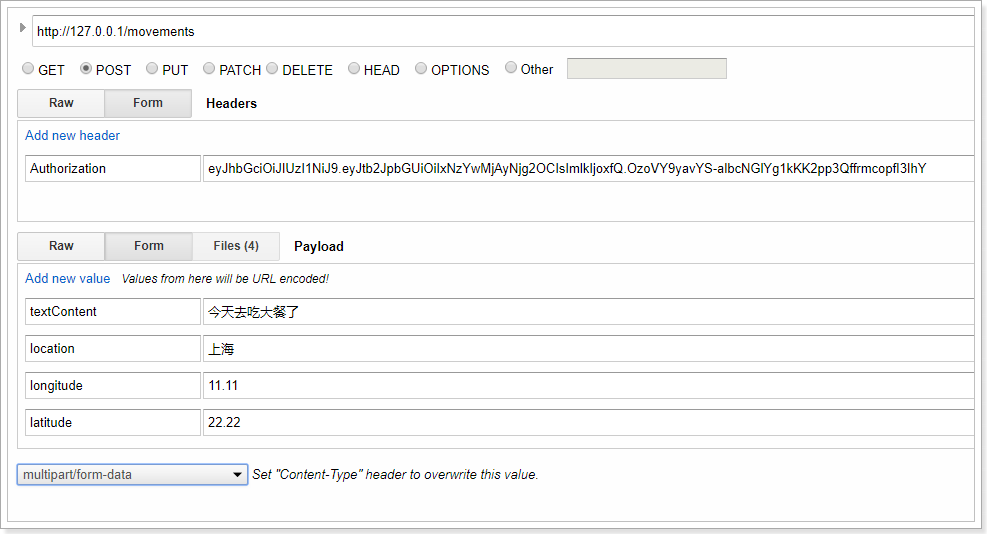

发布4张图片：

 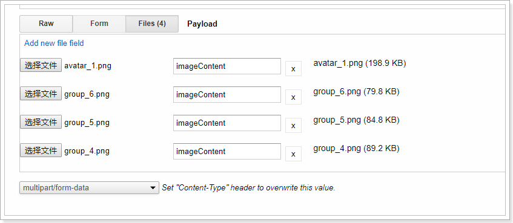

数据：

 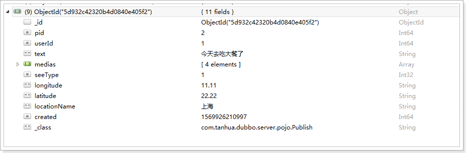

消息处理：

 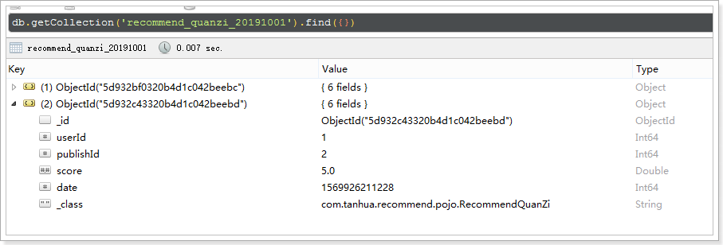

#### 1.7.2 浏览动态

 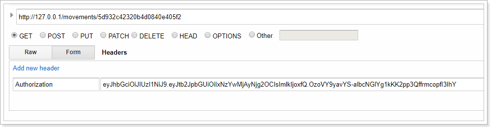

消息处理：

 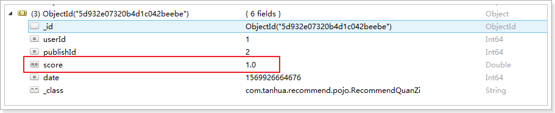

#### 1.7.3 点赞

 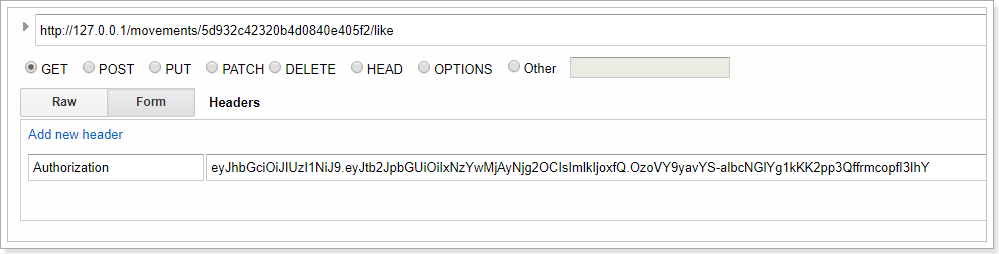

消息处理：

 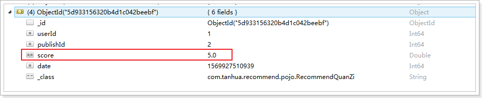

#### 1.7.4 取消点赞

 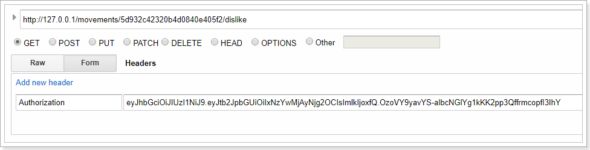

消息处理：

 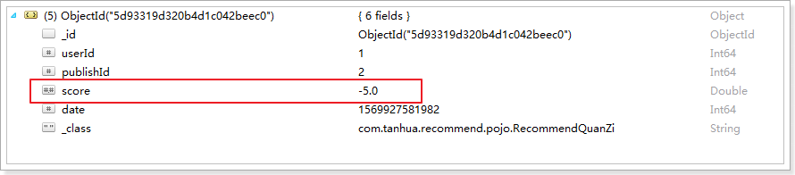

#### 1.7.5 喜欢

 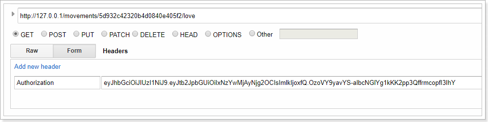

消息处理：

 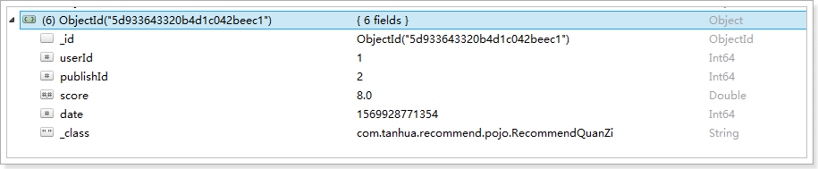

#### 1.7.6 取消喜欢

 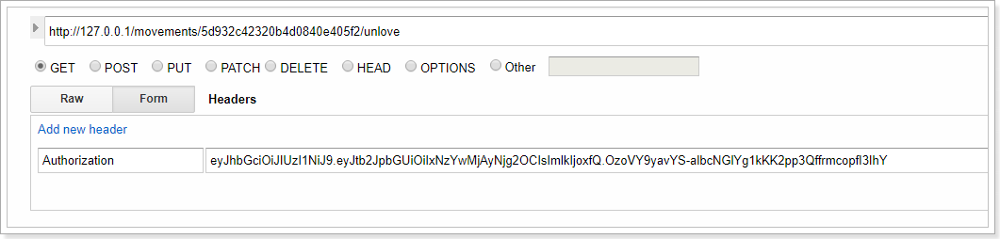

消息处理： 

 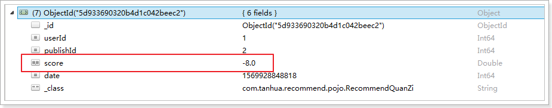

#### 1.7.7 评论

 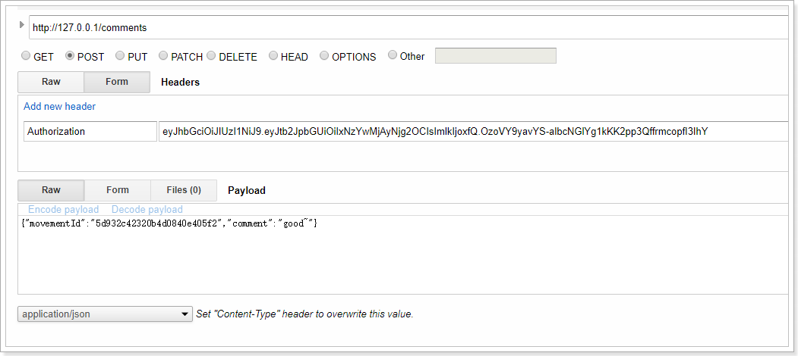

消息处理：  

 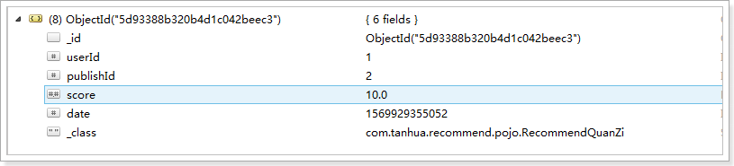

## 2 推荐系统

在推荐系统中，我们将基于前面写入到推荐表中的数据通过Spark进行计算，在Spark计算完成后将结果写入到Redis中，以供在业务系统中进行查询。

### 2.1 导入数据

使用资料中提供的centos7镜像或将资料中的mongodb数据导入到现有的mongodb服务中。

导入说明：

- 将资料目录中的mongodb.tar.gz上传至mongodb所在服务器
- 将其解压到/var/lib/docker/volumes目录下，原有mongodb目录要删除
- 重启mongodb服务
  - docker restart mongodb
- 使用客户端连接到mongodb服务进行查看
- 数据中所关联的用户数据在tanhua.sql文件中，将其替换原有的数据

mongodb：

 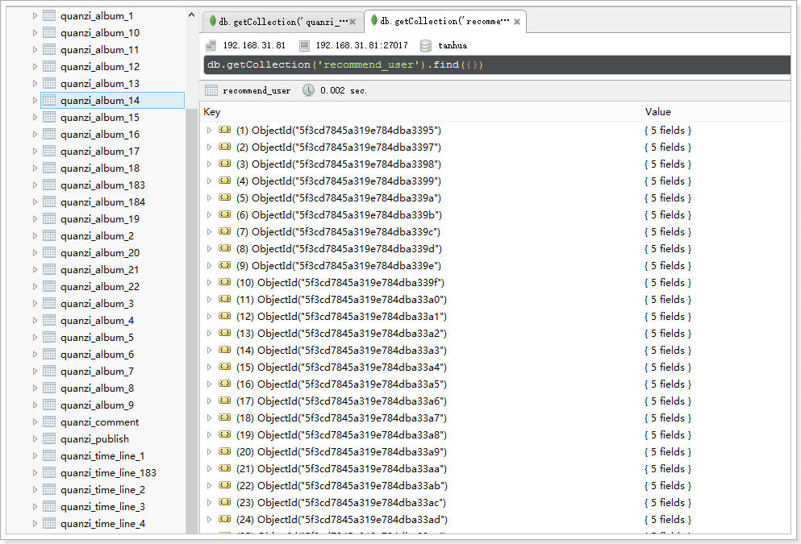

mysql数据：

 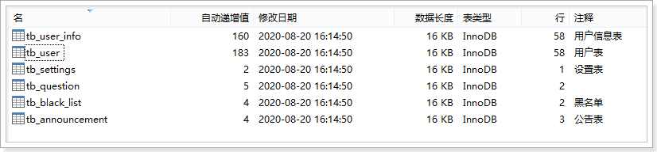

### 2.2 部署圈子推荐服务

推荐服务我们将基于docker的形式进行部署：

~~~shell
#拉取镜像
docker pull registry.cn-hangzhou.aliyuncs.com/itcast/tanhua-spark-quanzi:1.0

#创建容器
docker create --name tanhua-spark-quanzi --restart=always \
--env MONGODB_HOST=192.168.100.100 \
--env MONGODB_PORT=27017 \
--env MONGODB_USERNAME=tanhua \
--env MONGODB_PASSWORD=l3SCjl0HvmSkTtiSbN0Swv40spYnHhDV \
--env MONGODB_DATABASE=tanhua \
--env MONGODB_COLLECTION=recommend_quanzi \
--env SCHEDULE_PERIOD=3 \
--env REDIS_NODES="192.168.100.100:6379,192.168.100.100:6380,192.168.100.100:6381" \
registry.cn-hangzhou.aliyuncs.com/itcast/tanhua-spark-quanzi:1.0

#参数说明
#MONGODB_HOST mongodb服务的地址
#MONGODB_PORT mongodb服务的端口
#MONGODB_USERNAME mongodb服务的认证用户名
#MONGODB_PASSWORD mongodb服务的认证密码
#MONGODB_DATABASE mongodb连接的数据库
#MONGODB_COLLECTION 操作表
#SCHEDULE_PERIOD  下次执行时间间隔，但是为分，默认为10分钟
#REDIS_NODES  redis集群地址，也可以使用单节点

#mongodb开启认证服务
#docker create --name mongodb --restart=always -p 27017:27017 -v mongodb:/data/db mongo:4.0.3 --auth

#启动服务，启动之后就会进行执行，在SCHEDULE_PERIOD时间后再次执行
docker start tanhua-spark-quanzi

#查看日志
docker logs -f tanhua-spark-quanzi

#执行完成后会将数据写入到redis中
~~~

### 2.3 测试

进入redis查看是否已经有数据：

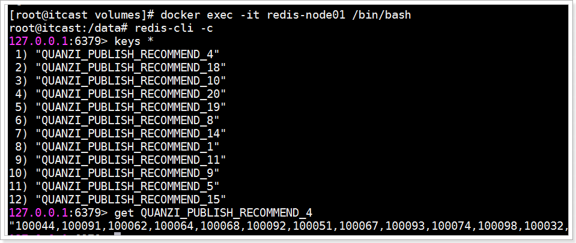

## 3 修改查询逻辑

之前是通过MongoDB直接查询，而现在需要先从Redis进行命中，如果未命中则需要进行MongoDB查询。

修改server工程中的MovementsService类型：

~~~java
 /**
     * 查询动态
     *
     * @param page
     * @param pageSize
     * @return
     */
    public PageResult queryPublishList(Integer page, Integer pageSize, boolean isRecommend) {
        PageResult pageResult = new PageResult();
        //获取当前的登录信息
        User user = UserThreadLocal.get();

        PageInfo<Publish> pageInfo = null;
        if (isRecommend) { //推荐动态逻辑处理
            // 查询Redis
            String value = this.redisTemplate.opsForValue().get("QUANZI_PUBLISH_RECOMMEND_" + user.getId());
            if (StringUtils.isNotEmpty(value)) {
                String[] pids = StringUtils.split(value, ',');
                int startIndex = (page - 1) * pageSize;
                if(startIndex < pids.length){
                    int endIndex = startIndex + pageSize - 1;
                    if (endIndex >= pids.length) {
                        endIndex = pids.length - 1;
                    }

                    List<Long> pidList = new ArrayList<>();
                    for (int i = startIndex; i <= endIndex; i++) {
                        pidList.add(Long.valueOf(pids[i]));
                    }

                    List<Publish> publishList = this.quanZiApi.queryPublishByPids(pidList);
                    pageInfo = new PageInfo<>();
                    pageInfo.setRecords(publishList);
                }
            }
        }

        if (null == pageInfo) {
            Long userId = isRecommend ? null : user.getId();
            pageInfo = this.quanZiApi.queryPublishList(userId, page, pageSize);
        }

        pageResult.setPagesize(pageSize);
        pageResult.setPage(page);
        pageResult.setCounts(0);
        pageResult.setPages(0);

        List<Publish> records = pageInfo.getRecords();

        if (CollectionUtils.isEmpty(records)) {
            //没有动态信息
            return pageResult;
        }

        List<Movements> movementsList = new ArrayList<>();
        for (Publish record : records) {
            Movements movements = new Movements();

            movements.setId(record.getId().toHexString());
            movements.setImageContent(record.getMedias().toArray(new String[]{}));
            movements.setTextContent(record.getText());
            movements.setUserId(record.getUserId());
            movements.setCreateDate(RelativeDateFormat.format(new Date(record.getCreated())));

            movementsList.add(movements);
        }

        List<Long> userIds = new ArrayList<>();
        for (Movements movements : movementsList) {
            if (!userIds.contains(movements.getUserId())) {
                userIds.add(movements.getUserId());
            }

        }

        QueryWrapper<UserInfo> queryWrapper = new QueryWrapper<>();
        queryWrapper.in("user_id", userIds);
        List<UserInfo> userInfos = this.userInfoService.queryList(queryWrapper);
        for (Movements movements : movementsList) {
            for (UserInfo userInfo : userInfos) {
                if (movements.getUserId().longValue() == userInfo.getUserId().longValue()) {
                    this.fillValueToMovements(movements, userInfo);
                    break;
                }
            }
        }

        pageResult.setItems(movementsList);
        return pageResult;
    }
~~~

测试： 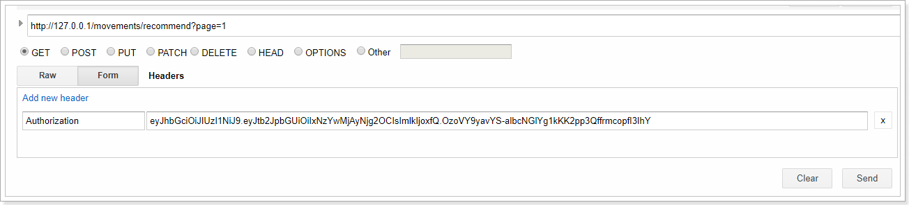

 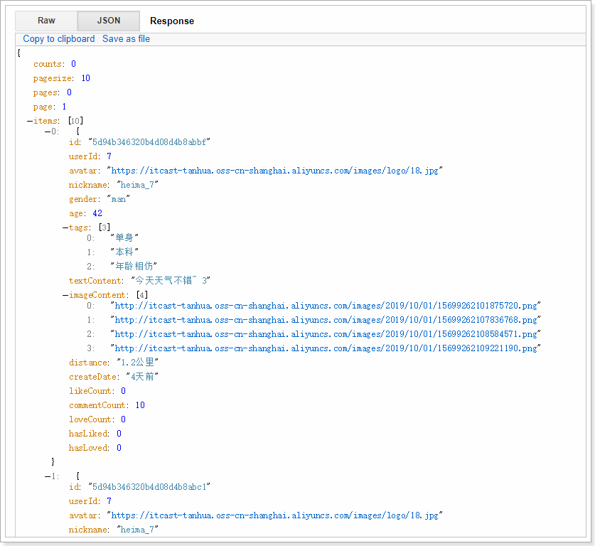

可以看到，已经查询到了动态数据。

## 4 小视频推荐

小视频的推荐和动态推荐的实现逻辑非常的类似。

### 4.1 增加自增id

~~~java
package com.tanhua.dubbo.server.pojo;

import lombok.AllArgsConstructor;
import lombok.Data;
import lombok.NoArgsConstructor;
import org.bson.types.ObjectId;
import org.springframework.data.mongodb.core.mapping.Document;

import java.util.List;

@Data
@NoArgsConstructor
@AllArgsConstructor
@Document(collection = "video")
public class Video implements java.io.Serializable {

    private static final long serialVersionUID = -3136732836884933873L;

    private ObjectId id; //主键id
    private Long vid;
    private Long userId;
    private String text; //文字
    private String picUrl; //视频封面文件
    private String videoUrl; //视频文件
    private Long created; //创建时间
    private Integer seeType; // 谁可以看，1-公开，2-私密，3-部分可见，4-不给谁看
    private List<Long> seeList; //部分可见的列表
    private List<Long> notSeeList; //不给谁看的列表
    private String longitude; //经度
    private String latitude; //纬度
    private String locationName; //位置名称
}

~~~

修改VideoApiImpl逻辑：

~~~java
    @Override
    public Boolean saveVideo(Video video) {
        if (video.getUserId() == null) {
            return false;
        }

        video.setId(ObjectId.get());
        video.setCreated(System.currentTimeMillis());

        //生成vid
        video.setVid(this.idService.createId("video", video.getId().toHexString()));

        this.mongoTemplate.save(video);
        return true;
    }
~~~

### 4.2 动态计分规则

- 发布+2
- 点赞 +5
- 评论 + 10

### 4.3 发送消息

#### 4.3.1 VideoMQService

~~~java
package com.tanhua.server.service;

import com.alibaba.dubbo.config.annotation.Reference;
import com.tanhua.dubbo.server.api.QuanZiApi;
import com.tanhua.dubbo.server.api.VideoApi;
import com.tanhua.dubbo.server.pojo.Publish;
import com.tanhua.dubbo.server.pojo.Video;
import com.tanhua.server.pojo.User;
import com.tanhua.server.utils.UserThreadLocal;
import org.apache.rocketmq.spring.core.RocketMQTemplate;
import org.slf4j.Logger;
import org.slf4j.LoggerFactory;
import org.springframework.beans.factory.annotation.Autowired;
import org.springframework.stereotype.Service;

import java.util.HashMap;
import java.util.Map;

@Service
public class VideoMQService {

    private static final Logger LOGGER = LoggerFactory.getLogger(VideoMQService.class);

    @Autowired
    private RocketMQTemplate rocketMQTemplate;

    @Reference(version = "1.0.0")
    private VideoApi videoApi;

    /**
     * 发布小视频消息
     *
     * @return
     */
    public Boolean videoMsg(String videoId) {
        return this.sendMsg(videoId, 1);
    }

    /**
     * 点赞小视频
     *
     * @return
     */
    public Boolean likeVideoMsg(String videoId) {
        return this.sendMsg(videoId, 2);
    }

    /**
     * 取消点赞小视频
     *
     * @return
     */
    public Boolean disLikeVideoMsg(String videoId) {
        return this.sendMsg(videoId, 3);
    }

    /**
     * 评论小视频
     *
     * @return
     */
    public Boolean commentVideoMsg(String videoId) {
        return this.sendMsg(videoId, 4);
    }

    /**
     * 发送小视频操作相关的消息
     *
     * @param videoId
     * @param type     1-发动态，2-点赞， 3-取消点赞，4-评论
     * @return
     */
    private Boolean sendMsg(String videoId, Integer type) {
        try {
            User user = UserThreadLocal.get();

            Video video = this.videoApi.queryVideoById(videoId);

            //构建消息
            Map<String, Object> msg = new HashMap<>();
            msg.put("userId", user.getId());
            msg.put("date", System.currentTimeMillis());
            msg.put("videoId", videoId);
            msg.put("vid", video.getVid());
            msg.put("type", type);

            this.rocketMQTemplate.convertAndSend("tanhua-video", msg);
        } catch (Exception e) {
            LOGGER.error("发送消息失败! videoId = " + videoId + ", type = " + type, e);
            return false;
        }

        return true;
    }
}

~~~

#### 4.3.2 VideoController

~~~java
package com.tanhua.server.controller;

import com.tanhua.server.service.MovementsService;
import com.tanhua.server.service.VideoMQService;
import com.tanhua.server.service.VideoService;
import com.tanhua.server.vo.PageResult;
import org.apache.commons.lang3.StringUtils;
import org.springframework.beans.factory.annotation.Autowired;
import org.springframework.http.HttpStatus;
import org.springframework.http.ResponseEntity;
import org.springframework.web.bind.annotation.*;
import org.springframework.web.multipart.MultipartFile;

import java.util.Map;

@RestController
@RequestMapping("smallVideos")
public class VideoController {

    @Autowired
    private VideoService videoService;

    @Autowired
    private MovementsService movementsService;

    @Autowired
    private CommentsController commentsController;

    @Autowired
    private VideoMQService videoMQService;

    /**
     * 发布小视频
     *
     * @param picFile
     * @param videoFile
     * @return
     */
    @PostMapping
    public ResponseEntity<Void> saveVideo(@RequestParam(value = "videoThumbnail", required = false) MultipartFile picFile,
                                          @RequestParam(value = "videoFile", required = false) MultipartFile videoFile) {
        try {
            String id = this.videoService.saveVideo(picFile, videoFile);
            if (StringUtils.isNotEmpty(id)) {
                //发送消息
                this.videoMQService.videoMsg(id);

                return ResponseEntity.ok(null);
            }
        } catch (Exception e) {
            e.printStackTrace();
        }
        return ResponseEntity.status(HttpStatus.INTERNAL_SERVER_ERROR).build();
    }

    /**
     * 查询小视频列表
     *
     * @param page
     * @param pageSize
     * @return
     */
    @GetMapping
    public ResponseEntity<PageResult> queryVideoList(@RequestParam(value = "page", defaultValue = "1") Integer page,
                                                     @RequestParam(value = "pagesize", defaultValue = "10") Integer pageSize) {
        try {
            if (page <= 0) {
                page = 1;
            }
            PageResult pageResult = this.videoService.queryVideoList(page, pageSize);
            if (null != pageResult) {
                return ResponseEntity.ok(pageResult);
            }
        } catch (Exception e) {
            e.printStackTrace();
        }
        return ResponseEntity.status(HttpStatus.INTERNAL_SERVER_ERROR).build();
    }

    /**
     * 视频点赞
     *
     * @param videoId 视频id
     * @return
     */
    @PostMapping("/{id}/like")
    public ResponseEntity<Long> likeComment(@PathVariable("id") String videoId) {
        try {
            Long likeCount = this.movementsService.likeComment(videoId);
            if (likeCount != null) {
                this.videoMQService.likeVideoMsg(videoId);
                return ResponseEntity.ok(likeCount);
            }
        } catch (Exception e) {
            e.printStackTrace();
        }
        return ResponseEntity.status(HttpStatus.INTERNAL_SERVER_ERROR).build();
    }

    /**
     * 取消点赞
     *
     * @param videoId
     * @return
     */
    @PostMapping("/{id}/dislike")
    public ResponseEntity<Long> disLikeComment(@PathVariable("id") String videoId) {
        try {
            Long likeCount = this.movementsService.cancelLikeComment(videoId);
            if (null != likeCount) {
                this.videoMQService.disLikeVideoMsg(videoId);
                return ResponseEntity.ok(likeCount);
            }
        } catch (Exception e) {
            e.printStackTrace();
        }
        return ResponseEntity.status(HttpStatus.INTERNAL_SERVER_ERROR).build();
    }

    /**
     * 评论点赞
     *
     * @param publishId
     * @return
     */
    @PostMapping("/comments/{id}/like")
    public ResponseEntity<Long> commentsLikeComment(@PathVariable("id") String publishId) {
        try {
            Long likeCount = this.movementsService.likeComment(publishId);
            if (likeCount != null) {
                return ResponseEntity.ok(likeCount);
            }
        } catch (Exception e) {
            e.printStackTrace();
        }
        return ResponseEntity.status(HttpStatus.INTERNAL_SERVER_ERROR).build();
    }

    /**
     * 评论取消点赞
     *
     * @param publishId
     * @return
     */
    @PostMapping("/comments/{id}/dislike")
    public ResponseEntity<Long> disCommentsLikeComment(@PathVariable("id") String publishId) {
        try {
            Long likeCount = this.movementsService.cancelLikeComment(publishId);
            if (null != likeCount) {
                return ResponseEntity.ok(likeCount);
            }
        } catch (Exception e) {
            e.printStackTrace();
        }
        return ResponseEntity.status(HttpStatus.INTERNAL_SERVER_ERROR).build();
    }

    /**
     * 提交评论
     *
     * @param param
     * @param videoId
     * @return
     */
    @PostMapping("/{id}/comments")
    public ResponseEntity<Void> saveComments(@RequestBody Map<String, String> param,
                                             @PathVariable("id") String videoId) {
        param.put("movementId", videoId);
        ResponseEntity<Void> entity = this.commentsController.saveComments(param);

        if (entity.getStatusCode().is2xxSuccessful()) {
            //发送消息
            this.videoMQService.commentVideoMsg(videoId);
        }

        return entity;
    }

    /**
     * 评论列表
     */
    @GetMapping("/{id}/comments")
    public ResponseEntity<PageResult> queryCommentsList(@PathVariable("id") String videoId,
                                                        @RequestParam(value = "page", defaultValue = "1") Integer page,
                                                        @RequestParam(value = "pagesize", defaultValue = "10") Integer pagesize) {
        return this.commentsController.queryCommentsList(videoId, page, pagesize);
    }

    /**
     * 视频用户关注
     */
    @PostMapping("/{id}/userFocus")
    public ResponseEntity<Void> saveUserFocusComments(@PathVariable("id") Long userId) {
        try {
            Boolean bool = this.videoService.followUser(userId);
            if (bool) {
                return ResponseEntity.ok(null);
            }
        } catch (Exception e) {
            e.printStackTrace();
        }
        return ResponseEntity.status(HttpStatus.INTERNAL_SERVER_ERROR).build();
    }

    /**
     * 视频用户关注
     */
    @PostMapping("/{id}/userUnFocus")
    public ResponseEntity<Void> saveUserUnFocusComments(@PathVariable("id") Long userId) {
        try {
            Boolean bool = this.videoService.disFollowUser(userId);
            if (bool) {
                return ResponseEntity.ok(null);
            }
        } catch (Exception e) {
            e.printStackTrace();
        }
        return ResponseEntity.status(HttpStatus.INTERNAL_SERVER_ERROR).build();
    }
}

~~~

### 4.4 接收消息

#### 4.4.1 RecommendVideo

~~~java
package com.tanhua.recommend.pojo;

import lombok.AllArgsConstructor;
import lombok.Data;
import lombok.NoArgsConstructor;
import org.bson.types.ObjectId;

@Data
@NoArgsConstructor
@AllArgsConstructor
public class RecommendVideo {

    private ObjectId id;
    private Long userId;// 用户id
    private Long videoId; //视频id，需要转化为Long类型
    private Double score; //得分
    private Long date; //时间戳
}

~~~

#### 4.4.2 VideoMsgConsumer

~~~java
package com.tanhua.recommend.msg;

import com.fasterxml.jackson.databind.JsonNode;
import com.fasterxml.jackson.databind.ObjectMapper;
import com.tanhua.recommend.pojo.Publish;
import com.tanhua.recommend.pojo.RecommendQuanZi;
import com.tanhua.recommend.pojo.RecommendVideo;
import org.apache.commons.lang3.StringUtils;
import org.apache.rocketmq.spring.annotation.RocketMQMessageListener;
import org.apache.rocketmq.spring.core.RocketMQListener;
import org.bson.types.ObjectId;
import org.joda.time.DateTime;
import org.slf4j.Logger;
import org.slf4j.LoggerFactory;
import org.springframework.beans.factory.annotation.Autowired;
import org.springframework.data.mongodb.core.MongoTemplate;
import org.springframework.stereotype.Component;
import org.springframework.util.CollectionUtils;

@Component
@RocketMQMessageListener(topic = "tanhua-video",
        consumerGroup = "tanhua-video-consumer")
public class VideoMsgConsumer implements RocketMQListener<String> {

    private static final ObjectMapper MAPPER = new ObjectMapper();

    private static final Logger LOGGER = LoggerFactory.getLogger(VideoMsgConsumer.class);

    @Autowired
    private MongoTemplate mongoTemplate;

    @Override
    public void onMessage(String msg) {
        try {
            JsonNode jsonNode = MAPPER.readTree(msg);

            Long userId = jsonNode.get("userId").asLong();
            Long vid = jsonNode.get("vid").asLong();
            Integer type = jsonNode.get("type").asInt();

            //1-发动态，2-点赞， 3-取消点赞，4-评论
            RecommendVideo recommendVideo = new RecommendVideo();
            recommendVideo.setUserId(userId);
            recommendVideo.setId(ObjectId.get());
            recommendVideo.setDate(System.currentTimeMillis());
            recommendVideo.setVideoId(vid);

            switch (type) {
                case 1: {
                    recommendVideo.setScore(2d);
                    break;
                }
                case 2: {
                    recommendVideo.setScore(5d);
                    break;
                }
                case 3: {
                    recommendVideo.setScore(-5d);
                    break;
                }
                case 4: {
                    recommendVideo.setScore(10d);
                    break;
                }
                default: {
                    recommendVideo.setScore(0d);
                    break;
                }
            }

            String collectionName = "recommend_video_" + new DateTime().toString("yyyyMMdd");
            this.mongoTemplate.save(recommendVideo, collectionName);

        } catch (Exception e) {
            LOGGER.error("处理小视频消息失败~" + msg, e);
        }
    }
}

~~~

#### 4.4.3 测试

 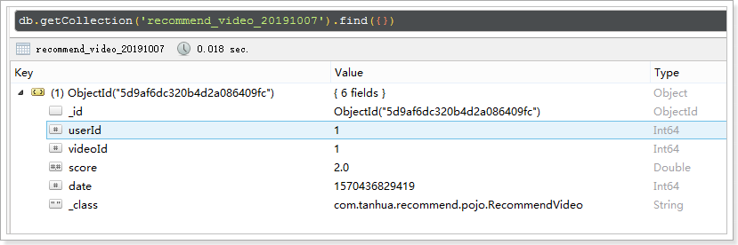

### 4.5 部署推荐服务

~~~shell
#拉取镜像
docker pull registry.cn-hangzhou.aliyuncs.com/itcast/tanhua-spark-video:1.0

#创建容器
docker create --name tanhua-spark-video --restart=always \
--env MONGODB_HOST=192.168.100.100 \
--env MONGODB_PORT=27017 \
--env MONGODB_USERNAME=tanhua \
--env MONGODB_PASSWORD=l3SCjl0HvmSkTtiSbN0Swv40spYnHhDV \
--env MONGODB_DATABASE=tanhua \
--env MONGODB_COLLECTION=recommend_video \
--env SCHEDULE_PERIOD=3 \
--env REDIS_NODES="192.168.100.100:6379,192.168.100.100:6380,192.168.100.100:6381" \
registry.cn-hangzhou.aliyuncs.com/itcast/tanhua-spark-video:1.0

#启动服务
docker start tanhua-spark-video

#查看日志
docker logs -f tanhua-spark-video
~~~

测试：

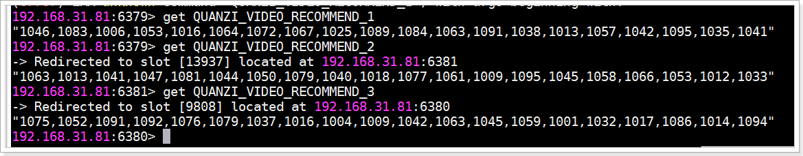

### 4.6 修改查询逻辑

修改VideoService的实现：

~~~java
public PageResult queryVideoList(Integer page, Integer pageSize) {

        User user = UserThreadLocal.get();

        PageResult pageResult = new PageResult();
        pageResult.setPage(page);
        pageResult.setPagesize(pageSize);
        pageResult.setPages(0);
        pageResult.setCounts(0);

        PageInfo<Video> pageInfo = null;

        //先从Redis进行命中，如果命中则返回推荐列表，如果未命中查询默认列表
        String redisValue = this.redisTemplate.opsForValue().get("QUANZI_VIDEO_RECOMMEND_" + user.getId());
        if (StringUtils.isNotEmpty(redisValue)) {
            String[] pids = StringUtils.split(redisValue, ',');
            int startIndex = (page - 1) * pageSize;
            if (startIndex < pids.length) {
                int endIndex = startIndex + pageSize - 1;
                if (endIndex >= pids.length) {
                    endIndex = pids.length - 1;
                }

                List<Long> vidList = new ArrayList<>();
                for (int i = startIndex; i <= endIndex; i++) {
                    vidList.add(Long.valueOf(pids[i]));
                }

                List<Video> videoList = this.videoApi.queryVideoListByPids(vidList);
                pageInfo = new PageInfo<>();
                pageInfo.setRecords(videoList);
            }
        }

        if(null == pageInfo){
            pageInfo = this.videoApi.queryVideoList(page, pageSize);
        }

        List<Video> records = pageInfo.getRecords();
        List<VideoVo> videoVoList = new ArrayList<>();
        List<Long> userIds = new ArrayList<>();
        for (Video record : records) {
            VideoVo videoVo = new VideoVo();

            videoVo.setUserId(record.getUserId());
            videoVo.setCover(record.getPicUrl());
            videoVo.setVideoUrl(record.getVideoUrl());
            videoVo.setId(record.getId().toHexString());
            videoVo.setSignature("我就是我~");

            Long commentCount = this.quanZiApi.queryCommentCount(videoVo.getId(), 2);
            videoVo.setCommentCount(commentCount == null ? 0 : commentCount.intValue()); // 评论数

            String followUserKey = "VIDEO_FOLLOW_USER_" + user.getId() + "_" + videoVo.getUserId();
            videoVo.setHasFocus(this.redisTemplate.hasKey(followUserKey) ? 1 : 0); //是否关注

            String userKey = "QUANZI_COMMENT_LIKE_USER_" + user.getId() + "_" + videoVo.getId();
            videoVo.setHasLiked(this.redisTemplate.hasKey(userKey) ? 1 : 0); //是否点赞（1是，0否）

            String key = "QUANZI_COMMENT_LIKE_" + videoVo.getId();
            String value = this.redisTemplate.opsForValue().get(key);
            if (StringUtils.isNotEmpty(value)) {
                videoVo.setLikeCount(Integer.valueOf(value)); //点赞数
            } else {
                videoVo.setLikeCount(0);
            }

            if (!userIds.contains(record.getUserId())) {
                userIds.add(record.getUserId());
            }

            videoVoList.add(videoVo);
        }

        QueryWrapper<UserInfo> queryWrapper = new QueryWrapper();
        queryWrapper.in("user_id", userIds);
        List<UserInfo> userInfos = this.userInfoService.queryList(queryWrapper);
        for (VideoVo videoVo : videoVoList) {
            for (UserInfo userInfo : userInfos) {
                if (videoVo.getUserId().longValue() == userInfo.getUserId().longValue()) {

                    videoVo.setNickname(userInfo.getNickName());
                    videoVo.setAvatar(userInfo.getLogo());

                    break;
                }
            }

        }

        pageResult.setItems(videoVoList);
        return pageResult;
    }
~~~

