## 课程说明

- 首页好友推荐的功能实现
- 谁看过我的功能实现
- 今日佳人的功能实现
- 聊一下的功能实现
- 上报地理位置的功能实现

## 1. 首页好友推荐

### 1.1 默认推荐列表

如果查询不到推荐列表，那就需要给出默认的推荐列表。

#### 1.1.1 配置默认推荐的用户

~~~properties
#application.properties
tanhua.sso.default.recommend.users=2,3,4,5,6,7,8,9,10,11,12,13
~~~

#### 1.1.2 修改查询逻辑

~~~java
//TodayBestService

/**
     * 查询推荐用户列表
     *
     * @param queryParam
     * @param token
     * @return
     */
    public PageResult queryRecommendUserList(RecommendUserQueryParam queryParam, String token) {
        //查询当前的登录信息
        User user = this.userService.queryUserByToken(token);
        if (null == user) {
            return null;
        }
        PageResult pageResult = new PageResult();
        PageInfo<RecommendUser> pageInfo = this.recommendUserService.queryRecommendUserList(user.getId(), queryParam.getPage(), queryParam.getPagesize());

        pageResult.setCounts(0); //前端不参与计算，仅需要返回字段
        pageResult.setPage(queryParam.getPage());
        pageResult.setPagesize(queryParam.getPagesize());

        List<RecommendUser> records = pageInfo.getRecords();

        if(CollectionUtils.isEmpty(records)){
            //默认推荐列表
            String[] ss = StringUtils.split(defaultRecommendUsers, ',');
            for (String s : ss) {
                RecommendUser recommendUser = new RecommendUser();

                recommendUser.setUserId(Long.valueOf(s));
                recommendUser.setToUserId(user.getId());
                recommendUser.setScore(RandomUtils.nextDouble(70, 99));

                records.add(recommendUser);
            }
        }

        List<Long> userIds = new ArrayList<>();
        for (RecommendUser record : records) {
            userIds.add(record.getUserId());
        }

        QueryWrapper<UserInfo> queryWrapper = new QueryWrapper<>();
        queryWrapper.in("user_id", userIds);

        if (StringUtils.isNotEmpty(queryParam.getGender())) { //性别条件
            if (queryParam.getGender().equals("man")) {
                queryWrapper.eq("sex", 1);
            } else {
                queryWrapper.eq("sex", 2);
            }
        }

        if (StringUtils.isNotEmpty(queryParam.getCity())) { //居住城市
            queryWrapper.eq("city", queryParam.getCity());
        }

        if (queryParam.getAge() != null) { //年龄
            queryWrapper.lt("age", queryParam.getAge());
        }

        List<UserInfo> userInfos = this.userInfoService.queryList(queryWrapper);

        List<TodayBest> todayBests = new ArrayList<>();
        for (UserInfo userInfo : userInfos) {
            TodayBest todayBest = new TodayBest();
            todayBest.setId(userInfo.getUserId());
            todayBest.setAge(userInfo.getAge());
            todayBest.setAvatar(userInfo.getLogo());
            todayBest.setGender(userInfo.getSex().name().toLowerCase());
            todayBest.setNickname(userInfo.getNickName());
            todayBest.setTags(StringUtils.split(userInfo.getTags(), ','));

            //设置缘分值
            for (RecommendUser record : records) {
                if(userInfo.getUserId().longValue() == record.getUserId().longValue()){
                    double score = Math.floor(record.getScore());
                    todayBest.setFateValue(Double.valueOf(score).longValue());
                    break;
                }
            }

            todayBests.add(todayBest);
        }

        //排序集合，按照score倒序排序
        Collections.sort(todayBests, (o1, o2) -> new Long(o2.getFateValue() - o1.getFateValue()).intValue());

        pageResult.setItems(todayBests);

        return pageResult;
    }
~~~

#### 1.1.3 测试

 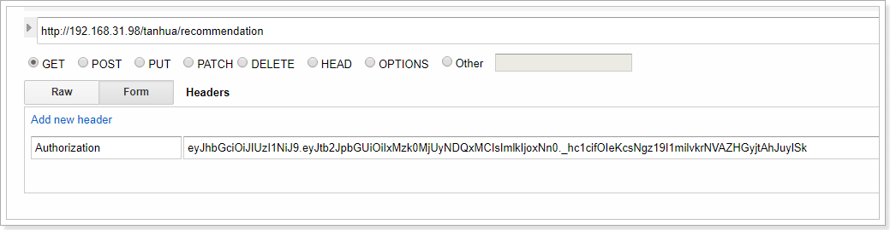

响应结果：

~~~json
{
    "counts": 0,
    "pagesize": 10,
    "pages": 0,
    "page": 1,
    "items": [
        {
            "id": 4,
            "avatar": "https://itcast-tanhua.oss-cn-shanghai.aliyuncs.com/images/logo/4.jpg",
            "nickname": "heima_4",
            "gender": "man",
            "age": 22,
            "tags": [
                "单身",
                "本科",
                "年龄相仿"
            ],
            "fateValue": 95
        },
        {
            "id": 9,
            "avatar": "https://itcast-tanhua.oss-cn-shanghai.aliyuncs.com/images/logo/8.jpg",
            "nickname": "heima_9",
            "gender": "man",
            "age": 23,
            "tags": [
                "单身",
                "本科",
                "年龄相仿"
            ],
            "fateValue": 95
        },
        {
            "id": 5,
            "avatar": "https://itcast-tanhua.oss-cn-shanghai.aliyuncs.com/images/logo/5.jpg",
            "nickname": "heima_5",
            "gender": "man",
            "age": 23,
            "tags": [
                "单身",
                "本科",
                "年龄相仿"
            ],
            "fateValue": 94
        },
        {
            "id": 6,
            "avatar": "https://itcast-tanhua.oss-cn-shanghai.aliyuncs.com/images/logo/9.jpg",
            "nickname": "heima_6",
            "gender": "man",
            "age": 23,
            "tags": [
                "单身",
                "本科",
                "年龄相仿"
            ],
            "fateValue": 94
        },
        {
            "id": 2,
            "avatar": "https://itcast-tanhua.oss-cn-shanghai.aliyuncs.com/images/logo/22.jpg",
            "nickname": "heima_2",
            "gender": "man",
            "age": 30,
            "tags": [
                "单身",
                "本科",
                "年龄相仿"
            ],
            "fateValue": 93
        },
        {
            "id": 8,
            "avatar": "https://itcast-tanhua.oss-cn-shanghai.aliyuncs.com/images/logo/12.jpg",
            "nickname": "heima_8",
            "gender": "man",
            "age": 26,
            "tags": [
                "单身",
                "本科",
                "年龄相仿"
            ],
            "fateValue": 92
        },
        {
            "id": 11,
            "avatar": "https://itcast-tanhua.oss-cn-shanghai.aliyuncs.com/images/logo/11.jpg",
            "nickname": "heima_11",
            "gender": "man",
            "age": 46,
            "tags": [
                "单身",
                "本科",
                "年龄相仿"
            ],
            "fateValue": 86
        },
        {
            "id": 12,
            "avatar": "https://itcast-tanhua.oss-cn-shanghai.aliyuncs.com/images/logo/10.jpg",
            "nickname": "heima_12",
            "gender": "man",
            "age": 40,
            "tags": [
                "单身",
                "本科",
                "年龄相仿"
            ],
            "fateValue": 86
        },
        {
            "id": 13,
            "avatar": "https://itcast-tanhua.oss-cn-shanghai.aliyuncs.com/images/logo/5.jpg",
            "nickname": "heima_13",
            "gender": "man",
            "age": 46,
            "tags": [
                "单身",
                "本科",
                "年龄相仿"
            ],
            "fateValue": 85
        },
        {
            "id": 7,
            "avatar": "https://itcast-tanhua.oss-cn-shanghai.aliyuncs.com/images/logo/18.jpg",
            "nickname": "heima_7",
            "gender": "man",
            "age": 42,
            "tags": [
                "单身",
                "本科",
                "年龄相仿"
            ],
            "fateValue": 78
        },
        {
            "id": 3,
            "avatar": "https://itcast-tanhua.oss-cn-shanghai.aliyuncs.com/images/logo/19.jpg",
            "nickname": "heima_3",
            "gender": "man",
            "age": 45,
            "tags": [
                "单身",
                "本科",
                "年龄相仿"
            ],
            "fateValue": 77
        },
        {
            "id": 10,
            "avatar": "https://itcast-tanhua.oss-cn-shanghai.aliyuncs.com/images/logo/4.jpg",
            "nickname": "heima_10",
            "gender": "man",
            "age": 46,
            "tags": [
                "单身",
                "本科",
                "年龄相仿"
            ],
            "fateValue": 76
        }
    ]
}
~~~

### 1.2 好友推荐

对于好友的推荐，需要找出每个用户之间的相似性，具体规则如下：

| 字段   | 权重分     |          |             |              |
| ------ | ---------- | -------- | ----------- | ------------ |
| 年龄差 | 0-2岁 30分 | 3-5 20分 | 5-10岁 10分 | 10岁以上 0分 |
| 性别   | 异性 30分  | 同性 0分 |             |              |
| 位置   | 同城 20分  | 不同 0分 |             |              |
| 学历   | 相同 20分  | 不同 0分 |             |              |

#### 1.2.1 部署好友推荐服务

~~~shell
#拉取镜像
docker pull registry.cn-hangzhou.aliyuncs.com/itcast/tanhua-spark-recommend-user:1.0

#创建容器
docker create --name tanhua-spark-recommend-user --restart=always \
--env MONGODB_HOST=192.168.31.81 \
--env MONGODB_PORT=27017 \
--env MONGODB_USERNAME=tanhua \
--env MONGODB_PASSWORD=l3SCjl0HvmSkTtiSbN0Swv40spYnHhDV \
--env MONGODB_DATABASE=tanhua \
--env MONGODB_COLLECTION=recommend_user \
--env JDBC_URL="jdbc:mysql://192.168.31.81:3306/tanhua?useUnicode=true&characterEncoding=utf8&autoReconnect=true&allowMultiQueries=true&useSSL=false" \
--env JDBC_DRIVER=com.mysql.jdbc.Driver \
--env JDBC_USER=root \
--env JDBC_PASSWORD=root \
--env JDBC_TABLE=tb_user_info \
--env SCHEDULE_PERIOD=3 \
registry.cn-hangzhou.aliyuncs.com/itcast/tanhua-spark-recommend-user:1.0

#参数说明
#MONGODB_HOST mongodb服务的地址
#MONGODB_PORT mongodb服务的端口
#MONGODB_USERNAME mongodb服务的认证用户名
#MONGODB_PASSWORD mongodb服务的认证密码
#MONGODB_DATABASE mongodb连接的数据库
#MONGODB_COLLECTION 操作表
#JDBC_URL  mysql数据库连接地址
#JDBC_DRIVER  jdbc驱动
#JDBC_USER  数据库连接用户名
#JDBC_PASSWORD  数据库连接密码
#JDBC_TABLE  数据库表名
#SCHEDULE_PERIOD  下次执行时间间隔，但是为分，默认为10分钟

#启动服务
docker start tanhua-spark-recommend-user

#查看日志
docker logs -f tanhua-spark-recommend-user
~~~

#### 1.2.2 测试

执行完成后，数据会写入到mongodb中：

 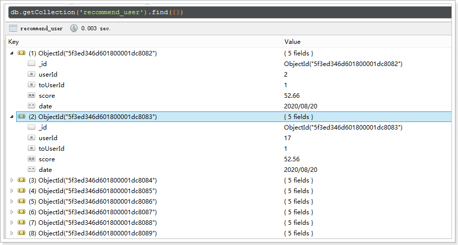

解决推荐自己的问题：

~~~shell
#使用1.0.1版本的镜像，同时还增加了推荐数量的参数控制
docker create --name tanhua-spark-recommend-user --restart=always \
--env MONGODB_HOST=192.168.31.81 \
--env MONGODB_PORT=27017 \
--env MONGODB_USERNAME=tanhua \
--env MONGODB_PASSWORD=l3SCjl0HvmSkTtiSbN0Swv40spYnHhDV \
--env MONGODB_DATABASE=tanhua \
--env MONGODB_COLLECTION=recommend_user \
--env JDBC_URL="jdbc:mysql://192.168.31.81:3306/tanhua?useUnicode=true&characterEncoding=utf8&autoReconnect=true&allowMultiQueries=true&useSSL=false" \
--env JDBC_DRIVER=com.mysql.jdbc.Driver \
--env JDBC_USER=root \
--env JDBC_PASSWORD=root \
--env JDBC_TABLE=tb_user_info \
--env SCHEDULE_PERIOD=3 \
--env RECOMMEND_COUNT=50 \
registry.cn-hangzhou.aliyuncs.com/itcast/tanhua-spark-recommend-user:1.0.1
~~~

## 2. 谁看过我

记录别人来访了我的主页的信息。

### 2.1 编写pojo

~~~java
package com.tanhua.dubbo.server.pojo;

import lombok.AllArgsConstructor;
import lombok.Data;
import lombok.NoArgsConstructor;
import org.bson.types.ObjectId;
import org.springframework.data.mongodb.core.mapping.Document;

@Data
@NoArgsConstructor
@AllArgsConstructor
@Document(collection = "visitors")
public class Visitors implements java.io.Serializable{

    private static final long serialVersionUID = 2811682148052386573L;

    private ObjectId id;
    private Long userId; //我的id
    private Long visitorUserId; //来访用户id
    private String from; //来源，如首页、圈子等
    private Long date; //来访时间

    private Double score; //得分

}

~~~

### 2.2 定义接口

~~~java
package com.tanhua.dubbo.server.api;

import com.tanhua.dubbo.server.pojo.Visitors;

import java.util.List;

public interface VisitorsApi {

    /**
     * 保存来访记录
     *
     * @param visitors
     * @return
     */
    String saveVisitor(Visitors visitors);

    /**
     * 按照时间倒序排序，查询最近的访客信息
     *
     * @param userId
     * @param num
     * @return
     */
    List<Visitors> topVisitor(Long userId, Integer num);

    /**
     * 按照时间倒序排序，查询最近的访客信息
     *
     * @param userId
     * @param date
     * @return
     */
    List<Visitors> topVisitor(Long userId, Long date);
}

~~~

### 2.3 实现接口

~~~java
package com.tanhua.dubbo.server.api;

import com.alibaba.dubbo.config.annotation.Service;
import com.tanhua.dubbo.server.pojo.RecommendUser;
import com.tanhua.dubbo.server.pojo.Visitors;
import org.bson.types.ObjectId;
import org.springframework.beans.factory.annotation.Autowired;
import org.springframework.data.domain.PageRequest;
import org.springframework.data.domain.Pageable;
import org.springframework.data.domain.Sort;
import org.springframework.data.mongodb.core.MongoTemplate;
import org.springframework.data.mongodb.core.query.Criteria;
import org.springframework.data.mongodb.core.query.Query;

import java.util.List;

@Service(version = "1.0.0")
public class VisitorsApiImpl implements VisitorsApi {

    @Autowired
    private MongoTemplate mongoTemplate;

    @Override
    public String saveVisitor(Visitors visitors) {

        visitors.setId(ObjectId.get());
        visitors.setDate(System.currentTimeMillis());

        this.mongoTemplate.save(visitors);

        return visitors.getId().toHexString();
    }

    @Override
    public List<Visitors> topVisitor(Long userId, Integer num) {
        Pageable pageable = PageRequest.of(0, num, Sort.by(Sort.Order.desc("date")));
        Query query = Query.query(Criteria.where("userId").is(userId)).with(pageable);
        return this.queryVisitorList(query);
    }

    @Override
    public List<Visitors> topVisitor(Long userId, Long date) {
        Query query = Query.query(Criteria
                .where("userId").is(userId)
                .and("date").gte(date));
        return this.queryVisitorList(query);
    }

    private List<Visitors> queryVisitorList(Query query) {
        List<Visitors> visitors = this.mongoTemplate.find(query, Visitors.class);

        // 查询得分
        for (Visitors visitor : visitors) {
            Query queryRecommend = Query.query(Criteria
                    .where("toUserId").is(visitor.getUserId())
                    .and("userId").is(visitor.getVisitorUserId()));
            RecommendUser recommendUser = this.mongoTemplate.findOne(queryRecommend, RecommendUser.class);
            if (null != recommendUser) {
                visitor.setScore(recommendUser.getScore());
            } else {
                visitor.setScore(30d);
            }
        }

        return visitors;
    }
}

~~~

### 2.4 测试

~~~java
package com.tanhua.dubbo.server.api;

import com.tanhua.dubbo.server.pojo.Visitors;
import org.apache.commons.lang3.RandomUtils;
import org.bson.types.ObjectId;
import org.junit.Test;
import org.junit.runner.RunWith;
import org.springframework.beans.factory.annotation.Autowired;
import org.springframework.boot.test.context.SpringBootTest;
import org.springframework.test.context.junit4.SpringJUnit4ClassRunner;

@RunWith(SpringJUnit4ClassRunner.class)
@SpringBootTest
public class TestVisitors {

    @Autowired
    private VisitorsApi visitorsApi;

    @Test
    public void testSave(){
        for (int i = 0; i < 100; i++) {
            Visitors visitors = new Visitors();

            visitors.setFrom("首页");
            visitors.setUserId(RandomUtils.nextLong(1,10));
            visitors.setVisitorUserId(RandomUtils.nextLong(11,50));

            this.visitorsApi.saveVisitor(visitors);
        }

        System.out.println("ok");

    }
}

~~~

### 2.5 mock接口

地址： https://mock.boxuegu.com/project/164/interface/api/64750 

 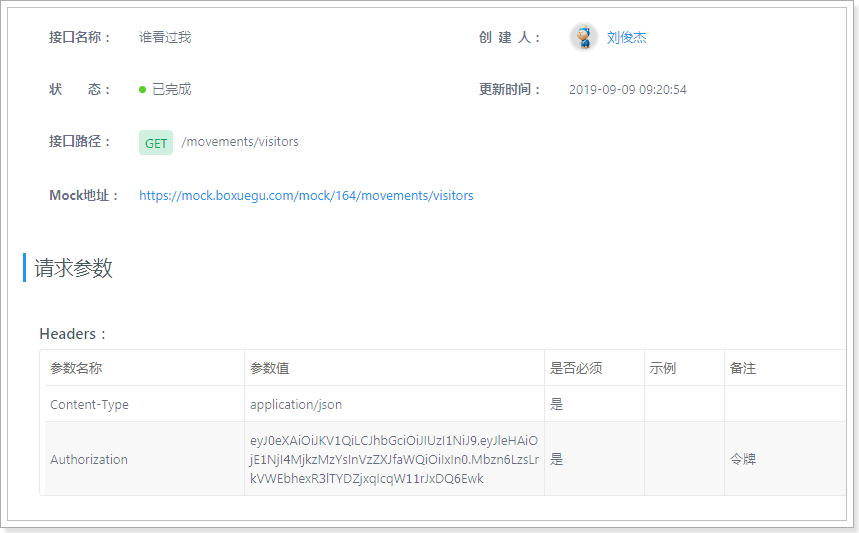

 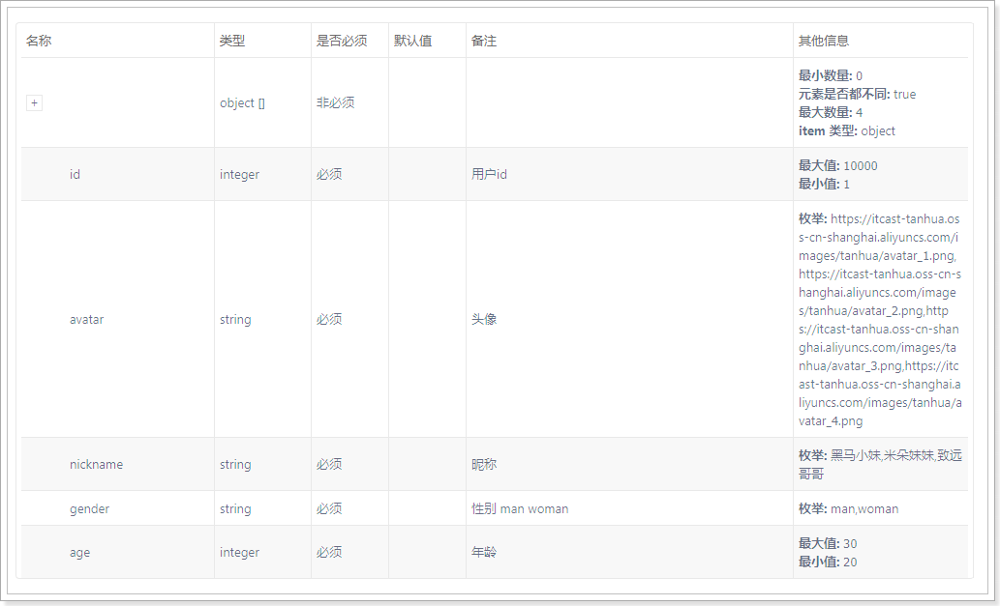

### 2.6 MovementsController

~~~java
package com.tanhua.server.vo;

import lombok.AllArgsConstructor;
import lombok.Data;
import lombok.NoArgsConstructor;

@Data
@NoArgsConstructor
@AllArgsConstructor
public class VisitorsVo {

    private Long id;
    private String avatar;
    private String nickname;
    private String gender;
    private Integer age;
    private String[] tags;
    private Integer fateValue;

}

~~~

~~~java
    /**
     * 谁看过我
     * 
     * @return
     */
    @GetMapping("visitors")
    public ResponseEntity<List<VisitorsVo>> queryVisitorsList(){
        try {
            List<VisitorsVo> list = this.movementsService.queryVisitorsList();
            return ResponseEntity.ok(list);
        } catch (Exception e) {
            e.printStackTrace();
        }
        return ResponseEntity.status(HttpStatus.INTERNAL_SERVER_ERROR).build();
    }
~~~

### 2.7 MovementsService

~~~java
public List<VisitorsVo> queryVisitorsList() {
        User user = UserThreadLocal.get();
        String redisKey = "visitor_date_" + user.getId();

        // 如果redis中存在上次查询的时间，就按照这个时间之后查询，如果没有就查询前5个
        List<Visitors> visitors = null;
        String value = this.redisTemplate.opsForValue().get(redisKey);
        if(StringUtils.isEmpty(value)){
            visitors = this.visitorsApi.topVisitor(user.getId(), 5);
        }else{
            visitors = this.visitorsApi.topVisitor(user.getId(), Long.valueOf(value));
        }

        if(CollectionUtils.isEmpty(visitors)){
            return Collections.emptyList();
        }

        List<Long> userIds = new ArrayList<>();
        for (Visitors visitor : visitors) {
            userIds.add(visitor.getVisitorUserId());
        }

        QueryWrapper<UserInfo> queryWrapper = new QueryWrapper<>();
        queryWrapper.in("user_id", userIds);
        List<UserInfo> userInfoList = this.userInfoService.queryList(queryWrapper);

        List<VisitorsVo> visitorsVoList = new ArrayList<>();

        for (Visitors visitor : visitors) {
            for (UserInfo userInfo : userInfoList) {
                if(visitor.getVisitorUserId().longValue() == userInfo.getUserId().longValue()){

                    VisitorsVo visitorsVo = new VisitorsVo();
                    visitorsVo.setAge(userInfo.getAge());
                    visitorsVo.setAvatar(userInfo.getLogo());
                    visitorsVo.setGender(userInfo.getSex().name().toLowerCase());
                    visitorsVo.setId(userInfo.getUserId());
                    visitorsVo.setNickname(userInfo.getNickName());
                    visitorsVo.setTags(StringUtils.split(userInfo.getTags(), ','));
                    visitorsVo.setFateValue(visitor.getScore().intValue());

                    visitorsVoList.add(visitorsVo);
                    break;
                }
            }
        }

        return visitorsVoList;
    }
~~~

### 2.8 测试

 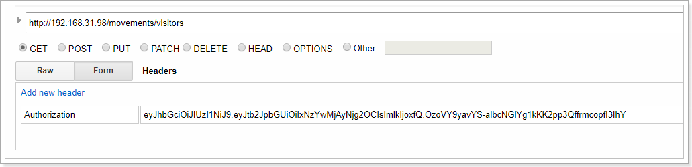

数据：

~~~json
[{"id":20,"avatar":"https://itcast-tanhua.oss-cn-shanghai.aliyuncs.com/images/logo/12.jpg","nickname":"heima_20","gender":"man","age":44,"tags":["单身","本科","年龄相仿"],"fateValue":30},{"id":19,"avatar":"https://itcast-tanhua.oss-cn-shanghai.aliyuncs.com/images/logo/4.jpg","nickname":"heima_19","gender":"woman","age":40,"tags":["单身","本科","年龄相仿"],"fateValue":76},{"id":36,"avatar":"https://itcast-tanhua.oss-cn-shanghai.aliyuncs.com/images/logo/8.jpg","nickname":"heima_36","gender":"woman","age":37,"tags":["单身","本科","年龄相仿"],"fateValue":64},{"id":33,"avatar":"https://itcast-tanhua.oss-cn-shanghai.aliyuncs.com/images/logo/18.jpg","nickname":"heima_33","gender":"man","age":49,"tags":["单身","本科","年龄相仿"],"fateValue":30},{"id":12,"avatar":"https://itcast-tanhua.oss-cn-shanghai.aliyuncs.com/images/logo/18.jpg","nickname":"heima_12","gender":"man","age":23,"tags":["单身","本科","年龄相仿"],"fateValue":30}]
~~~

## 3. 佳人信息

首页显示的今日佳人，点击之后可以查看今日佳人的详情。

### 3.1 mock接口

地址： https://mock.boxuegu.com/project/164/interface/api/78008 

 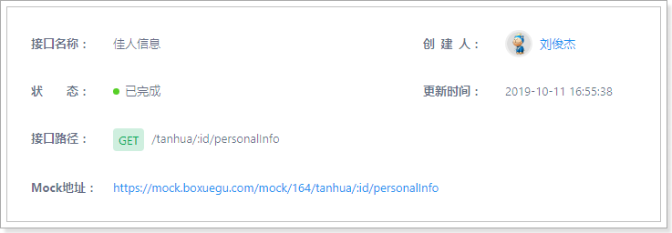

 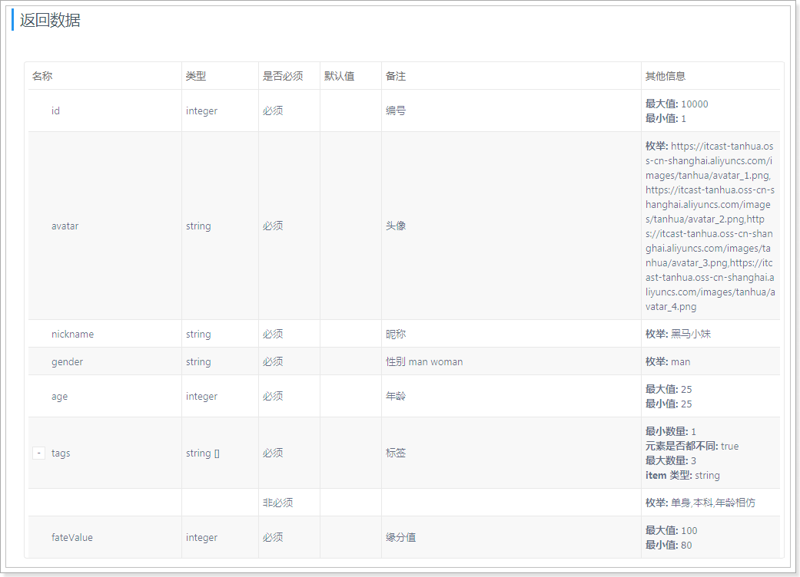

### 3.2 TodayBestController

~~~java
    /**
     * 查询今日佳人详情
     *
     * @param userId
     * @return
     */
    @GetMapping("{id}/personalInfo")
    public ResponseEntity<TodayBest> queryTodayBest(@PathVariable("id") Long userId) {
        try {
            TodayBest todayBest = this.todayBestService.queryTodayBest(userId);
            return ResponseEntity.ok(todayBest);
        } catch (Exception e) {
            e.printStackTrace();
        }
        return ResponseEntity.status(HttpStatus.INTERNAL_SERVER_ERROR).build();
    }
~~~

### 3.3 TodayBestService

~~~java
public TodayBest queryTodayBest(Long userId) {

    User user = UserThreadLocal.get();

    TodayBest todayBest = new TodayBest();
    //补全信息
    UserInfo userInfo = this.userInfoService.queryById(userId);
    todayBest.setId(userId);
    todayBest.setAge(userInfo.getAge());
    todayBest.setAvatar(userInfo.getLogo());
    todayBest.setGender(userInfo.getSex().name().toLowerCase());
    todayBest.setNickname(userInfo.getNickName());
    todayBest.setTags(StringUtils.split(userInfo.getTags(), ','));

    double score = this.recommendUserService.queryScore(userId, user.getId());
    if(score == 0){
        score = 98; //默认分值
    }

    todayBest.setFateValue(Double.valueOf(score).longValue());

    return todayBest;
}
~~~

### 3.4 查询缘分值

#### 3.4.1 recommendUserApi

~~~java
/**
     * 查询推荐好友的缘分值
     *
     * @param userId
     * @param toUserId
     * @return
     */
    double queryScore(Long userId, Long toUserId);
~~~

#### 3.4.2 RecommendUserApiImpl

~~~java
@Override
public double queryScore(Long userId, Long toUserId) {
    Query query = Query.query(Criteria
                              .where("toUserId").is(toUserId)
                              .and("userId").is(userId));
    RecommendUser recommendUser = this.mongoTemplate.findOne(query, RecommendUser.class);
    if (null == recommendUser) {
        return 0;
    }
    return recommendUser.getScore();
}
~~~

#### 3.4.3 RecommendUserService

在server工程中完成。

~~~java
    /**
     * 查询推荐好友的缘分值
     *
     * @param userId
     * @param toUserId
     * @return
     */
    double queryScore(Long userId, Long toUserId) {
        return this.recommendUserApi.queryScore(userId, toUserId);
    }
~~~

### 3.5 查询自己相册

#### 3.5.1 mock接口

地址： https://mock.boxuegu.com/project/164/interface/api/77938 

 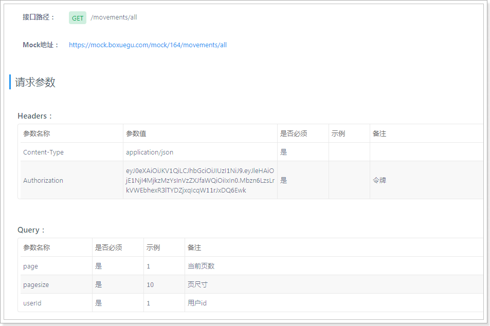

#### 3.5.2 定义dubbo接口

~~~java
//QuanZiApi
/**
     * 查询相册表
     *
     * @param userId
     * @param page
     * @param pageSize
     * @return
     */
PageInfo<Publish> queryAlbumList(Long userId, Integer page, Integer pageSize);

~~~

#### 3.5.3 dubbo接口实现

~~~java
//QuanZiApiImpl
@Override
    public PageInfo<Publish> queryAlbumList(Long userId, Integer page, Integer pageSize) {
        PageInfo<Publish> pageInfo = new PageInfo<>();
        pageInfo.setPageNum(page);
        pageInfo.setPageSize(pageSize);
        pageInfo.setTotal(0); //不提供总数

        PageRequest pageRequest = PageRequest.of(page - 1, pageSize, Sort.by(Sort.Order.desc("created")));
        Query query = new Query().with(pageRequest);
        List<Album> albumList = this.mongoTemplate.find(query, Album.class, "quanzi_album_" + userId);

        if(CollectionUtils.isEmpty(albumList)){
            return pageInfo;
        }

        List<ObjectId> publishIds = new ArrayList<>();
        for (Album album : albumList) {
            publishIds.add(album.getPublishId());
        }

        //查询发布信息
        Query queryPublish = Query.query(Criteria.where("id").in(publishIds)).with(Sort.by(Sort.Order.desc("created")));
        List<Publish> publishList = this.mongoTemplate.find(queryPublish, Publish.class);

        pageInfo.setRecords(publishList);

        return pageInfo;
    }
~~~

#### 3.5.3 MovementsController

~~~java
    /**
     * 自己的所有动态
     *
     * @return
     */
    @GetMapping("all")
    public ResponseEntity<PageResult> queryAlbumList(@RequestParam(value = "page", defaultValue = "1") Integer page,
                                                     @RequestParam(value = "pagesize", defaultValue = "10") Integer pageSize,
                                                     @RequestParam(value = "userId") Long userId) {
        try {
            PageResult pageResult = this.movementsService.queryAlbumList(userId, page, pageSize);
            return ResponseEntity.ok(pageResult);
        } catch (Exception e) {
            e.printStackTrace();
        }
        return ResponseEntity.status(HttpStatus.INTERNAL_SERVER_ERROR).build();
    }
~~~

#### 3.5.4 MovementsService

~~~java
 public PageResult queryAlbumList(Long userId, Integer page, Integer pageSize) {
        PageResult pageResult = new PageResult();
        pageResult.setPage(page);
        pageResult.setPagesize(pageSize);

        PageInfo<Publish> albumPageInfo = this.quanZiApi.queryAlbumList(userId, page, pageSize);
        List<Publish> records = albumPageInfo.getRecords();

        if(CollectionUtils.isEmpty(records)){
            return pageResult;
        }

        List<Movements> movementsList = new ArrayList<>();
        for (Publish record : records) {
            Movements movements = new Movements();

            movements.setId(record.getId().toHexString());
            movements.setImageContent(record.getMedias().toArray(new String[]{}));
            movements.setTextContent(record.getText());
            movements.setUserId(record.getUserId());
            movements.setCreateDate(RelativeDateFormat.format(new Date(record.getCreated())));

            movementsList.add(movements);
        }

        List<Long> userIds = new ArrayList<>();
        for (Movements movements : movementsList) {
            if (!userIds.contains(movements.getUserId())) {
                userIds.add(movements.getUserId());
            }

        }

        QueryWrapper<UserInfo> queryWrapper = new QueryWrapper<>();
        queryWrapper.in("user_id", userIds);
        List<UserInfo> userInfos = this.userInfoService.queryList(queryWrapper);
        for (Movements movements : movementsList) {
            for (UserInfo userInfo : userInfos) {
                if (movements.getUserId().longValue() == userInfo.getUserId().longValue()) {
                    this.fillValueToMovements(movements, userInfo);
                    break;
                }
            }
        }

        pageResult.setItems(movementsList);

        return pageResult;
    }
~~~

#### 3.5.5 测试

 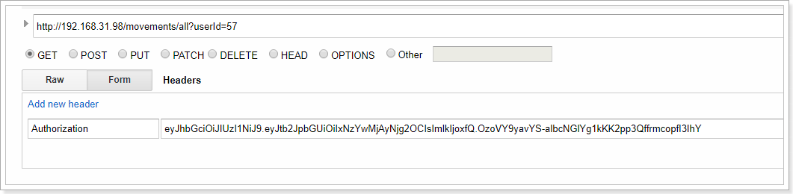

 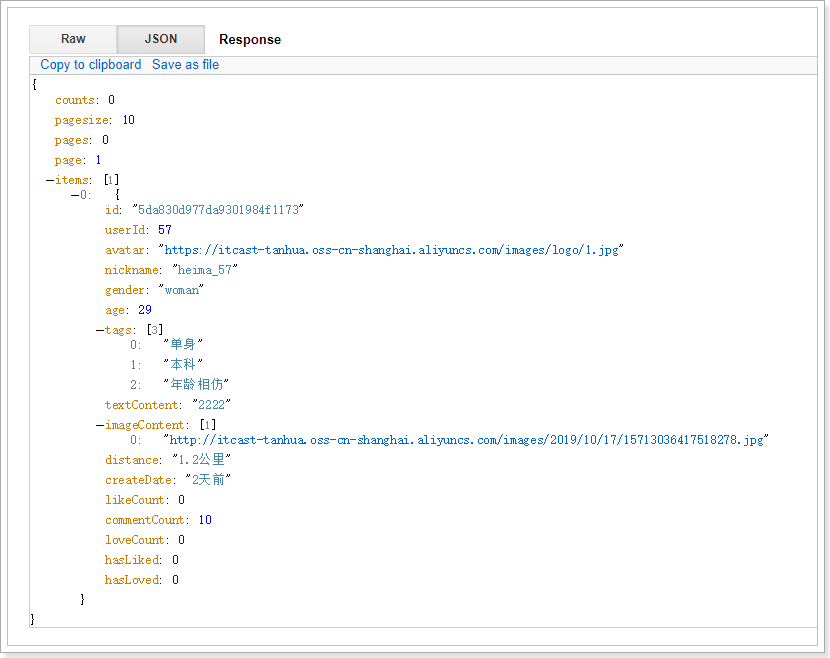

### 3.6 整合测试

 

## 4. 聊一下

聊一下功能包含了2个接口：

- 查询对方设置的问题
- 提交答案
  - 提交答案后要发送消息给对方

mock接口： https://mock.boxuegu.com/project/164/interface/api/77973 

 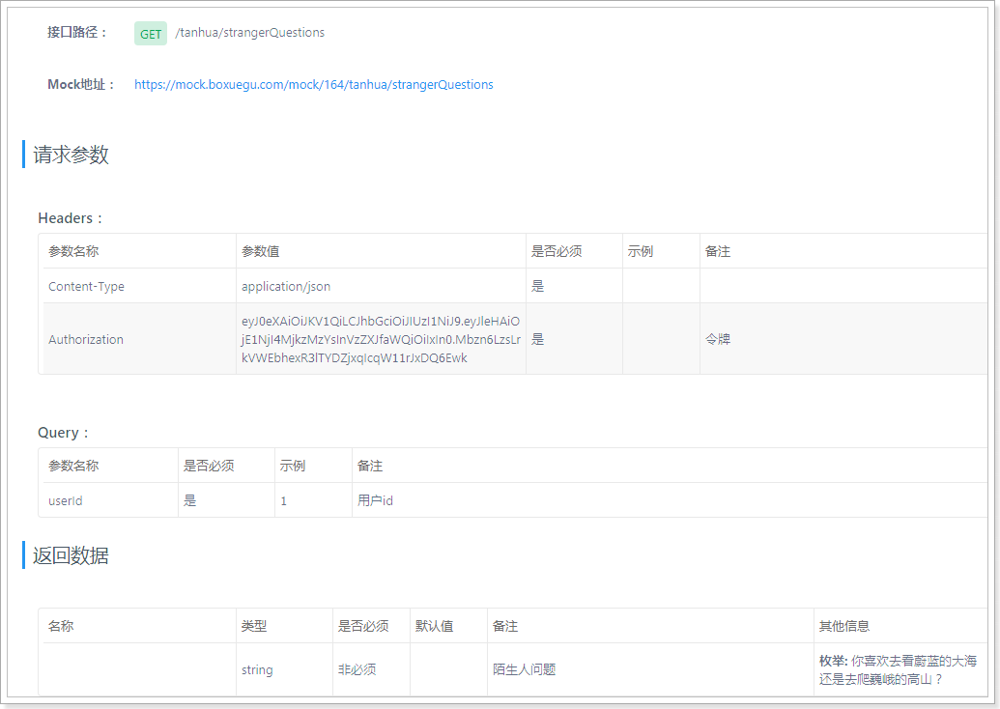

### 4.1 表结构

~~~sql
CREATE TABLE `tb_question` (
  `id` bigint(20) NOT NULL AUTO_INCREMENT,
  `user_id` bigint(20) DEFAULT NULL COMMENT '用户id',
  `txt` varchar(200) DEFAULT NULL COMMENT '问题内容',
  `created` datetime DEFAULT NULL,
  `updated` datetime DEFAULT NULL,
  PRIMARY KEY (`id`),
  KEY `user_id` (`user_id`)
) ENGINE=InnoDB DEFAULT CHARSET=utf8;

-- 插入数据
INSERT INTO `tb_question` (`id`, `user_id`, `txt`, `created`, `updated`) VALUES ('1', '1', '你喜欢去看蔚蓝的大海还是去爬巍峨的高山？', '2019-10-20 17:25:58', '2019-10-20 17:26:01');
INSERT INTO `tb_question` (`id`, `user_id`, `txt`, `created`, `updated`) VALUES ('2', '57', '你喜欢什么颜色？', '2019-10-20 23:17:39', '2019-10-20 23:17:41');

~~~

### 4.2 编写Question

~~~java
package com.tanhua.server.pojo;

import lombok.AllArgsConstructor;
import lombok.Data;
import lombok.NoArgsConstructor;

@Data
@NoArgsConstructor
@AllArgsConstructor
public class Question extends BasePojo {

    private Long id;
    private Long userId;
    //问题内容
    private String txt;

}

~~~

### 4.3 QuestionMapper

~~~java
package com.tanhua.server.mapper;

import com.baomidou.mybatisplus.core.mapper.BaseMapper;
import com.tanhua.server.pojo.Question;

public interface QuestionMapper extends BaseMapper<Question> {

}

~~~

### 4.4 QuestionService

~~~java
package com.tanhua.server.service;

import com.baomidou.mybatisplus.core.conditions.query.QueryWrapper;
import com.tanhua.server.mapper.QuestionMapper;
import com.tanhua.server.pojo.Question;
import org.springframework.beans.factory.annotation.Autowired;
import org.springframework.stereotype.Service;

@Service
public class QuestionService {

    @Autowired
    private QuestionMapper questionMapper;

    public Question queryQuestion(Long userId) {
        QueryWrapper queryWrapper = new QueryWrapper();
        queryWrapper.eq("user_id", userId);
        return this.questionMapper.selectOne(queryWrapper);
    }
}

~~~

### 4.5 查询陌生人问题

#### 4.5.1 TodayBestController

~~~java
    /**
     * 查询陌生人问题
     *
     * @param userId
     * @return
     */
    @GetMapping("strangerQuestions")
    public ResponseEntity<String> queryQuestion(@RequestParam("userId") Long userId) {
        try {
            String question = this.todayBestService.queryQuestion(userId);
            return ResponseEntity.ok(question);
        } catch (Exception e) {
            e.printStackTrace();
        }
        return ResponseEntity.status(HttpStatus.INTERNAL_SERVER_ERROR).build();
    }
~~~

#### 4.5.2 TodayBestService

~~~java
    public String queryQuestion(Long userId) {
        Question question = this.questionService.queryQuestion(userId);
        if (null != question) {
            return question.getTxt();
        }
        return "";
    }
~~~

### 4.5.3 测试

 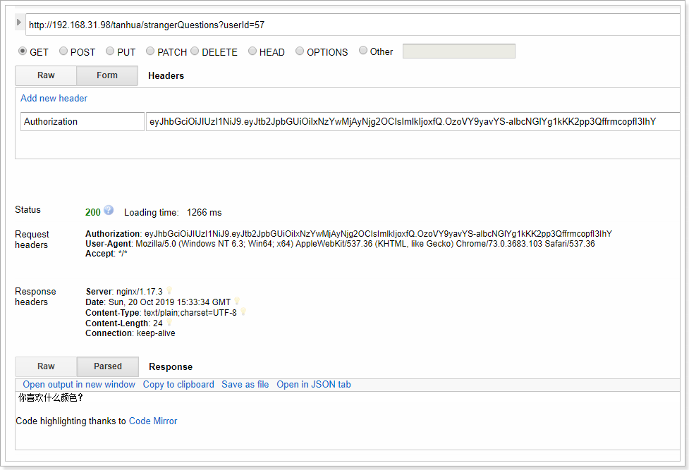

 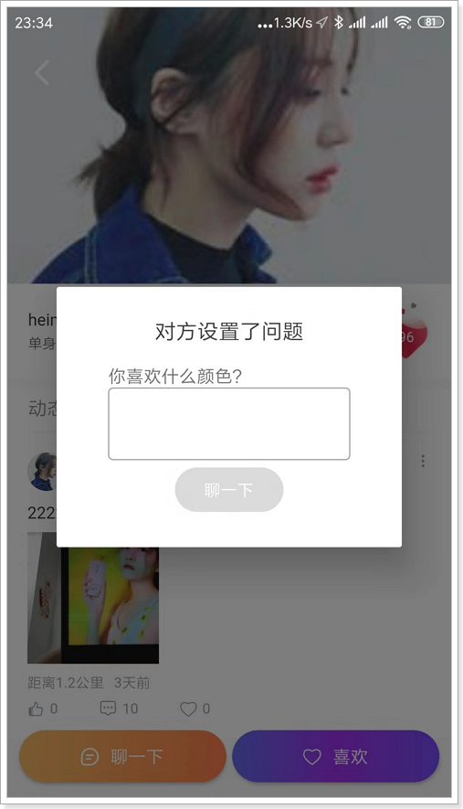

### 4.6 回复陌生人问题

#### 4.6.1 mock接口

 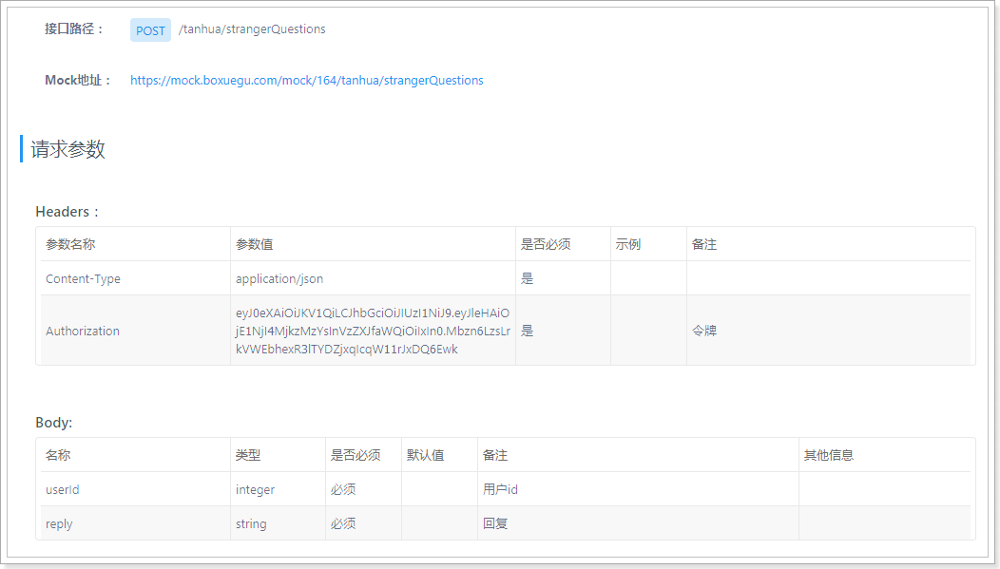

#### 4.6.2 发送消息给环信

在sso系统中完成。

##### 4.6.2.1 HuanXinController

~~~java
/**
     * 发送系统消息
     *
     * @param target
     * @param msg
     * @param type
     * @return
     */
    @PostMapping("messages")
    public ResponseEntity<Void> sendMsg(@RequestParam("target") String target,
                                        @RequestParam("msg") String msg,
                                        @RequestParam(value = "type", defaultValue = "txt") String type) {
        try {
            boolean result = this.huanXinService.sendMsg(target, type, msg);
            if (result) {
                return ResponseEntity.ok(null);
            }
        } catch (Exception e) {
            e.printStackTrace();
        }

        return ResponseEntity.status(HttpStatus.INTERNAL_SERVER_ERROR).build();
    }
~~~

##### 4.6.2.2 HuanXinService

~~~java
public boolean sendMsg(String target, String type, String msg) {
        String targetUrl = this.huanXinConfig.getUrl()
                + this.huanXinConfig.getOrgName() + "/"
                + this.huanXinConfig.getAppName() + "/messages";
        try {
            String token = this.huanXinTokenService.getToken();
            // 请求头
            HttpHeaders headers = new HttpHeaders();
            headers.add("Authorization", "Bearer " + token);

            Map<String, Object> paramMap = new HashMap<>();
            paramMap.put("target_type", "users");
            paramMap.put("target", Arrays.asList(target));

            Map<String, Object> msgMap = new HashMap<>();
            msgMap.put("type", type);
            msgMap.put("msg", msg);

            paramMap.put("msg", msgMap);

            //表示消息发送者;无此字段Server会默认设置为“from”:“admin”，有from字段但值为空串(“”)时请求失败
//            msgMap.put("from", type);

            HttpEntity<String> httpEntity = new HttpEntity<>(MAPPER.writeValueAsString(paramMap), headers);
            ResponseEntity<String> responseEntity = this.restTemplate.postForEntity(targetUrl, httpEntity, String.class);

            return responseEntity.getStatusCodeValue() == 200;
        } catch (Exception e) {
            e.printStackTrace();
        }
        return false;
    }
~~~

##### 4.6.2.3、测试

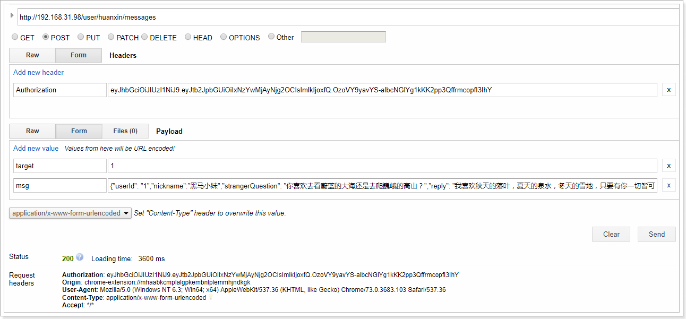

#### 4.6.3 实现服务接口

##### 4.6.3.1 TodayBestController

~~~java
    /**
     * 回复陌生人问题
     *
     * @return
     */
    @PostMapping("strangerQuestions")
    public ResponseEntity<Void> replyQuestion(@RequestBody Map<String, Object> param) {
        try {
            Long userId = Long.valueOf(param.get("userId").toString());
            String reply = param.get("reply").toString();
            Boolean result = this.todayBestService.replyQuestion(userId, reply);
            if (result) {
                return ResponseEntity.ok(null);
            }
        } catch (Exception e) {
            e.printStackTrace();
        }
        return ResponseEntity.status(HttpStatus.INTERNAL_SERVER_ERROR).build();
    }
~~~

##### 4.6.3.2 TodayBestService

~~~java
/**
     * 回复陌生人问题，发送消息给对方
     *
     * @param userId
     * @param reply
     * @return
     */
    public Boolean replyQuestion(Long userId, String reply) {
        User user = UserThreadLocal.get();
        UserInfo userInfo = this.userInfoService.queryById(user.getId());

        //构建消息内容
        Map<String, Object> msg = new HashMap<>();
        msg.put("userId", user.getId().toString());
        msg.put("nickname", this.queryQuestion(userId));
        msg.put("strangerQuestion", userInfo.getNickName());
        msg.put("reply", reply);

        try {
            String msgStr = MAPPER.writeValueAsString(msg);

            String targetUrl = this.url + "/user/huanxin/messages";

            HttpHeaders headers = new HttpHeaders();
            headers.setContentType(MediaType.APPLICATION_FORM_URLENCODED);

            MultiValueMap<String, String> params = new LinkedMultiValueMap<>();
            params.add("target", userId.toString());
            params.add("msg", msgStr);

            HttpEntity<MultiValueMap<String, String>> httpEntity = new HttpEntity<>(params, headers);

            ResponseEntity<Void> responseEntity = this.restTemplate.postForEntity(targetUrl, httpEntity, Void.class);

            return responseEntity.getStatusCodeValue() == 200;
        } catch (Exception e) {
            e.printStackTrace();
        }

        return false;
    }
~~~

#### 4.6.4 测试

 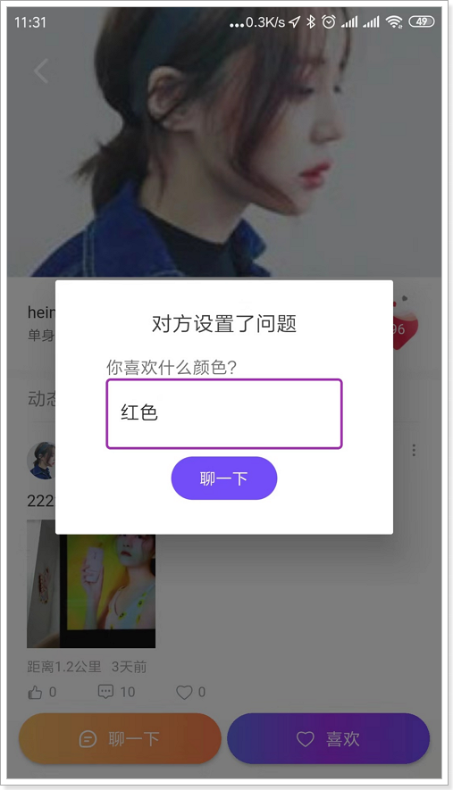

 

## 5. 地理位置

客户端检测用户的地理位置，当变化大于500米时或每隔5分钟，向服务端发送地理位置。

### 6.1 定义pojo

~~~java
package com.tanhua.dubbo.server.pojo;

import lombok.AllArgsConstructor;
import lombok.Data;
import lombok.NoArgsConstructor;
import org.bson.types.ObjectId;
import org.springframework.data.annotation.Id;
import org.springframework.data.mongodb.core.geo.GeoJsonPoint;
import org.springframework.data.mongodb.core.index.CompoundIndex;
import org.springframework.data.mongodb.core.index.Indexed;
import org.springframework.data.mongodb.core.mapping.Document;

@Data
@NoArgsConstructor
@AllArgsConstructor
@Document(collection = "user_location")
@CompoundIndex(name = "location_index", def = "{'location': '2dsphere'}")
public class UserLocation implements java.io.Serializable{

    private static final long serialVersionUID = 4508868382007529970L;

    @Id
    private ObjectId id;
    @Indexed
    private Long userId; //用户id
    private GeoJsonPoint location; //x:经度 y:纬度
    private String address; //位置描述
    private Long created; //创建时间
    private Long updated; //更新时间
    private Long lastUpdated; //上次更新时间

}

~~~

### 6.2 定义dubbo接口

~~~java
package com.tanhua.dubbo.server.api;

public interface UserLocationApi {

    /**
     * 更新用户地理位置
     *
     * @return
     */
    String updateUserLocation(Long userId, Double longitude, Double latitude, String address);

}

~~~

### 6.3 编写实现

~~~java
package com.tanhua.dubbo.server.api;

import com.alibaba.dubbo.config.annotation.Service;
import com.tanhua.dubbo.server.pojo.UserLocation;
import com.tanhua.dubbo.server.vo.UserLocationVo;
import org.bson.types.ObjectId;
import org.springframework.beans.factory.annotation.Autowired;
import org.springframework.data.mongodb.core.MongoTemplate;
import org.springframework.data.mongodb.core.geo.GeoJsonPoint;
import org.springframework.data.mongodb.core.query.Criteria;
import org.springframework.data.mongodb.core.query.Query;
import org.springframework.data.mongodb.core.query.Update;

@Service(version = "1.0.0")
public class UserLocationApiImpl implements UserLocationApi {

    @Autowired
    private MongoTemplate mongoTemplate;

    @Override
    public String updateUserLocation(Long userId, Double longitude, Double latitude, String address) {

        UserLocation userLocation = new UserLocation();
        userLocation.setAddress(address);
        userLocation.setLocation(new GeoJsonPoint(longitude, latitude));
        userLocation.setUserId(userId);

        Query query = Query.query(Criteria.where("userId").is(userLocation.getUserId()));
        UserLocation ul = this.mongoTemplate.findOne(query, UserLocation.class);
        if (ul == null) {
            //新增
            userLocation.setId(ObjectId.get());
            userLocation.setCreated(System.currentTimeMillis());
            userLocation.setUpdated(userLocation.getCreated());
            userLocation.setLastUpdated(userLocation.getCreated());

            this.mongoTemplate.save(userLocation);

            return userLocation.getId().toHexString();
        } else {
            //更新
            Update update = Update
                    .update("location", userLocation.getLocation())
                    .set("updated", System.currentTimeMillis())
                	.set("address", userLocation.getAddress())
                    .set("lastUpdated", ul.getUpdated());
            this.mongoTemplate.updateFirst(query, update, UserLocation.class);
        }

        return ul.getId().toHexString();
    }
    
}

~~~

### 6.4 mock接口	

 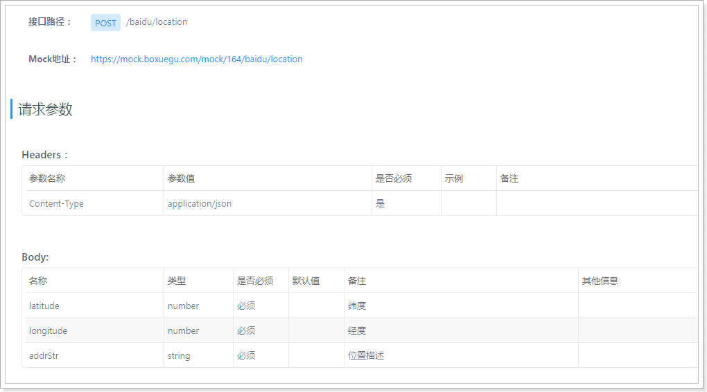

### 6.5 实现服务接口

~~~java
package com.tanhua.server.controller;

import com.tanhua.dubbo.server.pojo.UserLocation;
import com.tanhua.dubbo.server.vo.UserLocationVo;
import com.tanhua.server.service.BaiduService;
import org.springframework.beans.factory.annotation.Autowired;
import org.springframework.http.HttpStatus;
import org.springframework.http.ResponseEntity;
import org.springframework.web.bind.annotation.*;

import java.util.Map;

@RestController
@RequestMapping("baidu")
public class BaiduController {

    @Autowired
    private BaiduService baiduService;

    /**
     * 更新位置
     *
     * @param param
     * @return
     */
    @PostMapping("location")
    public ResponseEntity<Void> updateLocation(@RequestBody Map<String, Object> param) {
        try {
            Double longitude = Double.valueOf(param.get("longitude").toString());
            Double latitude = Double.valueOf(param.get("latitude").toString());
            String address = param.get("addrStr").toString();

            Boolean bool = this.baiduService.updateLocation(longitude, latitude, address);
            if (bool) {
                return ResponseEntity.ok(null);
            }
        } catch (Exception e) {
            e.printStackTrace();
        }

        return ResponseEntity.status(HttpStatus.INTERNAL_SERVER_ERROR).build();
    }
}

~~~

~~~java
package com.tanhua.server.service;

import com.alibaba.dubbo.config.annotation.Reference;
import com.tanhua.dubbo.server.api.UserLocationApi;
import com.tanhua.dubbo.server.pojo.UserLocation;
import com.tanhua.server.pojo.User;
import com.tanhua.server.utils.UserThreadLocal;
import org.springframework.data.mongodb.core.geo.GeoJsonPoint;
import org.springframework.stereotype.Service;

@Service
public class BaiduService {

    @Reference(version = "1.0.0")
    private UserLocationApi userLocationApi;

    public Boolean updateLocation(Double longitude, Double latitude, String address) {
        try {
            User user = UserThreadLocal.get();
            this.userLocationApi.updateUserLocation(user.getId(), longitude, latitude, address);
            return true;
        } catch (Exception e) {
            e.printStackTrace();
        }
        return false;
    }

}

~~~

### 6.6 测试

 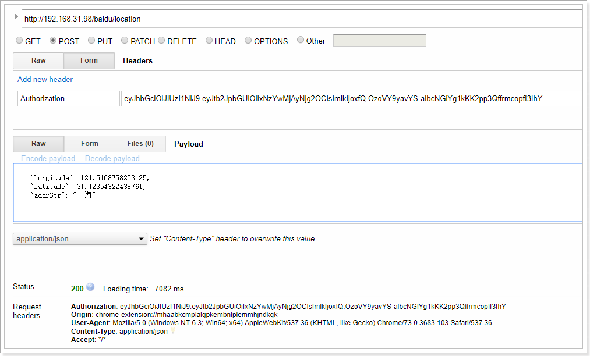

 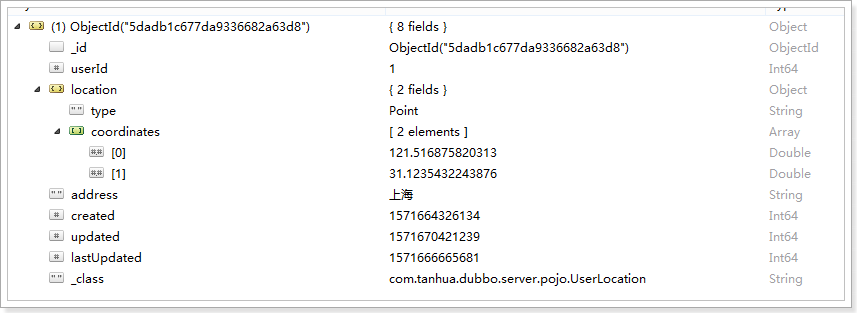

查看索引：

 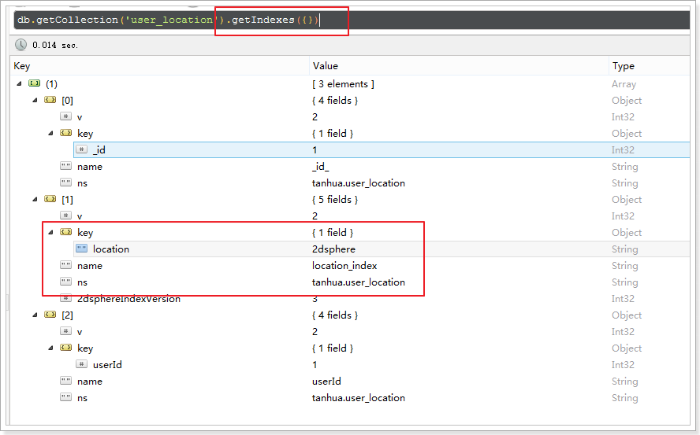