## 课程说明

- 使用MongoDB实现搜附近的功能
- 使用Elasticsearch实现搜附近的功能
- 实现探花功能
- 实现维护用户信息功能

## 1. 搜附近

在首页中点击“搜附近”可以搜索附近的好友，效果如下：

 

### 1.1 定义dubbo接口

~~~java
package com.tanhua.dubbo.server.api;

import com.tanhua.dubbo.server.vo.UserLocationVo;

import java.util.List;

public interface UserLocationApi {

    /**
     * 更新用户地理位置
     *
     * @return
     */
    String updateUserLocation(Long userId, Double longitude, Double latitude, String address);

    /**
     * 查询用户地理位置
     *
     * @param userId
     * @return
     */
    UserLocationVo queryByUserId(Long userId);

    /**
     * 根据地理位置查询用户
     *
     * @param longitude
     * @param latitude
     * @return
     */
    List<UserLocationVo> queryUserFromLocation(Double longitude, Double latitude, Integer range);
}

~~~

> **由于UserLocation不能序列化，所以要再定义UserLocationVo进行返回数据。**

~~~java
package com.tanhua.dubbo.server.vo;

import com.tanhua.dubbo.server.pojo.UserLocation;
import lombok.AllArgsConstructor;
import lombok.Data;
import lombok.NoArgsConstructor;

import java.util.ArrayList;
import java.util.List;

@Data
@NoArgsConstructor
@AllArgsConstructor
public class UserLocationVo implements java.io.Serializable {

    private static final long serialVersionUID = 4133419501260037769L;

    private String id;
    private Long userId; //用户id
    private Double longitude; //经度
    private Double latitude; //维度
    private String address; //位置描述
    private Long created; //创建时间
    private Long updated; //更新时间
    private Long lastUpdated; //上次更新时间

    public static final UserLocationVo format(UserLocation userLocation) {
        UserLocationVo userLocationVo = new UserLocationVo();
        userLocationVo.setAddress(userLocation.getAddress());
        userLocationVo.setCreated(userLocation.getCreated());
        userLocationVo.setId(userLocation.getId().toHexString());
        userLocationVo.setLastUpdated(userLocation.getLastUpdated());
        userLocationVo.setUpdated(userLocation.getUpdated());
        userLocationVo.setUserId(userLocation.getUserId());
        userLocationVo.setLongitude(userLocation.getLocation().getX());
        userLocationVo.setLatitude(userLocation.getLocation().getY());
        return userLocationVo;
    }

    public static final List<UserLocationVo> formatToList(List<UserLocation> userLocations) {
        List<UserLocationVo> list = new ArrayList<>();
        for (UserLocation userLocation : userLocations) {
            list.add(format(userLocation));
        }
        return list;
    }
}

~~~

### 1.2 编写实现类

~~~java
package com.tanhua.dubbo.server.api;

import com.alibaba.dubbo.config.annotation.Service;
import com.tanhua.dubbo.server.pojo.UserLocation;
import com.tanhua.dubbo.server.vo.UserLocationVo;
import org.bson.types.ObjectId;
import org.springframework.beans.factory.annotation.Autowired;
import org.springframework.data.geo.Circle;
import org.springframework.data.geo.Distance;
import org.springframework.data.geo.Metrics;
import org.springframework.data.mongodb.core.MongoTemplate;
import org.springframework.data.mongodb.core.geo.GeoJsonPoint;
import org.springframework.data.mongodb.core.query.Criteria;
import org.springframework.data.mongodb.core.query.Query;
import org.springframework.data.mongodb.core.query.Update;

import java.util.List;

@Service(version = "1.0.0")
public class UserLocationApiImpl implements UserLocationApi {

    @Autowired
    private MongoTemplate mongoTemplate;

    @Override
    public UserLocationVo queryByUserId(Long userId) {
        Query query = Query.query(Criteria.where("userId").is(userId));
        UserLocation userLocation = this.mongoTemplate.findOne(query, UserLocation.class);
        return UserLocationVo.format(userLocation);
    }

    @Override
    public List<UserLocationVo> queryUserFromLocation(Double longitude, Double latitude, Integer range) {

        //中心点
        GeoJsonPoint geoJsonPoint = new GeoJsonPoint(longitude, latitude);

        //转换为2dsphere的距离
        Distance distance = new Distance(range / 1000, Metrics.KILOMETERS);

        //画一个圆
        Circle circle = new Circle(geoJsonPoint, distance);
        Query query = Query.query(Criteria.where("location").withinSphere(circle));
        return UserLocationVo.formatToList(this.mongoTemplate.find(query, UserLocation.class));
    }
}

~~~

### 1.3 测试

坐标查询： http://api.map.baidu.com/lbsapi/getpoint/ 

~~~java
package com.tanhua.dubbo.server.api;

import com.tanhua.dubbo.server.vo.UserLocationVo;
import org.junit.Test;
import org.junit.runner.RunWith;
import org.springframework.beans.factory.annotation.Autowired;
import org.springframework.boot.test.context.SpringBootTest;
import org.springframework.test.context.junit4.SpringJUnit4ClassRunner;

import java.util.List;

@RunWith(SpringJUnit4ClassRunner.class)
@SpringBootTest
public class TestUserLocationApi {

    @Autowired
    private UserLocationApi userLocationApi;

    @Test
    public void testQuery() {
        Double longitude = 121.512253;
        Double latitude = 31.24094;
        Integer range = 1000;
        List<UserLocationVo> userLocationVos = this.userLocationApi.queryUserFromLocation(longitude, latitude, range);
        for (UserLocationVo userLocationVo : userLocationVos) {
            System.out.println(userLocationVo);
        }
    }

    @Test
    public void testSaveTestData() {
        this.userLocationApi.updateUserLocation(1L, 121.512253,31.24094, "金茂大厦");
        this.userLocationApi.updateUserLocation(2L, 121.506377, 31.245105, "东方明珠广播电视塔");
        this.userLocationApi.updateUserLocation(10L, 121.508815,31.243844, "陆家嘴地铁站");
        this.userLocationApi.updateUserLocation(12L, 121.511999,31.239185, "上海中心大厦");
        this.userLocationApi.updateUserLocation(25L, 121.493444,31.240513, "上海市公安局");
        this.userLocationApi.updateUserLocation(27L, 121.494108,31.247011, "上海外滩美术馆");
        this.userLocationApi.updateUserLocation(30L, 121.462452,31.253463, "上海火车站");
        this.userLocationApi.updateUserLocation(32L, 121.81509,31.157478, "上海浦东国际机场");
        this.userLocationApi.updateUserLocation(34L, 121.327908,31.20033, "虹桥火车站");
        this.userLocationApi.updateUserLocation(38L, 121.490155,31.277476, "鲁迅公园");
        this.userLocationApi.updateUserLocation(40L, 121.425511,31.227831, "中山公园");
        this.userLocationApi.updateUserLocation(43L, 121.594194,31.207786, "张江高科");
    }

}

~~~

### 1.4 mock接口

地址： https://mock.boxuegu.com/project/164/interface/api/64064 

 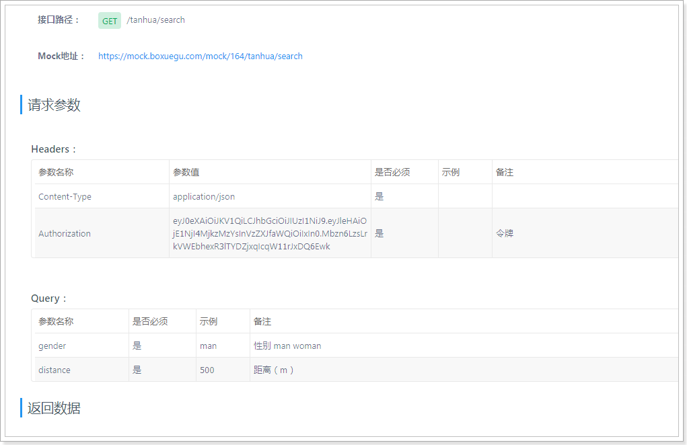

 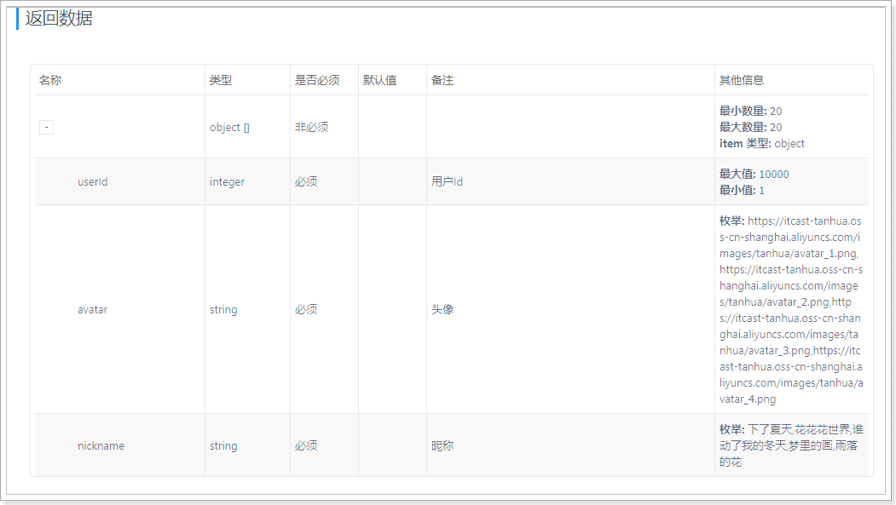

### 1.5 编写TodayBestController

~~~java
    /**
     * 搜附近
     *
     * @param gender
     * @param distance
     * @return
     */
    @GetMapping("search")
    public ResponseEntity<List<NearUserVo>> queryNearUser(@RequestParam(value = "gender", required = false) String gender,
                                                          @RequestParam(value = "distance", defaultValue = "2000") String distance) {
        try {
            List<NearUserVo> list = this.todayBestService.queryNearUser(gender, distance);
            return ResponseEntity.ok(list);
        } catch (Exception e) {
            e.printStackTrace();
        }
        return ResponseEntity.status(HttpStatus.INTERNAL_SERVER_ERROR).build();
    }
~~~

~~~java
package com.tanhua.server.vo;

import lombok.AllArgsConstructor;
import lombok.Data;
import lombok.NoArgsConstructor;

@Data
@NoArgsConstructor
@AllArgsConstructor
public class NearUserVo {

    private Long userId;
    private String avatar;
    private String nickname;

}

~~~

### 1.6 TodayBestService

~~~java
public List<NearUserVo> queryNearUser(String gender, String distance) {
        User user = UserThreadLocal.get();
        // 查询当前用户的位置信息
        UserLocationVo userLocationVo = this.userLocationApi.queryByUserId(user.getId());
        Double longitude = userLocationVo.getLongitude();
        Double latitude = userLocationVo.getLatitude();

        // 根据当前用户的位置信息查询附近的好友
        List<UserLocationVo> userLocationList = this.userLocationApi
                .queryUserFromLocation(longitude, latitude, Integer.valueOf(distance));

        if (CollectionUtils.isEmpty(userLocationList)) {
            return Collections.emptyList();
        }

        List<Long> userIds = new ArrayList<>();
        for (UserLocationVo locationVo : userLocationList) {
            userIds.add(locationVo.getUserId());
        }

        QueryWrapper<UserInfo> queryWrapper = new QueryWrapper<>();
        queryWrapper.in("user_id", userIds);
        if (StringUtils.equalsIgnoreCase(gender, "man")) {
            queryWrapper.in("sex", SexEnum.MAN);
        } else if (StringUtils.equalsIgnoreCase(gender, "woman")) {
            queryWrapper.in("sex", SexEnum.WOMAN);
        }

        List<UserInfo> userInfoList = this.userInfoService.queryList(queryWrapper);

        List<NearUserVo> nearUserVoList = new ArrayList<>();

        for (UserLocationVo locationVo : userLocationList) {

            if (locationVo.getUserId().longValue() == user.getId().longValue()) {
                // 排除自己
                continue;
            }

            for (UserInfo userInfo : userInfoList) {
                if (locationVo.getUserId().longValue() == userInfo.getUserId().longValue()) {
                    NearUserVo nearUserVo = new NearUserVo();

                    nearUserVo.setUserId(userInfo.getUserId());
                    nearUserVo.setAvatar(userInfo.getLogo());
                    nearUserVo.setNickname(userInfo.getNickName());

                    nearUserVoList.add(nearUserVo);
                    break;
                }
            }
        }

        return nearUserVoList;
    }
}
~~~

### 1.7 测试

 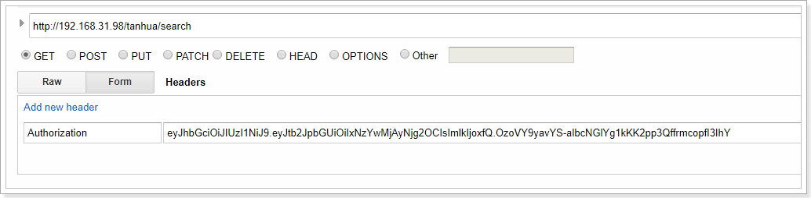

 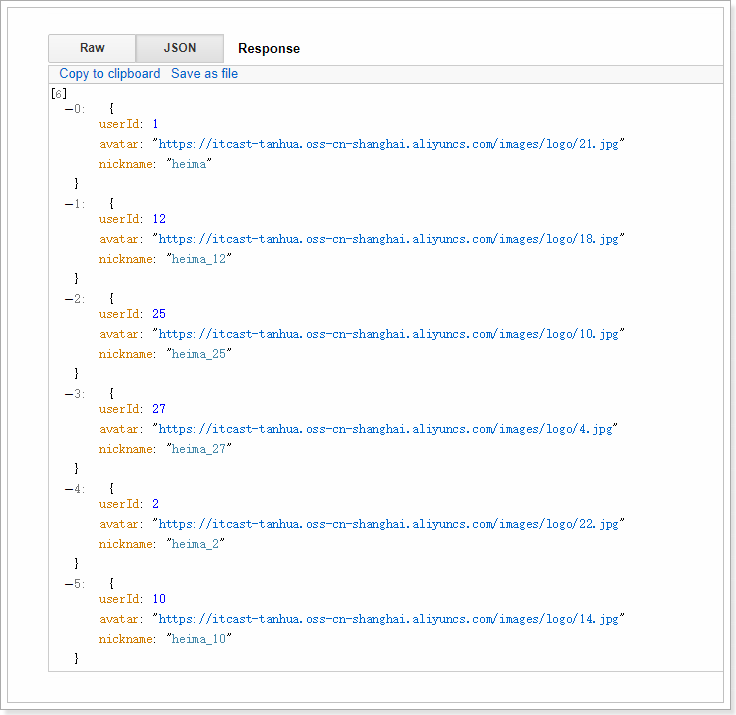

 

## 2. Elasticsearch实现位置查询

前面我们通过MongoDB实现了位置查询，有一些项目也会选择使用Elasticsearch的geo实现，接下来我们给大家讲解下如何使用Elasticsearch实现位置查询。

### 2.1 搭建Elasticsearch集群

~~~shell
#单个进程中的最大线程数
vim /etc/sysctl.conf
vm.max_map_count=262144
#立即生效
/sbin/sysctl -p

mkdir /itcast/tanhua/es-cluster/node01 -p
mkdir /itcast/tanhua/es-cluster/node02 -p
mkdir /itcast/tanhua/es-cluster/node03 -p

#复制资料目录下的jvm.options到node01、node02、node03目录

#在node01目录下，创建elasticsearch.yml文件，并输入如下内容：
cluster.name: es-tanhua-cluster
node.name: node01
node.master: true
node.data: true
network.host: 192.168.31.81
http.port: 9200
discovery.zen.ping.unicast.hosts: ["192.168.31.81"]
discovery.zen.minimum_master_nodes: 2
http.cors.enabled: true
http.cors.allow-origin: "*"

#在node02目录下，创建elasticsearch.yml文件，并输入如下内容：
cluster.name: es-tanhua-cluster
node.name: node02
node.master: true
node.data: true
network.host: 192.168.31.81
http.port: 9201
discovery.zen.ping.unicast.hosts: ["192.168.31.81"]
discovery.zen.minimum_master_nodes: 2
http.cors.enabled: true
http.cors.allow-origin: "*"

#在node03目录下，创建elasticsearch.yml文件，并输入如下内容：
cluster.name: es-tanhua-cluster
node.name: node03
node.master: true
node.data: true
network.host: 192.168.31.81
http.port: 9202
discovery.zen.ping.unicast.hosts: ["192.168.31.81"]
discovery.zen.minimum_master_nodes: 2
http.cors.enabled: true
http.cors.allow-origin: "*"

#创建容器
docker create --restart=always --name es-node01 --net host -v /itcast/tanhua/es-cluster/node01/elasticsearch.yml:/usr/share/elasticsearch/config/elasticsearch.yml -v /itcast/tanhua/es-cluster/node01/jvm.options:/usr/share/elasticsearch/config/jvm.options -v es-cluster-node01-data:/usr/share/elasticsearch/data elasticsearch:6.5.4

docker create --restart=always --name es-node02 --net host -v /itcast/tanhua/es-cluster/node02/elasticsearch.yml:/usr/share/elasticsearch/config/elasticsearch.yml -v /itcast/tanhua/es-cluster/node02/jvm.options:/usr/share/elasticsearch/config/jvm.options -v es-cluster-node02-data:/usr/share/elasticsearch/data elasticsearch:6.5.4

docker create --restart=always --name es-node03 --net host -v /itcast/tanhua/es-cluster/node03/elasticsearch.yml:/usr/share/elasticsearch/config/elasticsearch.yml -v /itcast/tanhua/es-cluster/node03/jvm.options:/usr/share/elasticsearch/config/jvm.options -v es-cluster-node03-data:/usr/share/elasticsearch/data elasticsearch:6.5.4

#启动容器
docker start es-node01 es-node02 es-node03

#或单个启动并查看日志
docker start es-node01 && docker logs -f es-node01
docker start es-node02 && docker logs -f es-node02
docker start es-node03 && docker logs -f es-node03
~~~

测试：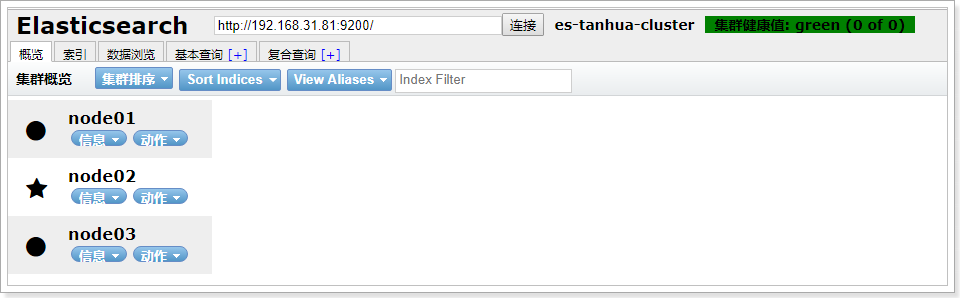

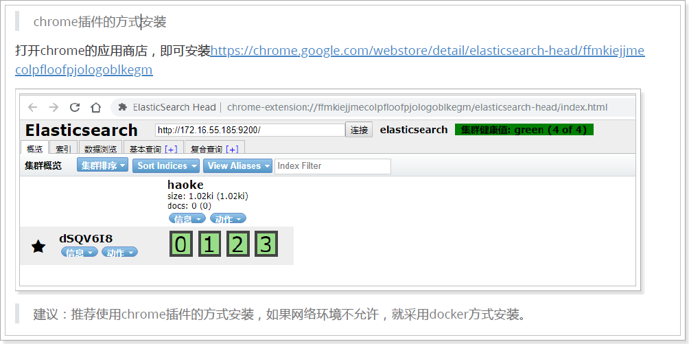

### 2.2 搭建工程

pom.xml文件：

~~~xml
<?xml version="1.0" encoding="UTF-8"?>
<project xmlns="http://maven.apache.org/POM/4.0.0"
         xmlns:xsi="http://www.w3.org/2001/XMLSchema-instance"
         xsi:schemaLocation="http://maven.apache.org/POM/4.0.0 http://maven.apache.org/xsd/maven-4.0.0.xsd">
    <parent>
        <artifactId>itcast-tanhua</artifactId>
        <groupId>cn.itcast.tanhua</groupId>
        <version>1.0-SNAPSHOT</version>
    </parent>
    <modelVersion>4.0.0</modelVersion>

    <artifactId>itcast-tanhua-elasticsearch</artifactId>

    <dependencies>
        <dependency>
            <groupId>org.springframework.boot</groupId>
            <artifactId>spring-boot-starter-web</artifactId>
        </dependency>
        <dependency>
            <groupId>org.springframework.boot</groupId>
            <artifactId>spring-boot-starter-data-elasticsearch</artifactId>
        </dependency>
        <dependency>
            <groupId>org.springframework.boot</groupId>
            <artifactId>spring-boot-starter-test</artifactId>
            <scope>test</scope>
        </dependency>
        <!--其他工具包依赖-->
        <dependency>
            <groupId>org.apache.commons</groupId>
            <artifactId>commons-lang3</artifactId>
        </dependency>
        <dependency>
            <groupId>org.projectlombok</groupId>
            <artifactId>lombok</artifactId>
        </dependency>
    </dependencies>

</project>
~~~

### 2.3 application.properties

~~~properties
spring.application.name = itcast-tanhua-elasticsearch
server.port = 18082

spring.data.elasticsearch.cluster-name=es-tanhua-cluster
spring.data.elasticsearch.cluster-nodes=192.168.31.81:9300,192.168.31.81:9301,192.168.31.81:9302
~~~

### 2.4 log4j.properties

~~~properties
log4j.rootLogger=DEBUG,A1

log4j.appender.A1=org.apache.log4j.ConsoleAppender
log4j.appender.A1.layout=org.apache.log4j.PatternLayout
log4j.appender.A1.layout.ConversionPattern=[%t] [%c]-[%p] %m%n
~~~

启动类：

~~~java
package com.tanhua.es;

import org.springframework.boot.SpringApplication;
import org.springframework.boot.autoconfigure.SpringBootApplication;

@SpringBootApplication
public class ESApplication {

    public static void main(String[] args) {
        SpringApplication.run(ESApplication.class, args);
    }
}

~~~

### 2.5 UserLocationES

~~~java
package com.tanhua.es.pojo;

import lombok.AllArgsConstructor;
import lombok.Data;
import lombok.NoArgsConstructor;
import org.elasticsearch.common.geo.GeoPoint;
import org.springframework.data.annotation.Id;
import org.springframework.data.elasticsearch.annotations.Document;
import org.springframework.data.elasticsearch.annotations.Field;
import org.springframework.data.elasticsearch.annotations.FieldType;
import org.springframework.data.elasticsearch.annotations.GeoPointField;

@Data
@NoArgsConstructor
@AllArgsConstructor
@Document(indexName = "tanhua", type = "user_location", shards = 6, replicas = 2)
public class UserLocationES {

    @Id
    private Long userId; //用户id
    @GeoPointField
    private GeoPoint location; //x:经度 y:纬度

    @Field(type = FieldType.Keyword)
    private String address; //位置描述

    @Field(type = FieldType.Long)
    private Long created; //创建时间

    @Field(type = FieldType.Long)
    private Long updated; //更新时间

    @Field(type = FieldType.Long)
    private Long lastUpdated; //上次更新时间
}

~~~

### 2.5 UserLocationController

~~~java
package com.tanhua.es.controller;

import com.tanhua.es.pojo.UserLocationES;
import com.tanhua.es.service.UserLocationService;
import org.springframework.beans.factory.annotation.Autowired;
import org.springframework.data.domain.Page;
import org.springframework.http.HttpStatus;
import org.springframework.http.ResponseEntity;
import org.springframework.web.bind.annotation.*;

import java.util.List;
import java.util.Map;

@RestController
@RequestMapping("es/user/location")
public class UserLocationController {

    @Autowired
    private UserLocationService userLocationService;

    /**
     * 查询用户的地理位置
     *
     * @param userId
     * @return
     */
    @GetMapping("{userId}")
    public ResponseEntity<UserLocationES> queryUserLocation(@PathVariable("userId") Long userId) {
        try {
            UserLocationES userLocationES = this.userLocationService.queryByUserId(userId);
            if (null == userLocationES) {
                return ResponseEntity.status(HttpStatus.NOT_FOUND).build();
            }
            return ResponseEntity.ok(userLocationES);
        } catch (Exception e) {
            e.printStackTrace();
        }
        return ResponseEntity.status(HttpStatus.INSUFFICIENT_STORAGE).build();
    }

    /**
     * 更新用户的地理位置
     *
     * @param param
     * @return
     */
    @PostMapping
    public ResponseEntity<UserLocationES> updateUserLocation(@RequestBody Map<String, Object> param) {
        try {
            Long userId = Long.valueOf(param.get("userId").toString());
            Double longitude = Double.valueOf(param.get("longitude").toString());
            Double latitude = Double.valueOf(param.get("latitude").toString());
            String address = param.get("address").toString();
            boolean result = this.userLocationService.updateUserLocation(userId, longitude, latitude, address);
            if (result) {
                return ResponseEntity.ok(null);
            }
        } catch (NumberFormatException e) {
            e.printStackTrace();
        }
        return ResponseEntity.status(HttpStatus.INSUFFICIENT_STORAGE).build();
    }

    /**
     * 搜索附近的人
     *
     * @param param
     * @return
     */
    @PostMapping("list")
    public ResponseEntity<List<UserLocationES>> queryUserFromLocation(@RequestBody Map<String, Object> param) {
        try {
            Double longitude = Double.valueOf(param.get("longitude").toString());
            Double latitude = Double.valueOf(param.get("latitude").toString());
            Double distance = Double.valueOf(param.get("distance").toString());
            Integer page = param.get("page") == null ? 1 : Integer.valueOf(param.get("page").toString());
            Integer pageSize = param.get("pageSize") == null ? 100 : Integer.valueOf(param.get("pageSize").toString());

            Page<UserLocationES> userLocationES = this.userLocationService.queryUserFromLocation(longitude, latitude, distance, page, pageSize);
            return ResponseEntity.ok(userLocationES.getContent());
        } catch (NumberFormatException e) {
            e.printStackTrace();
        }
        return ResponseEntity.status(HttpStatus.INSUFFICIENT_STORAGE).build();
    }

}

~~~

### 2.6 UserLocationService

~~~java
package com.tanhua.es.service;

import com.tanhua.es.pojo.UserLocationES;
import org.elasticsearch.action.update.UpdateRequest;
import org.elasticsearch.common.geo.GeoPoint;
import org.elasticsearch.common.unit.DistanceUnit;
import org.elasticsearch.index.query.BoolQueryBuilder;
import org.elasticsearch.index.query.GeoDistanceQueryBuilder;
import org.elasticsearch.search.sort.GeoDistanceSortBuilder;
import org.elasticsearch.search.sort.SortOrder;
import org.springframework.beans.factory.annotation.Autowired;
import org.springframework.data.domain.Page;
import org.springframework.data.domain.PageRequest;
import org.springframework.data.elasticsearch.core.ElasticsearchTemplate;
import org.springframework.data.elasticsearch.core.query.*;
import org.springframework.stereotype.Service;

import java.util.HashMap;
import java.util.Map;

@Service
public class UserLocationService {

    @Autowired
    private ElasticsearchTemplate elasticsearchTemplate;

    /**
     * 更新用户的地理位置
     *
     * @param userId
     * @param longitude
     * @param latitude
     * @param address
     * @return
     */
    public boolean updateUserLocation(Long userId, Double longitude, Double latitude, String address) {
        try {
            if (!this.elasticsearchTemplate.indexExists("tanhua")) {
                // 创建索引
                this.elasticsearchTemplate.createIndex(UserLocationES.class);
            }

            if (!this.elasticsearchTemplate.typeExists("tanhua", "user_location")) {
                // 创建type
                this.elasticsearchTemplate.putMapping(UserLocationES.class);
            }

            GetQuery getQuery = new GetQuery();
            getQuery.setId(userId.toString());
            UserLocationES ul = this.elasticsearchTemplate.queryForObject(getQuery, UserLocationES.class);
            if (null == ul) {
                UserLocationES userLocationES = new UserLocationES();

                userLocationES.setLocation(new GeoPoint(latitude, longitude));
                userLocationES.setAddress(address);
                userLocationES.setUserId(userId);
                userLocationES.setCreated(System.currentTimeMillis());
                userLocationES.setUpdated(userLocationES.getCreated());
                userLocationES.setLastUpdated(userLocationES.getCreated());

                IndexQuery indexQuery = new IndexQueryBuilder().withObject(userLocationES).build();
                this.elasticsearchTemplate.index(indexQuery);
            } else {
                Map<String, Object> map = new HashMap<>();
                map.put("lastUpdated", ul.getUpdated());
                map.put("updated", System.currentTimeMillis());
                map.put("address", address);
                map.put("location", new GeoPoint(latitude, longitude));

                UpdateRequest updateRequest = new UpdateRequest();
                updateRequest.doc(map);

                UpdateQuery updateQuery = new UpdateQueryBuilder()
                        .withId(userId.toString())
                        .withClass(UserLocationES.class)
                        .withUpdateRequest(updateRequest).build();

                this.elasticsearchTemplate.update(updateQuery);
            }

            return true;
        } catch (Exception e) {
            e.printStackTrace();
        }
        return false;
    }

    /**
     * 查询用户的位置信息
     *
     * @param userId
     * @return
     */
    public UserLocationES queryByUserId(Long userId) {
        GetQuery getQuery = new GetQuery();
        getQuery.setId(userId.toString());
        return this.elasticsearchTemplate.queryForObject(getQuery, UserLocationES.class);
    }

    /**
     * 根据位置搜索
     *
     * @param longitude 经度
     * @param latitude  纬度
     * @param distance  距离(米)
     * @param page      页数
     * @param pageSize  页面大小
     */
    public Page<UserLocationES> queryUserFromLocation(Double longitude, Double latitude, Double distance, Integer page, Integer pageSize) {
        String fieldName = "location";

        // 实现了SearchQuery接口，用于组装QueryBuilder和SortBuilder以及Pageable等
        NativeSearchQueryBuilder nativeSearchQueryBuilder = new NativeSearchQueryBuilder();

        // 分页
        PageRequest pageRequest = PageRequest.of(page - 1, pageSize);
        nativeSearchQueryBuilder.withPageable(pageRequest);

        // 定义bool查询
        BoolQueryBuilder boolQueryBuilder = new BoolQueryBuilder();

        // 以某点为中心，搜索指定范围
        GeoDistanceQueryBuilder distanceQueryBuilder = new GeoDistanceQueryBuilder(fieldName);
        distanceQueryBuilder.point(latitude, longitude);

        // 定义查询单位：公里
        distanceQueryBuilder.distance(distance / 1000, DistanceUnit.KILOMETERS);

        boolQueryBuilder.must(distanceQueryBuilder);
        nativeSearchQueryBuilder.withQuery(boolQueryBuilder);

        // 按距离升序
        GeoDistanceSortBuilder distanceSortBuilder =
                new GeoDistanceSortBuilder(fieldName, latitude, longitude);
        distanceSortBuilder.unit(DistanceUnit.KILOMETERS); //设置单位
        distanceSortBuilder.order(SortOrder.ASC); //正序排序
        nativeSearchQueryBuilder.withSort(distanceSortBuilder);

        return this.elasticsearchTemplate.queryForPage(nativeSearchQueryBuilder.build(), UserLocationES.class);
    }

}

~~~

### 2.7 测试用例

~~~java
package com.tanhua.es.service;

import com.tanhua.es.pojo.UserLocationES;
import org.elasticsearch.common.geo.GeoDistance;
import org.elasticsearch.common.unit.DistanceUnit;
import org.junit.Test;
import org.junit.runner.RunWith;
import org.springframework.beans.factory.annotation.Autowired;
import org.springframework.boot.test.context.SpringBootTest;
import org.springframework.data.domain.Page;
import org.springframework.test.context.junit4.SpringJUnit4ClassRunner;

@RunWith(SpringJUnit4ClassRunner.class)
@SpringBootTest
public class TestUserLocationService {

    @Autowired
    private UserLocationService userLocationService;

    @Test
    public void testUpdateUserLocation() {
        this.userLocationService.updateUserLocation(1L, 121.512253, 31.24094, "金茂大厦");
        this.userLocationService.updateUserLocation(2L, 121.506377, 31.245105, "东方明珠广播电视塔");
        this.userLocationService.updateUserLocation(10L, 121.508815, 31.243844, "陆家嘴地铁站");
        this.userLocationService.updateUserLocation(12L, 121.511999, 31.239185, "上海中心大厦");
        this.userLocationService.updateUserLocation(25L, 121.493444, 31.240513, "上海市公安局");
        this.userLocationService.updateUserLocation(27L, 121.494108, 31.247011, "上海外滩美术馆");
        this.userLocationService.updateUserLocation(30L, 121.462452, 31.253463, "上海火车站");
        this.userLocationService.updateUserLocation(32L, 121.81509, 31.157478, "上海浦东国际机场");
        this.userLocationService.updateUserLocation(34L, 121.327908, 31.20033, "虹桥火车站");
        this.userLocationService.updateUserLocation(38L, 121.490155, 31.277476, "鲁迅公园");
        this.userLocationService.updateUserLocation(40L, 121.425511, 31.227831, "中山公园");
        this.userLocationService.updateUserLocation(43L, 121.594194, 31.207786, "张江高科");
    }

    @Test
    public void testQuery() {
        Page<UserLocationES> userLocationPage = this.userLocationService.queryUserFromLocation(121.512253, 31.24094, 1000d, 1, 100);
        userLocationPage.forEach(userLocationES -> {
            System.out.println(userLocationES);
            double distance = GeoDistance.ARC.calculate(31.24094, 121.512253, userLocationES.getLocation().getLat(), userLocationES.getLocation().getLon(), DistanceUnit.METERS);
            System.out.println("距离我 : " + distance + "米");
        });
    }

}

~~~

### 2.8 接口测试

 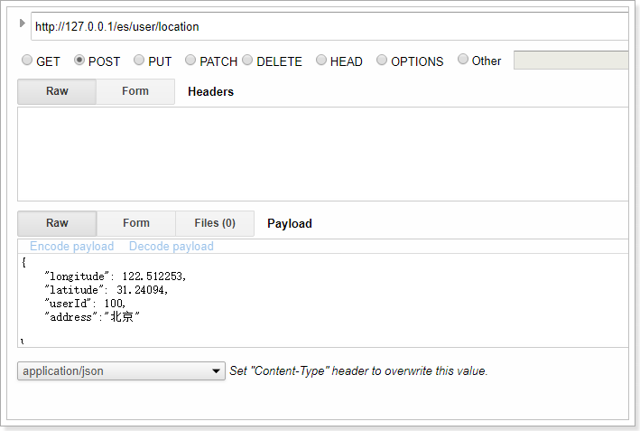

 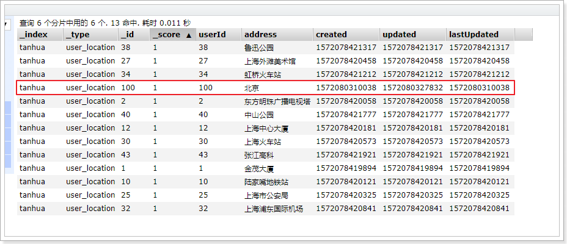

## 3. ES版的dubbo服务

### 3.1 导入依赖

~~~xml
 <dependency>
     <groupId>org.springframework.boot</groupId>
     <artifactId>spring-boot-starter-web</artifactId>
</dependency>
~~~

### 3.2 配置RestTemplateConfig

~~~java
package com.tanhua.dubbo.server.config;

import org.springframework.context.annotation.Bean;
import org.springframework.context.annotation.Configuration;
import org.springframework.http.client.ClientHttpRequestFactory;
import org.springframework.http.client.SimpleClientHttpRequestFactory;
import org.springframework.http.converter.StringHttpMessageConverter;
import org.springframework.web.client.RestTemplate;

import java.nio.charset.Charset;

@Configuration
public class RestTemplateConfig {

    @Bean
    public RestTemplate restTemplate(ClientHttpRequestFactory factory) {
        RestTemplate restTemplate = new RestTemplate(factory);
        // 支持中文编码
        restTemplate.getMessageConverters().set(1, new StringHttpMessageConverter(Charset.forName("UTF-8")));
        return restTemplate;
    }

    @Bean
    public ClientHttpRequestFactory simpleClientHttpRequestFactory() {
        SimpleClientHttpRequestFactory factory = new SimpleClientHttpRequestFactory();
        factory.setReadTimeout(5000);//单位为ms
        factory.setConnectTimeout(5000);//单位为ms
        return factory;
    }
}
~~~

### 3.3 实现接口

application.properties增加配置：

~~~properties
server.port = 18083
# ES服务地址
es.server.url = http://127.0.0.1/es/
~~~

~~~java
package com.tanhua.dubbo.server.api;

import com.alibaba.dubbo.config.annotation.Service;
import com.fasterxml.jackson.core.JsonProcessingException;
import com.fasterxml.jackson.databind.JsonNode;
import com.fasterxml.jackson.databind.ObjectMapper;
import com.fasterxml.jackson.databind.node.ArrayNode;
import com.tanhua.dubbo.server.vo.UserLocationVo;
import org.springframework.beans.factory.annotation.Autowired;
import org.springframework.beans.factory.annotation.Value;
import org.springframework.http.HttpEntity;
import org.springframework.http.HttpHeaders;
import org.springframework.http.MediaType;
import org.springframework.http.ResponseEntity;
import org.springframework.web.client.RestTemplate;

import java.util.ArrayList;
import java.util.HashMap;
import java.util.List;
import java.util.Map;

@Service(version = "1.0.1")
public class ESUserLocationApiImpl implements UserLocationApi {

    private static final ObjectMapper MAPPER = new ObjectMapper();

    @Autowired
    private RestTemplate restTemplate;

    @Value("${es.server.url}")
    private String esServerUrl;

    @Override
    public String updateUserLocation(Long userId, Double longitude, Double latitude, String address) {
        String url = this.esServerUrl + "user/location/";
        Map<String, Object> param = new HashMap<>();
        param.put("longitude", longitude);
        param.put("latitude", latitude);
        param.put("userId", userId);
        param.put("address", address);
        try {

            HttpHeaders headers = new HttpHeaders();
            headers.setContentType(MediaType.APPLICATION_JSON);

            HttpEntity<String> httpEntity = new HttpEntity<>(MAPPER.writeValueAsString(param), headers);

            ResponseEntity<Void> responseEntity = this.restTemplate.postForEntity(url, httpEntity, Void.class);
            if (responseEntity.getStatusCodeValue() == 200) {
                return "ok";
            }
        } catch (JsonProcessingException e) {
            e.printStackTrace();
        }
        return null;
    }

    @Override
    public UserLocationVo queryByUserId(Long userId) {
        String url = this.esServerUrl + "user/location/" + userId;
        ResponseEntity<String> responseEntity = this.restTemplate.getForEntity(url, String.class);
        if (responseEntity.getStatusCodeValue() != 200) {
            return null;
        }

        try {
            String body = responseEntity.getBody();
            JsonNode jsonNode = MAPPER.readTree(body);

            UserLocationVo userLocationVo = new UserLocationVo();
            userLocationVo.setLatitude(jsonNode.get("location").get("lat").asDouble());
            userLocationVo.setLongitude(jsonNode.get("location").get("lon").asDouble());
            userLocationVo.setUserId(userId);
            userLocationVo.setAddress(jsonNode.get("address").asText());
            userLocationVo.setId(userId.toString());
            userLocationVo.setCreated(jsonNode.get("created").asLong());
            userLocationVo.setUpdated(jsonNode.get("updated").asLong());
            userLocationVo.setLastUpdated(jsonNode.get("lastUpdated").asLong());

            return userLocationVo;

        } catch (Exception e) {
            e.printStackTrace();
        }

        return null;
    }

    @Override
    public List<UserLocationVo> queryUserFromLocation(Double longitude, Double latitude, Integer range) {
        String url = this.esServerUrl + "user/location/list";
        Map<String, Object> param = new HashMap<>();
        param.put("longitude", longitude);
        param.put("latitude", latitude);
        param.put("distance", range);
        try {

            HttpHeaders headers = new HttpHeaders();
            headers.setContentType(MediaType.APPLICATION_JSON);

            HttpEntity<String> httpEntity = new HttpEntity<>(MAPPER.writeValueAsString(param), headers);

            ResponseEntity<String> responseEntity = this.restTemplate.postForEntity(url, httpEntity, String.class);
            if (responseEntity.getStatusCodeValue() != 200) {
                return null;
            }

            String body = responseEntity.getBody();
            ArrayNode jsonNode = (ArrayNode) MAPPER.readTree(body);

            List<UserLocationVo> result = new ArrayList<>();

            for (JsonNode node : jsonNode) {
                UserLocationVo userLocationVo = new UserLocationVo();
                userLocationVo.setLatitude(node.get("location").get("lat").asDouble());
                userLocationVo.setLongitude(node.get("location").get("lon").asDouble());
                userLocationVo.setUserId(node.get("userId").asLong());
                userLocationVo.setAddress(node.get("address").asText());
                userLocationVo.setId(userLocationVo.getUserId().toString());
                userLocationVo.setCreated(node.get("created").asLong());
                userLocationVo.setUpdated(node.get("updated").asLong());
                userLocationVo.setLastUpdated(node.get("lastUpdated").asLong());
                result.add(userLocationVo);
            }

            return result;

        } catch (Exception e) {
            e.printStackTrace();
        }
        return null;
    }
}

~~~

### 3.4 server引用

 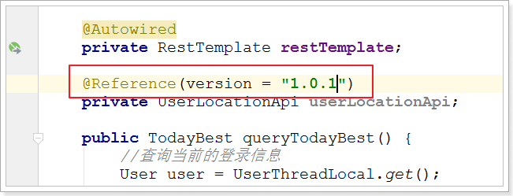

### 3.5 测试

 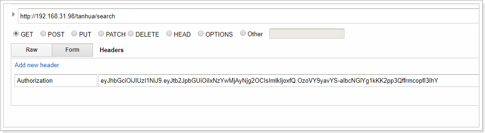

 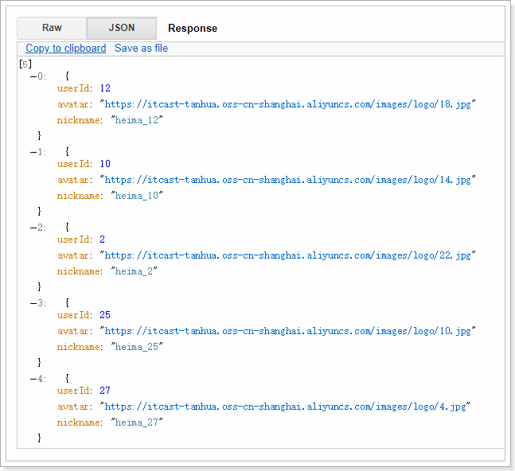

可以看到结果和之前是一样的。

## 4. 探花

探花功能是将推荐的好友随机的通过卡片的形式展现出来，用户可以选择左滑、右滑操作，左滑：“不喜欢”，右滑：“喜欢”。

喜欢：如果双方喜欢，那么就会成为好友。

 

### 4.1 展现卡片数据

~~~java
//TodayBestController

/**
 * 探花
 *
 * @return
 */
@GetMapping("cards")
public ResponseEntity<List<TodayBest>> queryCardsList() {
    try {
        List<TodayBest> list = this.todayBestService.queryCardsList();
        return ResponseEntity.ok(list);
    } catch (Exception e) {
        e.printStackTrace();
    }
    return ResponseEntity.status(HttpStatus.INTERNAL_SERVER_ERROR).build();
}
~~~

~~~java
//TodayBestService

public List<TodayBest> queryCardsList() {
        User user = UserThreadLocal.get();
        int count = 50;

        PageInfo<RecommendUser> pageInfo = this.recommendUserService.queryRecommendUserList(user.getId(), 1, count);
        if (CollectionUtils.isEmpty(pageInfo.getRecords())) {
            //默认推荐列表
            String[] ss = StringUtils.split(defaultRecommendUsers, ',');
            for (String s : ss) {
                RecommendUser recommendUser = new RecommendUser();
                recommendUser.setUserId(Long.valueOf(s));
                recommendUser.setToUserId(user.getId());
                pageInfo.getRecords().add(recommendUser);
            }
        }

        List<RecommendUser> records = pageInfo.getRecords();
        int showCount = Math.min(10, records.size());

        List<RecommendUser> newRecords = new ArrayList<>();
        for (int i = 0; i < showCount; i++) {
            //随机选出推荐的好友
            newRecords.add(records.get(RandomUtils.nextInt(0, records.size() - 1)));
        }

        List<Long> userIds = new ArrayList<>();
        for (RecommendUser record : newRecords) {
            userIds.add(record.getUserId());
        }

        QueryWrapper<UserInfo> queryWrapper = new QueryWrapper<>();
        queryWrapper.in("user_id", userIds);

        List<UserInfo> userInfos = this.userInfoService.queryList(queryWrapper);
        List<TodayBest> todayBests = new ArrayList<>();
        for (UserInfo userInfo : userInfos) {
            TodayBest todayBest = new TodayBest();
            todayBest.setId(userInfo.getUserId());
            todayBest.setAge(userInfo.getAge());
            todayBest.setAvatar(userInfo.getLogo());
            todayBest.setGender(userInfo.getSex().name().toLowerCase());
            todayBest.setNickname(userInfo.getNickName());
            todayBest.setTags(StringUtils.split(userInfo.getTags(), ','));
            todayBest.setFateValue(0L);

            todayBests.add(todayBest);
        }

        return todayBests;
    }
~~~

### 4.2 测试

 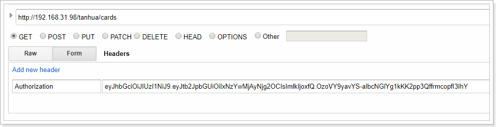

 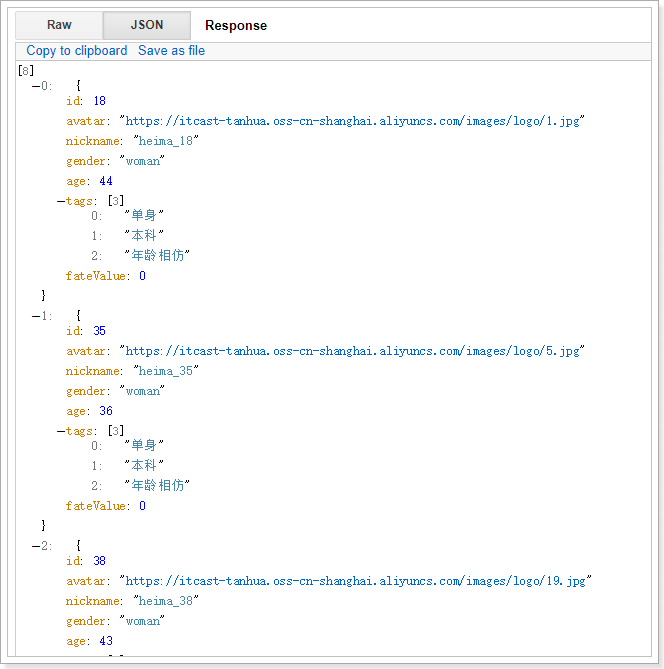

### 4.3 喜欢

#### 4.3.1 定义UserLike

~~~java
package com.tanhua.dubbo.server.pojo;

import lombok.AllArgsConstructor;
import lombok.Data;
import lombok.NoArgsConstructor;
import org.bson.types.ObjectId;
import org.springframework.data.mongodb.core.index.Indexed;
import org.springframework.data.mongodb.core.mapping.Document;

@Data
@NoArgsConstructor
@AllArgsConstructor
@Document(collection = "user_like")
public class UserLike implements java.io.Serializable {

    private static final long serialVersionUID = 6739966698394686523L;

    private ObjectId id;
    @Indexed
    private Long userId; //用户id，自己
    @Indexed
    private Long likeUserId; //喜欢的用户id，对方
    private Long created; //创建时间

}

~~~

#### 4.3.2 定义dubbo接口

~~~java
package com.tanhua.dubbo.server.api;

import com.tanhua.dubbo.server.pojo.UserLike;

public interface UserLikeApi {

    /**
     * 保存喜欢
     *
     * @param userId
     * @param likeUserId
     * @return
     */
    String saveUserLike(Long userId, Long likeUserId);

    /**
     * 相互喜欢
     *
     * @param userId
     * @param likeUserId
     * @return
     */
    Boolean isMutualLike(Long userId, Long likeUserId);

    /**
     * 删除用户喜欢
     *
     * @param userId
     * @param likeUserId
     * @return
     */
    Boolean deleteUserLike(Long userId, Long likeUserId);
}

~~~

#### 4.3.3、实现dubbo接口

~~~java
package com.tanhua.dubbo.server.api;

import com.alibaba.dubbo.config.annotation.Service;
import com.mongodb.client.result.DeleteResult;
import com.tanhua.dubbo.server.pojo.UserLike;
import org.bson.types.ObjectId;
import org.springframework.beans.factory.annotation.Autowired;
import org.springframework.data.mongodb.core.MongoTemplate;
import org.springframework.data.mongodb.core.query.Criteria;
import org.springframework.data.mongodb.core.query.Query;

@Service(version = "1.0.0")
public class UserLikeApiImpl implements UserLikeApi {

    @Autowired
    private MongoTemplate mongoTemplate;

    @Override
    public String saveUserLike(Long userId, Long likeUserId) {
        Query query = Query.query(Criteria
                .where("userId")
                .is(userId)
                .and("likeUserId").is(likeUserId));

        if (this.mongoTemplate.count(query, UserLike.class) > 0) {
            return null;
        }

        UserLike userLike = new UserLike();
        userLike.setId(ObjectId.get());
        userLike.setCreated(System.currentTimeMillis());
        userLike.setUserId(userId);
        userLike.setLikeUserId(likeUserId);

        this.mongoTemplate.save(userLike);
        return userLike.getId().toHexString();
    }

    @Override
    public Boolean isMutualLike(Long userId, Long likeUserId) {
        Criteria criteria1 = Criteria.where("userId").is(userId).and("likeUserId").is(likeUserId);
        Criteria criteria2 = Criteria.where("userId").is(likeUserId).and("likeUserId").is(userId);
        Criteria criteria = new Criteria().orOperator(criteria1, criteria2);
        return this.mongoTemplate.count(Query.query(criteria), UserLike.class) == 2;
    }

    @Override
    public Boolean deleteUserLike(Long userId, Long likeUserId) {
        Query query = Query.query(Criteria
                .where("userId")
                .is(userId)
                .and("likeUserId").is(likeUserId));
        DeleteResult deleteResult = this.mongoTemplate.remove(query, UserLike.class);
        return deleteResult.getDeletedCount() == 1;
    }
}

~~~

#### 4.3.4 单元测试

~~~java
package com.tanhua.dubbo.server.api;

import org.junit.Test;
import org.junit.runner.RunWith;
import org.springframework.beans.factory.annotation.Autowired;
import org.springframework.boot.test.context.SpringBootTest;
import org.springframework.test.context.junit4.SpringJUnit4ClassRunner;

@RunWith(SpringJUnit4ClassRunner.class)
@SpringBootTest
public class TestUserLikeApiImpl {

    @Autowired
    private UserLikeApi userLikeApi;

    @Test
    public void testSave(){
        this.userLikeApi.saveUserLike(1L,2L);
        this.userLikeApi.saveUserLike(1L,3L);
        this.userLikeApi.saveUserLike(2L,1L);
    }

    @Test
    public void testIsMutualLike(){
        System.out.println(this.userLikeApi.isMutualLike(1L,2L));
        System.out.println(this.userLikeApi.isMutualLike(2L,1L));
        System.out.println(this.userLikeApi.isMutualLike(1L,3L));
    }

    @Test
    public void testDeleteUserLike(){
        System.out.println(this.userLikeApi.deleteUserLike(1L,2L));
        System.out.println(this.userLikeApi.deleteUserLike(1L,3L));
        System.out.println(this.userLikeApi.deleteUserLike(2L,1L));
    }
}

~~~

#### 4.3.5 TodayBestController

~~~java
//TodayBestController    
/**
     * 喜欢
     *
     * @param likeUserId
     * @return
     */
    @GetMapping("{id}/love")
    public ResponseEntity<Void> likeUser(@PathVariable("id") Long likeUserId) {
        try {
            this.todayBestService.likeUser(likeUserId);
            return ResponseEntity.ok(null);
        } catch (Exception e) {
            e.printStackTrace();
        }
        return ResponseEntity.status(HttpStatus.INTERNAL_SERVER_ERROR).build();
    }
~~~

#### 4.3.6 TodayBestService

~~~java
    public Boolean likeUser(Long likeUserId) {
        User user = UserThreadLocal.get();
        String id = this.userLikeApi.saveUserLike(user.getId(), likeUserId);
        if (StringUtils.isEmpty(id)) {
            return false;
        }

        if (this.userLikeApi.isMutualLike(user.getId(), likeUserId)) {
            //相互喜欢成为好友
            this.imService.contactUser(likeUserId);
        }
        return true;
    }
~~~

### 4.4 不喜欢

#### 4.4.1 TodayBestController

~~~java
/**
     * 不喜欢
     *
     * @param likeUserId
     * @return
     */
    @GetMapping("{id}/unlove")
    public ResponseEntity<Void> disLikeUser(@PathVariable("id") Long likeUserId) {
        try {
            this.todayBestService.disLikeUser(likeUserId);
            return ResponseEntity.ok(null);
        } catch (Exception e) {
            e.printStackTrace();
        }
        return ResponseEntity.status(HttpStatus.INTERNAL_SERVER_ERROR).build();
    }

~~~

#### 4.4.2 TodayBestService

~~~java
    public Boolean disLikeUser(Long likeUserId) {
        User user = UserThreadLocal.get();
        return this.userLikeApi.deleteUserLike(user.getId(), likeUserId);
    }
~~~

### 4.5 测试

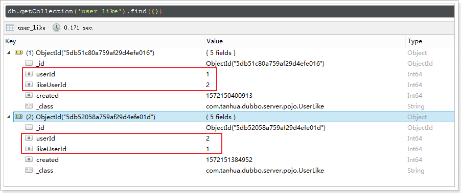

 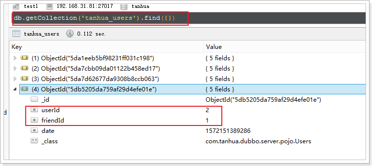

 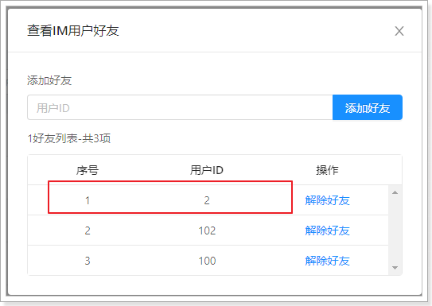

可以看到1和2用户已经成为了好友。

## 5 用户资料

在“我的”模块中，可以对用户信息进行维护。

 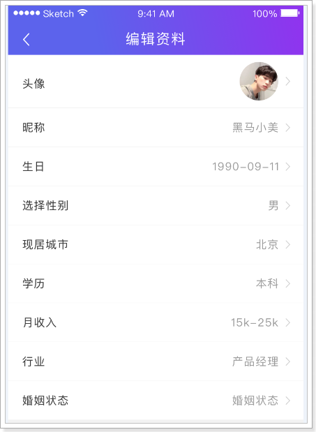

### 5.1 查询用户信息

#### 5.1.1 mock接口

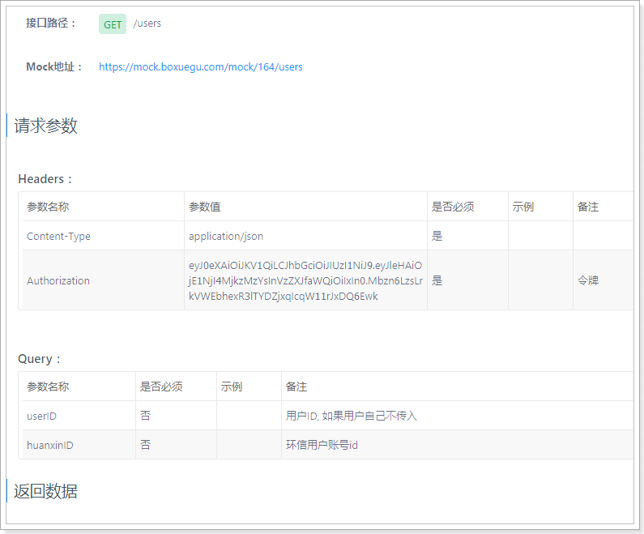

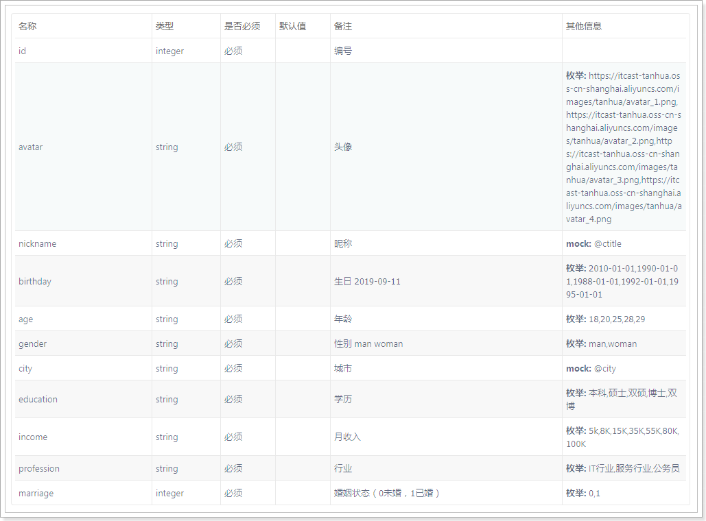

#### 5.1.2 UserInfoVo

~~~java
package com.tanhua.server.vo;

import lombok.AllArgsConstructor;
import lombok.Data;
import lombok.NoArgsConstructor;

@Data
@NoArgsConstructor
@AllArgsConstructor
public class UserInfoVo {

    private Long id;
    private String avatar; //头像
    private String nickname; //昵称
    private String birthday; //生日 2019-09-11
    private String age; //年龄
    private String gender; //性别 man woman
    private String city; //城市
    private String education; //学历 枚举: 本科,硕士,双硕,博士,双博
    private String income; //月收入 枚举: 5k,8K,15K,35K,55K,80K,100K
    private String profession; //行业 枚举: IT行业,服务行业,公务员
    private Integer marriage; //婚姻状态（0未婚，1已婚）

}
~~~

#### 5.1.3 UsersController

~~~java
package com.tanhua.server.controller;

import com.tanhua.server.service.UsersService;
import com.tanhua.server.vo.UserInfoVo;
import org.springframework.beans.factory.annotation.Autowired;
import org.springframework.http.HttpStatus;
import org.springframework.http.ResponseEntity;
import org.springframework.web.bind.annotation.GetMapping;
import org.springframework.web.bind.annotation.RequestMapping;
import org.springframework.web.bind.annotation.RequestParam;
import org.springframework.web.bind.annotation.RestController;

@RestController
@RequestMapping("users")
public class UsersController {

    @Autowired
    private UsersService usersService;

/**
     * 用户资料 - 读取
     *
     * @param userID
     * @param huanxinID
     * @return
     */
    @GetMapping
    public ResponseEntity<UserInfoVo> queryUserInfo(@RequestParam(value = "userID", required = false) String userID,
                                                    @RequestParam(value = "huanxinID", required = false) String huanxinID) {
        try {
            //用户第一次 接收到 环信推来的信息 ，不带用户信息
            UserInfoVo userInfoVo = this.usersService.queryUserInfo(userID, huanxinID);
            if (null != userInfoVo) {
                return ResponseEntity.ok(userInfoVo);
            }
        } catch (Exception e) {
            e.printStackTrace();
        }
        return ResponseEntity.status(HttpStatus.INTERNAL_SERVER_ERROR).build();
    }
}

~~~

#### 5.1.4 UsersService

~~~java
package com.tanhua.server.service;

import com.tanhua.server.pojo.User;
import com.tanhua.server.pojo.UserInfo;
import com.tanhua.server.utils.UserThreadLocal;
import com.tanhua.server.vo.UserInfoVo;
import org.apache.commons.lang3.StringUtils;
import org.springframework.beans.factory.annotation.Autowired;
import org.springframework.stereotype.Service;

@Service
public class UsersService {

    @Autowired
    private UserInfoService userInfoService;

    public UserInfoVo queryUserInfo(String userID, String huanxinID) {
        User user = UserThreadLocal.get();
        Long userId = user.getId();
        if (StringUtils.isNotBlank(userID)) {
            userId = Long.valueOf(userID);
        } else if (StringUtils.isNotBlank(huanxinID)) {
            userId = Long.valueOf(huanxinID);
        }

        UserInfo userInfo = this.userInfoService.queryById(userId);
        if (null == userInfo) {
            return null;
        }

        UserInfoVo userInfoVo = new UserInfoVo();
        userInfoVo.setAge(userInfo.getAge() != null ? userInfo.getAge().toString() : null);
        userInfoVo.setAvatar(userInfo.getLogo());
        userInfoVo.setBirthday(userInfo.getBirthday());
        userInfoVo.setEducation(userInfo.getEdu());
        userInfoVo.setCity(userInfo.getCity());
        userInfoVo.setGender(userInfo.getSex().name().toLowerCase());
        userInfoVo.setId(userInfo.getUserId());
        userInfoVo.setIncome(userInfo.getIncome() + "K");
        userInfoVo.setMarriage(StringUtils.equals(userInfo.getMarriage(), "已婚") ? 1 : 0);
        userInfoVo.setNickname(userInfo.getNickName());
        userInfoVo.setProfession(userInfo.getIndustry());

        return userInfoVo;
    }
}

~~~

#### 5.1.5 测试

 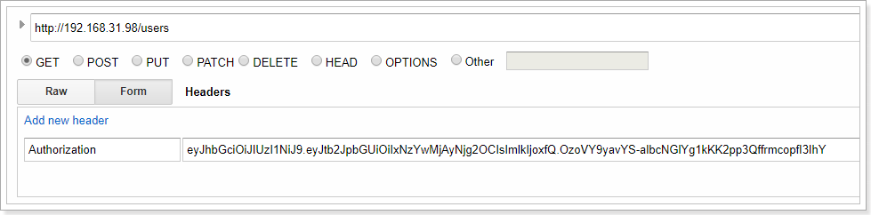

 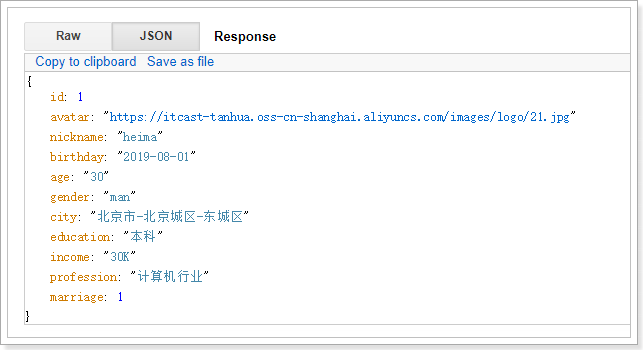

#### 5.1.6 整合测试

 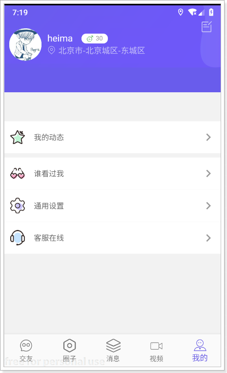

 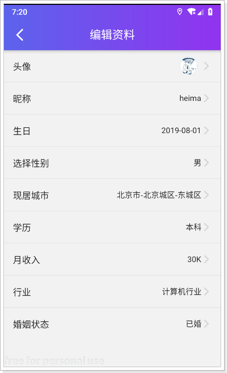

### 5.2 保存修改

#### 5.2.1 UsersController

~~~java
    /**
     * 更新用户信息
     *
     * @param userInfoVo
     * @return
     */
    @PutMapping
    public ResponseEntity<Void> updateUserInfo(@RequestBody UserInfoVo userInfoVo){
        try {
            Boolean bool = this.usersService.updateUserInfo(userInfoVo);
            if(bool){
                return ResponseEntity.ok(null);
            }
        } catch (Exception e) {
            e.printStackTrace();
        }
        return ResponseEntity.status(HttpStatus.INTERNAL_SERVER_ERROR).build();
    }
~~~

#### 5.2.2 UsersService

~~~java
    public Boolean updateUserInfo(UserInfoVo userInfoVo) {
        User user = UserThreadLocal.get();
        UserInfo userInfo = new UserInfo();
        userInfo.setUserId(user.getId());
        userInfo.setAge(Integer.valueOf(userInfoVo.getAge()));
        userInfo.setSex(StringUtils.equalsIgnoreCase(userInfoVo.getGender(), "man") ? SexEnum.MAN : SexEnum.WOMAN);
        userInfo.setBirthday(userInfoVo.getBirthday());
        userInfo.setCity(userInfoVo.getCity());
        userInfo.setEdu(userInfoVo.getEducation());
        userInfo.setIncome(StringUtils.replaceAll(userInfoVo.getIncome(), "K", ""));
        userInfo.setIndustry(userInfoVo.getProfession());
        userInfo.setMarriage(userInfoVo.getMarriage() == 1 ? "已婚" : "未婚");
        return this.userInfoService.updateUserInfoByUserId(userInfo);
    }
~~~

#### 5.2.3 UserInfoService

~~~java
    public boolean updateUserInfoByUserId(UserInfo userInfo) {
        QueryWrapper<UserInfo> queryWrapper = new QueryWrapper<>();
        queryWrapper.eq("user_id", userInfo.getUserId());
        return this.userInfoMapper.update(userInfo, queryWrapper) > 0;
    }
~~~

### 5.3 上传头像

上传头像使用sso中的上传逻辑即可，只是路径不同，所以我们只需要修改nginx配置和在sso中定义Controller即可。

#### 5.3.1 修改nginx配置

~~~shell

#user  nobody;
worker_processes  1;

#error_log  logs/error.log;
#error_log  logs/error.log  notice;
#error_log  logs/error.log  info;

#pid        logs/nginx.pid;

events {
    worker_connections  1024;
}

http {
    include       mime.types;
    default_type  application/octet-stream;

    #log_format  main  '$remote_addr - $remote_user [$time_local] "$request" '
    #                  '$status $body_bytes_sent "$http_referer" '
    #                  '"$http_user_agent" "$http_x_forwarded_for"';

    #access_log  logs/access.log  main;

    sendfile        on;
    #tcp_nopush     on;

    #keepalive_timeout  0;
    keepalive_timeout  65;

    #gzip  on;

    server {
        listen       80;
        server_name  localhost;

        #charset koi8-r;

        #access_log  logs/host.access.log  main;

        #error_page  404              /404.html;

        # redirect server error pages to the static page /50x.html
        #
        error_page   500 502 503 504  /50x.html;
        location = /50x.html {
            root   html;
        }

	location /user/ {
		client_max_body_size  300m;
		proxy_connect_timeout 300s;
		proxy_send_timeout 300s;
		proxy_read_timeout 300s;
		proxy_pass   http://127.0.0.1:18080;
        }

	location /users/header {
		client_max_body_size  300m;
		proxy_connect_timeout 300s;
		proxy_send_timeout 300s;
		proxy_read_timeout 300s;
		proxy_pass   http://127.0.0.1:18080;
        }

	location /es/ {
		client_max_body_size  300m;
		proxy_connect_timeout 300s;
		proxy_send_timeout 300s;
		proxy_read_timeout 300s;
		proxy_pass   http://127.0.0.1:18082;
        }

    location / {
		client_max_body_size  300m;
        proxy_connect_timeout 300s;
        proxy_send_timeout 300s;
        proxy_read_timeout 300s;
            proxy_pass   http://127.0.0.1:18081;
        }
    }

}
~~~

#### 5.3.2 UsersController

在sso工程中定义UsersController。

~~~java
package com.tanhua.sso.controller;

import com.tanhua.sso.vo.ErrorResult;
import org.springframework.beans.factory.annotation.Autowired;
import org.springframework.http.HttpStatus;
import org.springframework.http.ResponseEntity;
import org.springframework.web.bind.annotation.*;
import org.springframework.web.multipart.MultipartFile;

@RestController
@RequestMapping("users")
public class UsersController {

    @Autowired
    private UserInfoController userInfoController;

    /**
     * 上传头像
     *
     * @param file
     * @param token
     * @return
     */
    @PostMapping("header")
    public ResponseEntity<Object> saveLogo(@RequestParam("headPhoto") MultipartFile file, @RequestHeader("Authorization") String token) {
        return this.userInfoController.saveLogo(file, token);
    }
}

~~~

#### 5.3.3 测试

 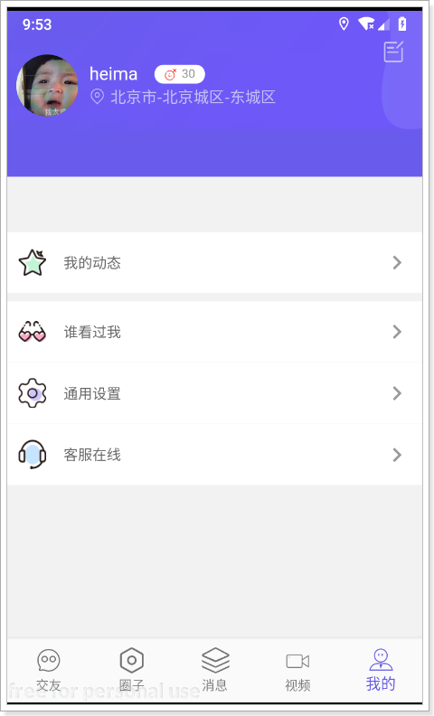