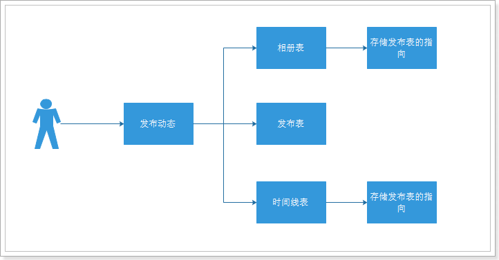
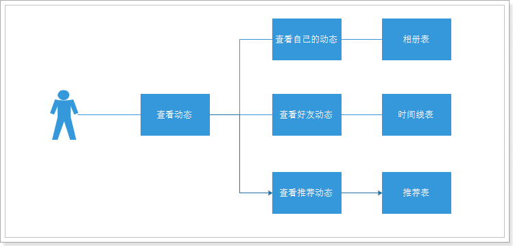
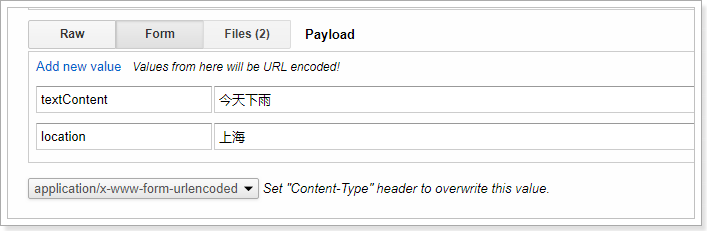
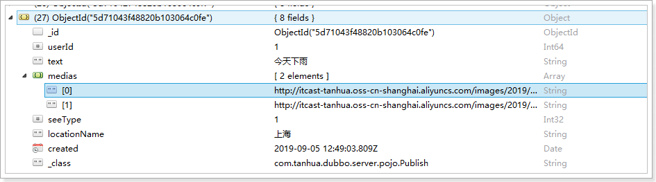
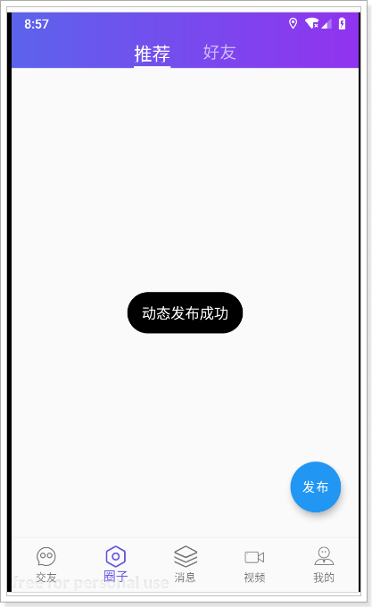
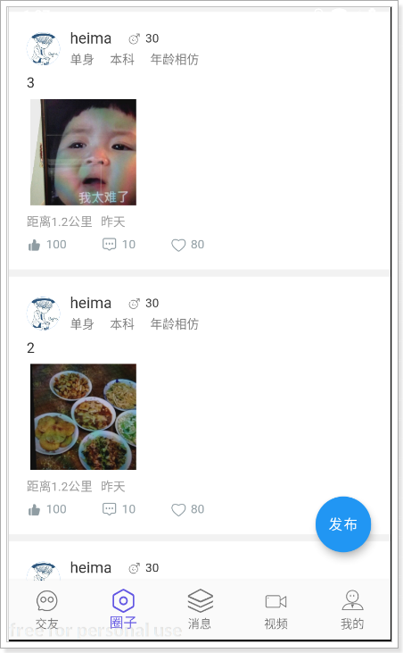

## 课程说明

> - 发布朋友圈
> - 查看朋友圈

## 1. 圈子功能

### 1.1 功能说明

探花交友项目中的圈子功能，类似微信的朋友圈，基本的功能为：

* 发布动态
* 浏览好友动态
* 浏览推荐动态
* 点赞、评论、喜欢等等

 

发布：

 

### 1.2 实现方案分析

对于圈子功能的实现，我们需要对它的功能特点做分析：

1. 数据量会随着用户数增大而增大

2. 读多写少

3. 非好友看不到其动态内容

4. ……

<u>针对以上特点，我们来分析一下：</u>

1. 对于数据量大而言，显然不能够使用关系型数据库进行存储，我们需要通过==MongoDB==进行存储

2. 对于读多写少的应用，需要==减少读取==的成本
   * 比如说，一条SQL语句，==单张表==查询一定比多张表查询要快

3. 对于每个人数据在存储层面最好做到==相互隔离==，这样的话就不会有影响

**所以对于存储而言，主要是核心的4张表：**

1. ==发布表：==记录了所有用户的发布的东西信息，如图片、视频等。

2. ==相册：==相册是每个用户独立的，记录了该用户所发布的所有内容。

3. ==评论：==针对某个具体发布的朋友评论和点赞操作。

4. ==时间线：==所谓“刷朋友圈”，就是刷时间线，就是一个用户所有的朋友的发布内容。

### 1.3 技术方案

根据之前我们的分析，对于技术方案而言，将采用MongoDB+Redis来实现，其中MongoDB负责存储，Redis负责缓存数据。

#### 1.3.1 发布朋友圈

 

流程说明：

1. 用户发布动态，首先将动态内容写入到发布表

2. 然后，将发布的指向写入到自己的相册表中

3. 最后，将发布的指向写入到好友的时间线中

#### 1.3.2 查看朋友圈

 

流程说明：

1. 用户查看动态，如果查看自己的动态，直接查询相册表即可

2. 如果查看好友动态，查询时间线表即可

3. 如果查看推荐动态，查看推荐表即可

由此可见，查看动态的成本较低，可以快速的查询到动态数据

### 1.4 表结构设计

> **发布表：**

~~~json
#表名：quanzi_publish
{
    "id":1,#主键id
    "userId":1, #用户id
    "text":"今天心情很好", #文本内容
    "medias":"http://xxxx/x/y/z.jpg", #媒体数据，图片或小视频 url
    "seeType":1, #谁可以看，1-公开，2-私密，3-部分可见，4-不给谁看
    "seeList":[1,2,3], #部分可见的列表
    "notSeeList":[4,5,6],#不给谁看的列表
	"longitude":108.840974298098,#经度
	"latitude":34.2789316522934,#纬度
    "locationName":"上海市浦东区", #位置名称
    "created",1568012791171 #发布时间
}
~~~

> **相册表：**

~~~json
#表名：quanzi_album_{userId}
{
    "id":1,#主键id
    "publishId":1001, #发布id
    "created":1568012791171 #发布时间
}
~~~

> **时间线表：**

~~~json
#表名：quanzi_time_line_{userId}
{
    "id":1,#主键id,
    "userId":2, #好友id
    "publishId":1001, #发布id
    "date":1568012791171 #发布时间
}
~~~

> **评论表：**

~~~json
#表名：quanzi_comment
{
    "id":1, #主键id
    "publishId":1001, #发布id
    "commentType":1, #评论类型，1-点赞，2-评论，3-喜欢
    "content":"给力！", #评论内容
    "userId":2, #评论人
    "isParent":false, #是否为父节点，默认是否
    "parentId":1001, #父节点id
    "created":1568012791171
}
~~~

## 2. 圈子实现

> 升级Genymotion：
>
> Genymotion版本：3.0.2
>
> 镜像版本：
>
>  

### 2.1 pojo

#### 1）发布实体类

~~~java
package com.tanhua.dubbo.server.pojo;

import lombok.AllArgsConstructor;
import lombok.Data;
import lombok.NoArgsConstructor;
import org.bson.types.ObjectId;
import org.springframework.data.mongodb.core.mapping.Document;

import java.util.Date;
import java.util.List;

/**
 * 发布表，动态内容
 */
@Data
@NoArgsConstructor
@AllArgsConstructor
@Document(collection = "quanzi_publish")
public class Publish implements java.io.Serializable {

    private static final long serialVersionUID = 8732308321082804771L;

    private ObjectId id; //主键id
    private Long userId;
    private String text; //文字
    private List<String> medias; //媒体数据，图片或小视频 url
    private Integer seeType; // 谁可以看，1-公开，2-私密，3-部分可见，4-不给谁看
    private List<Long> seeList; //部分可见的列表
    private List<Long> notSeeList; //不给谁看的列表
    private String longitude; //经度
    private String latitude; //纬度
    private String locationName; //位置名称
    private Long created; //发布时间

}
~~~
####2）相册实体类
~~~java
package com.tanhua.dubbo.server.pojo;

import lombok.AllArgsConstructor;
import lombok.Data;
import lombok.NoArgsConstructor;
import org.bson.types.ObjectId;
import org.springframework.data.mongodb.core.mapping.Document;

import java.util.Date;

/**
 * 相册表，用于存储自己发布的数据，每一个用户一张表进行存储
 */
@Data
@NoArgsConstructor
@AllArgsConstructor
@Document(collection = "quanzi_album")
public class Album implements java.io.Serializable {

    private static final long serialVersionUID = 432183095092216817L;

    private ObjectId id; //主键id

    private ObjectId publishId; //发布id
    private Long created; //发布时间

}
~~~
####3）时间线实体类
~~~java
package com.tanhua.dubbo.server.pojo;

import lombok.AllArgsConstructor;
import lombok.Data;
import lombok.NoArgsConstructor;
import org.bson.types.ObjectId;
import org.springframework.data.mongodb.core.mapping.Document;

import java.util.Date;

/**
 * 时间线表，用于存储发布（或推荐）的数据，每一个用户一张表进行存储
 */
@Data
@NoArgsConstructor
@AllArgsConstructor
@Document(collection = "quanzi_time_line")
public class TimeLine implements java.io.Serializable{
    private static final long serialVersionUID = 9096178416317502524L;
    private ObjectId id;

    private Long userId; // 好友id
    private ObjectId publishId; //发布id
    private Long date; //发布的时间

}
~~~
####4）评论实体类
~~~java
package com.tanhua.dubbo.server.pojo;

import lombok.AllArgsConstructor;
import lombok.Data;
import lombok.NoArgsConstructor;
import org.bson.types.ObjectId;
import org.springframework.data.mongodb.core.mapping.Document;

import java.util.Date;

/**
 * 评论表
 */
@Data
@NoArgsConstructor
@AllArgsConstructor
@Document(collection = "quanzi_comment")
public class Comment implements java.io.Serializable{

    private static final long serialVersionUID = -291788258125767614L;

    private ObjectId id;

    private ObjectId publishId; //发布id
    private Integer commentType; //评论类型，1-点赞，2-评论，3-喜欢
    private String content; //评论内容
    private Long userId; //评论人

    private Boolean isParent = false; //是否为父节点，默认是否
    private ObjectId parentId; // 父节点id

    private Long created; //发表时间

}

~~~
####5）用户实体类
~~~java
package com.tanhua.dubbo.server.pojo;

import lombok.AllArgsConstructor;
import lombok.Data;
import lombok.NoArgsConstructor;
import org.bson.types.ObjectId;
import org.springframework.data.mongodb.core.mapping.Document;

import java.util.Date;

@Data
@NoArgsConstructor
@AllArgsConstructor
@Document(collection = "tanhua_users")
public class Users implements java.io.Serializable{

    private static final long serialVersionUID = 6003135946820874230L;
    private ObjectId id;
    private Long userId; //用户id
    private Long friendId; //好友id
    private Date date; //时间
}

~~~

### 2.2 发布动态

#### 2.2.1 定义接口

~~~java
package com.tanhua.dubbo.server.api;

import com.tanhua.dubbo.server.pojo.Publish;

public interface QuanZiApi {

    /**
     * 发布动态
     *
     * @param publish
     * @return
     */
    boolean savePublish(Publish publish);

}
~~~

#### 2.2.2 编写实现

##### 1）构造好友数据

~~~java
package com.tanhua.dubbo.server.api;

import com.tanhua.dubbo.server.pojo.Users;
import org.bson.types.ObjectId;
import org.junit.Test;
import org.junit.runner.RunWith;
import org.springframework.beans.factory.annotation.Autowired;
import org.springframework.boot.test.context.SpringBootTest;
import org.springframework.data.mongodb.core.MongoTemplate;
import org.springframework.data.mongodb.core.query.Criteria;
import org.springframework.data.mongodb.core.query.Query;
import org.springframework.test.context.junit4.SpringJUnit4ClassRunner;

import java.util.Date;
import java.util.List;

@RunWith(SpringJUnit4ClassRunner.class)
@SpringBootTest
public class TestUsers {

    @Autowired
    private MongoTemplate mongoTemplate;

    @Test
    public void saveUsers(){
        this.mongoTemplate.save(new Users(ObjectId.get(),1L, 2L, new Date()));
        this.mongoTemplate.save(new Users(ObjectId.get(),1L, 3L, new Date()));
        this.mongoTemplate.save(new Users(ObjectId.get(),1L, 4L, new Date()));
        this.mongoTemplate.save(new Users(ObjectId.get(),1L, 5L, new Date()));
        this.mongoTemplate.save(new Users(ObjectId.get(),1L, 5L, new Date()));
    }

    @Test
    public void testQueryList(){
        Criteria criteria = Criteria.where("userId").is(1L);
        List<Users> users = this.mongoTemplate.find(Query.query(criteria), Users.class);
        for (Users user : users) {
            System.out.println(user);
        }
    }
}
                       
~~~

##### 2）发布服务

~~~java
package com.tanhua.dubbo.server.api;

import com.alibaba.dubbo.config.annotation.Service;
import com.tanhua.dubbo.server.pojo.Album;
import com.tanhua.dubbo.server.pojo.Publish;
import com.tanhua.dubbo.server.pojo.TimeLine;
import com.tanhua.dubbo.server.pojo.Users;
import org.bson.types.ObjectId;
import org.springframework.beans.factory.annotation.Autowired;
import org.springframework.data.mongodb.core.MongoTemplate;
import org.springframework.data.mongodb.core.query.Criteria;
import org.springframework.data.mongodb.core.query.Query;

import java.util.Date;
import java.util.List;

@Service(version = "1.0.0")
public class QuanZiApiImpl implements QuanZiApi {

    @Autowired
    private MongoTemplate mongoTemplate;

    @Override
    public boolean savePublish(Publish publish) {

        // 校验
        if (publish.getUserId() == null) {
            return false;
        }

        try {
            publish.setCreated(System.currentTimeMillis()); //设置创建时间
            publish.setId(ObjectId.get()); //设置id
            this.mongoTemplate.save(publish); //保存发布

            Album album = new Album(); // 构建相册对象
            album.setPublishId(publish.getId());
            album.setCreated(System.currentTimeMillis());
            album.setId(ObjectId.get());
            this.mongoTemplate.save(album, "quanzi_album_" + publish.getUserId());

            //写入好友的时间线中
            Criteria criteria = Criteria.where("userId").is(publish.getUserId());
            List<Users> users = this.mongoTemplate.find(Query.query(criteria), Users.class);
            for (Users user : users) {
                TimeLine timeLine = new TimeLine();
                timeLine.setId(ObjectId.get());
                timeLine.setPublishId(publish.getId());
                timeLine.setUserId(user.getUserId());
                timeLine.setDate(System.currentTimeMillis());
                this.mongoTemplate.save(timeLine, "quanzi_time_line_" + user.getFriendId());
            }

            return true;
        } catch (Exception e) {
            e.printStackTrace();
            //TODO 出错的事务回滚
        }

        return false;
    }
}

~~~

测试用例：

~~~java
@Test
    public void testSavePublish(){
        Publish publish = new Publish();
        publish.setUserId(1L);
        publish.setLocationName("上海市");
        publish.setSeeType(1);
        publish.setText("今天天气不错~");
        publish.setMedias(Arrays.asList("https://itcast-tanhua.oss-cn-shanghai.aliyuncs.com/images/quanzi/1.jpg"));
        boolean result = this.quanZiApi.savePublish(publish);
        System.out.println(result);
    }
~~~

#### 2.2.3 编写接口服务

在服务工程中编写接口服务。

##### 1）Controller

~~~java
package com.tanhua.server.controller;

import com.tanhua.server.service.MovementsService;
import org.springframework.beans.factory.annotation.Autowired;
import org.springframework.http.HttpStatus;
import org.springframework.http.ResponseEntity;
import org.springframework.web.bind.annotation.*;
import org.springframework.web.multipart.MultipartFile;

@RestController
@RequestMapping("movements")
public class MovementsController {

    @Autowired
    private MovementsService movementsService;

    /**
     * 发送动态
     * 
     * @param textContent
     * @param location
     * @param multipartFile
     * @param token
     * @return
     */
    @PostMapping()
    public ResponseEntity<Void> savePublish(@RequestParam(value = "textContent", required = false) String textContent,
                                            @RequestParam(value = "location", required = false) String location,
                                            @RequestParam(value = "imageContent", required = false) MultipartFile[] multipartFile,
                                            @RequestHeader("Authorization") String token) {
        try {
            boolean result = this.movementsService.savePublish(textContent, location, multipartFile, token);
            if(result){
                return ResponseEntity.ok(null);
            }
        } catch (Exception e) {
            e.printStackTrace();
        }
        return ResponseEntity.status(HttpStatus.INTERNAL_SERVER_ERROR).build();
    }

}

~~~

##### 2）MovementsService

~~~java
package com.tanhua.server.service;

import com.alibaba.dubbo.config.annotation.Reference;
import com.tanhua.dubbo.server.api.QuanZiApi;
import com.tanhua.dubbo.server.pojo.Publish;
import com.tanhua.server.pojo.User;
import com.tanhua.server.vo.PicUploadResult;
import org.springframework.beans.factory.annotation.Autowired;
import org.springframework.stereotype.Service;
import org.springframework.web.multipart.MultipartFile;

import java.util.ArrayList;
import java.util.List;

@Service
public class MovementsService {

    @Reference(version = "1.0.0")
    private QuanZiApi quanZiApi;

    @Autowired
    private PicUploadService picUploadService;

    @Autowired
    private UserService userService;

    public boolean savePublish(String textContent,
                               String location,
                               MultipartFile[] multipartFile,
                               String token) {

        //查询当前的登录信息
        User user = this.userService.queryUserByToken(token);
        if (null == user) {
            return false;
        }

        Publish publish = new Publish();
        publish.setUserId(user.getId());
        publish.setText(textContent);
        publish.setLocationName(location);
        publish.setLatitude(latitude);
        publish.setLongitude(longitude);
        publish.setSeeType(1);

        List<String> picUrls = new ArrayList<>();
        //图片上传
        for (MultipartFile file : multipartFile) {
            PicUploadResult picUploadResult = this.picUploadService.upload(file);
            picUrls.add(picUploadResult.getName());
        }

        publish.setMedias(picUrls);
        return this.quanZiApi.savePublish(publish);
    }
}
~~~

##### 3）PicUploadService

导入所需依赖：

~~~xml
 <dependency>
     <groupId>com.aliyun.oss</groupId>
     <artifactId>aliyun-sdk-oss</artifactId>
     <version>2.8.3</version>
</dependency>
<dependency>
    <groupId>joda-time</groupId>
    <artifactId>joda-time</artifactId>
</dependency>
~~~

~~~java
package com.tanhua.server.service;

import com.aliyun.oss.OSSClient;
import com.tanhua.server.config.AliyunConfig;
import com.tanhua.server.vo.PicUploadResult;
import org.apache.commons.lang3.RandomUtils;
import org.apache.commons.lang3.StringUtils;
import org.joda.time.DateTime;
import org.springframework.beans.factory.annotation.Autowired;
import org.springframework.stereotype.Service;
import org.springframework.web.multipart.MultipartFile;

import java.io.ByteArrayInputStream;

@Service
public class PicUploadService {

    // 允许上传的格式
    private static final String[] IMAGE_TYPE = new String[]{".bmp", ".jpg",
            ".jpeg", ".gif", ".png"};

    @Autowired
    private OSSClient ossClient;

    @Autowired
    private AliyunConfig aliyunConfig;

    public PicUploadResult upload(MultipartFile uploadFile) {

        PicUploadResult fileUploadResult = new PicUploadResult();

        //图片做校验，对后缀名
        boolean isLegal = false;

        for (String type : IMAGE_TYPE) {
            if (StringUtils.endsWithIgnoreCase(uploadFile.getOriginalFilename(),
                    type)) {
                isLegal = true;
                break;
            }
        }

        if (!isLegal) {
            fileUploadResult.setStatus("error");
            return fileUploadResult;
        }

        // 文件新路径
        String fileName = uploadFile.getOriginalFilename();
        String filePath = getFilePath(fileName);

        // 上传到阿里云
        try {
            // 目录结构：images/2018/12/29/xxxx.jpg
            ossClient.putObject(aliyunConfig.getBucketName(), filePath, new
                    ByteArrayInputStream(uploadFile.getBytes()));
        } catch (Exception e) {
            e.printStackTrace();
            //上传失败
            fileUploadResult.setStatus("error");
            return fileUploadResult;
        }

        // 上传成功
        fileUploadResult.setStatus("done");
        fileUploadResult.setName(this.aliyunConfig.getUrlPrefix() + filePath);
        fileUploadResult.setUid(String.valueOf(System.currentTimeMillis()));

        return fileUploadResult;
    }

    private String getFilePath(String sourceFileName) {
        DateTime dateTime = new DateTime();
        return "images/" + dateTime.toString("yyyy")
                + "/" + dateTime.toString("MM") + "/"
                + dateTime.toString("dd") + "/" + System.currentTimeMillis() +
                RandomUtils.nextInt(100, 9999) + "." +
                StringUtils.substringAfterLast(sourceFileName, ".");
    }

}

~~~

##### 4）AliyunConfig

~~~java
package com.tanhua.server.config;

import com.aliyun.oss.OSSClient;
import lombok.Data;
import org.springframework.boot.context.properties.ConfigurationProperties;
import org.springframework.context.annotation.Bean;
import org.springframework.context.annotation.Configuration;
import org.springframework.context.annotation.PropertySource;

@Configuration
@PropertySource("classpath:aliyun.properties")
@ConfigurationProperties(prefix = "aliyun")
@Data
public class AliyunConfig {

    private String endpoint;
    private String accessKeyId;
    private String accessKeySecret;
    private String bucketName;
    private String urlPrefix;

    @Bean
    public OSSClient oSSClient() {
        return new OSSClient(endpoint, accessKeyId, accessKeySecret);
    }

}
~~~

##### 5）aliyun.properties

~~~properties
aliyun.endpoint = http://oss-cn-shanghai.aliyuncs.com
aliyun.accessKeyId = xxxxx
aliyun.accessKeySecret = xxxx
aliyun.bucketName=itcast-tanhua
aliyun.urlPrefix=http://itcast-tanhua.oss-cn-shanghai.aliyuncs.com/
~~~

##### 6）PicUploadResult

~~~java
package com.tanhua.server.vo;

import lombok.Data;

@Data
public class PicUploadResult {

    // 文件唯一标识
    private String uid;
    // 文件名
    private String name;
    // 状态有：uploading done error removed
    private String status;
    // 服务端响应内容，如：'{"status": "success"}'
    private String response;

}
~~~

#### 2.2.4 测试

 

 结果：

#### 2.2.5 整合测试

 

 

### 2.3 统一处理token

在之前的开发中，我们会在每一个Service中对token做处理，相同的逻辑一定是要进行统一处理的，接下来我们将使用拦截器+ThreadLocal的方式进行解决。

#### 2.3.1 编写UserThreadLocal

~~~java
package com.tanhua.server.utils;

import com.tanhua.server.pojo.User;

public class UserThreadLocal {

    private static final ThreadLocal<User> LOCAL = new ThreadLocal<User>();

    private UserThreadLocal() {

    }

    public static void set(User user) {
        LOCAL.set(user);
    }

    public static User get() {
        return LOCAL.get();
    }

}

~~~

#### 2.3.2 编写TokenInterceptor

~~~java
package com.tanhua.server.interceptor;

import com.tanhua.server.pojo.User;
import com.tanhua.server.service.UserService;
import com.tanhua.server.utils.NoAuthorization;
import com.tanhua.server.utils.UserThreadLocal;
import org.apache.commons.lang3.StringUtils;
import org.springframework.beans.factory.annotation.Autowired;
import org.springframework.stereotype.Component;
import org.springframework.web.method.HandlerMethod;
import org.springframework.web.servlet.HandlerInterceptor;

import javax.servlet.http.HttpServletRequest;
import javax.servlet.http.HttpServletResponse;

/**
 * 统一完成根据token查询用User的功能
 */
@Component
public class TokenInterceptor implements HandlerInterceptor {

    @Autowired
    private UserService userService;

    @Override
    public boolean preHandle(HttpServletRequest request, HttpServletResponse response, Object handler)
            throws Exception {

        if (handler instanceof HandlerMethod) {
            HandlerMethod handlerMethod = (HandlerMethod) handler;
            NoAuthorization noAnnotation = handlerMethod.getMethod().getAnnotation(NoAuthorization.class);
            if (noAnnotation != null) {
                // 如果该方法被标记为无需验证token，直接返回即可
                return true;
            }
        }

        String token = request.getHeader("Authorization");
        if (StringUtils.isNotEmpty(token)) {
            User user = this.userService.queryUserByToken(token);
            if (null != user) {
                UserThreadLocal.set(user); //将当前对象，存储到当前的线程中
                return true;
            }
        }

        //请求头中如不存在Authorization直接返回false
        response.setStatus(401); //无权限访问
        return false;
    }
}

~~~

#### 2.3.3 编写注解NoAuthorization

~~~java
package com.tanhua.server.utils;

import java.lang.annotation.*;

@Target(ElementType.METHOD)
@Retention(RetentionPolicy.RUNTIME)
@Documented //标记注解
public @interface NoAuthorization {

}
~~~

#### 2.3.4 注册拦截器

~~~java
package com.tanhua.server.config;

import com.tanhua.server.interceptor.RedisCacheInterceptor;
import com.tanhua.server.interceptor.TokenInterceptor;
import org.springframework.beans.factory.annotation.Autowired;
import org.springframework.context.annotation.Configuration;
import org.springframework.web.servlet.config.annotation.InterceptorRegistry;
import org.springframework.web.servlet.config.annotation.WebMvcConfigurer;

@Configuration
public class WebConfig implements WebMvcConfigurer {

    @Autowired
    private RedisCacheInterceptor redisCacheInterceptor;
    @Autowired
    private TokenInterceptor tokenInterceptor;

    @Override
    public void addInterceptors(InterceptorRegistry registry) {
        // 注意拦截器的顺序
        registry.addInterceptor(this.tokenInterceptor).addPathPatterns("/**");
        registry.addInterceptor(this.redisCacheInterceptor).addPathPatterns("/**");
    }
}
~~~

#### 2.3.5 使用ThreadLocal

### 2.4 查询好友动态

查询好友动态其实就是查询自己的时间线表，好友在发动态时已经将动态信息写入到了自己的时间线表中。

#### 2.4.1 dubbo接口

~~~java
package com.tanhua.dubbo.server.api;

import com.tanhua.dubbo.server.pojo.Publish;
import com.tanhua.dubbo.server.vo.PageInfo;

public interface QuanZiApi {

    /**
     * 发布动态
     *
     * @param publish
     * @return
     */
    boolean savePublish(Publish publish);

    /**
     * 查询动态
     *
     * @return
     */
    PageInfo<Publish> queryPublishList(Long userId, Integer page, Integer pageSize);

}

~~~

#### 2.4.2 接口实现

~~~java
    @Override
    public PageInfo<Publish> queryPublishList(Long userId, Integer page, Integer pageSize) {
        PageRequest pageRequest = PageRequest.of(page - 1, pageSize, Sort.by(Sort.Order.desc("created")));
        Query query = new Query().with(pageRequest);

        //查询时间线表
        List<TimeLine> timeLineList = this.mongoTemplate.find(query, TimeLine.class, "quanzi_time_line_" + userId);

        List<ObjectId> publishIds = new ArrayList<>();
        for (TimeLine timeLine : timeLineList) {
            publishIds.add(timeLine.getPublishId());
        }

        //查询发布信息
        Query queryPublish = Query.query(Criteria.where("id").in(publishIds)).with(Sort.by(Sort.Order.desc("created")));
        List<Publish> publishList = this.mongoTemplate.find(queryPublish, Publish.class);
        PageInfo<Publish> pageInfo = new PageInfo<>();
        pageInfo.setPageNum(page);
        pageInfo.setPageSize(pageSize);
        pageInfo.setRecords(publishList);
        pageInfo.setTotal(0); //不提供总数
        return pageInfo;
    }
~~~

#### 2.4.3 controller

~~~java
    /**
     * 查询好友动态
     *
     * @param page
     * @param pageSize
     * @return
     */
    @GetMapping
    public PageResult queryPublishList(@RequestParam(value = "page", defaultValue = "1") Integer page,
                                       @RequestParam(value = "pagesize", defaultValue = "10") Integer pageSize) {
        return this.movementsService.queryPublishList(page, pageSize);
    }
~~~

#### 2.4.4 service

~~~java
/**
     * 查询好友动态
     *
     * @param page
     * @param pageSize
     * @return
     */
    public PageResult queryPublishList(Integer page, Integer pageSize) {
        PageResult pageResult = new PageResult();
        //获取当前的登录信息
        User user = UserThreadLocal.get();

        PageInfo<Publish> pageInfo = this.quanZiApi.queryPublishList(user.getId(), page, pageSize);
        pageResult.setPagesize(pageSize);
        pageResult.setPage(page);
        pageResult.setCounts(0);
        pageResult.setPages(0);

        List<Publish> records = pageInfo.getRecords();

        if (CollectionUtils.isEmpty(records)) {
            //没有动态信息
            return pageResult;
        }

        List<Movements> movementsList = new ArrayList<>();
        for (Publish record : records) {
            Movements movements = new Movements();

            movements.setId(record.getId().toHexString());
            movements.setImageContent(record.getMedias().toArray(new String[]{}));
            movements.setTextContent(record.getText());
            movements.setUserId(record.getUserId());
            movements.setCreateDate(RelativeDateFormat.format(new Date(record.getCreated())));

            movementsList.add(movements);
        }

        List<Long> userIds = new ArrayList<>();
        for (Movements movements : movementsList) {
            if(!userIds.contains(movements.getId())){
                userIds.add(movements.getUserId());
            }

        }

        QueryWrapper<UserInfo> queryWrapper = new QueryWrapper<>();
        queryWrapper.in("user_id", userIds);
        List<UserInfo> userInfos = this.userInfoService.queryList(queryWrapper);
        for (Movements movements : movementsList) {
            for (UserInfo userInfo : userInfos) {
                if (movements.getUserId().longValue() == userInfo.getUserId().longValue()) {
                    movements.setAge(userInfo.getAge());
                    movements.setAvatar(userInfo.getLogo());
                    movements.setGender(userInfo.getSex().name().toLowerCase());
                    movements.setNickname(userInfo.getNickName());
                    movements.setTags(StringUtils.split(userInfo.getTags(), ','));
                    movements.setCommentCount(10); //TODO 评论数
                    movements.setDistance("1.2公里"); //TODO 距离
                    movements.setHasLiked(1); //TODO 是否点赞（1是，0否）
                    movements.setHasLoved(0); //TODO 是否喜欢（1是，0否）
                    movements.setLikeCount(100); //TODO 点赞数
                    movements.setLoveCount(80); //TODO 喜欢数
                    break;
                }
            }
        }

        pageResult.setItems(movementsList);
        return pageResult;
    }
~~~

#### 2.4.5 POJO

~~~java
package com.tanhua.server.vo;

import lombok.AllArgsConstructor;
import lombok.Data;
import lombok.NoArgsConstructor;

@Data
@NoArgsConstructor
@AllArgsConstructor
public class Movements {

    private String id; //动态id
    private Long userId; //用户id
    private String avatar; //头像
    private String nickname; //昵称
    private String gender; //性别 man woman
    private Integer age; //年龄
    private String[] tags; //标签
    private String textContent; //文字动态
    private String[] imageContent; //图片动态
    private String distance; //距离
    private String createDate; //发布时间 如: 10分钟前
    private Integer likeCount; //点赞数
    private Integer commentCount; //评论数
    private Integer loveCount; //喜欢数
    private Integer hasLiked; //是否点赞（1是，0否）
    private Integer hasLoved; //是否喜欢（1是，0否）

}

~~~

#### 2.4.6 测试

 

### 2.5 查询推荐动态

推荐动态是通过推荐系统计算出的结果，现在我们只需要实现查询即可，推荐系统在后面的课程中完成。

推荐动态和好友动态的结构是一样的，所以我们只需要查询推荐的时间表即可。

#### 2.5.1 修改dubbo服务逻辑 

#### 2.5.2 编写测试用例

该测试用例用于插入推荐数据。

~~~java
@Test
public void testRecommendPublish(){
    //查询用户id为2的动态作为推荐动态的数据
    PageInfo<Publish> pageInfo = this.quanZiApi.queryPublishList(2L, 1, 10);
    for (Publish record : pageInfo.getRecords()) {

        TimeLine timeLine = new TimeLine();
        timeLine.setId(ObjectId.get());
        timeLine.setPublishId(record.getId());
        timeLine.setUserId(record.getUserId());
        timeLine.setDate(System.currentTimeMillis());

        this.mongoTemplate.save(timeLine, "quanzi_time_line_recommend");
    }
}
~~~

#### 2.5.3 MovementsController

~~~java
    /**
     * 查询推荐动态
     *
     * @param page
     * @param pageSize
     * @return
     */
    @GetMapping("recommend")
    public PageResult queryRecommendPublishList(@RequestParam(value = "page", defaultValue = "1") Integer page,
                                       @RequestParam(value = "pagesize", defaultValue = "10") Integer pageSize) {
        return this.movementsService.queryPublishList(page, pageSize, true);
    }
~~~

#### 2.5.4 MovementsService

#### 2.5.5 整合测试

 
