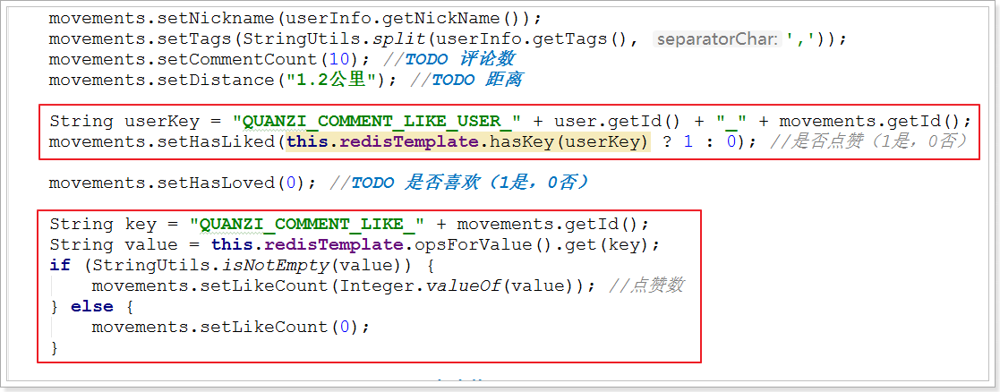
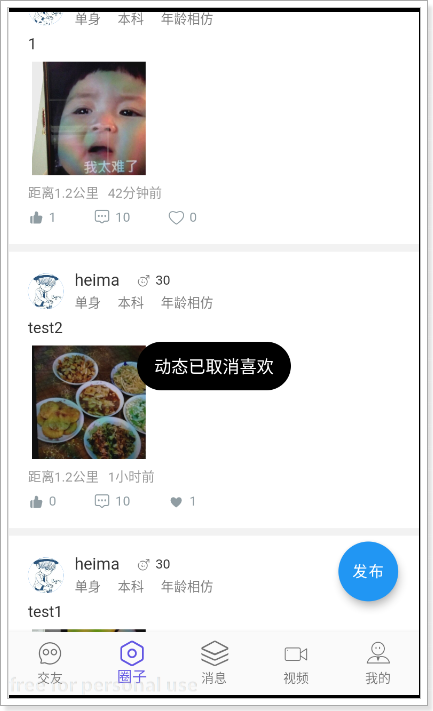
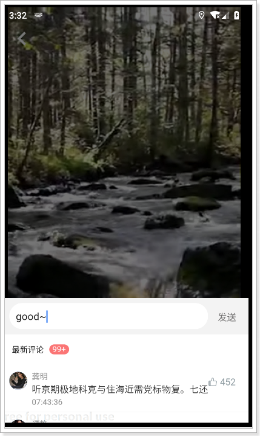
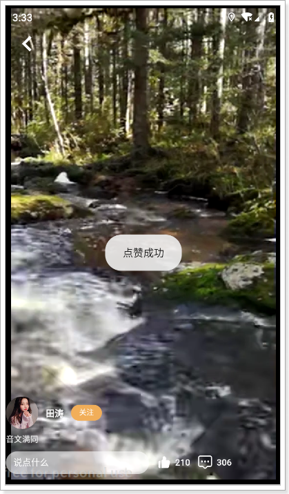
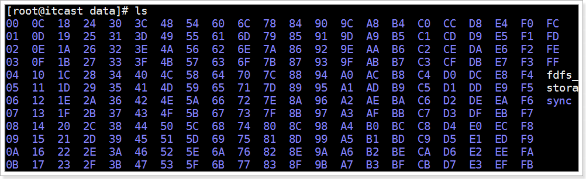
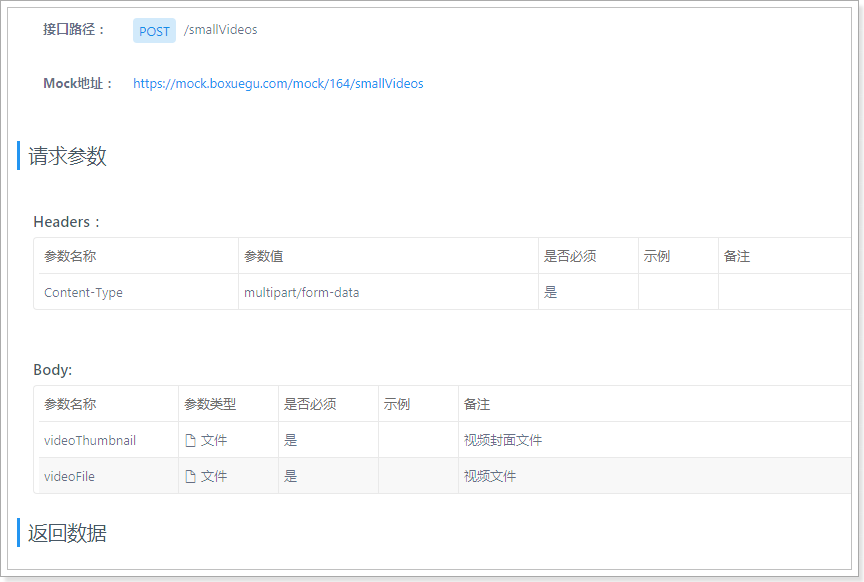
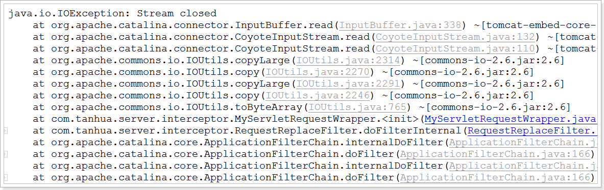
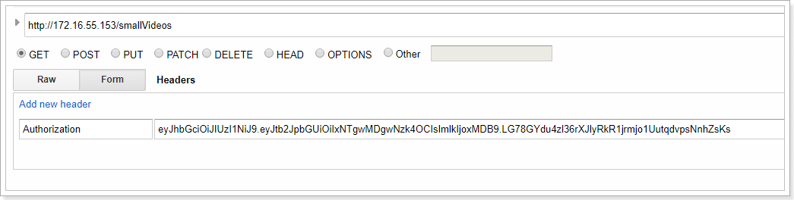
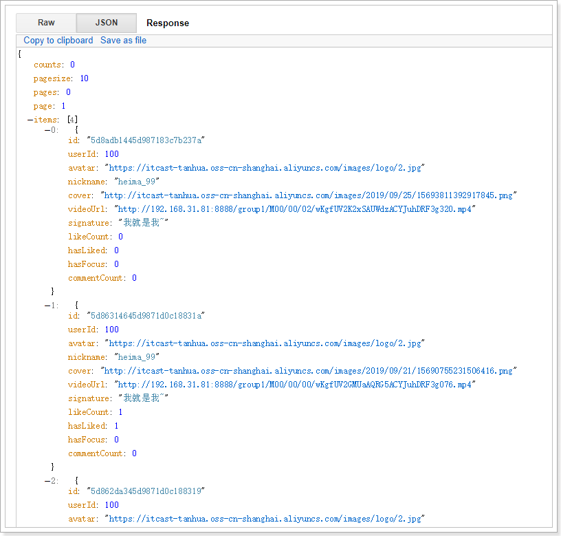
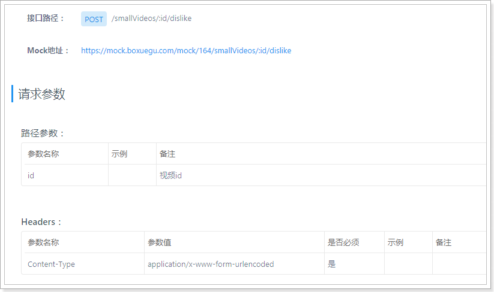

## 课程说明

> - 朋友圈互动
>   - 点赞
>   - 喜欢
>   - 查询单个动态详情
>   - 单个冬天评论
> - 发布视频
>   - 视频列表
>   - 视频点赞
> - 关注用户

## 1. 朋友圈互动

点赞、喜欢、评论等均可理解为用户对动态的评论。

### 1.1 点赞

#### 1.1.0 定义实体类

```java
@Data
@NoArgsConstructor
@AllArgsConstructor
@Document(collection = "quanzi_publish")
public class Publish implements java.io.Serializable {

    private static final long serialVersionUID = 8732308321082804771L;

    private ObjectId id; //主键id
    private Long userId;
    private String text; //文字
    private List<String> medias; //媒体数据，图片或小视频 url
    private Integer seeType; // 谁可以看，1-公开，2-私密，3-部分可见，4-不给谁看
    private List<Long> seeList; //部分可见的列表
    private List<Long> notSeeList; //不给谁看的列表
    private String longitude; //经度
    private String latitude; //纬度
    private String locationName; //位置名称
    private Long created; //发布时间

}
```

#### 1.1.1 定义dubbo接口

~~~java
package com.tanhua.dubbo.server.api;

import com.tanhua.dubbo.server.pojo.Pu blish;
import com.tanhua.dubbo.server.vo.PageInfo;

public interface QuanZiApi {

    /**
     * 发布动态
     *
     * @param publish
     * @return
     */
    boolean savePublish(Publish publish);

    /**
     * 分页查询动态
     *
     * @return
     */
    PageInfo<Publish> queryPublishList(Long userId, Integer page, Integer pageSize);

    /**
     * 点赞
     *
     * @param userId
     * @param publishId
     * @return
     */
    boolean saveLikeComment(Long userId, String publishId);

    /**
     * 取消点赞、喜欢等
     *
     * @param userId
     * @param publishId
     * @return
     */
    boolean removeComment(Long userId, String publishId, Integer commentType);

    /**
     * 喜欢
     *
     * @param userId
     * @param publishId
     * @return
     */
    boolean saveLoveComment(Long userId, String publishId);

    /**
     * 保存评论
     *
     * @param userId
     * @param publishId
     * @param type
     * @param content
     * @return
     */
    boolean saveComment(Long userId, String publishId, Integer type, String content);

    /**
     * 查询评论数
     *
     * @param publishId
     * @param type
     * @return
     */
    Long queryCommentCount(String publishId, Integer type);

}
~~~

#### 1.1.2 编写实现

~~~java
package com.tanhua.dubbo.server.api;

import com.alibaba.dubbo.config.annotation.Service;
import com.mongodb.client.result.DeleteResult;
import com.tanhua.dubbo.server.pojo.*;
import com.tanhua.dubbo.server.vo.PageInfo;
import org.apache.commons.lang3.StringUtils;
import org.bson.types.ObjectId;
import org.springframework.beans.factory.annotation.Autowired;
import org.springframework.data.domain.PageRequest;
import org.springframework.data.domain.Sort;
import org.springframework.data.mongodb.core.MongoTemplate;
import org.springframework.data.mongodb.core.query.Criteria;
import org.springframework.data.mongodb.core.query.Query;

import java.util.ArrayList;
import java.util.Date;
import java.util.List;

@Service(version = "1.0.0")
public class QuanZiApiImpl implements QuanZiApi {

    @Autowired
    private MongoTemplate mongoTemplate;

    /**
     * 点赞
     *
     * @param userId
     * @param publishId
     */
    public boolean saveLikeComment(Long userId, String publishId) {
        Query query = Query.query(Criteria
                .where("publishId").is(new ObjectId(publishId))
                .and("userId").is(userId)
                .and("commentType").is(1));
        long count = this.mongoTemplate.count(query, Comment.class);
        if (count > 0) {
            return false;
        }
        return this.saveComment(userId, publishId, 1, null);
    }

    /**
     * 取消点赞、喜欢等
     *
     * @return
     */
    public boolean removeComment(Long userId, String publishId, Integer commentType) {
        Query query = Query.query(Criteria
                .where("publishId").is(new ObjectId(publishId))
                .and("userId").is(userId)
                .and("commentType").is(commentType));
        DeleteResult remove = this.mongoTemplate.remove(query, Comment.class);
        return remove.getDeletedCount() > 0;
    }

    /**
     * 喜欢
     *
     * @param userId
     * @param publishId
     */
    public boolean saveLoveComment(Long userId, String publishId) {
        Query query = Query.query(Criteria
                .where("publishId").is(new ObjectId(publishId))
                .and("userId").is(userId)
                .and("commentType").is(3));
        long count = this.mongoTemplate.count(query, Comment.class);
        if (count > 0) {
            return false;
        }
        return this.saveComment(userId, publishId, 3, null);
    }

    /**
     * 保存评论
     *
     * @param userId
     * @param publishId
     * @param type
     * @return
     */
    public boolean saveComment(Long userId, String publishId, Integer type, String content) {
        try {
            Comment comment = new Comment();
            comment.setId(ObjectId.get());
            comment.setUserId(userId);
            comment.setContent(content);
            comment.setPublishId(new ObjectId(publishId));
            comment.setCommentType(type);
            comment.setCreated(System.currentTimeMillis());
            this.mongoTemplate.save(comment);
            return true;
        } catch (Exception e) {
            e.printStackTrace();
        }
        return false;
    }

    @Override
    public Long queryCommentCount(String publishId, Integer type) {
        Query query = Query.query(Criteria.where("publishId").is(publishId).and("commentType").is(type));
        return this.mongoTemplate.count(query, Comment.class);
    }
}

~~~

#### 1.1.3 编写接口服务

MovementsController：

~~~java
/**
 * 点赞
 *
 * @param publishId
 * @return
 */
@GetMapping("/{id}/like")
public ResponseEntity<Long> likeComment(@PathVariable("id") String publishId) {
    try {
        Long likeCount = this.movementsService.likeComment(publishId);
        if (likeCount != null) {
            return ResponseEntity.ok(likeCount);
        }
    } catch (Exception e) {
        e.printStackTrace();
    }
    return ResponseEntity.status(HttpStatus.INTERNAL_SERVER_ERROR).build();
}

/**
 * 取消点赞
 *
 * @param publishId
 * @return
 */
@GetMapping("/{id}/dislike")
public ResponseEntity<Long> disLikeComment(@PathVariable("id") String publishId) {
    try {
        Long likeCount = this.movementsService.cancelLikeComment(publishId);
        if (null != likeCount) {
            return ResponseEntity.ok(likeCount);
        }
    } catch (Exception e) {
        e.printStackTrace();
    }
    return ResponseEntity.status(HttpStatus.INTERNAL_SERVER_ERROR).build();
}
~~~

#### 1.1.4 编写服务实现

~~~java
package com.tanhua.server.service;

import com.alibaba.dubbo.common.utils.CollectionUtils;
import com.alibaba.dubbo.config.annotation.Reference;
import com.baomidou.mybatisplus.core.conditions.query.QueryWrapper;
import com.tanhua.dubbo.server.api.QuanZiApi;
import com.tanhua.dubbo.server.pojo.Publish;
import com.tanhua.dubbo.server.vo.PageInfo;
import com.tanhua.server.pojo.User;
import com.tanhua.server.pojo.UserInfo;
import com.tanhua.server.utils.RelativeDateFormat;
import com.tanhua.server.utils.UserThreadLocal;
import com.tanhua.server.vo.Movements;
import com.tanhua.server.vo.PageResult;
import com.tanhua.server.vo.PicUploadResult;
import org.apache.commons.lang3.StringUtils;
import org.springframework.beans.factory.annotation.Autowired;
import org.springframework.data.redis.core.RedisTemplate;
import org.springframework.stereotype.Service;
import org.springframework.web.multipart.MultipartFile;

import java.util.ArrayList;
import java.util.Date;
import java.util.List;

@Service
public class MovementsService {

    @Reference(version = "1.0.0")
    private QuanZiApi quanZiApi;

    @Autowired
    private PicUploadService picUploadService;

    @Autowired
    private UserInfoService userInfoService;

    @Autowired
    private RedisTemplate<String, String> redisTemplate;

  /**
     * 点赞
     *
     * @param publishId
     * @return
     */
    public Long likeComment(String publishId) {
        User user = UserThreadLocal.get();
        boolean bool = this.quanZiApi.saveLikeComment(user.getId(), publishId);
        if (!bool) {
            return null;
        }

        Long likeCount = 0L;

        //保存点赞数到redis
        String key = "QUANZI_COMMENT_LIKE_" + publishId;
        if (!this.redisTemplate.hasKey(key)) {
            Long count = this.quanZiApi.queryCommentCount(publishId, 1);
            likeCount = count;
            this.redisTemplate.opsForValue().set(key, String.valueOf(likeCount));
        } else {
            likeCount = this.redisTemplate.opsForValue().increment(key);
        }

        //记录已点赞
        String userKey = "QUANZI_COMMENT_LIKE_USER_" + user.getId() + "_" + publishId;
        this.redisTemplate.opsForValue().set(userKey, "1");

        return likeCount;
    }

    /**
     * 取消点赞
     *
     * @return
     */
    public Long cancelLikeComment(String publishId) {
        User user = UserThreadLocal.get();
        boolean bool = this.quanZiApi.removeComment(user.getId(), publishId, 1);
        if (bool) {
            String key = "QUANZI_COMMENT_LIKE_" + publishId;
            //数量递减
            Long likeCount = this.redisTemplate.opsForValue().decrement(key);

            //删除已点赞
            String userKey = "QUANZI_COMMENT_LIKE_USER_" + user.getId() + "_" + publishId;
            this.redisTemplate.delete(userKey);

            return likeCount;
        }
        return null;
    }
}

~~~

#### 1.1.5 修改查询动态点赞数



#### 1.1.6 测试

 

### 1.2 喜欢

#### 1.2.1 MovementsController

~~~java
/**
     * 喜欢
     *
     * @param publishId
     * @return
     */
    @GetMapping("/{id}/love")
    public ResponseEntity<Long> loveComment(@PathVariable("id") String publishId) {
        try {
            Long loveCount = this.movementsService.loveComment(publishId);
            if (null != loveCount) {
                return ResponseEntity.ok(loveCount);
            }
        } catch (Exception e) {
            e.printStackTrace();
        }
        return ResponseEntity.status(HttpStatus.INTERNAL_SERVER_ERROR).build();
    }

    /**
     * 取消喜欢
     *
     * @param publishId
     * @return
     */
    @GetMapping("/{id}/unlove")
    public ResponseEntity<Long> disLoveComment(@PathVariable("id") String publishId) {
        try {
            Long loveCount = this.movementsService.cancelLoveComment(publishId);
            if (null != loveCount) {
                return ResponseEntity.ok(loveCount);
            }
        } catch (Exception e) {
            e.printStackTrace();
        }
        return ResponseEntity.status(HttpStatus.INTERNAL_SERVER_ERROR).build();
    }
~~~

#### 1.2.2、MovementsService

~~~java
/**
     * 喜欢
     *
     * @param publishId
     * @return
     */
    public Long loveComment(String publishId) {
        User user = UserThreadLocal.get();
        boolean bool = this.quanZiApi.saveLoveComment(user.getId(), publishId);
        if (!bool) {
            return null;
        }

        Long loveCount = 0L;

        //保存喜欢数到redis
        String key = "QUANZI_COMMENT_LOVE_" + publishId;
        if (!this.redisTemplate.hasKey(key)) {
            Long count = this.quanZiApi.queryCommentCount(publishId, 3);
            loveCount = count ;
            this.redisTemplate.opsForValue().set(key, String.valueOf(loveCount));
        } else {
            loveCount = this.redisTemplate.opsForValue().increment(key);
        }

        //记录已喜欢
        String userKey = "QUANZI_COMMENT_LOVE_USER_" + user.getId() + "_" + publishId;
        this.redisTemplate.opsForValue().set(userKey, "1");

        return loveCount;
    }

    /**
     * 取消喜欢
     *
     * @return
     */
    public Long cancelLoveComment(String publishId) {
        User user = UserThreadLocal.get();
        boolean bool = this.quanZiApi.removeComment(user.getId(), publishId, 3);
        if (bool) {
            String key = "QUANZI_COMMENT_LOVE_" + publishId;
            //数量递减
            Long loveCount = this.redisTemplate.opsForValue().decrement(key);

            //删除已点赞
            String userKey = "QUANZI_COMMENT_LOVE_USER_" + user.getId() + "_" + publishId;
            this.redisTemplate.delete(userKey);

            return loveCount;
        }
        return null;
    }
~~~

#### 1.2.3、测试

 

 

### 1.3 查询单条动态

#### 1.3.1 定义dubbo接口

QuanZiApi：

~~~java
/**
 * 根据id查询动态
 *
 * @param id
 * @return
 */
Publish queryPublishById(String id);
~~~

#### 1.3.2 dubbo接口实现

QuanZiApiImpl：

~~~java
@Override
public Publish queryPublishById(String id) {
    return this.mongoTemplate.findById(new ObjectId(id), Publish.class);
}
~~~

#### 1.3.3 定义服务接口

~~~java
/**
 * 查询单条动态信息
 *
 * @param publishId
 * @return
 */
@GetMapping("/{id}")
public ResponseEntity<Movements> queryById(@PathVariable("id") String publishId) {
    try {
        Movements movements = this.movementsService.queryById(publishId);
        if(null != movements){
            return ResponseEntity.ok(movements);
        }
    } catch (Exception e) {
        e.printStackTrace();
    }
    return ResponseEntity.status(HttpStatus.INTERNAL_SERVER_ERROR).build();
}
~~~

#### 1.3.4  服务实现

~~~java
public Movements queryById(String publishId) {
    Publish publish = this.quanZiApi.queryPublishById(publishId);
    if (null == publish) {
        return null;
    }

    Movements movements = new Movements();

    movements.setId(publish.getId().toHexString());
    movements.setImageContent(publish.getMedias().toArray(new String[]{}));
    movements.setTextContent(publish.getText());
    movements.setUserId(publish.getUserId());
    movements.setCreateDate(RelativeDateFormat.format(new Date(publish.getCreated())));

    UserInfo userInfo = this.userInfoService.queryById(publish.getUserId());
    if (null == userInfo) {
        return null;
    }
    this.fillValueToMovements(movements, userInfo);

    return movements;

}

private void fillValueToMovements(Movements movements, UserInfo userInfo) {
    movements.setAge(userInfo.getAge());
    movements.setAvatar(userInfo.getLogo());
    movements.setGender(userInfo.getSex().name().toLowerCase());
    movements.setNickname(userInfo.getNickName());
    movements.setTags(StringUtils.split(userInfo.getTags(), ','));
    movements.setCommentCount(10); //TODO 评论数
    movements.setDistance("1.2公里"); //TODO 距离

    String userKey = "QUANZI_COMMENT_LIKE_USER_" + userInfo.getUserId() + "_" + movements.getId();
    movements.setHasLiked(this.redisTemplate.hasKey(userKey) ? 1 : 0); //是否点赞（1是，0否）

    String key = "QUANZI_COMMENT_LIKE_" + movements.getId();
    String value = this.redisTemplate.opsForValue().get(key);
    if (StringUtils.isNotEmpty(value)) {
        movements.setLikeCount(Integer.valueOf(value)); //点赞数
    } else {
        movements.setLikeCount(0);
    }

    String userLoveKey = "QUANZI_COMMENT_LOVE_USER_" + userInfo.getUserId() + "_" + movements.getId();
    movements.setHasLoved(this.redisTemplate.hasKey(userLoveKey) ? 1 : 0); //是否喜欢（1是，0否）

    key = "QUANZI_COMMENT_LOVE_" + movements.getId();
    value = this.redisTemplate.opsForValue().get(key);
    if (StringUtils.isNotEmpty(value)) {
        movements.setLoveCount(Integer.valueOf(value)); //喜欢数
    } else {
        movements.setLoveCount(0);
    }
}
~~~

#### 1.3.5 测试


### 1.4 单条动态评论

功能包括：查询评论列表，评论点赞、取消点赞。

#### 1.4.1 定义dubbo接口

~~~java
/**
 * 查询评论
 *
 * @return
 */
PageInfo<Comment> queryCommentList(String publishId, Integer page, Integer pageSize);
~~~

#### 1.4.2 编写实现

~~~java
@Override
public PageInfo<Comment> queryCommentList(String publishId, Integer page, Integer pageSize) {
    PageRequest pageRequest = PageRequest.of(page - 1, pageSize, Sort.by(Sort.Order.asc("created")));
    Query query = new Query(Criteria
            .where("publishId").is(new ObjectId(publishId))
            .and("commentType").is(2)).with(pageRequest);

    //查询时间线表
    List<Comment> timeLineList = this.mongoTemplate.find(query, Comment.class);

    PageInfo<Comment> pageInfo = new PageInfo<>();
    pageInfo.setPageNum(page);
    pageInfo.setPageSize(pageSize);
    pageInfo.setRecords(timeLineList);
    pageInfo.setTotal(0); //不提供总数
    return pageInfo;
}
~~~

#### 1.4.3 服务接口实现

~~~java
package com.tanhua.server.vo;

import lombok.AllArgsConstructor;
import lombok.Data;
import lombok.NoArgsConstructor;

/**
 * 评论
 */
@Data
@NoArgsConstructor
@AllArgsConstructor
public class Comments {

    private String id; //评论id
    private String avatar; //头像
    private String nickname; //昵称
    private String content; //评论
    private String createDate; //评论时间: 08:27
    private Integer likeCount; //点赞数
    private Integer hasLiked; //是否点赞（1是，0否）

}

~~~

~~~java
package com.tanhua.server.controller;

import com.tanhua.server.service.CommentsService;
import com.tanhua.server.service.MovementsService;
import com.tanhua.server.vo.Comments;
import com.tanhua.server.vo.PageResult;
import org.springframework.beans.factory.annotation.Autowired;
import org.springframework.http.HttpStatus;
import org.springframework.http.ResponseEntity;
import org.springframework.web.bind.annotation.*;

import java.util.Map;

@RestController
@RequestMapping("comments")
public class CommentsController {

    @Autowired
    private CommentsService commentsService;

    @Autowired
    private MovementsService movementsService;

    /**
     * 查询评论列表
     *
     * @param publishId
     * @param page
     * @param pagesize
     * @return
     */
    @GetMapping
    public ResponseEntity<PageResult> queryCommentsList(@RequestParam("movementId") String publishId,
                                                        @RequestParam(value = "page", defaultValue = "1") Integer page,
                                                        @RequestParam(value = "pagesize", defaultValue = "10") Integer pagesize) {
        try {
            PageResult pageResult = this.commentsService.queryCommentsList(publishId, page, pagesize);
            return ResponseEntity.ok(pageResult);
        } catch (Exception e) {
            e.printStackTrace();
        }
        return ResponseEntity.status(HttpStatus.INTERNAL_SERVER_ERROR).build();

    }

    /**
     * 保存评论
     */
    @PostMapping
    public ResponseEntity<Void> saveComments(@RequestBody Map<String,String> param) {
        try {
            String publishId = param.get("movementId");
            String content = param.get("comment");
            Boolean result = this.commentsService.saveComments(publishId, content);
            if (result) {
                return ResponseEntity.ok(null);
            }
        } catch (Exception e) {
            e.printStackTrace();
        }
        return ResponseEntity.status(HttpStatus.INTERNAL_SERVER_ERROR).build();
    }

    /**
     * 点赞
     *
     * @param publishId
     * @return
     */
    @GetMapping("/{id}/like")
    public ResponseEntity<Long> likeComment(@PathVariable("id") String publishId) {
        try {
            Long likeCount = this.movementsService.likeComment(publishId);
            if (likeCount != null) {
                return ResponseEntity.ok(likeCount);
            }
        } catch (Exception e) {
            e.printStackTrace();
        }
        return ResponseEntity.status(HttpStatus.INTERNAL_SERVER_ERROR).build();
    }

    /**
     * 取消点赞
     *
     * @param publishId
     * @return
     */
    @GetMapping("/{id}/dislike")
    public ResponseEntity<Long> disLikeComment(@PathVariable("id") String publishId) {
        try {
            Long likeCount = this.movementsService.cancelLikeComment(publishId);
            if (null != likeCount) {
                return ResponseEntity.ok(likeCount);
            }
        } catch (Exception e) {
            e.printStackTrace();
        }
        return ResponseEntity.status(HttpStatus.INTERNAL_SERVER_ERROR).build();
    }

}

~~~

~~~java
package com.tanhua.server.service;

import com.alibaba.dubbo.config.annotation.Reference;
import com.baomidou.mybatisplus.core.conditions.query.QueryWrapper;
import com.tanhua.dubbo.server.api.QuanZiApi;
import com.tanhua.dubbo.server.pojo.Comment;
import com.tanhua.dubbo.server.vo.PageInfo;
import com.tanhua.server.pojo.User;
import com.tanhua.server.pojo.UserInfo;
import com.tanhua.server.utils.UserThreadLocal;
import com.tanhua.server.vo.Comments;
import com.tanhua.server.vo.PageResult;
import org.apache.commons.lang3.StringUtils;
import org.joda.time.DateTime;
import org.springframework.beans.factory.annotation.Autowired;
import org.springframework.data.redis.core.RedisTemplate;
import org.springframework.stereotype.Service;

import java.util.ArrayList;
import java.util.List;

@Service
public class CommentsService {

    @Reference(version = "1.0.0")
    private QuanZiApi quanZiApi;

    @Autowired
    private UserInfoService userInfoService;

    @Autowired
    private RedisTemplate<String, String> redisTemplate;

    public PageResult queryCommentsList(String publishId, Integer page, Integer pagesize) {

        User user = UserThreadLocal.get();

        PageInfo<Comment> pageInfo = this.quanZiApi.queryCommentList(publishId, page, pagesize);

        List<Comment> records = pageInfo.getRecords();

        if (records.isEmpty()) {
            PageResult pageResult = new PageResult();
            pageResult.setPage(page);
            pageResult.setPagesize(pagesize);
            pageResult.setPages(0);
            pageResult.setCounts(0);
            return pageResult;
        }

        List<Long> userIds = new ArrayList<>();
        for (Comment comment : records) {
            if (!userIds.contains(comment.getUserId())) {
                userIds.add(comment.getUserId());
            }

        }

        QueryWrapper<UserInfo> queryWrapper = new QueryWrapper<>();
        queryWrapper.in("user_id", userIds);
        List<UserInfo> userInfos = this.userInfoService.queryList(queryWrapper);

        List<Comments> result = new ArrayList<>();
        for (Comment record : records) {
            Comments comments = new Comments();
            comments.setContent(record.getContent());
            comments.setCreateDate(new DateTime(record.getCreated()).toString("yyyy年MM月dd日 HH:mm"));
            comments.setId(record.getId().toHexString());

            for (UserInfo userInfo : userInfos) {
                if (record.getUserId().longValue() == userInfo.getUserId().longValue()) {
                    comments.setAvatar(userInfo.getLogo());
                    comments.setNickname(userInfo.getNickName());
                    break;
                }
            }

            String key = "QUANZI_COMMENT_LIKE_" + comments.getId();
            String value = this.redisTemplate.opsForValue().get(key);
            if (StringUtils.isNotEmpty(value)) {
                comments.setLikeCount(Integer.valueOf(value)); //点赞数
            } else {
                comments.setLikeCount(0);
            }

            String userKey = "QUANZI_COMMENT_LIKE_USER_" + user.getId() + "_" + comments.getId();
            comments.setHasLiked(this.redisTemplate.hasKey(userKey) ? 1 : 0); //是否点赞（1是，0否）

            result.add(comments);
        }

        PageResult pageResult = new PageResult();
        pageResult.setItems(result);
        pageResult.setPage(page);
        pageResult.setPagesize(pagesize);
        pageResult.setPages(0);
        pageResult.setCounts(0);

        return pageResult;


    }

    /**
     * 保存评论
     *
     * @param publishId
     * @param content
     * @return
     */
    public Boolean saveComments(String publishId, String content) {
        User user = UserThreadLocal.get();
        return this.quanZiApi.saveComment(user.getId(), publishId, 2, content);
    }
}

~~~

#### 1.4.4 测试

 

 


## 2. 小视频功能说明

小视频功能类似于抖音、快手小视频的应用，用户可以上传小视频进行分享，也可以浏览查看别人分享的视频，并且可以对视频评论和点赞操作。

效果：

 

查看详情：

 

评论：

 

点赞：

 

## 3. 小视频技术方案

对于小视频的功能的开发，核心点就是：存储 + 推荐 + 加载速度 。

- 对于存储而言，小视频的存储量以及容量都是非常巨大的
  - 所以我们选择自己搭建分布式存储系统 FastDFS进行存储
- 对于推荐算法，我们将采用多种权重的计算方式进行计算
- 对于加载速度，除了提升服务器带宽外可以通过CDN的方式进行加速，当然了这需要额外购买CDN服务

## 4. FastDFS环境搭建

### 4.1 搭建服务

我们使用docker进行搭建。

~~~shell
#拉取镜像
docker pull delron/fastdfs

#创建tracker容器
docker run -d --network=host --name tracker -v /var/fdfs/tracker:/var/fdfs delron/fastdfs tracker

#创建storage容器
docker run -d --network=host --name storage -e TRACKER_SERVER=47.100.169.233:22122 -v /var/fdfs/storage:/var/fdfs -e GROUP_NAME=group1 delron/fastdfs storage

#进入storage容器，到storage的配置文件中配置http访问的端口，配置文件在/etc/fdfs目录下的storage.conf。
docker exec -it storage /bin/bash

#默认的http端口为8888，可以修改也可以配置
# the port of the web server on this storage server
http.server_port=8888

#配置nginx，在/usr/local/nginx目录下，修改nginx.conf文件
#默认配置如下：

server {
    listen       8888;
    server_name  localhost;
    location ~/group[0-9]/ {
        ngx_fastdfs_module;
    }
    error_page   500 502 503 504  /50x.html;
    location = /50x.html {
        root html;
    }
}

#默认的存储路径为/var/fdfs/data
~~~



### 4.2 java client

导入依赖：

~~~xml
<dependency>
    <groupId>com.github.tobato</groupId>
    <artifactId>fastdfs-client</artifactId>
    <version>1.26.7</version>
    <exclusions>
        <exclusion>
            <groupId>ch.qos.logback</groupId>
            <artifactId>logback-classic</artifactId>
        </exclusion>
    </exclusions>
</dependency>
~~~

#### 4.2.1 application.properties

~~~properties
# ===================================================================
# 分布式文件系统FDFS配置
# ===================================================================
fdfs.so-timeout = 1501
fdfs.connect-timeout = 601
#缩略图生成参数
fdfs.thumb-image.width= 150
fdfs.thumb-image.height= 150
#TrackerList参数,支持多个
fdfs.tracker-list=192.168.31.81:22122
~~~

#### 4.2.2 测试

~~~java
package com.tanhua.server;

import com.github.tobato.fastdfs.domain.fdfs.StorePath;
import com.github.tobato.fastdfs.service.FastFileStorageClient;
import org.apache.commons.io.FileUtils;
import org.junit.Test;
import org.junit.runner.RunWith;
import org.springframework.beans.factory.annotation.Autowired;
import org.springframework.boot.test.context.SpringBootTest;
import org.springframework.test.context.junit4.SpringRunner;

import java.io.File;
import java.io.IOException;

@RunWith(SpringRunner.class)
@SpringBootTest
public class TestFastDFS {

    @Autowired
    protected FastFileStorageClient storageClient;

    @Test
    public void testUpload(){
        String path = "C:\\Users\\zhijun\\Desktop\\pics\\1.jpg";
        File file = new File(path);

        try {
            StorePath storePath = this.storageClient.uploadFile(FileUtils.openInputStream(file), file.length(), "jpg", null);

            System.out.println(storePath); //StorePath [group=group1, path=M00/00/00/wKgfUV2GJSuAOUd_AAHnjh7KpOc1.1.jpg]
            System.out.println(storePath.getFullPath());//group1/M00/00/00/wKgfUV2GJSuAOUd_AAHnjh7KpOc1.1.jpg
        } catch (IOException e) {
            e.printStackTrace();
        }
    }
}

~~~

## 5. 发布小视频

### 5.1 编写pojo

在dubbo接口工程中编写pojo：

~~~java
package com.tanhua.dubbo.server.pojo;

import lombok.AllArgsConstructor;
import lombok.Data;
import lombok.NoArgsConstructor;
import org.bson.types.ObjectId;
import org.springframework.data.mongodb.core.mapping.Document;

import java.util.List;

@Data
@NoArgsConstructor
@AllArgsConstructor
@Document(collection = "video")
public class Video implements java.io.Serializable {

    private static final long serialVersionUID = -3136732836884933873L;

    private ObjectId id; //主键id
    private Long userId;
    private String text; //文字
    private String picUrl; //视频封面文件
    private String videoUrl; //视频文件
    private Long created; //创建时间
    private Integer seeType; // 谁可以看，1-公开，2-私密，3-部分可见，4-不给谁看
    private List<Long> seeList; //部分可见的列表
    private List<Long> notSeeList; //不给谁看的列表
    private String longitude; //经度
    private String latitude; //纬度
    private String locationName; //位置名称
}

~~~

### 5.2 定义接口

~~~java
package com.tanhua.dubbo.server.api;

import com.tanhua.dubbo.server.pojo.Video;

public interface VideoApi {

    /**
     * 保存小视频
     *
     * @param video
     * @return
     */
    Boolean saveVideo(Video video);

}
~~~

### 5.3 实现

~~~java
package com.tanhua.dubbo.server.api;

import com.alibaba.dubbo.config.annotation.Service;
import com.tanhua.dubbo.server.pojo.Video;
import org.bson.types.ObjectId;
import org.springframework.beans.factory.annotation.Autowired;
import org.springframework.data.mongodb.core.MongoTemplate;

@Service(version = "1.0.0")
public class VideoApiImpl implements VideoApi {

    @Autowired
    private MongoTemplate mongoTemplate;

    @Override
    public Boolean saveVideo(Video video) {
        if(video.getUserId() == null){
            return false;
        }

        video.setId(ObjectId.get());
        video.setCreated(System.currentTimeMillis());

        this.mongoTemplate.save(video);
        return true;
    }
}

~~~

### 5.4 接口服务



#### 5.4.1 VideoController

~~~java
package com.tanhua.server.controller;

import com.tanhua.server.service.VideoService;
import org.springframework.beans.factory.annotation.Autowired;
import org.springframework.http.HttpStatus;
import org.springframework.http.ResponseEntity;
import org.springframework.web.bind.annotation.PostMapping;
import org.springframework.web.bind.annotation.RequestMapping;
import org.springframework.web.bind.annotation.RequestParam;
import org.springframework.web.bind.annotation.RestController;
import org.springframework.web.multipart.MultipartFile;

@RestController
@RequestMapping("smallVideos")
public class VideoController {

    @Autowired
    private VideoService videoService;

    @PostMapping
    public ResponseEntity<Void> saveVideo(@RequestParam(value = "videoThumbnail", required = false) MultipartFile picFile,
                                          @RequestParam(value = "videoFile", required = false) MultipartFile videoFile) {
        try {
            Boolean bool = this.videoService.saveVideo(picFile, videoFile);
            if(bool){
                return ResponseEntity.ok(null);
            }
        } catch (Exception e) {
            e.printStackTrace();
        }
        return ResponseEntity.status(HttpStatus.INTERNAL_SERVER_ERROR).build();
    }
}

~~~

#### 5.4.2 VideoService

~~~java
package com.tanhua.server.service;

import com.alibaba.dubbo.config.annotation.Reference;
import com.github.tobato.fastdfs.domain.conn.FdfsWebServer;
import com.github.tobato.fastdfs.domain.fdfs.StorePath;
import com.github.tobato.fastdfs.service.FastFileStorageClient;
import com.tanhua.dubbo.server.api.VideoApi;
import com.tanhua.dubbo.server.pojo.Video;
import com.tanhua.server.pojo.User;
import com.tanhua.server.utils.UserThreadLocal;
import com.tanhua.server.vo.PicUploadResult;
import org.apache.commons.lang3.StringUtils;
import org.springframework.beans.factory.annotation.Autowired;
import org.springframework.stereotype.Service;
import org.springframework.web.multipart.MultipartFile;

@Service
public class VideoService {

    @Autowired
    private PicUploadService picUploadService;

    @Autowired
    protected FastFileStorageClient storageClient;

    @Autowired
    private FdfsWebServer fdfsWebServer;

    @Reference(version = "1.0.0")
    private VideoApi videoApi;

    public Boolean saveVideo(MultipartFile picFile, MultipartFile videoFile) {
        User user = UserThreadLocal.get();
        Video video = new Video();
        video.setUserId(user.getId());
        video.setSeeType(1);
        try {
            //上传封面图片
            PicUploadResult picUploadResult = this.picUploadService.upload(picFile);
            video.setPicUrl(picUploadResult.getName()); //图片路径

            //上传视频
            StorePath storePath = storageClient.uploadFile(videoFile.getInputStream(),
                    videoFile.getSize(),
                    StringUtils.substringAfter(videoFile.getOriginalFilename(), "."),
                    null);
            video.setVideoUrl(fdfsWebServer.getWebServerUrl() + "/" + storePath.getFullPath());

            this.videoApi.saveVideo(video);

            return true;
        } catch (Exception e) {
            e.printStackTrace();
        }

        return false;
    }
}

~~~

#### 5.4.3、测试

如果上传视频，会导致异常，是因为请求太大的缘故：



解决：application.properties

~~~properties
spring.servlet.multipart.max-file-size=30MB
spring.servlet.multipart.max-request-size=30MB
~~~

问题解决：


## 6. 小视频列表

### 6.1 定义dubbo服务

~~~java
package com.tanhua.dubbo.server.api;

import com.tanhua.dubbo.server.pojo.Video;
import com.tanhua.dubbo.server.vo.PageInfo;

public interface VideoApi {

    /**
     * 保存小视频
     *
     * @param video
     * @return
     */
    Boolean saveVideo(Video video);

    /**
     * 分页查询小视频列表，按照时间倒序排序
     *
     * @param page
     * @param pageSize
     * @return
     */
    PageInfo<Video> queryVideoList(Integer page, Integer pageSize);

}

~~~

### 6.2 实现dubbo服务

~~~java
package com.tanhua.dubbo.server.api;

import com.alibaba.dubbo.config.annotation.Service;
import com.tanhua.dubbo.server.pojo.Video;
import com.tanhua.dubbo.server.vo.PageInfo;
import org.bson.types.ObjectId;
import org.springframework.beans.factory.annotation.Autowired;
import org.springframework.data.domain.PageRequest;
import org.springframework.data.domain.Pageable;
import org.springframework.data.domain.Sort;
import org.springframework.data.mongodb.core.MongoTemplate;
import org.springframework.data.mongodb.core.query.Query;

import java.util.List;

@Service(version = "1.0.0")
public class VideoApiImpl implements VideoApi {

    @Autowired
    private MongoTemplate mongoTemplate;

    @Override
    public Boolean saveVideo(Video video) {
        if (video.getUserId() == null) {
            return false;
        }

        video.setId(ObjectId.get());
        video.setCreated(System.currentTimeMillis());

        this.mongoTemplate.save(video);
        return null;
    }

    @Override
    public PageInfo<Video> queryVideoList(Integer page, Integer pageSize) {
        Pageable pageable = PageRequest.of(page - 1, pageSize, Sort.by(Sort.Order.desc("created")));
        Query query = new Query().with(pageable);
        List<Video> videos = this.mongoTemplate.find(query, Video.class);
        PageInfo<Video> pageInfo = new PageInfo<>();
        pageInfo.setRecords(videos);
        pageInfo.setPageNum(page);
        pageInfo.setPageSize(pageSize);
        pageInfo.setTotal(0); //不提供总数
        return pageInfo;
    }
}

~~~

### 6.3 定义VideoVo

~~~java
package com.tanhua.server.vo;

import lombok.AllArgsConstructor;
import lombok.Data;
import lombok.NoArgsConstructor;

@Data
@NoArgsConstructor
@AllArgsConstructor
public class VideoVo {

    private String id;
    private Long userId;
    private String avatar; //头像
    private String nickname; //昵称
    private String cover; //封面
    private String videoUrl; //视频URL
    private String signature; //签名
    private Integer likeCount; //点赞数量
    private Integer hasLiked; //是否已赞（1是，0否）
    private Integer hasFocus; //是是否关注 （1是，0否）
    private Integer commentCount; //评论数量
}

~~~

### 6.4 VideoController

~~~java
@RestController
@RequestMapping("smallVideos")
public class VideoController {    
/**
     * 查询小视频列表
     *
     * @param page
     * @param pageSize
     * @return
     */
    @GetMapping
    public ResponseEntity<PageResult> queryVideoList(@RequestParam(value = "page", defaultValue = "1") Integer page,
                                                     @RequestParam(value = "pagesize", defaultValue = "10") Integer pageSize) {
        try {
            if (page <= 0) {
                page = 1;
            }
            PageResult pageResult = this.videoService.queryVideoList(page, pageSize);
            if (null != pageResult) {
                return ResponseEntity.ok(pageResult);
            }
        } catch (Exception e) {
            e.printStackTrace();
        }
        return ResponseEntity.status(HttpStatus.INTERNAL_SERVER_ERROR).build();
    }
}
~~~

### 6.5 VideoService

~~~java
public PageResult queryVideoList(Integer page, Integer pageSize) {

        User user = UserThreadLocal.get();

        PageResult pageResult = new PageResult();
        pageResult.setPage(page);
        pageResult.setPagesize(pageSize);
        pageResult.setPages(0);
        pageResult.setCounts(0);

        PageInfo<Video> pageInfo = this.videoApi.queryVideoList(page, pageSize);
        List<Video> records = pageInfo.getRecords();
        List<VideoVo> videoVoList = new ArrayList<>();
        List<Long> userIds = new ArrayList<>();
        for (Video record : records) {
            VideoVo videoVo = new VideoVo();

            videoVo.setUserId(record.getUserId());
            videoVo.setCover(record.getPicUrl());
            videoVo.setVideoUrl(record.getVideoUrl());
            videoVo.setId(record.getId().toHexString());
            videoVo.setSignature("我就是我~");

            Long commentCount = this.quanZiApi.queryCommentCount(videoVo.getId(), 2);
            videoVo.setCommentCount(commentCount == null ? 0 : commentCount.intValue()); // 评论数

            String followUserKey = "VIDEO_FOLLOW_USER_" + user.getId() + "_" + videoVo.getUserId();
            videoVo.setHasFocus(this.redisTemplate.hasKey(followUserKey) ? 1 : 0); //是否关注

            String userKey = "QUANZI_COMMENT_LIKE_USER_" + user.getId() + "_" + videoVo.getId();
            videoVo.setHasLiked(this.redisTemplate.hasKey(userKey) ? 1 : 0); //是否点赞（1是，0否）

            String key = "QUANZI_COMMENT_LIKE_" + videoVo.getId();
            String value = this.redisTemplate.opsForValue().get(key);
            if (StringUtils.isNotEmpty(value)) {
                videoVo.setLikeCount(Integer.valueOf(value)); //点赞数
            } else {
                videoVo.setLikeCount(0);
            }

            if (!userIds.contains(record.getUserId())) {
                userIds.add(record.getUserId());
            }

            videoVoList.add(videoVo);
        }

        QueryWrapper<UserInfo> queryWrapper = new QueryWrapper();
        queryWrapper.in("user_id", userIds);
        List<UserInfo> userInfos = this.userInfoService.queryList(queryWrapper);
        for (VideoVo videoVo : videoVoList) {
            for (UserInfo userInfo : userInfos) {
                if (videoVo.getUserId().longValue() == userInfo.getUserId().longValue()) {

                    videoVo.setNickname(userInfo.getNickName());
                    videoVo.setAvatar(userInfo.getLogo());

                    break;
                }
            }

        }

        pageResult.setItems(videoVoList);
        return pageResult;
    }
~~~

### 6.6 测试



 

## 7. 视频点赞

点赞逻辑与之前的圈子点赞一样，所以实现也是一样的。

mock地址：https://mock.boxuegu.com/project/164/interface/api/77987



VideoController：

~~~java
    /**
     * 视频点赞
     *
     * @param videoId 视频id
     * @return
     */
    @PostMapping("/{id}/like")
    public ResponseEntity<Long> likeComment(@PathVariable("id") String videoId) {
        return this.movementsController.likeComment(videoId);
    }

    /**
     * 取消点赞
     *
     * @param videoId
     * @return
     */
    @PostMapping("/{id}/dislike")
    public ResponseEntity<Long> disLikeComment(@PathVariable("id") String videoId) {
        return this.movementsController.disLikeComment(videoId);
    }
~~~

## 8. 小视频评论

小视频的评论与圈子的评论逻辑类似，所以也可以使用同一套逻辑进行实现。

### 8.1 评论列表

mock地址：https://mock.boxuegu.com/project/164/interface/api/72177

~~~java
/**
 * 评论列表
 */
@GetMapping("/{id}/comments")
public ResponseEntity<PageResult> queryCommentsList(
    @PathVariable("id") String videoId,                                                 
    @RequestParam(value = "page", defaultValue = "1") Integer page, 
    @RequestParam(value = "pagesize", defaultValue = "10") Integer pagesize) {
    return this.commentsController.queryCommentsList(videoId, page, pagesize);
}
~~~

### 8.2 发布评论

mock地址：https://mock.boxuegu.com/project/164/interface/api/72919

~~~java
/**
 * 提交评论
 *
 * @param param
 * @param videoId
 * @return
 */
@PostMapping("/{id}/comments")
public ResponseEntity<Void> saveComments(
    @RequestBody Map<String, String> param,                                     
    @PathVariable("id") String videoId) {
    param.put("movementId", videoId);
    return this.commentsController.saveComments(param);
}
~~~

### 8.3 评论点赞

mock地址：https://mock.boxuegu.com/project/164/interface/api/75306

~~~java
/**
 * 评论点赞
 *
 * @param publishId
 * @return
 */
@PostMapping("/comments/{id}/like")
public ResponseEntity<Long> commentsLikeComment(@PathVariable("id") String publishId) {
    return this.movementsController.likeComment(publishId);
}

/**
 * 评论取消点赞
 *
 * @param publishId
 * @return
 */
@PostMapping("/comments/{id}/dislike")
public ResponseEntity<Long> disCommentsLikeComment(@PathVariable("id") String publishId) {
    return this.movementsController.disLikeComment(publishId);
}
~~~

## 9. 关注用户

关注用户是关注小视频发布的作者，这样我们后面计算推荐时，关注的用户将权重更重一些。

### 9.1 定义dubbo服务

~~~java
package com.tanhua.dubbo.server.pojo;

import lombok.AllArgsConstructor;
import lombok.Data;
import lombok.NoArgsConstructor;
import org.bson.types.ObjectId;
import org.springframework.data.mongodb.core.mapping.Document;

@Data
@NoArgsConstructor
@AllArgsConstructor
@Document(collection = "follow_user")
public class FollowUser implements java.io.Serializable{

    private static final long serialVersionUID = 3148619072405056052L;

    private ObjectId id; //主键id
    private Long userId; //用户id
    private Long followUserId; //关注的用户id
    private Long created; //关注时间
}

~~~

~~~java
package com.tanhua.dubbo.server.api;

import com.tanhua.dubbo.server.pojo.Video;
import com.tanhua.dubbo.server.vo.PageInfo;

public interface VideoApi {

    /**
     * 保存小视频
     *
     * @param video
     * @return
     */
    Boolean saveVideo(Video video);

    /**
     * 分页查询小视频列表，按照时间倒序排序
     *
     * @param page
     * @param pageSize
     * @return
     */
    PageInfo<Video> queryVideoList(Integer page, Integer pageSize);

    /**
     * 关注用户
     *
     * @param userId
     * @param followUserId
     * @return
     */
    Boolean followUser(Long userId, Long followUserId);

    /**
     * 取消关注用户
     *
     * @param userId
     * @param followUserId
     * @return
     */
    Boolean disFollowUser(Long userId, Long followUserId);

}

~~~

接口实现：

~~~java
 //VideoApiImpl：   
 @Override
    public Boolean followUser(Long userId, Long followUserId) {
        try {
            FollowUser followUser = new FollowUser();
            followUser.setId(ObjectId.get());
            followUser.setUserId(userId);
            followUser.setFollowUserId(followUserId);
            followUser.setCreated(System.currentTimeMillis());
            this.mongoTemplate.save(followUser);
            return true;
        } catch (Exception e) {
            e.printStackTrace();
        }
        return false;
    }

    @Override
    public Boolean disFollowUser(Long userId, Long followUserId) {
        Query query = Query.query(Criteria.where("userId").is(userId).and("followUserId").is(followUserId));
        DeleteResult deleteResult = this.mongoTemplate.remove(query, FollowUser.class);
        return deleteResult.getDeletedCount() > 0;
    }
~~~

### 9.2 服务实现

* VideoController

~~~java
/**
 * 视频用户关注
 */
@PostMapping("/{id}/userFocus")
public ResponseEntity<Void> saveUserFocusComments(@PathVariable("id") Long userId) {
    try {
        Boolean bool = this.videoService.followUser(userId);
        if (bool) {
            return ResponseEntity.ok(null);
        }
    } catch (Exception e) {
        e.printStackTrace();
    }
    return ResponseEntity.status(HttpStatus.INTERNAL_SERVER_ERROR).build();
}

/**
 * 取消视频用户关注
 */
@PostMapping("/{id}/userUnFocus")
public ResponseEntity<Void> saveUserUnFocusComments(@PathVariable("id") Long userId) {
    try {
        Boolean bool = this.videoService.disFollowUser(userId);
        if (bool) {
            return ResponseEntity.ok(null);
        }
    } catch (Exception e) {
        e.printStackTrace();
    }
    return ResponseEntity.status(HttpStatus.INTERNAL_SERVER_ERROR).build();
}
~~~
* VideoService
~~~java
/**
 * 关注用户
 *
 * @param userId
 * @return
 */
public Boolean followUser(Long userId) {
    User user = UserThreadLocal.get();
    this.videoApi.followUser(user.getId(), userId);

    //记录已关注
    String followUserKey = "VIDEO_FOLLOW_USER_" + user.getId() + "_" + userId;
    this.redisTemplate.opsForValue().set(followUserKey, "1");

    return true;
}

/**
 * 取消关注
 *
 * @param userId
 * @return
 */
public Boolean disFollowUser(Long userId) {
    User user = UserThreadLocal.get();
    this.videoApi.disFollowUser(user.getId(), userId);

    String followUserKey = "VIDEO_FOLLOW_USER_" + user.getId() + "_" + userId;
    this.redisTemplate.delete(followUserKey);

    return true;
}
~~~


