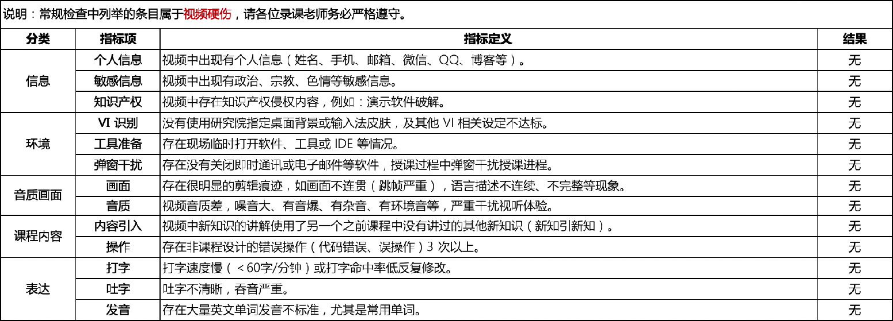
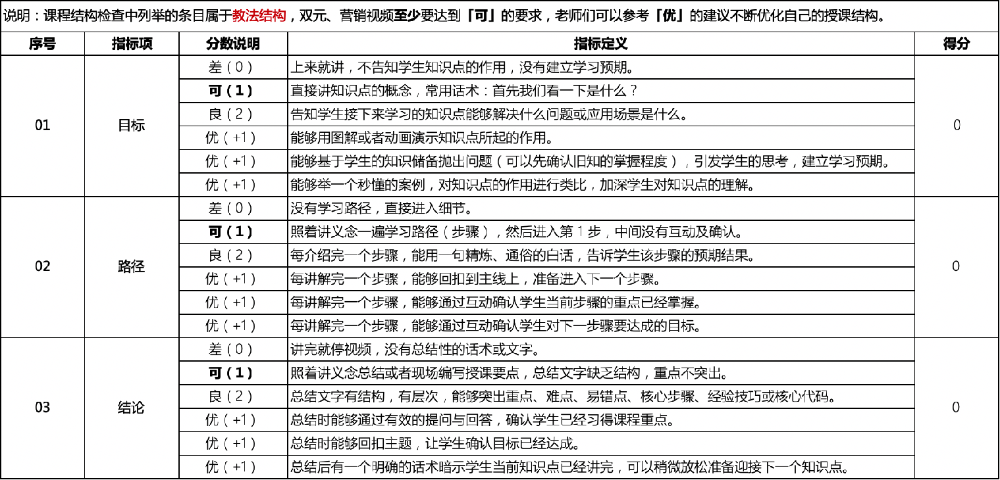
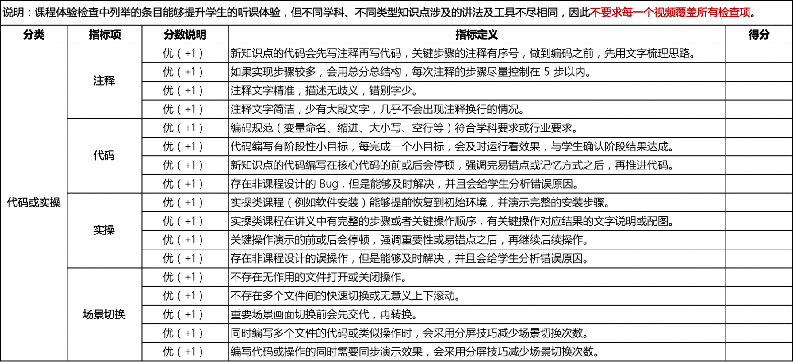
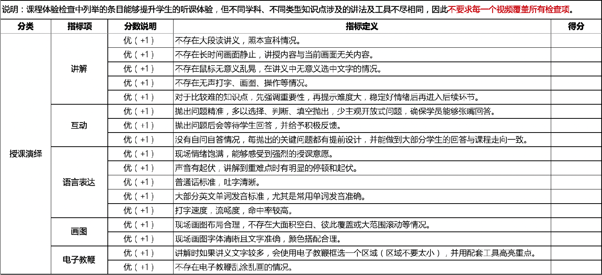
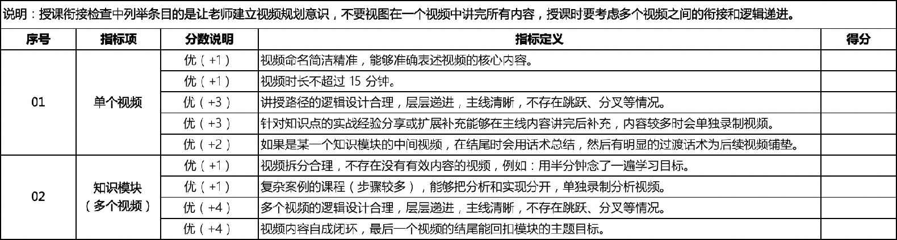
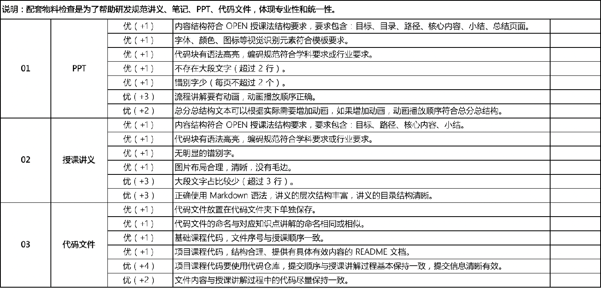

# OPEN授课法

## 1. OPEN授课法

### 1）概念

* Objective：目标（以终为始）

  具体要交付给学生的能力，学生可以用来解决具体的问题

* Path：路径（设计）

  基于学生既有的知识储备，设计的学习线路

* Experience：体验（细节）

  按照路径顺序授课，主线清晰，保证学习体验

* Note：落地结论（交付）

  交付给学生经过提炼的知识干货，降低复习难度，提高学习效率

### 2）基本套路

* Objective：目标（以终为始）
  * 同学们，老师先问大家一个问题……那咱们接下来要学习的内容就能够解决这个问题
  * 提示：用旧知引新知，基于学生知识储备抛出问题
* Path：路径（设计）
  * 好，要学习这个内容，咱们一共要 N 步
  * 第 1 步，咱们学习…啥…，大家能够…啥（一句简短白话）…
  * 第 2 步，咱们学习…啥…，大家能够…啥（一句简短白话）…
* Experience：体验（细节）
  * 好，咱们现在开始，首先来看第 1 步……
* Note：落地结论（交付）
  * 同学们，现在这个知识点讲完了，咱们先来看下目标达成没有？
  * 现在，咱们一起回顾一下这一小节的：重点、难点、易错点、核心步骤、核心代码（不必全都有，但是要互动）
  * 提示：特别简单的知识点可以用一句话概述（讲义 / PPT 中需要体现）
  * 刚才有同学问了一个非常好的问题，现在老师给大家补充一下……（经验分享放在最后，不会干扰授课主线）

**<u>刻意练习 = 方法 + 练习 + 反馈</u>**

## 2. 视频检查标准

* 常规要求（底线）：严格遵守
* 课程结构标准：好的结构是清晰的保障
* 授课体验标准：好的体验是传播的保障
* 课程衔接标准：更好的衔接会有更好的体验
* 配套物料标准：专业性和一致性的体现

### 1）常规要求

### 2）课程结构标准

### 3）授课体验标准

### 4）课程衔接标准

### 5）配套物料标准

