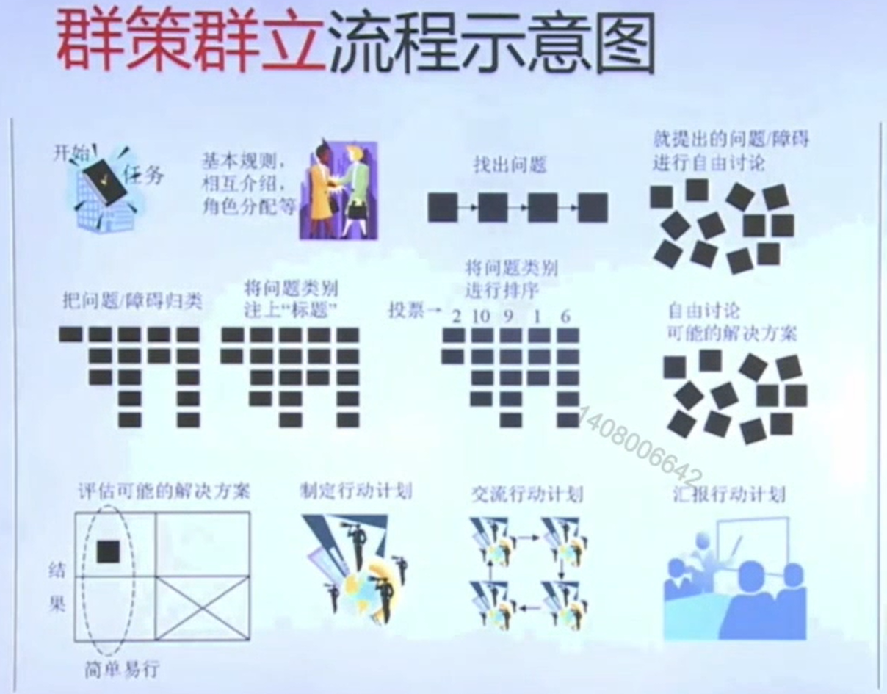
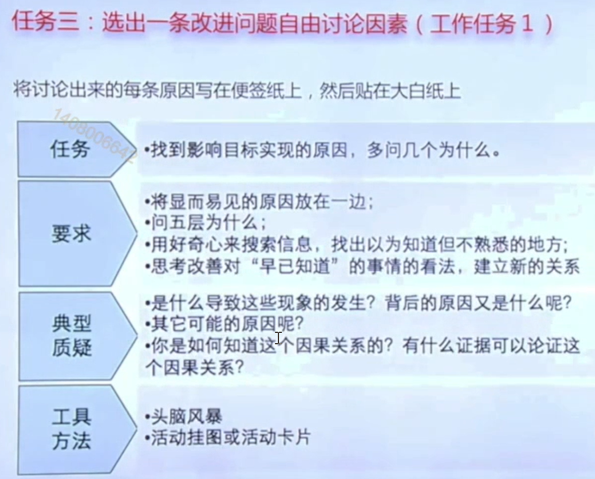
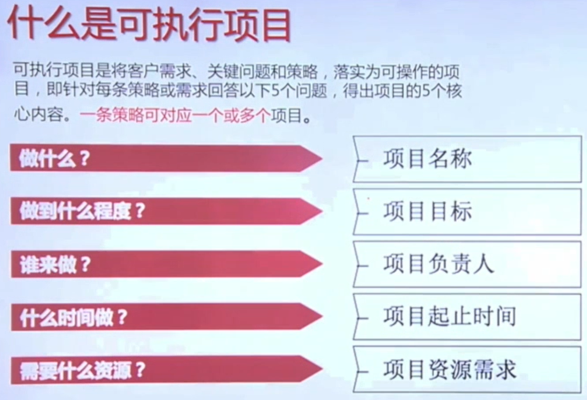
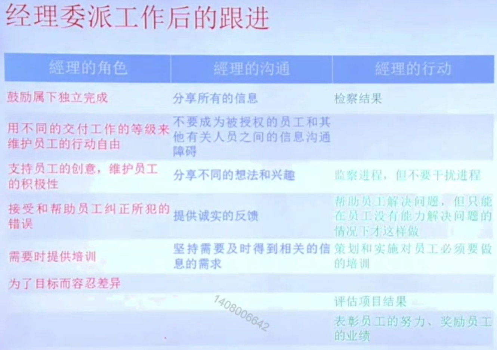

# 目标管理

## 1. 目标管理的五大模块

目标是个人、部门或整个组织所期望的成果，是希望达到的未来状态，即指你想要完成的事，它可能很庞大或渺小，也许是未来或就在尽在。

### 1）五大模块

#### 1. 目标敏感性

* 准确识别规划**关键目标**，避免没有方向和章法。
* 利用工具：OGSM
  * **<u>举例：</u>**做蛋糕，而不是粉蛋糕

#### 2. 目标转化

* **分解目标**，转为计划

* 工具：问题分析解决

#### 3. 解释目标

* 将组织目标与员工建立关系，让员工理解目标
* 途径：理顺人与目标的关系

#### 4. 目标调整

* 根据任务紧张、灵活调整目标
* 工具：计划**风险管控及预案**

#### 5. 共同目标

* 促进团队成员**目标一致**

* 工具：群策群力

  MBO不是用目标来控制下级，而是用来**激励下级**。

### 2）目标管理的三个共同

#### 1. 共同制定目标

共同确定目标、标准，选择行动方案

#### 2. 上下级之间共同反馈

下级完成工作任务，上级予以支持

#### 3. 共同控制

检查任务完成情况，进入下一个周期

### 3）如何指定目标

1. 从愿景触发
2. 穷尽需要具备的条件
3. 分析现状和障碍
4. 制定战略目标
5. 制定系统行动
6. 设定实施时间表

### 4）目标的层级

企业目标可以分为战略性目标，策略性目标以及方案、任务等。

* 高级管理者：经营战略目标和高级策略目标
* 中层管理者：中级目标
* 基层管理者：初级目标
* 基层职工：方案和任务

### 5）计划---事件结构模型

* **层层降级**

1. 总经理：系统目标
2. 总监：计划
3. 项目经理：项目
4. 任务经理：任务
5. 活动经理：活动

* **目标体系图**

1. 以总目标为核心，层层分解，展开
2. 自上而下分解，上下贯通，向上负责
3. 左右呼应，相互协调，融为一体

   **纵向目标体系：**上下层级关系，确保 上下连贯，向上负责

   **横向目标体系：**，平行阶层关系，确保 共同目标，左右呼应

## 2. 关键策略生成工具OGSM

### 1）基本概念

OGSM是指定策略计划的重要工具。

* 目的（Objectives）：要做什么事？--文字
* 目标（Goals）：做到什么数据就代表这件事成功？--数据
* 策略（Strategies）：怎么做？--文字
* 衡量（Measures）：衡量任务的数据标准？--数据

### 2）衡量策略

**OGSM是做什么和怎么做的关系**

### 3）OGSM层级的关系

### 4）举个栗子

### 5）小结

中层管理者要明确上级的OGSM和自己的OGSM

### 6）群策群力

用**群策群力**使上下目标认同

## 3. 从目标到计划,分步详解

设定目标与计划的过程就是问题分析和解决的过程。

### 1）因素条件分析

### 2）分析现实与障碍

满足的条件不用处理，将未满足的条件想办法满足

#### 举个栗子

目标：降低办公成本

使用结构树定位关键问题。

### 3）定义战略目标

* 具体的（S）
* 可衡量的（M）
* 富有挑战的行动（A）
* 结果导向（R）
* 时间界限（T）

#### 1. 子任务目标的确定

#### 2. 填写OGSM表格

### 4）讨论行动方案

#### 1. 聚焦重要原因

#### 2. 筛选关键问题

#### 3. 定位可控和不可控原因

​     聚焦可控的原因

#### 4. 把原因逻辑化、系统化

#### 5. 鱼骨图

鱼骨图进行原因分解

#### 6. 把原因转换为子目标

#### 7. 构思

头脑风暴构思可能的解决方案

#### 8. 立项

项目是计划的集合

### 5）立项

#### 1. 可执行的项目

#### 2. 项目的五大目标

#### 3. 项目、任务、活动之间的区别

#### 4. 立项指南

##### 1）项目编号

##### 2）项目名称

##### 3）项目经理

明确项目负责人

##### 4）项目目标

##### 5）项目工作范围

##### 6）项目起止时间

##### 7）项目预算

##### 8）项目需求

##### 9）项目备注

##### 10）项目汇总表

## 4. 工作委派与跟进

### 1）四个《了然于胸》

给下属委派工作的四个《了然于胸》

1. 部署对目标、计划流程、岗位职责了然于胸
2. 操作规则、行为规则了然于胸
3. 对困难和克服困难条件了然于胸
4. 执行成败和利弊得失了然于胸

### 2）五个步骤

委派任务的准备表格

### 3）任务跟进

