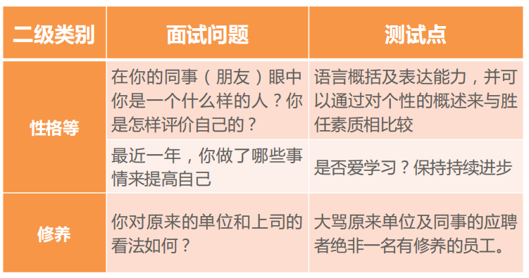
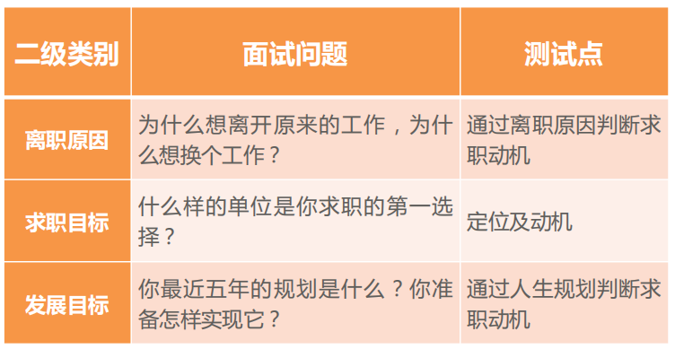
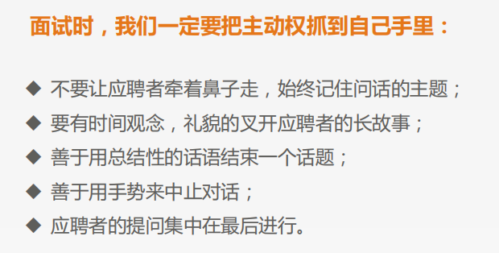

# 陈文-招牛人

## 1. 为何招牛人

公司对人才的要求越来越高，要达到公司战略目的，就必须依赖高质量的人才。

一统江湖-》影响IT行业-》影响中国教育。

## 2. 什么是牛人

* 流程设立初心是因为当前招聘存在的一些问题
  1. 无统一规范
  2. 试用期离职
  3. 培养周期长
  4. 人才需求变化，需要不仅仅把课程讲好的老师，需要的是能够设计课程、解决方案的老师

* 牛人画像
  * 文化价值观：充满正能量，乐于分享
  * 入职意愿：极高的加入传智播客意愿
  * 自驱力：未停止过学习，爱好广泛且深入，具备极强的求知欲
  * 抗压能力：有效控制自己的压力，能够通过各种方式有效缓解压力
  * 专业程度：大型项目的组织与主导研发能力
  * 形象气质：极具个人魅力，形象端正，接人待物有礼貌

* 招聘流程
  * 简历筛选：根据牛人画像进行简历筛选。
  * 初面：技术面试、入职意愿等。
  * 试讲：邀约候选人进行现场试讲，很多候选人因为录制视频就不来了。
  * 终面：校长和执委进行终面；价值观、技术层面等更好的把关。

* 灵魂三问

  选人和培养人那个更重要？选人更重要！

  * **<u>举个例子：</u>**
    1. 卫哲：70%选人+30%培养
    2. 贺叶铭和李晨老师组建UI学科很容易。

## 3. 如何找到牛人

* 常规渠道的小技巧
  * 设置与职位有关联的技术、年龄、户口算在地关键字
* 优质渠道的使用技巧
  * github/CSDN
  * 和牛人搭讪，从技术层面切入到工作，兼职等
  * 线下技术峰会

## 4. 如何吸引牛人

* 个人发展

  一线城市发展遇到瓶颈，回到二线城市发展

* 工作与生活

  个人要回到二线城市定居

* 薪酬待遇

  在二线城市传智的待遇还是比较有优势

* 谈事业

  为千万人少走弯路而著书，为中华软件崛起而讲课

  课程深入，项目深度挖掘

  课程标准

  解决方案

  开源项目

  纯粹做技术

  传智专修学院

## 5. 如何发挥牛人价值

* 入职前对入职充满期待
  * **充分了解牛人：**明确选手优势和**意愿**是什么
  * **提前规划：**规划好入职初期的工作
  * **谈透：**与牛人达成一致目标，谈透！
* 入职后对现实满意，对未来期待
  * **明确目标：**目标工作目标，聚焦于部门组织绩效。
  * **过程跟踪：**随时激励，定期跟踪复盘工作完成情况，树立牛人成就感。
  * **有挑战性工作：**适当安排有挑战性的工作，让牛人对未来可期。
  * **人文关怀：**员工关怀，关心牛人的融入，大咖见面会。

## 6. 招聘小故事

* 发动自己朋友圈
* 锁定牛人，要简历
* 约定面谈机会
* 牛人入职任何一个校区都是值得的

# 秦宁-招聘技巧

面试人人都在演戏

面试不能通过感觉，要靠合理的判断

招聘面试是技术活

## 1.1 面试概述

### 1）面试的定义和目的

“百闻不如一见”，通过面试做出的判断最直观。

面试是一个双方彼此考量和认知的过程。

### 2）面试的过去与未来

1. 面试形式丰富多样
2. 结构化面试成为面试的主流
3. 提问的弹性化
4. 面试测评的内容不断扩展
5. 面试考官的专业化
6. 面试的理论与方法不断发展

### 3）面试的类别和概述

* 经验面试：提问面试者一些过去的经验。
* 情景面试：给定一个场景，看面试者在特定场景中的反应。

### 4）面试官的素质要求

面试不能凭感觉，要具备一定的面试技能和技巧：

1. 较为丰富的工作经验和人生阅历
2. 掌握面试知识和技能、熟悉面试实施流程
3. 熟知待招聘岗位的岗位职责，熟悉公司的企业文化和制度
4. 亲和、友善、坦诚、公正、良好的沟通能力和敏锐的判断能力
5. 自信、稳定的情绪，拥有驾驶面试过程的时间和控制能力
6. 拥有爱才惜才之心，能够深入挖掘应聘者的价值，让面试者充分自我展示

灵魂三问：

1. 他是不是比我強
2. 如果他去了其他公司我会不会惋惜
3. 公司的业务会不会因为他变得更好

## 1.2 面试的误区与原则

### 1）面试的误区

1. **疏于准备，仓促上阵**

   不了解岗位要求的面试官只能选出他/她自己认为合适的人，而不是真正适合招聘岗位的人

2. **跟着感觉走，不够专业**

   提问缺乏专业性、针对性，没有做任何面试记录

3. **角色模糊**

   面试官自己说的太多

4. **不能够以平等的心态对待求职者**

   面试官代表公司的品牌形象，要注重面试过程中的仪容仪表形象。

5. **“想我”的偏见**

   倾向于过高评价与自己相似的人

6. **反弹效应**

   倾向于找一个与过去不满意的人特点相反；或寻找一个与过去满意的人的特点完全一致的人。

7. **晕轮效应**

   认知判断首先是根据个人的好恶得出的。

8. **以貌取人**

9. **草草决策，轻易承诺**

10. **过分依赖他方推荐**

11. **寻找超人**

    要求太高，不切实际。

面试一个人的成本是798元，要珍惜每次面试机会。

### 2）面试的原则

1. **要充分尊重面试者**
2. **准时开始，规范操作**
3. **营造融洽的氛围**
4. **不可离开面试主题**
5. **面试要专心**
6. **要重视价值观的挖掘**
7. **不要过早谈论薪酬**
8. **结束时感谢和鼓励**

## 1.3 面试测试问题与原理

### 1）专业知识

### 2）专业技能

### 3）通用能力

### 4）个性特征

### 5）求职动机

### 6）态度/价值观

### 7）综合问题

## 1.4 面试的过程与技巧

### 1）面试前

#### 1. 仔细研读简历

#### 2. 准备好面试题

### 2）面试中

#### 1. 破冰

#### 2. 问题要少而精

面试过程中短短的几十分钟不可能把一个人全部的能力考察到位，应该针对关键能力进行提问。

#### 3. 关键问题要深挖

面试时，如果仅仅对一些问题泛泛的了解，是不能真正判断应聘者是否拥有相关的技能和经验的。

#### 3. 不要对面试者有任何的假设

不要对面试者有任何假设，包括简历上的信息。唯一的假设就是对方不合格。

#### 4. 面试倾听的技巧

#### 5. 如何识别虚假信息

#### 6. 面试控制技巧

### 3）面试后

1. **招牛人课后实战：**找一名老师现场面试演练学习成果，评委组参与打分，未来2周内完成。
2. **目标管理课程预习：**1个小时预习视频，预计在19号晚20：00完成。
3. **月度PK预告：**提炼深圳、郑州、合肥、西安4个校区的共性问题，团队共同讨论制定方案，4月24号PK。
   * 提示1：机会差距举例（本地市场排名第三，如何做到第一？）
   * 提示2：业务差距举例（流失率是15%，如何做到7%？）

---

* 前两个任务可以自行完成，成员间保持随时沟通。

* 第三个任务需要区总**付东老师**、领教**李晨老师**连同**4个校区**一起**协作完成**，下周我会和相关老师协商一个时间线上开会讨论。

  基本思路分为3个步骤：

  **第一步：**4个校区自行准备各自问题，开会确定（锁定）团队共性问题。

  **第二步：**区总、领教、导师针对共性问题进行指导，并给出思路框架，团队6名成员进行方案细化。

  **第三步：**团队成员进行方案预演演讲，区总、领教、导师一起参与评审，最终确定一名代表PK。