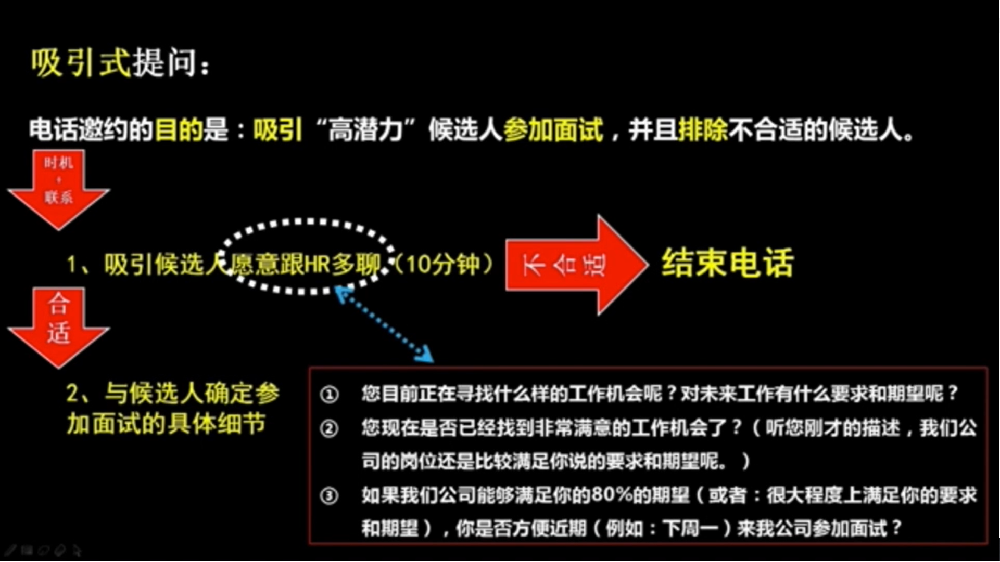
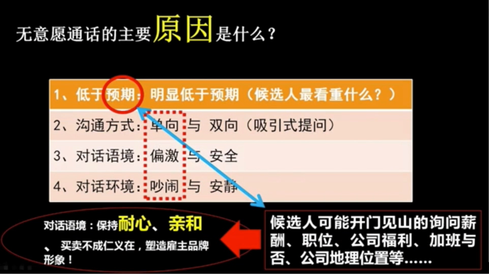
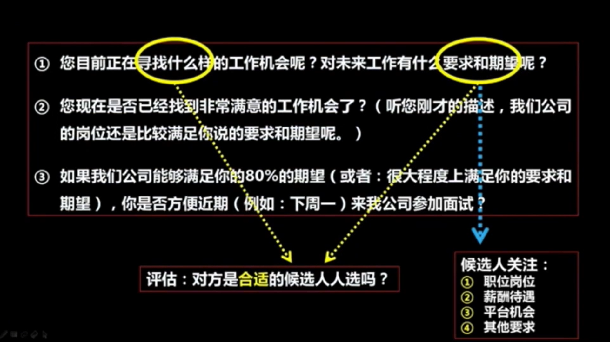
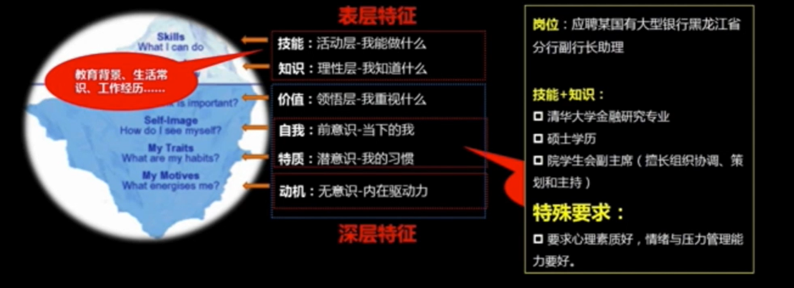
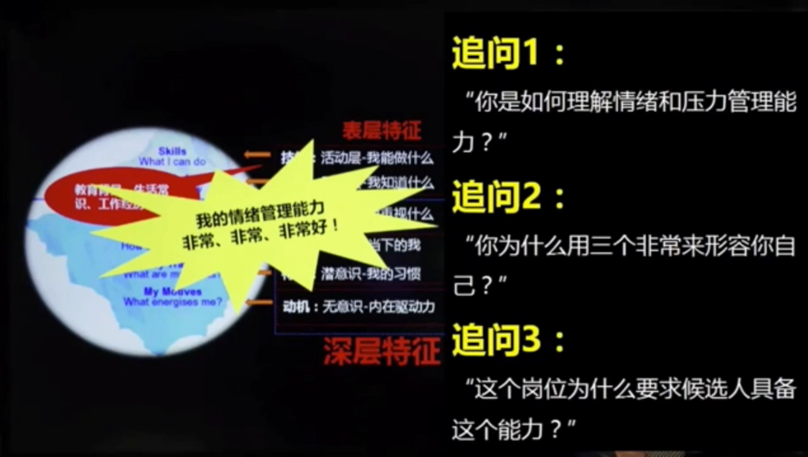
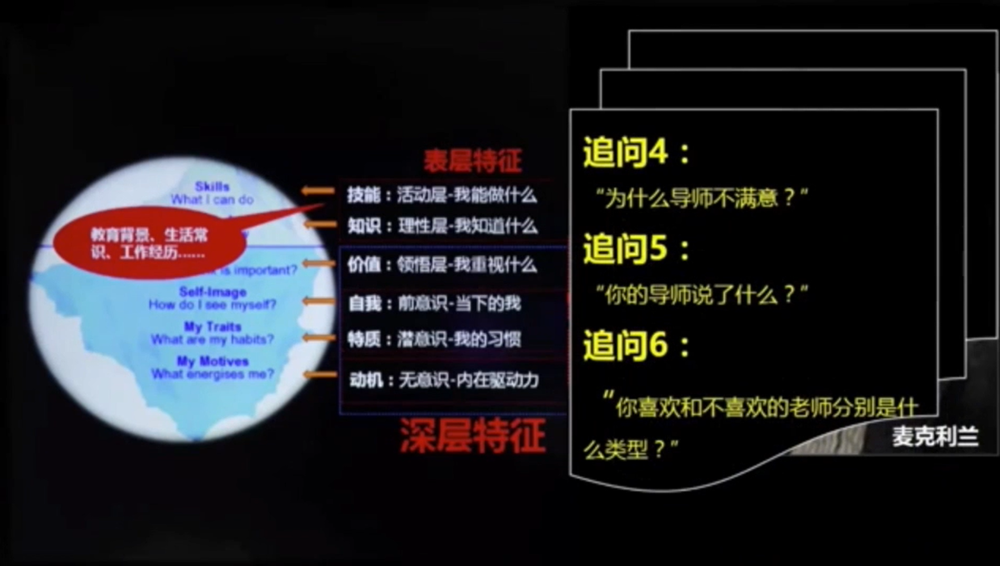

# 如何面试

## 1. 识人选才开场

* 企业高层对企业招人越来越重视
* 适才不准会给企业带来很大的管理成本；例如：离职率很高、绩效不稳定、用人部门领导不满意等

## 2. 电话邀约面试

### 2.1 电话邀约的目的

吸引“高潜力”候选人**参加面试**，并且**排除**不合适的候选人。

### 2.2 电话邀约的技巧

####1）分析无意愿的原因

####2）沟通技巧

要用销售的思维来进行电话邀约

* 需求：一般找工作意愿都具备
* 意愿：激发意愿
* 信任：建立信任
* 时间：争取时间（框定时间，让面试者选择）

### 2.3 电话要求的质量

吸引式提问

## 3. 行为面试

### 3.1 第一章节

* 性格冰山模型：水面上（20%）+水面下（80%） 

* 银行高管助理案例面试问题参考

行为面试就是对面试者以前的经历进行精准提问（**<u>时间、地点、人物<任务>，起因、经过、结果</u>**），以此来判断面试者的综合素质。

**<u>追问5</u>**就是典型的行为面试

**<u>追问6</u>**就是在判断面试官喜欢什么样的领导

**<u>胡博案例</u>**

* 胡博不善于倾听
* 胡博所问非所答（是故意的还是确实没听明白）
* 胡博的语言表达缺乏逻辑和严谨性，缺乏逻辑和严谨的思维方式如何可以胜任副总裁职位呢？

### 3.2 第二章节

* 调研工作场景--》分析工作任务--》得出关键能力
* 针对关键能力进行精准提问，通过面试者以往的经历来推理他是否能够胜任应聘的岗位

###3.3 行为面试总结

1）什么是行为面试，为什么使用行为面试？

​      行为面试就是通过面试者以往的经历来推理判断他是否符合应聘岗位的要求

2）如何恰到好处的使用行为面试？（精准提问）

1. 通过面试者的工作场景和工作任务，得出（提炼）面试者应该具备的关键能力
2. 针对关键能力进行精准提问，时间、地点、人物（任务），起因、经过、结果
3. 针对面试者的举例过程，要挖掘细节

3）行为面试的注意事项

1. 不要提示性提问
2. 不要假设性提问
3. 在面试者举例过程中，挖掘细节（时间、地点、人物（任务），起因、经过、结果）

## 4. 素质面试

###4.1 执行力

1. 初级执行力：**<u>快速行动</u>**，让做什么就做什么，**快速响应**；通过过期面包案例来判断候选人理解任务、提取关键信息能力。
2. 中级执行力：**<u>作对事情</u>**，一定**听**清楚要求，**明确目标**，作对事情；通过<下周三下午上班之前把审计报告交给我>案例，判断候选人倾听任务的能力是否达标。和领导确认目标，保证目标没有偏差，并且再和领导沟通下任务的注意事项，这样才能确保执行结果的价值。
3. 高级执行力：**<u>做好事情</u>**，**熟悉领导**的管理风格，准确理解和分析工作任务，举一反三，高效做事。通过准问<那你打算怎么做呢？>来了解候选人的做事方式。

###4.2 责任心

1. 责任意识：认识到自己分内应做之事。
2. 责任心/感：一种自觉主动地做到分内和分外一切有益事情的精神状态。

**<u>面试提问：</u>**

1. 说说你对这份工作的理解吧？
2. 做好这份工作需要具备什么特质？
3. 你打算如何做好这份工作？举例说明......
4. 给我们一个选择你的理由。（行为承诺？态度承诺？关键词？核心特质？）

面试过程中重点要考察候选人有没有责任意识。

### 4.3 学习能力

**学习能力体现为以下3点：**

1. 态度
2. 方法
3. 意愿

好学≠成绩

好学≠学历

**好学的人具备如下特质：**

1. 具备良好的阅读习惯。
2. 对工作或者学习有较高要求或者追求（职业紧迫感）。
3. 保持对未知事物的兴趣与爱好（态度和意愿），举例：6岁儿童和60岁老师学习（电子产品）能力差异。

**关键行为：**

1. 眼神关注
2. 耐心倾听
3. 准确记忆
4. 不耻下问

**技巧:**

现场试探性的教授候选人一项工作技能或者知识，观察对方的反应...

###4.4 毅力与坚持

毅力：延迟满足，同义词自律。延迟满足是成功的关键因素。

**毅力的行为表现：**

1. **专注：**专一做事，不受干扰
2. **习惯：**准时、守时的生活和工作习惯，自律性
3. **不惧困难：**往往在他人感到困难时，反而更加坚持和执着
4. **个人规划：**目标感+未来规划+客观的自我评价

### 4.5 积极主动

**主动的行为表现：**

1. 时间观念：准时或守时的习惯
2. 紧迫意识：对自己的职业发展有紧迫感和危机意识
3. 学习习惯：经常性、主动的参与学习的意愿较高。多为“为什么”！
4. 个人规划：目标感+未来规划+客观

**技巧：**

1. XXX你好，请问你是怎么理解积极主动？
2. XXX你好，请问你是否具备积极主动的品质？
3. XXX你好，你能够举三个例子说明下你具有积极主动的意识？

## 5. 压力面试

###5.1 目的

1. 考察候选人的心里素质是否过硬
2. 情绪和压力管理能力是否好
3. 抗压能力是否强

### 5.2 技巧

不能采用散打，找到一个短板和不足，找毛病、挑剔、挑刺儿，通过不断追问考察候选人的反应。

**一般人面对压力的反应**

* <u>消息反应：</u>
  1. 反抗
  2. 逃跑
  3. 木讷
* <u>消极反应</u>
  1. 情绪稳定
  2. 情绪互动
  3. 理性思考
  4. 对事不对人

### 5.3 注意事项

1. 针对不同的岗位适用压力面试。销售、客服，高管秘书等和人打交道的岗位
2. 压力面试最好在面试的后半段
3. 压力面试的时间不宜过长，10-15分钟
4. 找准一个点不断追问，具体化针对某个细节或者敏感问题追问
5. 一旦候选人表现出压力下的消极反应，立刻结束压力面试

### 5.4 实例

压力面试提问问题（销售岗位）：

1. 如果A候选人和你一样具备同样的特质，但是A候选人有XXX经验而你没有，那我用你还是用他？
2. 如果A候选人和你一样具备同样的特质，但是A候选人有XXX经验而你没有，那我用你还是用他？
3. 如果A候选人和你一样具备同样的特质，但是A候选人有XXX经验而你没有，那我用你还是用他？

**候选人用微笑来伪装自己，怎么识别？**

面试官的情绪和表情要适当变化，让候选人捉摸不定，这样候选人便不好伪装自己。

