# 向下管理

## 人物背景

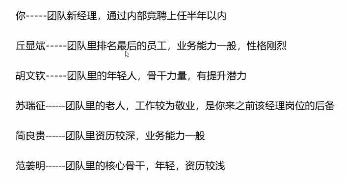

## 场景介绍

### 1.如何面对下属的而与是非 

#### - 打小报告

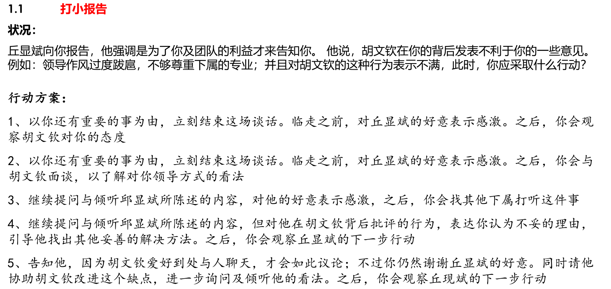

* 要==不动声色==的完整了解事情经过，以免上当被别人当做炮灰。做到不听来听、不察来察
* 纠正打小报告的行为，但是也不宜把“被告”当做离间的对象，直接向“被告”询问，这容易影响对方的情绪
* 不要大招旗鼓向其他同事打听此事，避免小报告的扩散流行，以免造成不良的影响
* 宁信其无，不信其有
* ==不要拉着两个人，当面对质。==

<u>==正确答案：5==</u>

#### - 调查真相

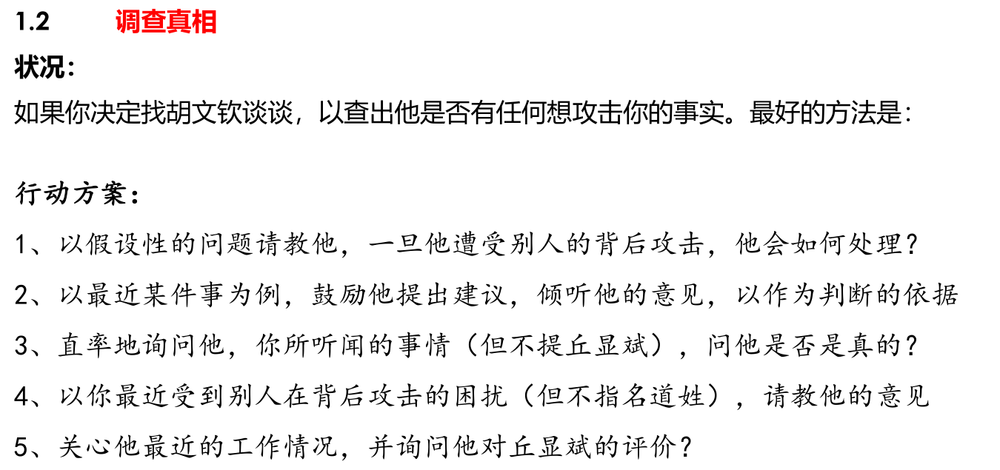

<u>==正确答案：2==</u>

*  沟通先从讨论事情出发，通过事情了解情况，解决事情容易，解决人的性格就难了

#### - 强烈反击

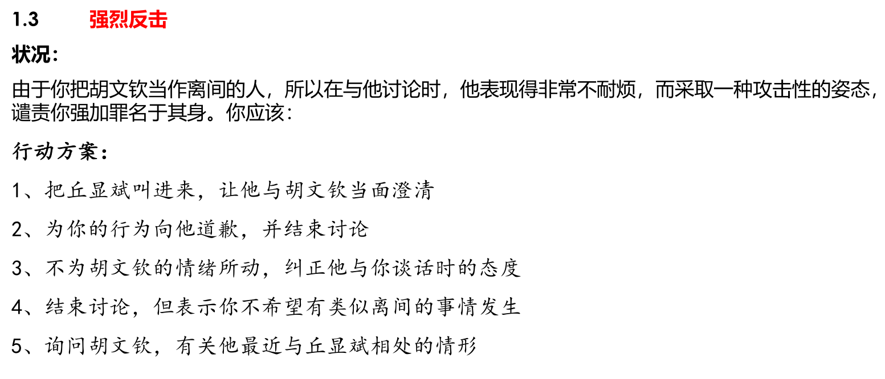

==<u>正确答案：2</u>==

* 如果对“被告”的离间行为没有把握，而造成对方情绪激动，此时道歉的成本是最低的。

### 2. 如何处理下属的过失行为

#### - 重大过失

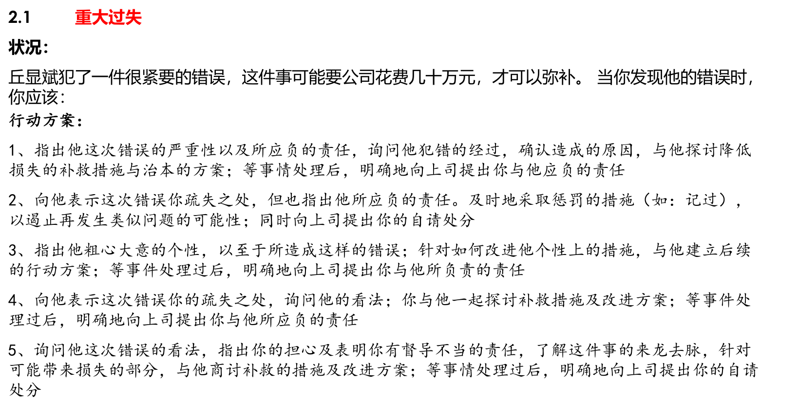

==<u>正确答案：5</u>==

* 对于一个粗心、刚愎自用的人事故原因的分析比事故影响的分析要适用
* 如果一味地要他承担责任，可能会让他一蹶不振或者其他的极端出现
* 事故原因的分析会增加他的信任，让他体会到上级的关怀，也能意识到自己粗心大意造成的严重后果
* 分析事故原因，最好让下属自己说清楚
* 叱责放在分析原因的后面
* 避免自己先动怒
* 避免翻旧账，对事不对人
* 与下属一起设法弥补过失，有锅一起扛
* 给下属良性的教训与惩罚，保持下属自尊

**重大过失解决思路：**

1. 了解情况、现状
2. 找原因
3. 想对策实施补救
4. 确认最终结果
5. 分清责任
6. 处理处罚
7. 完善和建立制度
8. 密切监控

#### - 屡劝不听

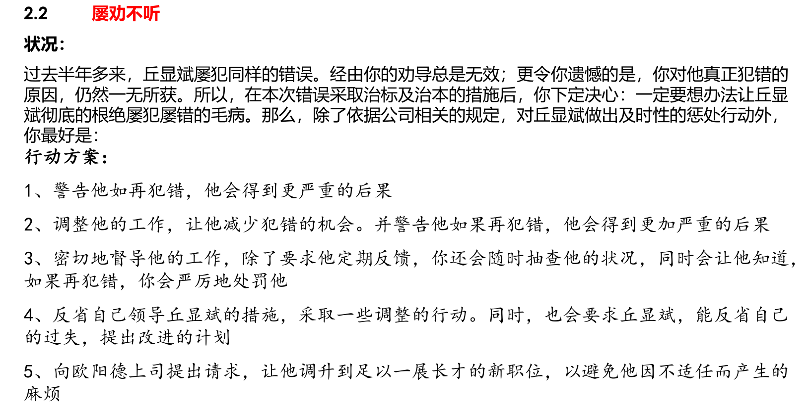

==<u>正确答案：1</u>==

* 对于百般劝导屡教不改的人，以前那些“软政策”可能是徒劳的
* 此时，应当浇浇冷水，让他意识到事情的严重性
* 这也可以塑造领导者的权威

**初犯时，运用【三明治】技巧：**

1. 肯定对方
2. 指出一、两点错误
3. 询问对方的改进之道
4. 给予支持

**累犯时，运用【汉堡】技巧：**

1. 表示对问题的关切
2. 指出改进要求
3. 令对方知道可能的后果
4. 密切监督
5. 再犯时，给予严惩或人资处置

==心要慈、刀要快。==

#### - 对症下药

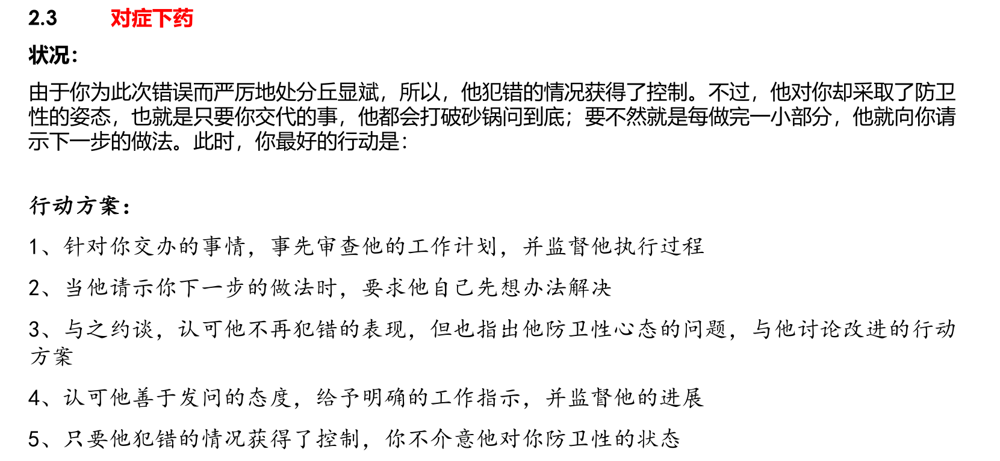

==正确答案：1==

* 绩效问题：==先分析，在解决==
* 交代的事情，下属采取防卫型的姿态，其实就是不愿因承担事情后果
* 让下属在行动事前审查他的工作计划，逼他做好充分的考虑后再行动

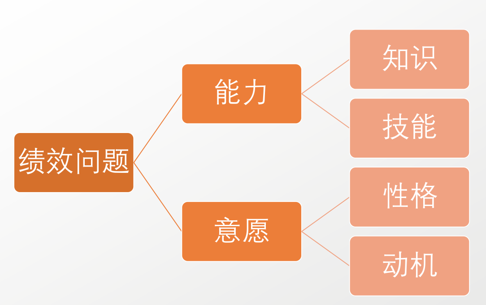

### 3. 如何处理下属的特别请求

#### - 特别请求

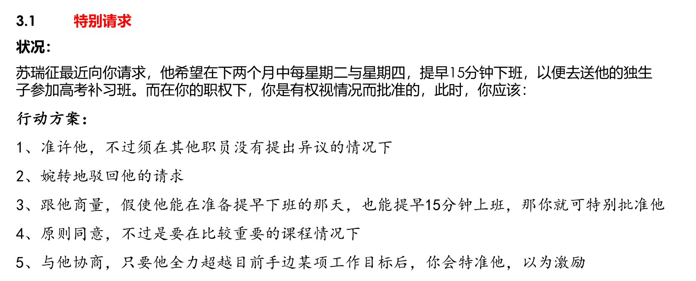

==正确答案：2==

* 要为一个人、一件事破例，要谨慎为之
  * 特殊吗？
  * 偶发吗？
  * 别无他法吗？

#### - 随后跟进

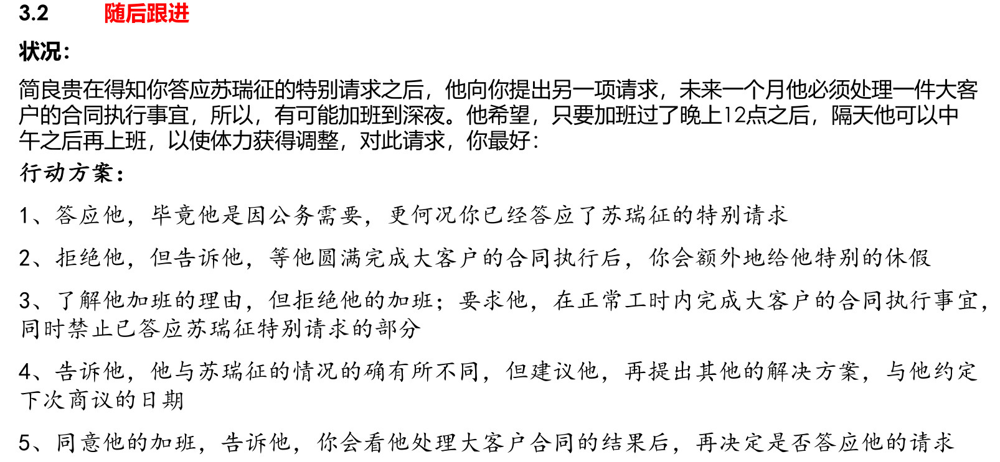

==正确答案：3==

* 了解特殊请求的原因，但是予以婉转的拒绝
* 及时止损

#### - 引发抗议

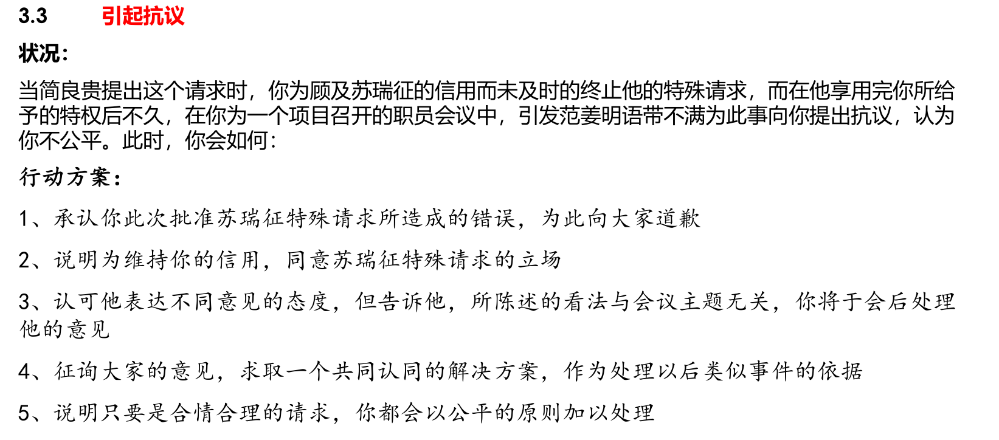

==正确答案：1==

* 为之前的错误决定而向大家道歉，及时止损。

### 4. 如何处理下属请调其他部门

#### - 请调部门

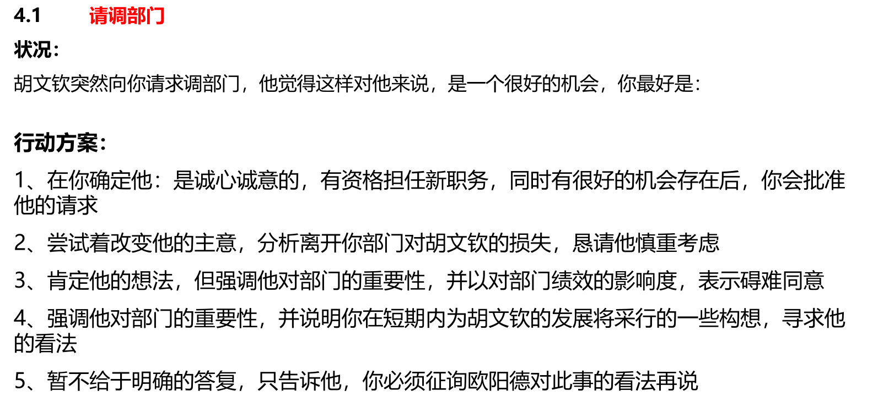

==正确答案：1==

* 让下属分析清楚，并了解原因。
* 下属如果去意已决，让他去不必刁难
* 就算让他去，也不能造成有没有也无所谓的感觉
* 留不留得住，全在下属的心
* 站在朋友的立场做两面的分析
* 留人不在此时，而在平时

**留住爱将的5个步骤：**

1. 原则上同意
2. 掌握去向
3. 争取咨询的角色
4. 避重就轻
5. 祝你幸福

#### - 工作低落

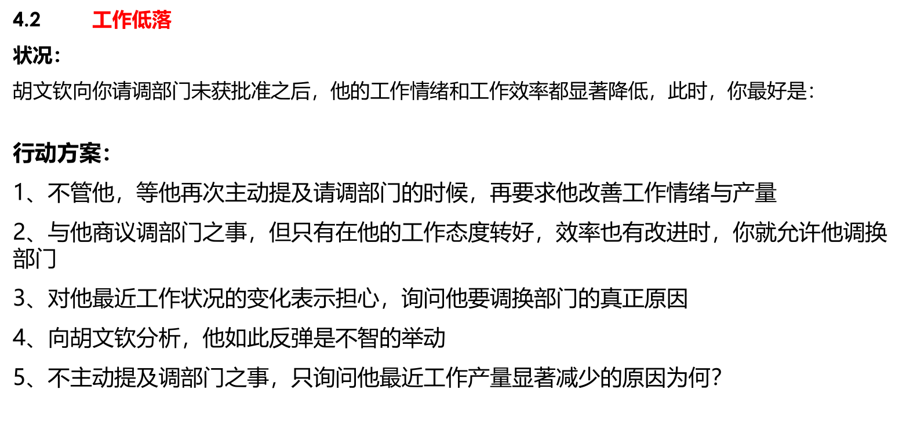

==**正确答案：5**==

* 以事情为切入点，已解决事情为目的
* 即时你知道某件事是由性格或态度引起，也要学会“明知故问”

#### - 上司垂询

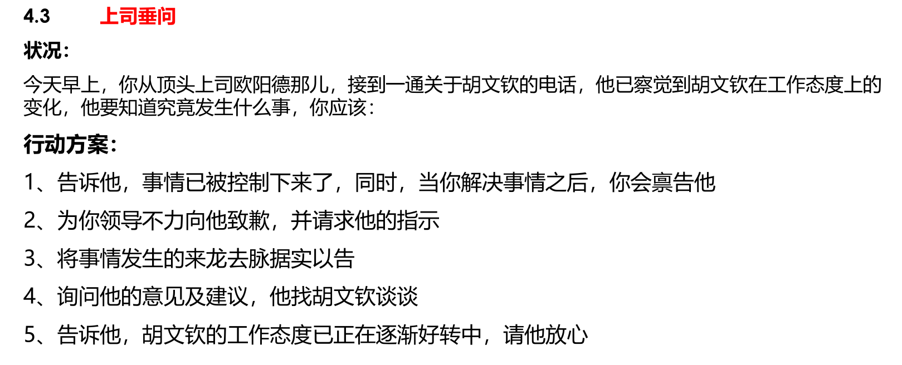

==正确答案：3-》1-》5==

* 上司询问，首先据实向告
* 其次，再说出你的处理方案和结果

### 5. 如何执行一项新政策

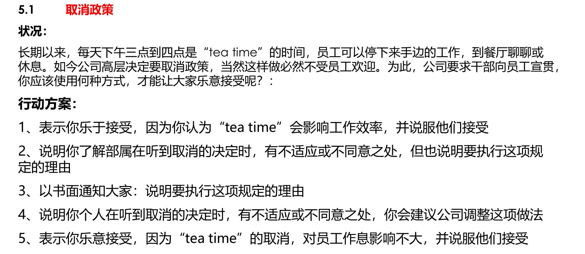

==正确答案：2==

* 你不是传声筒，也不是应声虫
* 不必假装非常乐意，适当表达个人感受
* 个人与工作角色分清楚
* 因为不受员工欢迎，才让你执行
* 说明公司政策的出发点和考虑面
* 有技巧的传达上、下的意见
* 透过你至少【不满意但可以接受】；不透过你可能【不满意且不接受】，所以你的圆通获取了圆满

#### - 耽误工作

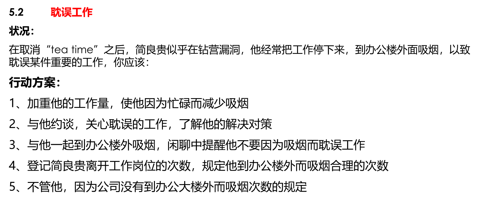

==正确答案：2==

* 如果沟通的目的是想说服对方或改变对方，必须先创造一个有助于双方了解的空间，事实上充分地了解，往往解决了大半的问题。
  * ==多谈==
    * 工作绩效
    * 进度
    * 质量
    * 标准
    * 纪律
  * ==少谈==
    * 态度
    * 动机
    * 价值观

#### - 抗议事件

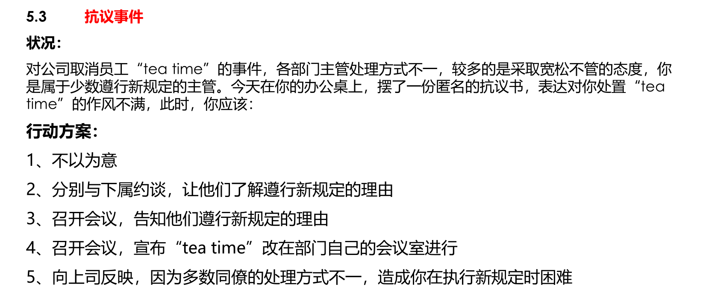

==正确答案：1==

* 部门执行的差异，领导是能够看得到的
* 以不动制动，先观察再做下一步打算

### 6. 如何处理下属扭曲政策的本意

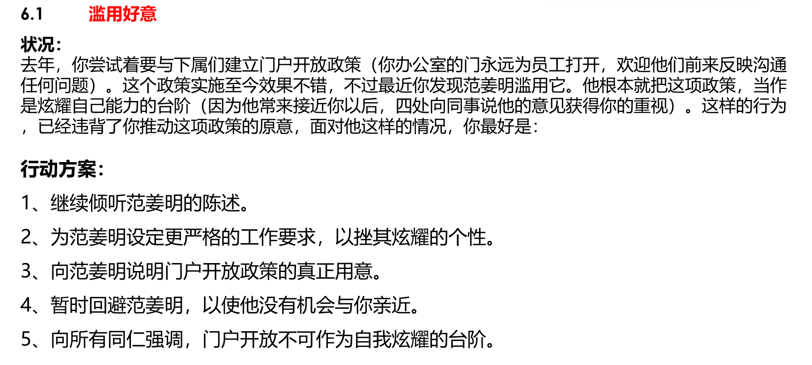

==正确答案：3==

* 让下属了解指定政策的原因
* 如果下属明知故犯，立刻加以制止
* 使政策真正的绩效能够彰显
* 沟通、沟通、在沟通。

#### - 态度异常

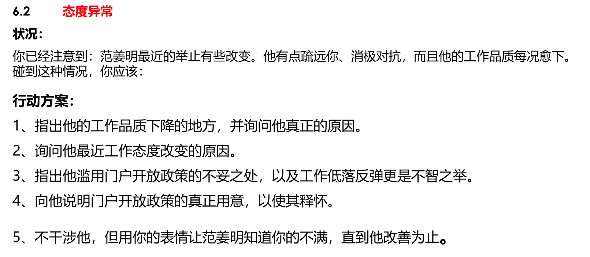

==正确答案：1==

* 就事论事，以具体的事情来解决问题，始终坚持这个原则。

#### - 越级报告

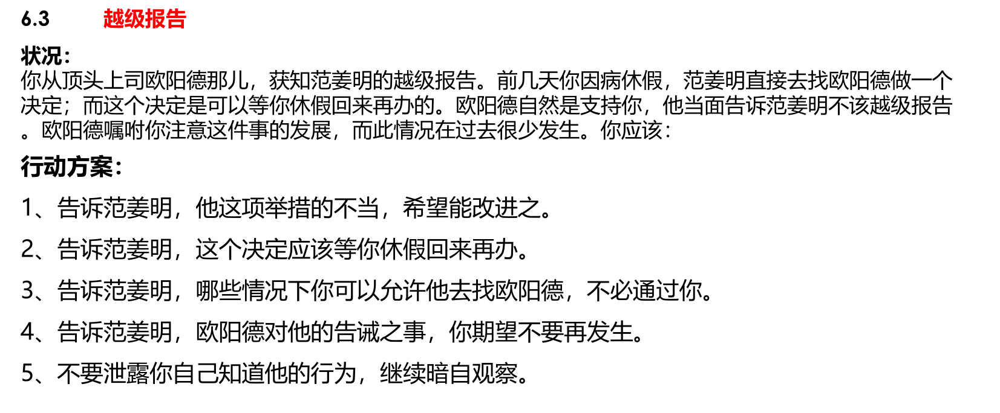

==正确答案：5==

* 如果一件事情如果属于下面的几种情况，就可以==暂时不管==
  * 这件事发生的频率少
  * 这件事没有严重的后果
  * 这件事看起来很复杂
  * 到目前为止，所有的方法都不好

### 7. 如何处理新旧人员的冲突问题

#### - 新人流动

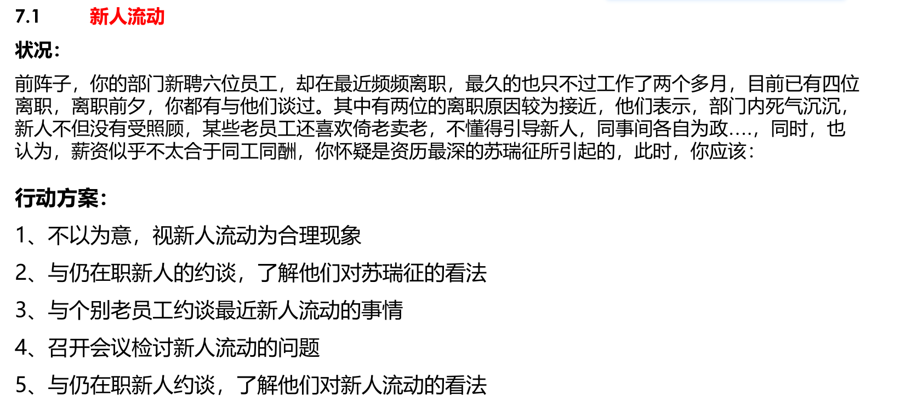

==正确答案：1==

* 了解主要症结所在
* 加强新人辅导
* 注意老人的心态
* 凸显资深员工的贡献
* 使资深员工参与新人辅导

#### - 矢口否认

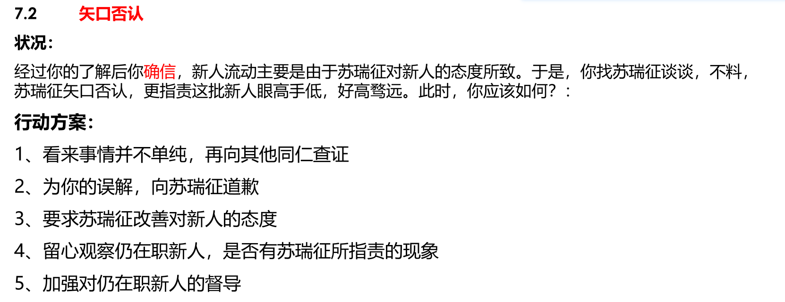

==正确答案：3==

* 新老员工的冲突的原因如果已经有定论，那就直接处理，制止不当的行为。

#### - 没有改进

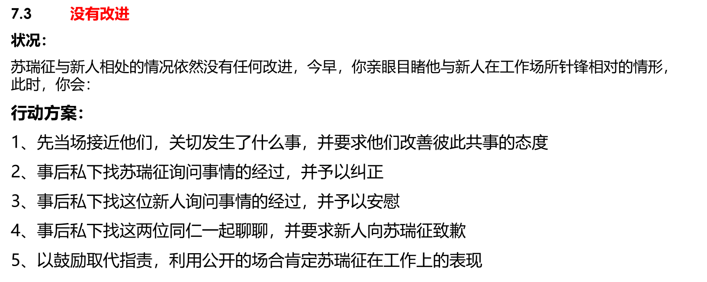

==正确答案：1==

* **当场解决老员工和新员工的冲突时**
  * 站的离老员工近一些，以示对老员工的尊重
  * 由新员工先描述情况
  * 各大50大板，但现指出新员工的过错，再指出老员工的过错

### 8. 如何面对员工热心爱好而忽略工作

#### - 热爱篮球

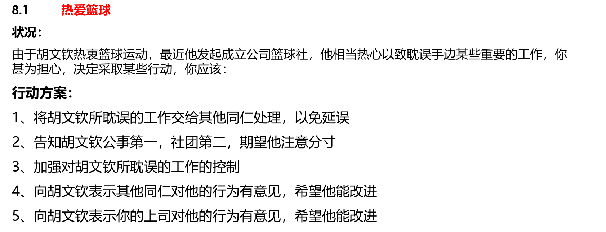

==正确答案：3==

* 以工作结果为观点
* 与员工共同寻求解决方案
* 确定做事分寸与原则
* 关心员工的嗜好
* 同理心对待

#### - 相互谅解

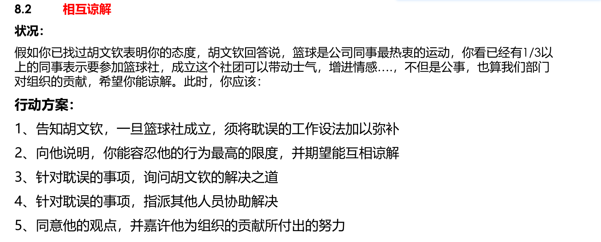

==正确答案：3==

* 就事论事，让当事人提前考虑如果问题发生应该怎么处理

#### - 变本加厉

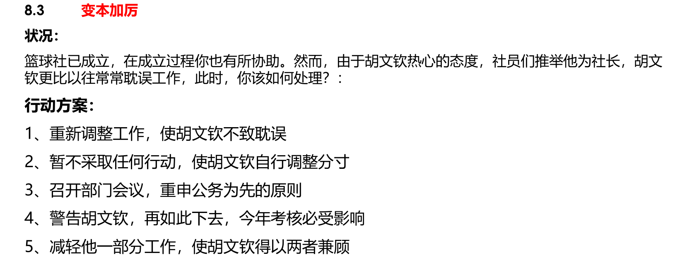

==正确答案：4==

**异常行为管理的6个步骤：**

1. 指出担心的事实
2. 表明领导的疏忽
3. 引导原因的探讨
4. 协商解决问题
5. 指定预期的目标
6. 约定追踪日期

### 9. 如何处理下属培育发展的问题

#### - 改善关系

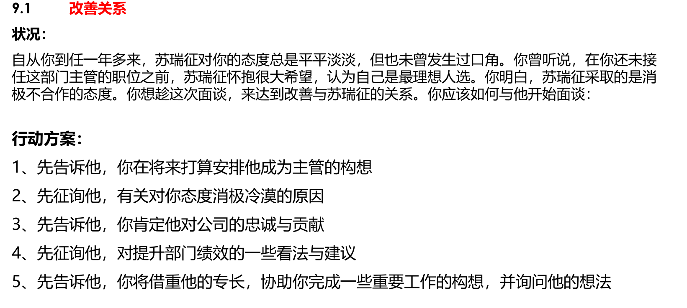

==正确答案：3==

* N型表达

  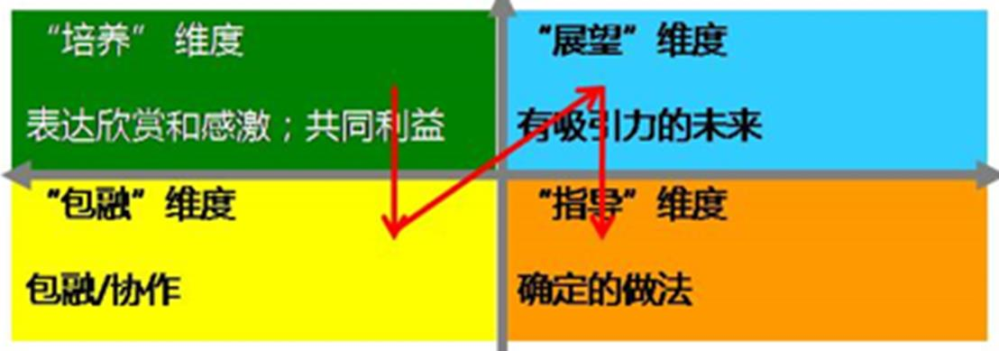

* 不预存任何成见或想法
* 态度诚恳，以倾听的方式面对
* 征询员工的看法
* 肯定对方的贡献，不必吝啬赞赏与认可
* 如果自己有不对的，先说出来，以表现风度
* 握手释前嫌
* 多说【我们】，少说【我】

#### - 大好机会

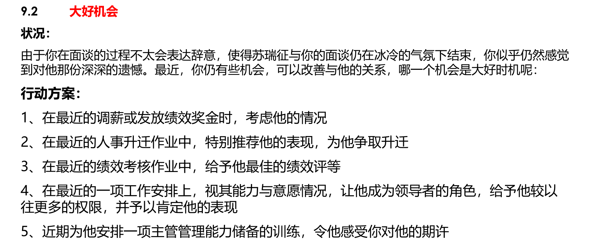

==正确答案：4==

* 有能力的员工，他们其实往往想得到的是展示自我的机会

#### - 新的挑战

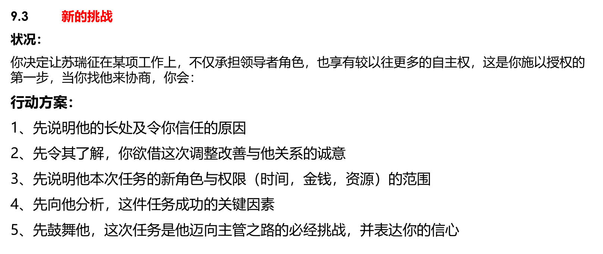

==正确答案：1==

* 授权的6个步骤
  1. 表达信任
  2. 说明目标
  3. 给予权限
  4. 征询想法
  5. 提供协助
  6. 监督核查

* 授权不是做甩手掌柜
* 授权更不是只有责任，没有权限

### 10. 如何面对固执己见的下属

#### - 固执己见

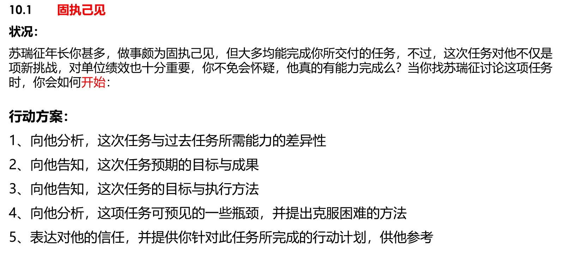

==正确答案：2==

* 对于职场老兵，业务能力也很过硬的人，交代重要事情时除了强调预期的目标与结果外，就要给予充分的信任。

#### - 不被信任

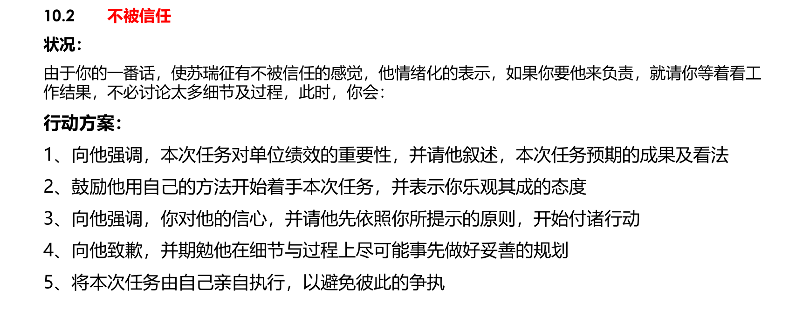

==正确答案：2==

* 既然任务交代出去了，就要充分的表达信任，鼓励对方做下去。

#### - 一些瑕疵

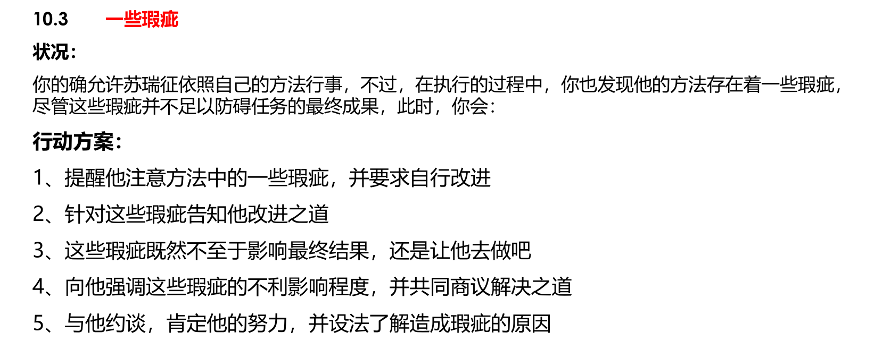

==正确答案：3==

* 不伤大雅的问题不要提出来，以免挫败下属的心情。
* 各种能力人才的培养方法
  * 新人——高指导、低支持
  * 有一定经验——高指导、低支持
  * 有较成熟的经验——高支持，低指导
  * 独当一面的选手——低支持、低指导

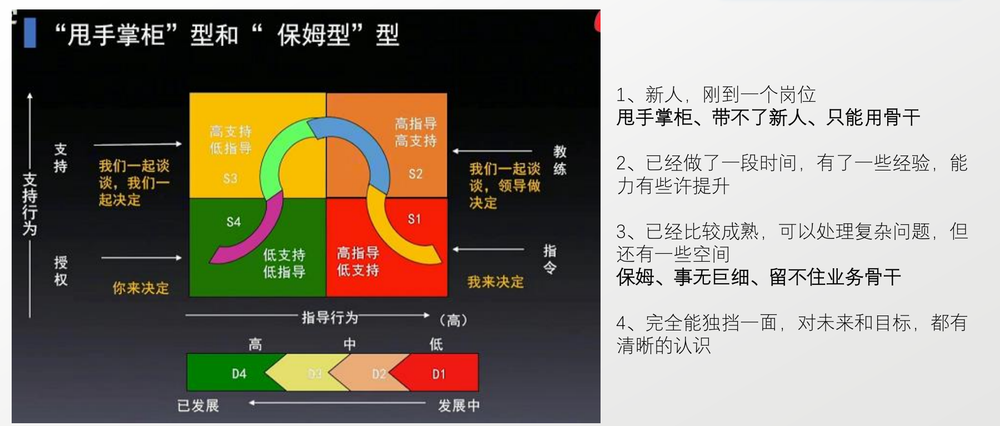

### 11. 如何选拔单位绩优人员

#### - 绩优人员

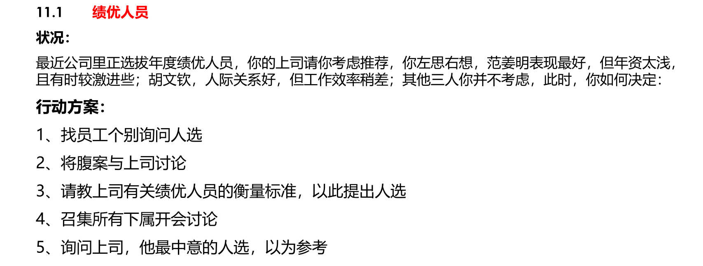

==正确答案：2==

* 拿方案与上司讨论，不要让上司替你做事情。
* 在方案没有完全确定下来不要和员工讨论，以免带来不必要的猜想

#### - 开会表决

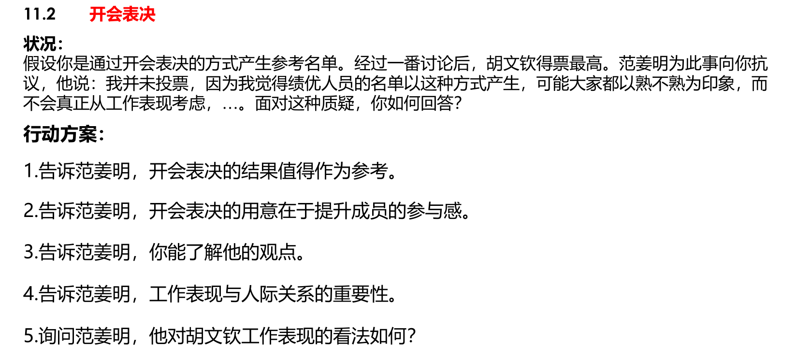

==正确答案：3==

* 在开会中，不要产生对峙
* 在开会中，下属表达反对意见后，领导只要表达知晓即可，不要进行评论和反驳。

#### - 议论纷纷

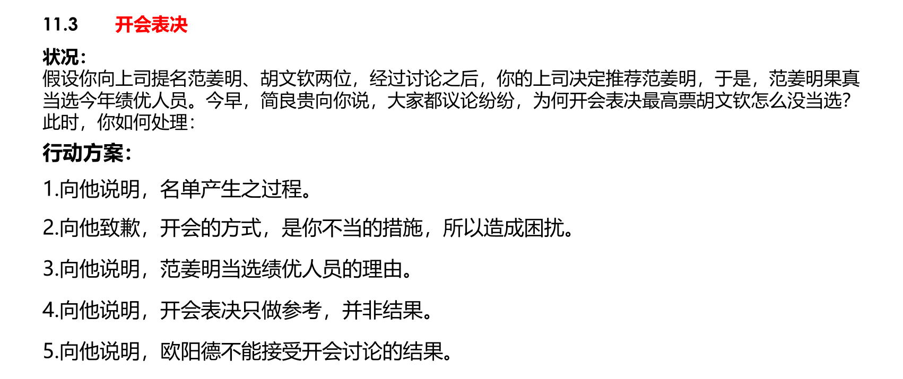

==正确答案：4==

* 针对上司的决定，给员工做适当的解释
* 不要让大家再议论纷纷下去
* 不要让公司和领导背锅