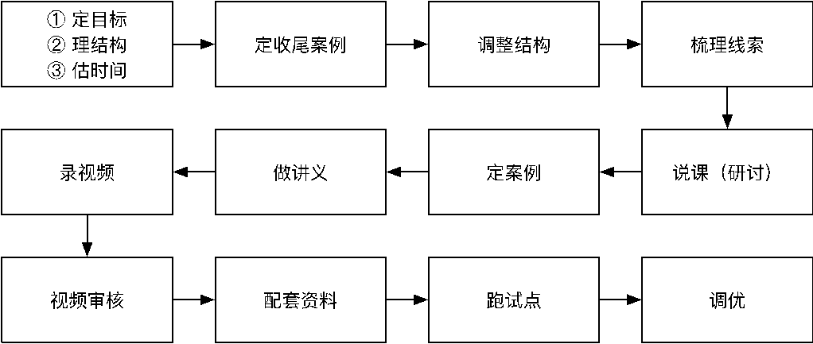

# 设计知识点

## 1.1 知识点的分类和结果

### 1）分类

* 什么是知识点？
  * 一个相对独立知识的基本单元。

* 知识点的作用是什么？
  * 学完之后能理解的概念或者练习之后能掌握的技能。
  * 通过概念提升认知能力。
  * 通过技能解决实际问题。
* 知识点有哪几种类型？
  * 讲解类：如：概念、发展历史等。
  * 代码类：如：语法、案例等。
  * 实操类：如：如软件、插件的安装等。

### 2）结果

#### （1）讲解类

​	知识点名称：XXX 的概念。

​	目标：能够理解 XXX 的概念，为之前 / 后续 XXX 的学习起到支撑……

​	视频：大多 1 个。

​	授课资料：PPT / 讲义。

​	作业：选择 / 填空。

#### （2）代码类

​	知识点名称：标签 / 选择器 / 语法名 / API / 案例……

​	目标：掌握 XXX 的基本使用，能够解决 XXX 问题 / 通过某案例强化对 XXX 的理解……

​	视频：大多不止 1 个。

​	授课资料：PPT / 讲义 / 代码。

​	作业：编程题。

#### （3）实操类

​	知识点名称：XXX 的安装 / 通过 XXX 实现 XXX。

​	目标：能够安装并使用 XXX，为后续 XXX 的学习提供支撑 / 能够完成 XXX 操作，实现 XXX 效果。

​	视频：大多 1 个。

​	授课资料：PPT / 讲义。

​	作业：学生要能够按照视频或讲义还原实操过程，并达成预期结果。

## 1.2 设计核心思路

**<u>以终为始</u>**

### 1）概念类

* 思考 —— 明确目标
  * 要让学生理解 / 知道什么？
  * 理解 / 知道这个有什么作用？
  * 是否属于抽象概念需要大量练习积累？
  * 如果需要大量练习，后续课程是否有足够的支撑？
* 素材准备—— 围绕目标找素材
  * 围绕着核心目标做准备不要跑偏，例如：从百度百科复制大段文本。
* 素材提炼 —— 对素材的提炼和萃取
  * 秒懂案例。
  * 配图或动画。

### 2）代码类

* 思考 —— 明确目标
  * 要让学生掌握什么技能？
  * 要让学生知道能够解决什么问题以及如何解决问题？
* 素材准备—— 围绕目标找素材
  * 代码的最终配套案例（验证结果达成并且没有跑偏），失败案例：水仙花数。
  * 代码的入门案例。
  * 代码的进阶案例（如果需要）。
* 素材检验
  * 代码是否违背一线实际开发场景（为了讲代码，教学生错经验是不能允许的）。
  * 代码的复杂度是否与学生当下的编码能力匹配？
  * 代码是否聚焦在知识点本身。
  * 代码是否有额外扩展？这些扩展是否有必要？是否会喧宾夺主？

### 3）实操类

* 思考 —— 明确目标
  * 要让学生具有什么样的环境以保证后续课程的学习？
  * 要让学生能够再现某些操作，达成什么效果（例如：Photoshop 切图）？
* 素材准备—— 围绕目标找素材
  * 下载地址。
  * 操作步骤。
  * 辅助工具。重要：需要特殊处理的软件，不要录制视频。
* 素材检验
  * 下载地址是否需有效？
  * 本机环境是否与最新版本一致？
  * 能否恢复到初始状态？
  * 操作步骤能否简化？有没有更优操作？
  * 有没有误操作的可能，操作过程中有没有注意事项？

## 1.3 设计流程

### 1）梳理结构

**<u>XMind—定目标，理结构，估时间</u>**

### 2）定收尾案例

**<u>验证目标达成，检查核心知识点覆盖。</u>**

### 3）调整结构

**<u>XMind — 调整结构，判断知识点对案例支撑</u>**

### 4）Excel 表格

**<u>Excel 表格 — 从用户视角梳理知识线索</u>**

* 掌握能力 — 学生是否需要？对成长是否有帮助？
* 掌握程度 
  * 知道：只要知道它是怎么样的概念、理论就够了，不需要对它进行更多的讨论。
  * 理解：不仅要知道概念，而且要知道来龙去脉。
  * 掌握：不仅要知道概念，而且要知道能解决什么问题，甚至要知道在出现不同场景时，能够灵活运用。
  * 应用：能够重复操作达成结果，或对某一个结论会用即可，而对这个概念本身的来龙去脉不做追究。

