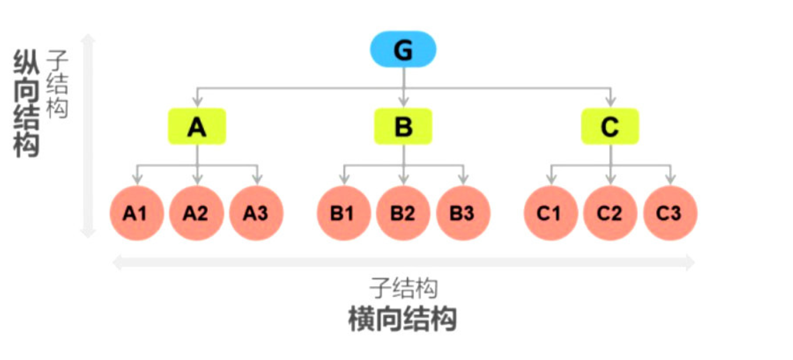
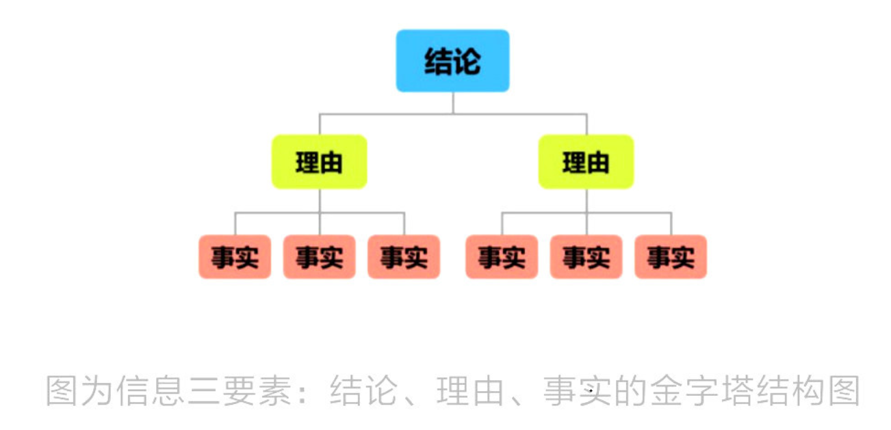
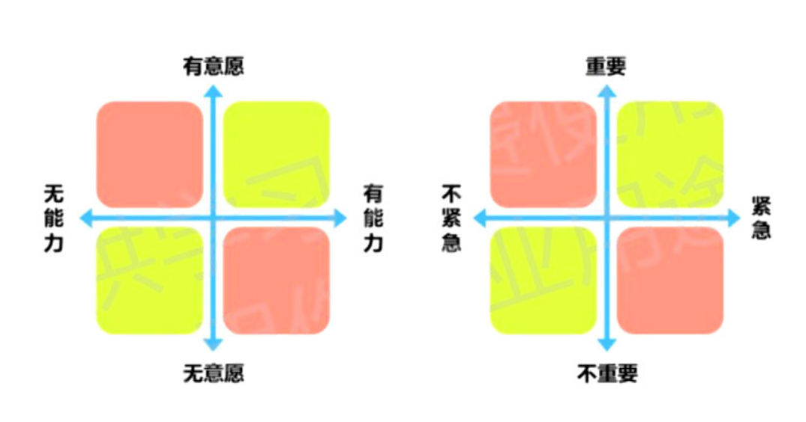
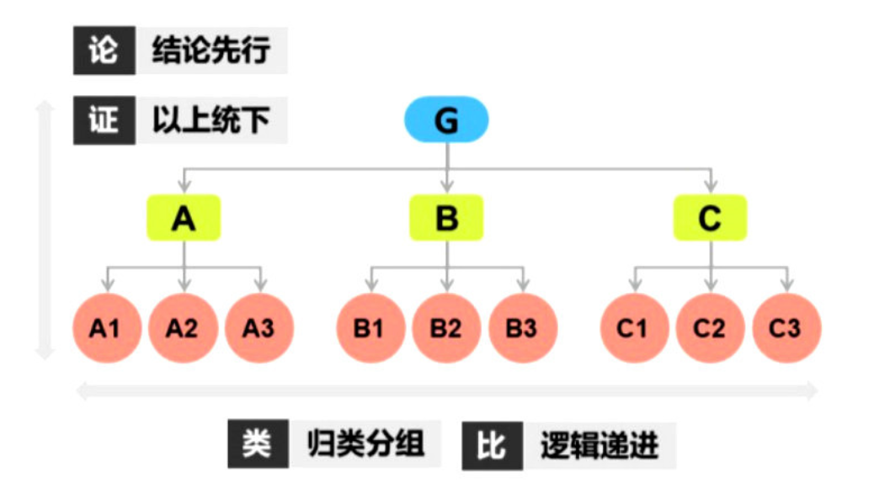

# 0. 为什么要学习结构化思维

* 我们的大脑一次性接受信息的量是有限的，它偏爱有规律的信息。
* 同样的内容，通过结构化思维，==有结构、有规律==地整理，将大大提高你的思考效率，让复杂问题瞬间变的非常容易。
* 无论做什么工作，都需要把事情想清楚、说明白，并能够有效地令对方信服。

# 1. 什么是结构化思维

* 结构化思维，简单来说，就是面对问题的时候你可以通过某种结构，把它拆解成一个个你能解决的部分。

* 结构化思维，就是一种从无序到有序的思考过程。

  

# 2. 怎样识别甄选信息

### 2.1 信息的分类

我们面对的信息往往有两种情况：

（1）有明确的目标，主动的获取信息，方法是找关键字。

（2）被动的接受大量复杂的信息，方法是结构化思维：==结论+理由+事实==

* ==结论：就是中心思想，对方阐述的观点。==

  * ① 通过关键字来定位结论；

    ​	**因此...**

    ​	**由此可知...**

    ​	**证明了...**

    ​	**所以...**

    ​	**表明...**

    ​	**我要说的重点是...**

    ​	**证明了...**

    ​	**问题的实质是...**

  * ② 关注信息中的关键位置开头和结尾；

  * ③ 面对面交谈，问问对方“所以呢”

* ==理由：判断一个结论是否有价值，首先要去观察这个结论是不是有理由支撑。关键字如下：==

  * 原因是...
  * 因为这个事实...
  * 有下列原因...
  * 鉴于...
  * 证据是...
  * 第一...第二...第三...

* ==事实：结论和理由都是主观的，那么事实一定是客观的==

  接受信息的时候，只有最后的事实是可靠的，并且用它来支撑前面的理由和结论的逻辑是顺畅的，那么接受的整个信息才是完整的。

### 2.2 如何判断信息真实性和可靠性

1. 要有客观实施来支撑结论和理由
2. 事实和理由，理由与结论之前要有证明和被证明的逻辑关系

# 3. 怎样归纳整理信息

归纳整理信息就是应用结构化思维进行横向拆解

人的大脑一次性接受信息的量是有限的，而大脑又有自动将某些具有共同特点的事务进行归类和重组的能力。

如何对信息进行分类？一个通用的法则是MECE——“相互独立、完全穷尽”

面对一大堆信息时候，就可以尝试用MECE法则先穷尽要素，再分析清楚。

MECE的5种分类法：

1. ==二分法：==A和非A；举例：国内和国外、他人和自己、已婚和未婚、成年人和未成年人

2. ==过程法：==按照事情发展的时间、流程、程序，对信息进行逐一分类；举例：解决问题的6个步骤、达成目标的3个阶

3. ==要素法：==把一个整体分成不同的构成部分，可以从上到下，从外到内，从整体到局部。举例：优秀员工的7种品质、公司组织架构图等等

4. ==公式法：==可以按照公式设计的要素去分类。举例：销售额 = 单价 x 数量

5. ==矩阵法：==通过2个维度（比如：重要和紧急）进行二分法

   

# 4. 怎样提炼信息结论

结论就是有思想的主题句。

如何根据已有的信息素材去提炼概括结论呢？一种是归纳法；一种是演绎法。

## 1）归纳法

从特殊到一般的思维方式，也就是根据许多个事务的特殊性来概括出同类事务的特征、共性。

> 喜鹊是鸟，喜鹊会飞。
>
> 乌鸦是鸟，乌鸦会飞。
>
> 结论：凡事鸟都会飞

注意：归纳法一定要确保你说罗列的要点是穷尽的。否则，得出的结论就有可能不是正确的。

> 鸵鸟也是鸟，但是鸵鸟就不会飞。

使用MECE法则穷尽要点。

找共性一种有两种方法，分别是描述性概括和行动行概括。

* 描述性概括

  找出事物属性上的共同点。

* 行动性概括

  找出事件结果的共性。

==一个好的结论，可能是两种找共性方法的结合。先找到事物本身的共性，再通过总结事物发展的结论，找到一个完整有意义的结论信息。==

注意：

1. 不要只罗列了细节，没有进行任何概括总结
2. 错误将一个子结论误认为是真结论
3. 多问一句："所以呢？"，直到这个结论再也不能问出“所以”是什么。

## 2）演绎法

演绎推理就是大家比较熟悉的亚里士多德的三段论演绎法，把思维的这个推演结构分为大前提、小前提和结论。

> 大前提：所有人都会死；==事实==
>
> 小前提：苏格拉底是人；==规律==
>
> 结论：苏格拉底一定会死；==结论==

这其实是一种由一般到特殊的思维方式，它的核心就是将某一个事实与对应的某个规律联系起来，得出结论。

所以，当你尝试去说服别人的时候，使用演绎法提炼结论的方式会非常的适用。

注意：

1. 大前提，一定要满足无可争议这个条件，否则说服就无法达到效果。
2. 小前提，最好是一个已经发生的事实。
3. 大前提不能是主观判断。
4. 大前提罗列特别冗长的信息，听着没有耐心，罗列要素时尽量不要超过3项。

# 5. 怎样清晰表达信息

沟通的时候，不知道对方想说什么，意思其实是，“不知道对方表达的结论是什么”

清晰表达四原则：论、证、类、比。

* 论：结论先行。一次表达只支撑一个思想，最好能够出现在开头。
* 证：以上统下。任何一个层次的要点都必须是它下一个层次要点的总结概括，直到最后一个层级的内容是客观事实或者数据
* 类：归类分组。每一组要点必须要属于同一个范畴。
* 比：逻辑递进。每个要点都需要按照一定的逻辑顺序进行排列。

==有结构的表达就是以结论为开头，层层论证结论，最后再强化结论的过程。==

> 一两秒钟的时间，只需要说结论
>
> 一分钟的时间，说到金字塔的第二层，即支撑结论的原因
>
> 两到三分钟，按照完整表达金字塔结构

==重要事情说三点，一太少、二不够，三正好。==